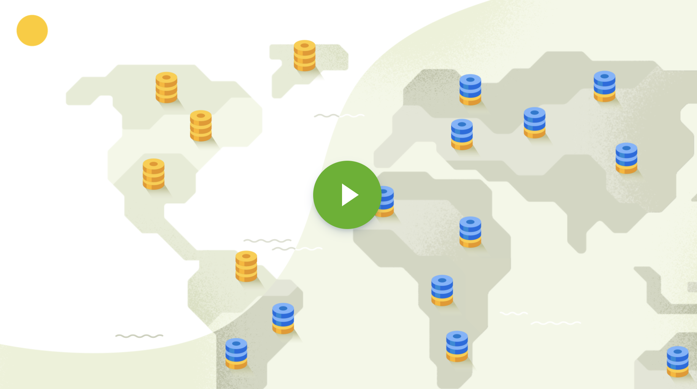

  

---

CockroachDB is a cloud-native distributed SQL database designed to build, 
scale, and manage modern, data-intensive applications.

- [What is CockroachDB?](#what-is-cockroachdb)
- [Docs](#docs)
- [Starting with Cockroach Cloud](#starting-with-cockroachcloud)
- [Starting with CockroachDB](#starting-with-cockroachdb)
- [Client Drivers](#client-drivers)
- [Deployment](#deployment)
- [Need Help?](#need-help)
- [Contributing](#contributing)
- [Design](#design)
- [Comparison with Other Databases](#comparison-with-other-databases)
- [See Also](#see-also)

## What is CockroachDB?

CockroachDB is a distributed SQL database built on a transactional and
strongly-consistent key-value store. It **scales** horizontally;
**survives** disk, machine, rack, and even datacenter failures with
minimal latency disruption and no manual intervention; supports
**strongly-consistent** ACID transactions; and provides a familiar
**SQL** API for structuring, manipulating, and querying data.

For more details, see our [FAQ](https://cockroachlabs.com/docs/stable/frequently-asked-questions.html) or [architecture document](
https://www.cockroachlabs.com/docs/stable/architecture/overview.html).

  

## Docs

For guidance on installation, development, deployment, and administration, see our [User Documentation](https://cockroachlabs.com/docs/stable/).

## Starting with CockroachCloud

We can run CockroachDB for you, so you don't have to run your own cluster.

See our online documentation: [Quickstart with CockroachCloud](https://www.cockroachlabs.com/docs/cockroachcloud/quickstart.html)

## Starting with CockroachDB

1. Install CockroachDB:  [using a pre-built executable](https://www.cockroachlabs.com/docs/stable/install-cockroachdb.html) or [build it from source](https://www.cockroachlabs.com/docs/v21.1/install-cockroachdb-linux#build-from-source).
2. [Start a local cluster](https://www.cockroachlabs.com/docs/stable/start-a-local-cluster.html) and connect to it via the [built-in SQL client](https://www.cockroachlabs.com/docs/stable/use-the-built-in-sql-client.html).
3. [Learn more about CockroachDB SQL](https://www.cockroachlabs.com/docs/stable/learn-cockroachdb-sql.html).
4. Use a PostgreSQL-compatible driver or ORM to [build an app with CockroachDB](https://www.cockroachlabs.com/docs/stable/hello-world-example-apps.html).
5. [Explore core features](https://www.cockroachlabs.com/docs/stable/demo-data-replication.html), such as data replication, automatic rebalancing, and fault tolerance and recovery.

## Client Drivers

CockroachDB supports the PostgreSQL wire protocol, so you can use any available PostgreSQL client drivers to connect from various languages.

- For recommended drivers that we've tested, see [Install Client Drivers](https://www.cockroachlabs.com/docs/stable/install-client-drivers.html).
- For tutorials using these drivers, as well as supported ORMs, see [Build an App with CockroachDB](https://www.cockroachlabs.com/docs/stable/build-an-app-with-cockroachdb.html).

## Deployment

- [CockroachCloud](https://www.cockroachlabs.com/docs/cockroachcloud/quickstart) - Steps to create a [free CockroachCloud cluster](https://cockroachlabs.cloud/signup?referralId=githubquickstart) on your preferred Cloud platform.
- [Manual](https://www.cockroachlabs.com/docs/stable/manual-deployment.html) - Steps to deploy a CockroachDB cluster manually on multiple machines.
- [Cloud](https://www.cockroachlabs.com/docs/stable/cloud-deployment.html) - Guides for deploying CockroachDB on various cloud platforms.
- [Orchestration](https://www.cockroachlabs.com/docs/stable/orchestration.html) - Guides for running CockroachDB with popular open-source orchestration systems.

## Need Help?

- [CockroachDB Community Slack](https://go.crdb.dev/p/slack) - Join our slack to connect with our engineers and other users running CockroachDB.
- [CockroachDB Forum](https://forum.cockroachlabs.com/) and [Stack Overflow](https://stackoverflow.com/questions/tagged/cockroachdb) - Ask questions, find answers, and help other users.
- [Troubleshooting documentation](https://www.cockroachlabs.com/docs/stable/troubleshooting-overview.html) - Learn how to troubleshoot common errors, cluster setup, and SQL query behavior.
- For filing bugs, suggesting improvements, or requesting new features, help us out by [opening an issue](https://github.com/cockroachdb/cockroach/issues/new).

## Building from source

See [our wiki](https://wiki.crdb.io/wiki/spaces/CRDB/pages/181338446/Getting+and+building+from+source) for more details.

## Contributing

We welcome your contributions! If you're looking for issues to work on, try looking at the [good first issue list](https://github.com/cockroachdb/cockroach/issues?q=is%3Aopen+is%3Aissue+label%3A%22good+first+issue%22). We do our best to tag issues suitable for new external contributors with that label, so it's a great way to find something you can help with!

See [our wiki](https://wiki.crdb.io/wiki/spaces/CRDB/pages/73204033/Contributing+to+CockroachDB) for more details.

Engineering discussions take place on our public mailing list, [cockroach-db@googlegroups.com](https://groups.google.com/forum/#!forum/cockroach-db). Also please join our [Community Slack](https://go.crdb.dev/p/slack) (there's a dedicated #contributors channel!) to ask questions, discuss your ideas, and connect with other contributors.

## Design

For an in-depth discussion of the CockroachDB architecture, see our
[Architecture
Guide](https://www.cockroachlabs.com/docs/stable/architecture/overview.html).
For the original design motivation, see our [design
doc](https://github.com/cockroachdb/cockroach/blob/master/docs/design.md).

## Licensing

Current CockroachDB code is released under a combination of two licenses, the [Business Source License (BSL)](https://www.cockroachlabs.com/docs/stable/licensing.html#bsl) and the [Cockroach Community License (CCL)](https://www.cockroachlabs.com/docs/stable/licensing.html#ccl-free).

When contributing to a CockroachDB feature, you can find the relevant license in the comments at the top of each file.

For more information, see the [Licensing FAQs](https://www.cockroachlabs.com/docs/stable/licensing-faqs.html).

## Comparison with Other Databases

To see how key features of CockroachDB stack up against other databases,
check out [CockroachDB in Comparison](https://www.cockroachlabs.com/docs/stable/cockroachdb-in-comparison.html).

## See Also

- [Tech Talks](https://www.cockroachlabs.com/community/tech-talks/) (by CockroachDB founders, engineers, and customers!)
- [CockroachDB User Documentation](https://cockroachlabs.com/docs/stable/)
- [The CockroachDB Blog](https://www.cockroachlabs.com/blog/)
- Key design documents
  - [Serializable, Lockless, Distributed: Isolation in CockroachDB](https://www.cockroachlabs.com/blog/serializable-lockless-distributed-isolation-cockroachdb/)
  - [Consensus, Made Thrive](https://www.cockroachlabs.com/blog/consensus-made-thrive/)
  - [Trust, But Verify: How CockroachDB Checks Replication](https://www.cockroachlabs.com/blog/trust-but-verify-cockroachdb-checks-replication/)
  - [Living Without Atomic Clocks](https://www.cockroachlabs.com/blog/living-without-atomic-clocks/)
  - [The CockroachDB Architecture Document](https://github.com/cockroachdb/cockroach/blob/master/docs/design.md)
