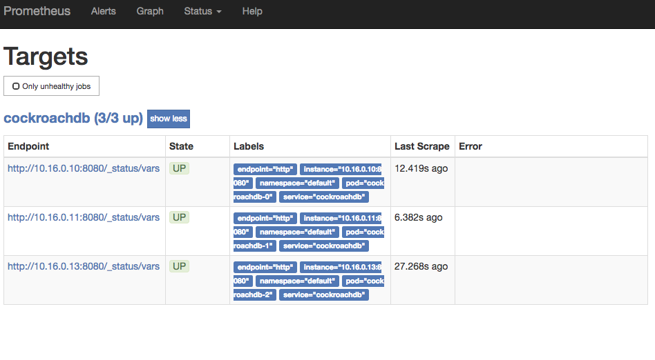
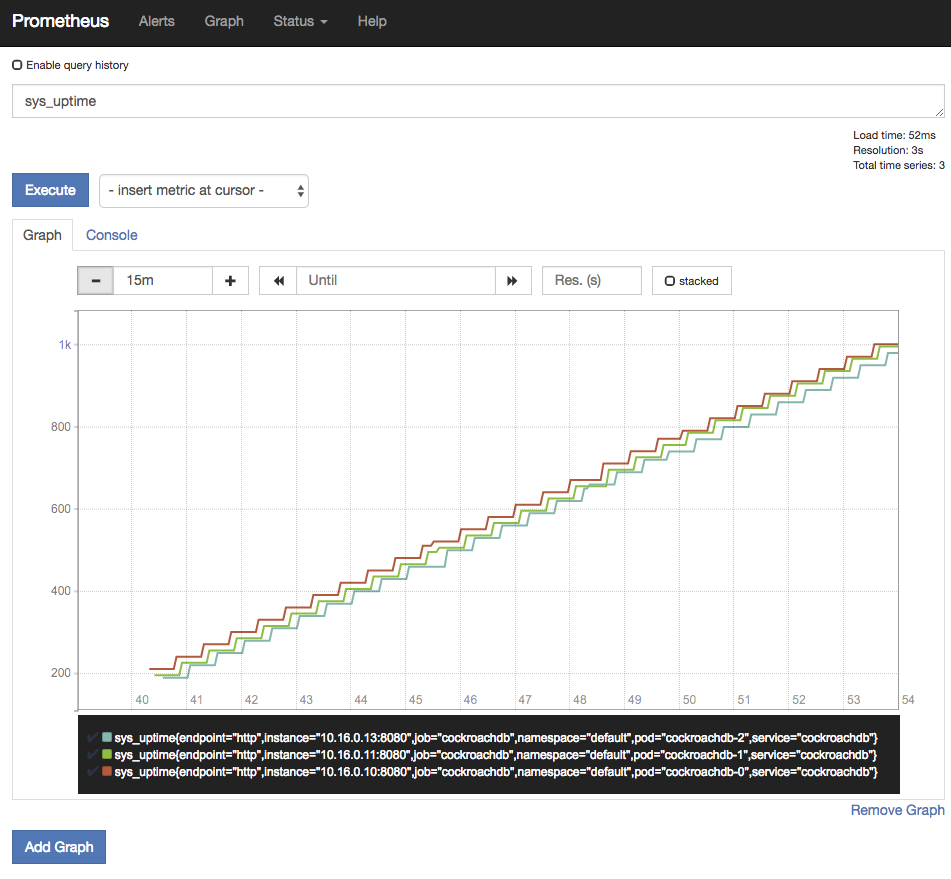
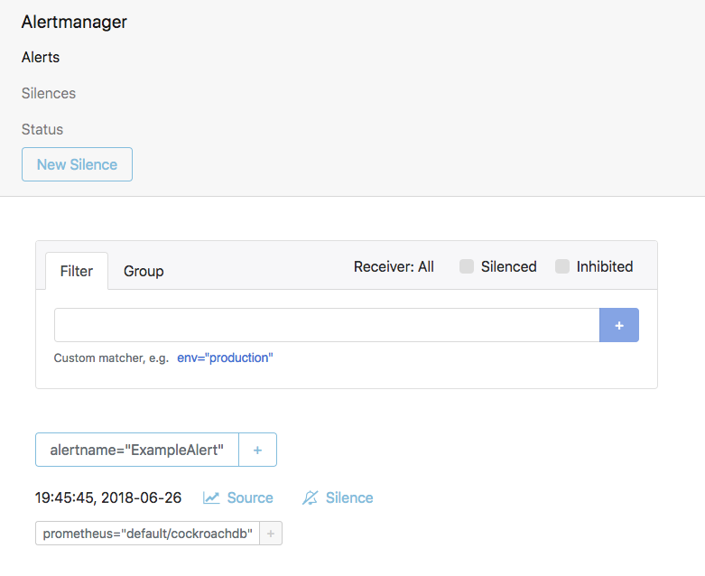
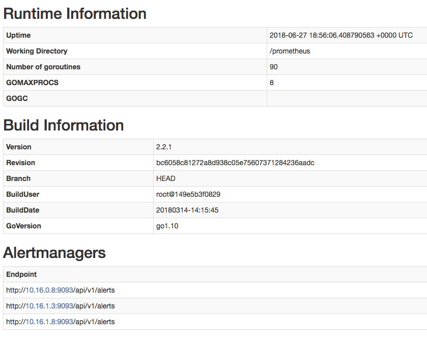
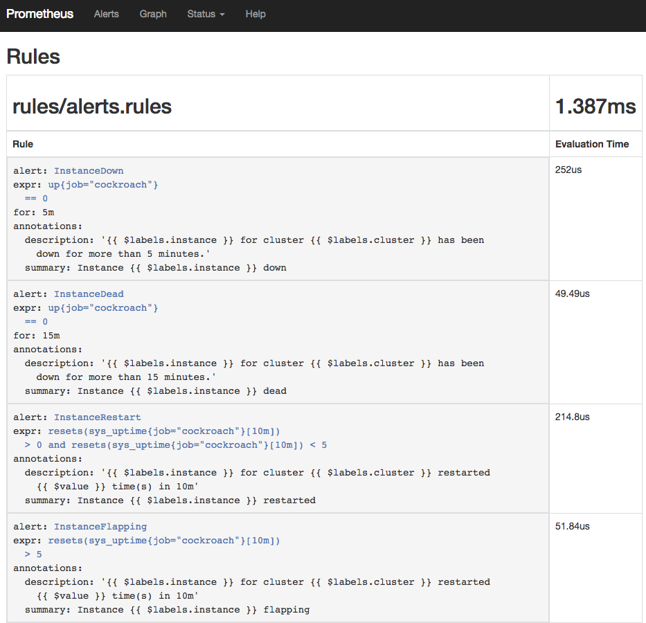
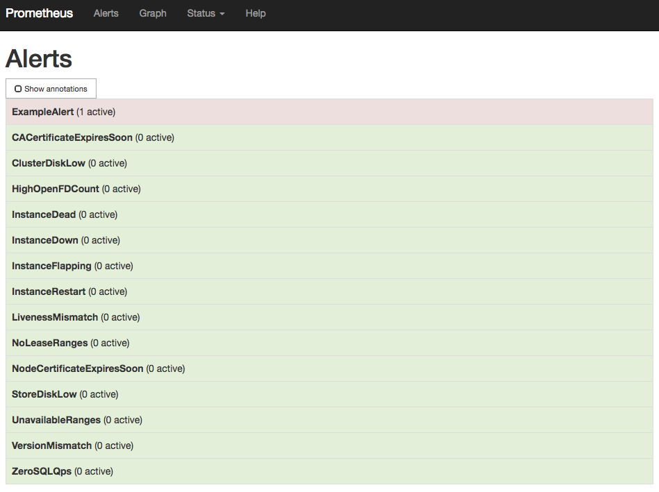

This guide is based on using CoreOS's Prometheus Operator, which allows
a Prometheus instance to be managed using native Kubernetes concepts.


References used:
* https://github.com/coreos/prometheus-operator/blob/master/Documentation/user-guides/getting-started.md
* https://github.com/coreos/prometheus-operator/blob/master/Documentation/user-guides/alerting.md

# Preflight

Create and initialize a Cockroach cluster, if you haven't already done
so:
* `kubectl apply -f
https://raw.githubusercontent.com/cockroachdb/cockroach/master/cloud/kubernetes/cockroachdb-statefulset.yaml`
* `kubectl apply -f
https://raw.githubusercontent.com/cockroachdb/cockroach/master/cloud/kubernetes/cluster-init.yaml`


If you're running on Google Kubernetes Engine, it's necessary to ensure
that your Kubernetes user is part of the cluster-admin groups.  Edit the
following command before running it; the email address should be
whatever account you use to access GKE.  This is required, regardless
of whether or not you are using a secure CockroachDB cluster.
* `kubectl create clusterrolebinding $USER-cluster-admin-binding
--clusterrole=cluster-admin --user=YOU@YOURDOMAIN.COM`

# Monitoring

Edit the cockroachdb service to add the label `prometheus: cockroachdb`.
We use this because we don't want to duplicate the monitoring data
between the two services that we create.  If we don't have a way to
distinguish the `cockroachdb` and `cockroachdb-public` services from
one another, we'd have two different prometheus jobs that had duplicated
backends.
* `kubectl label svc cockroachdb prometheus=cockroachdb`

Check for the latest Prometheus Operator 
[release version](https://github.com/prometheus-operator/prometheus-operator/blob/master/RELEASE.md). 
Specify the version number in the below command.

Install Prometheus Operator:
* `kubectl apply -f
https://raw.githubusercontent.com/prometheus-operator/prometheus-operator/v0.47.1/bundle.yaml`

Ensure that the instance of prometheus-operator has started before
continuing.  The `kubectl get` command and its desired output is below:
```
$ kubectl get deploy prometheus-operator
NAME                  DESIRED   CURRENT   UP-TO-DATE   AVAILABLE   AGE
prometheus-operator   1         1         1            1           23h
```

Create the various objects necessary to run a prometheus instance:
* `kubectl apply -f prometheus.yaml`

To view the Prometheus UI locally:
* `kubectl port-forward
prometheus-cockroachdb-0 9090`
* Open http://localhost:9090 in your browser.
* Select the `Status -> Targets` menu entry to verify that the
  CockroachDB instances have been located.
  
* Graphing the `sys_uptime` variable will verify that data is being
  collected. 


# Alerting

Edit the template `alertmanager.yaml` with your relevant configuration.
What's in the file has a dummy web hook, per the prometheus-operator
alerting guide linked from the top of the document.

Upload `alertmanager-config.yaml`, renaming it to `alertmanager.yaml`
in the process, and labelling it to make it easier to find.
* `kubectl create secret generic
alertmanager-cockroachdb --from-file=alertmanager.yaml=alertmanager-config.yaml`
* `kubectl label secret  alertmanager-cockroachdb app=cockroachdb`

It's critical that the name of the secret and the `alertmanager.yaml`
are given exactly as shown.

Create an AlertManager object to run a replicated AlertManager instance
and create a ClusterIP service so that Prometheus can forward alerts:
* `kubectl apply -f alertmanager.yaml`


Verify that AlertManager is running:
* `kubectl port-forward alertmanager-cockroachdb-0  9093`
* Open http://localhost:9093 in your browser.  You should see something
  similar to the following:
  
* Ensure that the AlertManagers are visible to Prometheus by checking
  http://localhost:9090/status.  It may take a minute for the configuration
  changes to propagate.  If this is successful, you should see something
  similar to the following:
  


Upload alert rules:
*  These are copied from https://github.com/cockroachdb/cockroach/blob/master/monitoring/rules/alerts.rules.yml:
* `kubectl apply -f alert-rules.yaml`
* Check that the rules are visible to Prometheus by opening
  http://localhost:9090/rules.  It may take a minute for the configuration
  changes to propagate. 
* Verify that the example alert is firing by opening
  http://localhost:9090/rules 
* Remove the example alert by running
  `kubectl edit prometheusrules prometheus-cockroachdb-rules` and
  deleting the `dummy.rules` block.

# Cleaning Up

You can remove the monitoring configurations using the following command:

`kubectl delete Alertmanager,Prometheus,PrometheusRule,ServiceMonitor -l app=cockroachdb`

# Maintenance

The contents of `alert-rules.yaml` are generated from our reference
prometheus configs, located in the top-level `cockroach/monitoring`
directory.  A `wraprules` tool exists to make maintaining this easier.

```
go get github.com/cockroachdb/cockroach/pkg/cmd/wraprules
wraprules -o path/to/alert-rules.yaml path/to/cockroach/monitoring/rules/*.rules.yml
```
