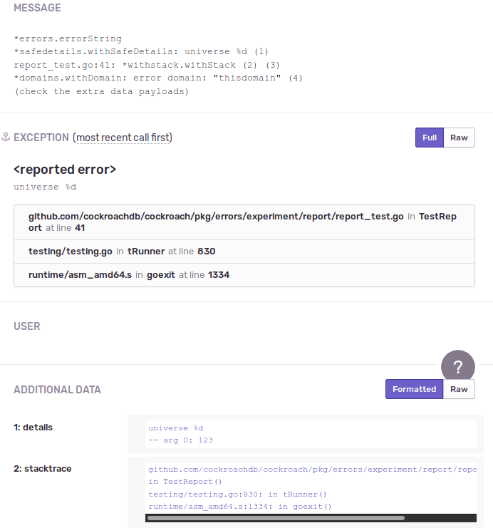

- Feature Name: Error handling
- Status: completed
- Start Date: 2019-03-18
- Authors: knz
- RFC PR: [#36987](https://github.com/cockroachdb/cockroach/pull/36987)
- Cockroach Issue: [#35854](https://github.com/cockroachdb/cockroach/issues/35854)
  [#36918](https://github.com/cockroachdb/cockroach/issues/36918)
  [#24108](https://github.com/cockroachdb/cockroach/issues/24108)

# Summary

This RFC explains how our requirements for error handling have grown
over time and how the various code patterns currently in use in
CockroachDB are inadequate.

It then proposes a new library of error types. This library is
compatible with the `error` interface, including the upcoming [Go 2
semantics](Go-error-handling-v2-). Additionally:

- it provides `Wrap` primitives akin to those found in
  `github.com/pkg/errors`.
- it is compatible with both the `causer` interface (`Cause() error`) from
  `github.com/pkg/errors` and the `Wrapper` interface (`Unwrap() error`) from Go 2.
- it preserves the entire structure of errors across the wire (using
  protobuf encoding).
- it enables fast, reliable and secure determination of whether
  a particular cause is present (not relying on the presence of a substring in the error message).
- it preserves reportable details void of PII using the same
  infrastructure as the `log` package (`log.Safe`).
- it provides "sane" handling of assertion errors, in a way
  that properly masks the presence of particular causes.
- it is composable, which makes it extensible with additional error annotations;
  for example, the basic functionality has PostgreSQL error codes
  as an opt-in component, and examples are provided below on
  how to extend it with the capture of logging tags and
  HTTP error codes.

The library is also upward-compatible from current uses of `roachpb`
errors and `github.com/pkg/errors`: errors of these types can be
converted "after the fact" to the new structured error types and their
details are preserved. This makes it possible to introduce the new
library gradually without having to rewrite all the code at once.

The expected benefits include:

- better learnability for new contributors;
- easier maintainability;
- less vulnerability to string injection (better security);
- richer details reported to telemetry for "serious errors";
- more details available for troubleshooting unexpected errors in tests.

Note: [PR
#37121](https://github.com/cockroachdb/cockroach/pull/37121) and [https://github.com/cockroachdb/errors](https://github.com/cockroachdb/errors) contain code
that prototype/demonstrates this RFC. The reader is invited to peruse
that code to complement the reading.  An [early prototype had been
implemented earlier in PR
#36023](https://github.com/cockroachdb/cockroach/pull/36023) however
the ideas in there were confused and should not be considered further.

Table of contents:

- [Motivation](#Motivation)
- [Guide-level explanation](#Guide-level-explanation)
- [Reference-level explanation](#Reference-level-explanation)
  - [Detailed design](#Detailed-design)
    - [Cross-version compatibility](#Cross-version-compatibility)
    - [Implementation strategy](#Implementation-strategy)
  - [Drawbacks](#Drawbacks)
  - [Rationale and Alternatives](#Rationale-and-Alternatives)
  - [Unresolved questions](#Unresolved-questions)
- [Appendices](#Appendices)
  - [Problematic error use cases](#Problematic-error-use-cases)
  - [Error handling outside of CockroachDB](#Error-handling-outside-of-CockroachDB)

# Motivation

- [Too much diversity](#Too-much-diversity)
- [Unreliable "standard" ways to inspect errors](#Unreliable-standard-ways-to-inspect-errors)
  - [Vulnerability to embedded application strings](#Vulnerability-to-embedded-application-strings)
  - [Improper/unsafe testing of intermediate causes](#Improper-unsafe-testing-of-intermediate-causes)
  - [Excessively loose coupling](#Excessively-loose-coupling)
  - [Mismatched audiences: code vs humans](#Mismatched-audiences-code-vs-humans)
- [Unreliable reliance on the pg error code](#Unreliable-reliance-on-the-pg-error-code)
- [Blindness to error causes in telemetry](#Blindness-to-error-causes-in-telemetry)
- [Barrier errors with debugging details](#Barrier-errors-with-debugging-details)
- [Stack traces for troubleshooting](#Stack-traces-for-troubleshooting)
- [Unexpected errors encoutnered while handling other errors](#Unexpected-errors-encountered-while-handling-other-errors)
- [Ignored, potentially important errors](#Ignored-potentially-important-errors)
- [Motivation for a new error library: summary](#Motivation-for-a-new-error-library-summary)

## Too much diversity

There are currently [5 different error handling
"protocols"](#Current-error-handling-in-CockroachDB) inside CockroachDB, including a
mix of CockroachDB-specific error types and multiple 3rd party error
packages.

This diversity makes the code difficult to approach for newcomers, and
difficult to maintain. One has to always remember "which errors should
I use in which context?"

## Unreliable "standard" ways to inspect errors

Go provides 4 "idiomatic" ways to inspect errors:

1. reference comparison to global objects, e.g. `err == io.EOF`
2. type assertions to known error types, e.g. `err.(*os.PathError)`
3. predicate provided by library, e.g. `os.IsNotExists(err)`
4. string comparison on the result of `err.Error()`

Method 1 breaks down when using wrapped errors, or when transferring
errors over the network. See instances in section [Suspicious
comparisons of the error
object](#Suspicious-comparisons-of-the-error-object).

Method 2 breaks down if the error object is converted to a different
type, as happens currently in CockroachDB when a non-`roachpb` error
is transferred through the network. When wire representations *are*
available, the method is generally reliable; however, if errors are
implemented as a chain of causes, care should be taken to perform the
test on all the intermediate levels. See instances in section
[Suspicious assertions on the error
type](#Suspicious-assertions-on-the-error-type).

Method 3 is generally reliable although the predicates in the standard
library obviously do not know about any additional custom types. Also,
the implementation of the predicate method can be cumbersome if one
must test errors from multiple packages (dependency cycles). Also, the
method loses its reliability if the predicate itself relies on one of
the other methods in a way that's unreliable. For example, the current
predicates in CockroachDB's `sqlbase` package are defective in this
way. See [Suspicious error predicates](#Suspicious-error-predicates).

Method 4 is the most problematic and unfortunately has been used
pervasively inside CockroachDB. It has several sub-problems, detailed
in the following sub-sections. See also the section [Suspicious
comparisons of the error
message](#Suspicious-comparisons-of-the-error-message) at the end for
the list of suspicious cases in the code.

### Vulnerability to embedded application strings

The main problem with comparing an error message to some reference
string is that the reference can appear in one of the application
values embedded inside the error. For example, consider the error
produced thus:

```
root@127.0.0.1:34312/defaultdb> select 'connection reset by peer'::int;
pq: could not parse "connection reset by peer" as type int: strconv.ParseInt: parsing "connection reset by peer": invalid syntax
```

And the test in `pgwire/pgerror/errors.go` function
`IsSQLRetryableError()` which merely checks whether the error contains
the string `"connection reset by peer"`. This method would return
`true` in that case, whereas the error is not retriable.

This problem is in fact a form of *bad value injection* and creates a
vector by which a remote user can misuse the internals of CockroachDB
(a security vulnerability).

**In general, string comparisons on error messages are vulnerable to
injection and can even cause security problems.**

### Improper/unsafe testing of intermediate causes

When, say, a retry error happens while handling a duplicate insertion error,
we want a quick way to determine the error is retryable.

Testing whether the entire error message contains some reference
string can work but is neither fast nor reliable (see previous section).

In the (relatively uncommon case) of a constant string prefix, one can
rely on exact matches to the first argument provided to
`errors.Wrap`. In that case, the prefix provided as 2nd
argument to `errors.Wrap()` can be extracted as follows:

1. `s1 := err.Error()`
2. `s2 := err.Cause().Error()`
3. `prefix_message := s1[:len(s2)-len(s1)]` (only if `strings.HasSuffix(s1, s2)` is true)

This provides precise extraction of intermediate layers, at the
expense of performance.

Moreover, this technique is currently not used anywhere in
CockroachDB.

### Excessively loose coupling

Consider the following code sample:

```
pkg/sql/schema_changer.go:      if strings.Contains(err.Error(), "must be after replica GC threshold") {
```

This implicitly refers to this error:

```
pkg/roachpb/errors.go:func (e *BatchTimestampBeforeGCError) message(_ *Error) string {
pkg/roachpb/errors.go:  return fmt.Sprintf("batch timestamp %v must be after replica GC threshold %v", e.Timestamp, e.Threshold)
```

The problem here is that if a programmer modifies the text of the
error message in `roachpb`, there is no compile-time feedback to tell them
they should also update the code in the SQL schema changer.

In the lucky case, there might be a unit test that trips up,
but what this really needs is some way for the schema changer code to
ascertain the error was originally a
`roachpb.BatchTimestampBeforeGCError` object.

### Mismatched audiences: code vs humans

The choice to convey precise information via an error message, for subsequent
testing in code, may prevent further tuning of that message to become more helpful
to human users.

For example, consider the code in `replica_command.go` which does
different things depending on whether the error message indicates that
the store is "amost out of disk space" or "busy applying snapshots".

If (hypothetically) a product management study found out that users
find the distinction confusing and would be better satisfied by
merging the two errors into one message "store is too busy", the code
would need some heavy lifting to preserve the distinction in behavior.

**In general, error messages should be the domain of humans, and
precise information for internal use should be conveyed using
structural data — either separate types or dedicated structure
fields.**

## Unreliable reliance on the pg error code

PostgreSQL clients expect and use a 5-character "SQL state" also
called "pg error code".  These codes are grouped in broad categories
identified by the first two characters. The SQL wire protocol separates
the 5-character code from the rest of the error message.

Today CockroachDB's source code provides and uses pg codes
inconsistently:

- from the perspective of PostgreSQL clients, these codes are
  *informational* and (perhaps with the exception of `40001`) generally not required
  to uniquely and specifically describe a desired "next step" course of action
  by automated code.

  For example, `CodeUniqueViolationError` (`23505`) is meant to be
  produced when introducing a duplicate row in a unique index, however:
  - it is not guaranteed to be produced in every case (e.g. it can be
    "taken over" by `40001`),
  - or it can be produced by multiple situations that are only vaguely
    related (e.g. both a direct INSERT/UPSERT or an index backfill).

- some internal components inside CockroachDB have grown to require
  *precise* codes that uniquely identify particular situations.

  This happened because of the problem outlined in the previous
  section: the lack of reliable mechanism to test/identify
  intermediate error situations.

  For example, the code of `cockroach user` expects the creation of
  existing users to fail with `CodeDuplicateObjectError` (this is a
  bug, incidentally, since a duplicate user insert would fail with
  `CodeUniqueViolationError`, a different code).

  Another example is the code in `row_container.go` that expects
  "out of memory" errors from the `util/mon` package to appear
  as pg errors with code `CodeOutOfMemoryError`. It does not consider
  that a separate part of the source code could produce the same
  code *informationally* (towards SQL clients).

**In general, with the exception of certain "critical" codes (`40001`
and some of the `XX...` codes) the specific values of the pg code should never be
assumed to be precise nor used to determine further behavior inside
CockroachDB.**

See section [Suspicious reliance on the pg error
code](#suspicious-reliance-on-the-pg-error-code) for examples of
use of pg codes with mistaken assumptions.

## Blindness to error causes in telemetry

We want to report important errors to telemetry (Sentry) for further
research. However the report must be stripped of PII. We want error
objects that preserve the "safe" part of details available when the
error was produced or wrapped.

A mechanism to achieve this is already available in the `log` packages
for the sentry reports produced upon `log.Fatal`. The calling code can
enclose arguments to the call with `log.Safe` to indicate the argument
is suitable for shipping in a telemetry report. The format string (the
first argument) itself is also considered safe. This mechanism is
opt-in: we consider that any string is un-safe for reporting by
default.

Currently, all error objects in CockroachDB except for `pgerror.Error`
are unable to distinguish safe sub-strings and must thus be stripped
of all details when shipped to telemetry.

## Stack traces for troubleshooting

When an error becomes serious enough, we find it useful to find out
where in the code it was generated, and with which call stack.

For this purpose, the package `github.com/pkg/errors` helpfully embeds
the caller stack trace every time a root error is instantiated,
and every time an error is wrapped.

This stack trace is printed out upon formatting the error with `%+v`,
or, only for wrapped errors, can be extracted via the `StackTrace()` method.

The `pgerror.Error` object also captures:
- the first caller (file, line, function) in the `Source` field, always;
- stack traces when instantiated via the `AssertionFailedf` constructor
  or when wrapping another assertion error.

Unfortunately, stack traces are not collected for the other error types,
and the stack traces collected by `github.com/pkg/errors` are not
reported to telemetry.

## Barrier errors with debugging details

A common case is when some intermediate component *handles* some error
coming from another component, and presents a new error to its own
downstream clients.

For example, SQL translates KV conditional put errors into SQL "duplicate
errors".

When this occurs, the current code pattern is to "forget" the original
error and construct a new error with the desired type.

This is unfortunate, because in the occasional case when the new error triggers
a bug somewhere, we would like to inspect the details from the causal chain.

**In general, we need an error wrapping type which preserves all the details
of its cause(s) for troubleshooting, but eliminates all its semantic value.**

We will call such a type an "error barrier" in the rest of the RFC.

Currently `pgerror.NewAssertionFailureWithWrappedErrf` acts as an
error barrier and attempts to preserve many details of its cause, but
some details are lost. No other error mechanism in CockroachDB
successfully achieves the role of barrier.

Note: The [`xerror` package](#Go-113-xerrors) also implements/provides
barriers via its `Opaque()` constructor.

The [guide-level explanation on how barrier errors help with hiding
causes](#Hiding-the-cause-transforming-errors-with-barriers) below contains an example
that motivates barrier errors further (as well as the section after that).

## Unexpected errors encountered while handling other errors

Consider the following code sample from the schema changer:

```go
	err = sc.runStateMachineAndBackfill(ctx, &lease, evalCtx)
	// ...
	if isPermanentSchemaChangeError(err) {
		if err := sc.rollbackSchemaChange(...); err != nil {
			return err
		}
	}
```


This code is defective, because if `rollbackSchemaChange` fails, the
original `err` object is lost.

One can try to "fix" as follows:

```go
	if newErr := sc.rollbackSchemaChange(...); newErr != nil {
        return errors.Wrap(err, "while updating")
...
```

But then it's `newErr` that gets lost when `rollbackSchemaChange` fails.

We can try to "fix" as follows:

```go
	if newErr := sc.rollbackSchemaChange(...); newErr != nil {
        return errors.Wrapf(newErr, "while updating after insert error: %v", err)
...
```

This is slightly better, however if the `err` was structured, all
its structure is lost by string-ification into a message.  See also
the section [Suspicious flattening of
errors](#Suspicious-flattening-of-errors) for a list of potential
information loss in the current source code.

**In general, patterns of code like if-error-do-something-else need
structure that's richer than a simple linked list to preserve all the
error details, to aid troubleshooting.**

(We're not proposing to keep the additional error objects so that
*code* can inspect them—that is fraught with peril and is purposefully
kept out of scope here.)

## Ignored, potentially important errors

Consider this other aspect of the code from above:

```go
func (sc *SchemaChanger) rollbackSchemaChange(...	err error ...) {
	// ...
	if errPurge := sc.runStateMachineAndBackfill(ctx, lease, evalCtx); errPurge != nil {
		log.Warningf(ctx, "error purging mutation: %s, after error: %s", errPurge, err)
	}
```

There are several issues in here:

- if `err` or `errPurge` were "serious" errors (like disk corruption
  error), these should have been left to flow up in the execution
  machinery, to be picked up by the Sentry reporter and visible to
  clients.

  **In general, code that dismisses errors should use a whitelist of
  errors they know are benign and safe to ignore.**

- the `%s` formatter only prints the "message" part of error objects
  and loses all the detail.

  **In general, structured errors should be printed with all
  details.**

## Motivation for a new error library: summary

The requirements on error objects have grown over time.

- **Structured error causes.**
  When an error is raised in the context of handling another error, we want to remember the context.
  So we need a "decorator" object with a link to the original error.
  Moreover, to support the "if-error-do-something-else" pattern we need
  to be able to store more than one cause at a given level.

- **Wire format.**
  CockroachDB is a distributed system and errors can flow over the network. We want error objects
  that have a wire representation that preserves all the error details.

- **Safe telemetry details.**
  We want to report important errors to telemetry (Sentry) for further inspection. However
  the report must be stripped of PII. We want error objects that preserve the "safe" part
  of details available when the error was produced or wrapped.

- **Stack traces for troubleshooting.**
  The point where an error is handled and becomes worthy of debugging
  attention can be far away from the point it was generated. It is thus
  useful/desirable to enable embedding the caller stack trace in generated
  error objects. (As with pg error codes, this aspect is also composable.)
  Note that `github.com/pkg/errors` already systematically embeds
  stack traces, using a clever implementation trick to reduce the run-time
  cost. We'll aim to adopt this cleverness.

- **[Barrier error type](#Barrier-errors-with-debugging-details) with preservation of debugging details.**
  In certain cases we want to preserve the cause for troubleshooting
  but prevent the rest of the code from observing its semantic value.

- **pg error codes.**
  PostgreSQL clients expect and use a 5-character "SQL state" also called "pg error code".
  These codes are grouped in broad categories identified by the first two characters.
  An error object that ultimately flows to a SQL client must be able to provide a meaningful,
  relevant pg code. (Note: emphasis on *must be able* — this RFC does not mandate
  pg error codes on all error objects, and the solution proposed below clarifies that
  such error codes are opt-in.)

Several error packages and struct types are currently in use in CockroachDB.

**None of them satisfy all the requirements:**

| Error package/struct                           | Used in CockroachDB? | Structure         | Wire format | Safe telemetry details | Stack traces | Barrier with details | pg code |
|------------------------------------------------|----------------------|-------------------|-------------|------------------------|--------------|----------------------|---------|
| `golang.org/pkg/errors`, `errorString`         | Yes                  | (standalone)      | No          | No                     | No           | No                   | No      |
| `github.com/pkg/errors`, `fundamental`         | Yes                  | (standalone)      | No          | No                     | Yes          | No                   | No      |
| `github.com/pkg/errors`, `withMessage`         | Yes                  | linked list       | No          | No                     | No           | No                   | No      |
| `github.com/pkg/errors`, `withStack`           | Yes                  | linked list       | No          | No                     | Yes          | No                   | No      |
| `github.com/hashicorp/errwrap`, `wrappedError` | No                   | binary tree       | No          | No                     | No           | Yes                  | No      |
| `upspin.io/errors`, `Error`                    | No                   | linked list       | Yes         | Yes                    | No           | No                   | No      |
| Go 2 (presumably new types)                    | No                   | linked list       | No          | ?                      | ?            | No                   | No      |
| (CRDB) `roachpb.Error`                         | Yes                  | single leaf cause | Yes         | No                     | No           | No                   | No      |
| (CRDB) `distsqlpb.Error`                       | Yes                  | single leaf cause | Yes         | No                     | No           | No                   | Yes     |
| (CRDB) `pgerror.Error` (2.1/previous)          | Yes                  | (standalone)      | Yes         | Yes                    | Yes          | Yes                  | Yes     |
| (CRDB) proposed new `Error` object             | Not yet              | tree              | Yes         | Yes                    | Yes          | Yes                  | Yes     |

The table above can be further simplified as follows:

| Error package/struct                           | Structure | Wire format | Safe telemetry details | Stack traces | Barrier with details | pg code |
|------------------------------------------------|-----------|-------------|------------------------|--------------|----------------------|---------|
| `golang.org/pkg/errors`, `errorString`         | BAD       | BAD         | BAD                    | BAD          | BAD                  | BAD     |
| `github.com/pkg/errors`, `fundamental`         | BAD       | BAD         | BAD                    | good         | BAD                  | BAD     |
| `github.com/pkg/errors`, `withMessage`         | BAD       | BAD         | BAD                    | BAD          | BAD                  | BAD     |
| `github.com/pkg/errors`, `withStack`           | BAD       | BAD         | BAD                    | good         | BAD                  | BAD     |
| `github.com/hashicorp/errwrap`, `wrappedError` | good      | BAD         | BAD                    | BAD          | BAD                  | BAD     |
| `upspin.io/errors`, `Error`                    | BAD       | good        | good                   | BAD          | BAD                  | BAD     |
| Go 2 (presumably new types)                    | BAD       | BAD         | ?                      | ?            | BAD                  | BAD     |
| (CRDB) `roachpb.Error`                         | BAD       | good        | BAD                    | BAD          | BAD                  | BAD     |
| (CRDB) `distsqlpb.Error`                       | BAD       | good        | BAD                    | BAD          | BAD                  | good    |
| (CRDB) `pgerror.Error` (2.1/previous)          | BAD       | good        | good                   | good         | good                 | good    |
| (CRDB) proposed new error objects              | good      | good        | good                   | good         | good                 | good    |

This failure by the current code to meet all our requirements is the main motivation for this work.

# Guide-level explanation

The package is `github.com/cockroachdb/errors`.

See the included user documentation: https://github.com/cockroachdb/errors/blob/master/README.md

Table of contents:

- [Vocabulary](#Vocabulary)
- [Instantiating new errors](#Instantiating-new-errors)
- [Decorating existing errors](#Decorating-existing-errors)
- [Utility features](#Utility-features)
  - [Safe details](#Safe-details)
  - [PostgreSQL error code](#PostgreSQL-error-code)
  - [Additional error annotations](#Additional-error-annotations)
  - [Telemetry keys](#Telemetry-keys)
- [Handling chains of error causes](#Handling-chains-of-error-causes)
  - [Accessing the cause](#Accessing-the-cause)
  - [Preservation of causes across the wire](#Preservation-of-causes-across-the-wire)
  - [Identification of causes](#Identification-of-causes)
  - [Error equivalences](#Error-equivalences)
  - [Hiding the cause: transforming errors with barriers](#Hiding-the-cause-transforming-errors-with-barriers)
  - [Hiding the cause: assertion failures upon unexpected errors](#Hiding-the-cause-assertion-failures-upon-unexpected-errors)
  - [Capturing secondary errors for troubleshooting](#Capturing-secondary-errors-for-troubleshooting)
- [What comes out of an error?](#What-comes-out-of-an-error)
- [Composability and extensibility](#Composability-and-extensibility)
  - [Example: HTTP error codes](#Example-HTTP-error-codes)
  - [Example: adding `context`](#Example-adding-context)
  - [Discussion: how to best name new leaf/wrapper error types](#Discussion-how-to-best-name-new-leafwrapper-error-types)

## Vocabulary

The library separates the following two kinds of errors:

- *root* error types, also called *leaf types*, which implement the
  `error` interface but do not refer to another error as “cause”̛ via
  `Unwrap()` or `Cause()`.

- *wrapper* error types, which implement the `error` interface and
  also refer to another error as “cause” via `Unwrap()` (preferred) or
  `Cause()` (compat with `pkg/errors`).

## Instantiating new errors

Instantiating a new error can be as simple as `errors.New("hello")` or
`errors.Errorf("hello %s", "world")`. In fact, the proposed library is
drop-in *compatible* with the error types from the Go standard
library, `github.com/pkg/errors`.

The library is also compatible with existing protobuf error objects, so
instantiating, for example, with `err :=
&roachpb.RangeFeedRetryError{Reason: "hello"}` is also valid: the remaining
library facility ensures that it provides all its services
when provided a "naked" `roachpb` error as input.

## Decorating existing errors

Adding some words of context can be as simple as `errors.Wrap(err,
"hello")`.

The library understand wrappings using wrapper types from other
libraries (e.g. 3rd party dependencies) as long as they provide either
the `Cause()` or `Unwrap()` method to access their underlying error
object.

## Utility features

The following features are opt-in and can be used to enhance the
quality of error details included in telemetry or available for
troubleshooting.

### Safe details

In some cases errors are packaged and shipped to telemetry (Sentry)
for further investigation.  To ensure that no personally identifiable
information (PII) is leaked, most of the details of an error are
masked.

Only the pg code (if any) and stack trace(s) (if any) are shipped by default.

When using the formatting variants (`Newf`, `Wrapf` etc) from the
library, additionally the format string is shipped to telemetry,
together with the value of any subsequent positional argument
constructed using `log.Safe` from
`github.com/cockroachdb/cockroach/pkg/util/log` (aliased to
`errors.Safe` for convenience).

For example: `errors.Newf("hello %s", log.Safe("world"))` will
cause both the strings `hello %s` and `world` to become available
in telemetry details.

### PostgreSQL error code

To add a code useful to PostgreSQL clients, one can use
e.g. `errors.WithCandidateCode(err, pgcode.SyntaxError)`.

The code is called "candidate" because the algorithm
used to aggregate multiple candidates into a final code
via `GetPGCode()` is configurable.

### Additional error fields

As we learned while implementing the PostgreSQL protocol, it is useful
to equip error objects with additional annotations that are displayed
in a special way by network clients and provide additional contextual
information for human users.

In the proposed library, we provide the following two features:

- "details" annotations. This is used e.g. for syntax errors to print
  where in the input SQL string the error was found using ASCII art.

- "hint" annotations. This is used to suggest a course of action to
  the user. For example we use this to tell the user to search on
  Github or open an issue if they encounter an internal error or an
  error due to a feature in PostgreSQL that is not supported in
  CockroachDB.

In the proposed library, the postgres details can be added with e.g.
`errors.WithDetail(err, "some detail")`.

When multiple errors contain details, the detail strings are concatenated
to produce the final error packet sent to the SQL client.

The detail strings are not considered "safe" for reporting.

Similarly, hints can be added using `WithHint()`. Hints are not
considered safe for reporting either.

Note that although these additional annotations are directly useful to
PostgreSQL clients (since pg errors also support these annotations)
they are not specific to the PostgreSQL protocol and can be exploited
to enhance errors towards non-SQL applications.

See the [reference section on module
`hintdetail`](#hintdetail-User-friendly-hints-and-detail-strings)
below for more details.

### Telemetry keys

Throughout the SQL package (and presumably over time throughout
CockroachDB) errors can be annotated with "telemetry keys" to be
incremented when the error flows out of a server towards a client.

This is used to e.g. link errors to existing issues on Github.

The telemetry keys are stored in the error chain and can be retrieved
via the accessor `TelemetryKeys() []string`.

## Handling chains of error causes

### Accessing the cause

The error types in the library implement the `causer` interface and Go
2's `Wrapper` interface. It is thus possible to retrieve the layers of
cause via the `Cause()` or `Unwrap()` methods.

For convenience, the library provides two functions `UnwrapOnce(error)
error` and `UnwrapAll(error) error` that support both unwrapping
interfaces.

### Preservation of causes across the wire

The library contains grey magic that makes all error types, even those
coming from outside of the library, protobuf-encodable. The entire
cause structure of errors is preserved when transferred across the
network, regardless of the error and wrapper types used.

This magic also supports the following use case:

1. a crdb/encodable error is constructed;
2. it passes through some package which uses `errors.Wrap` (from `github.com/pkg/errors`, not the new library);
3. the resulting error is sent across the wire.

When this occurs, the library converts the
wrapper object from `github.com/pkg/errors` into a form that's
encodable, so as to preserve all the chain of causes and the
intermediate message prefixes added via `github.com/pkg/errors.Wrap()`.

See the [reference section on module
`errbase`](#errbase-Library-backbone-and-guarantees) for more details.

### Identification of causes

The preferred ways to determine whether an error has a particular cause are:

- the `errors.Is()` function, modeled after the [proposed function of the
  same name in Go 2](#Go-error-handling-v2-).
- the `errors.If()` function, provided until Go 2's generics become available
  and we can start to implement the `errors.As()` function.

The prototypes are:

```go
// Is returns true iff the error contains `reference` in any of its
// cause(s).
func Is(err error, reference error) bool

// If applies the predicate function to all the causes and returns
// what the predicate returns the
// first time the predicate returns `true` in its the second return value.
// If the predicate never returns `true`, the function returns `(nil, false)`.
func If(err error, predicate func(error) (interface{}, bool)) (interface{}, bool)
```

Example uses:

```go
  // Was:
  //
  //    if err == io.EOF { ...
  //
  if errors.Is(err, io.EOF) { ...
```

```go
  // Was:
  //
  //   if r, ok := errors.Cause(err).(*roachpb.RangeFeedRetryError); ok
  //
  if ri, ok := errors.If(err, func(err error) (interface{}, bool) {
    return err.(*roachpb.RangeFeedRetryError)
  }); ok {
     r := ri.(*roachpb.RangeFeedRetryError)
     ...
```

**Note that this facility behaves somewhat differently from Go's proposed `If` function:**

- it is able to recognize error causes after an error and its cause
  chain was transferred over the network. Go's `If` cannot do this.

- to achieve this, it does not only use reference equality to
  recognize causes. This entails an extension of Go's behavior, which
  is perhaps surprising: where Go's `If` would always fail on `If(err,
  &SomeErr{})`, the proposed library may succeed if it finds that the
  newly instantiated sentinel given as 2nd argument is *equivalent* to
  the given error. See the next section and the reference-level
  section [`markers`: Error equivalence and
  markers](#markers-Error-equivalence-and-markers) for details.

For convenience, `IsAny()` able to detect multiple types at once:

```go
// IsAny is like Is() but supports multiple reference errors.
func IsAny(err error, references ...error) bool
```

There is no need for `IfAny()` since the predicate passed to `If()` can
test for multiple types.

(Further work can consider auto-generating predicate functions like
`roachpb.IsRangeFeedRetryError()` to simplify the code further.)

Additionally, the library provides `UnwrapOnce()` and `UnwrapAll()` to
access the immediate cause or the root cause, respectively.

### Error equivalences

The library provides a facility to help with cases when an
error object is not protobuf-encodable and it is transmitted across
the wire, and needs to be recognized as a cause.

For example, `context.DeadlineExceeded` is not protobuf-encodable, so the
predicate `if err == context.DeadlineExceeded` will not work properly if `err` was
transmitted across the wire.

To help with this the library enhances `errors.If()` to work with
errors transmitted across the network. This makes `errors.If(err,
context.DeadlineExceeded)` a reliable and network-agnostic way to
identify the error cause.

For more details and
discussion, see the reference-level section [`markers`: Error
equivalence and markers](#markers-Error-equivalence-and-markers).


### Hiding the cause: transforming errors with barriers

A common case is when some intermediate component *handles* some error
coming from another component, and presents a new error to its own
downstream clients.

For example, SQL translates KV conditional put errors into SQL "duplicate
errors".

When this occurs, the current code pattern is to "forget" the original
error and construct a new error with the desired type.

This is unfortunate, because in the occasional case when the new error triggers
a bug somewhere, we'd like the details from the causal chain.

For this purpose, the proposed library proposes **error barriers** which:

- behave like a leaf error, with their own (fresh) message;
- retain a hidden reference to the original error that was handled.

The retained error is "masked" because it is not visible via the
`Cause()` / `Is()` mechanisms. This is necessary because the original
error was handled at that point and we cannot let downstream client
code make additional decisions based on the original cause.

However the masked error becomes visible when printing the error via `%+v`
or in case the resulting error makes its way to a Sentry report.

See the [reference section on module
`barriers`](#barriers-Error-barriers) for more details.

### Hiding the cause: assertion failures upon unexpected errors

We thus have multiple occurrences of code like this:

```go
func thisNeverFails() (bool, error)

func useIt() error {
   x, err := thisNeverFails()
   if err != nil {
      // It says it never fails, but who am I to judge?
      return ???
   }
   ...
}
```

We cannot let the error from `thisNeverFails()` "flow out" of `useIt`
as-is, because who knows what this error contains? For all
`useIt` knows, it may contain a payload that the caller of `useIt`
could then (mistakenly) interpret. When `useIt` was defined, its own
contract was defined assuming that `thisNeverFails` in fact, never
fails. By letting an error from `thisNeverFails` "leak" out of
`useIt`, we are letting it extend the contract of `useIt` unpredictably.

For this purpose, the library provides `NewAssertionFailureWithWrappedf` which
decorates the original error with both a *barrier* (see previous section)
an an *assertion failure* decoration.

Like in the previous section, the introduction of a barrier error
ensures that any semantic value in the error returned by
`thisNeverFails` is properly forgotten. This way, any function that
contains calls to `NewAssertionFailureWithWrappedf` (and other
variants withous an original error, like `AssertionFailed`) always
have a simple contract: they either return the errors they were
predicting to return, or a barrier without (visible) cause. There is
no way for unexpected errors with arbitrary payloads to come out of
them.

We are also careful to keep the unexpected error as "internal cause"
(hence `WithWrappedErr`, instead of dropping the unknown error
entirely) so as to enable troubleshooting the problem case after the
fact.

### Capturing secondary errors for troubleshooting

CockroachDB contains multiple code patterns that try something, then
if that first something results in an error try something else.

If the second action itself results in error, there are then *two* error objects.

Prior to this RFC, one of the errors would be "dropped on the floor"
or, at best, flattened into a text message with
e.g. `errors.Wrapf(err1, "while handling %v", err2)`.

The proposed library extends this behavior and makes it possible to
store related error objects using `WithSecondaryError()`, for example:

```go
// Try an INSERT.
if origErr := txn.Exec(stmt1); origErr != nil {
  if sqlbase.IsDuplicateInsertError(origErr) {
     // Try with an UPDATE instead.
     if newErr := txn.Exec(stmt2); newErr != nil {

        // The resulting error should relate to the most
        // recent course of action, in this case stmt2/newErr.
        err := errors.Wrap(newErr, "while updating")

        // Remember the original error for further troubleshooting.
        err = errors.WithSecondaryError(err, origErr)

        return err
     }
     return nil
  }
  return errors.Wrap(origErr, "while inserting")
}
```

The "secondary" error causes annotated in this way are invisible to the
`Cause()` and `Unwrap()` methods, however they are used
for telemetry reports and can be inspected for troubleshooting with `%+v`.

Usage notes:

- the final reported error should be the one that pertains to the most recent
  course of action in the program control flow.
- it is possible to retain multiple secondary errors in the error annotations.
  All secondary errors are displayed alongside the main error when
  formatting with `%+v` and reporting to Sentry.

**The goal of keeping "other" errors is to facilitate troubleshooting
by humans, by avoiding the loss of potentially-useful details. It is
not meant to enable further in-code processing.**

See the [reference section on module
`secondary`](#secondary-Secondary-errors) for more details.

## What comes out of an error?

Summary:

| Error annotation             | format `%s`/`%q`/`%v` | format `%+v`         | pgwire                   | Sentry report    |
|------------------------------|-----------------------|----------------------|--------------------------|------------------|
| message                      | visible               | visible (first line) | message payload          | redacted         |
| wrap prefix                  | visible (as prefix)   | visible              | message payload          | redacted         |
| pg code                      | not visible           | visible              | code payload             | reported (full)  |
| stack trace                  | not visible           | visible              | source payload (partial) | reported (full)  |
| hint                         | not visible           | visible              | hint payload             | redacted         |
| detail                       | not visible           | visible              | detail payload           | redacted         |
| assertion failure annotation | not visible           | visible              | translated to hint       | redacted         |
| issue links                  | not visible           | visible              | translated to hint       | redacted         |
| safe details                 | not visible           | visible              | not visible              | reported (full)  |
| telemetry keys               | not visible           | visible              | not visible              | reported (full)  |
| secondary errors             | not visible           | visible              | not visible              | redacted details |
| barrier origins              | not visible           | visible              | not visible              | redacted details |

### Error message

The *message* of an error is the value returned by its `Error()` method.

This usually contains the initial string composed via `fmt.Errorf()`,
`errors.New()`, `errors.Newf()` etc, prefixed by the additional
strings given via `errors.Wrap()`, `errors.Wrapf()` or the other
wrapper types that add a prefix. (Custom error types can override the
construction of the message.)

This is also the string used to populate the "message" field in error
packets on the PostgreSQL wire protocol.

Note that the message does not contain information from the
["internal" causes of barriers](#Hiding-the-cause-transforming-errors-with-barriers), and
specific error types may contain additional payloads that are not
visible via `Error()`.

Note also that the full message is never included in telemetry reports
(it may contain PII), however any original formatting string and
additional arguments passed via `log.Safe()` will be preserved and
reported. See [Safe details for
telemetry](#Safe-details-for-telemetry) below.

### Details for troubleshooting

The full details of what composes the error can be obtained by
formatting the error using `%+v`.

(The "simple" `%v` formatter merely includes the error message, for
compatibility with existing code.)

### PostgreSQL error code

The *code* of an error is the value returned by the function
`pgerror.GetPGCode(err)`.

See the [reference section on module
`pgerror`](#pgcode-PostgreSQL-error-codes) below for more details.

### PostgreSQL error details and hints

The PostgreSQL "detail" and "hint" fields can be retrieved via `errors.GetAllDetails(err)` and `errors.GetAllHints(err)`.

Note that the provided implementation is not postgres-specific and any
client code can use detail and hint annotations to enrich errors.

See the [reference section on module
`hintdetail`](#hintdetail-User-friendly-hints-and-detail-strings)
below for more details.

### PostgreSQL source field

The PostgreSQL "source" field (file, lineno, function) is
collected from the innermost cause that has this information available.

### Telemetry keys to increment

The collection of telemetry keys to increment when an error flows out
is collected through  [direct causes](#Decorating-existing-errors).

See the [reference section on module `telemetrykeys`](#telemetrykeys-Telemetry-keys) for more details.

### Safe details for telemetry

A "telemetry packet" is assembled by composing the following:

- the error type name and safe message (format + safe arguments) at
  every level of [direct causes](#Decorating-existing-errors) and
  ["secondary" error objects](#Capturing-secondary-errors-for-troubleshooting);
- all embedded stack traces using "additional" fields in the packet;
- other details as available.

See the [reference section on module
`report`](#report-Standard-and-general-Sentry-report) for more
details.

## Composability and extensibility

The library uses separate Go types to wrap errors with different
pieces of context. For example, the wrapper that adds a message prefix
in `Wrap()` is not the same as the wrapper that adds a pg error code in
`WithCandidateCode()`.

This way, it is possible for a package to avoid opting into a full
"layer" of features from the library. For example, a package away from
CockroachDB's SQL can avoid using the pg code mechanisms and its
errors will not contain the pg code wrappers. (Not that it would care
anyway, since the various mechanisms automatically ignore the wrapper
types that they don't understand.)

Conversely, client code can add additional leaf or wrapper types.

There are multiple ways to extend the error system in this way:

- for "leaf" types:
  - if the leaf error type also has a registered protobuf encoding, there
    is nothing else to do. The library will use that automatically.
  - otherwise, the new leaf type can register encode/decode functions
    to the library.
  - otherwise (no protobuf and no encoder registered), the library will  work to preserve the
    name of the error's type, its error message, and any additional PII-free strings
    available via the `SafeDetails()` method.
- for "wrapper" types:
  - the new wrapper type registers
    encode/decode functions to the library, that will be used.
  - otherwise, the library will work to preserve the wrapper's
    message prefix (if it has one), and any additional PII-free strings
    available via the `SafeDetails()` method.

In particular, the library supports *perfect forwarding*: if an error
leaf or wrapper type is received from another system, where that error
has a proper encoder/decoder registered, but that type not known
locally, all its details will be preserved in the `error` object. If
that error is then packaged and sent elsewhere where the types have
encoders/decoders again, the original objects will be fully recovered.

See the [reference section on module
`errbase`](#errbase-Library-backbone-and-guarantees) for more details.

### Example: HTTP error codes

Quoting Ben:

> the MSO team is currently building a distributed system that does
> not speak pgwire, but has many of the other requirements regarding
> structured, wire-encodable errors. This system might want to use
> HTTP error codes in place of pg errors. It would be a shame if we
> either had to fork the error package for each project or build in
> special support for each kind of error annotation.

We can extend the system to adopt HTTP error codes as follows:

- add a new wrapper type `withHTTPCode{cause error, code int}`. Make
  it implement the `error` and `causer`/`Wrapper` interfaces.

- define suitable encode/decode functions and register the new type to
  the library.

  An example of this is detailed in the [Extension
  API](#Extension-API) section below.

- add a new constructor `WithHTTPCode(err error, code int)
  error` that instantiates a suitable `withHTTPCode{}.

- ensure that `withHTTPCode{}` implements the `Format` method so that
  the HTTP status code is included when the entire error chain is rendered
  via `%+v`.

- at the HTTP boundary (the server conn handler that accepts
  connections from HTTP clients) when converting an error back into an
  error packet, recurse on the error like this:

```go
func GetHTTPCode(err error) int {
    for ; err != nil; err = errors.UnwrapOnce(err) {
       if h, ok := err.(*withHTTPCode); ok {
          return h.code
       }
    }
    return 500 // internal server error
}
```

### Example: adding `context`

CockroachDB's `context.Context` instances contain *logging tags* that
provide human-readable context to the logic. We may wish to embed
these logging tags as additional details in errors.

For this we can work as follows:

- add a new wrapper type `withLogTags{cause error, tags ...}`. Make
  it implement the `error` and `causer`/`Wrapper` interfaces.

- define suitable encode/decode functions and register the new type to
  the library.

- add a new constructor `WithLogTags(err error, ctx context.Context)
  error` that instantiates a suitable `withLogtags{}.

- ensure that `withLogTags{}` implements the `Format` method so that
  the logging tags are included when the entire error chain is rendered
  via `%+v`.

- alternatively (or complementarily), make the `WithLogTags()`
  constructor copy the log tags into a layer of PostgreSQL detail
  wrapper, so that the full pg error packet includes these log tag
  details in the "detail" field reported to clients (so that they
  become visible in case the error flows out).

### Discussion: how to best name new leaf/wrapper error types

The library follows the general principles found elsewhere in the Go
ecosystem and `github.com/pkg/errors`:

- if an error type (leaf or wrapper) is defined in a package that
  already has "errors" in its name (such as the proposed library or
  `github.com/pkg/errors`) then the type needs not include the word
  "error". For example, `errors.fundamental`.

- if the type is defined in a package that's not strictly related to
  errors, then yes it should include the word "error".

The general idea is that the full error type's name as per
`errors.TypeKey`, which includes the package path, should contain the
word "error" somewhere. This is merely a suggestion; not a technical
requirement and the library does not care.

# Reference-level explanation

Table of contents:

- [Detailed design](#Detailed-design)
  - [Cross-version compatibility](#Cross-version-compatibility)
  - [Implementation strategy](#Implementation-strategy)
- [Drawbacks](#Drawbacks)
- [Rationale and Alternatives](#Rationale-and-Alternatives)
- [Unresolved questions](#Unresolved-questions)

Note:
[https://github.com/cockroachdb/errors](https://github.com/cockroachdb/errors)
contains code that prototype/demonstrates this section.

## Detailed design

The library follows the design principle used in
`github.com/pkg/errors`: separate *elementary types* are provided and
can be composed to form an arbitrary complex error detail tree.

Each of the `With` wrapper constructors decorates the error given to
it with one or more of the elementary types.

For example:

- `errors.WithMessage(err, msg)` returns `&withMessage{cause: err, message: msg}`
- `errors.WithDetail(err, detail)` returns `&withDetail{cause: err, detail: detail}`
- `errors.Wrap(err, msg)` returns `&withMessage{cause: &withStack{cause: err, stack: callers()}, message: msg}`

We use multiple elementary types instead of a single "god type" with
all possible fields (like is [used in Upspin](#upspinioerrors)) so
that the various algorithms (`Cause()`, `GetPGCode()`, etc.) become
easier to write and reason about.

Additionally, we break down the complexity of the error library by
separating its functionality in sub-package with each sub-package only
using the services from a few dependencies.

The top level `errors` package merges all the exported APIs of its sub-packages.

List of sub-packages and inter-package dependencies:

```
errbase
   |
   +---> markers
   |        |
   |        +-----> issuelink ---+  +-> pgcode ----------------------+--> pgerror
   |        |                    |  |                                |
   |        +-----> assert    ---+--+-> hintdetail ---+--> errutil --+
   |                                                  |
   +---> secondary -----------------------------------+
   |                                                  |
   +---> telemetrykeys -------------------------------+
   |                                                  |
   +---> safedetails ---------------------------------+
   |                                                  |
   +---> withstack ------------+----------------------+
   |                           |
   +---> barriers              |
            |                  |
            +-----> domains ---+
                               |
                               +--> report
```

Summary of purposes:

- `errbase`, `markers`, `barriers`, `secondary` are the primary sub-packages that solve the key problems
  identified in the [Motivation](#Motivation) section.
- `domains` provides a solution to an additional use case requested by Tobias and Andrei.
- `report` provides a standalone and intelligent Sentry reporter for error objects.
- `safedetails` enable the embedding of additional PII-free detail strings in errors.
- `assert`, `issuelink`, `hintdetail`, `telemetrykey`, `pgcode`, `pgerror` provide feature parity with the original `pgerror` package.
  Note however that PostreSQL-specific behavior is encapsulated in packages `pgcode` and `pgerror`, and the other sub-packages
  were designed to be relevant for non-SQL code.
- `withstack`, `errutil` provide feature parity with Go's `errors` and `github.com/pkg/errors`.

Description of packages / table of contents:

| Package name    | Description                                                                                                                                   |
|-----------------|-----------------------------------------------------------------------------------------------------------------------------------------------|
| `errbase`       | [Library backbone and guarantees](#errbase-Library-backbone-and-guarantees)                                                                   |
| `safedetails`   | [Additional PII-free reportable strings](#safedetails-Additional-PII-free-detail-strings)                                                     |
| `withstack`     | [Stack trace annotations](#withstack-Embedded-stack-traces)                                                                                   |
| `markers`       | [Error equivalence and markers](#markers-Error-equivalence-and-markers)                                                                       |
| `barriers`      | [Error barriers](#barriers-Error-barriers)                                                                                                    |
| `domains`       | [Error domains](#domains-Error-domains)                                                                                                       |
| `report`        | [Detailed Sentry reporting](#report-Standard-and-general-Sentry-reports)                                                                      |
| `secondary`     | [Secondary errors](#secondary-Secondary-errors)                                                                                               |
| `assert`        | [Assertion failures](#assert-Assertion-failures)                                                                                              |
| `issuelink`     | [Issue tracker references and unimplemented errors](#issuelink-Issue-tracker-references-and-unimplemented-errors)                             |
| `hintdetail`    | [User-friendly hints and detail strings](#hintdetail-User-friendly-hints-and-detail-strings)                                                  |
| `telemetrykeys` | [Telemetry keys](#telemetrykeys-Telemetry-keys)                                                                                               |
| `pgerror`       | [PostgreSQL error codes](#pgcode-PostgreSQL-error-codes)                                                                                      |
| `errutil`       | [Convenience and compatibility API](#errutil-Convenience-and-compatibility-API) using the other wrappers, including `Wrap()`, `Errorf()` etc. |

### `errbase`: Library backbone and guarantees

An example implementation of the base package is provided here:
https://github.com/knz/cockroach/tree/20190425-rfc-exp/pkg/errors/experiment/errbase

With an API summary here:
https://github.com/knz/cockroach/tree/20190425-rfc-exp/pkg/errors/experiment/errbase_api.go

Table of contents:

- [Base concepts](#Base-concepts)
- [Wire encoding API](#Wire-encoding-API)
  - [Guarantee: automatic support for native Go error types](#Guarantee-automatic-support-for-native-Go-error-types)
  - [Guarantee: automatic support for protobuf types](#Guarantee-automatic-support-for-protobuf-types)
- [Extension API](#Extension-API)
  - [Guarantee: perfect forwarding for unknown types](#Guarantee-perfect-forwarding-for-unknown-types)
  - [Guarantee: visibility of message and PII-free strings for unknown types](#Guarantee-visibility-of-message-and-PII-free-strings-for-unknown-types)
  - [Discussion: callback registration vs. interfaces](#Discussion-callback-registration-vs-interfaces)
- [How the backbone works](#How-the-backbone-works)

#### Base concepts

The library supports *leaf* and *wrapper* error types.
Wrappers differ from leaves in that they have a "cause".

The library supports accessing the cause via either the `causer`
interface (from `github.com/pkg/errors`, using `Cause()`) or the new
Go 2 `Wrapper` interface (using `Unwrap()`).

Regardless of the specific leaf or wrapper types (in particular,
regardless of whether the types are known to the library), the library
attempts to preserve the following attributes of errors:

- for leaf types:
  - the *message*, which may contain PII,
  - the fully qualified *go type name* (package + type)
  - if the error implements the `SafeDetailer` interface, the
    resulting reportable values that do not contain PII.

- for wrapper types:
  - the *message prefix*, which may contain PII,
  - the fully qualified *go type name* (package + type) of the wrapper,
  - if the wrapper implements the `SafeDetailer` interface, the
    resulting reportable values that do not contain PII.

`errbase` also provides `UnwrapOnce()` / `UnwrapAll()` to access the
immediate and root cause, respectively.

#### Wire encoding API

The library provides the following two APIs:

```go
// EncodeError converts the error to a protobuf message.
// The resulting EncodedError does not implement `error`.
func EncodeError(err error) EncodedError

// DecodeError converts the encoded error to an `error`.
func DecodeError(enc EncodedError) error
```

##### Guarantee: automatic support for native Go error types

Go's native error type and other types from `github.com/pkg/errors`
are transparently supported by the library (i.e. code that uses them
benefits from all other services from the library, including network
preservation).

https://github.com/knz/cockroach/tree/20190425-rfc-exp/pkg/errors/experiment/errbase/adapters_test.go

##### Guarantee: automatic support for protobuf types

Leaf types with a valid
protobuf encoding need not be registered to the library to be
supported directly.

https://github.com/knz/cockroach/tree/20190425-rfc-exp/pkg/errors/experiment/errbase/adapters_test.go

#### Extension API

Given an unrelated package that defines a new wrapper type, for example this HTTP code wrapper:
https://github.com/knz/cockroach/tree/20190425-rfc-exp/pkg/errors/experiment/exthttp

The new type `withHttpCode` can be registered to the library with the API, for example like this:
https://github.com/knz/cockroach/tree/20190425-rfc-exp/pkg/errors/experiment/exthttp/ext_http.go#L31-L48

Once this is achieved, the following test works:
https://github.com/knz/cockroach/blob/20190425-rfc-exp/pkg/errors/experiment/ext_http_test.go#L13

**Note: type registration is not needed for leaf types that already implement `proto.Message`.**

##### Guarantee: perfect forwarding for unknown types

Suppose you have three networked systems `n1`, `n2`, `n3`. `n1` communicates with `n3` via `n2`.

A request sent from `n1` to `n3` fails on `n3` and a custom error is
produced. This error must flow back to `n1` through `n2`.

**Now, suppose that the intermediate node `n2` does not know about the type
of the error.** For example, it could be running and old version of
the software where the error type was not defined yet.

In this case, the library will guarantee that if the error could be
encoded on `n3`, it is guaranteed to be received unchanged on `n1`
*even though `n2` does not know about its type.*

This guarantee holds both for leaf and wrapper types.

The test `TestUnknownErrorTraversal` demonstrates this:
https://github.com/knz/cockroach/blob/20190425-rfc-exp/pkg/errors/experiment/errbase/unknown_type_test.go#L50

##### Guarantee: visibility of message and PII-free strings for unknown types

Consider the scenario from the previous section where an intermediate
note does not know about an error type.

For those nodes, **the library still works to expose descriptive strings and
PII-free reportable details.** If the error with the unknown payload must be troubleshooted,
it will still contain some visible details from its original object:

- the error message for leaf types, or the message prefix for wrapper types,
- any "safe details" (PII-free strings) that became available when the original
  object was encoded, or if it implemented the `SafeDetails()` interface.

The test `TestEncodeUnknownError` demonstrates this:
https://github.com/knz/cockroach/blob/20190425-rfc-exp/pkg/errors/experiment/errbase/unknown_type_test.go#L22

#### How the backbone works

`EncodedError` is defined thus:

```protobuf
message EncodedError {
    // An error is either...
    oneof error {
        // ... a leaf object, or
        EncodedErrorLeaf leaf = 1;
        // ... a wrapper around another error.
        EncodedWrapper wrapper = 2;
    }
}

// A leaf error has...
message EncodedErrorLeaf {
    // always a message, that can be printed to human users and may
    // contain PII. This contains the value of the leaf error's
    // Error(), or using a registered encoder.
    string message = 1;

    // a detail field that encodes additional information
    // about the error object and its type.
    EncodedErrorDetails details = 2 [(gogoproto.nullable) = false];
}

message EncodedErrorDetails {
  // The original fully qualified error type name (mandatory).
  // This is primarily used to print out error details
  // in error reports and Format().
  //
  // It is additionally used to populate the error mark
  // below when the family name is not known/set.
  string original_type_name = 1;

  // The error mark. This is used to determine error equivalence and
  // identifying a decode function.
  ErrorTypeMark error_type_mark = 2 [(gogoproto.nullable) = false];

  // The reportable payload (optional), which is as descriptive as
  // possible but may not contain PII.
  //
  // This is extracted automatically using a registered encoder, if
  // any, or the SafeDetailer interface.
  repeated string reportable_payload = 3;

  // An arbitrary payload that (presumably) encodes the
  // native error object. This is also optional.
  //
  // This is extracted automatically using a registered encoder, if
  // any.
  google.protobuf.Any full_details = 4;
}

// ErrorTypeMark identifies an error type for the purpose of determining
// error equivalences and looking up decoder functions.
message ErrorTypeMark {
  // The family name identifies the error type.
  // This is equal to original_type_name above in the common case, but
  // can be overriden when e.g. the package that defines the type
  // changes path.
  // This is the field also used for looking up a decode function.
  string family_name = 1;

  // This marker string is used in combination with
  // the family name for the purpose of determining error equivalence.
  // This can be used to separate error instances that have the same type
  // into separate equivalence classes.
  // See the `markers` error package and the Mark() function.
  string extension = 2;
}

// An error wrapper has...
message EncodedWrapper {
    // always a cause, which is another error.
    // This is populated using Cause() or Unwrap().
    EncodedError cause = 1 [(gogoproto.nullable) = false];

    // always a message prefix (which may be empty), which
    // will be printed before the cause's own message when
    // constructing a full message. This may contain PII.
    //
    // This is extracted automatically:
    //
    // - for wrappers that have a registered encoder,
    // - otherwise, when the wrapper's Error() has its cause's Error() as suffix.
    string message_prefix = 2;

    // a detail field that encodes additional information
    // about the error object and its type.
    EncodedErrorDetails details = 2 [(gogoproto.nullable) = false];
}
```

The `EncodeError` and `DecodeError` are available here:

https://github.com/knz/cockroach/tree/20190425-rfc-exp/pkg/errors/experiment/errbase/encode.go
https://github.com/knz/cockroach/tree/20190425-rfc-exp/pkg/errors/experiment/errbase/decode.go

`EncodeError` prefers a registered encoder if there is one, otherwise
will use the `Error()` method and, for leaf types, a cast to `proto.Message` to compute
a payload.

`DecodeError` prefers a registered decoder if there is one, otherwise,
for leafs, will use the proto payload directly if it already
implements the `error` interface.

The two types `opaqueLeaf` and `opaqueWrapper` are defined exclusively
to capture payloads that cannot be decoded, and are used by
`EncodeError` to support perfect fowarding of error payloads.

#### Discussion: callback registration vs. interfaces

Q from Andrei: “shouldn't this be expressed as an interface that error
types can implement, instead of this need to "register" error types?”

The reason why the *base* mechanism uses functions and callback
registration is to add the ability to serialize/deserialize errors
from pre-existing/external packages “from the outside”.

This is how e.g. the library adds transparent support for errors from `github.com/pkg/errors`.

Additionally, it also makes it possible to use the same encoder or
decoder logic for multiple error types.

Finally, interfaces would only be suitable for *encoding* errors. We
can't use an interface-based mechanism for decoding. Once this is
established, then *symmetry* between encoding and decoding makes the
interface *easier to learn and discover*.

(If a strong reason to add interface-based encoders is found later, we
can add this logic in a later iteration.)

### `markers`: Error equivalence and markers

An example implementation of `markers` is provided here:
https://github.com/knz/cockroach/tree/20190425-rfc-exp/pkg/errors/experiment/markers

With an API summary here:
https://github.com/knz/cockroach/tree/20190425-rfc-exp/pkg/errors/experiment/markers_api.go


Table of contents:

- [Overview](#Error-equivalence-and-markers-Overview)
- [Guarantee: local-local equivalence](#Guarantee-local-local-equivalence)
- [Guarantee: local-remote equivalence](#Guarantee-local-remote-equivalence)
- [Guarantee: remote-remote equivalence](#Guarantee-remote-remote-equivalence)
- [Guarantee: remote equivalence for unknown types](#Guarantee-remote-equivalence-for-unknown-types)
- [How markers are constructed](#How-markers-are-constructed)
- [Why the error message is part of an error's identity](#Why-the-error-message-is-part-of-an-errors-identity)
- [Why the identity is based off the fully qualified name of the type](#Why-the-identity-is-based-off-the-fully-qualified-name-of-the-type)
- [Handling error type/package migrations and renames](#Handling-error-typepackage-migrations-and-renames)
- [Message-independent error markers (Under consideration)](#Message-independent-error-markers-Under-consideration)
- [Compatibility and differences with Go 2/1.13 error semantics](#Compatibility-and-differences-with-Go-2113-error-semantics)
- [Marker API definition](#Marker-API-definition)

#### Error equivalence and markers: Overview

To support network-agnostic identification of
causes, the library provides *error markers* used to extend
the behavior of `errors.Is()`: `Is(err, ref)` will return `true` if
*either* `err == ref` *or* their markers are qual.

Markers are computed for all error types in a way that aims to be agnostic
and identify a particular error object. In the common case, a mark is
created automatically using distinguishing properties (see [below](#How-markers-are-constructed) for details)
of the provided error, and thus automatically support most of the
standard errors (e.g. `io.EOF`, `context.DeadlineExceeded`, etc).

This way, `errors.If(err, context.DeadlineExceeded)` is properly able
to detect a `context.DeadlineExceeded` originating across the network.

`markers` provides the following services:

- A predicate `Is()` that tests whether the error given as argument,
  or any of its direct causes, is reference-equivalent to the error on
  the right, or *has the same mark*. (The causes of the error on the
  right are not looked at.)

  Note: the first part looking at the left error or its causes, is
  compatible with the definition of the `Is()` primitive in the [new
  Go 2 semantics](#Error value semantics). The use of error markers to
  preserve equivalence through the network is specific to the proposed
  library.

- Internal logic to ensure that error markers are preserved across the
  network. This makes it possible to use `Is()` to ascertain
  the identity of errors coming over the network.

- A facility `Mark()` to propagate the mark of one error object to
  another object, so that multiple error instances can compare
  equivalent via `Is()`.

- A general-purpose predicate `If()` that uses a callback function
  to search properties of an error. (This is unrelated to markers but is
  provided alongside `If()` for more generality.)

#### Guarantee: local-local equivalence

Two local error objects behave sanely wrt `Is()`: they are recognized as they would via Go 2's own `Is()`.

See the specific tests in `TestLocalLocalEquivalence` here:
https://github.com/knz/cockroach/blob/20190425-rfc-exp/pkg/errors/experiment/markers/markers_test.go#L245

#### Guarantee: local-remote equivalence

If two networked systems use a common library that defines
an error object, this object after transfer through the network
will keep its equivalence with the original object.

See the specific tests in `TestLocalRemoteEquivalence` here:
https://github.com/knz/cockroach/blob/20190425-rfc-exp/pkg/errors/experiment/markers/markers_test.go#L283

#### Guarantee: remote-remote equivalence

If the same error object (modulo equivalence) takes two different paths
through the network, their equivalence is preserved.

See the specific tests in `TestRemoteRemoteEquivalence` here:
https://github.com/knz/cockroach/blob/20190425-rfc-exp/pkg/errors/experiment/markers/markers_test.go#L330


#### Guarantee: remote equivalence for unknown types

Recall the section [Guarantee: perfect forwarding for unknown
types](#Guarantee-perfect-forwarding-for-unknown-types) above: when an
intermediate node is used to forward an error of a type it does not
know about, on behalf of two other nodes.

The `markers` package ensures that the equivalence according to `Is()`
is preserved across the network, including on the intermediate nodes
that do not know how to decode the error types (this directly
follows from the preservation of error markers).

This can be used in two ways:

- two errors received from different origins can reliably be tested
  for equivalence even if their origin type is not known locally.

- an intermediate node can always forward the marker of a received
  error reliably, even when it does not know the type of the received
  error. This can be used e.g. to alter the error message or add
  some routing details into an error payload while preserving
  its error identity.

#### How markers are constructed

The current implementation combines at least the following
properties to generate an error marker:

- the error type's name. This ensures that two singleton errors of
  different types compare different.
- the error type's package path. This ensures that errors with the same type
  name in different packages (e.g. `errors.withStack` or `errors.fundamental`) compare different.
- the type name and package paths of the chain of causes. This is necessary
  so that different errors wrapped using the same type (e.g. `withStack`) still compare different.
- the text of the error message.

#### Why the error message is part of an error's identity

Perhaps surprisingly, the marker also includes the *error message*.

This was discussed and the decision was taken based on the following observations.

- Cons of including the message:
  - The “identity” of the error changes every time the error message is modified.
    This makes the comparison of errors in mixed-version networked systems
    more unpredictable if error messages are subject to change.

- Pros of including the message:
  - different error objects constructed via `fmt.Errorf` or Go's `error.New`
    will compare different. This is especially important because `io.EOF`,
    `io.ErrUnexpectedEOF`, `context.Canceled` etc (in fact, almost all
    errors in Go's standard library) have the same type. Errors like
    `context.DeadlineExceeded` that have their own singleton type seem
    to be the exception, not the rule.
  - it makes the library's `errors.If()` *equally* able to identify errors
    from Go's standard library or other packages as custom errors built
    upon the library. It makes the behavior more predictable and easier to learn.
  - it eliminates the extra effort of defining a new type every time a sentinel error
    must be defined.

The "pros" weigh extra in the light of the following two observations,
which cancel the cons:

- *today* code relies on string comparisons to recognize sentinel
  errors, which has make the text part of the sentinel's API just as
  much as its address.
- looking at the history of Go's standard library and CockroachDB's
  3rd party dependencies, we can see that error messages for sentinel
  errors have historically never evolved.
- in the rare/odd cases where messages *must* evolve, the library
  provides an opt-in marker override facility defined in the next two sections.

#### Why the identity is based off the fully qualified name of the type

An idea to identify error types was to reduce the applicability of
`errors.If` to *only* error types that have received an explicit mark,
for example a UUID. This way the marks would have been independent
from the Go type, the package path, etc.

This option was rejected, and using the full name of the Go type
as an error key was retained instead.

To understand why, consider the following example scenario:

- In version vA of the project, CockroachDB starts using some package
  `frobulator`.  Internally, `frobulator` defines its own error type
  `frobErr` and some sentinel value `FrobImportant`.

  However, *at the time vA is implemented* the CockroachDB developer
  *does not know* about this type and sentinel at the time.

  Meanwhile, the vA code uses the regular Go pattern `if err :=
  frobulator.F(); err != nil { return err }` in multiple places, which
  makes it possible for `frobErr` instances to flow through the v1
  code, and possibly arrive at a network boundary to be sent off to
  other vA nodes.

- In later version vB, the CockroachDB developer realizes they need to
  test an error against `frobulator.FrobImportant` via `errors.Is()`.
  They want this to work *even for errors received from the network*
  and *including errors received from code running at version vA*.

The problem here is that *at the time vA was implemented*, the
developer did not (could not!) make the work upfront to register the
error type to the library. Yet we need a way for the later vB version
to recognize error equivalence both cross-network and cross-version.

To make this work, the code in vA, *in absence of an explicit type
registration*, must find a way to encode the type of an error in a
way that distinguishes it from other errors.

The only mechanism available to do that in Go is to compute the
fully qualified string representation of the Go type.

#### Handling error type/package migrations and renames

The library supports cases when an error type is migrated: either it
changes packages; its package changes name; its package changes import
path; or its type name changes.

To achieve this, the *new* code (after the migration) must
call the following function early, for example in an `init()` block:

```go
// RegisterTypeMigration tells the library that the type of the error
// given as 3rd argument was previously known with type
// previousTypeName, located at previousPkgPath.
//
// The value of previousTypeName must be the result of calling
// reflect.TypeOf(err).String() on the original error object.
// This is usually composed as follows:
//     [*]<shortpackage>.<errortype>
//
// For example, Go's standard error type has name "*errors.errorString".
// The asterisk indicates that `errorString` implements the `error`
// interface via pointer receiver.
//
// Meanwhile, the singleton error type context.DeadlineExceeded
// has name "context.deadlineExceededError", without asterisk
// because the type implements `error` by value.
//
// Remember that the short package name inside the error type name and
// the last component of the package path can be different. This is
// why they must be specified separately.
func RegisterTypeMigration(previousPkgPath, previousTypeName string, newType error) error
```

The effect of `RegisterTypeMigration` is to change the behavior of
`GetTypeKey()` and the other internal facilities that compute the type
identity of an error to produce the original type key (pre-migration)
every time an error of the new type (post-migration) is seen.

In other words, after `RegisterTypeMigration`, errors of the new type
will be "identified" throughout the library by their original
(pre-migration) type name.

This successfully supports the various following scenarios.

Scenario 1: simple migration

- v2 renames error type `foo` to `bar`;
  v2 calls: `RegisterTypeMigration("foo", &bar{})`
- v2 and v1 are connected in a network
- v1 sends an error to v2:
  - v2 has the migration registered, recognizes that "foo"
    refers to bar, decodes as `&bar{}`.
- v2 sends an error to v1:
  - v2 rewrites the error key upon send to the name known to v1.
  - v1 decodes as `&foo{}`.

Scenario 2: simultaneous migration

- vA renames `foo` -> `bar`;
  vA calls `RegisterTypeMigration("foo", &bar{})`
- vB renames `foo` -> `qux`
  vB calls `RegisterTypeMigration("foo", &qux{})`
- vA and vB are connected
- vA sends an error `bar` to vB:
  - vA translates the error key upon send to foo's key
  - vB recognizes that foo's key refers to type `qux`, decodes as `&qux{}`.

Scenario 3: migrated error passing through

- v2 renames `foo` -> `bar`,
  v2 calls: `RegisterTypeMigration("foo", &bar{})`
- v2.a, v2.b and v1 are connected: v2.a -> v1 -> v2.b
- v2.a sends an error to v2.b via v1:
  - v2.a encodes using foo's key, v1 receives as `&foo{}`
  - v1 encodes using foo's key
  - v2.b receive's foo's key, knows about migration, decodes as `&bar{}`

Scenario 4: migrated error passing through node that does not know
about it whatsoever (the key is preserved).

- v2 renames `foo` -> `bar`,
  v2 calls: `RegisterTypeMigration("foo", &bar{})`
- v2.a, v2.b and v0 are connected: v2.a -> v0 -> v2.b
  (v0 does not know about type `foo` at all)
- v2.a sends an error to v2.b via v0:
  - v2.a encodes using foo's key, v0 receives as "unknown foo" (`opaqueLeaf`)
  - v0 passes through unchanged
  - v2.b receive's foo's key, knows about migration, decodes as `&bar{}`

Scenario 5: comparison between migrated and non-migrated errors
on 3rd party node.

- v2 renames `foo` -> `bar`,
  v2 calls: `RegisterTypeMigration("foo", &bar{})`
- v2 sends error of type `bar` to v0
- v1 sends an equivalent error with type `foo` to v0
- v0 (that doesn't know about the type) compares the two errors with `Is()`.
  The comparison succeeds and finds the two errors to be equivalent.

These various scenarios are also exercised by unit tests in the library.

#### Message-independent error markers (Under consideration)

In some cases it is desirable to create two or more error objects with
different messages but that are considered equivalent via `If()`.

For example, in `pkg/sql/schema_changer.go` we see the type
`errTableVersionMismatch` which can be instantiated with a diversity
of arguments. However the code that tests for this error needs to
detect it regardless of the generated message text.

In this case, the library provides the function `errors.Mark(err error, mark error)`:

```go
// Mark wraps the provided error with the same mark as refmark,
// instead of a new mark derived from err.
func Mark(err error, refmark err) error
```

With this facility, the code in `schema_changer.go` can be modified as follows:

```go
// refTableVersionMismatch can be used as sentinel to detect any instance
// of errTableVersionMismatch in error handling.
var refTableVersionMismatch = errTableVersionMismatch{}

func makeErrTableVersionMismatch(version, expected sqlbase.DescriptorVersion) error {
    return errors.Mark(errTableVersionMismatch{
        version:  version,
        expected: expected,
    }, refTableVersionMismatch)
}

// in the detection code, isPermanentSchemaChangeError():
    ...
    if errors.IsAny(err,
        ...
        refTableVersionMismatch
        ...) {
      ...
    }
    ...
```

In other words, the `Mark()` function enforces a mark on top of an
arbitrary error. This helps in the use case above, and also in the
case where the message of an error is updated (it becomes possible to
preserve the mark of the previous message with the new message).

#### Compatibility and differences with Go 2/1.13 error semantics

The [Go 2/1.13 new error value semantics](#Error-value-semantics) also
define a `Wrapper` interface with an `Unwrap()` function. This
functionality is preserved in the proposed library.

The Go 2/1.13 library also provides an `Is()` primitive which checks
whether an error or any of its causes is "equal" to some reference
error.

The proposed library does not (in fact cannot) provide exactly the
same semantics. Instead, the proposed `Is()` will only recognize
errors as equal *if they have the same chain of causal error types and
the same final error message.*

Two different errors that happen to have the same causal types and
same error message will thus appear to become equal after they
traverse the network.

Note: an earlier design was considering only the type of the first
level wrappers, and not the types in the causal chain. This was found to be insufficient.
The test `TestMaskedErrorEquivalence` here demonstrates why:
https://github.com/knz/cockroach/tree/20190425-rfc-exp/pkg/errors/experiment/markers/markers_test.go

#### Marker API definition

```go
// Is determines whether a given error is equivalent to some reference error.
// Errors are considered equivalent iff they are referring to the same object
// or have the same marker.
func Is(err, reference error) bool

// IsAny is like Is except that multiple references are compared.
func IsAny(err error, references ...error) bool {

// Mark wraps the given error with an annotation
// that gives it the same mark as some reference error.
// This ensures that Is() returns true between them.
func Mark(err error, reference error) error

// If returns a predicate's return value the first time the predicate returns true.
// (Note: this does not need nor uses markers, and is provided here only for convenience.)
func If(err error, pred func(err error) (interface{}, bool)) (interface{}, bool)
```

### `barriers`: Error barriers

An example implementation of `barriers` is provided here:
https://github.com/knz/cockroach/tree/20190425-rfc-exp/pkg/errors/experiment/barriers

With an API summary here:
https://github.com/knz/cockroach/tree/20190425-rfc-exp/pkg/errors/experiment/barriers_api.go


Table of contents:

- [Overview](#Error-barriers-Overview)
- [Barrier API definition](#Barrier-API-definition)

#### Error barriers: Overview

Error barriers are leaf errors with a "masked error" payload.

They can be used to preserve an original error context towards
troubleshooting and reporting, but in a way that hides its semantics
when downstream code uses `Is()` to find the cause.

The masked error details only shows up in two ways:

- when formatting the barrier error with `%+v`;
- when extracting its PII-free safe details for reporting.

The masked error is otherwise not visible via the `Cause()`/`Unwrap()`
interface and is thus invisible to `If()` / `Is()` etc.

Naturally, barriers are preserved through the network, along with all
the details of their payload.

#### Barrier API definition

```go
// Handled swallows the provided error and hides is from the
// Cause()/Unwrap() interface, and thus the Is() facility that
// identifies causes. However, it retains it for the purpose of
// printing the error out (e.g. for troubleshooting). The error
// message is preserved in full.
func Handled(err error) error

// HandledWithMessage is like Handled except the message is overridden.
// This can be used e.g. to hide message details or to prevent
// downstream code to make assertions on the message's contents.
func HandledWithMessage(err error, msg string) error

// HandledWithMessagef is like HandledWithMessagef except the message
// is formatted.
func HandledWithMessagef(err error, format string, args ...interface{}) error
```

### `withstack`: Embedded stack traces

An example implementation of `withstack` is provided here:
https://github.com/knz/cockroach/tree/20190425-rfc-exp/pkg/errors/experiment/withstack

With an API summary here:
https://github.com/knz/cockroach/tree/20190425-rfc-exp/pkg/errors/experiment/withstack_api.go

Table of contents:

- [Overview](#withstack-Overview)
- [API summary](#withstack-API-summary)
- [Implementation notes](#withstack-Implementation-notes)

#### `withstack`: Overview

This sub-package is about embedding stack traces as annotations in an
error. The package actually provides two different things:

- a more-or-less identical implementation of the `withStack` wrapper
  type from `github.com/pkg/errors` along with its `WithStack()`
  constructor.

  Note that the proposed library as a whole *also* natively supports
  the `withStack` wrapper from `github.com/pkg/errors`. The reason why
  a duplicate implementation is needed is that the [`errutil`
  package](#errutil-Convenience-and-compatibility-API) needs to
  control the caller depth at which the stack trace is captured, which
  `github.com/pkg/errors` does not enable. The additional
  `WithStackDepth` constructor achieves this.

- a collector function `GetReportableStackTraces` used by the
  [`report` package](#report-Standard-and-general-Sentry-reports).
  This supports both stack traces from this package and
  those generated by `github.com/pkg/errors`.

#### `withstack`: API summary

```go
// WithStack annotates err with a stack trace at the point WithStack
// was called.
func WithStack(err error) error

// WithStackDepth annotates err with a stack trace starting from the
// given call depth. The value zero includes the frame
// of WithStackDepth itself.
func WithStackDepth(err error, depth int) error

// ReportableStackTrace aliases the type of the same name in the raven
// (Sentry) package.
type ReportableStackTrace

// GetReportableStackTrace extracts a stack trace embedded in the
// given error in the format suitable for raven/Sentry reporting.
//
// This supports:
// - errors generated by github.com/pkg/errors (either generated
//   locally or after transfer through the network),
// - errors generated with WithStack() in this package,
// - any other error that implements a StackTrace() method
//   returning a StackTrace from github.com/pkg/errors.
func GetReportableStackTrace(err error) *ReportableStackTrace
```

#### `withstack`: Implementation notes

1. The stack trace logic from `github.com/pkg/errors` is clever in that
   it delays paying the price of rendering (string-ifying) the stack trace
   until the error is actually printed. Until/unless the error is printed
   (or, in our case, sent over the network) the stack trace is stored
   as a simple array of program counters. This cleverness is preserved
   in the proposed `withstack` module.

2. Throughout the proposed library, stack traces are considered to be PII-free.
   This serves two purposes:
   - it ensures they can be packaged in Sentry reports;
   - it ensures that when an error object that carries a stack trace
     [goes through a system where the error type cannot be
     decoded](#Guarantee-visibility-of-message-and-PII-free-strings-for-unknown-types),
     the stack trace can still be inspected (by looking at the safe
     strings, which are always decodable).

3. When serialized over the network, stack traces from both
   `github.com/pkg/errors` and `withstack` are printed using the same
   format, which is incidentally the format used when printing a
   `github.com/pkg/errors` stack with `%+v`. That text format
   is then parsed/decoded from text by `GetReportableStackTraces()` to
   re-generate a structured Sentry `ReportableStackTrace` object.

### `secondary`: Secondary errors

An example implementation of `secondary` is provided here:
https://github.com/knz/cockroach/tree/20190425-rfc-exp/pkg/errors/experiment/secondary

With an API summary here:
https://github.com/knz/cockroach/tree/20190425-rfc-exp/pkg/errors/experiment/secondary_api.go

This component is relatively trivial and all there is to know
about it can be found in the docstring for the one API function:

```go
// WithSecondaryError enhances the error given as first argument with
// an annotation that carries the error given as second argument. The
// second error does not participate in cause analysis (Is, etc) and
// is only revealed when printing out the error or collecting safe
// (PII-free) details for reporting.
func WithSecondaryError(err error, additionalErr error) error
```

### `domains`: Error domains

An example implementation of `domains` is provided here:
https://github.com/knz/cockroach/tree/20190425-rfc-exp/pkg/errors/experiment/domains

With an API summary here:
https://github.com/knz/cockroach/tree/20190425-rfc-exp/pkg/errors/experiment/domains_api.go

Table of contents:

- [Overview](#Error-domains-Overview)
- [API definition](#Domains-API-definition)
- [Proposed/Motivating use case](#ProposedMotivating-use-case-for-domains)

#### Error domains: Overview

The domains sub-system of the library answers a need identified by
Tobias and Andrei in different areas of CockroachDB: errors from one
package that “leak” through another package, when the expectation is that the
second package should handle and block them:

- errors from `storage` that leak to the SQL layer via `client`, whereas the `client` interface contract says that
  it only produces `client` errors.
- errors from the core layer (`storage`, `client`) that leak to SQL clients whereas the SQL layer intends
  to handle all such errors and either use them to control the lifecycle of SQL transactions or transmute
  them into user-friendly errors.

**In general, the need identified is to systematically prevent certain groups of errors from propagating
through an API when that API's documentation promises that those specific errors should have been handled
"under" the API.**

To achieve this, the library introduce *error domains*, which are computed attributes on error objects:

- by default, errors have the special domain `NoDomain`.
- a client can override the domain of an error by wrapping it using `WithDomain()`. This only changes
  its domain and preserves its message, structure, etc.
- domains are preserved across the network.
- a function `EnsureNotInDomain()` (described below) makes it possible to block
  errors from one or more “blocklist” domains from escaping an API boundary,
  or conditionally transmute them into appropriate substitute errors,
  in particular [barriers](#barriers-Error-barriers).
  

An expressed requirement was that domain restrictions should not
prevent client code from asserting specific causes via `Is()` even
after an error change domains. For example we really want
e.g. `context.DeadlineExceeded` to "pierce through" multiple domains
and still be recognizable by `Is()`. This is the reason why [error
barriers](#barriers-Error-barriers) are not sufficient for this use
case.

#### Domains API definition

```go
// Domain is the type of a domain annotation.
type Domain

// NoDomain is the domain of errors that don't originate
// from a barrier.
const NoDomain Domain

// NamedDomain returns an error domain identified by the given string.
func NamedDomain(domainName string) Domain

// PackageDomain returns an error domain that represents the
// package of its caller.
func PackageDomain() Domain

// WithDomain wraps an error so that it appears to come from the given domain.
func WithDomain(err error, domain Domain) error

// NotInDomain returns true if and only if the error's
// domain is not one of the specified domains.
func NotInDomain(err error, domains ...Domain) bool

// EnsureNotInDomain checks whether the error is in the given domain(s).
// If it is, the given constructor if provided is called to construct
// an alternate error. If no error constructor is provided,
// a new barrier is constructed automatically using the first
// provided domain as new domain. The original error message
// is preserved.
func EnsureNotInDomain(
    err error, constructor func(originalDomain Domain, err error) error, forbiddenDomains ...Domain,
) error

// HandledInDomain creates an error in the given domain and retains
// the details of the given original error as context for
// debugging. The original error is hidden and does not become a
// "cause" for the new error. The original's error _message_
// is preserved.
//
// This combines Handled() and WithDomain().
func HandledInDomain(err error, domain Domain) error

// HandledInDomainWithMessage combines HandledWithMessage() and WithDomain().
func HandledInDomainWithMessage(err error, domain Domain, msg string) error
```

#### Proposed/Motivating use case for domains

To opt in the domains semantics, the following to changes are recommended:

- at every point where a component makes a call to an *external* API
  (e.g. when SQL calls some 3rd party library), it would use either
  `WithDomain` (preserving the cause, adding a domain) or
  `HandledInDomain` (hiding the cause, adding a domain).  The
  resulting error object indicates/guarantees that the error was
  looked at in the current domain.

- at every point where an error object *exits* a component (e.g. on
  the return path of an RPC endpoint), the following code can be used:

  `err = EnsureNotInDomain(err, transmuteErr,
  otherDomainWhichWasHandledHere, ...)`

  Where `transmuteErr(originalDomain Domain, err error)` is only called if `err` happens
  to originate from `otherDomainWhichWasHandledHere`. It can be implemented as follows:

  - if the fact that `err` is a leaking error from a forbidden domain
    is indicative of a serious programming error, the `transmuteErr`
    function should submit a telemetry report with all the error's
    details.

  - it should perform additional local processing (e.g. logging) to deal with
    the leaked error at that point.

  - it may itself optionally call `HandledInDomain` or `WithDomain` so that the
    downstream observers of the error can satisfy themselves that the
    error is coming from the appropriate domain.

### `report`: Standard and general Sentry reports

The `report` package provides a standard error reporter to Sentry.io.

API summary:

```go
// ReportError reports the given error to Sentry.
// The caller is responsible for checking whether
// telemetry is enabled.
func ReportError(ctx context.Context, err error)
```

For example, given an error constructed as follows:

```go
    err := goErr.New("hello")
    err = safedetails.WithSafeDetails(err, "universe %d", log.Safe(123))
    err = withstack.WithStack(err)
    err = domains.WithDomain(err, domains.NamedDomain("thisdomain"))
    ReportError(ctx, err)
```

The Sentry reports looks like this:



The report is composed as follows:

- the message of the "Exception" payload is the innermost "safe
  string" inside the error. This ensures that the format string
  used by `Errorf` / `Newf` appears there.
- the "type" field of the "Exception" payload is the string "`<reported
  error>`"
- the "module" field of the "Exception" payload is the output
  of [`GetDomain()`](#domains-Error-domains) on the error.
- the stack trace in the "Exception" payload  is the innermost
  embedded stack trace found by [`GetReportableStackTrace()`](#withstack-Embedded-stack-traces).
- the "Message" payload is the causal chain on the error, from inner
  to outer. On each line can be found:
  - file+lineno of top level call frame if a stack trace is enclosed.
  - Go type of error object (leaf or wrapper).
  - first safe string.
  - zero or more reference to "extra" Sentry payloads between parentheses.
- the "Extra" payloads encode additional information for levels of
  cause that have them:
  - additional stack traces besides the innermost one.
  - safe detail strings.
  - an additional `error types` extra payload with the full
    type name of all the errors in the causal chain.

### `safedetails`: Additional PII-free detail strings

An example implementation of `safedetails` is provided here:
https://github.com/knz/cockroach/tree/20190425-rfc-exp/pkg/errors/experiment/safedetails

With an API summary here:
https://github.com/knz/cockroach/tree/20190425-rfc-exp/pkg/errors/experiment/safedetails_api.go

#### `safedetails`: Overview

The `WithSafeDetails` constructor is a helper utility that attaches
one or more PII-free "safe" strings suitable for reporting. The
strings are not part of the error's message and are only displayed
when printing the error with `%+v` or when sending a report via the
[`report` package](#report-Standard-and-general-Sentry-reports).

This constructor is a building block for additional wrappers in the
[`errutil` sub-package](#errutil-Convenience-and-compatibility-API).

The definition of "safe strings" is based off the "reportables"
facility from CockroachDB's `log` package.

#### `safedetails`: API summary

```go
// WithSafeDetails annotates an error with the given reportable details.
// The format is made available as a PII-free string, alongside
// with a PII-free representation of every additional argument.
// Arguments can be reported as-is (without redaction) by wrapping
// them using the Safe() function.
//
// The annotated strings are not visible in the resulting error's
// main message rechable via Error().
func WithSafeDetails(err error, format string, args ...interface{}) error

// A SafeType object can be reported verbatim, i.e. does not leak
// information. A nil `*SafeType` is not valid for use and may cause
// panics.
//
// Additional data can be attached to the safe value
// using its WithCause() method.
// Note: errors objects should not be attached using WithCause().
// Instead prefer WithSecondaryError().
type SafeType = log.SafeType

// Safe constructs a SafeType.
var Safe func(v interface{}) SafeType = log.Safe
```

### `assert`: Assertion failures

An example implementation of `assert` is provided here:
https://github.com/knz/cockroach/tree/20190425-rfc-exp/pkg/errors/experiment/assert

With an API summary here:
https://github.com/knz/cockroach/tree/20190425-rfc-exp/pkg/errors/experiment/assert_api.go

Table of contents:

- [Overview](#assert-Overview)
- [Discussion: why assertion failures are annotations not leafs](#Discussion-why-assertion-failures-are-annotations-not-leafs)
- [API summary](#assert-API-summary)

#### `assert`: Overview

The `assert` package defines a special wrapper type for assertion
failure, that can be subsequently tested using its
`HasAssertionFailure()` / `IsAssertionFailure()` predicates.  It is
also used by [`pgerror`](#pgerror-PostgreSQL-error-codes) to
automatically derive the "internal error" pg code.

It also defines a constructor `WithAssertionFailure`, however this is
is not meant to be used directly and is instead used by
[`errutil`](#errutil-Convenience-and-compatibility-API) to define
`AssertionFailed()` and the other `pgerror` replacement functions.

#### Discussion: why assertion failures are annotations not leafs

A possible alternative would have been to make assertion failures
simple leaf error types with their own message.

This was considered and subsequently rejected because of [this use
case](#Hiding-the-cause-assertion-failures-upon-unexpected-errors): an
error is encountered where no error was expected. In that case we want
to raise an assertion (to prevent the error from propagating where
it's not expected), but also keep the error for further investigation
in reporting/debugging messages.

For that purpose, assertion failures should behave like
[barriers](#barriers-Error-barriers).

Hence the counter question: why use a separate type and not use
barriers directly to signal assertion failures?

The answer is that not all barriers are assertion failures. It would
be hard to define `IsAssertionFailure()` without a separate type.

The only remaining alternative different from the current choice is to
duplicate the logic from `barrier` to define a 2nd barrier
type. However this runs afoul of the general design principle of the
library: one "unit of logic" for each individual aspect of error
handling, and then use [wrapper
composition](#errutil-Convenience-and-compatibility-API) to define
more complex primitives.

Hence the current choice: `assertionFailure{}` is a wrapper type.

- for "leaf" assertions it would wrap a simple error, see
  e.g. [`AssertionFailed()`](https://github.com/knz/cockroach/blob/20190425-rfc-exp/pkg/errors/experiment/errutil/assertions.go#L13-L25)
- for "barrier" assertions it would wrap a barrier itself wrapping the original error, see e.g.
[`NewAssertionFailureWithWrappedErrf()`](https://github.com/knz/cockroach/blob/20190425-rfc-exp/pkg/errors/experiment/errutil/assertions.go#L31)

#### `assert`: API summary

```go
// WithAssertionFailure decorates the error with an assertion failure marker.
// This is not intended to be used directly (see AssertionFailed() for
// further decoration).
func WithAssertionFailure(err error) error

// HasAssertionFailure returns true if the error or any of its causes
// is an assertion failure annotation.
func HasAssertionFailure(err error) bool

// IsAssertionFailure returns true if the error (not its causes) is an
// assertion failure annotation. Consider using markers.If or
// HasAssertionFailure to test both the error and its causes.
func IsAssertionFailure(err error) bool
```

### `issuelink`: Issue tracker references and unimplemented errors

An example implementation of `issuelink` is provided here:
https://github.com/knz/cockroach/tree/20190425-rfc-exp/pkg/errors/experiment/issuelink

With an API summary here:
https://github.com/knz/cockroach/tree/20190425-rfc-exp/pkg/errors/experiment/issuelink_api.go

Table of contents:

- [Overview](#issuelink-Overview)
- [API summary](#issuelink-API-summary)

#### `issuelink`: Overview

This package provides the following:

- an `IssueLink` struct that can refer to an issue URL (so that it's
  tracker-agnostic) with an optional additional annotation for a
  sub-problem. The annotation is used e.g. in CockroachDB to
  distinguish the various ways SQL clients attempt to use user-defined
  types (all the errors point to the same github issue but the
  additional field clarifies the attempted uses).

- a `WithIssueLink` wrapper decoration for existing errors to refer to
  a tracker issue.  Linked issues are not part of the message but
  instead appear when the error is printed with `%+v` or in Sentry
  reports. It is also used by package `hintdetail` to auto-generate
  user-visible hints.

- `GetIssueLinks()` is a function that collects all the `IssueLink`
  annotations on an error and its causes.

- an "unimplemented error" leaf error type which indicates a feature
  was used which is not implemented (yet). It also contains an
  `IssueLink` payload. The package provides a constructor for this
  error, but client code should use the enhanced
  constructors from the `pkg/util/errorutil/unimplemented` package instead.
  Unimplemented errors can be subsequently tested with the
  `IsUnimplementedError` / `HasUnimplementedError` predicates.  This
  type is also used by [`pgerror`](#pgerror-PostgreSQL-error-codes) to auto-generate pg error codes.

#### `issuelink`: API summary

```go
// IssueLink is the payload for a linked issue annotation.
type IssueLink struct {
    // URL to the issue on a tracker.
    IssueURL string
    // Annotation that characterizes a sub-issue.
    Detail string
}

// WithIssueLink adds an annotation to a know issue
// on a web issue tracker.
//
// The url and detail strings may contain PII and will
// be considered reportable.
func WithIssueLink(err error, issue IssueLink) error

// HasIssueLink returns true iff the error or one of its
// causes has a linked issue payload.
func HasIssueLink(err error) bool

// IsIssueLink returns true iff the error (not its
// causes) has a linked issue payload.
func IsIssueLink(err error) bool

// GetAllIssueLinks retrieves the linked issue carried
// by the error or its direct causes.
func GetAllIssueLinks(err error) (issues []IssueLink)

// UnimplementedError creates a new leaf error that indicates that
// some feature was not (yet) implemented.
// This should not be used directly, consider the `unimplemented` package instead.
func UnimplementedError(issueLink IssueLink, msg string) error

// UnimplementedErrorf creates a new leaf error that indicates that
// some feature was not (yet) implemented. The message is formatted.
// This should not be used directly, consider the `unimplemented` package instead.
func UnimplementedErrorf(issueLink IssueLink, format string, args ...interface{}) error

// IsUnimplementedError returns iff if err is an unimplemented error.
func IsUnimplementedError(err error) bool

// HasUnimplementedError returns iff if err or its cause is an
// unimplemented error.
func HasUnimplementedError(err error) bool
```

### `hintdetail`: User-friendly hints and detail strings

An example implementation of `hintdetail` is provided here:
https://github.com/knz/cockroach/tree/20190425-rfc-exp/pkg/errors/experiment/hintdetail

With an API summary here:
https://github.com/knz/cockroach/tree/20190425-rfc-exp/pkg/errors/experiment/hintdetail_api.go

Table of contents:

- [Overview](#hintdetail-Overview)
- [API summary](#hintdetail-API-summary)

#### `hintdetail`: Overview

The `hintdetail` package generalizes the concepts of "hints" and
"error details" defined by the PostgreSQL error packet:

- error "details" are additional contextual details to better
  understand the origin of an error. For example, this is used in
  CockroachDB SQL syntax error to include a snippet of the SQL text
  with a caret to highlight where the syntax error was found in the
  SQL text.

- error "hints" are informational strings that aim to suggest to the
  (human) user what would be an appropriate "next action" to take when
  observing the error.

Both details and hints are meant to provide comprehensive texts to
help a user and thus cannot be assumed to be PII-free. They are thus not
considered by the [`report`
package](#report-Standard-and-general-Sentry-reports).

The primary functionality of the `hintdetail` package is to provide
simple wrappers (`WithHint`, `WithDetail`) to add decorate existing
errros with additional hint and detail strings.

Additional cleverness is then present in the functions that collect
them from an error chain:

- `GetAllDetails()` retrieves the detail strings from the error,
  innermost first. The first embedded stack trace encountered in the
  error, if any, is also reported as details (so that a human user can
  copy-paste this information manually in a new tracker issue).

- `GetAllHints()` retrieves the hint strings from the error, innermost
  first. Additionally:
  - the hints are de-duplicated.
  - if the error contains an [assertion
    failure](#assert-Assertion-failures), the user is informed they
    have encountered an "unexpected internal error".
  - if the error is an [unimplemented
    error](#issuelink-Issue-tracker-references-and-unimplemented-errors),
    the user is informed they have encountered "a feature not yet
    implemented".
  - if the error contains an [issue
    link](#issuelink-Issue-tracker-references-and-unimplemented-errors)
    but there is no issue URL, a hint is produced to encourage the
    user to search for existing issues or file a new issue (this hint
    is also produced for assertion failures).

#### `hintdetail`: API summary

```go
// WithHint decorates an error with a textual hint.
// The hint may contain PII and thus will not reportable.
func WithHint(err error, msg string) error

// GetAllHints retrieves the hints from the error using in post-order
// traversal. The hints are de-duplicated. Assertion failures, issue
// links and unimplemented errors are detected and receive standard
// hints.
func GetAllHints(err error) []string

// WithDetail decorates an error with a textual detail.
// The detail may contain PII and thus will not reportable.
func WithDetail(err error, msg string) error

// GetAllDetails retrieves the details from the error using in post-order
// traversal.
func GetAllDetails(err error) []string
```

### `telemetrykeys`: Telemetry keys

An example implementation of `telemetrykeys` is provided here:
https://github.com/knz/cockroach/tree/20190425-rfc-exp/pkg/errors/experiment/telemetrykeys

With an API summary here:
https://github.com/knz/cockroach/tree/20190425-rfc-exp/pkg/errors/experiment/telemetrykeys_api.go

Table of contents:

- [Overview](#telemetrykeys-Overview)
- [API summary](#telemetrykeys-API-summary)

#### `telemetrykeys`: Overview

The `telemetrykeys` package provides an error wrapper that associates
some telemetry key(s) with an error.
The set of all telemetry keys associated with an error and its causes
can then be retrieved with `GetTelemetryKeys`.

This is provided for backward compatibility with the previous
implementation of `pgerror` and meant to be used in combination with
CockroachDB's `telemetry` package.

#### `telemetrykeys`: API summary

```go
// WithTelemetry annotates err with the given telemetry key(s).
// The telemetry keys must be PII-free.
// Also see GetTelemetryKeys below.
func WithTelemetry(err error, keys ...string) error

// GetTelemetryKeys retrieves the (de-duplicated) set of
// all telemetry keys present in the direct causal chain
// of the error. The keys may not be sorted.
func GetTelemetryKeys(err error) []string
```

### `pgerror`: PostgreSQL error codes

Table of contents:

- [Overview](#pgerror-Overview)
- [API summary](#pgerror-API-summary)

#### `pgerror`: Overview

This package provides a simple wapper that adds a pg code annotation
to an existing error. The wrapper can be constructed using
`WithCandidateCode()`.

The reason why the wrapped is called "candidate" is because the algorithm
to collect a "final" pg code from a causal chain of errors is configurable,
via the provided `GetPGCode()` function:

```go
// GetPGCode retrieves a code for the error. It operates by
// combining the inner (cause) code and the code at the
// current level, at each level of cause.
func GetPGCode(err error) (code string)
```

Future iterations may consider other rules, for
example other ways that "important codes" can override other codes.

Reminder/note: pg codes are meant for use by SQL clients, not internal
code inside CockroachDB. For special "useful" conditions, logic inside
CockroachDB should instead define **additional/new wrapper types**
and/or use the [`Mark()`
function](#markers-Error-equivalence-and-markers), and in either case
test specific causes using [`markers.Is` /
`markers.Is`](#markers-Error-equivalence-and-markers).

#### `pgerror`: API summary

```go
// WithCandidateCode decorates the error with a candidate postgres
// error code. It is called "candidate" because the code is only used
// by GetPGCode() below conditionally.
// The code is considered PII-free and is thus reportable.
func WithCandidateCode(err error, code string) error

// IsCandidateCode returns true iff the error (not its causes)
// has a candidate pg error code.
func IsCandidateCode(err error) bool

// HasCandidateCode returns tue iff the error or one of its causes
// has a candidate pg error code.
func HasCandidateCode(err error) bool

// GetPGCode retrieves a code for the error. It operates by
// combining the inner (cause) code and the code at the
// current level, at each level of cause.
func GetPGCode(err error) string
```

### `errutil`: Convenience and compatibility API

An example implementation of `errutil` is provided here:
https://github.com/knz/cockroach/tree/20190425-rfc-exp/pkg/errors/experiment/errutil

Table of contents:

- [Overview](#errutil-Overview)
- [API summary](#errutil-API-summary)

#### `errutil`: Overview

The `errutil` package follows the principle established by
`github.com/pkg/errors`: the other components in the library provide
“elementary” wrapper types, whereas the public API of the library
provide “composed” wrappers.

Consider for example this code from `github.com/pkg/errors`:

```go
func Wrap(err error, message string) error {
    if err == nil {
        return nil
    }
    err = &withMessage{
        cause: err,
        msg:   message,
    }
    return &withStack{
        err,
        callers(),
    }
}
```

In other words, `Wrap` is equivalent to the functional composition of
`WithMessage()` and `WithStack()`.

The `errutil` package reuses this pattern and provides all the
standard APIs using compositions of the other primitives, to enhance
the troubleshooting experience.

For example, the provided `Errorf`/`Newf` constructor:

```go
func Newf(format string, args ...interface{}) error {
    err := fmt.Errorf(format, args...)
    err = safedetails.WithSafeDetails(err, format, args...)
    err = withstack.WithStack(err)
    return err
}
```

This composition ensures that errors constructed via `Newf` have an
embedded stack trace (this is the same behavior as `Errorf` from
`github.com/pkg/errors`) and also some safe PII-free detail strings in
case the error eventually [gets
reported](#report-Standard-and-general-Sentry-reports) to Sentry.

All the other APIs in `errutil` (with the exception of `WithMessage`,
which is too simple) are constructed similarly.

#### `errutil`: Compositions

| Constructor                        | Composes                                                                                         |
|------------------------------------|--------------------------------------------------------------------------------------------------|
| `New`                              | `NewWithDepth` (see below)                                                                       |
| `Errorf`                           | `Newf`                                                                                           |
| `Newf`                             | `NewWithDepthf` (see below)                                                                      |
| `WithMessage`                      | `pkgErr.WithMessage`                                                                             |
| `Wrap`                             | `WrapWithDepth` (see below)                                                                      |
| `Wrapf`                            | `WrapWithDepthf` (see below)                                                                     |
| `AssertionFailed`                  | `AssertionFailedWithDepthf` (see below)                                                          |
| `NewWithDepth`                     | `goErr.New` + `WithStackDepth`                                                                   |
| `NewWithDepthf`                    | `fmt.Errorf` + `WithSafeDetails` + `WithStackDepth`                                              |
| `WithMessagef`                     | `pkgErr.WithMessagef` + `WithSafeDetails`                                                        |
| `WrapWithDepth`                    | `WithMessage` + `WithStackDepth`                                                                 |
| `WrapWithDepthf`                   | `WithMessage` + `WithStackDepth` + `WithSafeDetails`                                             |
| `AssertionFailedWithDepthf`        | `fmt.Errorf` + `WithStackDepth` + `WithSafeDetails` + `WithAssertionFailure`                     |
| `NewAssertionErrorWithWrappedErrf` | `HandledWithMessagef` (barrier) + `WithStackDepth` + `WithSafeDetails` +  `WithAssertionFailure` |

#### `errutil`: API summary

```go
func New(msg string) error
func Newf(format string, args ...interface{}) error
var Errorf func(format string, args ...interface{}) error = Newf
func NewWithDepth(depth int, msg string) error
func NewWithDepthf(depth int, format string, args ...interface{}) error

var WithMessage func(err error, msg string) error = pkgErr.WithMessage
func WithMessagef(err error, format string, args ...interface{}) error

func Wrap(err error, msg string) error
func Wrapf(err error, format string, args ...interface{}) error
func WrapWithDepth(depth int, err error, msg string) error
func WrapWithDepthf(depth int, err error, format string, args ...interface{}) error

func AssertionFailedf(format string, args ...interface{}) error
func AssertionFailedWithDepthf(depth int, format string, args ...interface{}) error
func NewAssertionErrorWithWrappedErrf(origErr error, format string, args ...interface{}) error
```

### Cross-version compatibility

Currently in CockroachDB there are 3 network boundaries through
which errors can flow:

1. The RPC and HTTP endpoints used by the web UI and the CLI. These
   can produce a larger variety of errors, however (as far as could
   be found via inspection) these are reported to users as-is
   without inspecting particular causes.

2. RPCs in core. These can only produce `roachpb.Error` errors and do not support
   decorations. However, the "detail" field supports semantic payloads. Therefore,
   the consumers of `roachpb.Error` can assert particular causes without
   looking at the strings of error messages.

3. Between DistSQL processors and a SQL gateway. Currently DistSQL
   processors can produce either a `pgerror.Error` object or a
   `roachpb.UnhandledRetryableError`. The are 5 consumers of errors
   produced by DistSQL processors:

   a. the SQL plan runner on the gateway as part of regular SQL transactions;
   b. index and column backfills and other schema change operations;
   c. bulk I/O operations;
   d. changefeeds;
   e. `SCRUB`.

Assuming we are introducing the proposed error library, each of these
network boundaries would evolve as follows:

1. RPC/HTTP for CLI/UI:
   - new server, old client: a "flattened error" is produced towards the old client.
   
     Additionally, if a new-style server internally encounters
     assertion failures or other reportable errors, it must take
     care to call
     [`ReportError()`](#report-Standard-and-general-Sentry-reports)
     to avoid dropping important errors on the floor, before letting
     flattened errors flow towards the client.
   
   - new client, old server: since we are not expecting clients to use structural errors
     in the foreseeable future, the client code needs not evolve and can continue
     to consume "simple"/"flattened" errors from old servers.

2. Core RPCs:

   - new server, old client: assuming we enhance the server side of
     core RPC to use/produce structured errors, we need to take care
     of the following:

     - a `roachpb.Error` payload must still be produced towards old-style
       RPC clients for compatibility, presumably using `UnwrapAll()`.
     - if a new-style RPC server internally encounters assertion
       failures or other reportable errors, it must take care to call
       [`ReportError()`](#report-Standard-and-general-Sentry-reports)
       to avoid dropping important errors on the floor, before letting
       results/errors flow towards the RPC client.

   - old server, new client: a simple `roachpb.Error` can be
     considered to be a leaf error without decoration. Until the
     server code is upgraded to use the error library, clients must
     continue to add their semantic error payload in the detail field
     of `roachpb.Error`.

3. DistSQL errors. In the general case:

   - new server, old client: assuming we enhance DistSQL processors to
     use/produce structured errors, we need to take care of the
     following:

     - a `pgerror.Error` (or `roachpb.UhandledRetryableError`) must
       still be produced *alongside* the structured error to be picked
       up by old-style clients. Since the client still presumably
       checks for things using the pg error code or error message, any
       structured error must be "flattened" into `pgerror.Error` while
       preserving its full message string. [PR
#36023](https://github.com/cockroachdb/cockroach/pull/36023) contains an example suitable flatten function that achieves this.

     - if a new-style DistSQL server internally encounters assertion
       failures or other reportable errors, it must take care to call
       [`ReportError()`](#report-Standard-and-general-Sentry-reports)
       to avoid dropping important errors on the floor, before letting
       results/errors flow towards and old-style SQL gateway.

   - old server, new client: Since old servers "flatten" their error cause
     and only preserve a pg code / error message string, it will be impossible
     to exploit the new style `markers.Is` facility to detect causes on errors
     coming from old servers.

     **To limit this effect, a DistSQL version restriction will be introduced
     to ensure that only new servers are used for new clients.**

Special cases:

- 3a detection of retry errors.
  - new servers must still produce `roachpb.UnhandledRetryableError` to stimulate
    old clients to do proper retry handling.
  - new clients will receive structured errors due to the DistSQL version restriction.

- 3b schema changes trying to detect all manners of special errors:
  - local errors (schema change not using distsql) can evolve to use the new library fully;
  - new clients schema change using distsql must be restricted to only use new distsql nodes
    to receive structured errors, and can evolve to use the new library to ascertain causes;
  - new distsql server, old clients running schema changes: the error message is preserved
    in the flattened `pgerror.Error` so that the (erroneous) logic in old clients continues to work.

- 3c bulk I/O - further investigation needed. It appears as if the new
  library can be used to detect special cases. Otherwise we can
  restrict distsql client/server versions to match.

- 3d changefeeds - further investigation needed. It appears as if the
  new library can be used to detect special cases. Otherwise we can
  restrict distsql client/server versions to match.

- 3e `SCRUB` - we are not targeting mixed-version compatibility and
  thus can constrain `SCRUB` distsql client and server versions to
  match.

### Implementation strategy

- add a linter that ensures that errors are printed/captured with
  `%+v` instead of `%s` in formats.

- (under consideration): add a linter to suggest uses of `%w` in
  `errors.Wrapf` and related (in accordance with the Go 2 proposal).

- adapt the code in package `pgerror` to work off the new library
  instead of using its own code. Verify that tests still pass.

- replace the code in package `sqltelemetry` to use the new reporter
  from the library. Adapt the crash reporting unit tests that assert
  crash reporting payloads accordingly.

- re-implement `pgerror.FlattenError` from PR #36023 to flatten errors
  from the library into pgwire error payloads instead. Make it used in
  pgwire and distsql like in PR #36023. Avoid flattening errors in
  other cases, in particular...

- ... remove the flattening in `sql/parser` and add error annotations
  from the library instead (detail, hints).

- provide a custom implementation of the callbacks to `GetPGCode` that
  derives errors 40001 and "ambiguous result" at the pgwire boundary.
  Verify that the tests of the pg error code for these cases still pass.

- throughout, replace uses of `pgerror.New`/`pgerror.Wrap` (with pg
  code) to use `errors.New`/`errors.Wrap` (without pg code) and only
  use `errors.WrapWithCode` when there is a clear error code
  available.

- review cases when errors are dismissed and simply logged:
  - introduce whitelists when appropriate;
  - add Sentry reporting when errors are unexpected;
  - ensure the formatting uses `%+v`.

- review cases when [errors are generated from other
  errors](Suspicious-flattening-of-errors) and introduce barriers and
  `WithSecondaryError` as appropriate.

- audit the few [direct uses of pg codes throughout the code
  base](#Suspicious-reliance-on-the-pg-error-code) and replace them
  with cause checks using `Is()`. File followup issues for those that
  cannot be trivially replaced.

- review the [comparison to sentinel errors for potentially non-local
  errors](#Suspicious-comparisons-of-the-error-object) and introduce
  comparisons using `Is()` instead when appropriate.

- review the [checks on the error
  type](#Suspicious-assertions-on-the-error-type) and simplify +
  introduce checks using `If()` instead when appropriate.

- review the existing [error predicates](#Suspicious-error-predicates)
  and have them use `errors.If()` if/when appropriate.

- review a few instances of [comparisons of the error
  messages](#Suspicious-comparisons-of-the-error-messages) (including,
  at least: schema changer, changefeeds) and for each:

  - verify there is a test that exercises the code path
  - introduce a use of `errors.Is` instead and verify the test says "OK"
  - for cases where the error may be networked, introduce
    a mixed-version test that verifies the error check still succeeds
    across versions.

## Drawbacks


This introduces yet another error handling library.

This additional complexity is mitigated by making API drop-in
compatible with those already in use throughout CockroachDB. This
avoids a steep learning curve and facilitates "upgrading" existing
code without large rewrites. Care was also taken to make it
forward-compatible with the [announced Go 2 error value
semantics](#Error-value-semantics).

## Rationale and Alternatives

Alternatives:

- **Keep the status quo:** error string comparisons are unsafe (to the
  point they may cause [security
  vulnerabilities](#Vulnerability-to-embedded-application-strings))
  and generally [hard to reason
  about](#Unreliable-standard-ways-to-inspect-errors). It also does
  not [satisfy the other
  requirements](#Motivation-for-a-new-error-type-summary) that have
  grown over time.

- **Use a single error type (presumably `roachpb.Error`) everywhere:**
  this creates even more complexity as any error generated by a 3rd party
  library needs to be converted into the specific error type. This also
  prevents preserving (and reasoning about) chains of causes.

- **Use a single "god type" for wrapping causes:** this makes
  the implementation of ancillary services (compute a pg error code,
  collect the hints, etc) more difficult and harder to reason about.

## Unresolved questions

- The format string for format-enabled error constructors is reported
  as safe detail. Are the "simple" messages for `New()` etc also safe strings?

# Appendices

Table of contents:

- [Current error handling in CockroachDB](#Current-error-handling-in-CockroachDB)
- [Problematic error use cases](#Problematic-error-use-cases)
  - [Suspicious comparisons of the error object](#Suspicious-comparisons-of-the-error-object)
  - [Suspicious assertions on the error type](#Suspicious-assertions-on-the-error-type)
  - [Suspicious error predicates](#Suspicious-error-predicates)
  - [Suspicious comparisons of the error message](#Suspicious-comparisons-of-the-error-message)
  - [Suspicious reliance on the pg error code](#Suspicious-reliance-on-the-pg-error-code)
  - [Suspicious flattening of errors](#Suspicious-flattening-of-errors)
- [Error handling outside of CockroachDB](#Error-handling-outside-of-CockroachDB)
  - [Go error handling pre-v2](#Go-error-handling-pre-v2)
  - [`github.com/pkg/errors`](#githubcompkgerrors)
  - [`github.com/hashicorp/errwrap`](#githubcomhashicorperrwrap)
  - [`upspin.io/errors`](#upspinioerrors)
  - [Go error handling v2+](#Go-error-handling-v2-)
- [Additional convenience syntax](#Additional-convenience-syntax)

## Current error handling in CockroachDB

### Error types in use

CockroachDB currently uses:

- the fundamental `errorString` instantiated via `errors.New` (from `golang.org/pkg/errors`) and `fmt.Errorf`
- the various error types from `github.com/pkg/errors`: `fundamental`, `withMessage` and `withStack`
- `roachpb.Error`, which may include any of the other `roachpb` errors via its `ErrorDetail` field
- `pgerror.Error` which can encode pg codes, detail, hints, safe details, telemetry key, etc
- `distsqlpb.Error` which can wire-encode either some of the types in `roachpb` or a `pgerror.Error`.

### Error protocols

CockroachDB currently uses all of the [unreliable 4
"standard"/idiomatic
methods](#Unreliable-standard-ways-to-inspect-errors) to inspect
errors:

- comparison with reference errors, used both for standard library
  errors (`io.EOF`, `context.Canceled` etc) and also
  CockroachDB-specific reference errors (`sql.errNoZoneConfigApplies`,
  `grpcutil.ErrCannotReuseClientConn`, etc).

  See [Suspicious comparisons of the error
  object](#Suspicious-comparisons-of-the-error-object) below.

- type assertions to known error types, mostly to `roachpb` errors and
  `*pgerror.Error`.

  See [Suspicious assertions on the error
  type](#Suspicious-assertions-on-the-error-type) below.

- error predicates, for example `scrub.IsScrubError()`,
  `sqlbase.IsQueryCanceledError()`.

  See [Suspicious error predicates](#Suspicious-error-predicates)
  below.

- comparisons on the message string, for example `strings.Contains(err.Error(), "must be after replica GC threshold")`.

  See [Suspicious comparisons of the error
  message](#Suspicious-comparisons-of-the-error-message) below.

It also sometimes (more rarely) depends on the pg error code to
determine further logic, for example `if pgErr.Code ==
pgerror.CodeUndefinedColumnError`.

See [Suspicious reliance on the pg error
code](#Suspicious-reliance-on-the-pg-error-code) below.


## Problematic error use cases

### Suspicious comparisons of the error object

Comparison of the error object are vulnerable to:

- conversions of the error object
- error wraps
- communication over the network

```
pkg/storage/node_liveness.go:           if err == errNodeDrainingSet {
pkg/storage/node_liveness.go:                                                   if err == ErrEpochIncremented {
pkg/storage/node_liveness.go:           if err == errNodeAlreadyLive {
pkg/storage/node_liveness.go:   if err == ErrNoLivenessRecord {
pkg/storage/replica.go: if err == stop.ErrUnavailable {
pkg/storage/replica_gossip.go:          if err == errSystemConfigIntent {
pkg/storage/replica_raft.go:    if err := r.submitProposalLocked(proposal); err == raft.ErrProposalDropped {
pkg/storage/replica_raft.go:            if err == raft.ErrProposalDropped {
pkg/storage/replica_raft.go:            if err := r.submitProposalLocked(p); err == raft.ErrProposalDropped {
pkg/storage/replica_raftstorage.go:     if err == raft.ErrCompacted {
pkg/storage/store.go:           if err == errRetry {

pkg/storage/intentresolver/intent_resolver.go:          if err == stop.ErrThrottled {

pkg/storage/tscache/interval_skl.go:            if err == arenaskl.ErrArenaFull {
pkg/storage/tscache/interval_skl.go:    if err == arenaskl.ErrArenaFull {

pkg/kv/dist_sender_rangefeed.go:                        if err == io.EOF {

pkg/rpc/snappy.go:      if err == io.EOF {

pkg/server/status.go:                   if err == io.EOF {

pkg/jobs/jobs.go:               if execDone := execErrCh == nil; err == gosql.ErrNoRows && !execDone {

pkg/sql/sqlbase/structured.go:                  if err := tree.Insert(pi, false /* fast */); err == interval.ErrEmptyRange {
pkg/sql/sqlbase/structured.go:                  } else if err == interval.ErrInvertedRange {

pkg/sql/distsqlrun/outbox.go:                   if err == io.EOF {
pkg/sql/distsqlrun/server.go:           if err == io.EOF {
pkg/sql/opt/optgen/lang/scanner.go:     if err == io.EOF {
pkg/sql/row/fk_existence_delete.go:                     if err == errSkipUnusedFK {
pkg/sql/row/fk_existence_insert.go:                     if err == errSkipUnusedFK {

pkg/sql/conn_executor.go:                       if err == io.EOF || err == errDrainingComplete {
pkg/sql/crdb_internal.go:                                               if err == sqlbase.ErrIndexGCMutationsList {
pkg/sql/exec_util.go:                           if err == sqlbase.ErrDescriptorNotFound || err == ctx.Err() {
pkg/sql/opt_catalog.go:         if err == sqlbase.ErrDescriptorNotFound || tableLookup.IsAdding {
pkg/sql/planner.go:             if err == errTableAdding {
pkg/sql/set_zone_config.go:     if err == errNoZoneConfigApplies {
pkg/sql/show_zone_config.go:    if err == errNoZoneConfigApplies {
pkg/sql/table.go:               if err == errTableDropped || err == sqlbase.ErrDescriptorNotFound {
pkg/sql/table.go:               if err == sqlbase.ErrDescriptorNotFound {
pkg/sql/zone_config.go: if err == errNoZoneConfigApplies {
pkg/sql/zone_config.go:         if err == errMissingKey {
pkg/sql/schema_changer.go:                                              if err == sqlbase.ErrDescriptorNotFound {
pkg/sql/schema_changer.go:  switch err {
    case
        context.Canceled,
        context.DeadlineExceeded,
        ...

pkg/util/binfetcher/extract.go:         if err == io.EOF {

pkg/util/encoding/csv/reader.go:                if err == io.EOF {
pkg/util/encoding/csv/reader.go:        if err == bufio.ErrBufferFull {
pkg/util/encoding/csv/reader.go:                for err == bufio.ErrBufferFull {
pkg/util/encoding/csv/reader.go:        if len(line) > 0 && err == io.EOF {

pkg/util/grpcutil/grpc_util.go: if err == ErrCannotReuseClientConn {
pkg/util/grpcutil/grpc_util.go: if err == context.Canceled ||

pkg/util/log/file.go:                   if err == io.EOF {

pkg/util/netutil/net.go:        return err == cmux.ErrListenerClosed ||
pkg/util/netutil/net.go:                err == grpc.ErrServerStopped ||
pkg/util/netutil/net.go:                err == io.EOF ||

pkg/workload/cli/run.go:                                if err == ctx.Err() {
pkg/workload/histogram/histogram.go:            if err := dec.Decode(&tick); err == io.EOF {
pkg/workload/tpcc/new_order.go: if err == errSimulated {

pkg/acceptance/cluster/docker.go:               if err := binary.Read(rc, binary.BigEndian, &header); err == io.EOF {

pkg/ccl/importccl/load.go:              if err == io.EOF {
pkg/ccl/importccl/read_import_csv.go:           finished := err == io.EOF
pkg/ccl/importccl/read_import_mysql.go:         if err == io.EOF {
pkg/ccl/importccl/read_import_mysql.go:         if err == mysql.ErrEmpty {
pkg/ccl/importccl/read_import_mysql.go:         if err == io.EOF {
pkg/ccl/importccl/read_import_mysql.go:         if err == mysql.ErrEmpty {
pkg/ccl/importccl/read_import_mysqlout.go:              finished := err == io.EOF
pkg/ccl/importccl/read_import_pgcopy.go:                if err == bufio.ErrTooLong {
pkg/ccl/importccl/read_import_pgcopy.go:                if err == io.EOF {
pkg/ccl/importccl/read_import_pgcopy.go:                if err == io.EOF {
pkg/ccl/importccl/read_import_pgdump.go:                if err == errCopyDone {
pkg/ccl/importccl/read_import_pgdump.go:                if err == bufio.ErrTooLong {
pkg/ccl/importccl/read_import_pgdump.go:                if err == io.EOF {
pkg/ccl/importccl/read_import_pgdump.go:                if err == io.EOF {
pkg/ccl/importccl/read_import_pgdump.go:                                if err == io.EOF {

pkg/ccl/workloadccl/fixture.go:                 if err == iterator.Done {
pkg/ccl/workloadccl/fixture.go:                         if err == iterator.Done {
pkg/ccl/workloadccl/fixture.go:         if err == iterator.Done {
pkg/ccl/workloadccl/fixture.go:                 if err == iterator.Done {

pkg/cmd/docgen/extract/xhtml.go:                        if err == io.EOF {

pkg/cmd/roachprod/install/cluster_synced.go:                                    if err == io.EOF {
pkg/cmd/roachprod/vm/gce/utils.go:              if err == io.EOF {

pkg/cmd/roachtest/cluster.go:           if l.stderr == l.stdout {
pkg/cmd/roachtest/cluster.go:                   // If l.stderr == l.stdout, we use only one pipe to avoid

pkg/testutils/net.go:           } else if err == errEAgain {
```

### Suspicious assertions on the error type

Assertions on the error type breaks down if the error object is
converted to a different type (in particular when the error does not
have a wire representation). Care must also be taken to perform the test
at every level of a chain of causes, until barrier errors if any.

```
pkg/storage/bulk/sst_batcher.go:                                if _, ok := err.(*roachpb.AmbiguousResultError); ok {
pkg/storage/engine/mvcc.go:                     switch tErr := err.(type) {
pkg/storage/merge_queue.go:     switch err := pErr.GoError(); err.(type) {
pkg/storage/node_liveness.go:                   if _, ok := err.(*errRetryLiveness); ok {
pkg/storage/queue.go:           _, ok := err.(*benignError)
pkg/storage/queue.go:           purgErr, ok = err.(purgatoryError)
pkg/storage/replica_command.go:                 switch err.(type) {
pkg/storage/replica_command.go: if detail, ok := err.(*roachpb.ConditionFailedError); ok {
pkg/storage/store.go:                           if _, ok := err.(*roachpb.AmbiguousResultError); !ok {
pkg/storage/store_bootstrap.go: if _, ok := err.(*NotBootstrappedError); !ok {
pkg/storage/stores.go:          switch err.(type) {

pkg/roachpb/errors.go:  if intErr, ok := err.(*internalError); ok {
pkg/roachpb/errors.go:          if sErr, ok := err.(ErrorDetailInterface); ok {
pkg/roachpb/errors.go:          if r, ok := err.(transactionRestartError); ok {
pkg/roachpb/errors.go:                  if _, isInternalError := err.(*internalError); !isInternalError && isTxnError {

pkg/server/server.go:           if _, notBootstrapped := err.(*storage.NotBootstrappedError); notBootstrapped {
pkg/server/status.go:                                           if _, skip := err.(*roachpb.RangeNotFoundError); skip {
pkg/server/status.go:                                   if _, skip := err.(*roachpb.RangeNotFoundError); skip {
pkg/server/status/runtime.go:           if _, ok := err.(gosigar.ErrNotImplemented); ok {

pkg/base/config.go:     if _, ok := err.(*security.Error); !ok {

pkg/ccl/changefeedccl/errors.go:                if _, ok := err.(*retryableError); ok {
pkg/ccl/changefeedccl/errors.go:                if e, ok := err.(interface{ Unwrap() error }); ok {
pkg/ccl/changefeedccl/errors.go:        if e, ok := err.(*retryableError); ok {

pkg/ccl/importccl/read_import_proc.go:                          if _, ok := err.(storagebase.DuplicateKeyError); ok {
pkg/ccl/importccl/read_import_proc.go:          if err, ok := err.(storagebase.DuplicateKeyError); ok {

pkg/ccl/storageccl/export_storage.go:           if s3err, ok := err.(s3.RequestFailure); ok {

pkg/cli/debug.go:               if wiErr, ok := err.(*roachpb.WriteIntentError); ok {
pkg/cli/flags.go:               if aerr, ok := err.(*net.AddrError); ok {
pkg/cli/start.go:                               if le, ok := err.(server.ListenError); ok {
pkg/cli/start.go:                       if _, ok := err.(errTryHardShutdown); ok {

pkg/cmd/roachprod/ssh/ssh.go:   switch t := err.(type) {
pkg/cmd/roachprod/vm/aws/support.go:            if exitErr, ok := err.(*exec.ExitError); ok {
pkg/cmd/roachprod/vm/gce/gcloud.go:             if exitErr, ok := err.(*exec.ExitError); ok {
pkg/cmd/roachtest/tpcc.go:      } else if pqErr, ok := err.(*pq.Error); !ok ||
pkg/cmd/roachtest/tpchbench.go:                 if pqErr, ok := err.(*pq.Error); !(ok && pqErr.Code == pgerror.CodeUndefinedTableError) {
pkg/cmd/roachtest/tpchbench.go: } else if pqErr, ok := err.(*pq.Error); !ok ||

pkg/cmd/urlcheck/lib/urlcheck/urlcheck.go:              if err, ok := err.(net.Error); ok && err.Timeout() {

pkg/internal/client/db.go:      if _, ok := err.(*roachpb.TransactionRetryWithProtoRefreshError); ok {
pkg/internal/client/db.go:              switch err.(type) {
pkg/internal/client/lease.go:           if _, ok := err.(*roachpb.ConditionFailedError); ok {
pkg/internal/client/txn.go:                                     if _, retryable := err.(*roachpb.TransactionRetryWithProtoRefreshError); !retryable {
pkg/internal/client/txn.go:     retryErr, ok := err.(*roachpb.TransactionRetryWithProtoRefreshError)

pkg/jobs/jobs.go:       ierr, ok := err.(*InvalidStatusError)

pkg/sql/sem/tree/type_check.go: if _, ok := err.(placeholderTypeAmbiguityError); ok {

pkg/sql/conn_executor.go:       _, retriable := err.(*roachpb.TransactionRetryWithProtoRefreshError)
pkg/sql/conn_executor.go:                               switch t := err.(type) {
pkg/sql/conn_executor.go:               if _, ok := err.(fsm.TransitionNotFoundError); ok {
pkg/sql/conn_executor.go:                       err.(errorutil.UnexpectedWithIssueErr).SendReport(ex.Ctx(), &ex.server.cfg.Settings.SV)
pkg/sql/database.go:            if _, ok := err.(*roachpb.ConditionFailedError); ok {
pkg/sql/distsql_running.go:     if retryErr, ok := err.(*roachpb.UnhandledRetryableError); ok {
pkg/sql/distsql_running.go:     if retryErr, ok := err.(*roachpb.TransactionRetryWithProtoRefreshError); ok {
pkg/sql/rename_table.go:                if _, ok := err.(*roachpb.ConditionFailedError); ok {
pkg/sql/schema_changer.go:      switch err := err.(type) {
pkg/sql/sequence.go:                    switch err.(type) {

pkg/sql/scrub/errors.go:        _, ok := err.(*Error)
pkg/sql/scrub/errors.go:                return err.(*Error).underlying

pkg/sql/distsqlrun/processors.go:                               if ure, ok := err.(*roachpb.UnhandledRetryableError); ok {
pkg/sql/distsqlrun/scrub_tablereader.go:                if v, ok := err.(*scrub.Error); ok {

pkg/sql/exec/error.go:                                  if e, ok := err.(error); ok {

pkg/sql/logictest/logic.go:             pqErr, ok := err.(*pq.Error)
pkg/sql/logictest/logic.go:                     pqErr, ok := err.(*pq.Error)
pkg/sql/logictest/logic.go:     if pqErr, ok := err.(*pq.Error); ok {

pkg/sql/pgwire/conn.go:         return err.(error)
pkg/sql/pgwire/conn.go:         if err, ok := err.(net.Error); ok && err.Timeout() {

pkg/sql/pgwire/pgerror/errors.go:       if pqErr, ok := err.(*pq.Error); ok {
pkg/sql/pgwire/pgerror/wrap.go: pgErr, ok := err.(*Error)
pkg/sql/pgwire/pgerror/wrap.go: if cause, ok := err.(causer); ok {
pkg/sql/pgwire/pgerror/wrap.go:         switch err.(type) {
pkg/sql/pgwire/pgerror/wrap.go: if e, ok := err.(stackTracer); ok {

pkg/sqlmigrations/migrations.go:                if _, ok := err.(*roachpb.ConditionFailedError); ok {

pkg/util/grpcutil/grpc_util.go: if streamErr, ok := err.(transport.StreamError); ok && streamErr.Code == codes.Canceled {
pkg/util/grpcutil/grpc_util.go: if _, ok := err.(connectionNotReadyError); ok {
pkg/util/grpcutil/grpc_util.go: if _, ok := err.(netutil.InitialHeartbeatFailedE
rror); ok {

pkg/util/timeutil/pgdate/parsing.go:    if err, ok := err.(*pgerror.Error); ok {
```

### Suspicious error predicates

The error predicates inside CockroachDB are problematic because they
are nearly all based off [the (flawed) other 3 standard/idiomatic
mechanisms](#Unreliable-standard-ways-to-inspect-errors).

```
pkg/storage/replica_sideload_disk.go:   if os.IsNotExist(err) {
pkg/storage/replica_sideload_disk.go:           } else if !os.IsNotExist(err) {
pkg/storage/replica_sideload_disk.go:   if os.IsNotExist(err) {
pkg/storage/replica_sideload_disk.go:           if os.IsNotExist(err) {
pkg/storage/replica_sideload_disk.go:           if os.IsNotExist(err) {
pkg/storage/replica_sideload_disk.go:           if !os.IsNotExist(err) {

pkg/storage/engine/rocksdb.go:                  if os.IsNotExist(err) {
pkg/storage/engine/rocksdb.go:                  if os.IsPermission(err) && filepath.Base(path) == "lost+found" {
pkg/storage/engine/temp_dir.go: if os.IsNotExist(err) {
pkg/storage/engine/temp_dir.go:         if _, err := os.Stat(path); os.IsNotExist(err) {
pkg/storage/engine/version.go:          if os.IsNotExist(err) {

pkg/sql/distsqlrun/windower.go:         if sqlbase.IsOutOfMemoryError(err) {
pkg/sql/drop_index.go:                  if sqlbase.IsCCLRequiredError(err) {
pkg/sql/row/fetcher.go:         if !scrub.IsScrubError(err) {
pkg/sql/schema_changer.go:      if grpcutil.IsClosedConnection(err) {
pkg/sql/schema_changer.go:      if pgerror.IsSQLRetryableError(err) {
pkg/sql/set_zone_config.go:     if err != nil && !sqlbase.IsCCLRequiredError(err) {

pkg/sql/distsqlrun/hashjoiner.go:                       if sqlbase.IsOutOfMemoryError(err) {
pkg/sql/distsqlrun/indexbackfiller.go:          if sqlbase.IsUniquenessConstraintViolationError(err) {

pkg/sql/rowcontainer/hash_row_container.go:     if !sqlbase.IsOutOfMemoryError(err) {
pkg/sql/rowcontainer/row_container.go:                                                  if sqlbase.IsOutOfMemoryError(err) {
pkg/sql/rowcontainer/row_container.go:                          if sqlbase.IsOutOfMemoryError(err) {

pkg/ccl/cliccl/debug.go:                if os.IsNotExist(err) {

pkg/cli/debug.go:               if err := debug.IsRangeDescriptorKey(kv.Key); err != nil {
pkg/cli/gen.go:         if os.IsNotExist(err) {
pkg/cli/start.go:                       if server.IsWaitingForInit(err) {
pkg/cli/start.go:               if server.IsWaitingForInit(err) {
pkg/cli/start.go:               if grpcutil.IsClosedConnection(err) {
pkg/cli/start.go:               if grpcutil.IsClosedConnection(err) {
pkg/cli/start.go:                       if grpcutil.IsClosedConnection(err) {

pkg/acceptance/cluster/docker.go:               if _, err := os.Stat(hostPath); os.IsNotExist(err) {
pkg/acceptance/cluster/dockercluster.go:        if _, err := os.Stat(path); os.IsNotExist(err) {
pkg/acceptance/cluster/dockercluster.go:        } else if !client.IsErrNotFound(err) {

pkg/acceptance/localcluster/cluster.go:         if testutils.IsError(err, "(table|relation) \"crdb_internal.ranges\" does not exist") {
pkg/acceptance/localcluster/cluster.go:         if !os.IsNotExist(err) {

pkg/acceptance/util_cluster.go:                                 if testutils.IsError(err, "(table|relation) \"crdb_internal.ranges\" does not exist") {

pkg/gossip/client.go:                   if !grpcutil.IsClosedConnection(err) {

pkg/rpc/context.go:             if err := grpcConn.Close(); err != nil && !grpcutil.IsClosedConnection(err) {
pkg/rpc/context.go:                                             if err != nil && !grpcutil.IsClosedConnection(err) {

pkg/security/certificate_loader.go:     if !os.IsNotExist(err) {
pkg/security/certificate_loader.go:             if os.IsNotExist(err) {
pkg/security/certs.go:          if !os.IsNotExist(err) {
pkg/security/certs.go:  } else if !os.IsNotExist(err) {

pkg/util/binfetcher/binfetcher.go:              if !os.IsNotExist(err) {
pkg/util/binfetcher/binfetcher.go:      if stat, err := os.Stat(destFileName); err != nil && !os.IsNotExist(err) {

pkg/util/grpcutil/grpc_util.go: return netutil.IsClosedConnection(err)

pkg/util/log/file.go:           if err := os.Remove(symlink); err != nil && !os.IsNotExist(err) {
pkg/util/log/file.go:                   if os.IsNotExist(err) {
pkg/util/log/file.go:                   if !os.IsNotExist(err) {
pkg/util/log/file.go:                           if os.IsNotExist(err) {
pkg/util/log/test_log_scope.go:         if os.IsNotExist(err) {
```

### Suspicious comparisons of the error message

Comparisons of the error string are vulnerable to the presence of the
reference string in app-level data.

```
pkg/storage/replica_command.go:                 if strings.Contains(err.Error(), substr) {
pkg/storage/syncing_write.go:           if strings.Contains(err.Error(), "No such file or directory") {
pkg/storage/engine/rocksdb.go:  if strings.Contains(errStr, "No such file or directory") ||
pkg/storage/engine/rocksdb.go:          strings.Contains(errStr, "File not found") ||
pkg/storage/engine/rocksdb.go:          strings.Contains(errStr, "The system cannot find the path specified") {

pkg/server/admin.go:    return err != nil && strings.HasSuffix(err.Error(), "does not exist")
pkg/server/grpc_server.go:      return ok && s.Code() == codes.Unavailable && strings.Contains(err.Error(), "node waiting for init")

pkg/security/securitytest/securitytest.go:              if strings.HasSuffix(err.Error(), "not found") {
pkg/security/securitytest/securitytest.go:      if err != nil && strings.HasSuffix(err.Error(), "not found") {

pkg/sql/schema_changer.go:  if pgerror.IsSQLRetryableError(err) {
pkg/sql/schema_changer.go:      if strings.Contains(err.Error(), "must be after replica GC threshold") {

pkg/ccl/changefeedccl/errors.go:                if strings.Contains(errStr, retryableErrorString) {
pkg/ccl/changefeedccl/errors.go:                if strings.Contains(errStr, `rpc error`) {
pkg/ccl/changefeedccl/cdctest/nemeses.go:       if err := txn.Commit(); err != nil && !strings.Contains(err.Error(), `restart transaction`) {

pkg/ccl/storageccl/export_storage.go:           if strings.Contains(err.Error(), "net/http: timeout awaiting response headers") {

pkg/util/grpcutil/grpc_util.go:         strings.Contains(err.Error(), "is closing") ||
pkg/util/grpcutil/grpc_util.go:         strings.Contains(err.Error(), "node unavailable") {
pkg/util/grpcutil/grpc_util.go:         strings.Contains(err.Error(), "tls: use of closed connection") ||
pkg/util/grpcutil/grpc_util.go:         strings.Contains(err.Error(), "use of closed network connection") ||
pkg/util/grpcutil/grpc_util.go:         strings.Contains(err.Error(), io.EOF.Error()) ||
pkg/util/grpcutil/grpc_util.go:         strings.Contains(err.Error(), io.ErrClosedPipe.Error()) ||

pkg/util/netutil/net.go:                strings.Contains(err.Error(), "use of closed network connection")

pkg/util/timeutil/zoneinfo.go:  if err != nil && strings.Contains(err.Error(), "zoneinfo.zip") {

pkg/cli/dump.go:                if strings.Contains(err.Error(), "column \"crdb_sql_type\" does not exist") {
pkg/cli/dump.go:                if strings.Contains(err.Error(), "column \"is_hidden\" does not exist") {
pkg/cli/zone.go:        if err != nil && strings.Contains(err.Error(), "syntax error") {

pkg/acceptance/localcluster/cluster.go: return strings.Contains(err.Error(), "grpc: the connection is unavailable")

pkg/acceptance/cluster/docker.go:       if err != nil && strings.Contains(err.Error(), "already in use") {
pkg/acceptance/cluster/docker.go:       if err := c.cluster.client.ContainerKill(ctx, c.id, "9"); err != nil && !strings.Contains(err.Error(), "is not running") {

pkg/cmd/roachprod/ssh/ssh.go:           if strings.Contains(err.Error(), "cannot decode encrypted private key") {
pkg/cmd/roachprod/vm/aws/keys.go:       if err == nil || strings.Contains(err.Error(), "InvalidKeyPair.Duplicate") {

pkg/cmd/roachtest/bank.go:              if err != nil && !(pgerror.IsSQLRetryableError(err) || isExpectedRelocateError(err)) {
pkg/cmd/roachtest/bank.go:              if err != nil && !(pgerror.IsSQLRetryableError(err) || isExpectedRelocateError(err)) {
pkg/cmd/roachtest/bank.go:          if !pgerror.IsSQLRetryableError(err) {
pkg/cmd/roachtest/bank.go:      if err != nil && !pgerror.IsSQLRetryableError(err) {
pkg/cmd/roachtest/cdc.go:       ); err != nil && !strings.Contains(err.Error(), "unknown cluster setting") {
pkg/cmd/roachtest/cdc.go:       ); err != nil && !strings.Contains(err.Error(), "unknown cluster setting") {
pkg/cmd/roachtest/cluster.go:                   if err != context.Canceled && !strings.Contains(err.Error(), "killed") {
pkg/cmd/roachtest/disk_full.go:                                 } else if strings.Contains(err.Error(), "a panic has occurred") {
pkg/cmd/roachtest/split.go:             if !strings.Contains(err.Error(), "unknown cluster setting") {

pkg/cmd/zerosum/main.go:        if localcluster.IsUnavailableError(err) || strings.Contains(err.Error(), "range is frozen") {

pkg/workload/tpcc/partition.go: if err != nil && strings.Contains(err.Error(), "syntax error") {
pkg/workload/tpcc/tpcc.go:                                              if !strings.Contains(err.Error(), duplFKErr) {
```

### Suspicious reliance on the pg error code

```
pkg/cli/error.go:                       if wErr.Code == pgerror.CodeProtocolViolationError {
pkg/cli/user.go:                        if pqErr, ok := err.(*pq.Error); ok && pqErr.Code == pgerror.CodeDuplicateObjectError {
pkg/cmd/roachtest/tpchbench.go:                 if pqErr, ok := err.(*pq.Error); !(ok && pqErr.Code == pgerror.CodeUndefinedTableError) {
pkg/sql/conn_executor_exec.go:          if pgErr.Code == pgerror.CodeUndefinedColumnError ||
pkg/sql/conn_executor_exec.go:                  pgErr.Code == pgerror.CodeUndefinedTableError {
pkg/sql/create_stats.go:                if ok && pgerr.Code == pgerror.CodeLockNotAvailableError {
pkg/sql/opt/optbuilder/util.go:         if pgerr, ok := pgerror.GetPGCause(err); ok && pgerr.Code == pgerror.CodeInvalidSchemaNameError {
pkg/sql/rowcontainer/row_container.go:  if pgErr, ok := pgerror.GetPGCause(err); !(ok && pgErr.Code == pgerror.CodeOutOfMemoryError) {
pkg/sql/stats/automatic_stats.go:               if ok && pgerr.Code == pgerror.CodeLockNotAvailableError {
```

### Suspicious flattening of errors

```
pkg/base/addr_validation.go:            panic(fmt.Sprintf("programming error: %s address not normalized: %v", msg, err))
pkg/base/store_spec.go:                 return SizeSpec{}, fmt.Errorf("could not parse store size (%s) %s", value, err)
pkg/base/store_spec.go:                 return SizeSpec{}, fmt.Errorf("could not parse store size (%s) %s", value, err)

pkg/gossip/gossip.go:           return errors.Errorf("n%d: couldn't gossip descriptor: %v", desc.NodeID, err)

pkg/internal/client/db.go:                      return fmt.Sprintf("%v", err)
pkg/internal/client/db.go:                      return fmt.Sprintf("%v", err)
pkg/internal/client/db.go:                      return fmt.Sprintf("%v", err)
pkg/internal/client/db.go:                      return fmt.Sprintf("%v", err)

pkg/keys/printer.go:            return fmt.Sprintf("<invalid: %s>", err)
pkg/keys/printer.go:                                            return fmt.Sprintf("/%q/err:%v", key, err)
pkg/keys/printer.go:            return fmt.Sprintf("/%q/err:%v", key, err)
pkg/keys/printer.go:            return fmt.Sprintf("/%q/err:%v", key, err)

pkg/kv/dist_sender.go:                          fmt.Sprintf("sending to all %d replicas failed; last error: %v %v", len(replicas), br, err),

pkg/roachpb/data.go:            return fmt.Sprintf("/<err: %s>", err)
pkg/roachpb/errors.go:                          panic(fmt.Sprintf("transactionRestartError %T must be an ErrorDetail", err))
pkg/roachpb/metadata.go:                        return errors.Errorf("replica %d is invalid: %s", i, err)
pkg/roachpb/version.go:                 return c, errors.Errorf("invalid version %s: %s", s, err)

pkg/storage/raft_log_queue.go:          return truncateDecision{}, errors.Errorf("error retrieving first index for r%d: %s", rangeID, err)
pkg/storage/replica_command.go:                         return reply, errors.Errorf("unable to determine split key: %s", err)
pkg/storage/replica_command.go:         return reply, errors.Errorf("unable to allocate right hand side range descriptor: %s", err)
pkg/storage/replica_raftstorage.go:             return OutgoingSnapshot{}, errors.Errorf("failed to get desc: %s", err)
pkg/storage/replica_raftstorage.go:             return OutgoingSnapshot{}, errors.Errorf("failed to fetch term of %d: %s", appliedIndex, err)
pkg/storage/replica_raftstorage.go:             return errors.Errorf("%s: failed to lookup zone config: %s", r, err)
pkg/storage/replica_range_lease.go:                             Message:   fmt.Sprintf("couldn't request lease for %+v: %v", nextLeaseHolder, err),
pkg/storage/replica_write.go:                                   return batch, ms, br, res, roachpb.NewErrorf("failed to run commit trigger: %s", err)
pkg/storage/store.go:           return errors.Errorf("unable to add replica %v: %s", rightRepl, err)
pkg/storage/store.go:           return errors.Errorf("cannot remove range: %s", err)
pkg/storage/store_snapshot.go:          return errors.Errorf("%s: expected EOF, got resp=%v err=%v", to, unexpectedResp, err)

pkg/storage/batcheval/cmd_subsume.go:           return result.Result{}, fmt.Errorf("fetching local range descriptor: %s", err)
pkg/storage/batcheval/cmd_subsume.go:           return result.Result{}, fmt.Errorf("fetching local range descriptor as txn: %s", err)

pkg/storage/engine/version.go:          return 0, fmt.Errorf("version file %s is not formatted correctly; %s", filename, err)

pkg/storage/idalloc/id_alloc.go:                                panic(fmt.Sprintf("unexpectedly exited id allocation retry loop: %s", err))

pkg/storage/tscache/interval_skl.go:                    panic(fmt.Sprintf("unexpected error: %v", err))
pkg/storage/tscache/interval_skl.go:                    panic(fmt.Sprintf("unexpected error: %v", err))
pkg/storage/tscache/interval_skl.go:                                            panic(fmt.Sprintf("SetMeta with larger meta should not return %v", err))
pkg/storage/tscache/interval_skl.go:                            panic(fmt.Sprintf("unexpected error: %v", err))
pkg/storage/tscache/interval_skl.go:                            panic(fmt.Sprintf("SetMeta with larger meta should not return %v", err))
pkg/storage/tscache/interval_skl.go:                            panic(fmt.Sprintf("unexpected error: %v", err))

pkg/security/certificate_loader.go:             return errors.Errorf("could not stat key file %s: %v", fullKeyPath, err)
pkg/security/certificate_loader.go:             return errors.Errorf("could not read key file %s: %v", fullKeyPath, err)
pkg/security/certs.go:          return nil, nil, errors.Errorf("error parsing CA certificate %s: %s", sslCA, err)
pkg/security/certs.go:                  return errors.Errorf("could not stat CA key file %s: %v", caKeyPath, err)
pkg/security/certs.go:                  return errors.Errorf("could not generate new CA key: %v", err)
pkg/security/certs.go:                  return errors.Errorf("could not write CA key to file %s: %v", caKeyPath, err)
pkg/security/certs.go:                  return errors.Errorf("could not read CA key file %s: %v", caKeyPath, err)
pkg/security/certs.go:                  return errors.Errorf("could not parse CA key file %s: %v", caKeyPath, err)
pkg/security/certs.go:          return errors.Errorf("could not generate CA certificate: %v", err)
pkg/security/certs.go:                  return errors.Errorf("could not read existing CA cert file %s: %v", certPath, err)
pkg/security/certs.go:                  return errors.Errorf("could not parse existing CA cert file %s: %v", certPath, err)
pkg/security/certs.go:          return errors.Errorf("could not stat CA cert file %s: %v", certPath, err)
pkg/security/certs.go:          return errors.Errorf("could not write CA certificate file %s: %v", certPath, err)
pkg/security/certs.go:          return errors.Errorf("could not generate new node key: %v", err)
pkg/security/certs.go:          return errors.Errorf("error creating node server certificate and key: %s", err)
pkg/security/certs.go:          return errors.Errorf("error writing node server certificate to %s: %v", certPath, err)
pkg/security/certs.go:          return errors.Errorf("error writing node server key to %s: %v", keyPath, err)
pkg/security/certs.go:          return errors.Errorf("could not generate new UI key: %v", err)
pkg/security/certs.go:          return errors.Errorf("error creating UI server certificate and key: %s", err)
pkg/security/certs.go:          return errors.Errorf("error writing UI server certificate to %s: %v", certPath, err)
pkg/security/certs.go:          return errors.Errorf("error writing UI server key to %s: %v", keyPath, err)
pkg/security/certs.go:          return errors.Errorf("could not generate new client key: %v", err)
pkg/security/certs.go:          return errors.Errorf("error creating client certificate and key: %s", err)
pkg/security/certs.go:          return errors.Errorf("error writing client certificate to %s: %v", certPath, err)
pkg/security/certs.go:          return errors.Errorf("error writing client key to %s: %v", keyPath, err)
pkg/security/certs.go:                  return errors.Errorf("error writing client PKCS8 key to %s: %v", pkcs8KeyPath, err)
pkg/security/pem.go:                    return errors.Errorf("could not encode PEM block: %v", err)
pkg/security/pem.go:                    return nil, errors.Errorf("error marshaling ECDSA key: %s", err)

pkg/server/admin.go:            return nil, status.Errorf(codes.NotFound, "%s", err)
pkg/server/admin.go:            return nil, status.Errorf(codes.NotFound, "%s", err)
pkg/server/admin.go:            return nil, status.Errorf(codes.NotFound, "%s", err)
pkg/server/admin.go:            return nil, status.Errorf(codes.NotFound, "%s", err)
pkg/server/admin.go:            return nil, status.Errorf(codes.NotFound, "%s", err)
pkg/server/admin.go:            return nil, status.Errorf(codes.NotFound, "%s", err)
pkg/server/admin.go:            return nil, s.serverErrorf("error constructing query: %v", err)
pkg/server/node.go:             return errors.Errorf("couldn't gossip descriptor for node %d: %s", n.Descriptor.NodeID, err)
pkg/server/node.go:                     return errors.Errorf("failed to start store: %s", err)
pkg/server/node.go:                     return errors.Errorf("could not query store capacity: %s", err)
pkg/server/node.go:             return fmt.Errorf("failed to initialize the gossip interface: %s", err)
pkg/server/node.go:             return errors.Errorf("error retrieving cluster version for bootstrap: %s", err)
pkg/server/node.go:                     return errors.Errorf("error allocating store ids: %s", err)
pkg/server/server.go:           panic(fmt.Sprintf("error returned to Undrain: %s", err))
pkg/server/status.go:                   fmt.Fprintf(&buf, "n%d: %s", nodeID, err)
pkg/server/status.go:           return nil, fmt.Errorf("log file %s could not be opened: %s", req.File, err)
pkg/server/status.go:           return nil, grpcstatus.Errorf(codes.InvalidArgument, "StartTime could not be parsed: %s", err)
pkg/server/status.go:           return nil, grpcstatus.Errorf(codes.InvalidArgument, "EndTime could not be parsed: %s", err)
pkg/server/status.go:           return nil, grpcstatus.Errorf(codes.InvalidArgument, "Max could not be parsed: %s", err)
pkg/server/status.go:                   return nil, grpcstatus.Errorf(codes.InvalidArgument, "regex pattern could not be compiled: %s", err)
pkg/server/status.go:           err = errors.Errorf("could not unmarshal NodeStatus from %s: %s", key, err)
pkg/server/status.go:           return nil, errors.Errorf("unable to marshal %+v to json: %s", value, err)

pkg/sql/crdb_internal.go:                               errorStr = tree.NewDString(fmt.Sprintf("error decoding payload: %v", err))
pkg/sql/crdb_internal.go:                                       errorStr = tree.NewDString(fmt.Sprintf("%serror decoding progress: %v", baseErr, err))
pkg/sql/distsql_running.go:                             r.resultWriter.SetError(errors.Errorf("error ingesting remote spans: %s", err))
pkg/sql/drop_table.go:                  return errors.Errorf("error resolving referenced table ID %d: %v", idx.ForeignKey.Table, err)
pkg/sql/drop_table.go:                  return errors.Errorf("error resolving referenced table ID %d: %v", ancestor.TableID, err)
pkg/sql/drop_view.go:                           errors.Errorf("error resolving dependency relation ID %d: %v", depID, err)
pkg/sql/exec_util.go:           return false, fmt.Errorf("query ID %s malformed: %s", queryID, err)
pkg/sql/group.go:                                                       v.err = pgerror.AssertionFailedf("can't evaluate %s - %v", t.Exprs[i].String(), err)
pkg/sql/show_cluster_setting.go:                                                return errors.Errorf("unable to read existing value: %s", err)
pkg/sql/show_cluster_setting.go:                                                gossipObj = fmt.Sprintf("<error: %s>", err)
pkg/sql/show_syntax.go:                 return pgerror.AssertionFailedf("unknown parser error: %v", err)

pkg/sql/row/fetcher.go:                 fmt.Fprintf(&buf, "error decoding: %v", err)

pkg/sql/sem/builtins/builtins.go:                                       return nil, pgerror.Newf(pgerror.CodeInvalidParameterValueError, "message: %s", err)

pkg/sql/sem/tree/datum.go:              suffix = fmt.Sprintf(": %v", err)
pkg/sql/sem/tree/type_check.go:                 sigWithErr := fmt.Sprintf(compExprsWithSubOpFmt, left, subOp, op, right, err)
pkg/sql/sem/tree/type_check.go:                 sigWithErr := fmt.Sprintf(compExprsFmt, left, op, right, err)
pkg/sql/sem/tree/type_check.go:                 return nil, nil, pgerror.Newf(pgerror.CodeDatatypeMismatchError, "tuples %s are not the same type: %v", Exprs(exprs), err)

pkg/sql/sqlbase/encoded_datum.go:                       return fmt.Sprintf("<error: %v>", err)
pkg/sql/sqlbase/errors.go:      return pgerror.Newf(pgerror.CodeStatementCompletionUnknownError, "%+v", err)
pkg/sql/sqlbase/structured.go:                                  return fmt.Errorf("PARTITION %s: %v", p.Name, err)
pkg/sql/sqlbase/structured.go:                          return fmt.Errorf("PARTITION %s: %v", p.Name, err)
pkg/sql/sqlbase/structured.go:                          return fmt.Errorf("PARTITION %s: %v", p.Name, err)
pkg/sql/sqlbase/system.go:              panic(fmt.Sprintf("could not marshal ZoneConfig for ID: %d: %s", keyID, err))

pkg/sql/types/types.go:         panic(pgerror.AssertionFailedf("error during Size call: %v", err))

pkg/sql/exec/error.go:                                          retErr = fmt.Errorf(fmt.Sprintf("%v", err))

pkg/sql/distsqlpb/data.go:                              panic(fmt.Sprintf("failed to serialize placeholder: %s", err))

pkg/sql/distsqlrun/hashjoiner.go:                                       err = pgerror.Wrapf(addErr, pgerror.CodeOutOfMemoryError, "while spilling: %v", err)
pkg/sql/distsqlrun/inbound.go:                                  err = pgerror.Newf(pgerror.CodeConnectionFailureError, "communication error: %s", err)

pkg/sql/pgwire/command_result.go:               panic(fmt.Sprintf("can't overwrite err: %s with err: %s", r.err, err))
pkg/sql/pgwire/conn.go:         panic(fmt.Sprintf("unexpected err from buffer: %s", err))
pkg/sql/pgwire/conn.go:         panic(fmt.Sprintf("unexpected err from buffer: %s", err))
pkg/sql/pgwire/conn.go:         panic(fmt.Sprintf("unexpected err from buffer: %s", err))
pkg/sql/pgwire/conn.go:         panic(fmt.Sprintf("unexpected err from buffer: %s", err))
pkg/sql/pgwire/conn.go:         panic(fmt.Sprintf("unexpected err from buffer: %s", err))
pkg/sql/pgwire/conn.go:         panic(fmt.Sprintf("unexpected err from buffer: %s", err))
pkg/sql/pgwire/conn.go:         panic(fmt.Sprintf("unexpected err from buffer: %s", err))
pkg/sql/pgwire/conn.go:         panic(fmt.Sprintf("unexpected err from buffer: %s", err))
pkg/sql/pgwire/conn.go:         panic(fmt.Sprintf("unexpected err from buffer: %s", err))
pkg/sql/pgwire/conn.go:         panic(fmt.Sprintf("unexpected err from buffer: %s", err))

pkg/server/debug/pprofui/server.go:                     msg := fmt.Sprintf("profile for id %s not found: %s", id, err)

pkg/ccl/changefeedccl/sink.go:                          return nil, errors.Errorf(`param %s must be a bool: %s`, sinkParamTLSEnabled, err)
pkg/ccl/changefeedccl/sink.go:                          return nil, errors.Errorf(`param %s must be base 64 encoded: %s`, sinkParamCACert, err)

pkg/util/envutil/env.go:                        panic(fmt.Sprintf("error parsing %s: %s", name, err))
pkg/util/envutil/env.go:                        panic(fmt.Sprintf("error parsing %s: %s", name, err))
pkg/util/envutil/env.go:                        panic(fmt.Sprintf("error parsing %s: %s", name, err))
pkg/util/envutil/env.go:                        panic(fmt.Sprintf("error parsing %s: %s", name, err))
pkg/util/envutil/env.go:                        panic(fmt.Sprintf("error parsing %s: %s", name, err))
pkg/util/envutil/env.go:                        panic(fmt.Sprintf("error parsing %s: %s", name, err))

pkg/util/ipaddr/ipaddr.go:              return pgerror.AssertionFailedf("unable to write to buffer: %v", err)

pkg/util/log/file.go:                   fmt.Fprintf(OrigStderr, "log: failed to remove symlink %s: %s", symlink, err)
pkg/util/log/file.go:                           fmt.Fprintf(OrigStderr, "log: failed to create symlink %s: %s", symlink, err)
pkg/util/log/reportables.go:            Errorf(context.Background(), "unable to encode stack trace: %+v", err)
pkg/util/log/reportables.go:            Errorf(context.Background(), "unable to decode stack trace: %+v", err)

pkg/util/randutil/rand.go:              panic(fmt.Sprintf("could not read from crypto/rand: %s", err))
pkg/util/version/version.go:            panic(fmt.Sprintf("invalid version '%s' passed the regex: %s", str, err))

pkg/acceptance/localcluster/cluster.go:         panic(fmt.Sprintf("must run from within the cockroach repository: %s", err))
pkg/acceptance/util_cluster.go:                                         t.Fatalf("unable to scan for length of replicas array: %s", err)

pkg/ccl/cliccl/debug.go:                                fmt.Fprintf(os.Stderr, "could not unmarshal encryption settings for file %s: %v", name, err)
pkg/ccl/cliccl/debug.go:                return "", "", fmt.Errorf("could not unmarshal encryption settings for %s: %v", keyRegistryFilename, err)

pkg/ccl/cmdccl/enc_utils/main.go:               return nil, errors.Errorf("could not read %s: %v", absPath, err)
pkg/ccl/cmdccl/enc_utils/main.go:               return nil, errors.Errorf("could not build AES cipher for file %s: %v", absPath, err)

pkg/ccl/importccl/read_import_mysql.go:                         return nil, pgerror.Unimplementedf("import.mysql.default", "unsupported default expression %q for column %q: %v", exprString, name, err)

pkg/cli/debug_synctest.go:                              fmt.Fprintf(stderr, "error after seq %d (trying %d additional writes): %v\n", lastSeq, n, err)
pkg/cli/debug_synctest.go:                      fmt.Fprintf(stderr, "error after seq %d: %v\n", lastSeq, err)

pkg/cli/error.go:                       return errors.Errorf(format, err)
pkg/cli/error.go:                       return errors.Errorf(format, extraInsecureHint(), err)
pkg/cli/error.go:                       return errors.Errorf("operation timed out.\n\n%v", err)
pkg/cli/error.go:                       return errors.Errorf("connection lost.\n\n%v", err)
pkg/cli/node.go:                        return nil, errors.Errorf("unable to parse %s: %s", str, err)
pkg/cli/sql.go:         fmt.Fprintf(stderr, "\\set %s: %v\n", strings.Join(args, " "), err)
pkg/cli/sql.go:         fmt.Fprintf(stderr, "\\unset %s: %v\n", args[0], err)
pkg/cli/sql.go:         return "", fmt.Errorf("error in external command: %s", err)
pkg/cli/sql.go:         fmt.Fprintf(stderr, "command failed: %s\n", err)
pkg/cli/sql.go:         fmt.Fprintf(stderr, "command failed: %s\n", err)
pkg/cli/sql.go:         fmt.Fprintf(stderr, "input error: %s\n", err)
pkg/cli/sql.go:         fmt.Fprintf(stderr, "warning: cannot enable safe updates: %v\n", err)
pkg/cli/sql.go:         fmt.Fprintf(stderr, "warning: cannot enable check_syntax: %v\n", err)
pkg/cli/sql_util.go:                            fmt.Fprintf(stderr, "warning: unable to restore current database: %v\n", err)
pkg/cli/sql_util.go:            fmt.Fprintf(stderr, "warning: unable to retrieve the server's version: %s\n", err)
pkg/cli/sql_util.go:            fmt.Fprintf(stderr, "warning: error retrieving the %s: %v\n", what, err)
pkg/cli/sql_util.go:            fmt.Fprintf(stderr, "warning: invalid %s: %v\n", what, err)
pkg/cli/sql_util.go:                    err = errors.Wrapf(rowsErr, "error after row-wise error: %v", err)

pkg/cmd/uptodate/uptodate.go:   fmt.Fprintf(os.Stderr, "%s: %s\n", os.Args[0], err)
pkg/cmd/urlcheck/lib/urlcheck/urlcheck.go:                              fmt.Fprintf(&buf, "%s : %s\n", url, err)

pkg/cmd/internal/issues/issues.go:              message += fmt.Sprintf("\n\nFailed to find issue assignee: \n%s", err)

pkg/cmd/prereqs/prereqs.go:             fmt.Fprintf(os.Stderr, "%s: %s\n", os.Args[0], err)

pkg/cmd/roachprod-stress/main.go:                       return fmt.Errorf("bad failure regexp: %s", err)
pkg/cmd/roachprod-stress/main.go:                       return fmt.Errorf("bad ignore regexp: %s", err)
pkg/cmd/roachprod-stress/main.go:                                               error(fmt.Sprintf("%s", err))
pkg/cmd/roachprod-stress/main.go:                                               error(fmt.Sprintf("%s", err))
pkg/cmd/roachprod-stress/main.go:                               return fmt.Errorf("unexpected context error: %v", err)

pkg/cmd/roachprod/cloud/gc.go:  _, _, err = client.PostMessage(channel, fmt.Sprintf("`%s`", err), params)
pkg/cmd/roachprod/install/cluster_synced.go:                    msg += fmt.Sprintf("\n%v", err)
pkg/cmd/roachprod/install/cluster_synced.go:                    fmt.Printf("  %2d: %v\n", c.Nodes[i], err)
pkg/cmd/roachprod/install/cluster_synced.go:                    s = fmt.Sprintf("%s: %v", out, err)
pkg/cmd/roachprod/install/cluster_synced.go:            return errors.Errorf("failed to create destination directory: %v", err)
pkg/cmd/roachprod/install/cluster_synced.go:                    return errors.Errorf("failed to sync logs: %v", err)
pkg/cmd/roachprod/install/cockroach.go:                                 msg = fmt.Sprintf("%s: %v", out, err)
pkg/cmd/roachprod/main.go:                              fmt.Fprintf(os.Stderr, "Error while cleaning up partially-created cluster: %s\n", err)
pkg/cmd/roachprod/main.go:                      fmt.Fprintf(os.Stderr, "failed to update %s DNS: %v", gce.Subdomain, err)
pkg/cmd/roachprod/main.go:                      fmt.Fprintf(os.Stderr, "%s\n", err)
pkg/cmd/roachprod/main.go:              fmt.Fprintf(os.Stderr, "unable to lookup current user: %s\n", err)
pkg/cmd/roachprod/main.go:              fmt.Fprintf(os.Stderr, "%s\n", err)
pkg/cmd/roachprod/main.go:              fmt.Printf("problem loading clusters: %s\n", err)
pkg/cmd/roachprod/tests.go:                             fmt.Printf("%s\n", err)
pkg/cmd/roachprod/tests.go:                             fmt.Printf("%s\n", err)
pkg/cmd/roachprod/tests.go:                             fmt.Printf("%s\n", err)

pkg/cmd/roachprod/vm/aws/terraformgen/terraformgen.go:  fmt.Fprintf(os.Stderr, "%v\n", err)
pkg/cmd/roachprod/vm/gce/utils.go:                      fmt.Fprintf(os.Stderr, "removing %s failed: %v", f.Name(), err)
```

## Error handling outside of CockroachDB

### Go error handling pre-v2

- https://golang.org/ref/spec#Errors
- https://github.com/golang/go/wiki/Errors
- https://golangbot.com/error-handling/
- https://gobyexample.com/errors

Summary:

- `error` is an interface
- opaque error message with `Error() string`
- how to obtain more details:
  - type assertion on underlying struct, e.g. `err.(*os.PathError)`
  - comparison of reference with singleton object, e.g. `err == io.EOF`
  - some predicate in library like `os.IsNotExists()`
  - string comparison on the result of `err.Error()`

Standard packages:

- `https://golang.org/pkg/errors/`
  - `errors.New`
  - `fmt.Errorf`
  - internally: `errors.errorString` containing a simple message

### `github.com/pkg/errors`

(NB: this is different from the standard `golang.org/pkg/errors`!)

- chains errors as a linked list
- `errors.Wrap()` / `Wrapf()`
- "next" level with `Cause() error` (non-exported `causer` interface)
- `errors.Cause()` recurses to find the first error that does not implement `causer`

- internally:
  - `errors.fundamental` "end of chain" with message + callstack
  - `errors.withStack` wrapper with stack but no message
  - `errors.withMessage` wrapper with message but no stack

- `withStack` stack trace exposed via public method `StackTrace()`, however
- `errors.fundamental` stack trace is not exposed on its own (embedded via `%+v` formatting)
- messages not directly exposed, `Error()` and formats will always embed the rest of the chain in the result string
  - it's possible to "extract" the message by rendering the wrapper and its cause separately,
    and "substracting" one from the other.

### `github.com/hashicorp/errwrap`

https://godoc.org/github.com/hashicorp/errwrap

- chains errors as a general tree
- `errwrap.Walk` to walk through all the errors
- various `Get` method to extract intermediate levels

### `upspin.io/errors`

- https://godoc.org/upspin.io/errors
- https://commandcenter.blogspot.com/2017/12/error-handling-in-upspin.html

- chains errors as a linked list
- structured and public metadata at each level of decoration
- errors have a wire representation

### Go error handling v2+

#### Error handling

https://go.googlesource.com/proposal/+/master/design/go2draft-error-handling-overview.md

- new language keywords `check` and `handle`
- `check f()` implicitly expands to `if err := f(); err != nil { ...handle... }`
- no further relevance in this RFC

#### Error value semantics

- https://go.googlesource.com/proposal/+/master/design/go2draft-error-values-overview.md

- observes that the 4 ways to obtain more details (as listed above) do
  not work well in the presence of error wrapping.
- new interface `Wrapper` that does the same as the `causer` interface
  except its method is called `Unwrap()` instead of `Cause()`
- new primitive `Is()` to check any intermediate error for equality with some reference
- new primitve `As()` to check castability of any error in the chain
- new `Formatter` interface that makes it easier to determine whether to display details

#### Go 1.13: xerrors

- https://crawshaw.io/blog/xerrors

- Example implementation for the proposal above.
- Also enables error objects to implement their own custom implementation of `Is()` / `As()`.
- Also introduces `Opaque` to mask the original error, but keep its message.

## Additional convenience syntax

For those of us who prefer the "dot-chain" notation `a().b().c()` over
`c(b(a()))`, it is possible to extend the library with the following
convenience facilities:

```go
type API interface {
   error
   New(msg string) API
   Errorf(format string, args ...interface{}) API
   WithCandidateCode(code string) API
}
var E API
```

This way it becomes possible to write:

- `errors.E.New("hello").WithCandidateCode(pgerror.CodeSyntaxError)`

This syntactic sugar can be considered in a later code change but is
not discussed further in the RFC since it has no bearing on
functionality and semantics.
