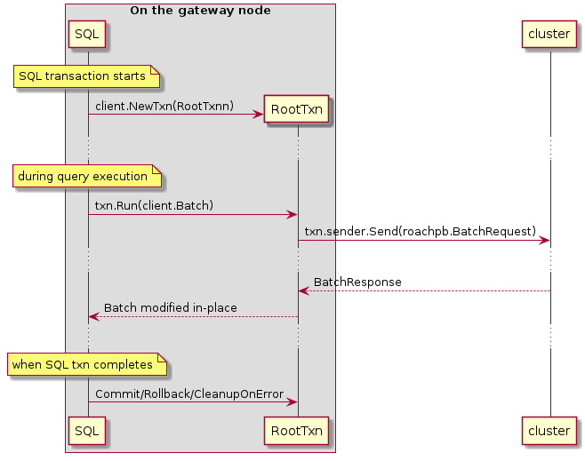
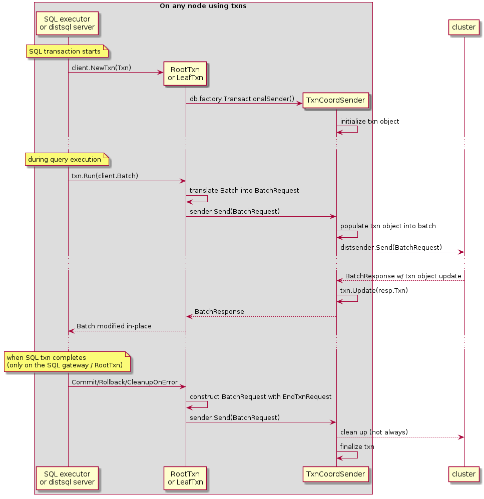

- Feature Name: SQL savepoints
- Status: draft
- Start Date: 2019-10-14
- Authors: andrei knz, with technical input from nathan tbg lucy radu
- RFC PR: [#41569](https://github.com/cockroachdb/cockroach/pull/41569)
- Cockroach Issue: [#10735](https://github.com/cockroachdb/cockroach/issues/10735) [#28842](https://github.com/cockroachdb/cockroach/issues/28842)

**Remember, you can submit a PR with your RFC before the text is
complete. Refer to the [README](README.md#rfc-process) for details.**

Table of contents:

- [Summary](#Summary)
- [Motivation](#Motivation)
- [Guide-level explanation](#Guide-level-explanation)
- [Reference-level explanation](#Reference-level-explanation)
- [Drawbacks](#Drawbacks)
- [Rationale and Alternatives](#Rationale-and-Alternatives)
- [Unresolved questions](#Unresolved-questions)

# Summary

This RFC proposes to implement SQL savepoints as supported by PostgreSQL.

Savepoints enable a client to partially roll back a transaction.

This is a feature that is often requested by users, and used
prominently in the test suites of 3rd party tools, in particular
ORMs. We want to enable these test suites so as to increase our
compatibility coverage.

The addition of SQL savepoints is enabled by recent changes to the
KV layer, whereby write intents now preserve the history of sequence
numbers that wrote to a key throughout a transaction.

The proposal here also incidentally addresses CockroachDB's own
Halloween problem (issue #28842) without additional work: the
introduction of [sequencing steps inside SQL
statements](#SQL-executor-changes) ensures that SQL mutations cannot
read their own writes any more.

# Motivation

SQL savepoints are prominently used by 3rd party tools and frameworks.
They are key to implement nested transactions, which is a common
programming idiom from Java and other object-oriented languages.

# Guide-level explanation

A savepoint is a special mark inside a transaction that allows all
commands that are executed after it was established to be rolled back,
restoring the transaction state to what it was at the time of the
savepoint.

See also: https://www.postgresql.org/docs/current/sql-savepoint.html

- [Syntax and introduction](#Syntax-and-introductory-example)
- [Nesting](#Nesting-and-example)
- [Savepoint name scoping](#Savepoint-name-scoping)
- [Multiple-level commit/rollback](#Multi-level-commit-rollback)
- [Behavior in case of errors](#Behavior-in-case-of-errors)
- [Relationship with client-side retries](#Relationship-with-client-side-retries)

## Syntax and introductory example

- to establish a savepoint inside a transaction: `SAVEPOINT savepoint_name`

  The usual PostgreSQL identifier rules apply: `SAVEPOINT foo` and
  `SAVEPOINT Foo` define the same savepoint, whereas `SAVEPOINT "Foo"`
  defines another.

- to roll back a transaction partially to a previously established
  savepoint: `ROLLBACK TO SAVEPOINT savepoint_name`

- to forget a savepoint, and keep the effects of statements executed
  after the savepoint was established: `RELEASE
  SAVEPOINT savepoint_name`

For example:

```sql
BEGIN;
    INSERT INTO table1 VALUES (1);
    SAVEPOINT my_savepoint;
    INSERT INTO table1 VALUES (2);
    ROLLBACK TO SAVEPOINT my_savepoint;
    INSERT INTO table1 VALUES (3);
COMMIT;
```

The above transaction will insert the values 1 and 3, but not 2.

## Schema changes under savepoints

Schema changes and other DDL are supported "under" savepoints and can
be partially rolled back without rolling back the entire transaction.

For example:

```sql
BEGIN;
  CREATE TABLE u(x INT);

  SAVEPOINT foo;
  CREATE TABLE t(x INT);
  INSERT INTO t(x) VALUES (1);
  ROLLBACK TO SAVEPOINT foo;

  INSERT INTO u(x) VALUES(1);

  SAVEPOINT bar;
  CREATE TABLE t(x TEXT);
  RELEASE SAVEPOINT foo;
  INSERT INTO t(x) VALUES ('a');
COMMIT;
```

This inserts 1 into u and 'a' into t. The table `t` with an INT column
does not exist after the transaction commits.

Note that the ordering of DDL vs DML statements remain restricted as
per previously, none of the [known
limitations](https://www.cockroachlabs.com/docs/v19.1/online-schema-changes.html#no-schema-changes-within-transactions)
are lifted in this work.

## Nesting

Savepoints can be nested.

For example:

```sql
BEGIN;
    INSERT INTO table1 VALUES (1);
    SAVEPOINT my_savepoint;
    INSERT INTO table1 VALUES (2);
    SAVEPOINT my_savepoint2;
    INSERT INTO table1 VALUES (3);
    ROLLBACK TO SAVEPOINT my_savepoint2;
    INSERT INTO table1 VALUES (4);
    RELEASE my_savepoint;
COMMIT;
```

This inserts values 1, 2 and 4 but not 3.

Changes partially committed by a savepoint release can be rolled back by an outer savepoint.

For example:

```sql
BEGIN;
    INSERT INTO table1 VALUES (1);
    SAVEPOINT my_savepoint;
    INSERT INTO table1 VALUES (2);
    SAVEPOINT my_savepoint2;
    INSERT INTO table1 VALUES (3);
    RELEASE SAVEPOINT my_savepoint2;
    ROLLBACK TO SAVEPOINT my_savepoint;
COMMIT;
```

This inserts only value 1. The value 3 is rolled back alongside 2.

## Savepoint name scoping

As an extension to the SQL standard, PostgreSQL allows a
`SAVEPOINT` statement to shadow an earlier savepoint with the same
name. The name refers to the new savepoint until released/rolled back,
after which the name reverts to referring to the previous savepoint.

For example:

```sql
BEGIN;
    INSERT INTO table1 VALUES (1);
    SAVEPOINT my_savepoint;
    INSERT INTO table1 VALUES (2);
    SAVEPOINT my_savepoint;
    INSERT INTO table1 VALUES (3);
    ROLLBACK TO SAVEPOINT my_savepoint;
    INSERT INTO table1 VALUES (4);
    RELEASE SAVEPOINT my_savepoint;
COMMIT;
```

This inserts values 1, 2 and 4, but not 3.

## Multi-level commit/rollback

`RELEASE SAVEPOINT` and `ROLLBACK TO SAVEPOINT` can refer to
a savepoint "higher" in the nesting hierarchy. When this occurs, all
the savepoints "under" the nesting are automatically released/rolled
back too.

For example:


```sql
BEGIN;
    SAVEPOINT foo;
    INSERT INTO table1 VALUES (1);
    SAVEPOINT bar;
    INSERT INTO table1 VALUES (2);
    RELEASE SAVEPOINT foo;
COMMIT;
```

This inserts both 1 and 2.

```sql
BEGIN;
    SAVEPOINT foo;
    INSERT INTO table1 VALUES (1);
    SAVEPOINT bar;
    INSERT INTO table1 VALUES (2);
    ROLLBACK TO SAVEPOINT foo;
COMMIT;
```

This inserts nothing: both inserts are rolled back.

```sql
BEGIN;
    SAVEPOINT foo;
    SAVEPOINT bar;
    ROLLBACK TO SAVEPOINT foo;
    RELEASE SAVEPOINT bar; -- error: savepoint "bar" does not exist
COMMIT;
```

This demonstrates that the name "bar" is not visible after it was rolled back over.


## Behavior in case of errors

If a SQL error occurs "under" a savepoint, it is possible to recover
an open, "healthy" txn by rolling back the savepoint without rolling back the txn.
(An exception to this is discussed below.)

For example:

```
kena=> create table u(x int unique);
CREATE TABLE

kena=> insert into u(x) values(1);
INSERT 0 1

kena=> begin; \
  savepoint foo; \
  insert into u(x) values (1); \
  rollback to savepoint foo; \
  insert into u(x) values (2); \
  commit;

BEGIN
SAVEPOINT
ERROR:  duplicate key value violates unique constraint "u_x_key"
DETAIL:  Key (x)=(1) already exists.
ROLLBACK
INSERT 0 1
COMMIT

kena=> select * from u;
 x
---
 1
 2
(2 rows)
```

(i.e. the second insert succeeds even though the first insert encountered an error)

In the first implementation, an exception to this will be the handling
of retry errors. These will not be cancellable with a savepoint rollback.
Instead, a client-side retry loop must be implemented using the
regular mechanism (see next section).


## Relationship with client-side retries

The mechanism previously used by CockroachDB to drive client-side
retries remains valid, initially with the following restrictions:

- only savepoints with a name starting with the special prefix
  `cockroach_restart` (including `cockroach_restart` itself but also
  `cockroach_restart123134` etc) are to be considered a marker for
  client-side retries.
- restart savepoints can only be used at the outmost level of nesting,
  i.e. `begin; savepoint cockroach_restart; savepoint foo` is OK, but
  `begin; savepoint foo; savepoint cockroach_restart` is not.

In other words, a retry error requires clients to unwind the entire
savepoint hierarchy.

If the transaction encounters a retry error, and subsequently attempts
to roll back / release a savepoint other than a top-level
`cockroach_restart`, another retry error is raised (to force the
client into continuing the error processing).

There is a glimmer of hope for an implementation that is able to
handle retries at the level of a single savepoint (the innermost one) but
this would be more complex and is left out of scope for this implementation.

(more restrictions TBD as informed by implementation)

# Reference-level explanation

- [Design overview](#Design-overview)
- [Bill of work (preliminary)](#Bill-of-work-preliminary)
- [SQL executor changes](#SQL-executor-changes)
- [Savepoints and schema changes](#Savepoints-and-schema-changes)
- [Savepoint rollbacks, MVCC and storage](#Savepoint-rollbacks-MVCC-and-storage)
- [TxnCoordSender changes](#TxnCoordSender-changes)

## Design overview

The overall design can be understood as follows:

- at the SQL/KV interface, KV operations are associated with *sequence numbers* (seqnums):
  - write operations generate new seqnums, which are stored inside write intents
  - the txn object also contains a list of sequence numbers (or ranges
    thereof) that are rolled back and are to be ignored during reads.
  - read operations operate "at" a particular seqnum- a MVCC read that
    encounters an intent ignores the values written at later seqnums
    and returns the most recent value at that seqnum instead, also
    substracting any past value at seqnums marked to be ignored due to
    rollbacks.
  - intent resolution also throws away any values inside the rolled
    back seqnum ranges.

- outside of SQL, reads operate at the seqnum of the latest write as
  is done today; this preserves read-your-own-writes even inside
  individual KV batches

- inside SQL, the executor configures the sql/kv interface so that all
  reads performed on behalf of an "execution step" (usually, a single
  statement) are performed at the seqnum of the last write in the
  previous step.
  - most statements consist of just one step, whereby the seqnum
    boundary is in-between statements. However, with CTE mutations, FK
    checks and cascading updates, there may be multiple steps inside a
    single complex statement.
  - for CPuts specifically, the condition part ignores the configured
    read seqnum and checks the most recent (non rolled back) write
    instead. [This is needed in mutations.](#Savepoints-and-SQL-mutations)

- a savepoint is defined by:
  - when adding a savepoint, by saving the current write seqnum,
  - to roll back a savepoint, by marking the seqnums in-between as
    rolled back inside the txn object, to be ignored during reads (see
    above).
  - savepoint release is a no-op in kv, and simply updates a name-seqnum mapping inside SQL.

- conceptually, savepoints define a stack-like structure. Any
  savepoint has at most one savepoint open "under" it. When releasing
  or rolling back to a savepoint higher in the stack, all the
  savepoints in-between are also released or rolled back.
  In the SQL executor, this is managed using a stack-like data structure.

- to introduce savepoint semantics in schema updates / DDL, the
  descriptor caches are extended to store the seqnum alongside the
  cached descs. Cache entries are not considered/evicted if the
  seqnum has been rolled back.

## Bill of work (preliminary)

Initial analysis, pre-impl, suggests the following Work to be performed:

- [SQL execution changes](#SQL-executor-changes):
  - define the new executor `Step()` method and call it where relevant.
  - [integrate with mutation and FK semantics](#Savepoints-and-SQL-mutations)
  - connect the current savepoint/rollback logic to the new txncoordsender interface
- [SQL metadata](#Savepoints-and-schema-changes):
  - evict entries from desc caches upon savepoint rollback
- [Storage changes to support rollbacks](#Savepoint-rollbacks-MVCC-and-storage):
  - https://github.com/cockroachdb/cockroach/issues/41612
  - extend the txn proto with a list of ignored seqnum ranges
  - extend the MVCC read logic to skip over ignored seqnum ranges
  - extend the intent resolution logic to skip over ignored seqnum ranges
- [TxnCoordSender changes](#TxnCoordSender-changes):
  - extend the TxnCoordSender interface with methods to mark a SQL step,
    create a savepoint and rewind (= mark seqnum ranges as ignored)
  - rework the error handling logic in txncoordsender (and perhaps other
    layers) to avoid marking the txn object as in-error for
    non-permanent errors
  - When rolling back to a savepoint, we'll also want to stop
    considering writes with those sequence numbers as in-flight from
    the perspective of a parallel commit. This logic will live in the
    `txnPipeliner`.

## SQL executor changes

To support nesting and shadowing, the SQL executor maintains a naming
environment: a list of mappings from names to savepoints.

In Go, using  `[]struct{name,sp}` or equivalent.
(We do not use a simple `map` because savepoints form a stack.)

The most recent, innermost savepoint information is at the end of the
list.

When defining a savepoint, a new entry is appended. When releasing or
rolling back a savepoint, the latest mapping for that sp name is
removed:

- Trying to release or rollback a savepoint using a name that does not
  exist in that list results in an error 3B001 "savepoint does not
  exist".
- When the target of a RELEASE is an entry that's earlier than the
  latest entry, all the entries from that entry to the last are also
  popped out and released.
- Similarly, if the target of a ROLLBACK is an earlier entry,
  all the entries in-between are also removed from the environment
  and (conceptually) rolled back.
- (TBD:) uses of savepoint syntax with `cockroach_restart` special names
  first verify that the stack of savepoints is empty. If it is not,
  a usage/syntax/unimplemented error is produced.

The executor also provides a method `Step()` on the execution context
(likely `planner` or whatever is most relevant at the time of
implementation):

- this is called every time a SQL execution step is reached:
  - at the end of execution of each regular statement
  - after each top-level mutation CTE in a multi-mutation statement
  - in-between the FK and cascading action phases, if any
- the implementation of `Step()` forwards the call to the RootTxn's
  TxnCoordSender `Step()` method (new), which in turn saves the current
  write seqnum as reference seqnum for future reads.

## Savepoints and SQL mutations

At a [high level](#Design-overview), mutations read at the seqnum of
the previous statement and write at new seqnums. In particular, they
don't read their own writes and this solves issue
[#28842](https://github.com/cockroachdb/cockroach/issues/28842).

This raises a couple "interesting" topics:

- [Uniqueness violations](#Uniqueness-violations)
- [ON CONFLICT processing](#ON-CONFLICT-processing)
- [FK existence checks under a single mutation](#FK-existence-checks-under-a-single-mutation)
- [FK cascading actions under a single mutation](#FK-cascading-actions-under-a-single-mutation)
- [Multiple mutations with CTEs](#Multiple-mutations-with-CTEs)

### Uniqueness violations

There are really two cases:

- we insert/modify a single row, and doing so creating a duplicate of
  a row that was modified in a previous statement (or sequencing
  step). This case is simple and transparently handled by "read at
  seqnum of previous step".

- we insert/modify the same row two times inside the same mutation
  statement, or two rows such that they are duplicate according to
  some unique index.
  Here the problem is seemingly that the 2nd row update will not
  see the first.

However, when looking more closely there is no new problem here.

All writes to a unique index go through a KV `CPut` on the uniqueness key.
By ensuring that `CPuts` read their _condition_ at the current write
seqnum, we can always pick up the latest write and detect duplicates.

(CPut will still skip over ignored / rolled back seqnums like other KV
ops. It's only the target read seqnum that's ratcheted up to the
present for CPut, in contrast to other mvcc ops that will be blocked by
the configured target read seqnum.)

This opens a question of whether we need a variant of CPut which does
not do this. TBD. (Initial analysis says no.)

### ON CONFLICT processing

Question arises of what to do when the result of ON CONFLICT
processing changes a row in a read-modify-write fashion. For example:

```sql
INSERT INTO t(x) VALUES (1), (1) ON CONFLICT(x) DO UPDATE SET x = t.x + excluded.x
--                      ^^^^^^^^ notice the dup row
```

Here conceptually the INSERT suggests that the 2nd ON CONFLICT resolution
will observe the row as it was left over by the 1st. This would not work
with "read at seqnum of previous statement".

The answer here is from a previous discussion around mutations that
observed the following:

- postgres does not support updating the same row two times in an ON
  CONFLICT clause.

- it is desirable to batch / pre-compute the ON CONFLICT result values
  concurrently with the mutation for performance, and we've already
  established back in 2018 that the lack of support for updating the
  same row twice in pg makes this optimization possible.

- the implementation was updated when bringing this logic under the CBO

From here, it follows that we don't care about "read at seqnum"
inconsistencies as the current CBO logic already assumes that it's
fine to miss earlier conflict resolutions.

### FK existence checks under a single mutation

FK existence checks must observe the data values post-mutation. For
this we introduce a [step boundary](#SQL-executor-changes) between the
end of the "run" phase (where results were produced for the client)
and the FK existence checks.

This way the reads for FK existence checks can see all the writes by
the mutation.

### FK cascading actions under a single mutation

(To be checked)

Postgres uses post-statement triggers to process FK cascading actions
and existence checks.  Cascading actions that result in mutations to
other tables themselves append more triggers to run.

Each subsequent step in this cascade of effects is able to read its
own writes (for futher FK checks).

We emulate this in CockroachDB by introducing a step boundary between
iterations of the cascading algorithm.

### Multiple mutations with CTEs

It's possible for a single statement to define multiple mutations for example:

```sql
WITH
  a AS (INSERT ... RETURNING ...),
  b AS (INSERT ... RETURNING ...)
  SELECT ...
```

PostgreSQL does not guarantee that the effect of one mutation is
visible to another, or even to the later read-only parts of the
statement. In fact it requires that all mutations operate
on the same data at the beginning of the statement:

More specifically: https://www.postgresql.org/docs/12/queries-with.html

> The sub-statements in WITH are executed concurrently with each other
> and with the main query. Therefore, when using data-modifying
> statements in WITH, the order in which the specified updates
> actually happen is unpredictable. **All the statements are executed
> with the same snapshot (see Chapter 13), so they cannot “see” one
> another's effects on the target tables.** This alleviates the effects
> of the unpredictability of the actual order of row updates, and
> means that RETURNING data is the only way to communicate changes
> between different WITH sub-statements and the main query.

So with the logic proposed so far, all the mutations inside the same
statement execute from the same read seqnum.

If there is FK work to be done, the first sequencing step necessary
for FK checks (to advance the read seqnum) will only occur after all
mutations have completed.

(The observations from [Uniqueness violations](#Uniqueness-violations) above apply here as well.)

## Savepoints and schema changes

Background:

- descriptors used in a txn are loaded in a desc cache (TableCollection + db desc cache)
  that's (currently) invalidated at the end of the txn
- DDL statements work as follows:
  - they modify the descriptor by adding "pending mutation" records and persist
    the descs embedding these records using the current KV txn context
  - additional DDL may add more mutations and perform further KV updates
  - at the end of a SQL txn, _after_ the KV txn commits, a "schema changer" job/process
    is kicked off to resolve the mutation entries on descriptors. The
	mutation records are read using AS OF SYSTEM TIME with the KV commit timestamp
	and the final desc post-mutations is written back to kv (possibly at a later timestamp).

To implement SQL savepoints:

- the descriptor caches must be invalidated when a savepoint is rolled
  back. To achieve this:
  - we extend the caches to store the savepoint object
    (write seqnum) under which a descriptor was loaded (= the most recent
    savepoint that's still open).
  - when releasing a savepoint, we re-annotate all the cached descriptors
    cached "under" the savepoint(s) being released, to become cached
	"under" the savepoint that's still open. (Alternatively, we could
	flush the desc caches entirely. This is simpler but perf impact unknown. TBD.)
  - when rolling back a savepoint, we evict entries from the cache
    that correspond to a seqnum being rolled back.

- we let the further processing of DDL statements proceed using KV
  operations as usual. We expect that the rest of the KV/SQL semantics
  will make schema changes "just work":

  - pending mutation records are cancelled/rolled back as any other KV write
  - when the KV txn commits, only the KV writes corresponding to non-rolledback
    savepoints have been persisted, so any DDL changes "under" savepoints
	become invisible.
  - the schema changer task that starts after that will thus only
    see the remaining (committed/released) mutation records and the
	DDL semantics should "just work".

  (This will be validated by experimentation in a prototype).

## Savepoint rollbacks, MVCC and storage

Background:

- for a given KV pair, any write by a txn is done via a write intent
- if there is another write inside the txn, we _append_ the new write
  to the intent already laid. After two writes, we'd have separately:
  - two seqnums
  - two values
  - two mvcc timestamps

We need to keep both values around even without savepoints because we
may reorder KV reads and writes. For example, in the sequence
write1-read1-write2, if the read1 operation happens to be processed
after write2, we still want it to see only write1 that is logically in
its past.

The way this works today is that each KV operation also has a metadata
field which tells it "at which seqnum" it should read.  The MVCC read
logic, when it encounters an intent, scans the entries in the intent
from last to first, and ignores all writes performed at a later
seqnum.

For savepoints, this needs to be extended as follows:

- the txn metadata, which is available in the context of every MVCC
  read, is extended by a new field "list of ignored seqnum ranges".

- when a MVCC reads finds an intent and scans to find the first
  value that's no later than the current read seqnum, it
  should also skip over any value written at a seqnum
  also in the ignore list.

Savepoint rollbacks are implemented by populating the ignore list
with the range of seqnums generated from the point the savepoint
was last established, to the point of the rollback.

This storage-specific part of the work is described in this issue:
https://github.com/cockroachdb/cockroach/issues/41612

## TxnCoordSender changes

- Background:
  - [Txn interface between SQL and KV](#Txn-interface-between-SQL-and-KV)
  - [KV sequence numbers](#Background-KV-sequence-numbers)
- [SQL / KV API definition](#SQL-KV-API-definition)
- [Error handling in TxnCoordSender](#Error-handling-in-TxnCoordSender)


### Background: txn interface between SQL and KV

This section explains how the SQL/KV interface currently works, up to
the level of detail necessary to understand the rest of this RFC.

(Since the interactions are relatively complex, the section
introduces the concepts incrementally. The explanations at the
beginning are thus somewhat inaccurate, merely providing
an upramp to understanding for the reader.)

#### client.Txn and RootTxns

The first two actors in this explanation are:

- the SQL executor, which organizes the state of the SQL transaction
  and the sequencing of statements on the gateway.
- a transaction object called "RootTxn" (the name will be motivated
  later), that exists on the SQL gateway, and which stores the "main"
  state of the SQL/KV transaction - for example whether it's aborted,
  waiting for a client-side retry, etc.

A simplified view of the interaction between the two is as follows:



- the SQL executor instantiates an object of Go type `*client.Txn` with
  its type set to `RootTxn` (hence the name)
- during query execution, the SQL exec code (on the gateway, we ignore
  distributed execution for now) uses the `Run()` method on that
  object to run KV operations.
- "under the hood" the RootTxn translates the Run() calls into
  BatchRequests into the cluster, and translates the
  BatchResponses back into updates into the `client.Batch` object
  provided by the SQL code.
- at the end of the SQL transaction (either commit or rollback, or
  close on error), a call is made to the RootTxn to
  finalize its state.

#### LeafTxns and txn state repatriation

When a query becomes distributed, we want other nodes to be able
to run KV operations "on behalf" of the main SQL transaction
running on the gateway. This needs the same txn ID, timestamp, etc,
so we can't just create a fresh new RootTxn on each node
where a distsql processor runs.

Instead, there is some new complexity, involving three new actors:

- one or more distSQL servers running on other nodes than the
  gateway, which receive requests from the gateway to execute
  work on behalf of a SQL session running there.
- distSQL units of work, called "flows", which are specified
  to run some processing code and, relevant here, operate
  using...
- ... another transaction object called "LeafTxn", which contains
  a copy of many fields of the original RootTxn and is
  able to run KV **read** operations.

This works as follows:


- the SQL executor instantiates the RootTxn as follows
- when a distributed query is about to start, the distsql
  execution code "pulls out" a struct from the RootTxn
  called "TxnCoordMeta", then "trims it down"
  using `TrimRootToLeaf()` to turn it into the necessary
  and sufficient input to create LeafTxn objects
  on other nodes. This contains e.g. the txn ID and
  timestamp as outlined above.
- the trimmed meta struct is sent along with the flow
  request to a remote distsql server.
- on the other node, the distsql server instantiates the
  `LeafTxn` object using the provided meta struct as input.
- the distsql processor(s) (e.g a table reader) then uses
  the LeafTxn to run KV batches.
- when query execution completes, the distsql processor
  extracts a similar state struct off the LeafTxn,
  trims it down using `TrimLeafToRoot()` and the
  result is repatriated on the gateway when the
  flow is shut down.
- on the gateway, repatriated LeafTxn state structs
  are merged into the RootTxn using `AugmentTxnCoordMeta()`.

Why do we need to bring back state from a LeafTxn into a RootTxn?

There are many uses for this data repatriation, which are not all
directly relevant in this RFC.

One use which is good to explain why the repatriation is _necessary_
is that of refresh spans: as KV reads are issued by the LeafTxn, it
populates a list of refresh spans. If we did not repatriate these
spans, then a subsequent txn conflict check would not detect that
reads performed by the LeafTxn are stale and incorrectly decide to
refresh the txn (bump its commit ts into the future and retry
automatically, instead of pushing the error back to the client).

Another use of repatriation that's not strictly necessary but is
nevertheless a useful optimization, is the case when the transaction
is aborted concurrently (e.g. by another concurrent conflicting txn
with higher prio). If the KV reads done on behalf of the LeafTxn
detect the txn record to become aborted, this new state will be
repatriated and the RootTxn will know that the entire KV txn has
become aborted.  This is faster than letting the RootTxn discover this
state later at the first next KV operation launched on its behalf.

#### client.Txn, meta and TxnCoordSender

The two sections above used a simplified picture using
a single "transaction object".

In truth, the [type
`*client.Txn`](https://github.com/cockroachdb/cockroach/blob/master/pkg/internal/client/txn.go#L32)
is merely a thin facade for the SQL client. It contains, between other things:

- a type tag (RootTxn/LeafTxn)
- a reference of [interface type
  `TxnSender`](https://github.com/cockroachdb/cockroach/blob/master/pkg/internal/client/sender.go#L57),
  which abstracts the `Send()` operation to send batch requests to the
  rest of the cluster.

In particular it does not contain the "main" txn payload including
commit timestamp, intents, etc.

Where is that payload then? Also, where are the refresh spans and
other in-flight txn properties stored?

The object referenced by `*client.Txn` is an instance of a coordinator
component called the "TxnCoordSender" of [type
`kv.TxnCoordSender`](https://github.com/cockroachdb/cockroach/blob/master/pkg/kv/txn_coord_sender.go#L104).
The TxnCoordSender, as its name implies, is in charge of maintaining
the state of the txn at the top of the KV layer, and is in charge
of coordinating the distribution of KV batches to layer underneath together
with error handling, txn conflict management, etc.

The TxnCoordSender is also, itself, a rather thin data structure.

Its main payload is what the KV team actually calls the "txn object",
of [type
`roachpb.Transaction`](https://github.com/cockroachdb/cockroach/blob/master/pkg/roachpb/data.proto#L302),
which in turn also
[contains](https://github.com/cockroachdb/cockroach/blob/master/pkg/roachpb/data.proto#L310)
a copy of the "txn meta" object, of [type
`enginepb.TxnMeta`](https://github.com/cockroachdb/cockroach/blob/master/pkg/storage/engine/enginepb/mvcc3.proto#L18).

The separation of purpose between `roachpb.Transaction` and
`enginepb.TxnMeta` is not further relevant in this RFC, and we will just
call them collectively "the txn object".

With this in place, the interaction goes roughly as follows (we're
back to ignoring distributed execution, for now):



The txn object is sent along in the header of every `BatchRequest`
produced by TxnCoordSender while it processes a `client.Batch` from
SQL or other KV clients. This is passed along the
KV/replication/storage boundaries and the low-level MVCC code in
storage has access to (a sufficient part of) the txn object during
processing of each single KV operation.

Additionally, the execution of low-level KV operations can _update_
their copy of (parts of) the txn object. This will populate e.g.  the
list of observed timestamps, used for later txn conflict resolution.
The resulting txn state then flows back to TxnCoordSender in the
header of every `BatchResponse`.  Upon receiving a BatchResponse, the
TxnCoordSender *merges* the received txn object in the response with
the txn object it already has.

### Background: KV sequence numbers

(DRAFT - currently in flux)

Sequence numbers (seqnums) are currently used to identify individual
writes in a KV batch. They satisfy two different requirements:

- they are used to uniquely identify individual writes
- they are used to order reads and writes to enable read-your-own-writes
  even in the presence of concurrency (pipeline, out of order eval etc).

Today the TxnCoordSender (the component that receives KV request
batches from SQL) is responsible for generating seqnums.  There is a
seqnum generator that increases monotonically (throughout a KV txn)
for every new write request in a KV batch.

The counter is primarily stored in the `roachpb.TxnCoordMeta.Txn`,
then copied for local generation whenever a `client.Txn` object is
instantiated on top of that with an interceptor of type
`txnSeqNumAllocator` (this then uses its own internal `seqGen` field
until it re-syncs with the `TxnCoordMeta` via `populateMetaLocked()`.

Each read request is currently configured (by TxnCoordSender) to use
the latest generated write seqnum prior.

When an intent is written, the seqnum of the current write is appended
to a list of seqnums already stored in the intent.

The list of all seqnums generated is not stored currently.


### SQL / KV API definition

(DRAFT - currently in flux)

```
txn = "current" txn

savepoint a    - txn = txn.Savepoint(); txnA := txn
savepoint b    - txn = txn.Savepoint(); txnB := txn
savepoint c    - txn = txn.Savepoint(); txnC := txn
rollback to a  
- txn = txn.RewindTo(txnA)

func (txn) RewindTo(origTxn txn) txn {
  if txn == origTxn {
    return txn
  }
  txn.parent.invalidRange.append(txn.seqrange)
  txn.Close()
  return txn.parent.RewindTo(origTxn)
} 

// other
rollback to a  
  txnC.Rollback()
  txnB.Rollback()
  ...
  txnA.sender.ResetReadSequence(txnA.prevSeqToken)

func (txn) Rollback() {
  txn.parent.invalidRange.append(txn.seqrange)
  txn.Close()
}


func (txn) Close() {
  txn.usable = false
   txn.parent.Update(txn)
   //  txn.parent.ResetReadSequence(txn.sender.SetReadSequence())
}

func (txn) Release() { txn.Close() }

func (this txn) Savepoint() txn {
  prevSeqToken := txn.sender.SetReadSequence()
  return txn{
     parent: this,
	 prevSeqToken: prevSeqToken,
	 sender: this.sender.Clone() -- new txn proto
	 // (we'd like to share the sender, but because
	 // the child savepoint can encounter retry errors
	 // that will update the txnproto, and we want to
	 // keep the ability to throw these changes away with
	 // a savepoint rollback, we can't share that txnproto
	 // with the parent savepoint.)
  }
}
```

Also, in SQL executor,
txn.sender.SetReadSequence() is called _at the end_ of every statement.

This introduces a separation between:

- SQL-driven client.Txns where the TxnCoordSender uses the seqnum set
  hby SetReadSequence() to populate the read requests,

- general-purpose client.Txns where the TxnCoordSender uses (as previously)
  the seqnum of the latest write.

The separation between these two is set initially when the 
client.Txn is instantiated originally. This becomes either a separate
interceptor or a flag in `txnSeqNumAllocator` that changes which field
is used  to initialize the `Sequence` field in batch
request headers. (either current write seqnum, or fixed read seqnum set by
`SetReadSequence()`)

### Discussion Andrei/Nathan 2019-10-15

(DRAFT - raw notes)

Andrei: we want a common txn interface which needs to satisfy multiple purposes:

- for distsql, to send metadata on a node and have that node oeprate
  on behalf of that txn, _not handle retries_, then retrieve the
  metadata back to the root
- this is currently what is done with leaftxns

- for the halloween problem, we need to tie a SQL step to a sequence
  number for its reads

- for savepoints, we need a way to roll back a range of sequence
  numbers.

- for concurrent reads, we want a way to tie concurrent actors to a
  particular txn ID and epoch number, and also a seqnum

- error handling currently occurs in txncoordsender. When it sees a
  retry error it acts upon it regardless of whether there are
  concurrent actors.

  - if two goroutines use a single txncoordsender, this will break
  - if there's a txncoordsender on a separate node, this will break
    (we currently avoid breakage using the restrictions on leaftxns)

- the various ways we "lock in" a view on a txn are "handles"
  We have already one type of handle (root/leaf) it seems that
  savepoints are a new type of handle. Maybe we can avoid
  creating new handle types and unify these things.

- nathan: instead of using separate client txns, we could use a single
  one (RootTxn)

- knz, yes but then have TxnCoordSender handle the savepoint rollback
  mechanism using a proto stack

- nathan: IMHO stack not necessary, the txncoordsender can implement
  rollbacks by injecting the ignored seqnums itself

- andrei/knz: what about errors, how can we roll back a txn refresh,
  write too old error, or other things that currently invalidate the
  txn proto?

- andrei: the main issue is that the txncoordsender can push
  the txn proto into a state cannot be rolled back

- nathan: I think there's value in delaying decisions (txncoordsender
  error handling) eg for follower reads

- andrei/nathan: except in case where we know for sure that
  the client has to deal with the retry, in which case we want
  to push this ASAP to the client (eagerly)

- nathan/andrei: concern about Ben's change that itnroduced an
  interceptor that recognizes write too old errors, and forces a
  refresh. This is different from what we do for pushes, which
  are only detected/processed at time of KV commit.
  (Although the SQL code has access to the knowledge of
  whether a txn is pushed and will eventually refresh)

- nathan: what's the plan to handle concurrent reads when there are
  retry errors?

  - andrei: today when a txncoordinator sees a retry error it either

    - refresh the txn automatically
    - closes itself and lets the SQL executor instantiated a new txncoordsender

  - knz: how is this broken? ISTM root/leaf handle this
  
  - nathan: three paths. One in the leaf, two in the root.

    - in the root, when kv ops are performed by the root itself
	- in the root, when importing metadata from leaves
	
  - the problem is when handling in the root while leaves may still be
    running. What we don't want is a leaf observing the effects of
    error resolution (incl intent resolution) befor ethey're done
    running.
	
  - architecturally, the sql executor is the entity that knows
    that leaves are done. The problem is that txncoordinator
	eagerly processes these errors before it learns from sql
	executor that the leaves are done.

- andrei see #24798

- nathan: an example thing that would benefit from deferring eror
  handling to the end of the stmt. See the update example.
  
  - andrei: there's use for both. Try to refresh like we do know. If
    that fails, let the stmt complete (in error) then restart the stmt
    (if no result was returned to the client)
	
  - nathan: what's the benefit of doing partial handling inline?

  - andrei: it can swallow errors. Prevents a full query abort.
  
(knz: note that refreshes are disabled, even in a rootxn, at the level
of one batch. If any write command in a batch has succeeded,
we can't refresh.)


### Savepoints and LeafTxns

- how to organize the administration of LeafTxns in the presence of
  savepoints.

### Error handling in TxnCoordSender

(DRAFT - currently in flux)

Currently TxnCoordSender maintains internal state to mark a transaction
as "in error". this is marked after _any_ KV error responses, not just
cases where the TxnProto was detected as aborted due to a concurrent txn.

For example, TxnCoordSender marks a txn as "in error" after a failed
CPut, even though it's conceivable to continue operating the txn
regardless of whether CPut succeeds or not.

This needs to be modified to properly restore the "non-error" state
in TxnCoordSender when rolling back a savepoint.

Example errors that cause "permanent", non-rewindable error states:

- txn state aborted
- internal errors in the txncoordsender itself
- internal kv errors due to inconsistent metadata struct
- assertion errors of various kinds

Example errors that can be rewinded:

- txn retry errors
- network errors
- replica unavailable errors
- permanent storage errors - i/o etc
- non-permanent storage errors eg duplicate key

### Savepoints, txn epochs and retry errors

- we want to preserve the ability to run concurrently.

- concurrency in txns: have the concurrent actors have a handle on a txn
  that's locked at a particular epoch


# Drawbacks

This feature introduces more complexity in the SQL executor.

# Rationale and Alternatives

(to be populated)

## General implementation direction

There are two general design directions:

1. mark certain ranges of sequence numbers as "rolled back" in the
   transaction record itself, to be ignored during MVCC reads.

   Pros: rollbacks are cheaper

   Cons: reads are more expensive

   Cons: after a rollback the intents are "still there" and create
   contention with concurrent txns that touch the rolled back intents.

2. proactively iterate through all intents generated for the current
   txn and remove the rolled back sequence numbers from the generated
   intents, including removing the intent if the sequence numbers
   being rolled back are the only ones remaining.

   Pros: reads are cheaper

   Pros: rolled back intents also roll back the contention

   Pros: may simplify the row locking story (although Tobias found out
   that PostgreSQL is pretty bad on this so we don't need this pro to
   be at least as good as pg)

   Cons: rollbacks are more expensive

Nathan recommends approach 1, sensing that it requires less work.

# Unresolved questions

(none at this time)
