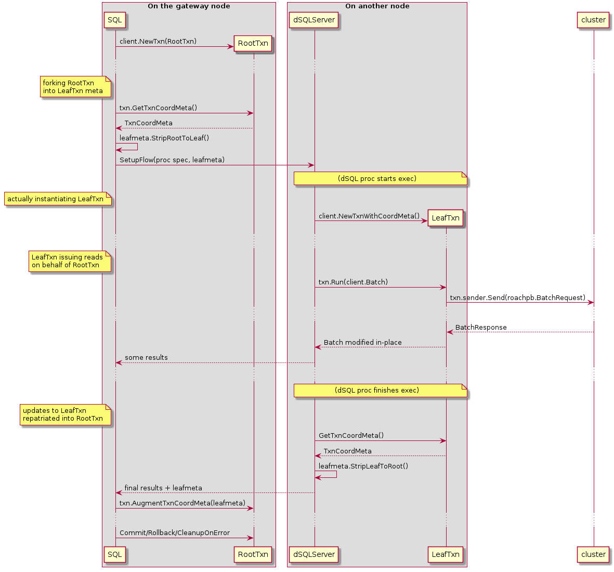

- Feature Name: SQL savepoints
- Status: draft
- Start Date: 2019-10-14
- Authors: andrei knz, with technical input from nathan tbg lucy radu
- RFC PR: [#41569](https://github.com/cockroachdb/cockroach/pull/41569)
- Cockroach Issue: [#10735](https://github.com/cockroachdb/cockroach/issues/10735) [#28842](https://github.com/cockroachdb/cockroach/issues/28842)

**Remember, you can submit a PR with your RFC before the text is
complete. Refer to the [README](README.md#rfc-process) for details.**

Table of contents:

- [Summary](#Summary)
- [Motivation](#Motivation)
- [Guide-level explanation](#Guide-level-explanation)
- [Reference-level explanation](#Reference-level-explanation)
- [Drawbacks](#Drawbacks)
- [Rationale and Alternatives](#Rationale-and-Alternatives)
- [Unresolved questions](#Unresolved-questions)

# Summary

This RFC proposes to implement SQL savepoints as supported by PostgreSQL.

Savepoints enable a client to partially roll back a transaction.

This is a feature that is often requested by users, and used
prominently in the test suites of 3rd party tools, in particular
ORMs. We want to enable these test suites so as to increase our
compatibility coverage.

The addition of SQL savepoints is enabled by recent changes to the
KV layer, whereby write intents now preserve the history of sequence
numbers that wrote to a key throughout a transaction.

The proposal here also incidentally addresses CockroachDB's own
Halloween problem (issue #28842) without additional work: the
introduction of [sequencing steps inside SQL
statements](#SQL-executor-changes) ensures that SQL mutations cannot
read their own writes any more.

# Motivation

SQL savepoints are prominently used by 3rd party tools and frameworks.
They are key to implement nested transactions, which is a common
programming idiom from Java and other object-oriented languages.

# Guide-level explanation

A savepoint is a special mark inside a transaction that allows all
commands that are executed after it was established to be rolled back,
restoring the transaction state to what it was at the time of the
savepoint.

See also: https://www.postgresql.org/docs/current/sql-savepoint.html

- [Syntax and introduction](#Syntax-and-introductory-example)
- [Nesting](#Nesting-and-example)
- [Savepoint name scoping](#Savepoint-name-scoping)
- [Multiple-level commit/rollback](#Multi-level-commit-rollback)
- [Behavior in case of errors](#Behavior-in-case-of-errors)
- [Relationship with client-side retries](#Relationship-with-client-side-retries)

## Syntax and introductory example

- to establish a savepoint inside a transaction: `SAVEPOINT savepoint_name`

  The usual PostgreSQL identifier rules apply: `SAVEPOINT foo` and
  `SAVEPOINT Foo` define the same savepoint, whereas `SAVEPOINT "Foo"`
  defines another.

- to roll back a transaction partially to a previously established
  savepoint: `ROLLBACK TO SAVEPOINT savepoint_name`

- to forget a savepoint, and keep the effects of statements executed
  after the savepoint was established: `RELEASE
  SAVEPOINT savepoint_name`

For example:

```sql
BEGIN;
    INSERT INTO table1 VALUES (1);
    SAVEPOINT my_savepoint;
    INSERT INTO table1 VALUES (2);
    ROLLBACK TO SAVEPOINT my_savepoint;
    INSERT INTO table1 VALUES (3);
COMMIT;
```

The above transaction will insert the values 1 and 3, but not 2.

## Schema changes under savepoints

Schema changes and other DDL are supported "under" savepoints and can
be partially rolled back without rolling back the entire transaction.

For example:

```sql
BEGIN;
  CREATE TABLE u(x INT);

  SAVEPOINT foo;
  CREATE TABLE t(x INT);
  INSERT INTO t(x) VALUES (1);
  ROLLBACK TO SAVEPOINT foo;

  INSERT INTO u(x) VALUES(1);

  SAVEPOINT bar;
  CREATE TABLE t(x TEXT);
  RELEASE SAVEPOINT foo;
  INSERT INTO t(x) VALUES ('a');
COMMIT;
```

This inserts 1 into u and 'a' into t. The table `t` with an INT column
does not exist after the transaction commits.

Note that the ordering of DDL vs DML statements remain restricted as
per previously, none of the [known
limitations](https://www.cockroachlabs.com/docs/v19.1/online-schema-changes.html#no-schema-changes-within-transactions)
are lifted in this work.

## Nesting

Savepoints can be nested.

For example:

```sql
BEGIN;
    INSERT INTO table1 VALUES (1);
    SAVEPOINT my_savepoint;
    INSERT INTO table1 VALUES (2);
    SAVEPOINT my_savepoint2;
    INSERT INTO table1 VALUES (3);
    ROLLBACK TO SAVEPOINT my_savepoint2;
    INSERT INTO table1 VALUES (4);
    RELEASE my_savepoint;
COMMIT;
```

This inserts values 1, 2 and 4 but not 3.

Changes partially committed by a savepoint release can be rolled back by an outer savepoint.

For example:

```sql
BEGIN;
    INSERT INTO table1 VALUES (1);
    SAVEPOINT my_savepoint;
    INSERT INTO table1 VALUES (2);
    SAVEPOINT my_savepoint2;
    INSERT INTO table1 VALUES (3);
    RELEASE SAVEPOINT my_savepoint2;
    ROLLBACK TO SAVEPOINT my_savepoint;
COMMIT;
```

This inserts only value 1. The value 3 is rolled back alongside 2.

## Savepoint name scoping

As an extension to the SQL standard, PostgreSQL allows a
`SAVEPOINT` statement to shadow an earlier savepoint with the same
name. The name refers to the new savepoint until released/rolled back,
after which the name reverts to referring to the previous savepoint.

For example:

```sql
BEGIN;
    INSERT INTO table1 VALUES (1);
    SAVEPOINT my_savepoint;
    INSERT INTO table1 VALUES (2);
    SAVEPOINT my_savepoint;
    INSERT INTO table1 VALUES (3);
    ROLLBACK TO SAVEPOINT my_savepoint;
    INSERT INTO table1 VALUES (4);
    RELEASE SAVEPOINT my_savepoint;
COMMIT;
```

This inserts values 1, 2 and 4, but not 3.

## Multi-level commit/rollback

`RELEASE SAVEPOINT` and `ROLLBACK TO SAVEPOINT` can refer to
a savepoint "higher" in the nesting hierarchy. When this occurs, all
the savepoints "under" the nesting are automatically released/rolled
back too.

For example:


```sql
BEGIN;
    SAVEPOINT foo;
    INSERT INTO table1 VALUES (1);
    SAVEPOINT bar;
    INSERT INTO table1 VALUES (2);
    RELEASE SAVEPOINT foo;
COMMIT;
```

This inserts both 1 and 2.

```sql
BEGIN;
    SAVEPOINT foo;
    INSERT INTO table1 VALUES (1);
    SAVEPOINT bar;
    INSERT INTO table1 VALUES (2);
    ROLLBACK TO SAVEPOINT foo;
COMMIT;
```

This inserts nothing: both inserts are rolled back.

```sql
BEGIN;
    SAVEPOINT foo;
    SAVEPOINT bar;
    ROLLBACK TO SAVEPOINT foo;
    RELEASE SAVEPOINT bar; -- error: savepoint "bar" does not exist
COMMIT;
```

This demonstrates that the name "bar" is not visible after it was rolled back over.


## Behavior in case of errors

If a SQL error occurs "under" a savepoint, it is possible to recover
an open, "healthy" txn by rolling back the savepoint without rolling back the txn.
(An exception to this is discussed below.)

For example:

```
kena=> create table u(x int unique);
CREATE TABLE

kena=> insert into u(x) values(1);
INSERT 0 1

kena=> begin; \
  savepoint foo; \
  insert into u(x) values (1); \
  rollback to savepoint foo; \
  insert into u(x) values (2); \
  commit;

BEGIN
SAVEPOINT
ERROR:  duplicate key value violates unique constraint "u_x_key"
DETAIL:  Key (x)=(1) already exists.
ROLLBACK
INSERT 0 1
COMMIT

kena=> select * from u;
 x
---
 1
 2
(2 rows)
```

(i.e. the second insert succeeds even though the first insert encountered an error)

In the first implementation, an exception to this will be the handling
of retry errors. These will not be cancellable with a savepoint rollback.
Instead, a client-side retry loop must be implemented using the
regular mechanism (see next section).


## Relationship with client-side retries

The mechanism previously used by CockroachDB to drive client-side
retries remains valid, initially with the following restrictions:

- only savepoints with a name starting with the special prefix
  `cockroach_restart` (including `cockroach_restart` itself but also
  `cockroach_restart123134` etc) are to be considered a marker for
  client-side retries.
- restart savepoints can only be used at the outmost level of nesting,
  i.e. `begin; savepoint cockroach_restart; savepoint foo` is OK, but
  `begin; savepoint foo; savepoint cockroach_restart` is not.

In other words, a retry error requires clients to unwind the entire
savepoint hierarchy.

If the transaction encounters a retry error, and subsequently attempts
to roll back / release a savepoint other than a top-level
`cockroach_restart`, another retry error is raised (to force the
client into continuing the error processing).

There is a glimmer of hope for an implementation that is able to
handle retries at the level of a single savepoint (the innermost one) but
this would be more complex and is left out of scope for this implementation.

(more restrictions TBD as informed by implementation)

# Reference-level explanation

- [Design overview](#Design-overview)
- [Bill of work (preliminary)](#Bill-of-work-preliminary)
- [SQL executor changes](#SQL-executor-changes)
- [Savepoints and schema changes](#Savepoints-and-schema-changes)
- [Savepoint rollbacks, MVCC and storage](#Savepoint-rollbacks-MVCC-and-storage)
- [TxnCoordSender changes](#TxnCoordSender-changes)

## Design overview

The overall design can be understood as follows:

- at the SQL/KV interface, KV operations are associated with *sequence numbers* (seqnums):
  - write operations generate new seqnums, which are stored inside write intents
  - the txn object also contains a list of sequence numbers (or ranges
    thereof) that are rolled back and are to be ignored during reads.
  - read operations operate "at" a particular seqnum- a MVCC read that
    encounters an intent ignores the values written at later seqnums
    and returns the most recent value at that seqnum instead, also
    substracting any past value at seqnums marked to be ignored due to
    rollbacks.
  - intent resolution also throws away any values inside the rolled
    back seqnum ranges.

- outside of SQL, reads operate at the seqnum of the latest write as
  is done today; this preserves read-your-own-writes even inside
  individual KV batches

- inside SQL, the executor configures the sql/kv interface so that all
  reads performed on behalf of an "execution step" (usually, a single
  statement) are performed at the seqnum of the last write in the
  previous step.
  - most statements consist of just one step, whereby the seqnum
    boundary is in-between statements. However, with CTE mutations, FK
    checks and cascading updates, there may be multiple steps inside a
    single complex statement.
  - for CPuts specifically, the condition part ignores the configured
    read seqnum and checks the most recent (non rolled back) write
    instead. [This is needed in mutations.](#Savepoints-and-SQL-mutations)

- a savepoint is defined by:
  - when adding a savepoint, by saving the current write seqnum,
  - to roll back a savepoint, by marking the seqnums in-between as
    rolled back inside the txn object, to be ignored during reads (see
    above).
  - savepoint release is a no-op in kv, and simply updates a name-seqnum mapping inside SQL.

- conceptually, savepoints define a stack-like structure. Any
  savepoint has at most one savepoint open "under" it. When releasing
  or rolling back to a savepoint higher in the stack, all the
  savepoints in-between are also released or rolled back.
  In the SQL executor, this is managed using a stack-like data structure.

- to introduce savepoint semantics in schema updates / DDL, the
  descriptor caches are extended to store the seqnum alongside the
  cached descs. Cache entries are not considered/evicted if the
  seqnum has been rolled back.

## Bill of work (preliminary)

Initial analysis, pre-impl, suggests the following Work to be performed:

- [SQL execution changes](#SQL-executor-changes):
  - define the new executor `Step()` method and call it where relevant.
  - [integrate with mutation and FK semantics](#Savepoints-and-SQL-mutations)
  - connect the current savepoint/rollback logic to the new txncoordsender interface
- [SQL metadata](#Savepoints-and-schema-changes):
  - evict entries from desc caches upon savepoint rollback
- [Storage changes to support rollbacks](#Savepoint-rollbacks-MVCC-and-storage):
  - https://github.com/cockroachdb/cockroach/issues/41612
  - extend the txn proto with a list of ignored seqnum ranges
  - extend the MVCC read logic to skip over ignored seqnum ranges
  - extend the intent resolution logic to skip over ignored seqnum ranges
- [TxnCoordSender changes](#TxnCoordSender-changes):
  - extend the TxnCoordSender interface with methods to mark a SQL step,
    create a savepoint and rewind (= mark seqnum ranges as ignored)
  - rework the error handling logic in txncoordsender (and perhaps other
    layers) to avoid marking the txn object as in-error for
    non-permanent errors
  - When rolling back to a savepoint, we'll also want to stop
    considering writes with those sequence numbers as in-flight from
    the perspective of a parallel commit. This logic will live in the
    `txnPipeliner`.

## SQL executor changes

To support nesting and shadowing, the SQL executor maintains a naming
environment: a list of mappings from names to savepoints.

In Go, using  `[]struct{name,sp}` or equivalent.
(We do not use a simple `map` because savepoints form a stack.)

The most recent, innermost savepoint information is at the end of the
list.

When defining a savepoint, a new entry is appended. When releasing or
rolling back a savepoint, the latest mapping for that sp name is
removed:

- Trying to release or rollback a savepoint using a name that does not
  exist in that list results in an error 3B001 "savepoint does not
  exist".
- When the target of a RELEASE is an entry that's earlier than the
  latest entry, all the entries from that entry to the last are also
  popped out and released.
- Similarly, if the target of a ROLLBACK is an earlier entry,
  all the entries in-between are also removed from the environment
  and (conceptually) rolled back.
- (TBD:) uses of savepoint syntax with `cockroach_restart` special names
  first verify that the stack of savepoints is empty. If it is not,
  a usage/syntax/unimplemented error is produced.

The executor also provides a method `Step()` on the execution context
(likely `planner` or whatever is most relevant at the time of
implementation):

- this is called every time a SQL execution step is reached:
  - at the end of execution of each regular statement
  - after each top-level mutation CTE in a multi-mutation statement
  - in-between the FK and cascading action phases, if any
- the implementation of `Step()` forwards the call to the RootTxn's
  TxnCoordSender `Step()` method (new), which in turn saves the current
  write seqnum as reference seqnum for future reads.

## Savepoints and SQL mutations

At a [high level](#Design-overview), mutations read at the seqnum of
the previous statement and write at new seqnums. In particular, they
don't read their own writes and this solves issue
[#28842](https://github.com/cockroachdb/cockroach/issues/28842).

This raises a couple "interesting" topics:

- [Uniqueness violations](#Uniqueness-violations)
- [ON CONFLICT processing](#ON-CONFLICT-processing)
- [FK existence checks under a single mutation](#FK-existence-checks-under-a-single-mutation)
- [FK cascading actions under a single mutation](#FK-cascading-actions-under-a-single-mutation)
- [Multiple mutations with CTEs](#Multiple-mutations-with-CTEs)

### Uniqueness violations

There are really two cases:

- we insert/modify a single row, and doing so creating a duplicate of
  a row that was modified in a previous statement (or sequencing
  step). This case is simple and transparently handled by "read at
  seqnum of previous step".

- we insert/modify the same row two times inside the same mutation
  statement, or two rows such that they are duplicate according to
  some unique index.
  Here the problem is seemingly that the 2nd row update will not
  see the first.

However, when looking more closely there is no new problem here.

All writes to a unique index go through a KV `CPut` on the uniqueness key.
By ensuring that `CPuts` read their _condition_ at the current write
seqnum, we can always pick up the latest write and detect duplicates.

(CPut will still skip over ignored / rolled back seqnums like other KV
ops. It's only the target read seqnum that's ratcheted up to the
present for CPut, in contrast to other mvcc ops that will be blocked by
the configured target read seqnum.)

This opens a question of whether we need a variant of CPut which does
not do this. TBD. (Initial analysis says no.)

### ON CONFLICT processing

Question arises of what to do when the result of ON CONFLICT
processing changes a row in a read-modify-write fashion. For example:

```sql
INSERT INTO t(x) VALUES (1), (1) ON CONFLICT(x) DO UPDATE SET x = t.x + excluded.x
--                      ^^^^^^^^ notice the dup row
```

Here conceptually the INSERT suggests that the 2nd ON CONFLICT resolution
will observe the row as it was left over by the 1st. This would not work
with "read at seqnum of previous statement".

The answer here is from a previous discussion around mutations that
observed the following:

- postgres does not support updating the same row two times in an ON
  CONFLICT clause.

- it is desirable to batch / pre-compute the ON CONFLICT result values
  concurrently with the mutation for performance, and we've already
  established back in 2018 that the lack of support for updating the
  same row twice in pg makes this optimization possible.

- the implementation was updated when bringing this logic under the CBO

From here, it follows that we don't care about "read at seqnum"
inconsistencies as the current CBO logic already assumes that it's
fine to miss earlier conflict resolutions.

### FK existence checks under a single mutation

FK existence checks must observe the data values post-mutation. For
this we introduce a [step boundary](#SQL-executor-changes) between the
end of the "run" phase (where results were produced for the client)
and the FK existence checks.

This way the reads for FK existence checks can see all the writes by
the mutation.

### FK cascading actions under a single mutation

(To be checked)

Postgres uses post-statement triggers to process FK cascading actions
and existence checks.  Cascading actions that result in mutations to
other tables themselves append more triggers to run.

Each subsequent step in this cascade of effects is able to read its
own writes (for futher FK checks).

We emulate this in CockroachDB by introducing a step boundary between
iterations of the cascading algorithm.

### Multiple mutations with CTEs

It's possible for a single statement to define multiple mutations for example:

```sql
WITH
  a AS (INSERT ... RETURNING ...),
  b AS (INSERT ... RETURNING ...)
  SELECT ...
```

PostgreSQL does not guarantee that the effect of one mutation is
visible to another, or even to the later read-only parts of the
statement. In fact it requires that all mutations operate
on the same data at the beginning of the statement:

More specifically: https://www.postgresql.org/docs/12/queries-with.html

> The sub-statements in WITH are executed concurrently with each other
> and with the main query. Therefore, when using data-modifying
> statements in WITH, the order in which the specified updates
> actually happen is unpredictable. **All the statements are executed
> with the same snapshot (see Chapter 13), so they cannot “see” one
> another's effects on the target tables.** This alleviates the effects
> of the unpredictability of the actual order of row updates, and
> means that RETURNING data is the only way to communicate changes
> between different WITH sub-statements and the main query.

So with the logic proposed so far, all the mutations inside the same
statement execute from the same read seqnum.

If there is FK work to be done, the first sequencing step necessary
for FK checks (to advance the read seqnum) will only occur after all
mutations have completed.

(The observations from [Uniqueness violations](#Uniqueness-violations) above apply here as well.)

## Savepoints and schema changes

Background:

- descriptors used in a txn are loaded in a desc cache (TableCollection + db desc cache)
  that's (currently) invalidated at the end of the txn
- DDL statements work as follows:
  - they modify the descriptor by adding "pending mutation" records and persist
    the descs embedding these records using the current KV txn context
  - additional DDL may add more mutations and perform further KV updates
  - at the end of a SQL txn, _after_ the KV txn commits, a "schema changer" job/process
    is kicked off to resolve the mutation entries on descriptors. The
	mutation records are read using AS OF SYSTEM TIME with the KV commit timestamp
	and the final desc post-mutations is written back to kv (possibly at a later timestamp).

To implement SQL savepoints:

- the descriptor caches must be invalidated when a savepoint is rolled
  back. To achieve this:
  - we extend the caches to store the savepoint object
    (write seqnum) under which a descriptor was loaded (= the most recent
    savepoint that's still open).
  - when releasing a savepoint, we re-annotate all the cached descriptors
    cached "under" the savepoint(s) being released, to become cached
	"under" the savepoint that's still open. (Alternatively, we could
	flush the desc caches entirely. This is simpler but perf impact unknown. TBD.)
  - when rolling back a savepoint, we evict entries from the cache
    that correspond to a seqnum being rolled back.

- we let the further processing of DDL statements proceed using KV
  operations as usual. We expect that the rest of the KV/SQL semantics
  will make schema changes "just work":

  - pending mutation records are cancelled/rolled back as any other KV write
  - when the KV txn commits, only the KV writes corresponding to non-rolledback
    savepoints have been persisted, so any DDL changes "under" savepoints
	become invisible.
  - the schema changer task that starts after that will thus only
    see the remaining (committed/released) mutation records and the
	DDL semantics should "just work".

  (This will be validated by experimentation in a prototype).

## Savepoint rollbacks, MVCC and storage

Background:

- for a given KV pair, any write by a txn is done via a write intent
- if there is another write inside the txn, we _append_ the new write
  to the intent already laid. After two writes, we'd have separately:
  - two seqnums
  - two values
  - two mvcc timestamps

We need to keep both values around even without savepoints because we
may reorder KV reads and writes. For example, in the sequence
write1-read1-write2, if the read1 operation happens to be processed
after write2, we still want it to see only write1 that is logically in
its past.

The way this works today is that each KV operation also has a metadata
field which tells it "at which seqnum" it should read.  The MVCC read
logic, when it encounters an intent, scans the entries in the intent
from last to first, and ignores all writes performed at a later
seqnum.

For savepoints, this needs to be extended as follows:

- the txn metadata, which is available in the context of every MVCC
  read, is extended by a new field "list of ignored seqnum ranges".

- when a MVCC reads finds an intent and scans to find the first
  value that's no later than the current read seqnum, it
  should also skip over any value written at a seqnum
  also in the ignore list.

Savepoint rollbacks are implemented by populating the ignore list
with the range of seqnums generated from the point the savepoint
was last established, to the point of the rollback.

This storage-specific part of the work is described in this issue:
https://github.com/cockroachdb/cockroach/issues/41612

## TxnCoordSender changes

- Background:
  - [Txn interface between SQL and KV](#Background-Txn-interface-between-SQL-and-KV)
  - [KV sequence numbers](#Background-KV-sequence-numbers)
  - [Seqnum consistency across TxnCoordSenders](#Background-Seqnum-consistency-across-TxnCoordSenders)
- [Overview of TxnCoordSender changes](#Overview-of-TxnCoordSender-changes)
  - [Seqnums and savepoints](#Seqnums-and-savepoints)
  - [Error handling changes](#Error-handling-changes)
- [SQL / KV API definition](#SQL--KV-API-definition)


### Background: Txn interface between SQL and KV

This section explains how the SQL/KV interface currently works, up to
the level of detail necessary to understand the rest of this RFC.

(Since the interactions are relatively complex, the section
introduces the concepts incrementally. The explanations at the
beginning are thus somewhat inaccurate, merely providing
an upramp to understanding for the reader.)

- [client.Txn and RootTxns](#clientTxn-and-RootTxns)
- [LeafTxns and txn state repatriation](#LeafTxns-and-txn-state-repatriation)
- [client.Txn, meta and TxnCoordSender](#clientTxn-meta-and-TxnCoordSender)
- [Interceptors: between TxnCoordSender and DistSender](#Interceptors-between-TxnCoordSender-and-DistSender)
- [TxnCoordSender state and TxnCoordMeta](#TxnCoordSender-state-and-TxnCoordMeta)
- [Summary of the all-is-well path](#Summary-of-the-all-is-well-path)
- [Error handling in TxnCoordSender](#Error-handling-in-TxnCoordSender)
- [Error handling with LeafTxns](#Error-handling-with-LeafTxns)
- [Concurrency between root and leaf](#Concurrency-between-roof-and-leaf)

#### client.Txn and RootTxns

The first two actors in this explanation are:

- the SQL executor, which organizes the state of the SQL transaction
  and the sequencing of statements on the gateway.
- a transaction object called "RootTxn" (the name will be motivated
  later), that exists on the SQL gateway, and which stores the "main"
  state of the SQL/KV transaction - for example whether it's aborted,
  waiting for a client-side retry, etc.

A simplified view of the interaction between the two is as follows:


- the SQL executor instantiates an object of Go type `*client.Txn` with
  its type set to `RootTxn` (hence the name)
- during query execution, the SQL exec code (on the gateway, we ignore
  distributed execution for now) uses the `Run()` method on that
  object to run KV operations.
- "under the hood" the RootTxn translates the Run() calls into
  BatchRequests into the cluster, and translates the
  BatchResponses back into updates into the `client.Batch` object
  provided by the SQL code.
- at the end of the SQL transaction (either commit or rollback, or
  close on error), a call is made to the RootTxn to
  finalize its state.

#### LeafTxns and txn state repatriation

When a query becomes distributed, we want other nodes to be able to
run KV operations "on behalf" of the main SQL transaction running on
the gateway. This needs the same txn ID, timestamp, list of write
intents, etc, so we can't just create a fresh new RootTxn on each node
where a distsql processor runs.

Instead, there is some new complexity, involving three new actors:

- one or more distSQL servers running on other nodes than the
  gateway, which receive requests from the gateway to execute
  work on behalf of a SQL session running there.
- distSQL units of work, called "flows", which are specified
  to run some processing code and, relevant here, operate
  using...
- ... another transaction object called "LeafTxn", which contains
  a copy of many fields of the original RootTxn and is
  able to run KV **read** operations.

This works as follows:



- the SQL executor instantiates the RootTxn as follows
- when a distributed query is about to start, the distsql
  execution code pulls out a struct from the RootTxn
  called "TxnCoordMeta", then "trims it down"
  using `TrimRootToLeaf()` to turn it into the necessary
  and sufficient input to create LeafTxn objects
  on other nodes. This contains e.g. the txn ID,
  timestamp and write intents as outlined above.
- the trimmed meta struct is sent along with the flow
  request to a remote distsql server.
- on the other node, the distsql server instantiates the
  `LeafTxn` object using the provided meta struct as input.
- the distsql processor(s) (e.g a table reader) then uses
  the LeafTxn to run KV batches.
- when query execution completes, the distsql processor
  extracts a similar state struct off the LeafTxn,
  trims it down using `TrimLeafToRoot()` and the
  result is repatriated on the gateway when the
  flow is shut down.
- on the gateway, repatriated LeafTxn state structs
  are merged into the RootTxn using `AugmentTxnCoordMeta()`.
- on the gateway, any error produced by a LeafTxn is also "ingested"
  in the RootTxn to perform additional error recovery and clean-up,
  using `UpdateStateOnRemoteRetryableErr()`.

Why do we need to bring back state from a LeafTxn into a RootTxn?

There are many uses for this data repatriation, which are not all
directly relevant in this RFC.

One use which is good to explain why the repatriation is _necessary_
is that of refresh spans: as KV reads are issued by the LeafTxn, it
populates a list of refresh spans. If we did not repatriate these
spans, then a subsequent txn conflict check would not detect that
reads performed by the LeafTxn are stale and incorrectly decide to
refresh the txn (bump its commit ts into the future and retry
automatically, instead of pushing the error back to the client).

Another use of repatriation that's not strictly necessary but is
nevertheless a useful optimization, is the case when the transaction
is aborted concurrently (e.g. if a deadlock was detected by another
txn). If the KV reads done on behalf of the LeafTxn detect the txn
record to become aborted, this new state will be repatriated and the
RootTxn will know that the entire KV txn has become aborted.  This is
faster than letting the RootTxn discover this state later at the first
next KV operation launched on its behalf.

Related issues:
https://github.com/cockroachdb/cockroach/issues/41222
https://github.com/cockroachdb/cockroach/issues/41992

#### client.Txn, meta and TxnCoordSender

The two sections above used a simplified picture using
a single "transaction object".

In truth, the [type
`*client.Txn`](https://github.com/cockroachdb/cockroach/blob/master/pkg/internal/client/txn.go#L32)
is merely a thin facade for the SQL client. It contains, between other things:

- a type tag (RootTxn/LeafTxn)
- a reference of [interface type
  `TxnSender`](https://github.com/cockroachdb/cockroach/blob/master/pkg/internal/client/sender.go#L57),
  which abstracts the `Send()` operation to send batch requests to the
  rest of the cluster.

In particular it does not contain the "main" txn payload including
commit timestamp, intents, etc.

Where is that payload then? Also, where are the refresh spans and
other in-flight txn properties stored?

The object referenced by `*client.Txn` is an instance of a coordinator
component called the "TxnCoordSender" of [type
`kv.TxnCoordSender`](https://github.com/cockroachdb/cockroach/blob/master/pkg/kv/txn_coord_sender.go#L104).

The TxnCoordSender (hereafter abbreviated TCS), as its name implies,
is in charge of maintaining the state of the txn at the top of the KV
layer, and is in charge of coordinating the distribution of KV batches
to layer underneath together with error handling, txn conflict
management, etc.

The TCS is also, itself, a rather thin data structure.

Its main payload is what the KV team actually calls the "txn object",
of [type
`roachpb.Transaction`](https://github.com/cockroachdb/cockroach/blob/master/pkg/roachpb/data.proto#L302),
which in turn also
[contains](https://github.com/cockroachdb/cockroach/blob/master/pkg/roachpb/data.proto#L310)
a copy of the "txn meta" object, of [type
`enginepb.TxnMeta`](https://github.com/cockroachdb/cockroach/blob/master/pkg/storage/engine/enginepb/mvcc3.proto#L18).

The separation of purpose between `roachpb.Transaction` and
`enginepb.TxnMeta` is not further relevant in this RFC, and we will just
call them collectively "the txn object".

With this in place, the interaction goes roughly as follows:


The txn object is sent along in the header of every `BatchRequest`
produced by TCS while it processes a `client.Batch` from
SQL or other KV clients. This is passed along the
KV/replication/storage boundaries and the low-level MVCC code in
storage has access to (a sufficient part of) the txn object during
processing of each single KV operation.

Additionally, the execution of low-level KV operations can _update_
their copy of (parts of) the txn object. This will populate e.g.  the
list of observed timestamps, used for later txn conflict resolution.
The resulting txn state then flows back to TCS in the
header of every `BatchResponse`.  Upon receiving a BatchResponse, the
TCS *merges* the received txn object in the response with
the txn object it already has, using the `txn.Update()` method.

#### Interceptors: between TxnCoordSender and DistSender

The explanation above suggested that TCS sends
BatchRequests to "the cluster".

In truth, "the cluster" is the entry point of the distribution layer,
the overall architectural layer immediately under the transaction
layer in CockroachDb.  Its entry point is an object called
[`DistSender`](https://github.com/cockroachdb/cockroach/blob/master/pkg/kv/dist_sender.go),
of which there is one instance per node.

The interface between TCS and DistSender is an interface
called `client.Sender` which defines a method `Send(BatchRequest)
(BatchResponse, error)`.

So _conceptually_, we have something like this in the code:


However, there's a little more complexity hidden in there. If we had a
direct call from `TCS.Send()` into `DistSender.Send()`,
then a single blob of code in TCS itself would need to deal
with all the complexity of txn pipelining, parallel commits, etc.

To facilitate reasoning about the code and to ease maintenance, the
txn management logic is split away from TCS itself, and
across multiple other components arranged in a _pipeline_ placed between
TCS and DistSender. Each stage of this pipeline is called
an "interceptor" and responsible for a single aspect of txn
coordination. Each also contains additional local state.

Two example interceptors that happen to be relevant to this RFC are:

- the
  [`txnSpanRefresher`](https://github.com/cockroachdb/cockroach/blob/master/pkg/kv/txn_interceptor_span_refresher.go#L103),
  which contains and manages the read and write refresh spans already
  mentioned above.
- the
  [`txnSeqNumAllocator`](https://github.com/cockroachdb/cockroach/blob/master/pkg/kv/txn_interceptor_seq_num_allocator.go#L58),
  which assigns [sequence numbers](#Design-overview) to individual KV
  operations in batches.

Thus, in reality, the call stack looks more like this:


TCSs allocated for RootTxns use [the full pipeline of
interceptors (6 of them as of this
writing)](https://github.com/cockroachdb/cockroach/blob/master/pkg/kv/txn_coord_sender.go#L529),
whereas LeafTxns, which only handle read requests, use [only a
subset](https://github.com/cockroachdb/cockroach/blob/master/pkg/kv/txn_coord_sender.go#L556).

#### TxnCoordSender state and TxnCoordMeta

The overall "current state" of a TCS is thus distributed
between various Go structs:

- the txn object (`roachpb.Transaction`),
- the set of its interceptors (each interceptor contains a portion of the txncoordsender state
  sufficient and necessary for its local processing),
- its "own" very few fields, including a summary of the lifecycle of
  the txn object called `txnState` (relevant to this RFC, we'll come
  back to this later).

This overall state is a native Go struct and not a protobuf. However,
[as we've seen above](#LeafTxns-and-txn-state-repatriation) distributed execution needs to take the
"current state" of a RootTxn and carry it over to another node to
build a LeafTxn.

For this purpose, a separate [protobuf message
TxnCoordMeta](https://github.com/cockroachdb/cockroach/blob/master/pkg/roachpb/data.proto#L617)
is defined. The TCS's `GetMeta()` method initially
populates it by asking every interceptor in turn to write its portion
of the state into it.

(side note: arguably, the name "Meta" here is ill-chosen. There's
nothing meta about it; this struct is really a mere serializable copy
of the txncoordsender's state, and would not be necessary if the
TCS state was natively stored in a protobuf-encodable
struct already.)

Conversely, when the state of a LeafTxn is repatriated and to be
"merged" into the RootTxn, the `AugmentMeta()` method uses the
`Update()` method on the `roachpb.Transaction` sub-object (which
merges the state of the txn object itself) then asks every interceptor,
in turn, to collect bits of state it may be interested to merge in too.

For example, that's where the RootTxn's txnSpanRefresher interceptor
picks up the spans accumulated in the LeafTxn.

#### Summary of the all-is-well path

To summarize the previous sections, the SQL/KV interface
involves the following actors:

- a `client.Txn` object, which doesn't know much, other than...
- a reference to a `TCS`, which stores:
  - (a copy of) the current txn object incl `roachpb.Transaction` and `enginepb.TxnMeta`,
  - a set of txn interceptors, each with its own local state,
  - at the end of the interceptor pipeline, a reference to the local node's `DistSender` object,
  - a little additional TCS local state including a "txn status" field called `txnState`.

When a KV batch request arrives from SQL through `client.Txn`, it is
passed through TCS, the stack of interceptors, delivered to
DistSender, and the responses flow back up the same path.

Now on the next question: *What of errors?*

#### Error handling in TxnCoordSender

For simplicity in this section, we'll start with the simple
case of a RootTxn without any LeafTxn.

When an error is encountered either in DistSender or "underneath"
(remote replicas etc), it flows back through the interceptors back
into the TCS's `Send()` method.

Some interceptors peek into the error object and update their local
state. Some of them (like the `txnSpanRefresher`) fully absorb the
error to turn it into a non-error.

Additionally, some interceptors can generate errors of their own
either "on the way in" (towards DistSender), which causes a shortcut
to the return path; or "on the way out" (alongside a BatchResponse).

When `(TCS).Send()` receives an error from the chain
of interceptors, it then separates between 5 kinds of errors, currently
split into two groups:

- sub-group 1: *unrecoverable* errors, which cause the TCS (and,
  together with it, the `client.Txn`) to become "trashed".

  This group contains two kinds of errors:

  1. *transaction aborts* (`TransactionAbortedError`), which occurs when
     the transaction gets aborted preemptively (typically by another
     txn, as a result of deadlock detection, prio conflict, etc).

  2. *KV processing errors*, for example attempting to read data using
     a historical timestamp that has already been garbage collected,
    `CPut` condition failure, transient network error, etc.

  When an unrecoverable error occurs, the TCS changes its `txnState` to
  `txnError`. After this happens, any further attempt to use the
  TCS will be rejected without even attempting further
  processing. At the SQL level, this is then recognized as a forced txn
  abort after which only ROLLBACK is accepted (or where COMMIT will
  produce a "txn is aborted" error).

  Example sequence diagram in the case of an unrecoverable error:

  

- sub-group 2: *recoverable* errors, which cause the TCS to
  perform partial or full error recovery.

  This group contains two kinds of errors:

  1. *recoverable errors with in-place recovery*, where the TCS
     will handle the error internally, then retry the operation
     in a way that's invisible to the higher levels.
     In this case, the txn object remains "live" and
     its "identity" (ID, epoch) is unchanged.

     For example, txn refreshes are processes automatically
     in this way.

  2. *recoverable errors with txn restart*, where the
     TCS resets the txn object to a state where the
     client (the SQL layer) can restart the operation,
     or tell the client to attempt the operation again
     (client-side retries). In this case,
     the txn object remains "live" but its identity
     (epoch) changes immediately.

     Example sequence diagram in the case of a recoverable error with txn
     restart:

     

  3. *deferred retry errors*, where the TCS remember the error
     has occurred but pretends the operation succeeded for the benefit
     of the (SQL) client. The error is only reported at
     the end of the SQL txn, where the client is requested to
     perform a client-side retry.

	 This is currently used only for `WriteTooOldError`.

The keen reader may wonder why KV processing errors cause the txn
object and the TCS to become unusable. Indeed, there is no good reason
for that. It is actually silly, as a SQL client may legitimately want
to continue using the txn object after detecting a logical error (eg
duplicate row) or transient error (eg network connection reset). This
is discussed further below.

Another important aspect of recoverable errors with restart, which will
become more noteworthy below, is that the txn object stored inside the
TCS may become different "on the way out" (back to client.Txn and the
SQL layer) from what it was "on the way in". It is currently the
responsibility of the client (SQL layer), which may have its own copy
of the txn object, to pick up this change.

**Why this matters in this RFC:** savepoint rollbacks must
synchronize with the TCS during error handling to avoid rolling back
across txn epochs.

#### Concurrency between root and leaf

Today, it is not valid (= KV/SQL protocol violation) to perform KV
operations using LeafTxns concurrently with a RootTxn,
or use multiple RootTxns for the same txn object side-by-side.

Note that while the SQL code is architected to take this restriction
into account, *it is not currently enforced on the KV side*. We
sometimes see bugs (eg #41222 / #41992) occuring because we do not
have infrastructure in place to detect violations of this restriction.

This restriction exists for 3 reasons, one of them actually invalid
(a flawed past understanding):

- KV writes must be uniquely identified, for txn pipelining. Since the
  identification is currently performed using a single counter in the txn
  object, there cannot be more than one TCS using this counter at a time.

  Today only RootTxn can process KV writes, so this restricts
  write concurrency to just 1 RootTxn. Even if LeafTxns had enough
  complexity to process writes, concurrency would be limited by this
  counter, until/unless we can guarantee that two separate TCSs
  generate separate operation identifiers.

  (For example, by combining sequence bits with a TCS ID.)

- RootTxns update the txn object during error processing (see previous section).

  If we let the RootTxn process operations and perform error recovery
  while a LeafTxn is active, we'd need to answer difficult questions.

  Consider the following sequence:

  

  In this situation, at t1 the RootTxn handles a retriable error
  by preparing the next client retry attempt via a new txn object,
  then at later instant t2 is augmented by a LeafTxn whose
  state was part of its "past" using the original txn object.
  How to combine the states from the two "generations" of the txn object?

  To avoid this situation altogether, any use of a LeafTxn
  comes with a requirement to not use the RootTxn at all
  while the LeafTxn is active.

- (Mistaken) Expectation that distributed reads are able to observe
  concurrent writes on other nodes.

  The KV read and write operations are mutually ordered using seqnums.
  If we were to expect that a read is able to observe a write
  performed on a separate node, it would be necessary to synchronize
  seqnums across nodes for every KV write. This is neither practical
  nor currently implemented.

  This restriction currently mandates that there be no LeafTxn active
  while KV writes are being processed by a RootTxn.

  (The restriction is lifted by observing that the expectation is
  invalid: PostgreSQL semantics require that all reads performed by a
  mutation statement observe the state of the db prior to any
  write. So there is no requirement of read-the-writes inside a single
  SQL statement. The current crdb behavior actually is a bug, our
  [current halloween
  problem](https://github.com/cockroachdb/cockroach/issues/28842).
  Since LeafTxns are re-generated across SQL statements, it's trivial
  to get the right semantics without a restriction on LeafTxn/RootTxn
  concurrency.)

The astute reader may wonder how distSQL deals with the requirement
that no LeafTxn be active while a RootTxn is active, or no RootTxn be
active while LeafTxns are active. To make this happen there is code in
the distsql planner to select whether to use _either_ multiple
LeafTxns, one per node / distsql processor, _or_ a single RootTxn,
shared by all distsql processors (and forces them to run on the
gateway, serially using a single goroutine) (also, this code has bugs.
See eg issues #41222 / #41992).

### Background: KV sequence numbers

Today the TCS (the component that receives KV request batches from
SQL) is responsible for generating seqnums.

The counter's current value is split between three locations:

- a local variable in one of the interceptors, called `txnSeqNumAllocator` inside the TCS;
- the `enginepb.TxnMeta` record, inside the `roachpb.Transaction` held inside the `TxnCoordMeta`.
- the `enginepb.TxnMeta` record, inside the `roachpb.Transaction` held inside the header of every executed KV batch.

These three values are synchronized as follows:

- The interceptor's counter is incremented for every KV write operation,
  and the current counter value (with or without increment) is copied to
  the `Sequence` field in the *request header* of every KV operation
  flowing through the interceptor. This ensures that:

  - every write gets a new sequence number.
  - every read gets a copy of the seqnum of the last write.
- The `Sequence` field in the request header of individual KV
  operations is also copied to same-name field in `TxnMeta` of the
  batch header in certain circumstnaces (most notably by another later
  interceptor, the `txnPipeliner`) for use during txn conflict
  resolution and write reordering.
- When a TCS is instantiated from a TxnCoordMeta (e.g. forking a
  RootTxn into a LeafTxn), the counter value from the TxnMeta inside the TxnCoordMeta
  is copied into the interceptor.
- When a TxnCoordMeta is constructed from a TCS, the value is copied
  from the interceptor to the TxnCoordMeta.
- When a TCS is augmented by a TxnCoordMeta from a leaf, if the
  sequence number from the incoming TxnCoordMeta is greater it is used
  to bump the current TCS's counter.

  (Note that this last logic step is currently never executed—i.e. it seems
  to be over-engineered—since LeafTxns cannot issue writes and will
  thus never increase the counter.)

Final note: the seqnum is scoped to a current txn epoch. When the
epoch field is incremented, the seqnum generator resets to 0. The
overall ordering of operation thus also needs to take the epoch into
account.

### Background: Seqnum consistency across TxnCoordSenders

The current code was designed with the assumption that a single TCS
can issue writes and assign new seqnums to requests.

Today the code is organized to use only a single RootTxn (and no LeafTxns) for
SQL statements that perform writes, so that anything that may
update the seqnum ends up running sequentially in a single goroutine.

It's interesting to consider how this would with LeafTxns if
we were to relax the restriction and allow multiple readers
with one writer.

The main mechanism that helps is that without writes, a TCS will
continue to assign the same seqnum to every read. A LeafTxn forked
from a RootTxn will thus continue to use the seqnum last generated by
the RootTxn before it was forked.

So if we have a SQL sequence like this:

1. UPDATE
2. SELECT

and the SELECT is distributed with LeafTxns, all the read requests
performed on its behalf by other nodes will use the last (epoch, seqnum)
generated for UPDATE and thus be able to "observe the writes".

The astute reader can then consider what happens for the UPDATE
itself. What if the UPDATE itself happens to be distributed, with some
LeafTxns on other nodes running the "read part" of the UPDATE,
and the RootTxn on the gateway issuing the KV operations?

Here it would also work, as follows:

- at the beginning of the UPDATE's execution, _before any writes have
  been issued_, the UPDATE's LeafTxn are forked. This ensures that any
  further distributed reads by the UPDATE will be using the last
  (epoch, seqnum) generated by the statement _before_ the UPDATE.
- during the UPDATE's execution, the RootTxn increments its counter
  to perform the mutation. This increase remains invisible
  to the update's LeafTxns.

By ensuring that the read path only sees the writes prior to the
seqnum at the start of execution, it will be unaffected by subsequent
writes. This solves crdb's [current halloween
problem](https://github.com/cockroachdb/cockroach/issues/28842).

### Overview of TxnCoordSender changes

- [Seqnums and savepoints](#Seqnums-and-savepoints)
- [Error handling changes](#Error-handling-changes)

#### Seqnums and savepoints

On the "all-is-well" path (no errors) we want to associate SQL
savepoints with seqnums, and clean up the read-your-own-writes
semantics of SQL mutations.

The code changes will introduce the following principles *for SQL
transactions* (non-SQL txns are unaffected):

1) *reads will always be performed at the seqnum
  of the latest sequencing point* (and not just the latest KV write
  performed). Sequencing points are introduced by a new TCS `Step()`
  method called by SQL on the RootTxn where relevant:
  - in-between statements
  - in between the mutation and FK check / cascading actions

   This method takes the latest write seqnum generated before it was
   called and copies it to become the read seqnum for every read
   performed thereafter.

2) there cannot be in-flight LeafTxns active when the `Step()` method
   is called, so that it's always clear which last invocation
   of `Step()` any given LeafTxn refers to.

3) *seqnums will not reset to 0 when a txn epoch is increemented* so
   that seqnums can continue to increase monotonically across txn epochs
   and there is no seqnum reuse across epochs.

4) a *SQL savepoint token* is a copy of the seqnum captured by the
   last call to `Step()`, together with the minimal additional state
   sufficient to partially roll back the txn (this is discussed
   further below).

5) a SQL savepoint release checks and reports any currently [deferred
   error](#Error-handling-in-TxnCoordSender) (e.g. WriteTooOld).

6) a SQL savepoint rollback is implemented as a `SavepointRollback()` method
   in the TCS, which takes as argument the SQL savepoint token
   where to rollback, computes the range of seqnums from the target savepoint to the
   current last generated seqnum, and then populates the current txn
   object to mark this entire range as rolled back.  (This
   information will live in the transaction record and be available
   through `TxnMeta` to every KV op in MVCC, which need it.)

7) there cannot be any in-flight LeafTxn active when a savepoint is
   rolled back, so that the list of ignored seqnum ranges can never
   change "under" a LeafTxn concurrently.

The SQL executor is responsible for organizing SQL execution so as to
prevent LeafTxns existing concurrently between the special `Step()`
and `SavepointRollback()` operations.

#### Error handling changes

[See the section above for background information](#Error-handling-in-TxnCoordSender).

| Error type                                | Prior situation                                                             | New (proposed) situation                                    |
|-------------------------------------------|-----------------------------------------------------------------------------|-------------------------------------------------------------|
| transaction aborts                        | TCS trashed + txn aborted                                                   | (unchanged)                                                 |
| KV processing errors                      | TCS trashed + txn aborted                                                   | TCS + txn remain active, no txn state change, see (1) below |
| recoverable errors with in-place recovery | Auto-retry/adjust internal to TCS, txn object remains live, no client error | (unchanged)                                                 |
| recoverable errors with txn restart       | txn object re-init with epoch bump, retry error                             | unchanged, but see (2) below                                |
| deferred retry errors (eg WriteTooOld)    | error stored, temporarily hidden from client, re-reported during commit     | unchanged, but see (3) below                                |

1) avoid trashing the TCS when innocuous KV errors happen

   The first and main change is to relax the notion of "unrecoverable
   error" (see [section above](#Error-handling-in-TxnCoordSender) for a
   definition).

   Today, operations like reading from a historical ts that's been GCed,
   an invalid CPut operation, etc all cause the TCS to move to the
   "txnError" state after which no operation is ever possible any
   more. The RFC proposes to change this so that only internal assertion
   errors cause a TCS to become fully invalidated.

   Instead, KV errors like CPut condition errors will simply generate an
   error object (as they already do) and nothing else, and this error
   will flow back to SQL where it can be dealt with as usual.

   *The new behavior is that it will be possible to continue issuing
   KV requests via the TCS after such an error occurs.*

2) The main change from the [Seqnums and savepoints
   section](#Seqnums-and-savepoints) above decouples the seqnum
   increments from epoch increments. This means that the "internal"
   error handling performed by TCS on retry errors will not invalidate
   seqnum ranges (and rolled back seqnum ranges after SQL savepoint
   rollbacks).

   *The new behavior is that it becomes possible to recover from a
   retry error (other than WriteTooOld, see point 3 below) using a SQL
   savepoint rollback.*

3) any deferred error (currently, just `WriteTooOld`) is deferred merely
   to the first next savepoint RELEASE. If present it is reported then.
   If a client opens a new savepoint while there is a pending WriteTooOld
   error, that error state is preserved in the savepoint token and
   restored when the savepoint is rolled back.

From the perspective of SQL clients:

| Error type                                | Prior situation                                         | New (proposed) situation                  |
|-------------------------------------------|---------------------------------------------------------|-------------------------------------------|
| transaction aborts                        | no recovery possible                                    | (unchanged)                               |
| KV processing errors                      | no recovery possible                                    | can be recovered using savepoint rollback |
| recoverable errors with in-place recovery | automatic recovery, invisible to client                 | (unchanged)                               |
| recoverable errors with txn restart       | retry error, must start from beginning of txn           | can be recovered using savepoint rollback |
| deferred retry errors (eg WriteTooOld)    | error reported during commit, entire txn can be retried | can be recovered using savepoint rollback |

### SQL / KV API definition

- `Step()` method on TCS and `*client.Txn`:

  1) new `StepsEnabled` boolean on the TCS and/or `txnSeqNumAllocator`
     interceptor. Set to `true` on first call to `Step()`.
     Enables "all reads from last step seqnum" instead of the
     default "all reads from last write seqnum".

  2) new `Step()` method on TCS.

  3) new `Step()` method on `TxnSender` interface.

  4) new `Step()` method on `client.Txn`, forwards to the `TxnSender`.

- `GetSavepoint() (SavepointToken, error)` method on TCS and
  `*client.Txn`, returns a `SavepointToken`, to be used exclusively on
  RootTxns without LeafTxns active.

  1) new `GetSavepoint()` method on TCS.

     Initially:

     ```
     type SavepointToken struct {
        SeqNum                   enginepb.TxnSeq
        Timestamp                hlc.Timestamp
        RefreshedTimestamp       hlc.Timestamp
        OrigTimestampWasObserved bool
        InFlightWriteIndex       int   // see explanation below
        Epoch                    int32 // (may be removed entirely)
    }
    ```

  2) conceptually asks all interceptors to "build a savepoint" although
     first implementation will be as simple as getting the current
     counter value in the `txnSeqNumAllocator`.

  3) new `GetSavepoint()` on `TxnSender` interface

  4) new `GetSavepoint()` on `client.Txn`, forwards to the `TxnSender`.

- `RollbackToSavepoint(SavepointToken) error` method on TCS
  and `*client.Txn`, to be used exclusively on RootTxns
  without LeafTxns active.

  1) new `RollbackToSavepoint()` method on TCS.

  2) performs the seqnum invalidation in the txn record, as described
     above. Restores the additional state. In particular, the in
     flight write slice (`InFlightWrites` in the `roachpb.Transaction`
     record) is truncated to the position indicated by
     `InFlightWriteIndex`).

  3) new `RollbackToSavepoint()` method on `TxnSender` interface

  4) new `RollbackToSavepoint()` method on `client.Txn`, forwards to `TxnSender`.

# Drawbacks

This feature introduces more complexity in the SQL executor.

# Rationale and Alternatives

(to be populated)

## General implementation direction

There are two general design directions:

1. mark certain ranges of sequence numbers as "rolled back" in the
   transaction record itself, to be ignored during MVCC reads.

   Pros: rollbacks are cheaper

   Cons: reads are more expensive

   Cons: after a rollback the intents are "still there" and create
   contention with concurrent txns that touch the rolled back intents.

2. proactively iterate through all intents generated for the current
   txn and remove the rolled back sequence numbers from the generated
   intents, including removing the intent if the sequence numbers
   being rolled back are the only ones remaining.

   Pros: reads are cheaper

   Pros: rolled back intents also roll back the contention

   Pros: may simplify the row locking story (although Tobias found out
   that PostgreSQL is pretty bad on this so we don't need this pro to
   be at least as good as pg)

   Cons: rollbacks are more expensive

Nathan recommends approach 1, sensing that it requires less work.

# Unresolved questions

(none at this time)
