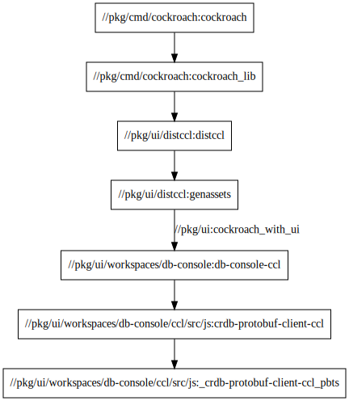

- Feature Name:
- Status: draft
- Start Date: 2021-04-23
- Authors: Andrii Vorobiov
- RFC PR: [#65924](https://github.com/cockroachdb/cockroach/pull/65924)
- Cockroach Issue:

# Summary

Migration from Make builds to Bazel build tool for the entire project is one of OKRAs which is aimed to
deliver the product in a timely and sustainable manner. This proposal outlines a subset of changes required to perform 
migration to Bazel build for DB Console (and UI related packages).

# Motivation

Migration should not affect the current build process with `Make` so it can be gradual (without
breaking changes).
The migration process can be broken down into the following parts:
- establish Bazel build for Db Console (with support for both OSS and CCL licensing);
- establish Bazel build and publishing artifacts to NPM registry for `cluster-ui` package;
- build `crdb-protobufjs-client` package for both CCL and OSS licences.

Bazel builds (comparing to Make build) allow defining granular steps which can be run independently for particular
package instead of the entire project, which in turn reduces the build time and a chain of unnecessary rebuilds for
unchanged parts of code.

Github `Bazel` project already includes following tasks related to migration to Bazel for Db Console   
- [build: Bazelize UI](https://github.com/cockroachdb/cockroach/issues/56068)
- [build: Get built UI to bindata (bazel)](https://github.com/cockroachdb/cockroach/issues/56069)
- [build,bazel: Implement JS protobuf support for Bazel](https://github.com/cockroachdb/cockroach/issues/59329)
- [build: Get bazel building both ccl and oss builds](https://github.com/cockroachdb/cockroach/issues/56071)

# Technical design

Current UI project has following dependencies

where:
- `*.proto` files are set of protobuf files that are required to build JS protobuf client code
- `ccl/oss` specifies build condition, whether the project is built for CCL or OSS licence
- `ccl protos/oss protos` - autogenerated JS protobuf client code
- `db-console` is main `ui` project
- `cluster-ui` is a nested `ui/cluster-ui` JS project
- `ui/(ccl|oss)/bidndata.go` - autogenerated Go sources that embed JS bundled files

#### Dependency graph of bazel rules:

Bazel build pipeline for UI can be broken down in following steps:
- Build protobuf js client code [db-console: bazel build for protobufjs clients #64065](https://github.com/cockroachdb/cockroach/pull/64065)
- `cluster-ui` standalone build (react + webpack project) 
- `db-console` standalone build (react + webpack project)
- embed JS assets into go libraries (`pkg/ui/distoss/distoss.go` and `pkg/ui/distccl/distccl.go`)

### Generate protobuf JS client code
Protobuf CCL and OSS packages are considered as an independent bazel builds. The installation of `protobufjs` package
requires additional steps to install required dependencies for protobufjs-cli tool. This problem persists in Makefile
as well and will be fixed with major release of protobufjs ver 7. Installation of dependencies and binding protobuf cli
is done according to example provided here: https://github.com/bazelbuild/rules_nodejs/tree/stable/examples/protobufjs.

### Build `db-console` and `cluster-ui` packages
`db-console` and `cluster-ui` are typescript packages which have their own webpack configuration to build production
bundle, run dev server and watch for changes.
To build these projects, additional project changes required:
- change relative paths for input and output files to be absolute paths in webpack configs because bazel resolves
  relative paths from workspace root dir (which is root of entire `cockroach` project)
- optional dependencies that are required only for web development and was defined as a separate NPM package (with its
own package.json file in `pkg/ui/opts`) is removed and dependencies are moved in `pkg/ui/workspaces/db-console/package.json`
under `optionalDependencies` section. Along with this, installation of NPM packages is performed with `--ignore-optional`
flag to prevent installation of optional during production builds (ie `yarn install --ignore-optional`).

### Refactor project structure to use Yarn workspaces
Existing project structure had multiple `node_modules` directories for different purposes. With Bazel, every 
`node_modules` is treated as separate external workspaces and with such configuration it restricts to use dependencies 
from single external workspace.

To overcome this limitation, project structure is refactored to use Yarn workspaces, it allows to hoist all common
dependencies to the top level in a single `node_modules` which is considered as a single external workspace for bazel.
- `rules_nodejs` doesn't support Yarn workspaces (https://github.com/bazelbuild/rules_nodejs/issues/266) but for now the
only limitation is that project specific dependencies are included in main workspaces rather than in external workspace.
- all hoisted dependencies can be accessed from single external workspace (`@npm`) and project specific dependencies are
bounded with `filegroup`'s.

### Embeding JS assets into go libraries
`go:embed` directive (available starting from ver 1.6) is used instead of `go-bindata` for embedding JS assets into 
go libraries. It simplifies build process for both Make and Bazel builds because it eliminates running external
commands to generate go sources with embedded data.

# Unresolved questions
- TBD
