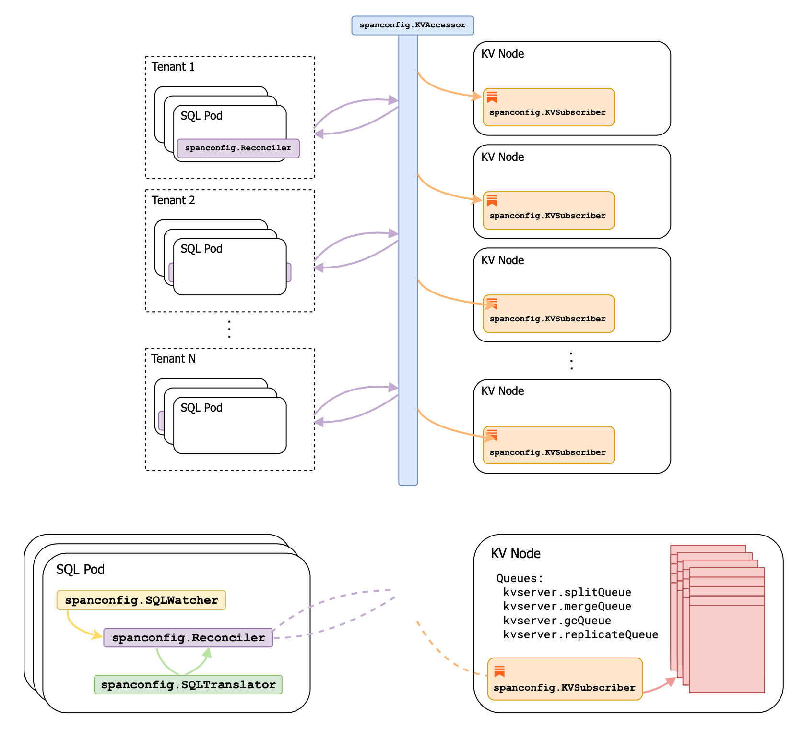

- Feature Name: Multi-tenant zone configs
- Status: completed 
- Start Date: 2021-06-10
- Authors: Irfan Sharif, Arul Ajmani
- RFC PR: [#66348](https://github.com/cockroachdb/cockroach/pull/66348)
- Cockroach Issue: [#67679][67679]

***NOTE: The work described in this RFC was implemented in parallel with it
going through the review process (see PRs linked from [#67679][67679]). As a
result, not all the comments/discussions from the review process and actual
implementation made its way back to this RFC, which is being merged "as-is" for
documentation purposes. Look towards `pkg/spanconfig` for an up-to-date
understanding of what's being described. That said, we've briefly annotated the
text with more current details/links.***

# Summary

Zone configs dictate data placement, replication factor, and GC behavior; they
power CRDB's multi-region abstractions. They're disabled for secondary tenants
due to scalability bottlenecks in how they're currently stored and
disseminated. They prevent writes before DDL in the same transaction due to its
use of gossip, implement inheritance and key-mapping by coupling KV and SQL in
an undesirable manner (making for code that's difficult to read and write), and
don't naturally extend to a multi-tenant CRDB.

This RFC proposes a re-work of the zone configs infrastructure to enable its
use for secondary tenants, and in doing so addresses the problems above. We
introduce a distinction between SQL zone configs (attached to SQL objects,
living in the tenant keyspace) and KV span configs (applied to arbitrary
keyspans, living in the host tenant), eschew inheritance for span configs, and
notify each KV node of span config updates through rangefeeds.

## Table of Contents

- [Background](#background)
- [Problems](#problems)
- [Technical Design](#technical-design)
    * [SQL zone configs vs. KV span configs](#sql-zone-configs-vs-kv-span-configs)
    * [KV span configs](#kv-span-configs)
    * [Enforcement of per-tenant limits](#enforcement-of-per-tenant-limits)
    * [Reconciliation between zone and span configs](#reconciliation-between-zone-and-span-configs)
        + [Why reconcile? Why not use the same txn for zone and span configs?](#why-reconcile--why-not-use-the-same-txn-for-zone-and-span-configs-)
        + [Reconciling only when there's work to be done](#reconciling-only-when-there-s-work-to-be-done)
        + [Ensuring mutual exclusion between pods](#ensuring-mutual-exclusion-between-pods)
    * [Generating span configs from zone configs](#generating-span-configs-from-zone-configs)
    * [Issuing targeted "diffs"](#issuing-targeted--diffs-)
    * [Pagination](#pagination)
    * [Collapsing adjacent span configs](#collapsing-adjacent-span-configs)
    * [Partial and full reconciliation](#partial-and-full-reconciliation)
    * [Reconciliation for inactive tenants](#reconciliation-for-inactive-tenants)
    * [Synchronous, semi-synchronous, and asynchronous reconciliation](#synchronous--semi-synchronous--and-asynchronous-reconciliation)
    * [Disseminating and applying span configs](#disseminating-and-applying-span-configs)
    * [Dealing with missing span configs](#dealing-with-missing-span-configs)
    * [Span config consistency guarantees](#span-config-consistency-guarantees)
    * [Declared, accepted, and applied zone configs](#declared--accepted--and-applied-zone-configs)
    * [Introspection](#introspection)
    * [Access to distinguished zone configs](#access-to-distinguished-zone-configs)
    * [Zone configs for locality optimized search](#zone-configs-for-locality-optimized-search)
    * [Migration](#migration)
    * [Drawbacks](#drawbacks)
- [Rationale and Alternatives](#rationale-and-alternatives)
    * [Decentralized span configs, and use of gossip](#decentralized-span-configs--and-use-of-gossip)
    * [Reconciling on the host tenant](#reconciling-on-the-host-tenant)
- [Future work](#future-work)
    * [De-duping `system.span_configurations`](#de-duping--systemspan-configurations-)
    * [Removing sub-zones](#removing-sub-zones)
    * [Capturing zone configs in backups](#capturing-zone-configs-in-backups)
- [Unresolved questions](#unresolved-questions)


# Background

Zone configs allow us to specify KV attributes (# of replicas, placement, GC
TTL, etc.) for SQL constructs. They have useful inheritance properties that let
us ascribe specific attributes to databases, tables, indexes or partitions,
while inheriting unset attributes from parent constructs or a `RANGE DEFAULT`
zone config. They're currently stored only on the host tenant in its
`system.zones` table, which in addition to a few other tables
(`system.descriptors`, `system.tenants`, etc.) form the `SystemConfigSpan`.
Whenever there's a zone config update, we gossip the _entire_
`SystemConfigSpan` throughout the cluster. Each store listens in on these
updates and applies it to all relevant replicas.


# Problems

The existing infrastructure (from how zone configs they're are stored, how
they're distributed, and how inheritance is implemented) doesn't readily extend
to multi-tenancy and was left unimplemented (hence this RFC!). This prevents
using CRDB's multi-region abstractions for secondary tenants. The current
infrastructure has operations that are `O(descriptors)`; with multi-tenancy we
expect an order of magnitude more descriptors and as such is unsuitable for it.

Zone configs, even without multi-tenancy, has a few problems:

1. The way we disseminate updates (written to `system.zones`) is by
   gossipping the entirety of the `SystemConfigSpan` whenever anything in the
   entire span gets written to. This mechanism is as it is because we also rely
   on gossiping updates to `system.descriptors` and `system.tenants`. This is
   so that each store is able to determine the appropriate split points for
   ranges: on the host tenant's table boundaries and on tenant boundaries. The
   similar need to disseminate updates resulted in us "conveniently" bunching
   them together. But gossiping the entire `SystemConfigSpan` on every write to
   anything in the span has very real downsides:
   - It requires us to scan the entire keyspan in order to construct the
     gossip update. This is an `O(descriptors + zone configs + tenants)`
     operation and prohibitively slow for a large enough `SystemConfigSpan` and
     frequent enough change.
   - To construct the gossip update, the leaseholder running the
     gossip-on-commit trigger needs to scan the entire `SystemConfigSpan`. For
     this reason, we've disallowed splitting the `SystemConfigSpan`.
   - To run the gossip-on-commit trigger on the leaseholder, we need to
     anchor any txn that writes to the `SystemConfigSpan` on a key belonging to
     the `SystemConfigSpan`. This prevents us from supporting txns that attempt
     to write arbitrary keys before issuing DDL statements.
   - Gossipping the entire `SystemConfigSpan` necessitates holding onto all
     the descriptors in memory (the "unit" of the gossip update is the entire
     `SystemConfigSpan`), which limits schema scalability ([#63206][63206]).

   The determination of split points and zone configs is the last remaining use
   of gossip for the `SystemConfigSpan`. We used to depend on it for [table
   leases][48159] and [cluster settings][58362] but no longer do.
2. Zone configs don't directly capture the parent-child relations between them; we
   instead rely on them being keyed using the `{Database,Table}Descriptor`
   ID<sup id="a2">[2](#f2)</sup>. For KV to determine what the inherited
   attributes are, it reaches back into SQL to traverse this tree of
   descriptors. Inheritance for indexes and partitions (where IDs are scoped
   only to the table they belong to) are consequently implemented using
   sub-zones. Between this and the KV+SQL cyclical dependency, it makes for
   unnecessarily complex code and smells of a faulty abstraction, hindering
   future extensions to zone configs.
   _(NB: We're not eliminating sub-zones in this RFC, but [pave the
   way](#removing-sub-zones) for doing so in the future.)_
3. Zone configs also don't directly capture the keyspans they're applied over.
   We rely on the same SQL descriptor+sub-zone traversal to determine what
   attributes apply over a given key range.

With multi-tenancy, we have a few more:

4. Zone configs are currently only stored on the host tenant's `system.zones`,
   which is keyed by the `{Database,Table}Descriptor` ID. These are tenant
   scoped, thus barring immediate re-use of the host tenant's `system.zones`
   for secondary tenants.
5. It should be possible for tenants to define divergent zone configs on
   adjacent tables. This will necessitate splitting on the table boundary. For
   the host tenant, KV unconditionally splits on all table/index/partition
   boundaries (by traversing the tree of SQL descriptors accessible through the
   `SystemConfigSpan`), so it's less of a problem. We don't do this for
   secondary tenants for two reasons:
   - Doing so would introduce an order-of-magnitude more ranges in the system
     (we've also disallowed tenants from setting manual split points:
     [#54254][54254], [#65903][65903]).
   - Where would KV look to determine split points? Today we consult the
     gossipped `SystemConfigSpan`, but it does not contain the tenant's
     descriptors. Since we can't assume splits along secondary tenant table
     boundaries, we'll need to provide a mechanism for KV to determine the
     split points implied by a tenant's zone configs.
6. Multi-tenant zone configs open us up to tenant-defined splits in KV. We'll
   have to tread carefully here; the usual concerns around admission control
   apply: protecting KV from malicious tenants inducing too many splits,
   ensuring that the higher resource utilization as a result of splits are
   somehow cost-attributed back to the tenant, and providing some level of
   tenant-to-tenant fairness.
7. The optimizer uses zone configs for [locality-aware planning][la-planning].
   Today it peeks into the cached gossip data to figure out which zone configs
   apply to which descriptors. We'll need to maintain a similar cache in
   secondary tenant pods.
8. We expose [conformance reports][conf-reports] to introspect how compliant we
   are to declared zone configs. Powering these reports are gossipped store
   descriptors and the gossiped `SystemConfigSpan`. Since secondary tenants are
   not part of the gossip network and continued usage of `SystemConfigSpan` is
   untenable, we'd have provide a mechanism for a similar kind of
   observability.


# Technical Design

We'll introduce the notion of a KV span config, distinguishing it from the zone
config we're familiar with today. Zone configs can be thought of as an
exclusively SQL level construct, span configs an exclusively KV one. Each
tenant's zone configs will be stored in the tenant keyspace, in the tenant's
own `system.zones`. Inheritance between zone configs will not straddle tenant
boundaries (each tenant gets its own `RANGE DEFAULT` zone config that all
others will inherit from). KV span configs will have no notions of inheritance;
they're simply attributes defined over a keyspan.

We'll store all span configs on the host tenant along with the spans they apply
over. This will let us derive split points (keys with diverging configs on
either side). Each active tenant's SQL pod(s) will asynchronously drive the
convergence between its zone configs and the cluster's span configs pertaining
to the tenant's keyspace, all through explicit KV APIs. The SQL pod, being SQL
aware, will be responsible for translating its zone configs to span configs by
spelling out the constituent keyspans and cascaded configs. When KV is told to
apply a set of span configs, it will perform relevant safety checks and
rate-limiting. Each KV server will establish a range feed over the table where
all span configs will be stored. Whenever there's an update, each store will
queue the execution of all implied actions (replication, splits, GC, etc).

***NOTE: The figure below shows what the actual component boundaries ended up
being.***



## SQL zone configs vs. KV span configs

With multi-tenant zone configs, it's instructive to start thinking about "SQL
zone configs" (abbrev. zcfgs) and "KV span configs" (abbrev. scfgs) as distinct
things.

1. A "SQL zone config" is something _proposed_ by a tenant that is not directly
   acted upon by KV; they correspond to the tenant's "desired state" of tenant
   data in the cluster. It's a tenant scoped mapping between its SQL objects
   and the cluster attributes it wants to apply over them. Updating a zcfg does
   not guarantee the update will be applied immediately, if at all (see
   discussion [below](#declared-accepted-and-applied-zone-configs)). Only
   zcfgs need to capture inheritance semantics, it's what lets users apply a
   zcfg on a given SQL object (say, a table) and override specific attributes
   on child SQL objects (say, a partition). We want users to be able to change
   a parent attribute, which if left unset on the child SQL object, should
   automatically [cascade][cascade] to it.
2. A "KV span config" by contrast is one that _actually_ influences KV
   behavior. It refers to arbitrary keyspans and is agnostic to tenant
   boundaries or SQL objects (though it ends up capturing the keyspans implied
   by SQL zone configs -- we can think of span configs as a subset of all zone
   configs).

This is not a distinction that exists currently. In the host tenant today,
whenever a zcfg is committed (to `system.zones`), it's immediately considered
by KV (nodes all hear about the updates through gossip and start acting on
them). This lack of separation necessitated a KV understanding of SQL encoding.
The coupling to SQL descriptors also meant KV ended up (unwittingly) adopting
the same inheritance complexity found in SQL. This needn't be the case.
Introducing a separation helps us avoid config inheritance in KV and also
prevent tenants from directly inducing expensive KV actions (replication,
splits, GC). Finally, it carves out a natural place to attribute costs for
these actions (based on I/O for e.g.) and to enforce per-tenant limits
accordingly.

If a tenant (including the host) were to successfully `ALTER TABLE ...
CONFIGURE ZONE`, they would be persisting a zcfg. The tenant's SQL pods will
later inform KV of the persisted zcfg, which if accepted, would also be
persisted as a scfg. KV servers only care about scfgs, and on hearing about
changes to them, execute the implied actions. A periodic reconciliation loop
will be responsible for promoting zcfgs to scfgs. More on this later.


## KV span configs

All scfgs will be stored on the host tenant under a (new)
`system.span_configurations` table. The translation from zcfgs to scfgs will be
discussed [below](#reconciliation-between-zone-and-span-configs).

```sql
CREATE TABLE system.span_configurations (
    start_key    BYTES NOT NULL,  -- inclusive
    end_key      BYTES NOT NULL,  -- exclusive
    config        BYTES NOT NULL,  -- marshaled span config proto
    CONSTRAINT "primary" PRIMARY KEY (start_key),
    CONSTRAINT check_bounds CHECK (start_key < end_key),
    FAMILY "primary" (start_key, end_key, config)
)
```

```protobuf
// SpanConfig holds configuration that applies over a span. It has a similar
// schema to zonepb.ZoneConfig, but without the inheritance complexity.
message SpanConfig {
  int64 range_min_bytes // = ...
  int64 range_max_bytes // = ...
  int32 num_replicas    // = ...
  int32 num_voters      // = ...
  bool  global_reads    // = ...
  GCPolicy gc_policy    // = ...
  repeated ConstraintsConjunction constraints       // = ...
  repeated ConstraintsConjunction voter_constraints // = ...
  repeated LeasePreference lease_preferences        // = ...
}
```

This is a "flat" structure. There's no notion of scfgs inheriting from one
another, obviating a need for IDs, optional/unset-or-empty fields, or sub-zone
like structures. The spans in `system.span_configurations` are non-overlapping.
Adjacent spans in the table will either have diverging scfgs or will belong to
different tenants. This schema gives us a convenient way to determine what
attributes apply to a given key/key-range, and also helps us answer what the
split points are: the set of all `start_key`s.

Removing inheritance at the KV level does mean that changing the zcfg of a
parent SQL descriptor would potentially incur writes proportional to the number
of child descriptors. We think that's fine, they're infrequent enough
operations that we should be biased towards propagating the dependency to all
descendant descriptor spans. It simplifies KV's data structures, and
inheritance semantics are contained only within the layer (SQL) that already
has to reason about it. 


## Enforcement of per-tenant limits

Supporting zcfgs for secondary tenants implies supporting tenant-defined range
splits. To both protect KV and to ensure that we can fairly cost tenants based
on resource usage (tenants with the same workload but with differing number of
tenant-defined splits will stress KV differently), we'll want to maintain a
counter for the number of splits implied by a tenant's set of scfgs.

```sql
CREATE TABLE system.span_configurations_per_tenant (
    tenant_id               INT,
    num_span_configurations INT,
)
```

When a tenant attempts to promote their current set of zcfgs to scfgs (see
[below](#reconciliation-between-zone-and-span-configs), we'll transactionally
consult this table for enforcement and update it if accepted. We'll start off
simple, with a fixed maximum allowed number of tenant-defined splits. If the
proposed set of scfgs implies a number of splits greater than the limit, we'll
reject it outright.  In addition to limiting the number of tenant defined
splits, we'll also validate the configs themselves (preventing an absurdly high
replication factor, or an absurdly low GC TTL).

If later we want to allow more fine-grained control over specific tenant
limits, we can consult limits set in another table writable only by the host
tenant.

***NOTE: This was left to near-future work. An alternate design where "split
quota" is leased and checked for when committing zone configs, is tracked in
[#70555][scfgs-limits].***


## Reconciliation between zone and span configs

We want each tenant to be able to promote its zcfgs to the cluster's scfgs.
Instead of showing how we arrived at the APIs below, we'll show how it achieves
various stated goals. We'll introduce the following RPCs to `roachpb.Internal`:

```protobuf
message SpanConfigEntry {
  Span       span // = ...
  SpanConfig span_config // = ...
};

message GetSpanConfigsRequest {
  repeated Span spans // = ...
};

message GetSpanConfigsResponse {
  repeated SpanConfigEntry span_config_entries // = ...
};

message UpdateSpanConfigsRequest {
  repeated Span to_delete // = ...
  repeated SpanConfigEntry to_upsert // = ...
};

message UpdateSpanConfigsResponse { };
message GetSpanConfigLimitsRequest { };
message GetSpanConfigLimitsResponse { };

service Internal {
  // ...
  rpc GetSpanConfigs(GetSpanConfigsRequest) returns (GetSpanConfigsResponse) { }
  rpc UpdateSpanConfigs(UpdateSpanConfigsRequest) returns (UpdateSpanConfigsResponse) { }
  rpc GetSpanConfigLimits(GetSpanConfigLimitsRequest) returns (GetSpanConfigLimitsResponse) { }
}
```

***NOTE: The actual protos can be found under
[`roachpb/span_config.proto`][span-config-proto]. These RPCs are invoked through
`spanconfig.KVAccessor` (backed internally by `system.span_configurations`):***

```go
// KVAccessor mediates access to KV span configurations pertaining to a given
// tenant.
type KVAccessor interface {
	// GetSpanConfigEntriesFor returns the span configurations that overlap with
	// the given spans.
	GetSpanConfigEntriesFor(
		ctx context.Context,
		spans []roachpb.Span,
	) ([]roachpb.SpanConfigEntry, error)

	// UpdateSpanConfigEntries updates configurations for the given spans. This
	// is a "targeted" API: the spans being deleted are expected to have been
	// present with the exact same bounds; if spans are being updated with new
	// configs, they're expected to have been present with the same bounds. When
	// divvying up an existing span into multiple others with distinct configs,
	// callers are to issue a delete for the previous span and upserts for the
	// new ones.
	UpdateSpanConfigEntries(
		ctx context.Context,
		toDelete []roachpb.Span,
		toUpsert []roachpb.SpanConfigEntry,
	) error
}
```


### Why reconcile? Why not use the same txn for zone and span configs?

We don't want to have zcfgs and scfgs be written to as part of the same txn
because of where they're stored (one in the tenant keyspace, one in the host
tenant). Using the same txn would mean using a txn that straddles tenant
boundaries, which opens up the possibility for tenants to leave intents in the
host tenant's keyspace -- an undesirable property for multi-tenant CRDB. See
[alternatives](#rationale-and-alternatives) for a scheme where a tenant's scfgs
are stored in the tenant keyspace, which could've let us share the same txn to
persist scfgs.

Ideally we'd be able to atomically commit both zcfgs and scfgs, persisting
neither if either is disallowed ("scfgs are not accepted by KV due to limits").
Given the writes occur in separate txns, we'd need to some sort of two-phase
commit, persisting zcfgs and scfgs individually as "staged" writes, only later
marking them as fully committed. What we're describing is a transactional
schema changer straddling tenant boundaries, but limited to only using
tenant-scoped txns -- sounds awful.

We're left with reconciliation instead -- at best we're able to reconcile after
we've committed zcfgs. We have a few choices for how we could surface "KV
rejects scfgs" errors, see
[below](#synchronous-semi-synchronous-and-asynchronous-reconciliation).


### Reconciling only when there's work to be done

The reconciliation job (described
[below](#ensuring-mutual-exclusion-between-pods)) will establish rangefeeds
over `system.{descriptors,zones}` to learn about descriptor and zcfg updates,
and periodically checkpoint to reduce redundant work. It'll then react to each
update as described [below](#generating-span-configs-from-zone-configs). The
alternative would be to periodically poll each table for changes.

***NOTE: We watch for SQL updates using `spanconfig.SQLWatcher`:***

```go
// SQLWatcher watches for events on system.zones and system.descriptors.
type SQLWatcher interface {
	// WatchForSQLUpdates watches for updates to zones and descriptors starting
	// at the given timestamp (exclusive), informing callers periodically using
	// the given handler[1] and a checkpoint timestamp. The handler is invoked:
	// - serially, in the same thread where WatchForSQLUpdates was called;
	// - with a monotonically increasing timestamp;
	// - with updates from the last provided timestamp (exclusive) to the
	//   current one (inclusive).
	//
	// If the handler errors out, it's not invoked subsequently (and internal
	// processes are wound down accordingly). Callers are free to persist the
	// checkpoint timestamps and use it to re-establish the watcher without
	// missing any updates.
	//
	// [1]: Users should avoid doing expensive work in the handler.
	WatchForSQLUpdates(
		ctx context.Context,
		startTS hlc.Timestamp,
		handler func(ctx context.Context, updates []DescriptorUpdate, checkpointTS hlc.Timestamp) error,
	) error
}

// DescriptorUpdate captures the ID and type of a descriptor or zone that the
// SQLWatcher has observed updated.
type DescriptorUpdate struct {
	// ID of the descriptor/zone that has been updated.
	ID descpb.ID

	// DescriptorType of the descriptor/zone that has been updated. Could be either
	// the specific type or catalog.Any if no information is available.
	DescriptorType catalog.DescriptorType
}
```

### Ensuring mutual exclusion between pods

In multi-tenant CRDB, each active tenant can have one or more SQL pods talking
to the shared KV cluster. Every tenant will have a single "manager" pod
responsible for reconciling the tenant's zcfgs with the cluster's scfgs
pertaining to the tenant's keyspan. We'll use the jobs infrastructure to
actually run the reconciliation loop, giving us mutual exclusion,
checkpointing/resumption, and basic observability. We'll differ from the usual
jobs mold in a few ways:
- since it's a system initiated process, the job will have to be
  non-cancellable
- the job should never never enter terminal states ("succeeded"/"failed"),
  and instead be perpetually "running", reacting to rangefeed events and
  reconciling as required
- we'll checkpoint using the timestamp we most recently read
  `system.{descriptors,zones}` from during reconciliation

All pods will be able to see who the current leaseholder is, the duration of
its lease, and in the event of leaseholder failure, attempt to acquire a fresh
one. To ensure mutual exclusion, the `UpdateSpanConfigRequest`s will include a
transaction [commit deadline][commit-deadline] equal to the expiration time of
the current lease. We also this pattern in SQL [schema leases][schema-leases].

***NOTE: We ended up introducing a singleton [`AUTO SPAN CONFIG
RECONCILIATION`][spanconfig-mgr] job type that transactionally ensures no other
instances of the job exists before running.***


## Generating span configs from zone configs

Generating scfgs from a set of zcfgs entails creating a list of non-overlapping
spans and the corresponding set of attributes to apply to each one. The
rangefeed will point us to the descriptors that have been updated; for each one
we'll traverse up and down its tree of descriptors, capture their keyspans, and
materialize a scfg by cascading inherited attributes.

***NOTE: This translation of hierarchical SQL state to flattened KV state happens
through the `spanconfig.SQLTranslator`:***

```go
// SQLTranslator translates SQL descriptors and their corresponding zone
// configurations to constituent spans and span configurations.
//
// Concretely, for the following zone configuration hierarchy:
//
//    CREATE DATABASE db;
//    CREATE TABLE db.t1();
//    ALTER DATABASE db CONFIGURE ZONE USING num_replicas = 7;
//    ALTER TABLE db.t1 CONFIGURE ZONE USING num_voters = 5;
//
// The SQLTranslator produces the following translation (represented as a diff
// against RANGE DEFAULT for brevity):
//
// 		Table/5{3-4}                  num_replicas=7 num_voters=5
type SQLTranslator interface {
	// Translate generates the span configuration state given a list of
	// {descriptor, named zone} IDs. No entry is returned for an ID if it
	// doesn't exist or if it's dropped. The timestamp at which the translation
	// is valid is also returned.
	//
	// For every ID we first descend the zone configuration hierarchy with the
	// ID as the root to accumulate IDs of all leaf objects. Leaf objects are
	// tables and named zones (other than RANGE DEFAULT) which have actual span
	// configurations associated with them (as opposed to non-leaf nodes that
	// only serve to hold zone configurations for inheritance purposes). Then,
	// for each one of these accumulated IDs, we generate <span, span
	// config> tuples by following up the inheritance chain to fully hydrate the
	// span configuration. Translate also accounts for and negotiates subzone
	// spans.
	Translate(ctx context.Context, ids descpb.IDs) ([]roachpb.SpanConfigEntry, hlc.Timestamp, error)
}
```

## Issuing targeted "diffs"

The reconciliation loop will only update mismatched entries in scfgs by issuing
targeted "diffs" to apply through the `UpdateSpanConfigs` RPC. When learning
about descriptor/zcfg updates, it will construct the corresponding set of span
configs as described above. It will compare it against the actual set stored in
KV, retrieved using using the `GetSpanConfigs` RPC. If there's reconciliation
to be done, we'll construct the appropriate `UpdateSpanConfigsRequest`. This
scheme lets us avoid needing to hold onto all descriptors in memory, the
[pagination](#pagination) allows us to make incremental progress. See [partial
and full reconciliation](#partial-and-full-reconciliation) for a discussion on
how these partial diffs interact with the overall limits set for the tenant.

The alternative would be to "bulk update" the full set of scfgs, by having KV
first delete all relevant scfgs and inserting whatever was specified -- an
unnecessarily expensive way to achieve the same thing.

***NOTE: See `spanconfig.KVAccessor` above.***

## Pagination

The lifetime of the txns on the KV side, backing each RPC, will never outlive the
lifetime of the RPC itself. `GetSpanConfigsRequest` specifies the span we're
interested in, and can be used to paginate through all the scfgs pertaining to
a given tenant/set of descriptors. `UpdateSpanConfigs` is also
pagination-friendly; we can send batch the set diffs we need to apply without
having to specify all of it at once. This API makes it possible for a zcfg to
be partially accepted by KV, and [partially
applied](#declared-accepted-and-applied-zone-configs). The latter is already
presently true. Discussed
[below](#synchronous-semi-synchronous-and-asynchronous-reconciliation) are the
conservative, best effort checks to ensure that committed zcfgs remain very
unlikely to be rejected by KV.

***NOTE: We didn't implement any sort of batching/pagination; this was left as
near-future work.***


## Collapsing adjacent span configs

We can process the list of non-overlapping spans-to-scfgs to coalesce adjacent
spans with the same effective scfg. This will reduce the number of splits
induced in KV while still conforming to the stated zcfgs. It's worth noting
that this is not how things work today in the host tenant -- we unconditionally
split on all table/index/partition boundaries even if both sides of the split
have the same materialized zcfg. We could skip this post-processing step for
the host tenant to preserve existing behavior, though perhaps it's a [desirable
improvement][66063].

***NOTE: This was left as [future work][coalesce-scfgs].***

## Partial and full reconciliation

Given the client is able to send "batches" of diffs, each executed in its own
txn, makes it possible for us exceed the per-tenant limit part-way through
reconciliation even if at the end we would've been well under it. We'll choose
not to do anything about it, relying on the fact that hitting these limits
should be exceedingly rare in practice with the safeguards described
[below](#synchronous-semi-synchronous-and-asynchronous-reconciliation).

The alternative where we accept the entire set of scfg diffs or nothing at
all could mean that a single "poisoned" zcfg would prevent KV from
accepting/applying other saner ones, which doesn't seem any better or easy to
reason about.

***NOTE: We're able to make incremental progress through the
`spanconfig.Reconciler`, doing "full reconciliation" only when necessary.***

```go
// Reconciler is responsible for reconciling a tenant's zone configs (SQL
// construct) with the cluster's span configs (KV construct). It's the
// central engine for the span configs infrastructure; a single Reconciler
// instance is active for every tenant in the system.
type Reconciler interface {
  // Reconcile starts the incremental reconciliation process from
  // the given checkpoint. If it does not find MVCC history going
  // far back enough[1], it falls back to a scan of all
  // descriptors and zone configs before being able to do more
  // incremental work. The provided callback is invoked with
  // timestamps that can be safely checkpointed. A future
  // Reconciliation attempt can make use of this timestamp to
  // reduce the amount of necessary work (provided the MVCC
  // history is still available).
  //
  // [1]: It's possible for system.{zones,descriptor} to have been
  //      GC-ed away; think suspended tenants.
  Reconcile(
    ctx context.Context,
    checkpoint hlc.Timestamp,
    callback func(checkpoint hlc.Timestamp) error,
  ) error
}
```


## Reconciliation for inactive tenants

The SQL pod driven reconciliation loop makes it possible that zcfgs for
inactive tenants are not acted upon. We think that's fine, especially given
that there's a distinction between a zcfg being persisted/configured, and it
being [applied](#declared-accepted-and-applied-zone-configs). Also, see
[alternatives](#rationale-and-alternatives) below for a scheme where the SQL
pod is not responsible for the reconciliation.


## Synchronous, semi-synchronous, and asynchronous reconciliation

We have a few options for how we could surface scfgs-rejected-by-kv errors to
the user, and they're tied to how synchronously the reconciliation loop is run.

- *synchronous*: the request writing the zcfg could be in-charge of running the
  reconciliation loop. After having run it, it would know of whatever error was
  raised (if any), and be able to surface that to the user.
- *semi-synchronous*: the request writing the zcfg could poll the
  reconciliation job to see what its last resolved timestamp was, the timestamp
  up until which it had attempted a reconciliation. We could poll until the
  resolved timestamp was ahead of the timestamp at which we had committed the
  zcfg, and return the error state if any.
- *asynchronous*: we could give up on trying to capture errors in the request
  path, and surface reconciliation errors through conformance reports or
  similar (see [introspection](#introspection))

It's worth nothing that none of these errors can be automatically acted on by
the system. Given the zcfgs have been fully committed by the time we raise
these errors, it's difficult for us to automatically undo the work by revert
the set of schema changes/zcfgs that brought us to this error state.
Consequently we think that this ability to surface errors to the requests
persisting zcfgs, while important, is similar in spirit to other ideas around
[introspection](#introspection), and is better suited for future work.

Still, that leaves us with the possibility that tenants might be able to find
themselves in this error state, and one that's difficult to recover from (which
zcfgs are the largest offendors? which tables/partitions/indexes that they're
applied over should the user drop?). With multi-region, users may not even be
setting these zcfgs directly, and it seems poor UX to let the system let the
user create a large number of multi-region tables following which it's unable
to actually accept/apply the necessary zcfgs.

We'll instead perform a best-effort limit check using the `GetSpanConfigLimits`
RPC before committing the DDL/zcfg change, ensuring that we'd be well under it,
and aborting the txn outright if we aren't.

***NOTE: We've moved towards a scheme where "split quota" is leased from KV and
checked against cheaply in each pod when committing zone configs/descriptor
changes. This was left for future work, tracked in [#70555][scfgs-limits].***


## Disseminating and applying span configs

KV servers want to hear about updates to scfgs in order to queue up the actions
implied by said updates. Each server will establish a rangefeed on the host
tenant's `system.span_configurations` table and use it maintain an in-memory
data structure with the following interface:

```go
type SpanConfig interface {
  GetConfigFor(key roachpb.Key) roachpb.SpanConfig
  GetSplitsBetween(start, end roachpb.Key) []roachpb.Key
}
```

Consider a naive implementation: for every `<span, scfg>` update, we'll insert
into a sorted tree keyed on `span.start_key`. We could improve the memory
footprint by de-duping away identical scfgs, referring to some unique ID in
each tree node. Each store could only consider the updates for the keyspans it
cares about (by looking at the set of tenants whose replicas we contain, or
look at replica keyspans directly). If something was found to be missing in the
cache, we could fall back to reading from the host tenant's
`system.span_configurations`. The store could also periodically persist this
cache (along with the rangefeed checkpoint); on restarts it would then be able to
continue where it left off. We'll use rangefeed checkpoints to ensure that
updates to scfgs will be seen in order. For a zcfg update that results in
multiple scfg updates, they'll all be seen all at once.

***NOTE: We used `spanconfig.KVSubscriber` for the per-KV node component
maintaining a consistent snapshot of global span configuration state (i.e.
`system.span_configurations`):***

```go
// KVSubscriber presents a consistent[1] snapshot of a StoreReader that's
// incrementally maintained with changes made to the global span configurations
// state (system.span_configurations). The maintenance happens transparently;
// callers can subscribe to learn about what key spans may have seen a
// configuration change. After learning about a span update through a callback
// invocation, subscribers can consult the embedded StoreReader to retrieve an
// up-to-date[2] config for the updated span. The callback is called in a single
// goroutine; it should avoid doing any long-running or blocking work.
//
// When a callback is first installed, it's invoked with the [min,max) span --
// a shorthand to indicate that subscribers should consult the StoreReader for all
// spans of interest. Subsequent updates are of the more incremental kind. It's
// possible that the span updates received are no-ops, i.e. consulting the
// StoreReader for the given span would still retrieve the last config observed
// for the span[3].
//
// [1]: The contents of the StoreReader at t1 corresponds exactly to the
//      contents of the global span configuration state at t0 where t0 <= t1. If
//      the StoreReader is read from at t2 where t2 > t1, it's guaranteed to
//      observe a view of the global state at t >= t0.
// [2]: For the canonical KVSubscriber implementation, this is typically lagging
//      by the closed timestamp target duration.
// [3]: The canonical KVSubscriber implementation is bounced whenever errors
//      occur, which may result in the re-transmission of earlier updates
//      (typically through a coarsely targeted [min,max) span).
type KVSubscriber interface {
	StoreReader
	Subscribe(func(updated roachpb.Span))
}
```

Aside from the rangefeed, internally it makes use of a span oriented data
structure:

```go
// Store is a data structure used to store spans and their corresponding
// configs.
type Store interface {
	StoreWriter
	StoreReader
}

// StoreWriter is the write-only portion of the Store interface.
type StoreWriter interface {
	// Apply applies a batch of non-overlapping updates atomically[1] and
	// returns (i) the existing spans that were deleted, and (ii) the entries
	// that were newly added to make room for the batch.
	//
	// Span configs are stored in non-overlapping fashion. When an update
	// overlaps with existing configs, the existing configs are deleted. If the
	// overlap is only partial, the non-overlapping components of the existing
	// configs are re-added. If the update itself is adding an entry, that too
	// is added. This is best illustrated with the following example:
	//
	//                                        [--- X --) is a span with config X
	//                                        [xxxxxxxx) is a span being deleted
	//
	//  Store    | [--- A ----)[------------- B -----------)[---------- C -----)
	//  Update   |             [------------------ D -------------)
	//           |
	//  Deleted  |             [------------- B -----------)[---------- C -----)
	//  Added    |             [------------------ D -------------)[--- C -----)
	//  Store*   | [--- A ----)[------------------ D -------------)[--- C -----)
	//
	// Generalizing to multiple updates:
	//
	//  Store    | [--- A ----)[------------- B -----------)[---------- C -----)
	//  Updates  |             [--- D ----)        [xxxxxxxxx)       [--- E ---)
	//           |
	//  Deleted  |             [------------- B -----------)[---------- C -----)
	//  Added    |             [--- D ----)[-- B --)         [-- C -)[--- E ---)
	//  Store*   | [--- A ----)[--- D ----)[-- B --)         [-- C -)[--- E ---)
	//
	// [1]: Unless dryrun is true. We'll still generate the same {deleted,added}
	//      lists.
	Apply(ctx context.Context, dryrun bool, updates ...Update) (
		deleted []roachpb.Span, added []roachpb.SpanConfigEntry,
	)
}

// StoreReader is the read-only portion of the Store interface. It doubles as an
// adaptor interface for config.SystemConfig.
type StoreReader interface {
	NeedsSplit(ctx context.Context, start, end roachpb.RKey) bool
	ComputeSplitKey(ctx context.Context, start, end roachpb.RKey) roachpb.RKey
	GetSpanConfigForKey(ctx context.Context, key roachpb.RKey) (roachpb.SpanConfig, error)
}

// Update captures a span and the corresponding config change. It's the unit of
// what can be applied to a StoreWriter.
type Update struct {
    // Span captures the key span being updated.
    Span roachpb.Span

    // Config captures the span config the key span was updated to. An empty
    // config indicates the span config being deleted.
    Config roachpb.SpanConfig
}
```


## Dealing with missing span configs

It's possible for a KV server to request the span configs for a key where that
key is not yet declared in the server's known set of scfgs. The spans captured
`system.span_configurations` are only the "concrete" ones, for known
table/index/partition descriptors. Seeing as how we're not implementing
inheritance, there's no "parent" scfg defined at database level to fall back
on. Consider the data for a new table, where that table's scfg has not yet
reached the store containing its replicas. This could happen through a myriad
of reasons: the duration between successive attempts by a SQL pod to update its
scfgs, latency between a scfg being persisted and a KV server finding out about
it through the rangefeed, etc. To address this, we'll introduce a global,
static scfg to fall back on when nothing more specific is found. Previously the
fallback was the parent SQL object's zone config, but that's no longer
possible. It's worth noting that previously, because we were disseminating
zcfgs through gossip, it was possible for a new table's replicas to have
applied to them the "stale" zcfgs of the parent database. If the "global"
aspect of this fallback scfg proves to be undesirable, we can make this
per-tenant by store the tenant's `RANGE DEFAULT` zcfg explicitly in
`system.span_configurations` and using it as a fallback. It might just be worth
doing this right away to capture tenant boundaries as part of `start_key`s
(what KV considers as split points, see [above](#storing-kv-zone-configs)).

***NOTE: We just ended up using a static fallback span config.***

## Span config consistency guarantees

For the config applied to a given key, we can summarize its consistency
guarantee as follows: it will observe either a default scfg constructed using
the tenant's `RANGE DEFAULT` zcfg, or a committed scfg over that keyspace.
Updates to scfgs will always be seen in order.


## Declared, accepted, and applied zone configs

With the introduction of per-tenant zcfg limits, it's possible for a tenant's
proposed set of zcfgs to never be accepted by KV. Because the reconciliation
between zcfgs and scfgs happens asynchronously, it poses difficult questions
around how exactly we'd surface this information to the user. How's a tenant to
determine that they've run into split limits, and need to update the
schema/zcfgs accordingly? We expect that the best-effort limit checking
described
[above][#synchronous-semi-synchronous-and-asynchronous-reconciliation] makes it
unlikely for users to get into the state where KV is rejecting their zcfgs.

We'll note that a form of this problem already exists -- it's possible today to
declare zcfgs that may never be fully applied given the cluster's current
configuration. There's also a duration between when a zcfg is declared and when
it has fully been applied. So there already exists a distinction between a zcfg
being simply "declared" (persisted to `system.zones`) and it being fully
"applied" (all replicas conform to declared zcfgs). The only API we have today
to surface this information are our [conformance reports][conf-reports]. As we
start thinking more about compliance, we'll want to develop APIs that capture
whether or not a set of zcfgs have been fully applied, or to be able to wait
until a zcfg has. 

***NOTE: With our shift in thinking towards leased ["split
quota"][scfgs-limits], some of this discussion is moot. That said, we still want
to surface conformance reports for secondary tenants -- future work that's
tracked [here][tenant-conf-reports].***

## Introspection

CRDB has facilities to inspect declared zone configs (`SHOW ZONE CONFIGURATIONS
FOR ...`). Since they only concern themselves with zcfgs, they'll be left
unharmed and can provide the same functionality for tenants. They'll simply use
each tenant's `system.zones` for consultation.

We also have facilities to observe [conformance][conf-reports] to the declared
zone configs ("has it been fully applied?"). They're currently they're powered by
gossipped store descriptors, and given secondary tenant pods are not part of
the gossip network, we'll want to provide a similar mechanisms for
introspection. The decomposition between scfgs and zcfgs makes it possible for
KV to be conformant to last-accepted scfgs, but for them to be lagging behind
the corresponding zcfgs (either due to the reconciliation lag, or because KV's
rejected the latest zcfgs).

We should then re-define "conformance" as the conjunction of scfgs being
fully applied, and of successful reconciliation between zcfgs and the tenant's
correponding scfgs. To inspect whether or not scfgs are conformant, we can
expose a KV API for each tenant to be able to surface KV's subset of
conformance report data pertaining to the tenant's range. KV would generate
these reports periodically, as it does today, every
`kv.replication_reports.interval`. For visibility into the reconciliation
status between a tenant's zcfgs and the last set of accepted scfgs, we'll
have the reconciliation job log any (unlikely) scfgs-rejected-by-kv
errors, and use the existing jobs observability infrastructure to surface the
state.


## Access to distinguished zone configs

CRDB has few distinguished zone configs for special CRDB-internal keyspans
`RANGE {META, LIVENESS, SYSTEM, TIMESERIES}`. These will only live on the host
tenant; secondary tenants will not be able to read/write to them. Each tenant
will still be able to set zone configs for their own `DATABASE system`, which
only apply to the tenant's own system tables.


## Zone configs for locality optimized search

The optimizer needs access to zcfgs to generate locality optimized plans. Today
it uses the gossiped `SystemConfigSpan` data to access the descriptor's
(potentially stale) zcfg. But as described in [Problems](#problems) above, use
of gossip has proven to be pretty untenable and is now going away. Also with
multi-tenancy, SQL pods are not part of the gossip network. In order to
continue providing access to zcfgs, we'll simply cache them in the catalog
layer and associate them with descriptors.

***NOTE: Left for near-future work; tracked [here][locality-aware-tenant].***


## Migration

The complexity here is primarily around the host tenant's existing use of
zcfgs. Secondary tenants can't currently use zcfgs so there's nothing to
migrate -- when running the new version SQL pod, talking to an already migrated
KV cluster, they'll simply be able to set zone configs, now powered by the
cluster's use of scfgs. To migrate the host tenant to start using
the new zcfgs infrastructure, we'll need to migrate KV to start using the new
(rangefeed driven) scfgs instead.

We'll first introduce the `system.span_configurations` table as a standard
system table migration (prototyped [here][66402]). For the rest, we'll use the
[long-running migrations][48843] framework. We'll first introduce a cluster
version `v21.1-A`, which when rolled into<sup id="a1">[1](#f1)</sup>, will
initiate a reconciliation run to populate `system.span_configurations` for all
available descriptors, checkpointing with the timestamp it read from
`system.{descriptors,zones}`. Next we'll fan out to each store in the cluster,
prompting it to establish a rangefeed over the table. Each store will
(re-)apply all scfgs, as observed through the rangefeed, and hence forth
discard updates received through gossip. It can also stop gossipping updates
when the `SystemConfigSpan` is written to. Finally, we'll roll the cluster
over to `v21.1-B` and unblock future reconcilation attempts, picking up from
the checkpoint we left off. Going forward KV will be using scfgs exclusively.


## Drawbacks

There are a lot of moving parts, though most of it feels necessary.


# Rationale and Alternatives


## Decentralized span configs, and use of gossip

We could store limits and a tenant's scfgs in the tenant keyspace. We
could use either gossip to disseminate updates to all these keys or
rangefeeds established over T tenant spans. This would entail persisting
"KV's internal per-tenant state" in each tenant's keyspace, instead of it
being all in one place. This would simplify the reconciliation process
described above, where we'd be able to transactionally determine whether or
not a zcfg is accepted. On the other hand, it complicates KV and how it would
learn about what span config to apply to a given key.

If zone configs are spread across the keyspace, in each tenant, we'd have to
establishing T rangefeeds per store -- which feels excessive and
cost-prohibitive. We'd also need each store to establish rangefeeds for
new tenants, and drop rangefeeds for dropped ones. We'd also need to maintain
the per-tenant limits counter in each tenant's keyspace. We don't currently
have the notion of distinguished keyspaces in the tenant boundary,
inaccessible to the tenant directly, usable only by the host tenant -- we'd
need to introduce it if we went down this way.

We could also use of gossip to disseminate zone config updates, which feels
more natural if it's spread out over T keyspaces. However, use of gossip is
made complicated due to its lack of ordering guarantees. If we individually
gossip each zcfg entry, stores might react to them out of order, and be in
indeterminate intermediate states while doing so.

Gossip updates are also executed as part of the commit trigger; untimely
crashes make it possible to avoid gossipping the update altogether. To
circumvent the ordering limitations and acting on intermediate states, we
could gossip the entire set of tenant's zcfgs all at once. We could also
gossip just a notification, and have each store react to by reading from kv
directly. The possibility of dropped updates would however necessitate
periodic polling from each store, and for each store to read from T keyspans
to reconstruct in-memory state of zcfgs upon restarts. It feels much easier
to simply use rangefeeds over a single keyspan instead.


## Reconciling on the host tenant

For the reconciliation loop, if we didn't want the SQL pod to drive it, the
system tenant/some process within KV could peek into each tenant's keyspace in
order to apply its zcfgs. The breaching of tenant boundaries feels like a
pattern we'd want to discourage. Also, it's unclear how errors from this KV
reconciliation process would be communicated back to the SQL pod.


# Future work

- We can't currently define [zcfgs on schema objects][57832]. We could now, if
  we're storing zcfgs in descriptors directly.
- For sequences, we might want them to be in the same ranges as the tables
  they're most frequently used in tandem with. Now that we're not
  unconditionally splitting on table boundaries, we could be smarter about
  this.
  - For the host tenant we also unconditionally split around the sequence
    boundary. Given they're just MVCC counters, that feels excessive. If we're
    coalescing adjacent spans based only on scfgs, we could coalesce multiple
    sequences into the same range.
- This RFC de-specializes the `SystemConfigSpan`; we can remove all the special
  logic around it in future releases.
- We could support defining manual splits on table boundaries for secondary
  tenants ([#65903][65903])
- We could avoid unconditionally splitting on table boundaries on the host
  tenant ([#66063][66063])
- See discussion [above](#declared-accepted-and-applied-zone-configs). We want
  to provide APIs to observe whether or not a declared zcfg has been accepted, and
  or if so, if it has been applied. If it wasn't accepted, we'd want to surface
  what's preventing it (is due to the number of splits? something else?). We
  can't guarantee that a declared zcfg has been instantaneously conformed
  to/applied, but we can provide the guarantee that once a zcfg has been fully
  applied, we won't execute placement decisions running counter to that zcfg.
  That feels like a useful primitive to reason about/formalize guarantees as we
  design with data-domiciling in mind. We can still be under-replicated should
  a node die, but we'll never upreplicate to a slot we were told not to.
- See [introspection](#introspection), we'll want to implement replication and
  conformance reports work secondary tenants in the near term.
- See [synchronous, semi-synchronous, and asynchronous
  reconciliation](#synchronous-semi-synchronous-and-asynchronous-reconciliation)
  for a discussion around how we could surface errors to the client writing
  zcfgs. This is something we may want to do in the near term.
- We don't have distinguished, per-tenant spans today, but we might in the
  future. They'll be inaccessible for tenants, probably we won't want tenants
  to be able to declare zcfgs over them. How should the host tenant declare
  zcfgs over them? When creating a new tenant, we'd install zcfgs over the
  tenant's distinguished keyspans that will likely only be writable by the host
  tenant. If we want tenants to declare zcfgs over this distinguished data, we
  can expose thin APIs that will let them do just that.
- Ensure we cost replication-related I/O as induced by zcfgs.


## De-duping `system.span_configurations`

We could define a separate keyspace in the host tenant to map from spans to
scfg ID, to be able to apply the same scfg to multiple spans. This comes from
the observation that most scfgs will be identical, both within a tenant's
keyspace and across. Referring to scfgs through ID or hash would reduce the
size of `system.span_configurations`.


## Removing sub-zones

We sketch out briefly a scheme that would help us eliminate the use of
sub-zones. Every database/table descriptor could include an optional `zcfg`
field which will only be populated if the zcfg has been explicitly set on it by
the user. For example, table descriptors would change as follows:

```protobuf
message TableDescriptor {
 // ...
 optional ZoneConfig zone_cfg = 51;
}
```

This has the added benefit of letting us simplify how we implement zcfg
inheritance. As described [above](#problems), zcfgs don't fully capture the
parent-child relations between them. This information is instead derived by
traversing the tree of SQL descriptors. The code complexity is worsened by
index and partition descriptors which don't have a unique ID associated with
them, preventing us from storing their zcfgs in `system.zones`. For them we've
introduced the notion of "sub-zones" (zone configs nested under other zone
configs); for an index descriptor, its zone config is stored as a sub-zone in
the parent table's zone config. Storing zcfgs in descriptors will allow us to
get rid of the concept of subzones, an index/partition's zcfg can be stored in
its own descriptor (not in the critical path for this RFC).

This change will minimally affect the various zcfg operations; inheritance
semantics will be left unchanged -- we're simply removing a detour through
`system.zones`. It will however make descriptors slightly larger, though we're
using space we'd otherwise use in `system.zones`. Because the constraints that
can be defined as part of a zcfg can be an arbitrarily long string, we'll want
to enforce a limit.

For distinguished zcfgs (`RANGE DEFAULT`, `RANGE LIVENESS`, ...), now that
we're storing them in descriptors directly, we'll want to synthesize special
descriptors also stored in `system.descriptor`. Conveniently, they already have
[pseudo][pseudo-ids] descriptor IDs allocated for them. We'll ensure that all
instances where we deal with the set of descriptors work with these
placeholders. This change will let us deprecate and then later delete
`system.zones`.

We'll want to preserve backwards compatibility with existing full cluster
backups that store zcfgs within `system.zones`. [#58611][58611] describes the
general solution, but in its absence we could introduce ad-hoc migration code
in the restore path to move zcfgs into the descriptor (we'd need that migration
code anyway).


## Capturing zone configs in backups

- See [backup/restore considerations](#backup-restore-considerations); the
  separation between SQL zcfgs and KV scfgs makes it's possible for us to
  capture and restore zcfgs for database/table backups if they're applicable to
  the cluster being restored into.

We think of zcfgs as an attribute of the cluster, applied to a specific SQL
descriptor, not as an attribute of the descriptor itself. This framing helped
us reason about restoring tables/databases into clusters with different
physical topologies without having to think of configuration mismatches.
Currently, we only capture+restore zcfgs (in `system.zones`) when performing a
full cluster backup. Database/table backups don't include zcfgs, they instead
inherit zcfgs from the cluster/database (in case of tables) they're being
restored into.

If zcfgs are stored as part of the descriptors themselves, we can choose to
preserve the existing behavior by unconditionally clearing zcfgs embedded in
descriptors during database/table restores. The separation between scfgs and
zcfgs opens up the door to running light validation to check whether or not the
zcfg can be applied to the target cluster, and if so, decide to include it in
backup images. This is made easier if the zcfgs are embedded within the
descriptors themselves as described above.


# Unresolved questions

- Should we disallow secondary setting zone configs directly? Leave it only
  settable by our multi-region abstractions? It's not clear that we're looking
  to encourage using the raw zone configs as a primitive for users. Unlocking
  all of it right away makes any future backwards compatibility/migration story
  more difficult. On the other hand, our MR abstractions don't have the full
  expressivity of zcfgs (replication factor, lease preferences, range sizes, GC
  TTL) and future migrations would have to accommodate on-prem clusters/the
  system tenant anyway, work we could re-use for secondary tenants.
- For the limits, we didn't bother with granularly tracking each tenant's
  size-of-scfgs, or size of spans, opting instead for a coarse number-of-splits
  measure. The thinking here was that it's the split count that would be the
  bottleneck, not really the size of each tenant's scfgs. Is that fine, or do
  we still want to track things more granularly?
- I'm not sure how admission control will work, but do we need to safeguard
  the host tenant's scfg range from getting hammered by the set of all sql
  pods. This is somewhat mitigated by having the sql pods only asynchronously
  propose updates, but do we still want some sort of admission control? To
  reject the reconcile RPCs at the outset before doing any processing?
- Locality aware planning would read the zone configuration off the
  descriptor, but this state may not have been accepted by KV and may not
  conform to the actual state of the cluster. Is this okay, considering we
  don't expect this situation to arise often?
- How should SQL pods know to reconcile again following limit changes on the KV
  side? These limits may make it possible for previously-rejected zcfgs to now
  be accepted? It could also go the other way, and it's unclear what KV could
  even do with already applied/accepted scfgs that are no longer acceptable
  with changing limits. If we're consulting the limits before committing
  DDL/zcfgs, and this limit were to get lowered before being able to reconcile,
  we're now in the unlikely-scfgs-rejected-by-kv state. Could this error be
  surfaced better? It's difficult for CRDB to automatically roll-back from this
  state, but it's also difficult for the user to know how to alter their
  schemas/zcfgs in order to respect the lower split limits. Should KV continue
  to accept the scfgs anyway, for some time period?

---

<a name="f1">[1]</a>: The [long running migrations][48843] infrastructure
provides the guarantee that intermediate cluster versions (`v21.2-4`,
`v21.2-5`, ...) will only be migrated into once every node in the cluster is
running the new version binary (in our examples that's `v21.2`). Part of
providing this guarantee entails disallowing older version binaries from
joining the cluster. The migration described here will be attached to one of
these intermediate cluster versions. Considering older version SQL pods running
`v21.1`, they don't allow setting zone configs because it was not supported in
that release. `v21.2` SQL pods will only be able to configure zone configs once
the underlying cluster has been upgraded to `v21.2` (having migrated
everything). <sup>[ret](#a1)</sup>

<a name="f2">[2]</a>: Distinguished zcfgs for the meta and liveness ranges have
[pseudo descriptor IDs][pseudo-ids] allocated for them. <sup>[ret](#a2)</sup>

[48159]: https://github.com/cockroachdb/cockroach/pull/48159
[48843]: https://github.com/cockroachdb/cockroach/pull/48843
[50377]: https://github.com/cockroachdb/cockroach/pull/50377
[57832]: https://github.com/cockroachdb/cockroach/pull/57832
[58362]: https://github.com/cockroachdb/cockroach/pull/58362
[54254]: https://github.com/cockroachdb/cockroach/issues/54254
[63206]: https://github.com/cockroachdb/cockroach/issues/63206
[65903]: https://github.com/cockroachdb/cockroach/issues/65903
[66063]: https://github.com/cockroachdb/cockroach/issues/66063
[58611]: https://github.com/cockroachdb/cockroach/issues/58611
[66402]: https://github.com/cockroachdb/cockroach/pull/66402
[67679]: https://github.com/cockroachdb/cockroach/issues/67679
[locality-aware-tenant]: https://github.com/cockroachdb/cockroach/issues/70558
[tenant-conf-reports]: https://github.com/cockroachdb/cockroach/issues/70557
[coalesce-scfgs]: https://github.com/cockroachdb/cockroach/issues/72389
[scfgs-limits]: https://github.com/cockroachdb/cockroach/issues/70555
[span-config-proto]: https://github.com/cockroachdb/cockroach/blob/362bde3eb1f0567bf8ecc30969165b4dc7d63b54/pkg/roachpb/span_config.proto
[cascade]: https://github.com/cockroachdb/cockroach/pull/30426
[la-planning]: https://github.com/cockroachdb/cockroach/blob/692fa83ce377c86cf1b6f865a7583a383c458ce2/pkg/sql/opt_catalog.go#L455-L466
[pseudo-ids]: https://github.com/cockroachdb/cockroach/blob/ce1c68397db8ebc222ed201fef1f9ca92485ddcd/pkg/keys/constants.go#L379-L385
[conf-reports]: https://www.cockroachlabs.com/docs/v21.1/query-replication-reports.html
[commit-deadline]: https://github.com/cockroachdb/cockroach/blob/31847acd14ed27a340dfc620a544c3e33cbd7c9a/pkg/roachpb/api.proto#L608-L614
[schema-leases]: https://github.com/cockroachdb/cockroach/blob/f2fa4c5cb1604e1f483bf253107c0f0d9ae56f59/pkg/sql/catalog/descs/collection.go#L339-L347
[spanconfig-mgr]: https://github.com/cockroachdb/cockroach/pull/68522
