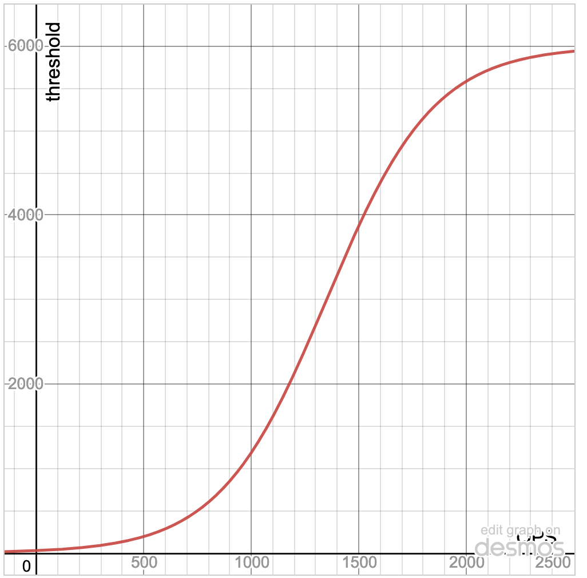
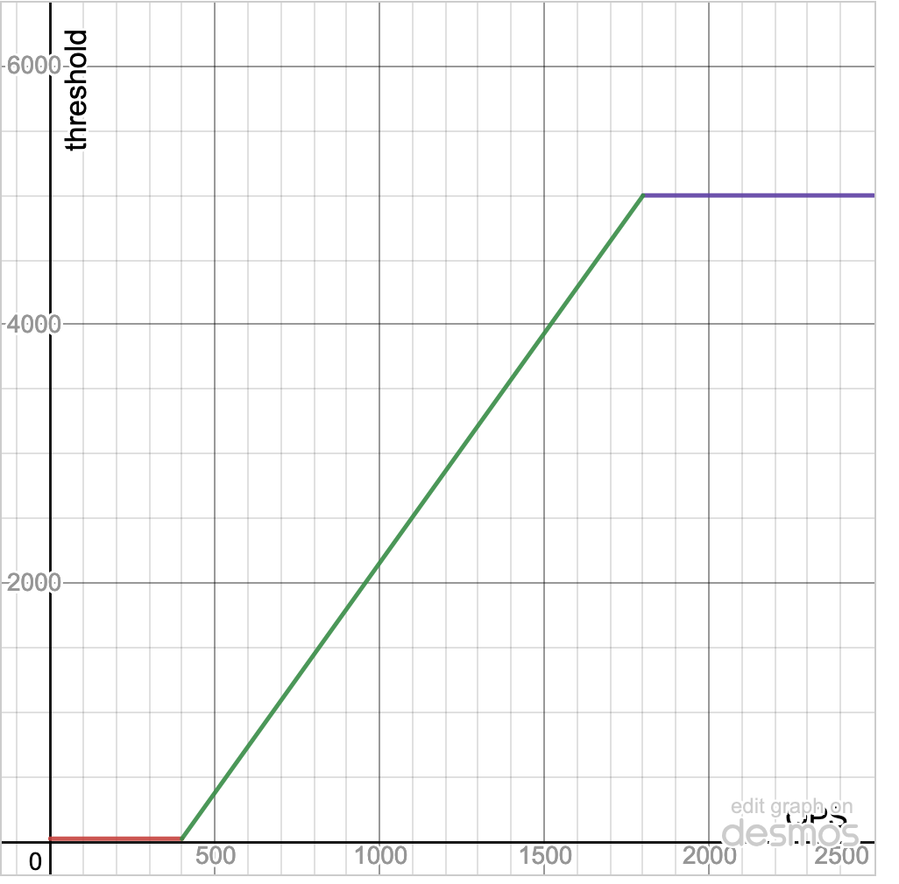

- Feature Name: Contention Event Store
- Status: draft
- Start Date: 2021-10-14
- Authors: Archer Zhang
- RFC PR: #71965
- Cockroach Issue: #71598

# Summary

This RFC describes the motivation and the design for a new Contention Event
Store subsystem. The new Contention Event Store builds on top of the existing
contention event infrastructure in order to support the new self-service
contention troubleshooting user experience.

At a high level, this new subsystem will enable CockroachDB to answer the
question: "What is causing the contention for my queries?"

# Terminology

| Terminology | Explanation |
| --- | --- |
| Statement Fingerprint | SQL statement string with literal values replaced with underscores |
| Statement Fingerprint ID | 64 bit hash of statement fingerprint and other statement metadata |
| Transaction Fingerprint ID | 64 bit hash of all statement fingerprint IDs that were executed as part of the transaction |
| Contending Transaction |  The transaction that is holding the lock that blocks other transaction |
| Blocked Transaction | The transaction that is blocked by a contending transaction |
| TxnID | A unique UUID that identify a specific transaction |
| TxnMeta | A protobuf message that contains metadata of a transaction, e.g. TxnID, table key |
| TxnID Cache | A cache that stores the mapping from transaction ID to transaction fingerprint ID |
| Contention Event | An event where a blocked transaction needs to wait for a contending transaction |
| Resolved Contention Event | A contention event where the contending TxnID has been translated to transaction fingerprint ID |
| Unresolved Contention Event | A contention event where the contending TxnID has not yet been resolved  into transaction fingerprint ID|


# Motivation

## Current State of Contention Subsystem

Currently, CockroachDB collects transaction-level contention information from
KV-layer when tracing is enabled. When a transaction (TxnA) is blocked by a
contending transaction (TxnB), a contention event is generated at the KV layer
when the TxnA is finally able to proceed. The contention event includes the
TxnMeta of TxnB, the duration of the contention from TxnA's
perspective, and the key that caused the contention.

Concretely, this is the proto definition of the contention event:

```
message ContentionEvent {
  bytes key = 1 [(gogoproto.casttype) = "Key"];

  cockroach.storage.enginepb.TxnMeta txn_meta = 2 [(gogoproto.nullable) = false];

  google.protobuf.Duration duration = 3 [(gogoproto.nullable) = false,
                                         (gogoproto.stdduration) = true];
}
```

This event is then stored within the tracing span, and then is sent back to the
gateway node at the end of DistSQL Flow and is recorded at the contention
registry.

The contention event is then parsed and stored in the following hierarchy:


```
[(TableID, IndexID)]
    |
    +--> Cumulative Contention Time
    +--> Cumulative Contention Event Count
    +--> [Row Key]
            |
            +-----> [Contending Transaction ID]
                          |
                          +------> Number of times a given Transaction ID has been seen
```

This hierarchy is flattened in SQL CLI with the following virtual table:

``` sql
CREATE TABLE crdb_internal.cluster_contention_events (
  table_id                   INT,
  index_id                   INT,
  num_contention_events      INT NOT NULL,
  cumulative_contention_time INTERVAL NOT NULL,
  key                        BYTES NOT NULL,
  txn_id                     UUID NOT NULL,
  count                      INT NOT NULL
)
```

It is evident that the existing contention event subsystem is built with a
specific table-centric workflow in mind. Concretely, here is the
troubleshooting workflow a user would go through today:

1. User cluster experiences in spikes of contention time metric. This prompts
   the user to examine `crdb_internal.cluster_contention_events` table.
2. User identifies the hot row in the problematic tables/indexes.
3. User identifies a list of TxnIDs that caused contention.

However, the current data model experiences few drawbacks:
* If one of user has a transaction that is running slow due to contention (a blocked
  transaction), the user does not have an easy way to identify the list of
  contending transactions that caused the contention.
* Even if user is able to (somehow magically) identify a list of contending
  transactions, the only metadata a user can get is the TxnIDs of the contending
  transactions.
  This information is not particularly useful on its own, since the transaction
  ID is stored in the `ActiveQueries` registry. As soon as the transaction
  finishes executing, the contending transaction's  is deleted
  from the `ActiveQueries` registry.

In summary, user cannot easily connect blocked transaction to contending
transaction, and even if the user can somehow make that connection, the current
information we have so far is not quite useful for troubleshooting.

## New Self-Service Contention Troubleshooting UX

With the new self-service contention troubleshooting UX, we hope to unlock a
new, more transaction-centric, workflow. (In contrast to the existing
table-centric workflow).

In the new workflow, CockroachDB will directly surface a list of historical
transactions that have experienced contention in SQL CLI and DB Console.
User will be able to query this list of blocked transactions with
`start` and `end` timestamp.

For each blocked transaction, user can view all the contending transactions
that caused contention. Both blocked transaction's txn ID and contending
transactions' txn IDs will be resolved into transaction fingerprint IDs.
The goal of having the resolved transaction fingerprint IDs is to allow user to
pull rich metadata and statistics from `crdb_internal.transaction_statistics`
to gain further insights.

The higher level features and [specific UI/UX design][1] is outside of the scope
of this RFC.

# Technical design

The design of the new Contention Event Store aims to facilitate the new
self-service troubleshooting workflow. Contention Event Store exposes a SQL
Interface in SQL CLI via a system table or a virtual table. (The consideration
for choosing one over another will be discussed in a later section). RPC/HTTP
endpoint will be exposed by the status server, which will be consumed by the
DB/CC Console. The RPC/HTTP handler will be implemented via SQL queries on
the SQL Interface.

## SQL Interface

``` sql
CREATE TABLE system.contended_queries(
  ts                          TIMESTAMPTZ NOT NULL,

  blocked_txn_id              UUID  NOT NULL,
  contending_txn_id           UUID  NOT NULL,

  blocked_stmt_fingerprint_id BYTES NOT NULL,
  blocked_txn_fingerprint_id  BYTES NOT NULL,

  contending_txn_fingerprint_id  BYTES NOT NULL,
  contention_duration            INTERVAL NOT NULL,
  contented_row_key              BYTES NOT NULL,

  -- This might not be needed if we choose not to adapt the system table design.
  PRIMARY KEY (ts, blocked_txn_id, blocked_stmt_fingerprint_id, contending_txn_id)
    USING HASH WITH BUCKET_COUNT = 8
)
```

In order to facilitate historical queries, Contention Event Store stores
timeseries data with a timestamp as its first column.  Each row in the table
represents an instance of contention event from the perspective of the blocked
transaction.

The gateway node is responsible for recording contention events for the blocked
transaction it executed. Most of the data listed in the table are readily
available to the gateway node today.

`blocked_txn_id` can be directly fetched from within the `connExecutor` at the
gateway node and the `contending_txn_id` can be fetched from the tracing spans.

`blocked_stmt_fingerprint_id` and `blocked_txn_fingerprint_id` allow the
new `contended_queries` table to be joined into the existing SQL Stats tables
and is already available from the SQL Stats subsystem. `contention_duration`
and `contented_row` is already available to us in the contention event proto.

The challenging part of this new system is to populate
`contending_txn_fingerprint_id` column. Effectively, this means we need a
mechanism to resolve a TxnID (that belongs to a transaction that was
potentially executed on a different node) into its contending transaction
fingerprint ID.

## Transaction ID Resolution

If the contending transaction was executed on the same node where blocked
transaction was executed, then Transaction ID Resolution is trivially solvable.
However, this is often not the case.

Since it is entirely possible that the contending transaction was executed on a
different node, the gateway node that executed the blocked transaction needs to
contact a remote node to perform Transaction ID resolution. There are few
options on how this remote Transaction ID resolution can be implemented.
Each one of the option requires a different degree of involvement from the KV
team.

### Option 1: No KV Team Involvement

In this scenario, SQL Observability will proceed to implement Transaction ID
resolution without any involvement from KV Team. The detailed technical design
is as follow:

Each SQL node in the CockroachDB will maintain an in-memory FIFO cache of recently
executed transactions (namely `TxnIDCache`). The in-memory cache
stores tuples of `(transaction_id, transaction_fingerprint_id)`.
`transaction_id` is a UUID with 16-byte storage overhead and
`transaction_fingerprint_id` is a unsigned 64-bit integer with 8-byte storage
overhead. Hence, with an overhead of 1 MiB, we will be able to store [~43,690](#failure-mode)
recently executed transactions. The total storage limit can be adjusted via
cluster setting.

Each node will expose a new RPC endpoint which allows for other nodes to query
transaction fingerprint ID.

``` proto 
message TxnIDResolutionRequest {
  repeated bytes txnIDs = 1 [(gogoproto.customname) = "ID",
      (gogoproto.customtype) = "github.com/cockroachdb/cockroach/pkg/util/uuid.UUID",
      (gogoproto.nullable) = false];
}

message TxnIDResolutionResponse {
  message ResolvedTxnID {
     // The Response only returns the txnID that is present on the
     // inquired node. If the txnID is not present on the inquired
     // node, then it is not returned.
     bytes txnID = 1 [(gogoproto.customname) = "ID",
      (gogoproto.customtype) = "github.com/cockroachdb/cockroach/pkg/util/uuid.UUID",
      (gogoproto.nullable) = false];

     // This field is allowed to be null. This means the given transaction ID
     // is found on the given node. However, the transaction fingerprint ID
     // for that transaction ID is not yet available since the transaction
     // has not yet finished executing.
     // This would require the node to check ActiveQueries store in addition
     // to TxnID Cache.
     uint64 txnFingerprintID = 2 [(gogoproto.customname) = "TransactionFingerprintID",
          (gogoproto.customtype) = "TransactionFingerprintID"];
  }

  repeated ResolvedTxnIDs resolvedTxnIDs = 1 [(gogoproto.nullable) = false];
}

service Status {
  // Piggy back off the Status Server.

  rpc TxnIDResolution(TxnIDResolutionRequest) returns TxnIDResolutionResponse {}
}
```

Each SQL node collects contention events as they come in. SQL nodes store the
contention event with unresolved TxnID in a temporary buffer. Periodically, each
SQL node broadcast RPC fanout calling the `TxnIDResolution` RPC with a list of
unresolved TxnIDs. The RPC will respond with a list of tuples composing
`(transaction_id, transaction_fingerprint_id)`. As soon as the node receives
the RPC response, it will remove the TxnID from the temporary buffer.
This periodic task will be controlled via [two cluster settings](#monitoring-and-knobs): interval and
jitter. The interval cluster setting will control the length of time between
each `TxnIDResolution` RPC call. The jitter cluster setting will be specified
as a percentage, aims to introduce some randomness into the interval to prevent
all the SQL nodes in the cluster issue RPC fanout exactly the same time.
The actual interval will be calculated randomly within the range of
`[(1 - jitter) * interval),  (1 + jitter) * interval)]`.

It is possible that the `transaction_id` that the node was trying to resolve
did not finish execution. In which case, the `transaction_id` will remain
unresolved. This is ok, since the node will try again after the next broadcast.

Once the `transaction_id` is resolved, the node then has all the necessary
information and it will insert a new entry into the `contended_queries` table.
(Depending on whether we decide to pursue to use system table, this might be
either an in-memory operation, or an in-memory operation with deferred flush).

This strategy is extremely expensive. Each node will be performing a
cluster-wide RPC fanout at a fixed-interval. However, this is the option with
least amount of unknown-unknowns and least amount of inter-team dependency.

### Option 2: KV Team embeds `NodeID` into Contention Event

In this scenario, we assume that KV Team will be working on [embedding][6] the
`NodeID` (of the gateway node that contending transaction originated) into the
contention event. (In Serverless mode, we would embed `SQLInstanceID`). This means
when a contention event is generated, it will also embed this identifier. This
would require the KV layer to store this `NodeID` into the lock objects as
transactions acquire them.

In this case, most of the design will be identical to the previous scenario.
The node-local `TxnIDCache` and the `TxnIDResolution` RPC will remain the same.
We also maintain the same `TxnIDCache` pruning strategy. The modification we
make here is on what we do with unresolved TxnIDs.

Unlike the previous design where we store a temporary buffer of contention
events with unresolved TxnIDs, we expand that temporary buffer to store a map from each
`NodeID` to a list of unresolved TxnIDs (`map[node_id][]transaction_id`).
Periodically, instead of performing cluster-wide RPC fanout, each node iterates
through its unresolved  buffer, and for each NodeID, it
performs point-to-point RPC call on the `TxnIDResolution` endpoint on
remote node with a list of unresolved TxnIDs.

By replacing the cluster-wide RPC broadcast, this method significantly reduces
the overhead of TxnID resolution with the cost of slight increase of
the size of all KV lock objects (by 4 bytes, size of NodeID) and the
associated network cost. This is an appealing option, however, this option
introduces additional inter-team dependency.

### Additional Note

It is worth to point out that, both options are not mutually exclusive,
especially since both of them share most of the components that will be built.
Realistically, SQL Observability can start working on most of the shared
components detailed in Option 1 and implement the primitive cluster-wide RPC
fanout  resolution strategy. Once, the KV Team can provide
bandwidth to provide the embedding of NodeIDs in contention events, SQL
Observability can then incorporate that additional information to lower the
cost of TxnID resolution.

See [Footnote](#Footnote) for examples.

### System Table vs. Virtual Table

#### Virtual Table Only

At the time of this writing, CockroachDB does not support dynamic system table
descriptor IDs.

50 system table descriptor IDs have been previously reserved. As of writing,
there are 3 unused system table descriptor IDs left. This means there is a
possibility that the new Contention Event Store will not have a system table to
store all of its data.

In the scenario where system table is not an option, Contention Event Store
will be built using in-memory storage only. The SQL Interface will be built
using cluster-wide RPC fanout to aggregate statistics across different nodes
similar to CockroachDB's current Index Usage Statistics subsystem. The virtual
table needs to implement virtual index to reduce the network overhead and also
enable implementing pagination. Pagination is crucial in order to prevent
the new subsystem from causing OOM errors.

In this case, the in-memory Contention Event Store can be implemented using
[`cache.OrderedCache`][2], which is backed by a left-leaning red-black tree.
A maximum storage size will be specified via a cluster-setting and the eviction
policy for the in-memory store would be FIFO. Total memory used will be tracked
by a memory monitor and accounted against the maximum SQL memory.

#### System Table

If the system table is available, then the content of the in-memory Contention
Event Store can be asynchronously flushed into the system table for longer
retention period and improve the data survivability across node restarts.
Node restart can happen due to various reason, such as OOM. Historically, we have
also observed that users sometime perform node restart when experiencing spiking
latency due to unknown cause as a temporary mitigation. In the Serverless
deployment, this can happen as frequently as every 5 minutes because the SQL Pod
will be shutdown due to inactivity.

The flush operation is handled by a separate goroutine running on each node.
It will wake up periodically and flushes the in-memory data into the system
table. The flush interval will also be augmented by the jitter setting to
prevent all nodes in the cluster from waking up at the same time and cause a
surge in write traffic.

Since the contention event table stores the time series data, it will adapt
hash-sharded primary index to ensure we do not run into the hot range problem.
There should not exist any write-write contention problems, since the remaining
primary key consists of
`(blocked_txn_id, blocked_stmt_fingerprint_id, contending_txn_id)`,
where each of the `txn_id` is unique cluster-wide UUID. Also, since `txn_id`
has blob-like nature, combining with hash-sharded index, the write load should
be evenly distributed across all ranges backing the contention event table.
Read-write contention can potentially occur when the frontend fetches
contention events from the backend to render the contention event page.
However, this can be mitigated by using follower read to serve a slightly
stale data.

To ensure contention event table doesn't grow too large, a new cleanup job
will be introduced to implement FIFO eviciton policy. This will be built on top
the existing scheduled job subsystem following the automatic job pattern.

When the cleanup job executes, it manually loop through each individual shards
in the table and delete the oldest events at the per-shard basis. This is to
optmize the query plan for the `DELETE` statement, since otherwise this would
cause a [merge join across all shards][5] and a topk sort.

The job schedule record will be insert into scheduled job subsystem via a
[job monitor][4] to ensure there is always exactly one clean up job running in
the cluster. The maximum number of rows allowed to store in the system table is
controled by the `sql.contention.persisted_rows.max` cluster setting.

### Monitoring and Knobs

Additional metrics and logging facilities need to be introduced to provide
necessary observability into the new subsystem. In addition, new cluster
settings need to be introduced to provide runtime tuning knobs. This provides
DB operators the ability to modify subsystem behaviors (to a certain extent)
to better match their workloads, or in extenuating circumstances, serving as a
fail-safe mechanism to completely disable the subsystem.

Existing metrics:

* `sql.distsql.contended_queries.count`: this is a counter metric that records
  how many queries that have encountered contention.

  <!-- (TODO(@azhng): should we rename this to be under the new `sql.contention.*`
                      namespace for consistency) !-->

Additional monitoring metrics that will be introduced:

* `sql.contention.unresolved_event.count`: this is a gauge metric that keeps
  track of the size of unresolved contention events buffer per node.
* `sql.contention.mem_store.count`: this is a gauge metric that keeps track
  of the size of the in-memory store for contention event per node.
  <!-- Is this one necessary? Or we just need memory metrics !-->
* `sql.contention.mem.{max, current}`: these two metrics are attached to the
  memory monitor response for memory accounting for the new contention event
  store.
* `sql.contention.resolution_latency`: this is a latency metric that keeps
  track of the latency for resolving a batch of TxnIDs.
* `sql.contention.resolution_error`: this is a counter metric that keeps
  number of errors encountered in TxnID resolution.

Additional monitoring metrics if we adapt system table:

* `sql.contention.flush.count`: this is a counter metric that records number of
  contention events flushed into the system table.
* `sql.contention.flush.duration`: this is a latency metric that records the
  duration of flushing contention events into the system table.
* `sql.contention.flush.error`: this is a counter metric that records the
  number of errors encountered during flush.
* `sql.contention.cleanup.rows_removed`: this is a counter metric that keep
  track of number of rows removed from system table during the periodic cleanup
  job.


Cluster Settings:

* `sql.contention.txn_id_resolution.enabled`: this would be enabled by default.
  When disabled, Contention Event Store would not be performing any transaction
  ID resolutions. All contention event generated will be hold in the unresolved
  buffer with FIFO evicton policies.
* `sql.contention.txn_id_resolution.{interval, jitter}`: these two cluster
  settings controls how often each SQL node performs TxnID resolution.
* `sql.contention.unresolved_buffer.max_count`: this is a size setting that
  constraints the maximum amount of entries stored in unresolved contention
  event buffer per node.
* `sql.contention.txn_id_cache.max_count`: this is a size setting that
  constraints the  cache size per-node. 
  <!-- should the above two cluster setting be a "count" or "size" of byte !-->

Additional cluster setting if system table is adopted:

* `sql.contention.flush.enabled`: this would be enabled by default. When
  disabled, Contention Event will not be flushed into the system table.
* `sql.contention.flush.{interval, jitter}`: these two cluster settings control
  how often each SQL node flushes contention events into the system table.
* `sql.contention.persisted_rows.max`: this setting controls maximum rows
  will be retained in the system table.
<!-- should we go with TTL-based expiration?  !-->
* `sql.contention.cleanup.recurrence`: this is a cron expression that specify
  the execution schedule of the cleanup job (e.g. `@hourly`, `@weekly` etc.).
* `sql.contention.minimum_duration`: this is a duration setting that ensures
  only the contention event that has contention duration greater than this
  will be flushed into system table.


### Performance Consideration

#### Performance Objective

While the primary objective of the Contention Event Store is to improve the
observability into contention-related information, it is also important that
this new subsystem should not cause significant impact on the user workload.

This leads us to define our top-level performance objective:
* Enabling the Contention Event Store on YCSB-A and TPCC will reduce the
  top-line throughput by no more than 3%.

Additionally, as the overhead of the Contention Event Store scales with the
size of the cluster. It is crucial for us benchmark the impact of this new
subsystem at different cluster sizes. A typical large CockroachDB deployment
handles the traffic in the range around 200k QPS, we should measure the
performance impact of the Contention Event Store in a roachprod deployment
with enough capacity to handle >200k QPS workload. (This means a deployment
size of 50 ~ 100 nodes).

As we benchmark the overall system performance impact, we should also bencmark
the performance envelope of TxnID resolution protocol itself. This involves
creating a number of tunable parameters, including:
* cluster size
* QPS level per node
* probability of contention events

These tunable parameters will then be used to understand the TxnID resolution
protocol performance envelope for a given set of cluster setting configurations.

#### Low-pass filter

Given the amount of traffic we are expected to handle, we need to ensure that
we don't generate too much data too fast.
Suppose a node is experiencing 2,000 QPS at a steady state, and we performs
tracing (which enable us to collect contention info) on 1% of the statements
executed. Then suppose that 30% of the statements unfortunately experiences
contentions at 2000 QPS, then that means we are generating 6 contention events
per second. This translates to ~21k events per hour per node.
This is a lot of write traffic for a single node to generate
and will undoubtedly cause disruption in the foreground traffic. To mitigate
this, we can introduce a low-pass filter that filter out the contention events
where the contention duration is below a certain threshold.
Trivially setting a static threshold for the low-pass filter has the risk of
still generating way too much data for larger deployments.

One way to address this problem is to dynamically adjust the low-pass filter
threshold. Based on the telemetry data we have below, we can observe the range
of contention event durations:

```
Row   75th PERCENTILE 90th PERCENTILE 95th PERCENTILE 99th PERCENTILE
1     0.0354105775    0.1389087767    0.4133667717    5.725203225
```

Based on the telemetry data, we can create a response function calculating the
threshold based on given input parameter. The input parameter can be node-level
QPS value, or alternatively based on current CPU/IO load of the node.

Ideally, we can use the sigmoid function's curve as the response function where
the input (x-axis) is the node-level QPS and the output (y-axis) is the threshold
value.



This will generate a smooth response curve and increase the low-pass filter
threshold as the load on the node increases. However, this might be costly
to compute due to the nature of sigmoid function.

Alternatively, we can apprixmate the sigmoid function using a piece-wise linear
function to achieve similar objective.




The low-pass threshold value can be periodically recomputed
(e.g. interval of 5 seconds) using the latest load indicator value (either
QPS value or CPU/IO load).

### Failure Modes

There are two major failure points in this architecture:
1. TxnID resolution protocol failure
2. System table flush failure

We have extensively discussed the similar failure mode for system table flush
in [Persisted SQL Stats RFC][3]. In this RFC, we will focus on the failures
in the TxnID resolution protocol.

Since TxnID resolution protocol depends on the pod-2-pod RPC, RPC
failure can cause the TxnID resolution protocol to fail due to the
failed RPC calls.

RPC failure is the symptom of many causes, such as network partitioning,
misconfigured deployment, or failed nodes. In this RFC, we mainly categorize
RPC failure as intermittent RPC failure and prolonged RPC failure.

Intermittent RPC failure would cause a temporary spike in number of entries
stored in the TxnID cache and unresolved buffer. The TxnID resolution will be
lazily retried when the next wait interval is over. It is not as concerning as a
prolonged RPC failure, where in-memory store will eventually reach the cluster setting
limit.  This will eventually cause the in-memory store (both TxnID Cache and
unresolved buffer) to start evicting entries due to their FIFO eviction policy.

The FIFO eviction policy can cause a potential issue. This is because, after
every transaction finishes execution, it is inserted into TxnID Cache, whereas
contention event is inserted into unresolved buffer each time a contention
event is generated. Two buffers are being populated at a drastically different
rate. During a prolonged RPC failure, it is possible that the entry in TxnID
Cache required by another node to perform TxnID resolution will be evicted
before RPC connection can recover. The implication here means the cluster would
permanently lose the ability to resolve that TxnID.

Fortunately, this is easy to detect. Recall that the RPC response answering
`TxnIDResolution` endpoint would only include the TxnID in its
response if and only if the inquired TxnID is present in its TxnID cache, or if
it is in its ActiveQueries store. This means, in the above failure scenario,
none of the `TxnIDResolution` RPC response would include the inquired
TxnID. This means we can handle this failure mode by including a retry counter
in the unresolved buffer. Everytime we observe that a TxnID is missing from all
of the RPC response, we increment that retry counter. (This is to handle the
case that we are experiencing an intermittent failure). Once the retry counter
reaches a certain value, we consider this entry permanently lost and discard
the unresolved contention event.

The rate at which we discard unresolved contention events is closely related to
the rate at which we collect contention events, and the size of TxnID Cache.
Suppose a node is experiencing a consistent 2,000 QPS. Currently, we enable
tracing on the statement with 1% probability. Suppose 40% of the statement
experiences contention (this number is hard to estimate, as one workload
can be drastically different from another), then we are expecting to observe
`2000 * 1% * 40% = 8` contention events per second. The amount of time each
node has to perform TxnID resolution is equal to how long TxnID Cache can hold
an entry before that entry gets evicted. This depends on the the capacity limit
for the TxnID Cache. With overhead of 1 MB, and each cache entry takes 24 bytes
(UUID + uint64), we can store up to `~43,690` entries in this cache. This means
with 2000 QPS, we have ~21 seconds before we start discarding contention events
at 8 events per second. The discarding behavior can be observed through
`sql.contention.unresolved_event.count` as well as
`sql.contention.resolution_error` metrics as spikes in the graph.

In the event of prolonged RPC failure, we should also consider few other
options, such as circuit breaker and load shedding as additional response
measures.

## Drawbacks:

### Troubleshooting contention issues for active queries

Since the new Contention Event Store still relies on the existing tracing
infrastructure to bubble up contention information, the new system would still
not have the capability to surface the contention information for active
queries. However, if eventually CockroachDB moves to adapt push-based tracing
infrastructure, then we can easily adopt that new infrastructure and have KV
layer pushing out contention events as soon as they are encountered. This means
we can trivially extend this Contention Event Store to store contention
information for active queries as well.


<!-- anything else? !-->

## Rationale and Alternatives

### Row-level TTL instead of Scheduled Job

Instead of relying on the scheduled job system to run periodic cleanup job
to ensure the system doesn't grow too large, we can create the contention
system table as a table with row-level TTL. The advantage of this approach
is that we can reduce significant degree of complexity of this new subsystem.
This is because the complication involving cleaning up the old contention event
entries are now the responsibility of the row-level TTL table. We can also
benefit from any performance optimizations later introduced in the row-level
TTL work.

However, this means we are introducing an outbound dependency on row-level TTL
project. Without row-level TTL, we would have no choice but to turn off
contention event persistence.

<!-- anything else? !-->

# Future work

## Statement-level resolution

We want to extend from understanding which contending transaction
is causing our transaction to block, to understanding which statement within
the contending transaction is causing our transaction to block. This needs few
things we need to consider:

As of 21.2, we don't have the concept of statement ID, and we only have the
concept of statement fingerprint ID. So we can't simply duplicate what we
did for TxnID Cache into a StmtID Cache. However, instead of introducing a
new StmtID concept, we can use a compound key to effectively represent
statement ID. This relationship is similar to the the relationship between
`TableID` and `IndexID`. `TableID` is unique within the entire cluster, and
`IndexID` is a monotonically increasing number starting at `1` and it is unique
within a given `TableID`. By borrowing this idea, we can uniquely identify
a statement using `TxnID` and the ordinal number of the statement within that
transaction. By resolving  into transaction fingerprint ID,
we effectively translate the `(TxnID, Stmt Ordinal ID)` into
`(Transaction Fingerprint ID, Statement Fingerprint ID)`. This allows us to
embed this ordinal number into the KV Lock and bubble up through contention
event similar to how `TxnID` is being surfaced today. This even allows us to
leave the construction method of statement fingerprint ID untouched, since
currently the construction of statement fingerprint ID depends on the failure
status of the statement execution. This implies that unless we can revamp
the construction of the statement fingerprint ID, we cannot embed statement
fingerprint ID within the KV lock.

## Generalized SQL pod information sharing framework

If in the future, additional features also require tenant SQL pods to share
information with each other (similar to the fashion outlined in this
RFC), we should start considering a generalized framework that handles all of
the background communication as well as error handling.

# Footnote

## Normal Execution Path

Exeucted as part of query execution code path

```
Step 1: Two nodes executing conflicting Transactions

note: CES = Contention Event Store

   +-----------------------------------------------+
   |  node 1                                       |
   |         +--------------------------+          |
   |         |       TxnID Cache        |          +-------------> Executes --------->  +--------------+              +-------------------+
   |         +--------------------------+          |                                    | TxnID: 00002 | ---write---> | Key: /Table/5/0/1 |
   |         | TxnID | TxnFingerprintID |          |                                    +--------------+              +-------------------+
   |         +--------------------------+          |                                                                       ^
   |         |  (empty)                 |          |                                                                       |
   |         +--------------------------+          |                                                                       |
   |                                               |                                                                       |
   |         +---------+ +-----------------------+ |                                                                       |
   |         | CES     | |unresolved CES buffer  | |                                                                       |
   |         +---------+ +-----------------------+ |                                                                    reads
   |         | (empty) | | (empty)               | |                                                                       |
   |         +---------+ +-----------------------+ |                                                                       |
   +-----------------------------------------------+                                                                       |
                                                                                                                           |
                                                                                                                           |
   +-----------------------------------------------+                                                                       |
   |  node 2                                       |                                                                       |
   |         +--------------------------+          |                                                                       |
   |         |       TxnID Cache        |          +-------------> Executes ----------> +--------------+                   |
   |         +--------------------------+          |                                    | TxnID: 00003 |-------------------+
   |         | TxnID | TxnFingerprintID |          |                                    +--------------+
   |         +--------------------------|          |
   |         |  (empty)                 |          |
   |         +--------------------------+          |
   |                                               |
   |         +---------+ +----------------------+  |
   |         | CES     | |unresolved CES buffer |  |
   |         +---------+ +----------------------+  |
   |         | (empty) | |    (empty)           |  |
   |         +---------+ +----------------------+  |
   +-----------------------------------------------+

```

```
Step 2: each node populates TxnID Cache, node 2 receives contention events with unresolved transaction ID

   +-----------------------------------------------+
   |  node 1                                       |
   |         +--------------------------+          |
   |         |       TxnID Cache        |          +-------------> Executes --------->  +--------------+              +-------------------+
   |         +--------------------------+          |                                    | TxnID: 00002 | ---write---> | Key: /Table/5/0/1 |
   |         | TxnID | TxnFingerprintID |          |                                    +--------------+              +-------------------+
   |         +--------------------------|          |                                                                       ^
   |         | 00002 | 0x0000000a02     |          |                                                                       |
   |         +--------------------------+          |                                                                       |
   |                                               |                                                                       |
   |         +---------+ +-----------------------+ |                                                                       |
   |         | CES     | |unresolved CES buffer  | |                                                                       |
   |         +---------+ +-----------------------+ |                                                                    reads, have to wait because {TxnID: 00002} is blocking the read
   |         | (empty) | | (empty)               | |                                                                       |
   |         +---------+ +-----------------------+ |                                                                       |
   +-----------------------------------------------+                                                                       |
                                                                                                                           |
                                                                                                                           |
   +-----------------------------------------------+                                                                       |
   |  node 2                                       |                                                                       |
   |         +--------------------------+          |                                                                       |
   |         |       TxnID Cache        |          +-------------> Executes ----------> +--------------+                   |
   |         +--------------------------+          |                                    | TxnID: 00003 |-------------------+
   |         | TxnID | TxnFingerprintID |          |                                    +--------------+
   |         +--------------------------|          |
   |         | 00003 | 0x0000000k01     |          |
   |         +--------------------------+          |
   |                                               |
   |         +---------+ +----------------------+  |
   |         | CES     | |unresolved CES buffer |  |
   |         +---------+ +----------------------+  |
   |         | (empty) | |00002: (stats...)     |  |
   |         +---------+ +----------------------+  |
   +-----------------------------------------------+

```

Executed asynchronously in the background

```
Step 3: Broadcast interval expired, Node 2 sends RPC to perform TxnID Resolution

   +-----------------------------------------------+
   |  node 1                                       |
   |         +--------------------------+          |
   |         |       TxnID Cache        |          |
   |         +--------------------------+          |
   |         | TxnID | TxnFingerprintID |          |
   |         +--------------------------|          |
   |         | 00002 | 0x0000000a02     |<---------+-----+
   |         +--------------------------+          |     |
   |                                               |     |
   |         +---------+ +-----------------------+ |     |
   |         | CES     | |unresolved CES buffer  | |     |
   |         +---------+ +-----------------------+ |     |
   |         | (empty) | | (empty)               | |     |
   |         +---------+ +-----------------------+ |     |
   +-----------------------------------------------+     |
                                                         | Node 2 Sends RPC to perform TxnID resolution
                                                         |
   +-----------------------------------------------+     |
   |  node 2                                       |     |
   |         +--------------------------+          |     |
   |         |       TxnID Cache        |          |     |
   |         +--------------------------+          |     |
   |         | TxnID | TxnFingerprintID |          |     |
   |         +--------------------------|          |     |
   |         | 00003 | 0x0000000k01     |          |     |
   |         +--------------------------+          |     |
   |                                               |     |
   |         +---------+ +----------------------+  |     |
   |         | CES     | |unresolved CES buffer |  |     |
   |         +---------+ +----------------------+  |     |
   |         | (empty) | |00002: (stats...)     |  +-----+
   |         +---------+ +----------------------+  |
   +-----------------------------------------------+

```

```
Step 4: Node 2 resolves TxnID and populates the CES

   +-----------------------------------------------+
   |  node 1                                       |
   |         +--------------------------+          |
   |         |       TxnID Cache        |          |
   |         +--------------------------+          |
   |         | TxnID | TxnFingerprintID |          |
   |         +--------------------------|          |
   |         | 00002 | 0x0000000a02     |          |
   |         +--------------------------+          |
   |                                               |
   |         +---------+ +-----------------------+ |
   |         | CES     | |unresolved CES buffer  | |
   |         +---------+ +-----------------------+ |
   |         | (empty) | | (empty)               | |
   |         +---------+ +-----------------------+ |
   +-----------------------------------------------+
                                                    
                                                    
   +--------------------------------------------------------------------------------+
   |  node 2                                                                        |
   |         +--------------------------+                                           |
   |         |       TxnID Cache        |                                           |
   |         +--------------------------+                                           |
   |         | TxnID | TxnFingerprintID |                                           |
   |         +--------------------------|                                           |
   |         | 00003 | 0x0000000k01     |                                           |
   |         +--------------------------+                                           |
   |                                                                                |
   |         +----------------------------------------+   +----------------------+  |
   |         |                CES                     |   |unresolved CES buffer |  |
   |         +----------------------------------------+   +----------------------+  |
   |         | TxnID | TxnFingerprintID | stats       |   |  (empty)             |  |
   |         +-------+------------------+-------------+   +----------------------+  |
   |         | 00002 | 0x0000000a02     | (stats)...  |                             |
   |         +-------+------------------+-------------+                             |
   +--------------------------------------------------------------------------------+

```

```
Step 5: More Transactions are being executed, the oldest entries in TxnID Cache get evicted

   +-----------------------------------------------+
   |  node 1                                       |
   |         +--------------------------+          |
   |         |       TxnID Cache        |          |
   |         +--------------------------+          |
   |         | TxnID | TxnFingerprintID |          |
   |         +--------------------------|          |
   |         | 00004 | .........        |          |
   |         | 00005 | .........        |          |
   |         +--------------------------+          |
   |                                               |
   |         +---------+ +-----------------------+ |
   |         | CES     | |unresolved CES buffer  | |
   |         +---------+ +-----------------------+ |
   |         | (empty) | | (empty)               | |
   |         +---------+ +-----------------------+ |
   +-----------------------------------------------+
                                                    
                                                    
   +--------------------------------------------------------------------------------+
   |  node 2                                                                        |
   |         +--------------------------+                                           |
   |         |       TxnID Cache        |                                           |
   |         +--------------------------+                                           |
   |         | TxnID | TxnFingerprintID |                                           |
   |         +--------------------------|                                           |
   |         | 00006 | .......          |                                           |
   |         | 00007 | .......          |                                           |
   |         | 00008 | .......          |                                           |
   |         +--------------------------+                                           |
   |                                                                                |
   |         +----------------------------------------+   +----------------------+  |
   |         |                CES                     |   |unresolved CES buffer |  |
   |         +----------------------------------------+   +----------------------+  |
   |         | TxnID | TxnFingerprintID | stats       |   |  (empty)             |  |
   |         +-------+------------------+-------------+   +----------------------+  |
   |         | 00002 | 0x0000000a02     | (stats)...  |                             |
   |         +-------+------------------+-------------+                             |
   +--------------------------------------------------------------------------------+

```

## Prolonged RPC Failure

```

Suppose we have some initial state

   +-----------------------------------------------+
   |  node 1                                       |
   |         +--------------------------+          |
   |         |       TxnID Cache        |          |
   |         +--------------------------+          |
   |         | TxnID | TxnFingerprintID |          |
   |         +--------------------------|          |
   |         | 00004 | .........        |          |
   |         | 00005 | .........        |          |
   |         +--------------------------+          |
   |                                               |
   |         +---------+ +-----------------------+ |
   |         | CES     | |unresolved CES buffer  | |
   |         +---------+ +-----------------------+ |
   |         | (empty) | |00008: (stats...)      | |
   |         +---------+ +-----------------------+ |
   +-----------------------------------------------+

   +-----------------------------------------------+
   |  node 2                                       |
   |         +--------------------------+          |
   |         |       TxnID Cache        |          |
   |         +--------------------------+          |
   |         | TxnID | TxnFingerprintID |          |
   |         +--------------------------|          |
   |         | 00006 | .........        |          |
   |         | 00007 | .........        |          |
   |         +--------------------------+          |
   |                                               |
   |         +---------+ +-----------------------+ |
   |         | CES     | |unresolved CES buffer  | |
   |         +---------+ +-----------------------+ |
   |         | (empty) | | (empty)               | |
   |         +---------+ +-----------------------+ |
   +-----------------------------------------------+

   +-----------------------------------------------+
   |  node 3                                       |
   |         +--------------------------+          |
   |         |       TxnID Cache        |          |
   |         +--------------------------+          |
   |         | TxnID | TxnFingerprintID |          |
   |         +--------------------------|          |
   |         | 00008 | .........        |          |
   |         | 00009 | .........        |          |
   |         +--------------------------+          |
   |                                               |
   |         +---------+ +-----------------------+ |
   |         | CES     | |unresolved CES buffer  | |
   |         +---------+ +-----------------------+ |
   |         | (empty) | | (empty)               | |
   |         +---------+ +-----------------------+ |
   +-----------------------------------------------+

```

```

RPC gets blocked due to various reasons:

   +-----------------------------------------------+
   |  node 1                                       |
   |         +--------------------------+          |
   |         |       TxnID Cache        |          |
   |         +--------------------------+          |
   |         | TxnID | TxnFingerprintID |          |
   |         +--------------------------|          |
   |         | 00004 | .........        |          |
   |         | 00005 | .........        |          |
   |         +--------------------------+          |
   |                                               |
   |         +---------+ +-----------------------+ |
   |         | CES     | |unresolved CES buffer  | |
   |         +---------+ +-----------------------+ |
   |         | (empty) | |00008: (stats...)      | +--------+
   |         +---------+ +-----------------------+ |        |
   +-----------------------------------------------+        |
                                                            |
   +-----------------------------------------------+        |
   |  node 2                                       |        |
   |         +--------------------------+          |        |
   |         |       TxnID Cache        |          |        |
   |         +--------------------------+          |        |
   |         | TxnID | TxnFingerprintID |          |        |
   |         +--------------------------|          |        |
   |         | 00006 | .........        |          |        |
   |         | 00007 | .........        |          |xx<-----+ <- RPC failure
   |         +--------------------------+          |        |
   |                                               |        |
   |         +---------+ +-----------------------+ |        |
   |         | CES     | |unresolved CES buffer  | |        |
   |         +---------+ +-----------------------+ |        |
   |         | (empty) | | (empty)               | |        |
   |         +---------+ +-----------------------+ |        |
   +-----------------------------------------------+        |
                                                            |
   +-----------------------------------------------+        |
   |  node 3                                       |        |
   |         +--------------------------+          |        |
   |         |       TxnID Cache        |          |        |
   |         +--------------------------+          |        |
   |         | TxnID | TxnFingerprintID |          |        |
   |         +--------------------------|          |        |
   |         | 00008 | .........        |          |xx<-----+ <-  RPC failure
   |         | 00009 | .........        |          |
   |         +--------------------------+          |
   |                                               |
   |         +---------+ +-----------------------+ |
   |         | CES     | |unresolved CES buffer  | |
   |         +---------+ +-----------------------+ |
   |         | (empty) | | (empty)               | |
   |         +---------+ +-----------------------+ |
   +-----------------------------------------------+

```


```

TxnID Cache eventually evicts the TxnID after a period of time

   +-----------------------------------------------+
   |  node 1                                       |
   |         +--------------------------+          |
   |         |       TxnID Cache        |          |
   |         +--------------------------+          |
   |         | TxnID | TxnFingerprintID |          |
   |         +--------------------------|          |
   |         | 00109 | .........        |          |
   |         | 00110 | .........        |          |
   |         +--------------------------+          |
   |                                               |
   |         +---------+ +-----------------------+ |
   |         | CES     | |unresolved CES buffer  | |
   |         +---------+ +-----------------------+ |
   |         | (empty) | |00008: (stats...)      | +
   |         +---------+ +-----------------------+ |
   +-----------------------------------------------+
                                                    
   +-----------------------------------------------+
   |  node 2                                       |
   |         +--------------------------+          |
   |         |       TxnID Cache        |          |
   |         +--------------------------+          |
   |         | TxnID | TxnFingerprintID |          |
   |         +--------------------------|          |
   |         | 00116 | .........        |          |
   |         | 00117 | .........        |          |
   |         +--------------------------+          |
   |                                               |
   |         +---------+ +-----------------------+ |
   |         | CES     | |unresolved CES buffer  | |
   |         +---------+ +-----------------------+ |
   |         | (empty) | | (empty)               | |
   |         +---------+ +-----------------------+ |
   +-----------------------------------------------+
                                                    
   +-----------------------------------------------+
   |  node 3                                       |
   |         +--------------------------+          |
   |         |       TxnID Cache        |          |
   |         +--------------------------+          |
   |         | TxnID | TxnFingerprintID |          |
   |         +--------------------------|          |
   |         | 00128 | .........        |          |
   |         | 00129 | .........        |          |
   |         +--------------------------+          |
   |                                               |
   |         +---------+ +-----------------------+ |
   |         | CES     | |unresolved CES buffer  | |
   |         +---------+ +-----------------------+ |
   |         | (empty) | | (empty)               | |
   |         +---------+ +-----------------------+ |
   +-----------------------------------------------+

```

```

RPC connection recovers, the TxnID resolution gets lazily retried

   +-----------------------------------------------+
   |  node 1                                       |
   |         +--------------------------+          |
   |         |       TxnID Cache        |          |
   |         +--------------------------+          |
   |         | TxnID | TxnFingerprintID |          |
   |         +--------------------------|          |
   |         | 00109 | .........        |          |
   |         | 00110 | .........        |          |
   |         +--------------------------+          |
   |                                               |
   |         +---------+ +-----------------------+ |
   |         | CES     | |unresolved CES buffer  | |
   |         +---------+ +-----------------------+ |
   |         | (empty) | |00008: (stats...)      | +--------+ RPC Request: { [ { TxnID: 00008 } ] }
   |         +---------+ +-----------------------+ |        |
   +-----------------------------------------------+        |
                                                            |
   +-----------------------------------------------+        |
   |  node 2                                       |        |
   |         +--------------------------+          |        |
   |         |       TxnID Cache        |          |        |
   |         +--------------------------+          |        |
   |         | TxnID | TxnFingerprintID |          |        |
   |         +--------------------------|          |        |
   |         | 00116 | .........        |          |        |
   |         | 00117 | .........        |          |<-------+ RPC Response: { [(empty)] }
   |         +--------------------------+          |        |
   |                                               |        |
   |         +---------+ +-----------------------+ |        |
   |         | CES     | |unresolved CES buffer  | |        |
   |         +---------+ +-----------------------+ |        |
   |         | (empty) | | (empty)               | |        |
   |         +---------+ +-----------------------+ |        |
   +-----------------------------------------------+        |
                                                            |
   +-----------------------------------------------+        |
   |  node 3                                       |        |
   |         +--------------------------+          |        |
   |         |       TxnID Cache        |          |        |
   |         +--------------------------+          |        |
   |         | TxnID | TxnFingerprintID |          |        |
   |         +--------------------------|          |        |
   |         | 00128 | .........        |          |<-------+ RPC Response: { [(empty)] }
   |         | 00129 | .........        |          |
   |         +--------------------------+          |
   |                                               |
   |         +---------+ +-----------------------+ |
   |         | CES     | |unresolved CES buffer  | |
   |         +---------+ +-----------------------+ |
   |         | (empty) | | (empty)               | |
   |         +---------+ +-----------------------+ |
   +-----------------------------------------------+

```

```

Node 1 noticed that TxnID:00008 cannot be resolved, it discards that unresolved
contention event from its buffer.

   +-----------------------------------------------+
   |  node 1                                       |
   |         +--------------------------+          |
   |         |       TxnID Cache        |          |
   |         +--------------------------+          |
   |         | TxnID | TxnFingerprintID |          |
   |         +--------------------------|          |
   |         | 00109 | .........        |          |
   |         | 00110 | .........        |          |
   |         +--------------------------+          |
   |                                               |
   |         +---------+ +-----------------------+ |
   |         | CES     | |unresolved CES buffer  | |
   |         +---------+ +-----------------------+ |
   |         | (empty) | | (empty)               | |
   |         +---------+ +-----------------------+ |
   +-----------------------------------------------+
                                                    
   +-----------------------------------------------+
   |  node 2                                       |
   |         +--------------------------+          |
   |         |       TxnID Cache        |          |
   |         +--------------------------+          |
   |         | TxnID | TxnFingerprintID |          |
   |         +--------------------------|          |
   |         | 00116 | .........        |          |
   |         | 00117 | .........        |          |
   |         +--------------------------+          |
   |                                               |
   |         +---------+ +-----------------------+ |
   |         | CES     | |unresolved CES buffer  | |
   |         +---------+ +-----------------------+ |
   |         | (empty) | | (empty)               | |
   |         +---------+ +-----------------------+ |
   +-----------------------------------------------+
                                                    
   +-----------------------------------------------+
   |  node 3                                       |
   |         +--------------------------+          |
   |         |       TxnID Cache        |          |
   |         +--------------------------+          |
   |         | TxnID | TxnFingerprintID |          |
   |         +--------------------------|          |
   |         | 00128 | .........        |          |
   |         | 00129 | .........        |          |
   |         +--------------------------+          |
   |                                               |
   |         +---------+ +-----------------------+ |
   |         | CES     | |unresolved CES buffer  | |
   |         +---------+ +-----------------------+ |
   |         | (empty) | | (empty)               | |
   |         +---------+ +-----------------------+ |
   +-----------------------------------------------+

```


[1]: https://www.figma.com/proto/fxuZ93cyKmeAbC8pxGXQyk/21.2_SQL-obsrv_query-contention?page-id=301%3A3805&node-id=509%3A10052&viewport=-6871%2C1209%2C0.5&scaling=min-zoom
[2]: https://github.com/cockroachdb/cockroach/blob/ea21f4172de6f2e3e11e64d8a49d349177817201/pkg/util/cache/cache.go#L398
[3]: https://github.com/cockroachdb/cockroach/blob/master/docs/RFCS/20210330_sql_stats_persistence.md#handling-failures
[4]: https://github.com/cockroachdb/cockroach/blob/3ea128d53acb53ab2d79cdbbc0770376f0697921/pkg/sql/sqlstats/persistedsqlstats/scheduled_job_monitor.go#L62
[5]: https://reviewable.io/reviews/cockroachdb/cockroach/68434#-Mhoe5P76IlBR_UH1o62
[6]: https://github.com/cockroachdb/cockroach/issues/72303
