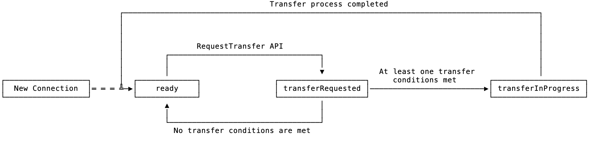

- Feature Name: SQL Proxy Connection Migration
- Status: draft
- Start Date: 2022-01-29
- Authors: Jay Lim (in consultation with Andy Kimball, Jeff Swenson, Rafi Shamim, et al.)
- RFC PR: [#75707](https://github.com/cockroachdb/cockroach/pull/75707)
- Cockroach Issue:
	- (TODO: GitHub Master Issue)
	- https://cockroachlabs.atlassian.net/browse/CC-5385
	- https://cockroachlabs.atlassian.net/browse/CC-5387

# Summary

Migrate SQL connections from one SQL pod to another within the SQL proxy.

# Motivation

Tenants running on CockroachDB Serverless are subjected to scale-up and
scale-down events by the autoscaler due to a variation in SQL traffic. Scale-up
events are often triggered when the CPU loads on existing pods are too high.
When that happens, new SQL pods are created for that given tenant. However, CPU
loads on existing pods may still be high since connections remain in their
initial pods, leading to an imbalance of load usage across all instances. This
imbalance may also occur during a steady state when existing connections
fluctuate in their CPU usages. On the other hand, during a scale-down event from
N + 1 to N pods, where N > 0<sup>[1](#footnote1)</sup>, pods transition into
the draining phase, and the proxy stops routing new connections to them. This
draining phase lasts for at most 10 minutes, and if connections are still active
at the end of the phase, they will be terminated abruptly, which can lead to
poor user experiences.

The connection migration mechanism builds on top of the SQL session migration
work by the SQL Experience team, and solves the aforementioned issues by
enabling us to transfer connections from one pod to another. In particular,
connections can be transferred from draining pods to running ones during
scale-down events, and from busy SQL pods to lightly loaded ones during scale-up
events and steady state. The success criteria of this mechanism is that there
should be minimal rude disconnects during Serverless scale-down events, and
fewer hot spots through better tenant load rebalancing. From the user's
perspective, the connection remains usable without interruption, and there will
be better resource utilization across all provisioned SQL pods.

# Background

In multi-tenant CockroachDB, many tenant clusters may exist on a single shared
host cluster. In the context of CockroachDB Serverless, these tenant clusters
may have zero or more SQL pods, depending on their loads. The SQL proxy
component is a reverse proxy that is used to route incoming traffic for a given
tenant to one of its active SQL pods. This SQL proxy component is what end users
connect to in the Serverless offering. For more details about the Serverless
architecture, see this blog post: [How we built a forever-free serverless SQL database](https://www.cockroachlabs.com/blog/how-we-built-cockroachdb-serverless/).

For every client connection, the proxy selects a backend based on some routing
algorithm, performs authentication with it, and does a [transparent forwarding](https://github.com/cockroachdb/cockroach/blob/ced473fa0ed00660812a6f6678155fb30e6a871f/pkg/ccl/sqlproxyccl/proxy.go#L84-L86)
of all packets from the client to the server without intercepting messages after
the authentication phase.

# Requirements

This RFC is only scoped to _how_ to perform the migration from one SQL pod to
another within the SQL proxy. The details of _when_ to perform the migration
will be discussed in a follow-up RFC. Note that the main use-case here is for
CockroachDB Serverless, and we should optimize for that.

The design is constrained by the following requirements:

1. Correctness of Postgres protocol flow and data transfer:
	- Pgwire messages should not be corrupted during transmission.
	- Messages received by the client must be correct, i.e. the client should
      only receive responses for requests that it initiates.
2. Zero allocations and copying during connection proxying in steady state.
3. Connection migrations are on a best-effort basis as it is known that not
   every connection can be transferred (e.g. sessions with temporary tables or
   active transactions).
4. Proxy can support up to 50K active connections across all tenants, so
   per-connection resource overhead (e.g. memory) should be taken into account
   where appropriate.

# Technical Design

The design is broken down into three parts. The first is message forwarding,
which describes how `io.Copy` can be replaced. The second is connection
establishment, which means selecting a new SQL pod, and authenticating in a way
that the connection can be used by the existing SQL session. Finally, the third
is the actual connection migration mechanism. Throughout this design, a couple
of new components will be introduced: connection interceptor, connector, and
forwarder.

## Message Forwarding

The proxy's main purpose is to forward Postgres messages from the client to the
server (also known as SQL pod), and vice-versa. In the case of client to server,
we will need to be able to:

- pause the forwarding of client messages,
- send a proxy-crafted Postgres message to the server to retrieve the
  connection's state,
- connect to a different SQL pod, and
- resume forwarding of client messages after the connection's state has been
  reloaded.

Note that connection authentication details have been omitted here, and will be
discussed at a later section. All these operations require that _some_ component
is aware of Postgres message boundaries.

We propose to make the proxy aware of pgwire message boundaries. This implies
that the current forwarding approach through `io.Copy` will no longer work. We
will introduce a new connection interceptor component that provides us a
convenient way to read and forward Postgres messages, while minimizing IO reads
 and memory allocations. At a steady state, no allocations should occur, and the
 proxy is only expected to parse the message headers, which is a byte for
 message type, and an unsigned int32 for length.

Since we already know the message length from the header, we could just use
`io.CopyN` to forward the message body, after forwarding the headers to the
server. One immediate drawback to this direct approach is that more system calls
will be incurred in the case where workloads have extremely small messages
(e.g. kv). To solve that, we will introduce an internal buffer within the
interceptor to read messages in batches where possible. This internal buffer
will have a default size of 8KB, which is the same as Postgres' send and receive
buffers of [8KB](https://github.com/postgres/postgres/blob/249d64999615802752940e017ee5166e726bc7cd/src/backend/libpq/pqcomm.c#L134-L135)
each. Each connection uses two interceptors: one for client to server, and the
other for server to client, so at 50K connections, we are looking at a memory
usage of 800MB (8KB x 2 x 50,000), which seems reasonable.

If a Postgres message fits within the buffer, only one IO Write call to the
server will be incurred. Otherwise, we would invoke a single IO Write call for
the partial message, followed by `io.CopyN` for the remaining bytes. Using
`io.CopyN` directly on the remaining bytes reduces the overall number of IO
Write calls in the case where the entire message is at least double the buffer's
size. Even with an internal buffer, we do not restrict the maximum number of
bytes per message. This means that the `sql.conn.max_read_buffer_message_size`
cluster setting that sets the read buffer size in the SQL pod will still work on
a per-tenant basis.

On a high-level overview, the interceptor will have the following API:

```go
// PeekMsg returns the header of the current pgwire message without advancing
// the interceptor. On return, err == nil if and only if the entire header can
// be read. Note that size corresponds to the body size, and does not account
// for the size field itself.
func (p *pgInterceptor) PeekMsg() (typ byte, size int, err error) {
    ...
}

// WriteMsg writes the given bytes to the destination.
func (p *pgInterceptor) WriteMsg(data []byte) (n int, err error) {
   ...
}

// ReadMsg returns the current pgwire message data in bytes and its type. It
// also advances the interceptor to the next message. On return, the typ and
// body fields are valid if and only if err == nil.
//
// NOTE: This may allocate if the message does not fit within the interceptor's
// internal buffer, and the caller should always assume that the returned body
// is owned by the interceptor. This returned body is valid until the next
// time PeekMsg, ReadMsg, or ForwardMsg is called.
func (p *pgInterceptor) ReadMsg() (typ byte, body []byte, err error) {
    ...
}

// ForwardMsg sends the current pgwire message to the destination, and advances
// the interceptor to the next message. On return, n == pgwire message size if
// and only if err == nil.
func (p *pgInterceptor) ForwardMsg() (n int, err error) {
    ...
}
```

The generic interceptor above will then be used by interceptors which are aware
of the [frontend and backend Postgres protocol](https://www.postgresql.org/docs/9.3/protocol.html).
For example, the following describes the interceptor for frontend (i.e. client
to server), and the backend version will be similar:

```go
func (p *FrontendInterceptor) PeekMsg() (typ pgwirebase.ClientMessageType, size int, err error) {
    byteType, size, err := p.PeekMsg()
    return pgwirebase.ClientMessageType(byteType), size, err
}

func (p *FrontendInterceptor) ReadMsg() (msg pgproto3.BackendMessage, err error) {
    typ, body, err := p.ReadMsg()
    if err != nil {
        return nil, err
    }
    // ChunkReader here corresponds to an implementation of pgproto3.ChunkReader.
    cr := newChunkReader(typ, body)
    // This parses the message's body as well.
    f := pgproto3.NewFrontend(cr, errWriter)
    return f.Receive()
}

func (p *FrontendInterceptor) WriteMsg(data pgproto3.BackendMessage) (n int, err error) {
    return p.WriteMsg(data.Encode(nil))
}

func (p *FrontendInterceptor) ForwardMsg() (n int, err error) {
    return p.ForwardMsg()
}
```

The caller calls `PeekMsg` to determine the type of message. It could then
decide if it wants to forward the message (through `ForwardMsg`), or parse the
message for further processing (through `ReadMsg`). Finally, `WriteMsg` provides
a convenient way to send a pgproto3 message to the destination.

## Connection Establishment

Connection establishment has two parts: SQL pod selection, and authentication.
We will reuse the existing SQL pod selection algorithm: [weighted CPU load balancing](https://github.com/cockroachdb/cockroach/blob/62392dcd0f03a2bef1dc6d0431e505f5125297e8/pkg/ccl/sqlproxyccl/tenant/pod.go#L20-L43).
The probability of a pod being selected is inversely proportional to the pod's
load. For security concerns, we will not store the original authentication
information entered by the user within the proxy, and will make use of the
token-based authentication added [here](https://github.com/cockroachdb/cockroach/pull/74640).
This token will be retrieved by the proxy during the migration process through
a proxy-crafted Postgres message, and passed in as the password during
authentication. This feature is enabled by passing in a custom
[`crdb:session_revival_token_base64`](https://github.com/cockroachdb/cockroach/blob/bb85ddc4fc0ad8761d7aba61315da22b433022e3/pkg/sql/pgwire/server.go#L789-L797)
status parameter as part of the Postgres StartupMessage after connecting to the
SQL pod. To ensure that this feature isn't abused by clients, the proxy will
block all StartupMessage messages with that custom status parameter.

Currently, the logic that connects to a new SQL pod for a given tenant is
coupled with the [proxy's handler](https://github.com/cockroachdb/cockroach/blob/ad27839166526a92444bf0f719cf9ec5f62c2f7f/pkg/ccl/sqlproxyccl/proxy_handler.go#L209).
At the same time, the [authenticate](https://github.com/cockroachdb/cockroach/blob/ad27839166526a92444bf0f719cf9ec5f62c2f7f/pkg/ccl/sqlproxyccl/authentication.go#L21)
function that is used for authentication is coupled with the throttler. We
propose to add a new connector component that will be used to establish new
connections, and authenticate with the SQL pod. This component will support
various hooks that the throttler component could register itself on, decoupling
the throttler and the authenticator. This connector component will support all
existing authentication methods, in addition to the newly added token-based
authentication that was mentioned above.

## Connection Migration

All message forwardings are handled by this [ConnectionCopy](https://github.com/cockroachdb/cockroach/blob/62392dcd0f03a2bef1dc6d0431e505f5125297e8/pkg/ccl/sqlproxyccl/proxy.go#L84-L124)
function, which uses `io.Copy` for bi-directional copying of Postgres messages
between the client and server. This function will be replaced with a new
per-connection forwarder component. The forwarder uses two interceptors within
the separate processors: request and response processors. The former handles
packets between the client and the proxy, whereas the latter handles packets
between the proxy and the connected SQL pod.

The forwarder goes through various states, as illustrated in the diagram below:



The forwarder begins with the `ready` state, and in this state, all request
messages are forwarded from the client to the server, and vice-versa for
response messages. The forwarder exposes a `RequestTransfer` API that can be
invoked, and this puts the forwarder into the `transferRequested` state. A UUID
will then be generated as a transfer key to uniquely identify the transfer
request. In this `transferRequested` state, all blocked Read calls within the
request processor will be unblocked with a custom error message. This is
achieved by wrapping the client's connection with a custom [net.Conn](https://github.com/cockroachdb/cockroach/blob/62392dcd0f03a2bef1dc6d0431e505f5125297e8/pkg/sql/pgwire/conn.go#L1737)
that checks for exit conditions during a Read call.

Once unblocked, the request processor checks for any one of the following
conditions:

1. The last message sent to the SQL pod was a Sync(S) or SimpleQuery(Q), and a
   ReadyForQuery(Z) has already been received at the time of evaluation.
2. The last message sent to the SQL pod was a CopyDone(c), and a ReadyForQuery(Z)
   has already been received at the time of evaluation.
3. The last message sent to the SQL pod was a CopyFail(f), and a ReadyForQuery(Z)
   has already been received at the time of evaluation.

Note that sending a new message to the SQL pod invalidates the fact that a
ReadyForQuery has already been received. (3) handles the case where the COPY
operation was requested through a SimpleQuery. CRDB does not currently support
the COPY operation under the extended protocol, but if it does get implemented
in the future, (1) will handle that case as well. It is known that sessions
with prepared statements cannot be transferred with the existing mechanisms, but
if that gets implemented in the future, (1) will automatically handle that case.

If no conditions are satisfied, the forwarder goes back into the `ready` state,
and forwarding resumes. It is the responsibility of the caller to retry the
transfer process where appropriate. If any one of the above conditions hold
true, the forwarder will begin the transfer process by moving into the
`transferInProgress` state. In this state, the request processor will be
blocked, and the forwarder sends a transfer session message with the transfer
key that was created earlier. The transfer request begins with sending the
following SimpleQuery message to the SQL pod:

```
SHOW TRANSFER STATE [ WITH '<transfer_key>' ]
```

This query is an [observer statement](https://github.com/cockroachdb/cockroach/blob/d446076674660b425dc06842a14e7946f70df59d/pkg/sql/sem/tree/stmt.go#L147-L160),
allowing messages to go through if the session is in a failed transaction state.
The goal of this statement is to return all the necessary information the caller
needs in order to transfer a connection from one SQL pod to another. The query
will always return a single row with four columns:
- `transfer_key`: The transfer key passed to the statement. If no key was given,
  this will be an empty string.
- `transfer_error`: The transfer error if the transfer state cannot be retrieved
  (e.g. session_state cannot be constructed).
- `session_state_base64`: The base64 serialized session state. This is
  equivalent to base64-encoding the result of [`crdb_internal.serialize_session`](https://github.com/cockroachdb/cockroach/blob/d3cd817c590662217694829d70c6d936b00913dc/pkg/sql/sem/builtins/builtins.go#L6298).
- `session_revival_token_base64`: The base64 token used for authenticating a
  new session through the token-based authentication described earlier. This is
  equivalent to base64-encoding the result of [`crdb_internal.create_session_revival_token`](https://github.com/cockroachdb/cockroach/blob/d3cd817c590662217694829d70c6d936b00913dc/pkg/sql/sem/builtins/builtins.go#L6398).

One unique aspect to the observer statement above is that all transfer-related
errors are returned as a SQL field, rather than a pgError that gets converted to
an ErrorResponse. The rationale behind this decision is that whenever an
ErrorResponse gets generated _during_ a transfer, there is ambiguity in
detecting whether the response is for the client or the proxy, and the only way
to ensure protocol correctness is to terminate the connection. Note that the
design does not eliminate the possibility of an ErrorResponse since that may
still occur before the query gets processed. In terms of implementation, the
`SHOW TRANSFER STATE` statement will invoke internal methods directly
(e.g. [`planner.CreateSessionRevivalToken()`](https://github.com/cockroachdb/cockroach/blob/71becf337d9d2731298dc092f3ce9cf0f0eedb2c/pkg/sql/session_revival_token.go#L20)).
See prototype of implementation [here](https://github.com/imjching/cockroach/commit/87c89c7fcbf2dfe00e6653bacba405626c2c7a85).

In the ideal scenario, this SimpleQuery generates four Postgres messages in the
following order: RowDescription(T), DataRow(D), CommandComplete(C),
ReadyForQuery(Z). The response processor will detect that we're in the transfer
phase, and start parsing all messages if the types match one of the above.

If we receive an ErrorResponse message from the server at any point during the
transfer phase before receiving the transfer state, the transfer is aborted, and
the connection is terminated. Messages will always be forwarded back to the
client until we receive the desired response. The desired response is said to
match if we find the transfer key in the DataRow message. If we do not get a
response within 15 seconds, the transfer is aborted, and the connection is
terminated. This situation may occur if previously pipelined queries are
long-running, or the server went into a state where [all messages are ignored](https://github.com/cockroachdb/cockroach/blob/62392dcd0f03a2bef1dc6d0431e505f5125297e8/pkg/sql/pgwire/conn.go#L404-L409)
until a Sync has been received.

The forwarder then uses the connector with the session revival token to
establish a connection with a new SQL pod. In this new connection, the forwarder
deserializes the session by sending a SimpleQuery with
`crdb_internal.deserialize_session(decode('<session_state>', 'hex'))`.

Transfer process within the forwarder completes by transitioning into the `ready`
state, and the request processor unblocks. Note that we will try to resume a
connection in non-ambiguous cases such as failing to establish a connection, or
getting an ErrorResponse when trying to deserialize the session.

## Rationale and Alternatives

### Making the proxy protocol-aware instead of leaving it to the server

When forwarding pgwire messages, the current forwarding approach through
`io.Copy` does not allow us to detect message boundaries easily. The SQL server
is already protocol-aware, and could detect message boundaries easily. However,
we'd need a way for the proxy to stop sending messages to the SQL pod. If we
just stop the forwarding abruptly, some packets may have already been sent to
the server. The only way to get this work is for the SQL pod to send back the
partial packets, and is just too complex to get it right. Furthermore, we need
to signal the server that the connection is about to be transferred, and all
incoming packets should not be processed. This may require a separate connection
to the server. To avoid all that complexity, the simplest approach here is to
make the proxy protocol-aware since it has control over what gets sent to the
SQL pod.

### Creating a custom interceptor with internal buffer instead of reusing existing ones

Since we have decided to split `io.Copy` so that the proxy is protocol-aware,
we'd need some sort of buffer to read the message types and lengths into.

The existing implementation of [pgwirebase.ReadBuffer](https://github.com/cockroachdb/cockroach/blob/a23cf94c9bf72a77cd08037df082a2a3f2e5d948/pkg/sql/pgwire/pgwirebase/encoding.go#L90-L94)
has a maximum message size limitation, which is configurable through the
`sql.conn.max_read_buffer_message_size` cluster setting (default: 16MB). Using
this within the proxy requires us to impose the same maximum message size
limitation across all tenants, and this would render the existing cluster
setting not very useful. To add on, pgwirebase.ReadBuffer [allocates](https://github.com/cockroachdb/cockroach/blob/a23cf94c9bf72a77cd08037df082a2a3f2e5d948/pkg/sql/pgwire/pgwirebase/encoding.go#L173)
every time the message type is read, which is what we'd like to avoid during the
forwarding process.

The other option would be to make use of pgproto3's Receive methods on the
[Frontend](https://github.com/jackc/pgproto3/blob/40ecac487c46292c2139a1fc7a7365be2a287ba6/frontend.go#L70)
and [Backend](https://github.com/jackc/pgproto3/blob/40ecac487c46292c2139a1fc7a7365be2a287ba6/backend.go#L108)
instances. These instances come with an additional decoding overhead for every
message. For the proxy, there is no need to decode the messages in a steady
state.

From the above, it is clear that existing buffers would not work for our use
case, so we chose to implement a custom interceptor.

### Using 8KB as the default internal buffer size within the interceptor

In the original design, 16KB was proposed, and there were concerns on the proxy
taking up too much memory for idle connections since these buffers are fixed in
size, and have to be allocated upfront. This would be a classic tradeoff between
memory and time. With a smaller buffer size, up to a minimum of 5 bytes for the
header, we incur more syscalls for small messages. On the other hand, we use
more memory within the proxy and copy more bytes into the userspace if we use a
larger buffer size. Note that the latter part is a disadvantage because
`io.CopyN` with a TCP connection uses the [splice system call](https://go.googlesource.com/go/+/go1.17.3/src/net/tcpsock_posix.go#49)
to avoid copying bytes through the userspace.

We ran a couple of workloads to measure the median message sizes across a
30-second run. The results in bytes are as follows: kv (\~10), tpcc (\~15),
tpch (\~350). Considering the fact that small messages are very common, we would
allocate a small buffer to avoid the performance hit due to excessive syscalls
during proxying. Since one of the proxy's requirements would be to support up to
50K connections, an 8KB buffer is reasonable as that would total up to
8KB x 2 x 50,000 = 800MB. 8KB was also picked as it [matches](https://github.com/postgres/postgres/blob/249d64999615802752940e017ee5166e726bc7cd/src/backend/libpq/pqcomm.c#L134-L135)
the lengths of Postgres' send and receive buffers.

### Using a custom pgwire message for the connection migration

In the design above, the forwarder checks for specific conditions before sending
the transfer session message. The original design of the connection migrator did
not have this step, and without this step, we have a problem when sending a
transfer session message in the middle of a COPY operation because this will
result in an [unrecognized message type](https://github.com/cockroachdb/cockroach/blob/d446076674660b425dc06842a14e7946f70df59d/pkg/sql/copy.go#L305-L307)
error, aborting the transfer, and finally closing the connection. One approach
that can be used to solve this is to introduce a new pgwire message type that
will return a custom response that the proxy could detect, and continue the COPY
operation. As noted in various discussions, including the token-based
authentication RFC, this is a more fundamental divergence from the standard
protocol. This approach is risky since message types are denoted by a single
byte, and there's a possibility that there will be conflicts in the future.

### Detecting a safe transfer point through counting pgwire messages

This design proposes a best-effort migration strategy by checking for specific
conditions before sending the transfer request. If by any chance none of the
conditions hold, the forwarder just does not perform the transfer, and it is the
responsibility of the caller to retry. The forwarder will expose a last
transfer state to indicate that the transfer request has failed.
This approach comes with several drawbacks:

1. The ReadyForQuery in condition (1) may not correlate with the Sync or
   SimpleQuery that was sent earlier since there could be in-flight queries in
   the pipelined case.
2. If there was an in-flight query that puts the SQL server in the copy-in or
   copy-out state, the transfer session query will fail with an error, and the
   connection will be closed.
3. Previous in-flight queries may be long-running, and are blocking.
4. The server could end up in a state where the transfer session request got
   [ignored](https://github.com/cockroachdb/cockroach/blob/d446076674660b425dc06842a14e7946f70df59d/pkg/sql/pgwire/conn.go#L404-L410) in the extended protocol because of a previous error.

An alternative design that was considered is to count the number of pgwire
messages to detect a safe transfer point, which should solve all the drawbacks
above. A safe transfer point is said to occur when the number of Sync and
SimpleQuery messages is the same as the number of ReadyForQuery messages, with
some caveats. We would need to handle edge cases for (4). Similarly, some state
bookkeeping needs to be done within the proxy to handle COPY operations. All
this could get complex, and can be difficult to get it right.

In the best-effort migration approach, if scenario (1) occurs, the forwarder
will continue to send messages to the client. The only case where this matters
is if an error occurs through an ErrorResponse message, which in this case, the
connection will be closed. Based on telemetry data, the number of Serverless
clusters using the COPY operation is extremely low, so scenario (2) is really
rare. Scenarios (3) and (4) will be handled by the timeout handler, and the
connection will be closed when that is triggered.

### Using normal statements instead of observer statements

In condition (1), we will send the transfer session message whenever the last
message sent to the SQL pod was Sync or SimpleQuery, and ReadyForQuery has
already been received during evaluation time. This protocol flow has no notion
of transaction status. If the transfer session message is a normal statement
instead of an observer statement, we may fail with an ErrorResponse if the
message was sent in a state where the session is in a failed transaction state,
resulting in a connection termination due to ambiguity. An observer statement
is simple, and it appears that there are no major drawbacks to this.

## Possible Future Extensions

1. Implement an adaptive system for the internal buffer within the interceptor.
   The buffer size can be adapted to a multiple of the median size of pgwire
   messages, up to a maximum limit. This may address the situation where idle
   connections are taking up 16KB of memory each for the internal buffers.
2. Under memory pressure of SQL proxy, a hard limit can be imposed on the number
   of connections per tenant, and the proxy could return a “server busy” error.

# Follow-Up Work

The connection migration feature as outlined in this document will not be
immediately used by the proxy. A follow-up will be written to outline when the
proxy will be invoking the `RequestTransfer` API on the active connection
forwarders. That RFC will cover distributed tenant load balancing for fewer hot
spots, and graceful connection draining to minimize rude disconnects during
scale-down events. The former requires some analysis, whereas the latter is
straightforward, which can occur whenever the pod watcher detects that a pod has
transitioned into the DRAINING state. This, however, will require us to keep
track of per-pod connection forwarders.

# Unresolved questions

N/A.

# Footnotes

<a name="footnote1">1</a>: In the case of a single SQL pod remaining for a given
tenant, the autoscaler will only invoke a scale-down event if and only if there
are no active connections on it.
