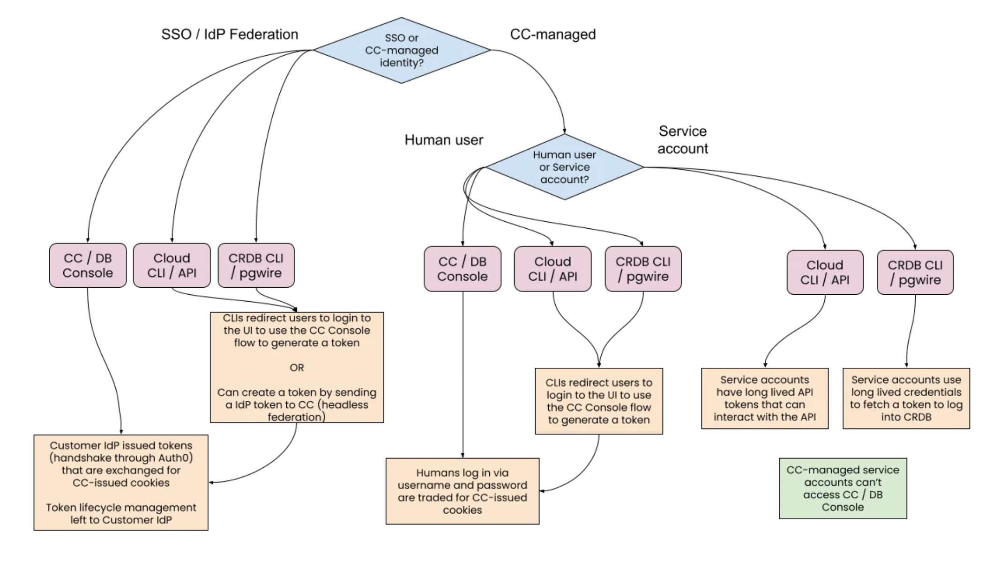

- Feature Name: SSO Authentication
- Status: draft
- Start Date: 2022-05-24
- Authors: Cameron Nunez
- RFC PR: #82540

# Summary

This RFC proposes introducing Console-issued accept tokens as a CRDB login 
method. This change would enable single sign-on (SSO) for CRDB, allowing users
to login automatically and have a more consolidated login experience for CRDB and 
CC Console. 

This RFC seeks to achieve the following goals:
* Customers are able to use short-lived credentials to access CRDB.
* Users are able to create sessions without using "something you know" 
authentication.
* Users, having only entered login credentials into their identity provider, 
are able to create an active CRDB session with a Console cluster.
* Service accounts, hosted in CC or in the customer's identity provider, are 
able to create a CRDB session. 

The following are out of scope:
* Authorization e.g. user permissions propagation from CC to CRDB
* Just-in-time provisioning of SQL users at login time
* SSO for DB Console

# Motivation

Customers are currently unable to enforce their enterprise authentication policies and 
are unable to ensure a single point of access across the product for their users.

As support for CC SSO grows, it is crucial that we provide SSO for CRDB as well 
to prevent any confusion for organization admins regarding seeing
different authentication methods across the product. 

# Background

Currently, clients can authenticate themselves to the server in the following ways:
* Password 
* SCRAM 
  * A password hashing protocol that offers multiple security benefits 
  over password.
  * Recommended over password, assuming clients can support it (many do not).
* Certificate
  * A certificate/key pair that is signed by a certificate authority is used to 
  authenticate the client.
  * Not supported for Cloud instances.
* Trust (and Reject)
  * Always allows access or never allow access.
  * Usually paired with restrictions such as requiring requests come 
  from specific IP addresses or unix sockets
* Kerberos / GSSAPI
    * Not supported for Cloud instances.

This RFC proposes to add another authentication method that will have access 
tokens, more specifically JSON Web Tokens (JWTs), to be passed into the password field, 
and this new method will achieve the aforementioned goals.

# Technical Design

The token credentials will consist of an access token and a refresh token. The access 
tokens will be signed and short-lived while the refresh tokens will be opaque and 
long-lived. 

Refresh tokens can be sent to the credential issuer to retrieve a new set of 
token credentials. 

The CRDB CLI login flow using tokens as credentials will be this:
1. CRDB CLI redirects the user to CC Console to complete the login flow.
2. A set of access and refresh token credentials are generated.
3. The access token is passed as an authentication credential into the password field in CLI.
4. CRDB recognizes that the credential is token-based and validates the 
user, based on which either the request succeeds or fails.

For application clients, one difference is that the user directly fetches the token credentials 
issued by CC instead of receiving it. 

**Add a SQL authentication method that uses access tokens** 

A new login method will be created that will allow an access token to be 
presented as a password during the normal login flow. Recognizing that
it is a token, CRDB will then verify the token's signature and will accept 
it as authentication. This verification will happen without a network call.

**Add a CC API endpoint to refresh login tokens**

A CC API (`GenerateTokens`) will be added to allow users to retrieve a new 
set of token credentials. We can have an endpoint `\tokens` which the user can
use to submit a request. 

Request parameters:
* `client_id` the client's identification
* `refresh_token` the user sets this to the refresh token they previously 
received.

Response elements:
* `access_token` the token that allows the user to gain access to CRDB.
* `refresh_token` the token that can be used to retrieve new token credentials.
* `expires_in` the number of seconds until the access token expires.

**Expected Authentication Scenarios**

## Drawbacks
This approach requires that we add more urgency to minimize CC downtime, since any downtime 
would result in login failures.

In the case of a transient network disruption, the CRDB SDK should either (1) 
continually keep an active access token or (2) refresh the access token 
in the case of the event. Unfortunately, most PostgreSQL clients cannot handle 
the refresh pattern, so users would have to add in tools or libraries provided 
by us in order to use any non-CRL DB clients. 

Once a SQL connection is made, the connection will persist even if the 
credential expires, which can be seen as problematic.

## Alternatives

**Auto-generated, short-lived passwords**

We could use auto-generated passwords that would be 
sent from CC to CRDB. We can use passwords as long as they are complex enough 
that they cannot be feasibly remembered. 

Drawbacks:
* For every token refresh, CC would need to reach into CRDB to issue a password change.
* Assuming no significant changes to the password infrastructure, this change 
would imply that for each database, there would be only a single active 
credential for a user at any given time.

Advantages:
* Builds on existing password infrastructure.

**Opaque accept tokens**

We could use SQL accept tokens that are opaque instead of signed.

Drawbacks:
* Increases time to login since every login requires consultation with CC.

Advantages:
* Easy to revoke tokens.
* Increased security (token only understood by CC, the issuer).
