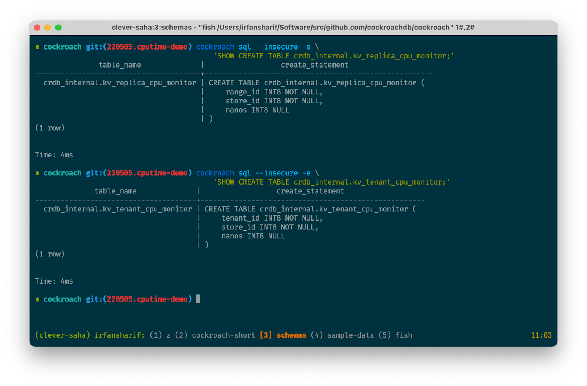
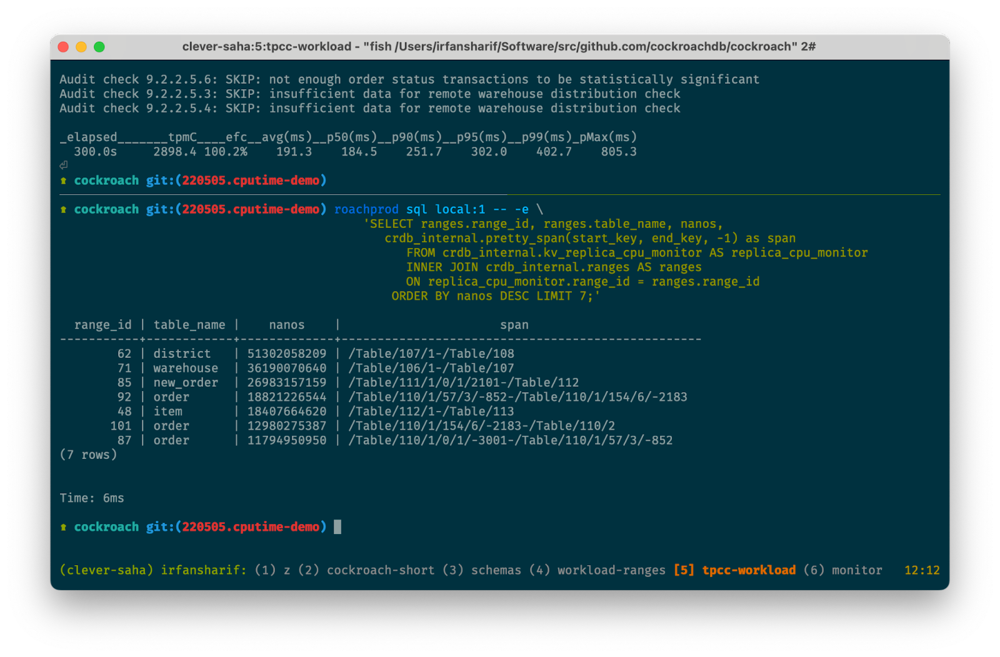
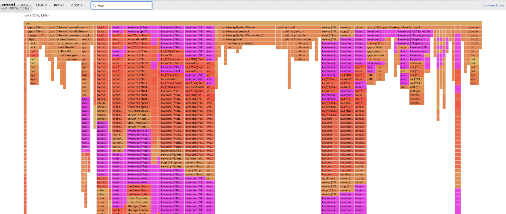

- Feature Name: Fine-grained CPU attribution
- Status: accepted
- Start Date: 2022-06-02
- Authors: Irfan Sharif, Austen McClernon
- RFC PR: [#82356](https://github.com/cockroachdb/cockroach/pull/82356)
- Cockroach Issue: N/A

# Summary

We propose using a patched Go runtime to track CPU use at the level of
individual goroutines, using the primitive to derive an accurate resource
consumption signal in various CRDB subsystems. The compiler, language, and
tooling will remain the same.

*NOTE: This RFC started off as an internal gdoc (grep for "Fine-grained CPU
attribution" with valuable commentary and additional links).*

## Motivation

CRDB lacks primitives to attribute CPU usage to specific scopes (ranges,
tenants, sessions, statements) or processes (pebble compactions, snapshot
generation). For subsystems that rely on such attribution, we use proxy signals
like '# of batch requests' or 'size of read/write request' as observed by a
range/replica or a given tenant. With respect to modeling CPU usage, this is:
- Inaccurate: two proportions of the signal can translate to different
  proportions of actual CPU usage;
- Imprecise: repeated equal measurements of the signal can correspond to varied
  actual CPU usage.

The inaccuracy and imprecision are due to:
- Different batch requests having different compositions with respect to the
  underlying requests;
- Different request types varying in how much CPU activity they incur;
- Requests on different stores having different CPU activity depending on LSM
  health, sub-levels, latch contention with other requests.
- Requests being variadic in their size and costing accordingly.

This can lead to suboptimal decisions (placement and forecasting in the
allocator, resource control in the per-store tenant rate limiter), and is
difficult to reason about. The latter also becomes important as we build
[visualizations](https://github.com/cockroachdb/cockroach/pull/76895) for CRDB
internal state for end-users.

Our proxy signals don’t generalize to other subsystems, some of which
consequently are CPU unaware. Changefeed processor placement for e.g. is
agnostic to the CPU usage driven by the processors themselves, and can lead to
CPU hotspots and poor cluster-wide resource utilization. It's difficult today to
answer how much cluster-wide CPU usage a single statement execution drove, or
what % of CPU on a given node is due to activity on a specific index, or driven
by a specific tenant.

## Design

The time spent per-goroutine in the running state (henceforth "CPU time") is an
accurate and precise measure for CPU usage. This is not currently tracked by
the Go runtime (though there's an
[issue](https://github.com/golang/go/issues/41554) upstream); we propose doing
so with the following patch:

```diff
diff --git a/src/runtime/runtime2.go b/src/runtime/runtime2.go
index 1e4f872726..ced56dc4f6 100644
--- a/src/runtime/runtime2.go
+++ b/src/runtime/runtime2.go
@@ -488,6 +487,9 @@ type g struct {
     labels         unsafe.Pointer // profiler labels
     timer          *timer         // cached timer for time.Sleep
     selectDone     uint32         // are we participating in a select and did someone win the race?
+    lastsched      int64          // timestamp when the G last started running
+    runningnanos   int64          // wall time spent in the running state


diff --git a/src/runtime/proc.go b/src/runtime/proc.go
index f5e528e8e9..9f938311b8 100644
--- a/src/runtime/proc.go
+++ b/src/runtime/proc.go
@@ -994,8 +994,18 @@ func casgstatus(gp *g, oldval, newval uint32) {
         }
     }

-    // Handle tracking for scheduling latencies.
+    // Handle tracking for scheduling and running latencies.
+    now := nanotime()
+    if newval == _Grunning {
+        // We're transitioning into the running state, record the timestamp for
+        // subsequent use.
+        gp.lastsched = now
+    }
     if oldval == _Grunning {
+        // We're transitioning out of running, record how long we were in the
+        // state.
+        gp.runningnanos += now - gp.lastsched
+
         // Track every 8th time a goroutine transitions out of running.
         if gp.trackingSeq%gTrackingPeriod == 0 {
             gp.tracking = true
@@ -1007,14 +1017,12 @@ func casgstatus(gp *g, oldval, newval uint32) {
             // We transitioned out of runnable, so measure how much
             // time we spent in this state and add it to
             // runnableTime.
-            now := nanotime()
             gp.runnableTime += now - gp.runnableStamp
             gp.runnableStamp = 0
         }
         if newval == _Grunnable {
             // We just transitioned into runnable, so record what
             // time that happened.
-            now := nanotime()
             gp.runnableStamp = now
         } else if newval == _Grunning {
             // We're transitioning into running, so turn off
@@ -3258,6 +3266,14 @@ func dropg() {
     setGNoWB(&_g_.m.curg, nil)
 }

+// grunningnanos returns the wall time spent by current g in the running state.
+// A goroutine may be running on an OS thread that's descheduled by the OS
+// scheduler, this time still counts towards the metric.
+func grunningnanos() int64 {
+    gp := getg()
+    return gp.runningnanos + nanotime() - gp.lastsched
+}
+
 // checkTimers runs any timers for the P that are ready.
 // If now is not 0 it is the current time.
 // It returns the passed time or the current time if now was passed as 0.
@@ -3491,6 +3507,8 @@ func goexit0(gp *g) {
     gp.param = nil
     gp.labels = nil
     gp.timer = nil
+    gp.lastsched = 0
+    gp.runningnanos = 0

     if gcBlackenEnabled != 0 && gp.gcAssistBytes > 0 {
         // Flush assist credit to the global pool. This gives
diff --git a/src/runtime/sizeof_test.go b/src/runtime/sizeof_test.go
index 9ce0a3afcd..71de8052bd 100644
--- a/src/runtime/sizeof_test.go
+++ b/src/runtime/sizeof_test.go
@@ -21,7 +21,7 @@ func TestSizeof(t *testing.T) {
         _32bit uintptr // size on 32bit platforms
         _64bit uintptr // size on 64bit platforms
     }{
-        {runtime.G{}, 240, 392},   // g, but exported for testing
+        {runtime.G{}, 256, 408},   // g, but exported for testing
         {runtime.Sudog{}, 56, 88}, // sudog, but exported for testing
     }
```

Background: The runtime maintains a `type g struct` for every goroutine, and
the scheduler is responsible for transitioning each one through various
[states](https://github.com/golang/go/blob/afd181cf0b69c3591d7e47ceca4fabf14434d77e/src/runtime/runtime2.go#L14-L85).
`_Grunning` is the one we're interested in, which indicates that the goroutine
may execute user (i.e. CRDB) code. The goroutine is also assigned to an OS
thread (`type m struct`) that is in turn assigned to a CPU core (`type p
struct`). In addition to the `src/runtime` [package
docs](https://github.com/golang/go/blob/cc4957a5f6eba946f359ed9646ec3e5083a259a9/src/runtime/proc.go#L19-L111),
[Kavya Joshi's](https://www.youtube.com/watch?v=YHRO5WQGh0k) and [Dmitry
Vyukov's](https://www.youtube.com/watch?v=-K11rY57K7k) presentations on the
runtime internals can serve as helpful reading material.

At the point where a `g` transitions in and out of the `_Grunning` state, we
maintain per-`g` counters that capture the wall time spent in that state. It's
possible for an OS thread (`m`) that a goroutine (`g`) was running on to be
descheduled by the OS scheduler in favor of non-CRDB processes running on the
same node. This is invisible to the Go runtime, and as such, the patch above
will count this off-CPU time towards the per-`g` total (this is evaluated
below).

### Comparison to RUs and '# of batch requests'

In multi-tenant environments we currently model CPU usage using a linear model
of the '# of read/write requests' and their corresponding sizes. We use this
linear model for cost attribution and resource control, models that are more or
less accurate depending on how the running workload compares to the workloads
we've trained the linear model using. Improved signal accuracy for CPU
translates to:
- Better accounting independent of how we present consumption (RUs, rows
  read/written), we should know what patterns we're subsidizing;
- Performance predictability in multi-tenant environments.

Derived signals like '# of batch requests' are hard to map to the underlying
hardware capacities or utilization. Base signals like 'time-spent on CPU', in
contrast, are easier to normalize to capacity and infer utilization from. We
imagine introducing similar base signals for other resources of interest (disk
IOPs and bandwidth) and tooling rebalancing algorithms to directly consider
independent hardware dimensions separately instead of using [signals that
combine](https://github.com/cockroachdb/cockroach/issues/34590)
dimensions.<sup>[disk-util].</sup> We can try
[calibrating](https://github.com/cockroachdb/cockroach/pull/76252) derived
signal models using experimental data, an expensive process even without varying
for saturation, hardware, contention, etc. Even perfect models would need
recalibration as the implementation changes, placing practical limits on how
accurate they can be.

### Short-term use cases

We propose the following features to build experience with using a modified
runtime, and to further evaluate signal accuracy:
- Observability: A per-store CPU usage breakdown by ranges and tenants, powered
  by measured CPU time. We'd make this accessible through vtables and include
  results in debug zips, serving as a CPU-only version of today's hot-ranges
  report. This was prototyped, results below.
- Observability: Surfacing per-statement cluster-wide CPU usage as part of
  `EXPLAIN ANALYZE`.
- (stretch goal) Tenant isolation: Integrating measured CPU time in the [tenant
  rate limiter](https://github.com/cockroachdb/cockroach/issues/77041) to
  improve performance predictability observed by tenants sharing KV nodes.
    - We foresee integrating the tenant rate limiter into admission control which
      would help evaluate how effective this is as a signal for CPU resource
      control.

From an earlier
[prototype](https://github.com/irfansharif/cockroach/tree/220505.cputime-demo)
exposing per-store replica/tenant CPU time:





### Usage across machines, goroutines, and code paths

It's common to spawn multiple goroutines for the same operation and to also do
so across RPC boundaries. For the latter (say, if looking to accumulate
cluster-wide CPU usage for a given statement) we can propagate per-node
request-scoped total CPU time using tracing events; this is plumbing that
already exists. For request-scoped total CPU time across cooperating goroutines,
we can atomically maintain a counter stashed in the surrounding context. To
retrieve per-goroutine running time, we imagine doing so in libraries we already
use to manage goroutine lifetimes (`Stopper`, `ctxgroup`), lending more weight
to [banning](https://github.com/cockroachdb/cockroach/issues/58164) naked `go`s
altogether.

For work done per-store that's attributable to an individual range or tenant, we
don’t go through a single code path (the `Sender` stack). Consider KV queues
that step through individual replicas at a time and do some work on behalf of
each one, work we’d perhaps want to attribute to the specific replicas/tenants.
In prototypes, we captured CPU profiles from KV under stock workloads to get a
broad sense of what stack traces are attributable to individual ranges/tenants
and opted into tracking at those points (purple segments in the figure below) to
maintain a store-level view of how much CPU activity is driven by a specific
range/tenant.<br></br>


### Development and release

We point to [mirrored
artifacts](https://github.com/cockroachdb/cockroach/blob/1e1ff14e73680b1a0e2877f8dc0bc56a657fc50c/WORKSPACE#L148-L150)
of the Go runtime that engineers use when building/running tests through Bazel.
The official CRDB release binaries [use
Bazel](https://github.com/cockroachdb/cockroach/pull/76897), using the same
mirrored runtime. Pointing to a modified runtime<sup>[release-go]</sup> is a
matter of hosting it in publicly maintained buckets for things to "just work"
([prototype](https://github.com/irfansharif/runner/blob/153154c3cd9825ef067a11bf98ef8b0501db54d0/WORKSPACE#L38-L48)).
As for deprecated Make based workflows, we can ensure that CRDB library
components/tests that make use of the runtime patch are gated behind a
bazel-only build tag. This would also provide IDE integration.

### Future runtime changes

We argue that this proposal should be considered more along the lines of a
patchset (and one that we [intend to
upstream](https://github.com/golang/go/pull/51347)) than a hard fork. A parallel
is whenever we patch a 3rd-party library and point to CRDB forks, we still send
out PRs and point back to upstream SHAs once they’re merged. In this lens, Bazel
only provides machinery to do the same for the Go runtime. The review
discussions around a new public API for the counter is an important
consideration for the Go team but less so for us; we’d happily `go:linkname`
against tracked fields or private helpers to get what we need (we do similar
things for [goroutine
IDs](https://github.com/petermattis/goid/blob/07eaf5d0b9f4a816ddb51ceb22e6a9a16eef7d33/runtime_go1.9.go#L21-L36)
and [runnable
goroutines](https://github.com/cockroachdb/cockroach/tree/6b87aa6/pkg/util/goschedstats)).
Independent of if/when it’s upstreamed, we can avoid coupling using precise
attribution to the major Go release the change possibly appears; the diff is
conservative in size to make it easy to patch to minor/major Go releases going
forward. We expect future proposals for runtime changes, if any, to be evaluated
on their own terms. Some guidelines to consider: patch size, review expertise,
upstream-ability, fallback behavior without runtime changes, proximity to
`crypto` ("core" functionality in general), and performance implications.

## Evaluation

Under stock TPC-C runs we verified that measured CPU time was:
- Stable over time, under idle conditions and sustained load;
- Trends with actual CPU usage (baseline: CRDB process CPU %), can be normalized
  to capacity and used to forecast effect of range/tenant movement.

Smoke tests running `kv --init --read-percent 50 --concurrency 1000 --ramp 1m
--duration 4m` on a multi-node cluster showed no discernible throughput or
latency impact when built with the proposed Go changes. Retrieving the goroutine
running time (included is the vDSO call to `nanotime()`) is in the order of
nanoseconds:

```
goos: linux
goarch: amd64
cpu: Intel(R) Xeon(R) CPU @ 2.20GHz
BenchmarkGRunningNanos
BenchmarkGRunningNanos-24       195321096               30.67 ns/op
BenchmarkGRunningNanos-24       195100147               30.77 ns/op
BenchmarkGRunningNanos-24       195415414               30.71 ns/op
BenchmarkGRunningNanos-24       195564742               30.70 ns/op
BenchmarkGRunningNanos-24       195472393               30.70 ns/op
PASS
```

Microbenchmarks from the Go runtime that evaluate scheduler behavior show
little to no impact:

```
goos: linux
goarch: amd64
cpu: Intel(R) Xeon(R) CPU @ 2.20GHz
name                             old time/op    new time/op    delta
PingPongHog-24                      517ns ± 8%     513ns ±13%    ~     (p=0.690 n=5+5)
CreateGoroutines-24                 302ns ± 1%     304ns ± 1%    ~     (p=0.310 n=5+5)
CreateGoroutinesParallel-24        33.6ns ± 1%    34.0ns ± 1%  +1.30%  (p=0.032 n=5+5)
CreateGoroutinesCapture-24         2.86µs ± 2%    2.89µs ± 1%    ~     (p=0.310 n=5+5)
CreateGoroutinesSingle-24           406ns ± 0%     407ns ± 1%    ~     (p=0.421 n=5+5)
WakeupParallelSpinning/0s-24       14.7µs ± 1%    14.7µs ± 2%    ~     (p=0.548 n=5+5)
WakeupParallelSpinning/1µs-24      19.0µs ± 3%    18.9µs ± 3%    ~     (p=1.000 n=5+5)
WakeupParallelSpinning/2µs-24      24.4µs ± 4%    24.7µs ± 2%    ~     (p=0.421 n=5+5)
WakeupParallelSpinning/5µs-24      36.7µs ± 3%    37.0µs ± 1%    ~     (p=0.548 n=5+5)
WakeupParallelSpinning/10µs-24     54.0µs ± 0%    54.0µs ± 1%    ~     (p=0.802 n=5+5)
WakeupParallelSpinning/20µs-24     96.3µs ± 0%    96.1µs ± 0%    ~     (p=0.222 n=5+5)
WakeupParallelSpinning/50µs-24      222µs ± 0%     222µs ± 0%    ~     (p=0.690 n=5+5)
WakeupParallelSpinning/100µs-24     386µs ± 2%     391µs ± 3%    ~     (p=0.310 n=5+5)
WakeupParallelSyscall/0s-24         171µs ± 1%     170µs ± 1%    ~     (p=0.095 n=5+5)
WakeupParallelSyscall/1µs-24        173µs ± 1%     172µs ± 1%    ~     (p=0.222 n=5+5)
WakeupParallelSyscall/2µs-24        176µs ± 2%     174µs ± 1%    ~     (p=0.421 n=5+5)
WakeupParallelSyscall/5µs-24        183µs ± 1%     184µs ± 1%    ~     (p=0.095 n=5+5)
WakeupParallelSyscall/10µs-24       190µs ± 0%     193µs ± 1%  +1.49%  (p=0.008 n=5+5)
WakeupParallelSyscall/20µs-24       213µs ± 1%     213µs ± 1%    ~     (p=0.548 n=5+5)
WakeupParallelSyscall/50µs-24       274µs ± 1%     275µs ± 3%    ~     (p=0.690 n=5+5)
WakeupParallelSyscall/100µs-24      377µs ± 1%     380µs ± 3%    ~     (p=0.151 n=5+5)
Matmult-24                         0.97ns ± 1%    0.97ns ± 2%    ~     (p=0.841 n=5+5)

name                             old alloc/op   new alloc/op   delta
CreateGoroutinesCapture-24           144B ± 0%      144B ± 0%    ~     (all equal)

name                             old allocs/op  new allocs/op  delta
CreateGoroutinesCapture-24           5.00 ± 0%      5.00 ± 0%    ~     (all equal)
```

The metric is also accurate (matches actual on-CPU proportions) and precise
(repeated measurements have low variability). To verify, we used [a form
of](https://github.com/irfansharif/runner/blob/3279169983005ccff797269df11bdc6e1897e48f/runtime_test.go#L70-L172)
the tests proposed in [go#36821](https://github.com/golang/go/issues/36821):
`TestEquivalentGoroutines` and `TestProportionalGoroutines`.

```
=== RUN   TestEquivalentGoroutines             # want ~10% for each
    0's got  9.98% of total time
    1's got  9.53% of total time
    2's got  9.22% of total time
    3's got 10.42% of total time
    4's got  9.84% of total time
    5's got 10.43% of total time
    6's got 10.50% of total time
    7's got 10.21% of total time
    8's got 10.03% of total time
    9's got  9.86% of total time

=== RUN   TestProportionalGoroutines           # want incrementing multipliers
    0's got  1.87% of total time (1.000000x)
    1's got  3.60% of total time (1.931999x)
    2's got  5.41% of total time (2.899312x)
    3's got  7.21% of total time (3.864451x)
    4's got  9.11% of total time (4.880925x)
    5's got 10.94% of total time (5.864723x)
    6's got 12.77% of total time (6.842004x)
    7's got 14.34% of total time (7.685840x)
    8's got 16.58% of total time (8.885060x)
    9's got 18.18% of total time (9.741030x)
```

TODO: Evaluate inaccuracy given time spent descheduled by the OS is also
counted here. The Go scheduler tries its best to hog the processors it’s been
allotted, and given we’re running goroutines much higher than the number of
processors, the observed inaccuracy across all goroutines (only the ones pinned
to a descheduled OS thread is overcounted) should be diminishingly small.

## Alternatives 

There are a few options to get CPU attribution with varying degrees of
accuracy, granularity and convenience. It’s possible we incorporate one or more
of the listed alternatives in the future.

### Sampling profiler

We can get coarse-grained, non-instantaneous CPU attribution using pprof and
[profiler labels](https://rakyll.org/profiler-labels/). A sketch of what this
would look like was [prototyped
here](https://github.com/cockroachdb/cockroach/pull/60508), and has roughly the
following idea.
- We'd make use of profiler labels at points of interest (code paths where
  requests to a single range/tenant feed through for e.g.)
- Go automatically propagates profiler labels across goroutine boundaries with
  shared contexts. gRPC also propagates labels across RPC boundaries.
- We'd periodically capture profiling data and use it to compute the %es of CPU
  time attributable to specific scopes.

Comparison:

- Does not necessitate runtime changes.
- Provides coarse-grained attribution, which is likely sufficient for things
  like the allocator or the tenant rate limiter, but harder to apply to
  per-statement/request accounting.
    - Sampling rates have a maximum frequency of 100hz with implications on
      fidelity.
    - Sampling-backed signals are accurate over a larger number of samples
      (i.e. non-instantaneous), which is less-than-usable when we care about
      capturing CPU data for executions in the tail (think statements that
      don't take that long, don't happen frequently).
- CPU profiling with labels is allocation inefficient and has a higher
  performance overhead (though bounded to <1%; TODO: more numbers). Profiles
  capture the entire stack trace; for CPU attribution we only need to identify
  the running goroutine.
- CPU attribution from sampling data can be inaccurate and imprecise, as
  observed in [go#36821](https://github.com/golang/go/issues/36821); measured
  CPU time does better as shown in the evaluation above.


### Task groups

Another proposal for CPU attribution is introducing two new abstractions in the
Go runtime:
[taskgroups](https://github.com/knz/cockroach/blob/20210215-task-group-rfc/docs/RFCS/20210215_task_groups.md#task-group-abstraction)
and [inheritable goroutine
IDs](https://github.com/knz/cockroach/blob/20210215-task-group-rfc/docs/RFCS/20210215_task_groups.md#task-group-abstraction).
The proposal observes the need to accumulate timings (and other statistics, like
memory usage) across a set of cooperating goroutines, and having the ability to
retrieve goroutine timings from possibly another goroutine. It also segues into
precise tracking of memory allocations and possibility of resource control
within the runtime (we don’t), and helpfully outlines a few other options for
resource attribution and control from counting CPU ticks, using separate
processes, and manual instrumentation.

Comparison:
- Among the alternatives listed here this is the closest one in spirit,
  differing in the specific runtime changes proposed (with library code
  implications). 
    - Maintaining a modified runtime is logistically easier now compared to
      when the proposal was authored given our Bazel investments.
- Task groups push the cross-goroutine tracking logic into the runtime itself
  which makes it a larger patch set to maintain, and less likely to be
  upstreamed. This also has implications for reviewability. This proposal is a
  more targeted form, lifting as much as possible out of the runtime and into
  CRDB libraries.
- Task groups let you read off counters before an "inherited" goroutine is done,
  which could matter for very long-lived goroutines. With this proposal, if
  we’re interested in accumulating counters for long-lived goroutines, the
  goroutines would themselves have to retrieve their running time and maintain
  external counters. Possible, but perhaps more awkward.
- Task groups make use of atomics to maintain running counters as opposed to
  uncontended per-`g` counters. This could be slower due to cache coherency
  protocols across processors but we suspect the effects would be negligible.
- At a high level, task groups are an opt-out form of timing tracking (a
  "unrelated" goroutine spawned off would have to be excluded from accumulating
  time into the parent task group). This proposal is more opt-in.

### eBPF probes

Linux has the ability to define
[probes](https://www.brendangregg.com/blog/2015-06-28/linux-ftrace-uprobe.html)
at specific callsites in user-level code (which for us would include the Go
runtime). This document is a good primer on
[uprobes](https://github.com/jav/systemtap/blob/master/runtime/uprobes/uprobes.txt)
specifically. We can run eBPF programs every time the callsite is executed and
maintain state across invocations. We could then, in theory, instantiate maps
keyed by the goroutine ID and maintain running counters (last ran, total ran) in
the same way we’re proposing above (`lastsched`, `runningnanos`) but without
modifying the runtime itself. We’d probe explicit callsites, probably the same
as above, where `g`’s change state and where they’re created and destroyed.

An unrelated example of what eBPF could look like with CRDB (probing the Go
scheduler to figure out how often it’s invoked, how often it sleeps, and a
distribution of how long it does in so in nanoseconds):

```
sudo bpftrace -p 9593 -e '
uprobe:/home/ubuntu/cockroach:runtime.schedule {
    @in[tid] = 1;
    @steal[tid] = 0;
    @parkstart[tid] = 0;
    @parkns[tid] = 0
} 
uretprobe:/home/ubuntu/cockroach:runtime.runqsteal {
    if (@in[tid] == 1 && @steal[tid] == 0 && retval != 0) { 
        @steal[tid] = 1
    }
}
uprobe:/home/ubuntu/cockroach:runtime.notesleep {
    if (@in[tid] == 1) { 
        @parkstart[tid] = nsecs
    }
}
uretprobe:/home/ubuntu/cockroach:runtime.notesleep {
    if (@in[tid] == 1) {
        @parkns[tid] += (nsecs - @parkstart[tid]);
        @parkstart[tid] = 0
    }
}
uprobe:/home/ubuntu/cockroach:runtime.execute {
    if (@in[tid] == 1) {
       if (@steal[tid] == 1) { @steals += 1 }
       if (@parkns[tid] > 1) {
           @parks += 1;
           @park_dur = hist(@parkns[tid]);
       }
       @schedules += 1;
       @in[tid] = 0;
    }
}
interval:s:1 { 
    printf("schedules/s %d, steals/s %d, parks/s %d \n", @schedules, @steals, @parks);
    print(@park_dur);
    clear(@steals);    
    clear(@schedules);
    clear(@parks);
    clear(@park_dur);
}'
```

```
schedules/s 3796, steals/s 18, parks/s 3450 
@park_dur: 
[4K, 8K)               4 |                                                    |
[8K, 16K)              0 |                                                    |
[16K, 32K)             4 |                                                    |
[32K, 64K)            27 |@                                                   |
[64K, 128K)           98 |@@@@@                                               |
[128K, 256K)         304 |@@@@@@@@@@@@@@@@                                    |
[256K, 512K)         975 |@@@@@@@@@@@@@@@@@@@@@@@@@@@@@@@@@@@@@@@@@@@@@@@@@@@ |
[512K, 1M)           590 |@@@@@@@@@@@@@@@@@@@@@@@@@@@@@@@                     |
[1M, 2M)             984 |@@@@@@@@@@@@@@@@@@@@@@@@@@@@@@@@@@@@@@@@@@@@@@@@@@@@|
[2M, 4M)             351 |@@@@@@@@@@@@@@@@@@                                  |
[4M, 8M)              50 |@@                                                  |
[8M, 16M)             25 |@                                                   |
[16M, 32M)            27 |@                                                   |
[32M, 64M)            11 |                                                    |
[64M, 128M)            4 |       
```

Comparison:

- Linux-only; processes accessing eBPF probes also need to run as root.
- Does not necessitate runtime changes but does effectively need an
  understanding of runtime internals.
- Can be used to probe OS scheduling events, something the Go runtime itself
  has no visibility into.
- `uretprobes` don’t work in Go (see
  [bcc#1320](https://github.com/iovisor/bcc/issues/1320) and
  [go#22008](https://github.com/golang/go/issues/22008)) because of stack
  rewriting probes do to trampoline off to eBPF programs – something the Go
  runtime does not expect when growing/shrinking stacks. This presents as
  panics (TODO: memory corruption claims).
    - There are ways to
      [simulate](https://github.com/iovisor/bcc/issues/1320#issuecomment-407927542)
      `uretprobes` through `uprobes` but it’s more annoying to do; we’d need to
      decode architecture-specific instructions and ensure coverage for all
      kinds of return instructions on each architecture.
- eBPF probes have more overhead than tracking running nanos in the runtime
  itself (instrumented function calls take in the order of µs as opposed to
  ns). Also, we’d still have the vDSO call in our eBPF program.
- Recent
  [developments](https://docs.px.dev/tutorials/custom-data/dynamic-go-logging/)
  in the eBPF + Go ecosystem might make things progressively less painful
  (libraries to read arguments from the Go stack, decoding Go structs).
    - The out-of-the-box `bpftrace` use of [thread
      IDs](https://www.brendangregg.com/BPF/bpftrace-cheat-sheet.html) (`tid`
      in the snippet above) don’t apply to Go, we need glue work to
      [access](https://github.com/surki/misc/blob/c343525e35a96497dd356c38921f25b22c77fcc9/go.stp#L5-L21)
      goroutine IDs.

### Admission control slot times

CPU bound work (for e.g. KV-level request and SQL statement processing) gets
queued through per-node [admission
queues](https://docs.google.com/document/d/1x4DxbOjwCK-zrfO0amFNfHUI5Wul6V_IdIG7QKC5yqQ/edit#heading=h.mal9ypa8z9pq)
to provide overload protection and fairness. Queued work proceeds once granted
a slot, and we have visibility into when work for a given slot starts and ends.
These wall time readings could serve as a proxy for CPU processing the work
entailed; timings we could then use for per-store attribution to specific
ranges or tenants. The
[inaccuracies](https://github.com/cockroachdb/cockroach/issues/75066#issuecomment-1023407169)
here stem from wait times in:

- the Go scheduler after work is slotted (though this is bounded by admission
  control, and affects all range/tenant-scoped work uniformly);
- txn contention handling (something we can instrument and subtract by timing
  things within our concurrency control libraries);
- I/O wait times.

Considerations:
- Does not necessitate runtime changes.
- Proxy for actual CPU time, but perhaps good enough for use cases we imagine
  needing accurate/precise CPU modeling for.
- Usable for work that makes sense to enqueue through admission control
  (unclear if it applies to all subsystems where CPU attribution could be
  used).

---

[disk-util]: Unlike CPU, modeling capacity utilization for disks feels
  generally difficult. This is doubly so in virtualized environments where it's
  less clear how the I/O queue depths relate to the actual underlying disks, or
  how the disk bandwidth/IOPS observable in the VM through OS counters relate
  to what the VMs are provisioned for. We have and want to continue developing
  models of disk utilization for other reasons (admission control, dynamic
  snapshot rates, allocation, capacity aware pebble compactions, reducing
  foreground impact by background process IO), independent of the CPU modeling
  this document proposes.

[release-go]: The official Go archives are built using the steps
  [here](https://go.googlesource.com/build/+/refs/heads/master/cmd/release/release.go).
