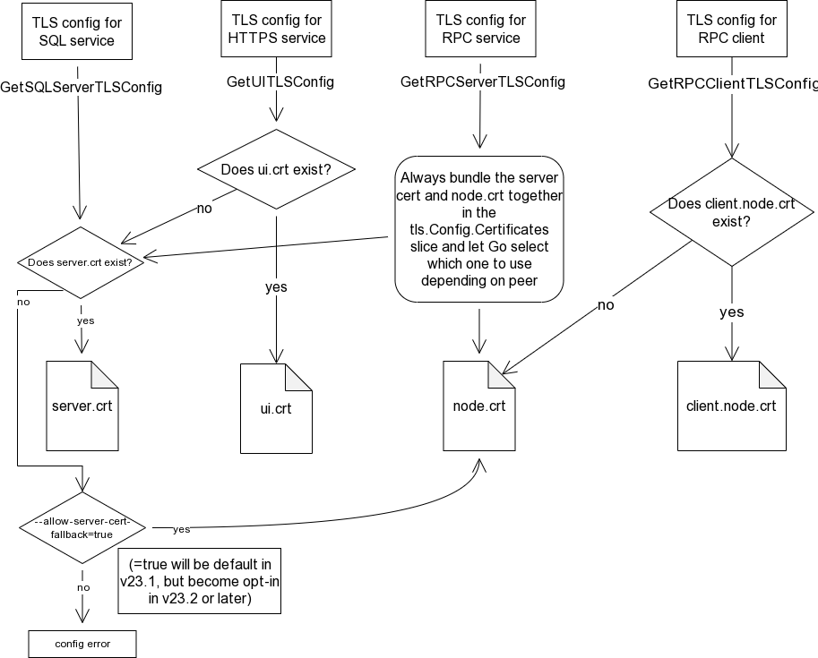

- Feature Name: Split service TLS certificates
- Status: draft
- Start Date: 2022-11-24
- Authors: knz catj
- RFC PR: [#92422](https://github.com/cockroachdb/cockroach/pull/92499)
- Cockroach Issue: [#39326](https://github.com/cockroachdb/cockroach/issues/39326) [#92069](https://github.com/cockroachdb/cockroach/issues/92069)

# Summary

This RFC proposes to use a separate server certificate for the
SQL/HTTP/RPC services for _clients_, i.e. non-node peers.

This change has two main motivations:
- it enables uses of a separate PKI for the interaction between client
  apps/LBs and CockroachDB, from the one used internally between
  nodes. This is a strong ask from Enterprise customers.
- it also enables use of separate server hosts/IP addresses as seen
  from (and validated by) clients, from the one seen from / validated
  by peer nodes. This was found useful for certain types of user
  orchestration.

The proposal is twofold:
- in the **simple and recommended deployment style**, we will tell users
  to use two certificates: an _internal_ certificate for node-node
  connections (current `node.crt`), and an _external_ certificate (new:
  `server.crt`) to present to incoming non-node connections: HTTP API
  clients, SQL clients and RPC admin CLI commands.
- for **advanced deployments only** (not recommended as starting point in
  docs), where a user has a legitimate need for customization of which
  cert is used for which service, we will allow _per-service
  certificates_: the current `ui.crt` for HTTP, and `server.crt` for
  the SQL/RPC services.

In any case, we will **deprecate the use of `node.crt` to serve
SQL/HTTP/RPC for clients**. For convenience for users who are
upgrading from a previous version, we will continue to offer a
fall-back, but it will be controlled by a command-line flag: initially
opt-out, and later opt-in.

A preliminary implementation is available here: https://github.com/cockroachdb/cockroach/pull/92126

Topics that are out of scope for this RFC:

- TLS client certs for authentication of SQL clients. These remain unchanged.
- The "tenant client" cert, as used by standalone SQL servers when
  connecting to each other or to the KV layer in CC serverless
  deployments. This also will remain unchanged.
- Refactoring the "certificate manager" code inside CockroachDB to not
  assume specific paths / filenames for the various certs. While this
  development would be desirable, we consider it to be orthogonal to
  the current RFC.
- Troubleshooting of TLS misconfiguration. This will be covered by a
  separate RFC.

# Motivation

CockroachDB's TLS components support two main use cases to provision certificates:
- a "simplistic" UX, which is the one we provide to low-knowledge
  users, using CockroachDB's bundled 'cockroach cert' command to
  produce certs, using self-signed CAs;
- a more complete UX, where we acknowledge that good production
  security relies on a deeper integration between CockroachDB and the
  surrounding security infrastructure, here we allow users to
  configure their own TLS certificates for use with CockroachDB.

In this RFC we will consider the first case to be "convenience" and
that the second case should be the primary design objective – i.e. we
should make those database operators successful first. This case also
includes our CockroachCloud team.

A key characteristic of these customers is that they have their own
PKI (Private Key Infrastructure), with their own rules about how
certificates can be constructed. In other words, it's not reasonable
for CockroachDB to place many restrictions on how certificates /
certificate fields (especially Common Name, Subject Alternative Names,
but not limited to these fields) can be populated before CockroachDB
can use them.

Within this context, our users face a couple of major issues:

- The hostname/IP address for a node, as viewed from other nodes
  (`--listen-addr` / `–advertise-addr`) may be different from that as seen
  from SQL clients / RFC clients / web browsers for the UI. In
  particular, the latter may not be determined before a crdb node has
  finished initializing, e.g. when using automation tools to provision
  networking infrastructure.

- Having the same certificate for both the cluster-level "internal"
  hostname and the externally accessible server name exposes internal
  cluster information to external clients, which can be undesirable
  depending on the threats the infrastructure is concerned with.

- Certain IT orgs require a chain of human approval to approve new
  service certs as visible across teams/departments. For example, when
  deploying CockroachDB a manual approval may be needed when issuing
  the TLS cert for the SQL service, because SQL apps are run by
  different teams than the DB operators. In this type of organization,
  it's very cumbersome when the same cert is also used by node-node
  connections: every time a new node is added to the cluster (and a
  new hostname needs to be listed in the cert), this manual approval
  is required. These orgs would be willing to approve a wildcard (or
  equivalent) cert for node-node connections if they were guaranteed
  to remain internal to a sub-team / private network, but they
  can't/won't if it's also presented to client apps.

- Automation such as the ACME protocol (used by LetsEncrypt) doesn't
  populate custom fields and requires allowing the ACME server to
  connect to the infrastructure in question (or provision custom DNS
  fields during the request), making it difficult to issue and utilize
  those certificates

In the past, we already have acknowledged these problems in the
context of HTTP clients. Because we took these concerns seriously, we
allowed users to provision a fully separate TLS server cert (with its
own CA) for the HTTP service. However, more recently we have learned
that the same concern exists also for the SQL service and the RPC
service as used by CLI clients (cockroach node decommission, etc).

Moving away from using the certificates used for node-to-node
communication allows database operators to use their existing PKI (or
automation such as LetsEncrypt) to manage the certificates their
clients connect to, and simplifies future work to improve how the
certificates used for node-to-node communication can be generated.

# Technical design

Currently the cert manager code inside CockroachDB has just two APIs
for initializing+reading a 'server cert':

- `GetUITLSconfig`, used by the HTTP service.
- GetTLSConfig, used by all of:
  - node-node RPC service
  - node-client RPC service and RPC client
  - node-client SQL service

We will change this as follows:
- `GetUITLSconfig` - unchanged
- `GetTLSConfig`  gets split into:
  - `GetRPCServerTLSConfig`, used for both node-node and node-client RPC service
     Bundles 2 server peer certs in the TLSConfig, as specified below.
  - `GetSQLServerTLSConfig`, used for the SQL service.
  - `GetRPCClientTLSConfig`, used for RPC clients (client side of node-node connections, and also CLI clients)

The SQL service will attempt to use `server.crt` if it exists. If it
does not, and the (new) `--allow-server-cert-fallback` parameter is
set to `true`, `node.crt` will be used as a fallback for backward
compatibility with previous versions.

**Note: we introduce a new command-line flag so that an operator can
disable the fallback to request CockroachDB to report a missing/incorrect
server.crt. This feature was requested by the CRL SRE team.**

If the `ui.crt` doesn't exist, the HTTPS endpoint will fall back to the
common server cert (including fallback to node.crt if enabled) This
allows database operators who don't need a separation of those
interfaces to use the same certificate for all three services.

The CA story is complementary to the story above: the `tls.Config`
needs to know which CA cert to use to validate the _peer_ (the other
side of the connection / the client). For each of the 3 services, and
the RPC client, we bundle CAs as follows:

The diagrams above represent the desired end state of the
functionality. Note that the code used to generate the `tls.Config` for
SQL clients has been omitted: it is owned by the SQL client driver
(e.g. pgx, lib/pq) and we don't control it.

## Changes from current implementation

To enumerate the actual changes, we also need to look at the current implementation.

Enumeration of changes:

- `GetTLSConfig` becomes split into:
  - `GetSQLServerTLSConfig`
  - `GetRPCServerTLSConfig`
  - `GetRPCClientTLSConfig`

- Each defined using the lookup logic defined above.

- In particular:
  - The fallback from `ca-client.crt` to `ca.crt` becomes subject to the new
    CLI flag `--allow-server-cert-fallback`.
  - The fallback from `server.crt` to `ca.crt` also becomes subject to the new flag.
  - `ca-server.crt` is optional. If not present, it falls back to
    `ca.crt` if present, otherwise to the system trust store.
  - `ca.crt` becomes optional: it becomes possible to use the system
    trust store for validating peer nodes in node-node connections,
    rather than requiring `ca.crt`.

This means that the *recommended* certificates for a cluster would be:

- 1x `node.crt` per node
- `server.crt` (can be a different `server.crt` per-node, or a single `server.crt` shared across nodes when using load balancing)
- `ca-client.crt` (for RPC/SQL client certificate verification)

## Reflection on the "split node certs" story

In the past, we've offered the ability to use "split node certs" to
users who cared about having separate TLS certs for the server and the
client part of node-node connections; as well as for admin RPC
clients.

We expect, with the new ability to use a `server.crt`, that this use
case can now be served with a `server.crt` instead of `client.node.crt`.
This might mean that we can de-prioritize this angle in documentation,
in favor of the (simplified) internal/external cert split.

## Drawbacks

CockroachDB has PKI code that does not work consistently with other
services, in that it is opinionated about filenames and locations, for
the sake of simplifying the creation of a new cluster without an
existing PKI. This change does not improve that situation, but does
make it more convenient to manage certificates exposed to HTTPS, SQL,
and RPC clients with existing PKI, and if desired, strictly use the
`cockroach cert` to issue the node-to-node certificates.

Another drawback is that this increases the number of certificates
that database operators could have to manage. This is hopefully
mitigated by the possibility of using the same certificate for both
HTTPS and SQL/RPC, replacing the current `ui.crt`.

## Rationale and Alternatives

The main question we asked ourselves in this design is "why more than
two". It is the case that the vast majority of our Enterprise
customers would be well-served with just two certs: one for node-node
conns and one for clients: HTTP/SQL/RPC.

However, we know of at least one use case for a separate server cert
for HTTP: when the HTTP service is served behind a (TCP) load balancer
/ proxy, where we want the host/SAN fields to match that of the
proxy/LB.

If we _required_ that any use of a TCP LB for HTTP would also mandate
serving SQL using the same LB, we would block users from applying
different load management / fault tolerance strategies for HTTP and
SQL. We do know that certain users have in the past used SQL conn
pools in each DC, vs a single serving point cross-DC for HTTP.

By allowing the use of separate LBs for SQL and HTTP (and thereby,
offering different TLS certs for each), we preserve this flexibility
for users who need it.

This leaves us the open question of what to do for the RPC service.

- on the one hand, for symmetry with HTTP/SQL, we could envision the
  flexibility to configure a separate server cert for RPC (separate
  from SQL, and separate from HTTP).
- however, in practice the UX for the RPC service is limited as
  follows. We do not document/advertise the RPC service as a service
  end-users can use directly. The only supported client for it is our
  own CLI tooling (`cockroach` sub-commands). However, also the same
  CLI tooling often uses SQL and RPC connections interchangeably (and
  `debug zip` even uses both). For UX simplicity, we will thus only
  support deployments where SQL and RPC services _for clients_ use the
  same network hostnames and/or IP addresses, and we can thus support
  just 1 TLS server cert for both.

# Explain it to folk outside of your team

The best practices to configure TLS for CockroachDB are evolving.

| Filename          | Purpose                                                                                                                                                            | In previous versions             | After the change of this RFC             |
|-------------------|--------------------------------------------------------------------------------------------------------------------------------------------------------------------|----------------------------------|------------------------------------------|
| `node.crt`        | Server cert presented to peers in incoming node-node connections; also used as client cert for outgoing node-node connections if `client.node.crt` does not exist. | mandatory                        | mandatory                                |
| `ca.crt`          | CA used to verify peer certs in incoming node-node conns.                                                                                                          | mandatory                        | optional                                 |
| `server.crt`      | Server cert presented to incoming SQL/RPC non-node clients.                                                                                                        | N/A                              | recommended (NEW, see explanation below) |
| `ca-server.crt`   | CA signing cert embedded in server response to incoming SQL/RPC non-node clients.                                                                                  | N/A                              | optional                                 |
| `ca-client.crt`   | CA used to verify peer certs in incoming non-node client conns.                                                                                                    | N/A                              | recommended (NEW, see explanation below) |
| `client.node.crt` | Alternate client cert to use for outgoing node-node connections.                                                                                                   | optional                         | optional (unchanged)                     |
| `ui.crt`          | Server cert presented to incoming HTTP clients.                                                                                                                    | optional, fallback to `node.crt` | optional, fallback to `server.crt`       |

Previously, it was only necessary to configure 1 `node.crt` and 1
`ca.crt` for each CockroachDB node, then client certs for RPC/SQL
clients as necessary (with a minimum of 1 `client.root.crt`).

We are changing this to recommend 4 certs per CockroachDB nodes:

- `node.crt` and `ca.crt` (same as previous) will now be used exclusively for node-node connections.
- `server.crt` (NEW) will be used to present to RPC/SQL clients when they connect.
- `ca-client.crt` (NEW) will be used to authenticate non-node RPC/SQL
  clients, such as `cockroach sql` or `cockroach node decommission`

  Note that `ca-client.crt` is recommended *even when SQL is configured to
  not use TLS client authn*, for the following reasons:
  - RPC clients still use TLS client authn, and their client certs
    need to be validated against `ca-client.crt`.
  - CockroachDB always guarantees a "break the glass" ability to
    administrate a cluster by opening a `root` SQL client using a
    `client.root.crt` signed by `ca-client.crt`.

For clusters migrated from a previous version, a new command
line flag `--allow-server-cert-fallback` will be introduced (default true), 
which causes `node.crt` to be used when `server.crt`  is absent.
This mechanism will become opt-in in a later version.

Likewise, `ca-client.crt` and `ca-server.crt` will fall back to
`ca.crt` when this flag is specified.

We recommend that automation to renew certs start to update
`server.crt` and `ca-client.crt` explicitly.

The certs are assumed to be signed (and will be validated) as follows:
- `node.crt` continues to be signed by `ca.crt` in `cockroach cert
  create-node`. A user can now also provision `node.crt` using their
  own PKI and _omit_ `ca.crt` from the CockroachDB certs directory,
  provided their CA is trusted by the operating system.

- `server.crt` assumes to be signed by `ca-server.crt` in `cockroach
  cert create-server`. A user can also provision `server.crt` using
  their PKI and omit `ca-server.crt` from the crdb certs directory,
  falling back to the operating system trust store.

Additionally, `ca-client.crt` becomes recommended in each node's certs
dir to be operated from the admin CLI (e.g. `node decommission`), as
well as when using cert-based authn for SQL clients.

Additionally, commands under `cockroach certs` are updated/added to
handle this new situation.

# Unresolved questions

N/A
