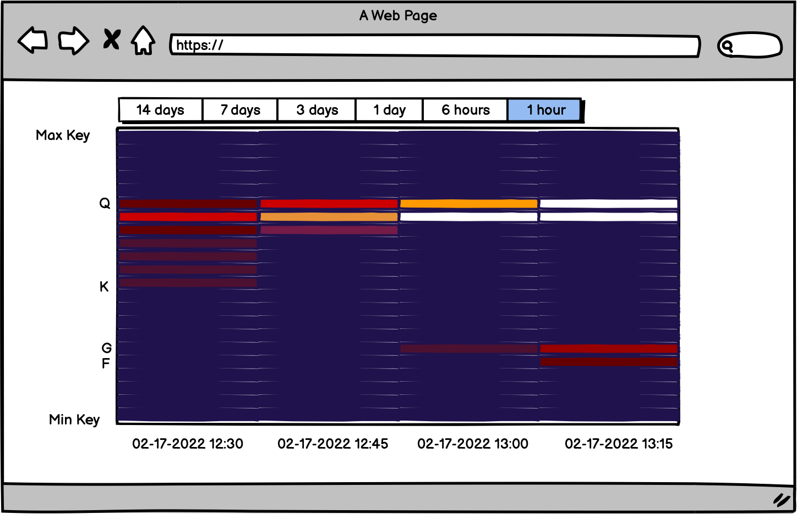
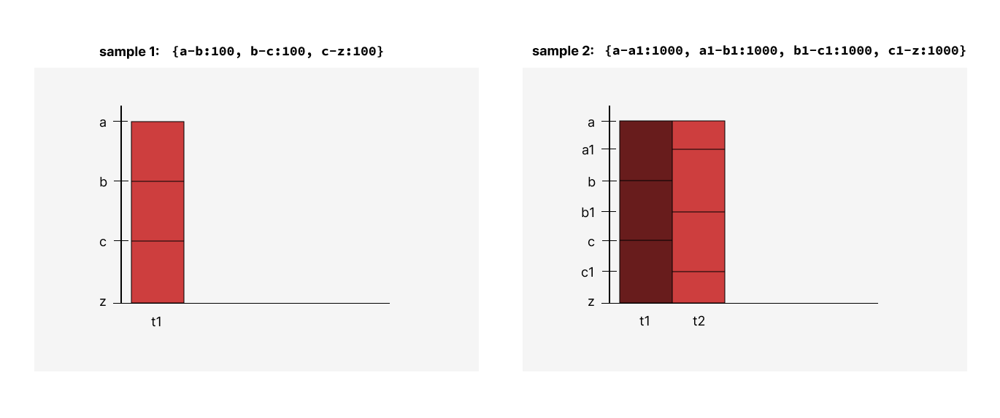
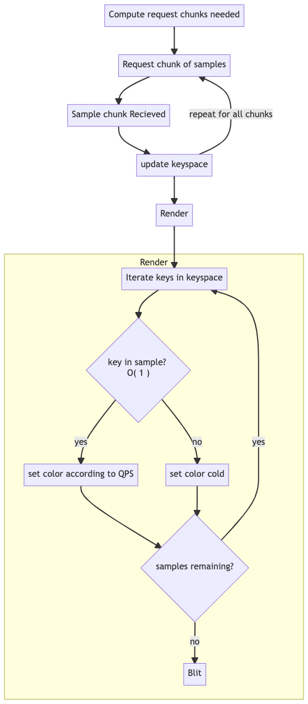
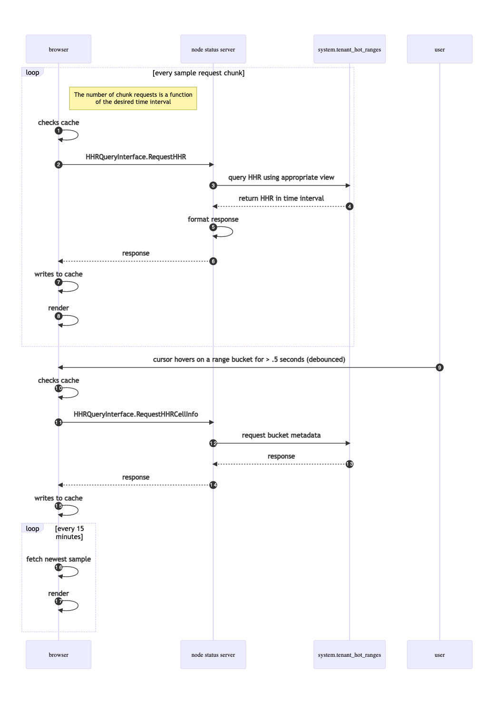

- Feature Name: Historical Hot Ranges
- Authors: Zach Lite

## Summary 
This RFC describes the introduction of historical hot ranges (HHR)
and how HHR will be persisted, queried, and visualized across all CRDB
deployment methods.

A successful HHR implementation has a few key requirements.
1. The implementation does not put excess strain on the cluster. If there is a
motivation to consume HHR data, it is likely the cluster is already in a state
of degraded performance. We do not want to make things worse.
2. The implementation accounts for the largest of CRDB's production workloads.
We must consider keyspaces of 100K to 1M distinct ranges.
3. The implementation maintains CRDB's principle of symmetric nodes. The
implementation should embrace the distributed nature of CRDB, and not fight it.
4. The implementation is designed for multi-tenancy.
5. The implementation provides clear insights, helping users identify hot ranges
quickly.


HHR will be persisted using an internal system table. A range aggregration
scheme is proposed to ensure that the volume of HHR generated and queried does
not introduce performance concerns. However, the aggregation is lossy, and could
effect the utility of the data captured. To make sure users can gain meaningful
insights, the aggregration scheme will dynamically increase resolution to ranges
that are hot and will reduce resolution from ranges that are cold.

HHR will be visualized by a heatmap in DB Console. The heatmap will be similar
in spirit to what is offered by [Google Cloud's (Big Table and Spanner) Key
Visualizer](https://cloud.google.com/bigtable/docs/keyvis-overview), and 
[TiDB's key visualizer](https://docs.pingcap.com/tidb/stable/dashboard-key-visualizer/). 
The heatmap will visualize range hotness across time and keyspace.


### Visualization

The Range Visualizer has the following features:
- Time is represented by the x-axis
- Key space is represented by the y-axis
- Hotness is represented by a spectrum of color, with deep blue representing QPS
  activity equal to zero, and White equal to the max QPS activity seen across
the time period being visualized.
- Buttons to toggle between the active timespan of samples to visualize.
- Consistency of the keyspace across time. As time progresses, it is possible
  that a portion of the keyspace that previously experienced hotness is no
longer experiencing hotness, or vice-versa. To increase usability, we want to
create the illusion of continuous sampling across the keyspace over time, even
if a sample didn't collect any metrics for a part of the keyspace.
- We can include a "hottness per byte" mode, where a cell's color is normalized
according to the number of bytes contained by the key span.




The Range Visualizer will maintain useable performance in the following ways:
- The implementation will batch requests to the server.
- The implementation will limit bytes over the wire by delaying metadata about a
  range bucket until needed.
- The implementation will use the HTML Canvas element, and it's hardware
  accelerated rendering API.
- The implementation will use the `CanvasRenderingContext2D.putImageData()` API
  to batch draw calls.


The browser must maintain the full set of keys across all samples. Doing so
enables the visualization to provide visual consistency of the keyspace across
time. This is achieved efficiently by using a Set - with constant lookup time
properties - instead of an array. However, the requirement to maintain the full
set of keys makes it difficult to render the visualization in batches. When a
new sample is available, the keyspace will likely change, turning any on-screen
samples stale, requiring a re-render of the whole time period.

Here is an illustration that shows how the keyspace could change between samples. 
To accomodate range splits and merges over time, the keyspace represented by the
Y-axis includes all range boundaries present between Tmin and Tmax.



The process for requesting and rendering a set of samples is pictured here:



### Prototype 
Using fake data over the wire, I built a prototype to test how
quickly we could maintain a set of keys and render different time periods worth
of HHR. The results are displayed in the table below and they are promising!

| Samples Rendered | Time (ms) |
| ---------------- | --------- |
| 24 (6 hours)     | 80        |
| 1344 (14 days)   | 1700      |

This is the result of 24 samples rendered. The sloping pattern is explained by
the set of all keys growing after subsequent samples. The pattern is a result of
randomly generated keys in the test data, and will not be present in real life.


## Motivation 
Currently, CRDB does not have an out-of-the-box solution to
provide users with access to historical values of their cluster's hottest
ranges. Hot range related performance issues are often transient, so without
access to historical data, a customer must observe their cluster's hot range
data in real time. This requirement is not realistic, so the ultimate goal of
this RFC is to provide a solution that remedies this.

The current process for diagnosing performance issues requires a lot of time and
back and forth between customers and TSEs. HHR can make this process faster, and
in some cases could even enable a customer to self-service. Improving
observability, reliability, and automation are an extension of CRL's goals to make
dedicated CRDB enterprise ready.

HHR can make some cases of CRDB development and testing faster. With HHR,
an engineer can easily observe the effects of new schemas or KV related changes.
## Non-Goals of this RFC
There are a few items that will be considered out of scope for this RFC:

1. Changing the definition and/or computation of the hot range metric, despite
QPS having known issues.
    - https://github.com/cockroachdb/cockroach/issues/50620
    - https://github.com/cockroachdb/cockroach/issues/73731

2. It is not an explicit goal to showcase a metric-agnostic aggregation,
storage, and visualization scheme. However, parts of this RFC may be applicable
to other high cardinality metrics we surface in the future. Future observability
work my find this RFC helpful.

3. Exporting HHR as a Prometheus metric. We can surface this ability in the
future, but for the now the priority is providing customers with an out of the
box experience and making sure TSEs can debug issues faster.

Importantly, none of the decisions being made in this proposal are irreversable,
and can be changed in the future.


## Detailed Design

### Storage Requirements 
If we're not careful, HHR could have unacceptably high cardinality.

There are three dimensions that determine the cardinality of HHR.  
1. The number of ranges we collect metrics for.  
2. The sample rate, i.e. how often we collect
metrics.  
3. The information captured for each range during sampling.

Clusters running production workloads could have 100K to 1M ranges. At any sort
of reasonable sample rate, this would result in too much data to efficiently
store, query, and render. To reduce the number of ranges we collect metrics for,
we can set a budget of 1000 max ranges. To populate these 1000 ranges we can use
a mixed strategy of filtering out the coldest ranges and aggregating what
remains. This is discussed in detail later on.

To provide meaningful resolution, we can set a sampling rate of 4 times per
hour, and store samples for a period of 14 days.

For each range, here is the information captured: 
| Value      | Bytes   |
| ---------- | ------- |
| range id   | 4       |
| replica id | 4       |
| qps        | 4       |
| start key  | <= 100  |
| end key    | <= 100  |
| node ids   | ~12     |
| store ids  | ~12     |
| schema     | ~20     |
| locality   | ~20     |
| key bytes | 4       |

The bytes required to store node ids, store ids, schema, and locality are
estimates, as these values can vary in practice. The bytes required to start and
end keys could be much less depending on the distribution of start and end key
character lengths.


We can calculate the total storage requirements of this data, less the cost of
the indexes and a unique identifier, considering all dimensions: ``` ~ 270 bytes
per range * 1000 ranges per sample * 4 samples per hour * 24 hours * 14 days =
~363 Megabytes ```


It's important to point out that the client will never need the majority of
these bytes to be sent over the wire in order to render the visualization.
Instead, the client will request samples in chunks, with subsequent API calls
made to request the specific details of a range only as needed. This is
discussed in more detail later on.

### Metric Generation 

The metric generation scheme is designed for both single and multi-tenant
deployments, and operates with two different sampling modes: 
#### Tenant Sampling 
Tenant sampling generates metrics for a specific tenant. Tenant
sampling is performed by the host, and metrics are stored such that a tenant can
only access metrics for ranges inside its own keyspace. This prevents a tenant from
accessing hotness from system-level ranges or another tenant's ranges. Every
tenant receives its own 1000 range budget to prevent colder tenants from being
overshadowed by hotter tenants.

#### Host Sampling 
Host sampling generates metrics reported over the cluster's
entire keyspace in a tenant-agnostic way. The host receives its own 1000 range
budget.

A dedicated single-tenant deployment only performs host sampling, while
multi-tenant deployments perform both tenant and host sampling. In a
single-tenant deployment, the results of tenant's sampling sampling would be
contained in the host sampling, and therefore be redundant.

Tenant sampling and Host sampling follow mostly the same process - the
differences manifest in how aggregation is performed to keep samples within
budget, and how the sampled metrics are written to `system.hot_ranges`.

According to the sample rate, a job is executed to
request the QPS for all replicas from every store. These hot
replicas are then sorted lexicographically by their start keys. If tenant sampling
is being performed, each set of a tenant's reported replicas is
limited to 1000 by a range reduction and aggregation scheme. This range
reduction scheme is discussed in the next section. If host sampling is being
performed, the global set of reported replicas is limited to 1000 by the same
range reduction scheme. 

After ranges have been aggregated and reduced, they are written to
`system.hot_ranges`. Tenant sampling creates a row per tenant per sample, while
Host sampling creates a single row per sample, whose `tenant_id` value is set to
`'host'`.

Finally, existing samples older than 2 weeks will be deleted.


```sql 
-- schema for system.hot_ranges
CREATE TABLE system.hot_ranges ( 
    sample_time INT NOT NULL,
    
    -- When whole-cluster sampling is being performed, 
    -- tenant_id will be set to 0
    tenant_id INT NOT NULL,

    -- info is defined below by `HHRSample`
    info BYTES NOT NULL,

    PRIMARY KEY (sample_time, tenant_id)
); 
```

```protobuf
// protobuf definition for HHRSample
message HHRSample { 
    message HotRange {
        message Schema { 
            string database = 1;
            repeated string tables = 2; 
        } 
        int32 range_id = 1; 
        int32 replica_id = 2; 
        float qps = 3; 
        string start_key = 4; 
        string end_key = 5; 
        repeated int32 node_ids = 6;
        repeated int32 store_ids = 7; 
        repeated Schema schema = 8; 
        string locality = 9; 
        sfixed64 key_bytes = 10; // found from MVCCStats
    }
    repeated HotRange hotranges = 1;
} 
```


The sampling process is pictured here: 


### Range Reduction and Aggregation

Range reduction and aggregation ensures that no more than 1000 metrics are
generated per tenant or per host.

If the number of non-zero QPS replicas is greater than 1000, the algorithm will
use a simple heuristic to aggregate key-adjacent replicas (ranges) until the
budget is met. The heuristic tests if the resulting averaged QPS of the
aggregated range would be less than the median QPS of the original
non-aggregated set of ranges. The goal is to avoid losing resolution around
ranges that are hot, preferring to take away resolution from ranges that are
cold.


A new function will implement this behavior: 
```go 

type HotRange struct {
    qps float64 
    startKey string
    endkey string
}

func HottestRangesAggregated(ranges []HotRange) []HotRange 
```

The functionality of `HottestRangesAggregated` is pictured here


### Querying 
In order to render the visualization, the client must request
historical data for the time period of interest.

363 Megabytes is far too much to send over the wire in a single payload, so
requests for historical data must be broken into discrete chunks. The number of
requests made depends on the timespan the client wants to visualize, with the
default being 6 hours, or 24 samples of HHR per chunk.

Additionally, Rendering the visualization is not dependent on the majority of
bytes associated within a sample. To render a sample, the browser only needs to
know:

1. The timestamp 
2. The QPS values for ranges in the sample
3. The start_key for ranges in the sample

The `start_key` is required because the visualization needs to maintain the set
of all keys. (The requirements for the visualization itself is discussed later
on.)

When a user wants to know information about a hot range bucket, they will hover
their cursor over a particular bucket. A debounced request will be made to the
server requesting the metadata for the bucket of interest. Because the
visualization displays cells in sorted key order, we can use the cell's array
index and the timestamp to query `system.tenant_hot_ranges`, allowing us to save
bandwidth by not needing to initially send a uuid over the wire for every cell.

Two caches will be used to minimize the number of requests made to the server.
The first cache will store HHR samples by timestamp. The benefit of this would
be much faster toggling between time windows after HHR data for a specific time
period has been loaded. The second cache will store cell specific details.
 
For the first iteration, these caches will not perist between page reloads. The
`localStorage` and `sessionStorage` browser APIs have small storage limits 
relative to the size of a full HHR 2 week period. The `indexedDB` API can 
accommodate much larger storage limits but is much more difficult to implement.


The following interfaces will be used to request HHR samples and cell-specific
information:

```protobuf

message HHRRequest { 
    util.hlc.Timestamp windowStart = 1;
    util.hlc.Timestamp windowEnd = 2;
}

message HHRResponse { 
    message HHRSample {
        util.hlc.Timestamp timestamp = 1;
        repeated double qps = 2;
        repeated string start_key = 3; 
    }

    repeated HHRSample samples = 1; 
}

message HHRCellInfoRequest { 
    util.hlc.Timestamp timestamp = 1;
    int32 cellIdx = 2; 
}

message HHRCellInfoResponse { 
    message Schema { 
        string database = 1; 
        repeated string tables = 2; 
    } 
    int32 rangeId = 1; 
    string startKey = 2; 
    string endKey = 3; 
    repeated int32 nodes = 4; 
    repeated int32 stores = 5; 
    repeated Schema schema = 6;
    string locality = 7; 
    sfixed64 key_bytes = 8;
}

service HHRQueryInterface  {

    // RequestHHR is invoked by a client when HHR samples are needed for a
    // specific time window.  It is the responsibility of the client to request
    // appropriately sized time windows.
    rpc RequestHHR(HHRRequest) returns (HHRResponse) { }
    
    
    // RequestHHRCellInfo is invoked by a client when range specific information
    // is needed by the user.  The information contained in HHRCellInfoResponse
    // is purposefully withheld from the client by `RequestHHR` so that the
    // number of bytes over the wire required to render the visualiztion is kept
    // small.
    rpc RequestHHRCellInfo(HHRCellInfoRequest) returns (HHRCellInfoResponse) {}
}


```

The full querying process is pictured here:



## Limitations and Alternatives 
1. It is possible that a replica lifecycle event
occurs before querying `replRankings` from each store has completed. If a
leaseholder transfer, range split, or range merge occurs before the job system
can visit every store, we risk hot range metrics being underreported for that
sample. `replRankings` is cached for 10 seconds on each store, but there's no
cluster-wide coordination of this 10 second period. We can move forward with
this risk for now, and measure the extent of hot range underreporting in
practice. The `HHRQueryInterface` proposed in the 'Querying' section of this RFC
serves to decouple the visualization from changes to metric generation in the
future.

2. By sourcing QPS values from every store, we are only recording leaseholder
replica QPS. Metrics for follower replicas are not available, which prevents us
from being able to provide hot range observability for follower reads.
Additionally, the resolution available by only measuring the leaseholder replica
might not be enough for some scenarios. For example, we can imagine a tenant
whose table fits entirely within a single range. We could provide higher
resolution if we could record metrics for keys in addition to replicas.

3. This RFC proposes the continuation of patterns that maintain the status quo
of observability tooling in CRDB. The forthcoming Observability Architecture RFC
proposes that observability metrics are mantained externally from a CRDB
cluster. Observability infrastructure will likely change dramatically in the
next few years, making some of the methods presented in this RFC obsolete.
Despite this coming change, it seems reasonable to continue because the customer
demand for this feature is strong, and the technical status quo is maintained.
The `HHRQueryInterface` helps make sure that the visualization can tolerate a
changing implementation.


## Open Questions

1. What kind of secondary tenant support do we want? 
If KV tends to pack a secondary tenant's schema into a single range, what can
be done to provide higher resolution to secondary tenants? Instead of ranges,
we can think of generalizing to key spans.

2. How can the user get actionable SQL-level insights from keys/spans?

3. How will secondary tenants access their historical metrics? If metrics are 
stored by the system tenant, should secondary tenants request metrics via gRPC?

4. Do we need confirmation from product that we want to provide this feature 
for self-hosted customers if we want to provide differentiating features for cloud?
