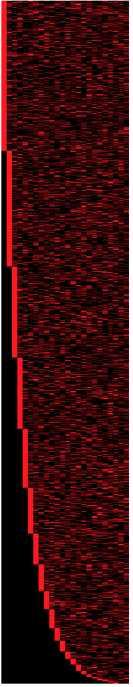

- Feature Name: Historical Hot Ranges
- Authors: Zach Lite

## Summary
This RFC describes the introduction of historical hot ranges (HHR) and how HHR will be persisted, queried, and visualized across all CRDB deployment methods.

A successful HHR implementation has a few key requirements.
1. The implementation does not put excess strain on the cluster. If there is a motivation to consume HHR data, it is likely the cluster is already in a state of degraded performance. We do not want to make things worse.
2. The implementation accounts for the largest of CRDB's production workloads. We must consider keyspaces of 100K to 1M distinct ranges.
3. The implementation maintains CRDB's principle of symmetric nodes. The implementation should embrace the distributed nature of CRDB, and not fight it.
4. The implementation is agnostic to the deployment method or environment.
4. The implementation provides clear insights, helping users identify hot ranges quickly.


HHR will be persisted using an internal CRDB table. A budgeting and range aggregration scheme is proposed to ensure that the volume of HHR generated and queried does not introduce performance concerns. However, the aggregation is lossy, and could effect the utility of the data captured. To make sure users can gain meaningful insights, the aggregration scheme will dynamically increase resolution to ranges that are hot and will reduce resolution from ranges that are cold.

HHR will be visualized by a heatmap in DB Console. The heatmap will be similar in spirit to what is offered by Google Cloud's (Big Table and Spanner) Key Visualizer, and TiDB's key visualizer. The heatmap will visualize range hotness across time and keyspace.

Finally, the aggregated hot range data will be exported as a Prometheus metric, for self-hosted customers to consume with their own monitoring infrastructure. This has the benefit of providing redundancy, where the metrics remain available even if the cluster and DB console are unreachable.


## Motivation
Currently, CRDB does not have an out-of-the-box solution to provide users with access to historical values of their cluster's hottest ranges. Hot range related performance issues are often transient, so without access to historical data, a customer must observe their cluster's hot range data in real time. This requirement is not realistic, so the ultimate goal of this RFC is to provide a solution that remedies this.


## Non-Goals of this RFC
There are a few items that will be considered out of scope for this RFC.

1. Changing the definition and/or computation of the hot range metric, despite QPS having known issues.
    https://github.com/cockroachdb/cockroach/issues/50620<br/>
    https://github.com/cockroachdb/cockroach/issues/73731

2. It is not an explicit goal to showcase a metric-agnostic aggregation, storage, and visualization scheme. However, parts of this RFC may be applicable to other high cardinality metrics we surface in the future. Future observability work my find this RFC helpful.

Importantly, none of the decisions being made in this proposal are irreversable, and can be changed in the future.


## Detailed Design

### Storage Requirements
If we're not careful, HHR could have unacceptably high cardinality.

There are three dimensions that determine the cardinality of HHR.
1. The number of ranges we collect metrics for.
2. The sample rate, i.e. how often we collect metrics.
3. The information captured for each range during sampling.

Clusters running production workloads could have 100K to 1M ranges. At any sort of reasonable sample rate, this would result in too much data captured. To reduce the number of ranges we collect metrics for, we can set a budget of 1000 max ranges. To populate these 1000 ranges we can use a mixed strategy of filtering out the coldest ranges and aggregating what remains. This is discussed in detail later on.

To provide meaningful resolution, we can set a sampling rate of 4 times per hour, and store samples for a period of 14 days.

For each range, here is the information captured:
| Value      | Bytes |  description |
| ---------- |------ | ---      |
| node_id    | 2    |   | 
| store_id   | 2    |  |
| qps        | 4    |  |
| start_key  |  <= 100  | locate the start of the hot range |
| end_key    | <= 100  | locate the end of the hot range |
| timestamp  | 4 | seconds since epoch |


We can calculate the total storage requirements of this data, less the cost of the indexes and a unique identifier, considering all dimensions:
```
<= 212 bytes per range * 1000 ranges per sample * 4 samples per hour * 24 hours * 14 days = <= 285 Megabytes
```

This value could be much less depending on the distribution of `start_key` and `end_key` character lengths.


It's important to point out that the client will never need the majority of these bytes to be sent over the wire in order to render the visualization. Instead, the client will request samples in chunks, with subsequent API calls made to request the specific details of a range only as needed. This is discussed in more detail later on.


___
### SQL Schema

Capping the storage requirement to 285 Megabytes, we can leverage CRDB's internal tables to store HHR.
The table below provides the proposed schema for `crdb_internal.historical_hot_ranges`. To efficiently query ranges for a given sample, the `timestamp` column is given a secondary index. To efficiently query a range by its start key, `start_key` is given a secondary index. The need for this is discussed in the "Querying" section later on.

| column name | type | primary index | secondary index
| ---------- |------ | --- | --- |
| uuid       | UUID | yes  | |
| node_id    | INT2  |   | |
| store_id    | INT2  |   | |
| qps    | FLOAT4  |   | |
| start_key    | STRING(100)  |   | yes |
| end_key    | STRING(100)  |   | |
| timestamp    | INT4  |   | yes |


___
### Metric Generation 

According to the sample rate, every node in the cluster will collect metrics for a subset of leaseholder replicas that live on its stores. Then, every node will persist these metrics to `crdb_internal.historical_hot_ranges`. The stores are responsible for determining the subset and aggregation of leaseholder replicas that are recorded. Every store operates with a budget to guarantee that no more than 1000 ranges are recorded cumulatively by all nodes. At the time of sampling, existing samples older than 2 weeks will be deleted.

Every node operates independently, and once all nodes finish, `crdb_internal.historical_hot_ranges` will contain the results of the entire cluster-wide sample.

<br/><br/>
This process is pictured here:


___
### Range Reduction and Aggregation

Range reduction and aggregation ensures that no more than 1000 metrics are produced across the cluster during a sample.

A store can already report the QPS values for its 128 hottest leaseholder replicas, but for a cluster with a large number of stores, we'd quickly exhaust the cluster-wide 1000 range budget.

Therefore, a store must be given a budget for the number of ranges that it can produce metrics for, such that the sum of all budgets across all stores <= 1000.

To provide useful insights, we can dynamically adjust the budget based on the previous sample. If a store previously reported hot ranges relative to the mean, we should increase the store's budget, so that it doesn't need to aggregate as aggressively. Conversely, if a store previously reported cold ranges, we should decrease the store's budget, to keep the sum of all budgets <= 1000.

If the number of non-zero QPS replicas is less than the available budget, the store will use a simple heuristic to aggregate key-adjacent replicas (ranges) until the budget is met. The heuristic tests if the resulting averaged QPS of the aggregated range would be less than the median QPS across the store. The goal is to avoid losing resolution around ranges that are hot, preferring to take away resolution from ranges that are cold.


Unfortunately, we can't do a more comprehensive cluster-wide aggregation because we are limited to the scope of an individual store. Additionally, we can imagine a scenario where the heuristic is wrong, but if a store sees sustained hotness, we can expect the budgeting algorithm to provide a higher budget to this store during subsequent sampling.


<br/><br/>

A new function will implement this behavior:
```go
type ReportedRange struct {
    qps float32
    startKey string
    endkey string
}

type AggregatedRanges struct {
    storeId int
    timestamp int
    ranges []ReportedRange
}

func (s *Store) HottestRangesAggregated(
    nStores int,
    lastAvgHottness float, 
    lastAvgHottnessLocal float
) AggregatedRanges
```
Open Questions:
1. What happens if the budget is > 128? This is relevant for small clusters with few ranges.

<br/><br/>
The functionality described in this section is pictured here:


_____

### Querying
In order to render the visualization, the client must request historical data for the time period of interest.
285 Megabytes is far too much to send over the wire in a single payload, so requests for historical data must be broken into discrete chunks. The number of requests made depends on the timespan the client wants to visualize, with the default being 6 hours, or 24 samples of HHR per chunk.

Rendering the visualization is not dependent on the majority of bytes associated within a sample. To render a sample, the browser only needs to know:

1. The timestamp
2. The QPS values for ranges in the sample
3. The start_key for ranges in the sample

The `start_key` is required because the visualization needs to maintain the set of all keys. (The requirements for the visualization itself is discussed later on.)

When a user wants to know information about a hot range bucket, they will hover their cursor over a particular bucket. A debounced request will be made to the server requesting the metadata for the bucket of interest. Because we have the range's start key, we can use that and the timestamp to query `crdb_internal.historical_hot_ranges`, allowing us to save bandwidth by not needing to send the uuid over the wire for each range for each sample. This comes at the cost of increased storage, because we have to maintain an index on the `start_key`.


Open Questions:
1. Would it suffice to send the first 10 or 20 characters of the `start_key`, trading resolution for performance? (Assuming we'd send the uuid too.)

<br/><br/>
The full querying process is pictured here:


____
### Visualization

The Key Visualizer has the following features:
- Time is represented by the x-axis
- Key space is represented by the y-axis
- Hotness is represented by a spectrum of color, with deep blue representing QPS activity equal to zero, and White equal to the max QPS activity seen across the time period being visualized.
- Buttons to toggle between the active timespan of samples to visualize.
- Consistency of the keyspace across time. As time progresses, it is possible that a portion of the keyspace that previously experienced hotness is no longer experiencing hotness, or vice-versa. To increase usability, we want to create the illusion of continuous sampling across the keyspace over time, even if a sample didn't collect any metrics for a part of the keyspace.


The Key Visualizer will maintain useable performance in the following ways:
- The implementation will batch requests to the server.
- The implementation will limit bytes over the wire by delaying metadata about a range bucket until needed.
- The implementation will use the HTML Canvas element, and it's hardware accelerated rendering API.
- The implementation will use the `CanvasRenderingContext2D.putImageData()` API to batch draw calls.


The browser must maintain the full set of keys across all samples. Doing so enables the visualization to provide visual consistency of the keyspace across time. This is achieved efficiently by using a Set - with constant lookup time properties - instead of an array. However, the requirement to maintain the full set of keys makes it difficult to render the visualization in batches. When a new sample is available, the keyspace will likely change, turning any on-screen samples stale, requiring a re-render of the whole time period.

The process for requesting and rendering a set of samples is pictured here:


### Prototype
Using fake data over the wire, I built a prototype to test how quickly we could maintain a set of keys and render different time periods worth of HHR. The results are displayed in the table below and they are promising!

|Samples Rendered|Time (ms)
|---|---|
|24 (6 hours)|80|
|1344 (14 days)|1700|

This is the result of 24 samples rendered. The sloping pattern is explained by the set of all keys growing after subsequent samples. The pattern is a result of randomly generated keys in the test data, and will not be present in real life.




## Rationale and Alternatives
1. **Why build a visualization in house?**

    With 3rd party tools like Grafana, why are we building this visualization at all? This leads into the discussion of whether or not CRL should consider advanced metrics visualizations part of its core competencies or whether or not that responsibility should be delegated to purpose-built 3rd party tools. We have already embraced the middle ground between convenience and completeness.

    For convenience, we offer basic metric reporting through DB console. For completeness, our documentation directs users to advanced monitoring integration via Prometheus. It is reasonable to continue this stance for HHR visualization.


