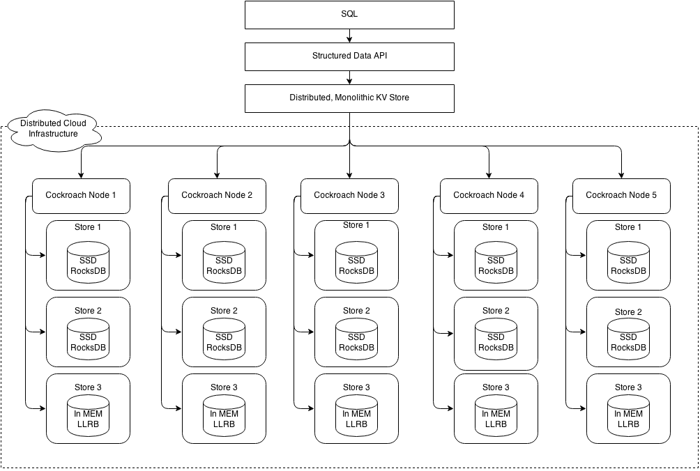
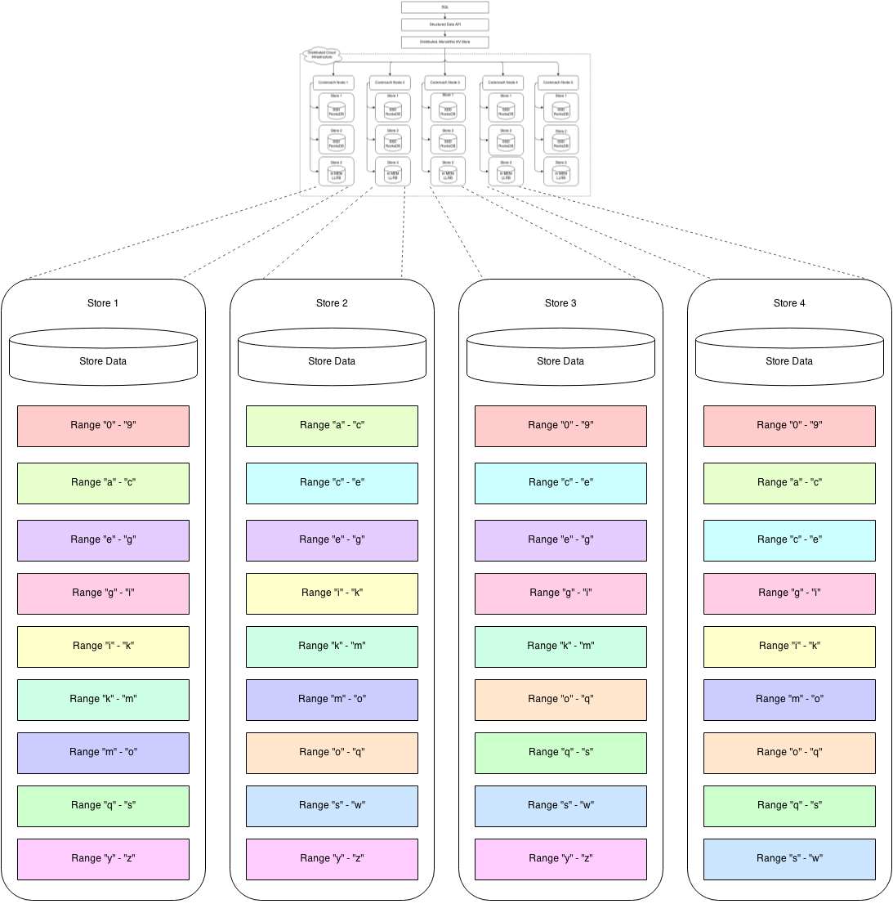

# About
This document is an updated version of the original design documents
by Spencer Kimball from early 2014.

# Overview

Cockroach is a distributed key:value datastore (SQL and structured
data layers of cockroach have yet to be defined) which supports **ACID
transactional semantics** and **versioned values** as first-class
features. The primary design goal is **global consistency and
survivability**, hence the name. Cockroach aims to tolerate disk,
machine, rack, and even **datacenter failures** with minimal latency
disruption and **no manual intervention**. Cockroach nodes are
symmetric; a design goal is **homogeneous deployment** (one binary) with
minimal configuration.

Cockroach implements a **single, monolithic sorted map** from key to
value where both keys and values are byte strings (not unicode).
Cockroach **scales linearly** (theoretically up to 4 exabytes (4E) of
logical data). The map is composed of one or more ranges and each range
is backed by data stored in [RocksDB](http://rocksdb.org/) (a
variant of LevelDB), and is replicated to a total of three or more
cockroach servers. Ranges are defined by start and end keys. Ranges are
merged and split to maintain total byte size within a globally
configurable min/max size interval. Range sizes default to target `64M` in
order to facilitate quick splits and merges and to distribute load at
hotspots within a key range. Range replicas are intended to be located
in disparate datacenters for survivability (e.g. `{ US-East, US-West,
Japan }`, `{ Ireland, US-East, US-West}`, `{ Ireland, US-East, US-West,
Japan, Australia }`).

Single mutations to ranges are mediated via an instance of a distributed
consensus algorithm to ensure consistency. We’ve chosen to use the
[Raft consensus algorithm](https://raftconsensus.github.io); all consensus
state is stored in RocksDB.

A single logical mutation may affect multiple key/value pairs. Logical
mutations have ACID transactional semantics. If all keys affected by a
logical mutation fall within the same range, atomicity and consistency
are guaranteed by Raft; this is the **fast commit path**. Otherwise, a
**non-locking distributed commit** protocol is employed between affected
ranges.

Cockroach provides [snapshot isolation](http://en.wikipedia.org/wiki/Snapshot_isolation) (SI) and
serializable snapshot isolation (SSI) semantics, allowing **externally
consistent, lock-free reads and writes**--both from a historical
snapshot timestamp and from the current wall clock time. SI provides
lock-free reads and writes but still allows write skew. SSI eliminates
write skew, but introduces a performance hit in the case of a
contentious system. SSI is the default isolation; clients must
consciously decide to trade correctness for performance. Cockroach
implements [a limited form of linearizability](#linearizability),
providing ordering for any observer or chain of observers.

Similar to
[Spanner](http://static.googleusercontent.com/media/research.google.com/en/us/archive/spanner-osdi2012.pdf)
directories, Cockroach allows configuration of arbitrary zones of data.
This allows replication factor, storage device type, and/or datacenter
location to be chosen to optimize performance and/or availability.
Unlike Spanner, zones are monolithic and don’t allow movement of fine
grained data on the level of entity groups.

# Architecture

Cockroach implements a layered architecture. The highest level of
abstraction is the SQL layer (currently unspecified in this document).
It depends directly on the [*structured data
API*](#structured-data-api), which provides familiar relational concepts
such as schemas, tables, columns, and indexes. The structured data API
in turn depends on the [distributed key value store](#key-value-api),
which handles the details of range addressing to provide the abstraction
of a single, monolithic key value store. The distributed KV store
communicates with any number of physical cockroach nodes. Each node
contains one or more stores, one per physical device.



Each store contains potentially many ranges, the lowest-level unit of
key-value data. Ranges are replicated using the Raft consensus protocol.
The diagram below is a blown up version of stores from four of the five
nodes in the previous diagram. Each range is replicated three ways using
raft. The color coding shows associated range replicas.



Each physical node exports a RoachNode service. Each RoachNode exports
one or more key ranges. RoachNodes are symmetric. Each has the same
binary and assumes identical roles.

Nodes and the ranges they provide access to can be arranged with various
physical network topologies to make trade offs between reliability and
performance. For example, a triplicated (3-way replica) range could have
each replica located on different:

-   disks within a server to tolerate disk failures.
-   servers within a rack to tolerate server failures.
-   servers on different racks within a datacenter to tolerate rack power/network failures.
-   servers in different datacenters to tolerate large scale network or power outages.

Up to `F` failures can be tolerated, where the total number of replicas `N = 2F + 1` (e.g. with 3x replication, one failure can be tolerated; with 5x replication, two failures, and so on).

# Cockroach Client

In order to support diverse client usage, Cockroach clients connect to
any node via HTTPS using protocol buffers or JSON. The connected node
proxies involved client work including key lookups and write buffering.

# Keys

Cockroach keys are arbitrary byte arrays. If textual data is used in
keys, utf8 encoding is recommended (this helps for cleaner display of
values in debugging tools). User-supplied keys are encoded using an
ordered code. System keys are either prefixed with null characters (`\0`
or `\0\0`) for system tables, or take the form of
`<user-key><system-suffix>` to sort user-key-range specific system
keys immediately after the user keys they refer to. Null characters are
used in system key prefixes to guarantee that they sort first.

# Versioned Values

Cockroach maintains historical versions of values by storing them with
associated commit timestamps. Reads and scans can specify a snapshot
time to return the most recent writes prior to the snapshot timestamp.
Older versions of values are garbage collected by the system during
compaction according to a user-specified expiration interval. In order
to support long-running scans (e.g. for MapReduce), all versions have a
minimum expiration.

Versioned values are supported via modifications to RocksDB to record
commit timestamps and GC expirations per key.

Each range maintains a small (i.e. latest 10s of read timestamps),
*in-memory* cache from key to the latest timestamp at which the
key was read. This *read timestamp cache* is updated every time a key
is read. The cache’s entries are evicted oldest timestamp first, updating
the low water mark of the cache appropriately. If a new range replica leader
is elected, it sets the low water mark for the cache to the current
wall time + ε (ε = 99th percentile clock skew).

# Lock-Free Distributed Transactions

Cockroach provides distributed transactions without locks. Cockroach
transactions support two isolation levels:

- snapshot isolation (SI) and
- *serializable* snapshot isolation (SSI).

*SI* is simple to implement, highly performant, and correct for all but a
handful of anomalous conditions (e.g. write skew). *SSI* requires just a touch
more complexity, is still highly performant (less so with contention), and has
no anomalous conditions. Cockroach’s SSI implementation is based on ideas from
the literature and some possibly novel insights.

SSI is the default level, with SI provided for application developers
who are certain enough of their need for performance and the absence of
write skew conditions to consciously elect to use it. In a lightly
contended system, our implementation of SSI is just as performant as SI,
requiring no locking or additional writes. With contention, our
implementation of SSI still requires no locking, but will end up
aborting more transactions. Cockroach’s SI and SSI implementations
prevent starvation scenarios even for arbitrarily long transactions.

See the [Cahill paper](https://drive.google.com/file/d/0B9GCVTp_FHJIcEVyZVdDWEpYYXVVbFVDWElrYUV0NHFhU2Fv/edit?usp=sharing)
for one possible implementation of SSI. This is another [great paper](http://cs.yale.edu/homes/thomson/publications/calvin-sigmod12.pdf).
For a discussion of SSI implemented by preventing read-write conflicts
(in contrast to detecting them, called write-snapshot isolation), see
the [Yabandeh paper](https://drive.google.com/file/d/0B9GCVTp_FHJIMjJ2U2t6aGpHLTFUVHFnMTRUbnBwc2pLa1RN/edit?usp=sharing),
which is the source of much inspiration for Cockroach’s SSI.

Each Cockroach transaction is assigned a random priority and a
"candidate timestamp" at start. The candidate timestamp is the
provisional timestamp at which the transaction will commit, and is
chosen as the current clock time of the node coordinating the
transaction. This means that a transaction without conflicts will
usually commit with a timestamp that, in absolute time, precedes the
actual work done by that transaction.

In the course of coordinating a transaction between one or more
distributed nodes, the candidate timestamp may be increased, but will
never be decreased. The core difference between the two isolation levels
SI and SSI is that the former allows the transaction's candidate
timestamp to increase and the latter does not.

**Hybrid Logical Clock**

Each cockroach node maintains a hybrid logical clock (HLC) as discussed
in the [Hybrid Logical Clock paper](http://www.cse.buffalo.edu/tech-reports/2014-04.pdf).
HLC time uses timestamps which are composed of a physical component (thought of
as and always close to local wall time) and a logical component (used to
distinguish between events with the same physical component). It allows us to
track causality for related events similar to vector clocks, but with less
overhead. In practice, it works much like other logical clocks: When events
are received by a node, it informs the local HLC about the timestamp supplied
with the event by the sender, and when events are sent a timestamp generated by
the local HLC is attached.

For a more in depth description of HLC please read the paper. Our
implementation is [here](https://github.com/cockroachdb/cockroach/blob/master/util/hlc/hlc.go).

Cockroach picks a Timestamp for a transaction using HLC time. Throughout this
document, *timestamp* always refers to the HLC time which is a singleton
on each node. The HLC is updated by every read/write event on the node, and
the HLC time >= wall time. A read/write timestamp received in a cockroach request
from another node is not only used to version the operation, but also updates
the HLC on the node. This is useful in guaranteeing that all data read/written
on a node is at a timestamp < next HLC time.

**Transaction execution flow**

Transactions are executed in two phases:

1. Start the transaction by writing a new entry to the system
   transaction table (keys prefixed by *\0tx*) with state “PENDING”. In
   parallel write an "intent" value for each datum being written as part
   of the transaction. These are normal MVCC values, with the addition of
   a special flag (i.e. “intent”) indicating that the value may be
   committed after the transaction itself commits. In addition,
   the transaction id (unique and chosen at tx start time by client)
   is stored with intent values. The tx id is used to refer to the
   transaction table when there are conflicts and to make
   tie-breaking decisions on ordering between identical timestamps.
   Each node returns the timestamp used for the write (which is the
   original candidate timestamp in the absence of read/write conflicts);
   the client selects the maximum from amongst all write timestamps as the
   final commit timestamp.

2. Commit the transaction by updating its entry in the system
   transaction table (keys prefixed by *\0tx*). The value of the
   commit entry contains the candidate timestamp (increased as
   necessary to accommodate any latest read timestamps). Note that
   the transaction is considered fully committed at this point and
   control may be returned to the client.

   In the case of an SI transaction, a commit timestamp which was
   increased to accommodate concurrent readers is perfectly
   acceptable and the commit may continue. For SSI transactions,
   however, a gap between candidate and commit timestamps
   necessitates transaction restart (note: restart is different than
   abort--see below).

   After the transaction is committed, all written intents are upgraded
   in parallel by removing the “intent” flag. The transaction is
   considered fully committed before this step and does not wait for
   it to return control to the transaction coordinator.

In the absence of conflicts, this is the end. Nothing else is necessary
to ensure the correctness of the system.

**Conflict Resolution**

Things get more interesting when a reader or writer encounters an intent
record or newly-committed value in a location that it needs to read or
write. This is a conflict, usually causing either of the transactions to
abort or restart depending on the type of conflict.

***Transaction restart:***

This is the usual (and more efficient) type of behaviour and is used
except when the transaction was aborted (for instance by another
transaction).
In effect, that reduces to two cases; the first being the one outlined
above: An SSI transaction that finds upon attempting to commit that
its commit timestamp has been pushed. The second case involves a transaction
actively encountering a conflict, that is, one of its readers or writers
encounter data that necessitate conflict resolution
(see transaction interactions below).

When a transaction restarts, it changes its priority and/or moves its
timestamp forward depending on data tied to the conflict, and
begins anew reusing the same tx id. The prior run of the transaction might
have written some write intents, which need to be deleted before the
transaction commits, so as to not be included as part of the transaction.
These stale write intent deletions are done during the reexecution of the
transaction, either implicitly, through writing new intents to
the same keys as part of the reexecution of the transaction, or explicitly,
by cleaning up stale intents that are not part of the reexecution of the
transaction. Since most transactions will end up writing to the same keys,
the explicit cleanup run just before committing the transaction is usually
a NOOP.

***Transaction abort:***

This is the case in which a transaction, upon reading its transaction
table entry, finds that it has been aborted. In this case, the
transaction can not reuse its intents; it returns control to the client
before cleaning them up (other readers and writers would clean up
dangling intents as they encounter them) but will make an effort to
clean up after itself. The next attempt (if applicable) then runs as a
new transaction with **a new tx id**.

***Transaction interactions:***

There are several scenarios in which transactions interact:

- **Reader encounters write intent or value with newer timestamp far
  enough in the future**: This is not a conflict. The reader is free
  to proceed; after all, it will be reading an older version of the
  value and so does not conflict. Recall that the write intent may
  be committed with a later timestamp than its candidate; it will
  never commit with an earlier one. **Side note**: if a SI transaction
  reader finds an intent with a newer timestamp which the reader’s own
  transaction has written, the reader always returns that intent's value.

- **Reader encounters write intent or value with newer timestamp in the
  near future:** In this case, we have to be careful. The newer
  intent may, in absolute terms, have happened in our read's past if
  the clock of the writer is ahead of the node serving the values.
  In that case, we would need to take this value into account, but
  we just don't know. Hence the transaction restarts, using instead
  a future timestamp (but remembering a maximum timestamp used to
  limit the uncertainty window to the maximum clock skew). In fact,
  this is optimized further; see the details under "choosing a time
  stamp" below.

- **Reader encounters write intent with older timestamp**: the reader
  must follow the intent’s transaction id to the transaction table.
  If the transaction has already been committed, then the reader can
  just read the value. If the write transaction has not yet been
  committed, then the reader has two options. If the write conflict
  is from an SI transaction, the reader can *push that transaction's
  commit timestamp into the future* (and consequently not have to
  read it). This is simple to do: the reader just updates the
  transaction’s commit timestamp to indicate that when/if the
  transaction does commit, it should use a timestamp *at least* as
  high. However, if the write conflict is from an SSI transaction,
  the reader must compare priorities. If the reader has the higher priority,
  it pushes the transaction’s commit timestamp (that
  transaction will then notice its timestamp has been pushed, and
  restart). If it has the lower or same priority, it retries itself using as
  a new priority `max(new random priority, conflicting txn’s
  priority - 1)`.

- **Writer encounters uncommitted write intent**:
  If the other write intent has been written by a transaction with a lower
  priority, the writer aborts the conflicting transaction. If the write
  intent has a higher or equal priority the transaction retries, using as a new
  priority *max(new random priority, conflicting txn’s priority - 1)*;
  the retry occurs after a short, randomized backoff interval.

- **Writer encounters newer committed value**:
  The committed value could also be an unresolved write intent made by a
  transaction that has already committed. The transaction restarts. On restart,
  the same priority is reused, but the candidate timestamp is moved forward
  to the encountered value's timestamp.

- **Writer encounters more recently read key**:
  The *read timestamp cache* is consulted on each write at a node. If the write’s
  candidate timestamp is earlier than the low water mark on the cache itself
  (i.e. its last evicted timestamp) or if the key being written has a read
  timestamp later than the write’s candidate timestamp, this later timestamp
  value is returned with the write. A new timestamp forces a transaction
  restart only if it is serializable.

**Transaction management**

Transactions are managed by the client proxy (or gateway in SQL Azure
parlance). Unlike in Spanner, writes are not buffered but are sent
directly to all implicated ranges. This allows the transaction to abort
quickly if it encounters a write conflict. The client proxy keeps track
of all written keys in order to resolve write intents asynchronously upon
transaction completion. If a transaction commits successfully, all intents
are upgraded to committed. In the event a transaction is aborted, all written
intents are deleted. The client proxy doesn’t guarantee it will resolve intents.

In the event the client proxy restarts before the pending transaction is
committed, the dangling transaction would continue to live in the
transaction table until aborted by another transaction. Transactions
heartbeat the transaction table every five seconds by default.
Transactions encountered by readers or writers with dangling intents
which haven’t been heartbeat within the required interval are aborted.
In the event the proxy restarts after a transaction commits but before
the asynchronous resolution is complete, the dangling intents are upgraded
when encountered by future readers and writers and the system does
not depend on their timely resolution for correctness.

An exploration of retries with contention and abort times with abandoned
transaction is
[here](https://docs.google.com/document/d/1kBCu4sdGAnvLqpT-_2vaTbomNmX3_saayWEGYu1j7mQ/edit?usp=sharing).

**Transaction Table**

Please see [roachpb/data.proto](https://github.com/cockroachdb/cockroach/blob/master/roachpb/data.proto) for the up-to-date structures, the best entry point being `message Transaction`.

**Pros**

- No requirement for reliable code execution to prevent stalled 2PC
  protocol.
- Readers never block with SI semantics; with SSI semantics, they may
  abort.
- Lower latency than traditional 2PC commit protocol (w/o contention)
  because second phase requires only a single write to the
  transaction table instead of a synchronous round to all
  transaction participants.
- Priorities avoid starvation for arbitrarily long transactions and
  always pick a winner from between contending transactions (no
  mutual aborts).
- Writes not buffered at client; writes fail fast.
- No read-locking overhead required for *serializable* SI (in contrast
  to other SSI implementations).
- Well-chosen (i.e. less random) priorities can flexibly give
  probabilistic guarantees on latency for arbitrary transactions
  (for example: make OLTP transactions 10x less likely to abort than
  low priority transactions, such as asynchronously scheduled jobs).

**Cons**

- Reads from non-leader replicas still require a ping to the leader to
  update *read timestamp cache*.
- Abandoned transactions may block contending writers for up to the
  heartbeat interval, though average wait is likely to be
  considerably shorter (see [graph in link](https://docs.google.com/document/d/1kBCu4sdGAnvLqpT-_2vaTbomNmX3_saayWEGYu1j7mQ/edit?usp=sharing)).
  This is likely considerably more performant than detecting and
  restarting 2PC in order to release read and write locks.
- Behavior different than other SI implementations: no first writer
  wins, and shorter transactions do not always finish quickly.
  Element of surprise for OLTP systems may be a problematic factor.
- Aborts can decrease throughput in a contended system compared with
  two phase locking. Aborts and retries increase read and write
  traffic, increase latency and decrease throughput.

**Choosing a Timestamp**

A key challenge of reading data in a distributed system with clock skew
is choosing a timestamp guaranteed to be greater than the latest
timestamp of any committed transaction (in absolute time). No system can
claim consistency and fail to read already-committed data.

Accomplishing consistency for transactions (or just single operations)
accessing a single node is easy. The timestamp is assigned by the node
itself, so it is guaranteed to be at a greater timestamp than all the
existing timestamped data on the node.

For multiple nodes, the timestamp of the node coordinating the
transaction `t` is used. In addition, a maximum timestamp `t+ε` is
supplied to provide an upper bound on timestamps for already-committed
data (`ε` is the maximum clock skew). As the transaction progresses, any
data read which have timestamps greater than `t` but less than `t+ε`
cause the transaction to abort and retry with the conflicting timestamp
t<sub>c</sub>, where t<sub>c</sub> \> t. The maximum timestamp `t+ε` remains
the same. This implies that transaction restarts due to clock uncertainty
can only happen on a time interval of length `ε`.

We apply another optimization to reduce the restarts caused
by uncertainty. Upon restarting, the transaction not only takes
into account t<sub>c</sub>, but the timestamp of the node at the time
of the uncertain read t<sub>node</sub>. The larger of those two timestamps
t<sub>c</sub> and t<sub>node</sub> (likely equal to the latter) is used
to increase the read timestamp. Additionally, the conflicting node is
marked as “certain”. Then, for future reads to that node within the
transaction, we set `MaxTimestamp = Read Timestamp`, preventing further
uncertainty restarts.

Correctness follows from the fact that we know that at the time of the read,
there exists no version of any key on that node with a higher timestamp than
t<sub>node</sub>. Upon a restart caused by the node, if the transaction
encounters a key with a higher timestamp, it knows that in absolute time,
the value was written after t<sub>node</sub> was obtained, i.e. after the
uncertain read. Hence the transaction can move forward reading an older version
of the data (at the transaction's timestamp). This limits the time uncertainty
restarts attributed to a node to at most one. The tradeoff is that we might
pick a timestamp larger than the optimal one (> highest conflicting timestamp),
resulting in the possibility of a few more conflicts.

We expect retries will be rare, but this assumption may need to be
revisited if retries become problematic. Note that this problem does not
apply to historical reads. An alternate approach which does not require
retries makes a round to all node participants in advance and
chooses the highest reported node wall time as the timestamp. However,
knowing which nodes will be accessed in advance is difficult and
potentially limiting. Cockroach could also potentially use a global
clock (Google did this with [Percolator](https://www.usenix.org/legacy/event/osdi10/tech/full_papers/Peng.pdf)),
which would be feasible for smaller, geographically-proximate clusters.

# Linearizability

First a word about [***Spanner***](http://research.google.com/archive/spanner.html).
By combining judicious use of wait intervals with accurate time signals,
Spanner provides a global ordering between any two non-overlapping transactions
(in absolute time) with \~14ms latencies. Put another way:
Spanner guarantees that if a transaction T<sub>1</sub> commits (in absolute time)
before another transaction T<sub>2</sub> starts, then T<sub>1</sub>'s assigned commit
timestamp is smaller than T<sub>2</sub>'s. Using atomic clocks and GPS receivers,
Spanner reduces their clock skew uncertainty to \< 10ms (`ε`). To make
good on the promised guarantee, transactions must take at least double
the clock skew uncertainty interval to commit (`2ε`). See [*this
article*](http://www.cs.cornell.edu/~ie53/publications/DC-col51-Sep13.pdf)
for a helpful overview of Spanner’s concurrency control.

Cockroach could make the same guarantees without specialized hardware,
at the expense of longer wait times. If servers in the cluster were
configured to work only with NTP, transaction wait times would likely to
be in excess of 150ms. For wide-area zones, this would be somewhat
mitigated by overlap from cross datacenter link latencies. If clocks
were made more accurate, the minimal limit for commit latencies would
improve.

However, let’s take a step back and evaluate whether Spanner’s external
consistency guarantee is worth the automatic commit wait. First, if the
commit wait is omitted completely, the system still yields a consistent
view of the map at an arbitrary timestamp. However with clock skew, it
would become possible for commit timestamps on non-overlapping but
causally related transactions to suffer temporal reverse. In other
words, the following scenario is possible for a client without global
ordering:

-   Start transaction T<sub>1</sub> to modify value `x` with commit time s<sub>1</sub>

-   On commit of T<sub>1</sub>, start T<sub>2</sub> to modify value `y` with commit time
    s<sub>2</sub>

-   Read `x` and `y` and discover that s<sub>1</sub> \> s<sub>2</sub> (**!**)

The external consistency which Spanner guarantees is referred to as
**linearizability**. It goes beyond serializability by preserving
information about the causality inherent in how external processes
interacted with the database. The strength of Spanner’s guarantee can be
formulated as follows: any two processes, with clock skew within
expected bounds, may independently record their wall times for the
completion of transaction T<sub>1</sub> (T<sub>1</sub><sup>end</sup>) and start of transaction
T<sub>2</sub> (T<sub>2</sub><sup>start</sup>) respectively, and if later
compared such that T<sub>1</sub><sup>end</sup> \< T<sub>2</sub><sup>start</sup>,
then commit timestamps s<sub>1</sub> \< s<sub>2</sub>.
This guarantee is broad enough to completely cover all cases of explicit
causality, in addition to covering any and all imaginable scenarios of implicit
causality.

Our contention is that causality is chiefly important from the
perspective of a single client or a chain of successive clients (*if a
tree falls in the forest and nobody hears…*). As such, Cockroach
provides two mechanisms to provide linearizability for the vast majority
of use cases without a mandatory transaction commit wait or an elaborate
system to minimize clock skew.

1. Clients provide the highest transaction commit timestamp with
   successive transactions. This allows node clocks from previous
   transactions to effectively participate in the formulation of the
   commit timestamp for the current transaction. This guarantees
   linearizability for transactions committed by this client.

   Newly launched clients wait at least 2 \* ε from process start
   time before beginning their first transaction. This preserves the
   same property even on client restart, and the wait will be
   mitigated by process initialization.

   All causally-related events within Cockroach maintain
   linearizability.

2. Committed transactions respond with a commit wait parameter which
   represents the remaining time in the nominal commit wait. This
   will typically be less than the full commit wait as the consensus
   write at the coordinator accounts for a portion of it.

   Clients taking any action outside of another Cockroach transaction
   (e.g. writing to another distributed system component) can either
   choose to wait the remaining interval before proceeding, or
   alternatively, pass the wait and/or commit timestamp to the
   execution of the outside action for its consideration. This pushes
   the burden of linearizability to clients, but is a useful tool in
   mitigating commit latencies if the clock skew is potentially
   large. This functionality can be used for ordering in the face of
   backchannel dependencies as mentioned in the
   [AugmentedTime](http://www.cse.buffalo.edu/~demirbas/publications/augmentedTime.pdf)
   paper.

Using these mechanisms in place of commit wait, Cockroach’s guarantee can be
formulated as follows: any process which signals the start of transaction
T<sub>2</sub> (T<sub>2</sub><sup>start</sup>) after the completion of
transaction T<sub>1</sub> (T<sub>1</sub><sup>end</sup>), will have commit
timestamps such thats<sub>1</sub> \< s<sub>2</sub>.

# Logical Map Content

Logically, the map contains a series of reserved system key / value
pairs covering accounting, range metadata and node accounting 
before the actual key / value pairs for non-system data
(e.g. the actual meat of the map).

- `\0\0meta1` Range metadata for location of `\0\0meta2`.
- `\0\0meta1<key1>` Range metadata for location of `\0\0meta2<key1>`.
- ...
- `\0\0meta1<keyN>`: Range metadata for location of `\0\0meta2<keyN>`.
- `\0\0meta2`: Range metadata for location of first non-range metadata key.
- `\0\0meta2<key1>`: Range metadata for location of `<key1>`.
- ...
- `\0\0meta2<keyN>`: Range metadata for location of `<keyN>`.
- `\0acct<key0>`: Accounting for key prefix key0.
- ...
- `\0acct<keyN>`: Accounting for key prefix keyN.
- `\0node<node-address0>`: Accounting data for node 0.
- ...
- `\0node<node-addressN>`: Accounting data for node N.
- `\0tree_root`: Range key for root of range-spanning tree.
- `\0tx<tx-id0>`: Transaction record for transaction 0.
- ...
- `\0tx<tx-idN>`: Transaction record for transaction N.
- `\0zone<key0>`: Zone information for key prefix key0.
- ...
- `\0zone<keyN>`: Zone information for key prefix keyN.
- `<>acctd<metric0>`: Accounting data for Metric 0 for empty key prefix.
- ...
- `<>acctd<metricN>`: Accounting data for Metric N for empty key prefix.
- `<key0>`: `<value0>` The first user data key.**
- ...
- `<keyN>`: `<valueN>` The last user data key.**

There are some additional system entries sprinkled amongst the
non-system keys. See the Key-Prefix Accounting section in this document
for further details.

# Node Storage

Nodes maintain a separate instance of RocksDB for each disk. Each
RocksDB instance hosts any number of ranges. RPCs arriving at a
RoachNode are multiplexed based on the disk name to the appropriate
RocksDB instance. A single instance per disk is used to avoid
contention. If every range maintained its own RocksDB, global management
of available cache memory would be impossible and writers for each range
would compete for non-contiguous writes to multiple RocksDB logs.

In addition to the key/value pairs of the range itself, various range
metadata is maintained.

-   range-spanning tree node links

-   participating replicas

-   consensus metadata

-   split/merge activity

A really good reference on tuning Linux installations with RocksDB is
[here](http://docs.basho.com/riak/latest/ops/advanced/backends/leveldb/).

# Range Metadata

The default approximate size of a range is 64M (2\^26 B). In order to
support 1P (2\^50 B) of logical data, metadata is needed for roughly
2\^(50 - 26) = 2\^24 ranges. A reasonable upper bound on range metadata
size is roughly 256 bytes (3\*12 bytes for the triplicated node
locations and 220 bytes for the range key itself*). 2\^24 ranges \* 2\^8
B would require roughly 4G (2\^32 B) to store--too much to duplicate
between machines. Our conclusion is that range metadata must be
distributed for large installations.

To keep key lookups relatively fast in the presence of distributed metadata,
we store all the top-level metadata in a single range (the first range). These
top-level metadata keys are known as *meta1* keys, and are prefixed such that
they sort to the beginning of the key space. Given the metadata size of 256
bytes given above, a single 64M range would support 64M/256B = 2\^18 ranges,
which gives a total storage of 64M \* 2\^18 = 16T. To support the 1P quoted
above, we need two levels of indirection, where the first level addresses the
second, and the second addresses user data. With two levels of indirection, we
can address 2\^(18 + 18) = 2\^36 ranges; each range addresses 2\^26 B, and
altogether we address 2\^(36+26) B = 2\^62 B = 4E of user data.

For a given user-addressable `key1`, the associated *meta1* record is found
at the successor key to `key1` in the *meta1* space. Since the *meta1* space
is sparse, the successor key is defined as the next key which is present. The
*meta1* record identifies the range containing the *meta2* record, which is
found using the same process. The *meta2* record identifies the range
containing `key1`, which is again found the same way (see examples below).

Concretely, metadata keys are prefixed by `\0\0meta{1,2}`; the two null
characters provide for the desired sorting behaviour. Thus, `key1`'s
*meta1* record will reside at the successor key to `\0\0\meta1<key1>`.

Note: we append the end key of each range to meta{1,2} records because
the RocksDB iterator only supports a Seek() interface which acts as a
Ceil(). Using the start key of the range would cause Seek() to find the
key *after* the meta indexing record we’re looking for, which would
result in having to back the iterator up, an option which is both less
efficient and not available in all cases.

The following example shows the directory structure for a map with
three ranges worth of data. Ellipses indicate additional key/value pairs to
fill an entire range of data. Except for the fact that splitting ranges
requires updates to the range metadata with knowledge of the metadata layout,
the range metadata itself requires no special treatment or bootstrapping.

**Range 0** (located on servers `dcrama1:8000`, `dcrama2:8000`,
  `dcrama3:8000`)

- `\0\0meta1\xff`: `dcrama1:8000`, `dcrama2:8000`, `dcrama3:8000`
- `\0\0meta2<lastkey0>`: `dcrama1:8000`, `dcrama2:8000`, `dcrama3:8000`
- `\0\0meta2<lastkey1>`: `dcrama4:8000`, `dcrama5:8000`, `dcrama6:8000`
- `\0\0meta2\xff`: `dcrama7:8000`, `dcrama8:8000`, `dcrama9:8000`
- ...
- `<lastkey0>`: `<lastvalue0>`

**Range 1** (located on servers `dcrama4:8000`, `dcrama5:8000`,
`dcrama6:8000`)

- ...
- `<lastkey1>`: `<lastvalue1>`

**Range 2** (located on servers `dcrama7:8000`, `dcrama8:8000`,
`dcrama9:8000`)

- ...
- `<lastkey2>`: `<lastvalue2>`

Consider a simpler example of a map containing less than a single
range of data. In this case, all range metadata and all data are
located in the same range:

**Range 0** (located on servers `dcrama1:8000`, `dcrama2:8000`,
`dcrama3:8000`)*

- `\0\0meta1\xff`: `dcrama1:8000`, `dcrama2:8000`, `dcrama3:8000`
- `\0\0meta2\xff`: `dcrama1:8000`, `dcrama2:8000`, `dcrama3:8000`
- `<key0>`: `<value0>`
- `...`

Finally, a map large enough to need both levels of indirection would
look like (note that instead of showing range replicas, this
example is simplified to just show range indexes):

**Range 0**

- `\0\0meta1<lastkeyN-1>`: Range 0
- `\0\0meta1\xff`: Range 1
- `\0\0meta2<lastkey1>`:  Range 1
- `\0\0meta2<lastkey2>`:  Range 2
- `\0\0meta2<lastkey3>`:  Range 3
- ...
- `\0\0meta2<lastkeyN-1>`: Range 262143

**Range 1**

- `\0\0meta2<lastkeyN>`: Range 262144
- `\0\0meta2<lastkeyN+1>`: Range 262145
- ...
- `\0\0meta2\xff`: Range 500,000
- ...
- `<lastkey1>`: `<lastvalue1>`

**Range 2**

- ...
- `<lastkey2>`: `<lastvalue2>`

**Range 3**

- ...
- `<lastkey3>`: `<lastvalue3>`

**Range 262144**

- ...
- `<lastkeyN>`: `<lastvalueN>`

**Range 262145**

- ...
- `<lastkeyN+1>`: `<lastvalueN+1>`

Note that the choice of range `262144` is just an approximation. The
actual number of ranges addressable via a single metadata range is
dependent on the size of the keys. If efforts are made to keep key sizes
small, the total number of addressable ranges would increase and vice
versa.

From the examples above it’s clear that key location lookups require at
most three reads to get the value for `<key>`:

1. lower bound of `\0\0meta1<key>`
2. lower bound of `\0\0meta2<key>`,
3. `<key>`.

For small maps, the entire lookup is satisfied in a single RPC to Range 0. Maps
containing less than 16T of data would require two lookups. Clients cache both
levels of range metadata, and we expect that data locality for individual
clients will be high. Clients may end up with stale cache entries. If on a
lookup, the range consulted does not match the client’s expectations, the
client evicts the stale entries and possibly does a new lookup.

# Raft - Consistency of Range Replicas

Each range is configured to consist of three or more replicas, as specified by
their ZoneConfig. The replicas in a range maintain their own instance of a
distributed consensus algorithm. We use the [*Raft consensus algorithm*](https://raftconsensus.github.io)
as it is simpler to reason about and includes a reference implementation
covering important details.
[ePaxos](https://www.cs.cmu.edu/~dga/papers/epaxos-sosp2013.pdf) has
promising performance characteristics for WAN-distributed replicas, but
it does not guarantee a consistent ordering between replicas.

Raft elects a relatively long-lived leader which must be involved to
propose commands. It heartbeats followers periodically and keeps their logs
replicated. In the absence of heartbeats, followers become candidates
after randomized election timeouts and proceed to hold new leader
elections. Cockroach weights random timeouts such that the replicas with
shorter round trip times to peers are more likely to hold elections
first (not implemented yet). Only the Raft leader may propose commands;
followers will simply relay commands to the last known leader.

Our Raft implementation was developed together with CoreOS, but adds an extra
layer of optimization to account for the fact that a single Node may have
millions of consensus groups (one for each Range). Areas of optimization
are chiefly coalesced heartbeats (so that the number of nodes dictates the
number of heartbeats as opposed to the much larger number of ranges) and
batch processing of requests.
Future optimizations may include two-phase elections and quiescent ranges
(i.e. stopping traffic completely for inactive ranges).

# Range Leadership (Leader Leases)

As outlined in the Raft section, the replicas of a Range are organized as a
Raft group and execute commands from their shared commit log. Going through
Raft is an expensive operation though, and there are tasks which should only be
carried out by a single replica at a time (as opposed to all of them).

For these reasons, Cockroach introduces the concept of **Range Leadership**:
This is a lease held for a slice of (database, i.e. hybrid logical) time and is
established by committing a special log entry through Raft containing the
interval the leadership is going to be active on, along with the Node:RaftID
combination that uniquely describes the requesting replica. Reads and writes
must generally be addressed to the replica holding the lease; if none does, any
replica may be addressed, causing it to try to obtain the lease synchronously.
Requests received by a non-leader (for the HLC timestamp specified in the
request's header) fail with an error pointing at the replica's last known
leader. These requests are retried transparently with the updated leader by the
gateway node and never reach the client.

The replica holding the lease is in charge or involved in handling
Range-specific maintenance tasks such as

* gossiping the sentinel and/or first range information
* splitting, merging and rebalancing

and, very importantly, may satisfy reads locally, without incurring the
overhead of going through Raft.

Since reads bypass Raft, a new lease holder will, among other things, ascertain
that its timestamp cache does not report timestamps smaller than the previous
lease holder's (so that it's compatible with reads which may have occurred on
the former leader). This is accomplished by setting the low water mark of the
timestamp cache to the expiration of the previous lease plus the maximum clock
offset.

## Relationship to Raft leadership

Range leadership is completely separate from Raft leadership, and so without
further efforts, Raft and Range leadership may not be represented by the same
replica most of the time. This is convenient semantically since it decouples
these two types of leadership and allows the use of Raft as a "black box", but
for reasons of performance, it is desirable to have both on the same replica.
Otherwise, sending a command through Raft always incurs the overhead of being
proposed to the Range leader's Raft instance first, which must relay it to the
Raft leader, which finally commits it into the log and updates its followers,
including the Range leader. This yields correct results but wastes several
round-trip delays, and so we will make sure that in the vast majority of cases
Range and Raft leadership coincide. A fairly easy method for achieving this is
to have each new lease period (extension or new) be accompanied by a
stipulation to the lease holder's replica to start Raft elections (unless it's
already leading), though some care should be taken that Range leadership is
relatively stable and long-lived to avoid a large number of Raft leadership
transitions.

## Command Execution Flow

This subsection describes how a leader replica processes a read/write
command in more details. Each command specifies (1) a key (or a range
of keys) that the command accesses and (2) the ID of a range which the
key(s) belongs to. When receiving a command, a RoachNode looks up a
range by the specified Range ID and checks if the range is still
responsible for the supplied keys. If any of the keys do not belong to the
range, the RoachNode returns an error so that the client will retry
and send a request to a correct range.

When all the keys belong to the range, the RoachNode attempts to
process the command. If the command is an inconsistent read-only
command, it is processed immediately. If the command is a consistent
read or a write, the command is executed when both of the following
conditions hold:

- The range replica has a leader lease.
- There are no other running commands whose keys overlap with
the submitted command and cause read/write conflict.

When the first condition is not met, the replica attempts to acquire
a lease or returns an error so that the client will redirect the
command to the current leader. The second condition guarantees that
consistent read/write commands for a given key are sequentially
executed.

When the above two conditions are met, the leader replica processes the
command. Consistent reads are processed on the leader immediately.
Write commands are committed into the Raft log so that every replica
will execute the same commands. All commands produce deterministic
results so that the range replicas keep consistent states among them.

When a write command completes, all the replica updates their response
cache to ensure idempotency. When a read command completes, the leader
replica updates its timestamp cache to keep track of the latest read
for a given key.

There is a chance that a leader lease gets expired while a command is
executed. Before executing a command, each replica checks if a replica
proposing the command has a still lease. When the lease has been
expired, the command will be rejected by the replica.


# Splitting / Merging Ranges

RoachNodes split or merge ranges based on whether they exceed maximum or
minimum thresholds for capacity or load. Ranges exceeding maximums for
either capacity or load are split; ranges below minimums for *both*
capacity and load are merged.

Ranges maintain the same accounting statistics as accounting key
prefixes. These boil down to a time series of data points with minute
granularity. Everything from number of bytes to read/write queue sizes.
Arbitrary distillations of the accounting stats can be determined as the
basis for splitting / merging. Two sensible metrics for use with
split/merge are range size in bytes and IOps. A good metric for
rebalancing a replica from one node to another would be total read/write
queue wait times. These metrics are gossipped, with each range / node
passing along relevant metrics if they’re in the bottom or top of the
range it’s aware of.

A range finding itself exceeding either capacity or load threshold
splits. To this end, the range leader computes an appropriate split key
candidate and issues the split through Raft. In contrast to splitting,
merging requires a range to be below the minimum threshold for both
capacity *and* load. A range being merged chooses the smaller of the
ranges immediately preceding and succeeding it.

Splitting, merging, rebalancing and recovering all follow the same basic
algorithm for moving data between roach nodes. New target replicas are
created and added to the replica set of source range. Then each new
replica is brought up to date by either replaying the log in full or
copying a snapshot of the source replica data and then replaying the log
from the timestamp of the snapshot to catch up fully. Once the new
replicas are fully up to date, the range metadata is updated and old,
source replica(s) deleted if applicable.

**Coordinator** (leader replica)

```
if splitting
  SplitRange(split_key): splits happen locally on range replicas and
  only after being completed locally, are moved to new target replicas.
else if merging
  Choose new replicas on same servers as target range replicas;
  add to replica set.
else if rebalancing || recovering
  Choose new replica(s) on least loaded servers; add to replica set.
```

**New Replica**

*Bring replica up to date:*

```
if all info can be read from replicated log
  copy replicated log
else
  snapshot source replica
  send successive ReadRange requests to source replica
  referencing snapshot

if merging
  combine ranges on all replicas
else if rebalancing || recovering
  remove old range replica(s)
```

RoachNodes split ranges when the total data in a range exceeds a
configurable maximum threshold. Similarly, ranges are merged when the
total data falls below a configurable minimum threshold.

**TBD: flesh this out**: Especially for merges (but also rebalancing) we have a
range disappearing from the local node; that range needs to disappear
gracefully, with a smooth handoff of operation to the new owner of its data.

Ranges are rebalanced if a node determines its load or capacity is one
of the worst in the cluster based on gossipped load stats. A node with
spare capacity is chosen in the same datacenter and a special-case split
is done which simply duplicates the data 1:1 and resets the range
configuration metadata.

# Range-Spanning Binary Tree

A crucial enhancement to the organization of range metadata is to
augment the bi-level range metadata lookup with a minimum spanning tree,
implemented as a left-leaning red-black tree over all ranges in the map.
This tree structure allows the system to start at any key prefix and
efficiently traverse an arbitrary key range with minimal RPC traffic,
minimal fan-in and fan-out, and with bounded time complexity equal to
`2*log N` steps, where `N` is the total number of ranges in the system.

Unlike the range metadata rows prefixed with `\0\0meta[1|2]`, the
metadata for the range-spanning tree (e.g. parent range and left / right
child ranges) is stored directly at the ranges as non-map metadata. The
metadata for each node of the tree (e.g. links to parent range, left
child range, and right child range) is stored with the range metadata.
In effect, the tree metadata is stored implicitly. In order to traverse
the tree, for example, you’d need to query each range in turn for its
metadata.

Any time a range is split or merged, both the bi-level range lookup
metadata and the per-range binary tree metadata are updated as part of
the same distributed transaction. The total number of nodes involved in
the update is bounded by 2 + log N (i.e. 2 updates for meta1 and
meta2, and up to log N updates to balance the range-spanning tree).
The range corresponding to the root node of the tree is stored in
*\0tree_root*.

As an example, consider the following set of nine ranges and their
associated range-spanning tree:

R0: `aa - cc`, R1: `*cc - lll`, R2: `*lll - llr`, R3: `*llr - nn`, R4: `*nn - rr`, R5: `*rr - ssss`, R6: `*ssss - sst`, R7: `*sst - vvv`, R8: `*vvv - zzzz`.


The range-spanning tree has many beneficial uses in Cockroach. It
provides a ready made solution to scheduling mappers and sorting /
reducing during map-reduce operations. It also provides a mechanism
for visiting every Raft replica range which comprises a logical key
range. This is used to periodically find the oldest extant write
intent over the entire system.

The range-spanning tree provides a convenient mechanism for planning
and executing parallel queries. These provide the basis for
[Dremel](http://static.googleusercontent.com/media/research.google.com/en/us/pubs/archive/36632.pdf)-like
query execution trees and it’s easy to imagine supporting a subset of
SQL or even javascript-based user functions for complex data analysis
tasks.


# Node Allocation (via Gossip)

New nodes must be allocated when a range is split. Instead of requiring
every RoachNode to know about the status of all or even a large number
of peer nodes --or-- alternatively requiring a specialized curator or
master with sufficiently global knowledge, we use a gossip protocol to
efficiently communicate only interesting information between all of the
nodes in the cluster. What’s interesting information? One example would
be whether a particular node has a lot of spare capacity. Each node,
when gossiping, compares each topic of gossip to its own state. If its
own state is somehow “more interesting” than the least interesting item
in the topic it’s seen recently, it includes its own state as part of
the next gossip session with a peer node. In this way, a node with
capacity sufficiently in excess of the mean quickly becomes discovered
by the entire cluster. To avoid piling onto outliers, nodes from the
high capacity set are selected at random for allocation.

The gossip protocol itself contains two primary components:

- **Peer Selection**: each node maintains up to N peers with which it
  regularly communicates. It selects peers with an eye towards
  maximizing fanout. A peer node which itself communicates with an
  array of otherwise unknown nodes will be selected over one which
  communicates with a set containing significant overlap. Each time
  gossip is initiated, each nodes’ set of peers is exchanged. Each
  node is then free to incorporate the other’s peers as it sees fit.
  To avoid any node suffering from excess incoming requests, a node
  may refuse to answer a gossip exchange. Each node is biased
  towards answering requests from nodes without significant overlap
  and refusing requests otherwise.

  Peers are efficiently selected using a heuristic as described in
  [Agarwal & Trachtenberg (2006)](https://drive.google.com/file/d/0B9GCVTp_FHJISmFRTThkOEZSM1U/edit?usp=sharing).

  **TBD**: how to avoid partitions? Need to work out a simulation of
  the protocol to tune the behavior and see empirically how well it
  works.

- **Gossip Selection**: what to communicate. Gossip is divided into
  topics. Load characteristics (capacity per disk, cpu load, and
  state [e.g. draining, ok, failure]) are used to drive node
  allocation. Range statistics (range read/write load, missing
  replicas, unavailable ranges) and network topology (inter-rack
  bandwidth/latency, inter-datacenter bandwidth/latency, subnet
  outages) are used for determining when to split ranges, when to
  recover replicas vs. wait for network connectivity, and for
  debugging / sysops. In all cases, a set of minimums and a set of
  maximums is propagated; each node applies its own view of the
  world to augment the values. Each minimum and maximum value is
  tagged with the reporting node and other accompanying contextual
  information. Each topic of gossip has its own protobuf to hold the
  structured data. The number of items of gossip in each topic is
  limited by a configurable bound.

  For efficiency, nodes assign each new item of gossip a sequence
  number and keep track of the highest sequence number each peer
  node has seen. Each round of gossip communicates only the delta
  containing new items.

# Node Accounting

The gossip protocol discussed in the previous section is useful to
quickly communicate fragments of important information in a
decentralized manner. However, complete accounting for each node is also
stored to a central location, available to any dashboard process. This
is done using the map itself. Each node periodically writes its state to
the map with keys prefixed by `\0node`, similar to the first level of
range metadata, but with an ‘`node`’ suffix. Each value is a protobuf
containing the full complement of node statistics--everything
communicated normally via the gossip protocol plus other useful, but
non-critical data.

The range containing the first key in the node accounting table is
responsible for gossiping the total count of nodes. This total count is
used by the gossip network to most efficiently organize itself. In
particular, the maximum number of hops for gossipped information to take
before reaching a node is given by `ceil(log(node count) / log(max
fanout)) + 1`.

# Key-prefix Accounting and Zones

Arbitrarily fine-grained accounting is specified via
key prefixes. Key prefixes can overlap, as is necessary for capturing
hierarchical relationships. For illustrative purposes, let’s say keys
specifying rows in a set of databases have the following format:

`<db>:<table>:<primary-key>[:<secondary-key>]`

In this case, we might collect accounting with
key prefixes:

`db1`, `db1:user`, `db1:order`,

Accounting is kept for the entire map by default.

## Accounting
to keep accounting for a range defined by a key prefix, an entry is created in
the accounting system table. The format of accounting table keys is:

`\0acct<key-prefix>`

In practice, we assume each RoachNode capable of caching the
entire accounting table as it is likely to be relatively small.

Accounting is kept for key prefix ranges with eventual consistency for
efficiency. There are two types of values which comprise accounting:
counts and occurrences, for lack of better terms. Counts describe
system state, such as the total number of bytes, rows,
etc. Occurrences include transient performance and load metrics. Both
types of accounting are captured as time series with minute
granularity. The length of time accounting metrics are kept is
configurable. Below are examples of each type of accounting value.

**System State Counters/Performance**

- Count of items (e.g. rows)
- Total bytes
- Total key bytes
- Total value length
- Queued message count
- Queued message total bytes
- Count of values \< 16B
- Count of values \< 64B
- Count of values \< 256B
- Count of values \< 1K
- Count of values \< 4K
- Count of values \< 16K
- Count of values \< 64K
- Count of values \< 256K
- Count of values \< 1M
- Count of values \> 1M
- Total bytes of accounting


**Load Occurrences**

- Get op count
- Get total MB
- Put op count
- Put total MB
- Delete op count
- Delete total MB
- Delete range op count
- Delete range total MB
- Scan op count
- Scan op MB
- Split count
- Merge count

Because accounting information is kept as time series and over many
possible metrics of interest, the data can become numerous. Accounting
data are stored in the map near the key prefix described, in order to
distribute load (for both aggregation and storage).

Accounting keys for system state have the form:
`<key-prefix>|acctd<metric-name>*`. Notice the leading ‘pipe’
character. It’s meant to sort the root level account AFTER any other
system tables. They must increment the same underlying values as they
are permanent counts, and not transient activity. Logic at the
RoachNode takes care of snapshotting the value into an appropriately
suffixed (e.g. with timestamp hour) multi-value time series entry.

Keys for perf/load metrics:
`<key-prefix>acctd<metric-name><hourly-timestamp>`.

`<hourly-timestamp>`-suffixed accounting entries are multi-valued,
containing a varint64 entry for each minute with activity during the
specified hour.

To efficiently keep accounting over large key ranges, the task of
aggregation must be distributed. If activity occurs within the same
range as the key prefix for accounting, the updates are made as part
of the consensus write. If the ranges differ, then a message is sent
to the parent range to increment the accounting. If upon receiving the
message, the parent range also does not include the key prefix, it in
turn forwards it to its parent or left child in the balanced binary
tree which is maintained to describe the range hierarchy. This limits
the number of messages before an update is visible at the root to `2*log N`,
where `N` is the number of ranges in the key prefix.

## Zones
zones are stored in the map with keys prefixed by
`\0zone` followed by the key prefix to which the zone
configuration applies. Zone values specify a protobuf containing
the datacenters from which replicas for ranges which fall under
the zone must be chosen.

Please see [config/config.proto](https://github.com/cockroachdb/cockroach/blob/master/config/config.proto) for up-to-date data structures used, the best entry point being `message ZoneConfig`.

If zones are modified in situ, each RoachNode verifies the
existing zones for its ranges against the zone configuration. If
it discovers differences, it reconfigures ranges in the same way
that it rebalances away from busy nodes, via special-case 1:1
split to a duplicate range comprising the new configuration.

# Key-Value API

see the protobufs in [roachpb/](https://github.com/cockroachdb/cockroach/blob/master/roachpb),
in particular [roachpb/api.proto](https://github.com/cockroachdb/cockroach/blob/master/roachpb/api.proto) and the comments within.

# Structured Data API

A preliminary design can be found in the [Go source documentation](https://godoc.org/github.com/cockroachdb/cockroach/sql).

# Appendix

## Datastore Goal Articulation

There are other important axes involved in data-stores which are less
well understood and/or explained. There is lots of cross-dependency,
but it's safe to segregate two more of them as (a) scan efficiency,
and (b) read vs write optimization.

### Datastore Scan Efficiency Spectrum

Scan efficiency refers to the number of IO ops required to scan a set
of sorted adjacent rows matching a criteria. However, it's a
complicated topic, because of the options (or lack of options) for
controlling physical order in different systems.

* Some designs either default to or only support "heap organized"
  physical records (Oracle, MySQL, Postgres, SQLite, MongoDB). In this
  design, a naive sorted-scan of an index involves one IO op per
  record.
* In these systems it's possible to "fully cover" a sorted-query in an
  index with some write-amplification.
* In some systems it's possible to put the primary record data in a
  sorted btree instead of a heap-table (default in MySQL/Innodb,
  option in Oracle).
* Sorted-order LSM NoSQL could be considered index-organized-tables,
  with efficient scans by the row-key. (HBase).
* Some NoSQL is not optimized for sorted-order retrieval, because of
  hash-bucketing, primarily based on the Dynamo design. (Cassandra,
  Riak)


### Read vs. Write Optimization Spectrum

Read vs write optimization is a product of the underlying sorted-order
data-structure used. Btrees are read-optimized. Hybrid write-deferred
trees are a balance of read-and-write optimizations (shuttle-trees,
fractal-trees, stratified-trees). LSM separates write-incorporation
into a separate step, offering a tunable amount of read-to-write
optimization. An "ideal" LSM at 0%-write-incorporation is a log, and
at 100%-write-incorporation is a btree.

The topic of LSM is confused by the fact that LSM is not an algorithm,
but a design pattern, and usage of LSM is hindered by the lack of a
de-facto optimal LSM design. LevelDB/RocksDB is one of the more
practical LSM implementations, but it is far from optimal. Popular
text-indicies like Lucene are non-general purpose instances of
write-optimized LSM.

Further, there is a dependency between access pattern
(read-modify-write vs blind-write and write-fraction), cache-hitrate,
and ideal sorted-order algorithm selection. At a certain
write-fraction and read-cache-hitrate, systems achieve higher total
throughput with write-optimized designs, at the cost of increased
worst-case read latency. As either write-fraction or
read-cache-hitrate approaches 1.0, write-optimized designs provide
dramatically better sustained system throughput when record-sizes are
small relative to IO sizes.

Given this information, data-stores can be sliced by their
sorted-order storage algorithm selection. Btree stores are
read-optimized (Oracle, SQLServer, Postgres, SQLite2, MySQL, MongoDB,
CouchDB), hybrid stores are read-optimized with better
write-throughput (Tokutek MySQL/MongoDB), while LSM-variants are
write-optimized (HBase, Cassandra, SQLite3/LSM, CockroachDB).


## Architecture

CockroachDB implements a layered architecture, with various
subdirectories implementing layers as appropriate. The highest level of
abstraction is the [SQL layer][5], which depends
directly on the structured data API. The structured
data API provides familiar relational concepts such as schemas,
tables, columns, and indexes. The structured data API in turn depends
on the [distributed key value store][7] ([kv/][8]). The distributed key
value store handles the details of range addressing to provide the
abstraction of a single, monolithic key value store. It communicates
with any number of [RoachNodes][9] ([server/][10]), storing the actual
data. Each node contains one or more [stores][11] ([storage/][12]), one per
physical device.


Each store contains potentially many ranges, the lowest-level unit of
key-value data. Ranges are replicated using the [Raft][2] consensus
protocol. The diagram below is a blown up version of stores from four
of the five nodes in the previous diagram. Each range is replicated
three ways using raft. The color coding shows associated range
replicas.


## Client Architecture

RoachNodes serve client traffic using a fully-featured SQL API which accepts requests as either application/x-protobuf or
application/json. Client implementations consist of an HTTP sender
(transport) and a transactional sender which implements a simple
exponential backoff / retry protocol, depending on CockroachDB error
codes.

The DB client gateway accepts incoming requests and sends them
through a transaction coordinator, which handles transaction
heartbeats on behalf of clients, provides optimization pathways, and
resolves write intents on transaction commit or abort. The transaction
coordinator passes requests onto a distributed sender, which looks up
index metadata, caches the results, and routes internode RPC traffic
based on where the index metadata indicates keys are located in the
distributed cluster.

In addition to the gateway for external DB client traffic, each RoachNode provides the full key/value API (including all internal methods) via
a Go RPC server endpoint. The RPC server endpoint forwards requests to one
or more local stores depending on the specified key range.

Internally, each RoachNode uses the Go implementation of the
CockroachDB client in order to transactionally update system key/value
data; for example during split and merge operations to update index
metadata records. Unlike an external application, the internal client
eschews the HTTP sender and instead directly shares the transaction
coordinator and distributed sender used by the DB client gateway.


[0]: http://rocksdb.org/
[1]: https://github.com/google/leveldb
[2]: https://ramcloud.stanford.edu/wiki/download/attachments/11370504/raft.pdf
[3]: http://research.google.com/archive/spanner.html
[4]: http://research.google.com/pubs/pub36971.html
[5]: https://github.com/cockroachdb/cockroach/tree/master/sql
[7]: https://godoc.org/github.com/cockroachdb/cockroach/kv
[8]: https://github.com/cockroachdb/cockroach/tree/master/kv
[9]: https://godoc.org/github.com/cockroachdb/cockroach/server
[10]: https://github.com/cockroachdb/cockroach/tree/master/server
[11]: https://godoc.org/github.com/cockroachdb/cockroach/storage
[12]: https://github.com/cockroachdb/cockroach/tree/master/storage
