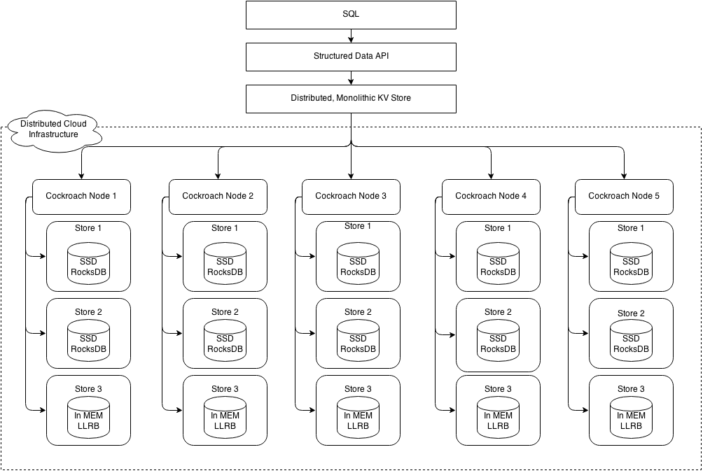
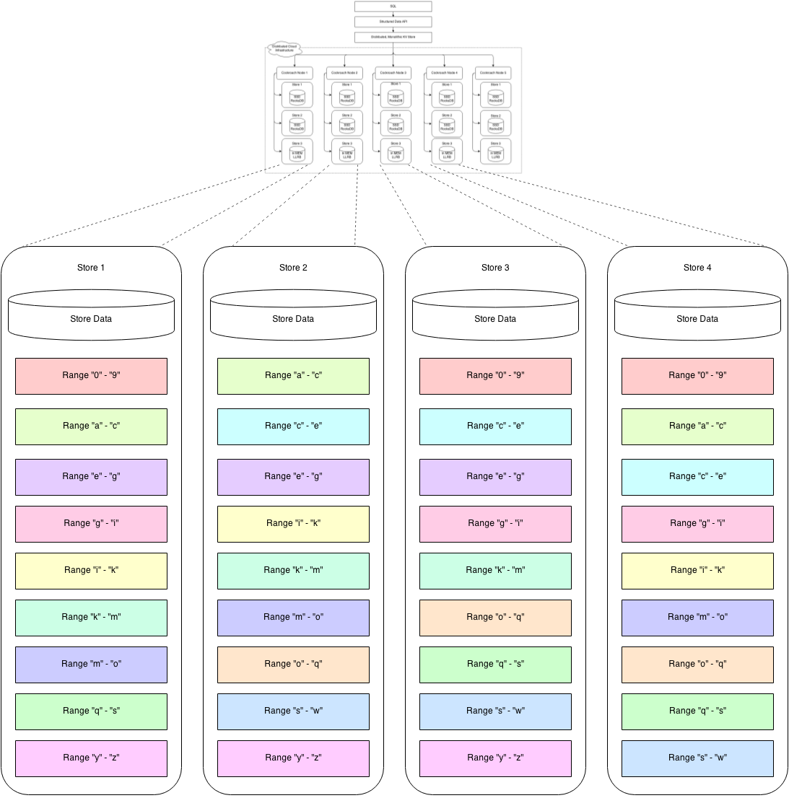

# About
# 关于
This document is an updated version of the original design documents
by Spencer Kimball from early 2014.

本文档为2014年早期由Spencer Kimball编写的初始设计文档的更新版本。

# Overview
# 概述

CockroachDB is a distributed SQL database. The primary design goals
are **scalability**, **strong consistency** and **survivability**
(hence the name). CockroachDB aims to tolerate disk, machine, rack, and
even **datacenter failures** with minimal latency disruption and **no
manual intervention**. CockroachDB nodes are symmetric; a design goal is
**homogeneous deployment** (one binary) with minimal configuration and
no required external dependencies.

CockroachDB是一个分布式SQL数据库。其主要设计目标是**可扩展性**、**强一致性**和**生存性**
（就像它的名字）。CockroachDB的目标是容忍磁盘、机器、机架，甚至**数据中心故障**时
极小的延迟中断的影响且**无需人工介入**。CockroachDB各节点是均衡的，
设计目标是**同质化部署**（一个二进制包）极少的配置且不需要外部依赖。

The entry point for database clients is the SQL interface. Every node
in a CockroachDB cluster can act as a client SQL gateway. A SQL
gateway transforms and executes client SQL statements to key-value
(KV) operations, which the gateway distributes across the cluster as
necessary and returns results to the client. CockroachDB implements a
**single, monolithic sorted map** from key to value where both keys
and values are byte strings.


为数据库客户端提供的访问接入点是SQL接口。CockroachDB集群中的每个节点都可以扮演
一个客户端SQL网关角色。SQL网关将客户端SQL语句转换成KV操作，分发到所需的节点执行并
返回结果给客户端。CockroachDB实现了一个 、单一整体有序的映射Map，其中的键Key和值Value都是字节串（不是unicode）。

The KV map is logically composed of smaller segments of the keyspace called
ranges. Each range is backed by data stored in a local KV storage engine (we
use [RocksDB](http://rocksdb.org/), a variant of
[LevelDB](https://github.com/google/leveldb)). Range data is replicated to a
configurable number of additional CockroachDB nodes. Ranges are merged and
split to maintain a target size, by default `64M`. The relatively small size
facilitates quick repair and rebalancing to address node failures, new capacity
and even read/write load. However, the size must be balanced against the
pressure on the system from having more ranges to manage.

KV映射（map）的逻辑组成是更小的键空间片段被称为range。
每一个range依靠本地KV存储引擎（我们使用[RocksDB](http://rocksdb.org/), [LevelDB](https://github.com/google/leveldb)的变种）
的数据存储能力来支持。Range数据可被复制到指定数量的其他CockroachDB节点上。Range会被合并或者拆分以维持目标尺寸大小，默认是64M。
相对来说，小尺寸有利于更快速的恢复、重新平衡，以处理节点失效或新增容量甚至读写负载。然而，该尺寸的选取必须依据系统上的压力（系统中有多少更多的range需要管理）来平衡考虑。

CockroachDB achieves horizontally scalability:
- adding more nodes increases the capacity of the cluster by the
  amount of storage on each node (divided by a configurable
  replication factor), theoretically up to 4 exabytes (4E) of logical
  data;
- client queries can be sent to any node in the cluster, and queries
  can operate independently (w/o conflicts), meaning that overall
  throughput is a linear factor of the number of nodes in the cluster.
- queries are distributed (ref: distributed SQL) so that the overall
  throughput of single queries can be increased by adding more nodes.

CockroachDB水平扩展性实现：

- 增加更多节点来增加集群容量，理论上逻辑数据可扩展到4E byte。每个节点增加的有效容量=所增加的存储容量/所配置的复制系数；

- 客户端查询可以发送到集群中的任一节点，这些查询可以独立执行（无冲突），这意味着整体吞吐量随集群节点数线性增长；

- 查询被分发执行（参见：分布式SQL），所以单一查询的吞吐量也会因增加更多节点而增加。

CockroachDB achieves strong consistency:
- uses a distributed consensus protocol for synchronous replication of
  data in each key value range. We’ve chosen to use the [Raft
  consensus algorithm](https://raftconsensus.github.io); all consensus
  state is stored in RocksDB.
- single or batched mutations to a single range are mediated via the
  range's Raft instance. Raft guarantees ACID semantics.
- logical mutations which affect multiple ranges employ distributed
  transactions for ACID semantics. CockroachDB uses an efficient
  **non-locking distributed commit** protocol.

CockroachDB强一致性实现：

- 每个KV range内数据的同步复制都采用分布式一致性协议。我们采用[Raft一致性算法](https://raftconsensus.github.io)，所有一致性状态都存储在RocksDB中；

- 对单一range的单一或者批量变化是通过该range的Raft实例作为中介来完成的。Raft保障了ACID语义；

- 涉及多个range的逻辑上的变化则是利用分布式事务来保障ACID语义。CockroachDB使用高效的 **无锁分布式提交** 协议。

CockroachDB achieves survivability:
- range replicas can be co-located within a single datacenter for low
  latency replication and survive disk or machine failures. They can
  be distributed across racks to survive some network switch failures.
- range replicas can be located in datacenters spanning increasingly
  disparate geographies to survive ever-greater failure scenarios from
  datacenter power or networking loss to regional power failures
  (e.g. `{ US-East-1a, US-East-1b, US-East-1c }`, `{ US-East, US-West,
  Japan }`, `{ Ireland, US-East, US-West}`, `{ Ireland, US-East,
  US-West, Japan, Australia }`).

CockroachDB生存性实现：

- range多个副本可以在单一数据中心内同地协作，目的是提供低延迟复制和在磁盘或者机器故障时仍然存活。
Range副本可以被分布到不同机架，目的是在一些网络交换机故障时仍能够存活。

- range多个副本可以位于跨越不同地域的数据中心范围内，目的是在更大的故障场景（从数据中心断电、
  断网到区域性电力故障）中仍然存活。 (例如 `{ US-East-1a, US-East-1b, US-East-1c }`, `{ US-East, US-West,
  Japan }`, `{ Ireland, US-East, US-West}`, `{ Ireland, US-East,  US-West, Japan, Australia }`).。


CockroachDB provides [snapshot isolation](http://en.wikipedia.org/wiki/Snapshot_isolation) (SI) and
serializable snapshot isolation (SSI) semantics, allowing **externally
consistent, lock-free reads and writes**--both from a historical
snapshot timestamp and from the current wall clock time. SI provides
lock-free reads and writes but still allows write skew. SSI eliminates
write skew, but introduces a performance hit in the case of a
contentious system. SSI is the default isolation; clients must
consciously decide to trade correctness for performance. CockroachDB
implements [a limited form of linearizability](#linearizability),
providing ordering for any observer or chain of observers.


CockroachDB提供快照隔离级别([snapshot isolation](http://en.wikipedia.org/wiki/Snapshot_isolation)简称SI)
和序列化快照隔离级别（serializable snapshot isolation简称SSI）语义，容许 **外部一致性、无锁定读写** --
从历史快照时间戳和从当前系统时间读写（系统时间指从时间设备如：钟表、电脑等计时设备读到的时间值，它是我们对真实时间的度量值，但跟真实时间总是不可能完全一致）。SI隔离级别提供无锁定读写但会产生写偏序（译注：因为每个事务在更新过程中看不到其他事务的更新结果，所以可能造成各个事务提交之后的最终结果违反了一致性）。SSI隔离级别消除了写偏序，但在竞争频繁的系统中引起了性能的下降。SSI隔离级别是默认的隔离级别，用户必须有意识地决定是否用性能换取正确性。CockroachDB实现了严格一致性（线性一致性）的一种有限形式，为任一观察者或观察者链提供有序化。

Similar to
[Spanner](http://static.googleusercontent.com/media/research.google.com/en/us/archive/spanner-osdi2012.pdf)
directories, CockroachDB allows configuration of arbitrary zones of data.
This allows replication factor, storage device type, and/or datacenter
location to be chosen to optimize performance and/or availability.
Unlike Spanner, zones are monolithic and don’t allow movement of fine
grained data on the level of entity groups.

类似于[Spanner](http://static.googleusercontent.com/media/research.google.com/en/us/archive/spanner-osdi2012.pdf)目录，
CockroachDB允许对任意数据地域进行配置。允许配置复制因子、存储设备类型、数据中心位置，以优化性能或者提高可用性。
但与Spanner不同，地域是整体的，不允许在实体组层面进行更细粒度数据的移动。

# Architecture
# 架构

CockroachDB implements a layered architecture. The highest level of
abstraction is the SQL layer (currently unspecified in this document).
It depends directly on the [*SQL layer*](#sql),
which provides familiar relational concepts
such as schemas, tables, columns, and indexes. The SQL layer
in turn depends on the [distributed key value store](#key-value-api),
which handles the details of range addressing to provide the abstraction
of a single, monolithic key value store. The distributed KV store
communicates with any number of physical cockroach nodes. Each node
contains one or more stores, one per physical device.

CockroachDB采用分层架构。其最高抽像层为SQL层（目前本文档未详细描述）。
CockroachDB直接通过[*SQL层*](#sql)提供熟悉的关系概念，如：模式schema、表table、
列column和索引index。接下来SQL层依赖于[分布式KV存储](#key-value-api)，
该存储管理range处理的细节以提供一个单一全局KV存储的抽象。分布式KV存储与任意数量
的cockroach物理节点通信。每个物理节点包含一个或者多个存储。



Each store contains potentially many ranges, the lowest-level unit of
key-value data. Ranges are replicated using the Raft consensus protocol.
The diagram below is a blown up version of stores from four of the five
nodes in the previous diagram. Each range is replicated three ways using
raft. The color coding shows associated range replicas.

每个store都可能包含很多range，range是最底层的KV数据单元。Range使用Raft一致性
协议进行复制。下图是上图store的放大版本，示意了上图5个节点中的4个节点的store。
每个range都被使用Raft协议复制了3份。颜色编码显示了关联的range副本（译注：range及其副本使用相同颜色）。



Each physical node exports two RPC-based key value APIs: one for
external clients and one for internal clients (exposing sensitive
operational features). Both services accept batches of requests and
return batches of responses. Nodes are symmetric in capabilities and
exported interfaces; each has the same binary and may assume any
role.

每一个物理节点都提供两个基于RPC的KV API：一个为外部客户端提供，一个为内部客
户端使用（暴露易变化的操作特性）。两种服务都接受批量请求并批量返回结果。
每个节点所提供的能力和接口都是对等的，每个节点都部署相同的二进制程序并可以承担任何角色。

Nodes and the ranges they provide access to can be arranged with various
physical network topologies to make trade offs between reliability and
performance. For example, a triplicated (3-way replica) range could have
each replica located on different:

-   disks within a server to tolerate disk failures.
-   servers within a rack to tolerate server failures.
-   servers on different racks within a datacenter to tolerate rack power/network failures.
-   servers in different datacenters to tolerate large scale network or power outages.

Up to `F` failures can be tolerated, where the total number of replicas `N = 2F + 1` (e.g. with 3x replication, one failure can be tolerated; with 5x replication, two failures, and so on).

节点和它所提供的可访问range可以跟据各种物理网络拓扑结构调整，以兼顾可靠性和性能。
例如，一个3副本的range其每份副本放置到不同位置（以达到不同的效果）：

-   位于一台服务器上的不同磁盘上以容忍磁盘失效；

-   位于一个机架上的不同服务器上以容忍server失效；

-   位于一个数据中心内不同机架的服务器上以以容忍机架电力/网络失效；

-   位于不同数据中心的服务器上以容忍大范围断网或者停电

若要最高容忍F个失效，则需副本总数N=2F + 1（例如：3个副本可容忍1个失效，5个副本容忍2个失效，等等）。


# Keys
# 键

Cockroach keys are arbitrary byte arrays. Keys come in two flavors:
system keys and table data keys. System keys are used by Cockroach for
internal data structures and metadata. Table data keys contain SQL
table data (as well as index data). System and table data keys are
prefixed in such a way that all system keys sort before any table data
keys.

Cockroach 的key是任意byte数组。Key分成两种：系统Key和表数据Key。
系统Key由Cockroach使用，用于内部数据结构和元数据。表数据Key包含SQL表数据（也包含索引数据）。
系统Key和表数据Key都被增加前缀，使用此种方式来使得排序时所有系统Key都在表数据Key之前。

System keys come in several subtypes:

- **Global** keys store cluster-wide data such as the "meta1" and
    "meta2" keys as well as various other system-wide keys such as the
    node and store ID allocators.
- **Store local** keys are used for unreplicated store metadata
    (e.g. the `StoreIdent` structure). "Unreplicated" indicates that
    these values are not replicated across multiple stores because the
    data they hold is tied to the lifetime of the store they are
    present on.
- **Range local** keys store range metadata that is associated with a
    global key. Range local keys have a special prefix followed by a
    global key and a special suffix. For example, transaction records
    are range local keys which look like:
    `\x01k<global-key>txn-<txnID>`.
- **Replicated Range ID local** keys store range metadata that is
    present on all of the replicas for a range. These keys are updated
    via Raft operations. Examples include the range lease state and
    abort cache entries.
- **Unreplicated Range ID local** keys store range metadata that is
    local to a replica. The primary examples of such keys are the Raft
    state and Raft log.

系统Key有几种子类型：

- **全局** Key，存储集群范围内数据（如：”meta1”和”meta2” key）和各种其他系统范围内Key（如：节点和store ID分配器）。

- **Store本地** Key，用于非复制store元数据（如：StoreIdent结构）。“非复制”指这些值不会跨越多个store进行复制，
因为这些Key所容纳数据与它们所在的store的生命周期紧密联系在一起。

- **Range本地** Key，存储与一个全局Key相联系的range元数据。Range本地Key有一个跟在全局Key后的特殊前缀和一个特殊的后缀。
例如：事务记录是Range本地Key，它看起来会是如下样子：\x01k<global-key>txn-<txnID>。

- **复制RangeID本地** Key，存储range元数据，出现在一个range的所有副本中。这些Key通过Raft操作来更新。例如，包括range租约状态和放弃缓存的条目。

- **非复制RangeID本地** Key，存储range元数据，对于一个副本是本地的。这些Key的主要例子有Raft状态和Raft日志。


Table data keys are used to store all SQL data. Table data keys
contain internal structure as described in the section on [mapping
data between the SQL model and
KV](#data-mapping-between-the-sql-model-and-kv).

表数据Key用于存储所有SQL数据。表数据Key包含内部结构，该内部结构在[SQL模型与KV间的数据映射](#data-mapping-between-the-sql-model-and-kv)章节中描述。

# Versioned Values

Cockroach maintains historical versions of values by storing them with
associated commit timestamps. Reads and scans can specify a snapshot
time to return the most recent writes prior to the snapshot timestamp.
Older versions of values are garbage collected by the system during
compaction according to a user-specified expiration interval. In order
to support long-running scans (e.g. for MapReduce), all versions have a
minimum expiration.

Cockroach通过存储commit时间戳来维护值的多个历史版本。读取和扫描可以通过指定一个快照时间
来返回该时间戳之前的最近一次更新后的数据。值的老版本在系统中根据用户指定的过期间隔而执行合并（compaction）期间被垃圾回收掉。
为了支持运行时间较长的数据扫描（如，MapReduce），所有的版本都有一个最小过期时间。

Versioned values are supported via modifications to RocksDB to record
commit timestamps and GC expirations per key.

多版本值是通过修改RocksDB来记录每个Key的提交时间戳和GC过期时间来实现的。

# Lock-Free Distributed Transactions
# 无锁分布式事务

Cockroach provides distributed transactions without locks. Cockroach
transactions support two isolation levels:

- snapshot isolation (SI) and
- *serializable* snapshot isolation (SSI).

Cockroach提供无锁分布式事务，Cockroach事务支持两种隔离级别：

- 快照隔离级别（SI）；

- *序列化*快照隔离级别（SSI）。

*SI* is simple to implement, highly performant, and correct for all but a
handful of anomalous conditions (e.g. write skew). *SSI* requires just a touch
more complexity, is still highly performant (less so with contention), and has
no anomalous conditions. Cockroach’s SSI implementation is based on ideas from
the literature and some possibly novel insights.

SI 实现简单、性能高，在排除少数特殊情况（如：写偏序）下也具有正确性。*SSI*则更为复杂，
但也具有高性能（随竞争增加而降低），同时也保障了正确性（没有特殊情况引致错误）。
Cockroach的SSI实现基于来自文献的想法和一些创新性见解。

SSI is the default level, with SI provided for application developers
who are certain enough of their need for performance and the absence of
write skew conditions to consciously elect to use it. In a lightly
contended system, our implementation of SSI is just as performant as SI,
requiring no locking or additional writes. With contention, our
implementation of SSI still requires no locking, but will end up
aborting more transactions. Cockroach’s SI and SSI implementations
prevent starvation scenarios even for arbitrarily long transactions.

SSI是默认的隔离级别。但CockroachDB也为应用开发者提供了SI隔离级别供选择，当确认需要高性能并没有写偏序的情况下使用该隔离级别。
在轻度竞争系统中，SSI的实现和SI一样性能相当，无锁定或额外写入。在竞争系统中，SSI的实现仍然无锁定，但最终结果会中止更多的事务。
CockroachDB的SI和SSI的实现即使在任意长事务情况下也均能防止饥饿情况的发生。

See the [Cahill paper](https://drive.google.com/file/d/0B9GCVTp_FHJIcEVyZVdDWEpYYXVVbFVDWElrYUV0NHFhU2Fv/edit?usp=sharing)
for one possible implementation of SSI. This is another [great paper](http://cs.yale.edu/homes/thomson/publications/calvin-sigmod12.pdf).
For a discussion of SSI implemented by preventing read-write conflicts
(in contrast to detecting them, called write-snapshot isolation), see
the [Yabandeh paper](https://drive.google.com/file/d/0B9GCVTp_FHJIMjJ2U2t6aGpHLTFUVHFnMTRUbnBwc2pLa1RN/edit?usp=sharing),
which is the source of much inspiration for Cockroach’s SSI.

SSI的一种可供参考实现参见 [MICHAEL JAMES CAHILL](https://drive.google.com/file/d/0B9GCVTp_FHJIcEVyZVdDWEpYYXVVbFVDWElrYUV0NHFhU2Fv/edit?usp=sharing)的论文（译注：指《SerializableIsolation for Snapshot Databases》）。还有另一个[很棒的论文](http://cs.yale.edu/homes/thomson/publications/calvin-sigmod12.pdf)，是关于通过防止读写冲突来实现SSI的讨论，参见[Yabandeh 的论文](https://drive.google.com/file/d/0B9GCVTp_FHJIMjJ2U2t6aGpHLTFUVHFnMTRUbnBwc2pLa1RN/edit?usp=sharing)（译注：指《Predicting and Preventing Inconsistencies in DeployedDistributed Systems》），该论文是CockroachDB的SSI实现中许多灵感的源泉。

Both SI and SSI require that the outcome of reads must be preserved, i.e.
a write of a key at a lower timestamp than a previous read must not succeed. To
this end, each range maintains a bounded *in-memory* cache from key range to
the latest timestamp at which it was read.

SI和SSI都需要对读过的结果进行保存，例如，在比读操作更早时间戳版本Key上的写操作一定不可以成功。
为达到这一效果，每个range维护了一个有界*内存*缓存，从key range到其被读过的最新时间戳。

Most updates to this *timestamp cache* correspond to keys being read, though
the timestamp cache also protects the outcome of some writes (notably range
deletions) which consequently must also populate the cache. The cache’s entries
are evicted oldest timestamp first, updating the low water mark of the cache
appropriately.

大多时候，时间戳缓存的更新相当于Key正在被读，尽管时间戳缓存也保护一些写操作（这些写操作的后果一定位于cache内）
的结果（尤其是range删除操作）。该缓存首先淘汰掉最老时间戳条目，并适时地更新低水位线。

Each Cockroach transaction is assigned a random priority and a
"candidate timestamp" at start. The candidate timestamp is the
provisional timestamp at which the transaction will commit, and is
chosen as the current clock time of the node coordinating the
transaction. This means that a transaction without conflicts will
usually commit with a timestamp that, in absolute time, precedes the
actual work done by that transaction.

每一个Cockroach事务在开始时都会分配一个随机优先级和“候选时间戳”。在事务将要提交时，
候选时间戳是一个临时的时间戳，选自处理该事务的节点的当前时间。这意味着一个没有冲突的
事务将使用该时间戳提交，从绝对时间来看，此时间戳先于事务结束时间。

In the course of coordinating a transaction between one or more
distributed nodes, the candidate timestamp may be increased, but will
never be decreased. The core difference between the two isolation levels
SI and SSI is that the former allows the transaction's candidate
timestamp to increase and the latter does not.

在跨一个或者多个分布式节点的事务的协同过程中，候选时间戳可能会增长，但不会降低。
SI与SSI两种隔离级别的核心不同点是前者允许事务的候选时间戳增长，而后者不允许。

**Hybrid Logical Clock**

**混合逻辑时钟**

Each cockroach node maintains a hybrid logical clock (HLC) as discussed
in the [Hybrid Logical Clock paper](http://www.cse.buffalo.edu/tech-reports/2014-04.pdf).
HLC time uses timestamps which are composed of a physical component (thought of
as and always close to local wall time) and a logical component (used to
distinguish between events with the same physical component). It allows us to
track causality for related events similar to vector clocks, but with less
overhead. In practice, it works much like other logical clocks: When events
are received by a node, it informs the local HLC about the timestamp supplied
with the event by the sender, and when events are sent a timestamp generated by
the local HLC is attached.

每个cockroach节点维护这个一个混合逻辑时钟（HLC）,探讨论文[混合逻辑时钟论文](http://www.cse.buffalo.edu/tech-reports/2014-04.pdf)。
HLC时间使用的时间戳有一个物理组件（看作总是接近本地物理时钟）和一个逻辑组件(用于区别相同物理组件上的事件)组成。
它使我们能够以较少的开销跟踪相关联事件的因果性，类似于向量时钟（译注：vector clock，可参考Leslie Lamport在1978年发表的一篇论文《Time, Clocks, and the Ordering of Events in a Distributed System》）。在实践中，它工作起来更像一个逻辑时钟：当一个节点收到事件时，它通知本地逻辑HLC由发送者提供的事件时间戳，而当事件被发送时会附加一个由本地HLC生成的时间戳。 

For a more in depth description of HLC please read the paper. Our
implementation is [here](https://github.com/cockroachdb/cockroach/blob/master/pkg/util/hlc/hlc.go).

关于混合逻辑时钟(HLC)更深入的描述请阅读相关论文。我们的实现见[这里](https://github.com/cockroachdb/cockroach/blob/master/pkg/util/hlc/hlc.go).。

Cockroach picks a Timestamp for a transaction using HLC time. Throughout this
document, *timestamp* always refers to the HLC time which is a singleton
on each node. The HLC is updated by every read/write event on the node, and
the HLC time >= wall time. A read/write timestamp received in a cockroach request
from another node is not only used to version the operation, but also updates
the HLC on the node. This is useful in guaranteeing that all data read/written
on a node is at a timestamp < next HLC time.

Cockroach使用HLC时间为事务选取时间戳。本文中，所有时间戳都是指HLC时间，HLC时钟在每个节点上是都是单一实例的
（译注：也就是说每个节点上只有唯一一个HLC时钟，不会有两个时钟，产生两个时间的问题）。
HLC时钟由节点上的每个读/写事件来更新，并且HLC时间大于等于系统时间。
从来自其他节点的Cockroach请求里接收到的读/写时间戳不仅仅用来标识操作的版本，也会更新本节点上的HLC时钟。
这用于保证在一个节点上的所有数据读写时间戳都小于下一次HLC时间。

**Transaction execution flow**

**事务执行流程**

Transactions are executed in two phases:

事务的执行分为两个阶段：

1. Start the transaction by selecting a range which is likely to be
   heavily involved in the transaction and writing a new transaction
   record to a reserved area of that range with state "PENDING". In
   parallel write an "intent" value for each datum being written as part
   of the transaction. These are normal MVCC values, with the addition of
   a special flag (i.e. “intent”) indicating that the value may be
   committed after the transaction itself commits. In addition,
   the transaction id (unique and chosen at txn start time by client)
   is stored with intent values. The txn id is used to refer to the
   transaction record when there are conflicts and to make
   tie-breaking decisions on ordering between identical timestamps.
   Each node returns the timestamp used for the write (which is the
   original candidate timestamp in the absence of read/write conflicts);
   the client selects the maximum from amongst all write timestamps as the
   final commit timestamp.
1. 通过选择一个很可能卷入事务的range并且写一个带有“PENDING”状态的新事务记录到该range的保留区来开始事务。
   并行为正在被写的每一条数据写一个“intent”值，该操作作为事务的一部分。这些都是正常的MVCC (多版本并发控制)值，
   其附加的特殊标志（如：“intent”）指示该值在事务本身提交以后可以被提交。此外，事务ID（唯一的、客户端在事务启动时间选择的）
   也和intent值保存在一起。当事务冲突时和在相同时间戳间采用平分决胜策略确定顺序时，事务ID用于引用事务记录。
   每个节点都返回用于写的时间戳（这是没有读/写冲突时的原始候选时间戳）；客户端选择所有写时间戳中最大的作为最终提交时间戳。


2. Commit the transaction by updating its transaction record. The value
   of the commit entry contains the candidate timestamp (increased as
   necessary to accommodate any latest read timestamps). Note that the
   transaction is considered fully committed at this point and control
   may be returned to the client.
   
   通过更新事务记录提交事务。提交条目的值中包含候选时间戳（必要时会增长，以适应任何最新读时间戳）。
   注意此点上事务已认为被完全提交，并且控制权返还给客户端。
   
   In the case of an SI transaction, a commit timestamp which was
   increased to accommodate concurrent readers is perfectly
   acceptable and the commit may continue. For SSI transactions,
   however, a gap between candidate and commit timestamps
   necessitates transaction restart (note: restart is different than
   abort--see below).

   在SI事务的场景中，为适应当前读取者而增长的提交时间戳是完全可以接受的，并且事务提交仍然继续。
   然而对于SSI事务，候选时间戳与提交时间戳之间的差距使得事务重新启动成为必要（注：重新启动与中止不同，下面会有讲解）。
 
   After the transaction is committed, all written intents are upgraded
   in parallel by removing the “intent” flag. The transaction is
   considered fully committed before this step and does not wait for
   it to return control to the transaction coordinator.

   事务提交后，所有写意向会并行升级，方式是移除“intent”标识。在此步之前，事务已被认为是完全提交了，
   并且不会等待它把控制返回给事务协调者。

In the absence of conflicts, this is the end. Nothing else is necessary
to ensure the correctness of the system.

在没有冲突时，事务处理就结束了。不需要再做其他事情来确保系统的正确性了。

**Conflict Resolution**

**冲突解决**

Things get more interesting when a reader or writer encounters an intent
record or newly-committed value in a location that it needs to read or
write. This is a conflict, usually causing either of the transactions to
abort or restart depending on the type of conflict.

当一个读取者和一个更新者遭遇到同一条意向记录，或者新提交的值位于该记录需要被读取或者更新的位置，
事情就变得更有趣了。这就是冲突，它通常会引致其中一事务被中止或者重新启动，这依赖于冲突的类型。

***Transaction restart:***

***事务重启：***

This is the usual (and more efficient) type of behaviour and is used
except when the transaction was aborted (for instance by another
transaction).
In effect, that reduces to two cases; the first being the one outlined
above: An SSI transaction that finds upon attempting to commit that
its commit timestamp has been pushed. The second case involves a transaction
actively encountering a conflict, that is, one of its readers or writers
encounter data that necessitate conflict resolution
(see transaction interactions below).

事务重启是通常被采用的（也更有效率的）行为类型，例外情况是当事务被中止时（例如被另一个事务中止）。
事实上，归于两种场景：第一种场景是上面粗略提到的：一个SSI隔离级别的事务发现正在试图提交时它的提交时间戳已经被推送过；
第二种场景牵涉到一个主动遭遇冲突的事务，也就是说，事务的读取者或者更新者之一遭遇到需要解决冲突的数据（见下面的事务交叉章节）。

When a transaction restarts, it changes its priority and/or moves its
timestamp forward depending on data tied to the conflict, and
begins anew reusing the same txn id. The prior run of the transaction might
have written some write intents, which need to be deleted before the
transaction commits, so as to not be included as part of the transaction.
These stale write intent deletions are done during the reexecution of the
transaction, either implicitly, through writing new intents to
the same keys as part of the reexecution of the transaction, or explicitly,
by cleaning up stale intents that are not part of the reexecution of the
transaction. Since most transactions will end up writing to the same keys,
the explicit cleanup run just before committing the transaction is usually
a NOOP.

当一个事务重启时，它先改变优先级并将它的时间戳前移，或者不改变优先级只将时间戳前移，
这取决于与冲突相关的数据，然后开始一个新事务，新事务重用原事务的txn id。
原事务先前的运行可能已经写了一些意向intents，这些需要在事务提交前被删除，以免作为新事务的部分而被包含。
这些陈旧写意向intents的删除操作在事务重新执行过程中完成，删除操作可以是隐式的，如：通过对新事务中相同key写入新的意向intent进行覆盖；
删除操作也可以是显示的，通过清除那些已不是新事务的陈旧意向intents来完成。因为大多数情况新事务与原事务相比都将最终写相同的Key，
所以在事务提交前显示清除通常什么都不做。

***Transaction abort:***

***事务终止：***

This is the case in which a transaction, upon reading its transaction
record, finds that it has been aborted. In this case, the transaction
can not reuse its intents; it returns control to the client before
cleaning them up (other readers and writers would clean up dangling
intents as they encounter them) but will make an effort to clean up
after itself. The next attempt (if applicable) then runs as a new
transaction with **a new txn id**.

事务中止场景，是当一个事务在读它的事务记录时，发现它已经被中止了。
在这种场景中，事务不能重新使用它的intents；它会在这些intents被清除之前将
控制权交还客户端（其它读取者和更新者当遇到这些悬着的intents时将清除它们），
之后也会努力清除自已。随后下一次尝试（若适用）将使用**新事务ID**作为一个新事务运行。

***Transaction interactions:***

***事务交叉***

There are several scenarios in which transactions interact:

事务互相影响有以下几种场景：

- **Reader encounters write intent or value with newer timestamp far
  enough in the future**: This is not a conflict. The reader is free
  to proceed; after all, it will be reading an older version of the
  value and so does not conflict. Recall that the write intent may
  be committed with a later timestamp than its candidate; it will
  never commit with an earlier one. **Side note**: if a SI transaction
  reader finds an intent with a newer timestamp which the reader’s own
  transaction has written, the reader always returns that intent's value.

- **读取者遇到写意向intent或者带有更新的未来足够远的时间戳的值**：这并不是一个冲突。
  读取者继续执行，不需特别处理，毕竟它将读取的是值的老版本，所以没有冲突。回想一下，
  写意向intent提交的时间戳可能比它的候选时间戳晚一些，所以它永远不能提交一个更早的时间戳。
  **边注**：如果一个SI隔离级别事务的读取者发现一个自己事务写的更新的时间戳的intent，
  该读取者将总是返回那个更新的intent的值。

- **Reader encounters write intent or value with newer timestamp in the
  near future:** In this case, we have to be careful. The newer
  intent may, in absolute terms, have happened in our read's past if
  the clock of the writer is ahead of the node serving the values.
  In that case, we would need to take this value into account, but
  we just don't know. Hence the transaction restarts, using instead
  a future timestamp (but remembering a maximum timestamp used to
  limit the uncertainty window to the maximum clock skew). In fact,
  this is optimized further; see the details under "choosing a time
  stamp" below.

- **读取者遇到写意向intent或者带有稍新的未来的时间戳的值：** 这种情况下，我们必须小心了。
  按绝对时间值计算，如果写时钟比服务该值的节点早，新intent可能发生在读之前。
  此时，我们需要考虑该值，但目前我们不知道是否发生了此种情况。
  因此事务使用一个未来时间戳代替现在时间戳来重新启动（但要记住最大时间戳用于将不确定窗口限定到最大时钟偏移）。
  事实上，这是更进一步的优化，详见下面的“选择时间戳”。


- **Reader encounters write intent with older timestamp**: the reader
  must follow the intent’s transaction id to the transaction record.
  If the transaction has already been committed, then the reader can
  just read the value. If the write transaction has not yet been
  committed, then the reader has two options. If the write conflict
  is from an SI transaction, the reader can *push that transaction's
  commit timestamp into the future* (and consequently not have to
  read it). This is simple to do: the reader just updates the
  transaction’s commit timestamp to indicate that when/if the
  transaction does commit, it should use a timestamp *at least* as
  high. However, if the write conflict is from an SSI transaction,
  the reader must compare priorities. If the reader has the higher priority,
  it pushes the transaction’s commit timestamp (that
  transaction will then notice its timestamp has been pushed, and
  restart). If it has the lower or same priority, it retries itself using as
  a new priority `max(new random priority, conflicting txn’s
  priority - 1)`.

- **读取者遇到一个较早的写Intent**：读取者必须追踪该intent的事务ID，找到事务记录。
  如果该事务已经被提交，那么读取者可以直接读取该值。如果写事务还没有被提交，读取者有两种选择。
  如果写冲突来自SI隔离隔离级别的事务，读取者可以将那个事务的提交时间戳推进到将来的时间点（因此也不必读它）。
  简单的做法是：读取者仅仅更新事务的提交时间戳，这用于当事务提交时给予指示，它至少使用一个更新的时间戳。
  然而，如果写冲突来自一个SSI隔离级别的事务，读取者就必须比较优先级。如果读取者有更高的优先级，
  它将推进事务的提交时间戳（那个事务随后会通知它的时间戳已经被推进，并重新启动）。
  如果它的优先级较低或者相同，它将使用新的优先级（新的随机优先级，冲突事务的优先级-1）进行重试。

- **Writer encounters uncommitted write intent**:
  If the other write intent has been written by a transaction with a lower
  priority, the writer aborts the conflicting transaction. If the write
  intent has a higher or equal priority the transaction retries, using as a new
  priority *max(new random priority, conflicting txn’s priority - 1)*;
  the retry occurs after a short, randomized backoff interval.

- **更新者遇到未提交的写intent**：如果另外的写intent是一个低优先级事务写的，更新者会中止那个冲突的事务。
  如果写intent有更高或者相等的优先级，那么该事务将使用新的优先级（新的随机优先级，冲突事务的优先级-1）进行重试；
  重试使用一个短的、随机补偿间隔。

- **Writer encounters newer committed value**:
  The committed value could also be an unresolved write intent made by a
  transaction that has already committed. The transaction restarts. On restart,
  the same priority is reused, but the candidate timestamp is moved forward
  to the encountered value's timestamp.

- **更新者遇到一个较新的已提交值**：
  这个已提交的值可能是一个已提交事务产生的未决定的写intent。
  此时更新者的事务会重新启动。在重启时，使用相同的优先级，但候选时间戳会前移至所遇到的值的时间戳。

- **Writer encounters more recently read key**:
  The *read timestamp cache* is consulted on each write at a node. If the write’s
  candidate timestamp is earlier than the low water mark on the cache itself
  (i.e. its last evicted timestamp) or if the key being written has a read
  timestamp later than the write’s candidate timestamp, this later timestamp
  value is returned with the write. A new timestamp forces a transaction
  restart only if it is serializable.

- **更新者遇到近期刚读的key**：
  节点上的每个写操作都会查询*读时间戳缓存*。如果写操作的候选时间戳比缓存中的低水位标记更早
  （如最近刚过期的时间戳），或者如果正在写的key的读时间戳比写操作的候选时间戳更晚，则写操作使用较晚的时间戳。
  仅当事务是序列化时，新时间戳会强制事务重新启动。

**Transaction management**

**事务管理**

Transactions are managed by the client proxy (or gateway in SQL Azure
parlance). Unlike in Spanner, writes are not buffered but are sent
directly to all implicated ranges. This allows the transaction to abort
quickly if it encounters a write conflict. The client proxy keeps track
of all written keys in order to resolve write intents asynchronously upon
transaction completion. If a transaction commits successfully, all intents
are upgraded to committed. In the event a transaction is aborted, all written
intents are deleted. The client proxy doesn’t guarantee it will resolve intents.

事务由客户端代理（类似微软SQL Azure说法中的网关）来管理。与Spanner中不同，
写操作没有缓存而是被直接发送到所有相关联的ranges。这使得事务遇到写冲突时可以快速终止。
客户端代理记录所有被写的key，以在事务完成时能够异步解析写intents。如果事务提交成功，
所有intent被更新到已提交状态。如果事务被终止，所有写intents被删除。客户端代理不能保障一定会解析intents。

In the event the client proxy restarts before the pending transaction is
committed, the dangling transaction would continue to "live" until
aborted by another transaction. Transactions periodically heartbeat
their transaction record to maintain liveness.
Transactions encountered by readers or writers with dangling intents
which haven’t been heartbeat within the required interval are aborted.
In the event the proxy restarts after a transaction commits but before
the asynchronous resolution is complete, the dangling intents are upgraded
when encountered by future readers and writers and the system does
not depend on their timely resolution for correctness.

如果在pending状态的事务提交前，客户代理重启，那么这些悬挂着的事务将继续“存活”，
直到被另一个事务中止。事务与事务记录之间的周期性心跳用于维护存活状态。
当读取者或者更新者遇到无心跳的悬挂intents时，事务被中止。如果在事务提交后但在异步解析完成之前，客户代理重启，
悬挂着的intents会在未来读取者和更新者遇到时被它们更新，系统不依赖于这些intents的及时处理来保障正确性。

An exploration of retries with contention and abort times with abandoned
transaction is
[here](https://docs.google.com/document/d/1kBCu4sdGAnvLqpT-_2vaTbomNmX3_saayWEGYu1j7mQ/edit?usp=sharing).

对于竞争时重试和放弃事务时中止次数的探索请参见[这里](https://docs.google.com/document/d/1kBCu4sdGAnvLqpT-_2vaTbomNmX3_saayWEGYu1j7mQ/edit?usp=sharing).

**Transaction Records**

**事务记录**

Please see [pkg/roachpb/data.proto](https://github.com/cockroachdb/cockroach/blob/master/pkg/roachpb/data.proto) for the up-to-date structures, the best entry point being `message Transaction`.

最新结构请看[pkg/roachpb/data.proto](https://github.com/cockroachdb/cockroach/blob/master/pkg/roachpb/data.proto) ，是为`事务发送消息`的最佳入口点。


**Pros**

- No requirement for reliable code execution to prevent stalled 2PC
  protocol.
- Readers never block with SI semantics; with SSI semantics, they may
  abort.
- Lower latency than traditional 2PC commit protocol (w/o contention)
  because second phase requires only a single write to the
  transaction record instead of a synchronous round to all
  transaction participants.
- Priorities avoid starvation for arbitrarily long transactions and
  always pick a winner from between contending transactions (no
  mutual aborts).
- Writes not buffered at client; writes fail fast.
- No read-locking overhead required for *serializable* SI (in contrast
  to other SSI implementations).
- Well-chosen (i.e. less random) priorities can flexibly give
  probabilistic guarantees on latency for arbitrary transactions
  (for example: make OLTP transactions 10x less likely to abort than
  low priority transactions, such as asynchronously scheduled jobs).

**优势**

- 不需要可靠的代码执行来防止 2PC 协议陷入僵局；
- 带有SI语义的读取者永不会阻塞；带有SSI语义的读取者可能会终止；
- 比传统2PC提交协议有更低的延迟（无竞争时），因为第二阶段只需要单写，而不是同步到所有事务参与者；
- 使用优先级来防止长事务的饥饿等待，并总是从竞争的事务（不能相互中止）中选择优胜者；
- 写操作在客户端不缓存；写操作失败时处理更快速；
- 与其它SSI实现相比，cockroach的SSI实现没有读锁的开销；
- 精心挑选的（即更少随机性）优先级可以灵活地更大概率性保证任意事务的低时延（举例：使OLTP事务中止的可能性比低优先级事务降低10倍，如异步调度任务）。

**Cons**

- Reads from non-lease holder replicas still require a ping to the lease holder
  to update the *read timestamp cache*.
- Abandoned transactions may block contending writers for up to the
  heartbeat interval, though average wait is likely to be
  considerably shorter (see [graph in link](https://docs.google.com/document/d/1kBCu4sdGAnvLqpT-_2vaTbomNmX3_saayWEGYu1j7mQ/edit?usp=sharing)).
  This is likely considerably more performant than detecting and
  restarting 2PC in order to release read and write locks.
- Behavior different than other SI implementations: no first writer
  wins, and shorter transactions do not always finish quickly.
  Element of surprise for OLTP systems may be a problematic factor.
- Aborts can decrease throughput in a contended system compared with
  two phase locking. Aborts and retries increase read and write
  traffic, increase latency and decrease throughput.

**劣势**

- 从没有持有租期合约的副本读取数据仍然需要ping有租期合约的持有者以更新*读时间戳缓存*；
- 已中止的事务有可能仍然阻塞有竞争的写操作直到一个心跳间隔，尽管平均等待时间设计上看来已
  相当短（参见[graph in link](https://docs.google.com/document/d/1kBCu4sdGAnvLqpT-_2vaTbomNmX3_saayWEGYu1j7mQ/edit?usp=sharing)）。
  这与检测并重启2PC以释放读写锁相比已相当高效。
- 与其它SI实现的行为有所不同：先提交的写并不一定先执行，短事务不一定总是迅速完成。这对OLTP系统来说，是个令人惊奇的元素，可能是个问题。
- 在竞争性系统中与两阶段锁相比，中止事务会降低系统吞吐量。因为中止和重试会增加读写的通信成本，从而增加时延，减少系统吞吐量。

**Choosing a Timestamp**

**选择一个时间戳**

A key challenge of reading data in a distributed system with clock skew
is choosing a timestamp guaranteed to be greater than the latest
timestamp of any committed transaction (in absolute time). No system can
claim consistency and fail to read already-committed data.

在一个存在时间偏移的分布式系统中，读取数据的关键挑战是如何选取时间戳，
这个时间戳可以保障大于任何一个已提交事务的最近时间戳（指现实时间）。
没有系统会宣称保证一致性，却不能读取已提交的数据。

Accomplishing consistency for transactions (or just single operations)
accessing a single node is easy. The timestamp is assigned by the node
itself, so it is guaranteed to be at a greater timestamp than all the
existing timestamped data on the node.

实现只访问单节点事务（或者仅是单一操作）的一致性是容易的。因为时间戳由节点自己分配，
所以生成一个比该节点上所有已存在的打了时间戳数据都大的时间戳是容易保障的。

For multiple nodes, the timestamp of the node coordinating the
transaction `t` is used. In addition, a maximum timestamp `t+ε` is
supplied to provide an upper bound on timestamps for already-committed
data (`ε` is the maximum clock skew). As the transaction progresses, any
data read which have timestamps greater than `t` but less than `t+ε`
cause the transaction to abort and retry with the conflicting timestamp
t<sub>c</sub>, where t<sub>c</sub> \> t. The maximum timestamp `t+ε` remains
the same. This implies that transaction restarts due to clock uncertainty
can only happen on a time interval of length `ε`.

对于多节点事务，使用协调事务节点的时间戳t。除此之外，最大时间戳t+ε 被补充用于提供
已提交数据时间戳的上限（ε是最大时间偏移）。当事务执行时，任何时间戳大于t而小于t+ε的数据
读操作都将引致事务被中止或者使用大于t的冲突时间戳t<sub>c</sub>进行重试。t+ε保持一成不变。这意味着，
由于时钟的不确定性，事务只能以长度为ε的时间间隔进行重启。

We apply another optimization to reduce the restarts caused
by uncertainty. Upon restarting, the transaction not only takes
into account t<sub>c</sub>, but the timestamp of the node at the time
of the uncertain read t<sub>node</sub>. The larger of those two timestamps
t<sub>c</sub> and t<sub>node</sub> (likely equal to the latter) is used
to increase the read timestamp. Additionally, the conflicting node is
marked as “certain”. Then, for future reads to that node within the
transaction, we set `MaxTimestamp = Read Timestamp`, preventing further
uncertainty restarts.

我们提供另一种优化来减少不确定性引起的事务重启。当重启时，事务不仅要考虑t<sub>c</sub>，
也要考虑产生不确定读时间的那个节点的时间t<sub>node</sub>。t<sub>c</sub>和t<sub>node</sub>(可能是后者)
中更大的时间戳将被用来增加读时间戳。此外，冲突的节点被标记为“certain”。此后，事务内对这个节点的读操作，
我们将设置 `MaxTimestamp = Read Timestamp` ，以防止进一步不确定性引致的重启。

Correctness follows from the fact that we know that at the time of the read,
there exists no version of any key on that node with a higher timestamp than
t<sub>node</sub>. Upon a restart caused by the node, if the transaction
encounters a key with a higher timestamp, it knows that in absolute time,
the value was written after t<sub>node</sub> was obtained, i.e. after the
uncertain read. Hence the transaction can move forward reading an older version
of the data (at the transaction's timestamp). This limits the time uncertainty
restarts attributed to a node to at most one. The tradeoff is that we might
pick a timestamp larger than the optimal one (> highest conflicting timestamp),
resulting in the possibility of a few more conflicts.

正确性来自以下事实：我们知道当读操作刚开始时，节点上没有任何key的版本有比t<sub>node</sub>更大的时间戳。
当事务遇到一个有更高时间戳的key，它知道以绝对时间来计算，该值是在t<sub>node</sub>时间之后写的，也就是说在不确定读之后。
因此事务会向前移动读取数据的一个较旧版本（位于该事务时间戳）。这将由时间不确定性引致的重启限定于一个节点，
并且最多一个节点。但却以挑选了一个比最优时间（最高的冲突时间戳）更大的时间戳为代价，结果是可能造成更多几次的冲突。

We expect retries will be rare, but this assumption may need to be
revisited if retries become problematic. Note that this problem does not
apply to historical reads. An alternate approach which does not require
retries makes a round to all node participants in advance and
chooses the highest reported node wall time as the timestamp. However,
knowing which nodes will be accessed in advance is difficult and
potentially limiting. Cockroach could also potentially use a global
clock (Google did this with [Percolator](https://www.usenix.org/legacy/event/osdi10/tech/full_papers/Peng.pdf)),
which would be feasible for smaller, geographically-proximate clusters.

我们期望重试会很罕见，但如果重试会成为问题，这种假设就需要被重新审视。注意，这个问题不适用于历史读操作。一个可替换的不需要重试的方法是，先对所有参与节点进行一次轮询，然后选择其中最大的系统时钟作为时间戳。然而，想预先知道哪些节点被访问是很困难的，并且有潜在的限制。Cockroach也潜在地使用了一个权威的全局时钟（Google的[Percolator](https://www.usenix.org/legacy/event/osdi10/tech/full_papers/Peng.pdf))做法类似，译注：是Time Oracle或是Chubby lockservice)，全局时钟对于更小型的、地理邻近的集群是可行的。（译注：google使用的是大型的、全球地域分布的集群，所以其使用的是原子钟，像Cockroach这种全局时钟是不行的）。

# Strict Serializability (Linearizability)
# 严格序列化（线性化）

Roughly speaking, the gap between <i>strict serializability</i> (which we use
interchangeably with <i>linearizability</i>) and CockroachDB's default
isolation level (<i>serializable</i>) is that with linearizable transactions,
causality is preserved. That is, if one transaction (say, creating a posting
for a user) waits for its predecessor (creating the user in the first place)
to complete, one would hope that the logical timestamp assigned to the former
is larger than that of the latter.
In practice, in distributed databases this may not hold, the reason typically
being that clocks across a distributed system are not perfectly synchronized
and the "later" transaction touches a part disjoint from that on which the
first transaction ran, resulting in clocks with disjoint information to decide
on the commit timestamps.

粗略来讲，<i>严格序列化</i>（我们使用另一个术语<i>线性化</i>来替代）和CockroachDB的默
认隔离级别<i>序列化</i>的区别是：线性化事务保留了因果性。也就是说，如果一个事务（比方说，为用户创建一个帖子）
等待它的前序事务（先创建该用户）完成，赋予前者的逻辑时间戳要大于后者。
实际上，在分布式数据库系统中这可能无法保持，典型原因是跨越分布式系统的时钟无法精确同步，
导致后面的事务与前面的事务运行节点时间有部分脱节，导致使用脱节信息的时钟来确定提交的时间戳。

In practice, in CockroachDB many transactional workloads are actually
linearizable, though the precise conditions are too involved to outline them
here.

实践中，在CockroachDB中许多事务负载实际上是线性化的，尽管精确条件也被牵扯到这里的要点讨论中。

Causality is typically not required for many transactions, and so it is
advantageous to pay for it only when it *is* needed. CockroachDB implements
this via <i>causality tokens</i>: When committing a transaction, a causality
token can be retrieved and passed to the next transaction, ensuring that these
two transactions get assigned increasing logical timestamps.

典型情况下，许多事务不需要因果性，因此只有需要时才会为此优势付出代价。
CockroachDB通过<i>因果令牌</i>来实现：当提交一个事务时，检索因果令牌并传递给下一个事务，
以确保这两个事务得到递增的逻辑时间戳。

Additionally, as better synchronized clocks become a standard commodity offered
by cloud providers, CockroachDB can provide global linearizability by doing
much the same that [Google's
Spanner](http://research.google.com/archive/spanner.html) does: wait out the
maximum clock offset after committing, but before returning to the client.

此外，通过云提供者提供了一个更好的同步时钟，它成了标准设施，CockroachDB会提供全局线性能力，
很像 [Google's Spanner](http://research.google.com/archive/spanner.html)的做法：在返回客户端前，提交后静静地等待最大时钟补偿。

See the blog post below for much more in-depth information.
更深入的信息请参见下面的微博：
https://www.cockroachlabs.com/blog/living-without-atomic-clocks/

# Logical Map Content
# 逻辑Map内容

Logically, the map contains a series of reserved system key/value
pairs preceding the actual user data (which is managed by the SQL
subsystem).

逻辑上，该map在实际用户数据（由SQL子系统来管理）之前，包含了一系列预留系统K/V对

- `\x02<key1>`: Range metadata for range ending `\x03<key1>`. This a "meta1" key.
- ...
- `\x02<keyN>`: Range metadata for range ending `\x03<keyN>`. This a "meta1" key.
- `\x03<key1>`: Range metadata for range ending `<key1>`. This a "meta2" key.
- ...
- `\x03<keyN>`: Range metadata for range ending `<keyN>`. This a "meta2" key.
- `\x04{desc,node,range,store}-idegen`: ID generation oracles for various component types.
- `\x04status-node-<varint encoded Store ID>`: Store runtime metadata.
- `\x04tsd<key>`: Time-series data key.
- `<key>`: A user key. In practice, these keys are managed by the SQL
  subsystem, which employs its own key anatomy.

# Stores and Storage
# store和存储

Nodes contain one or more stores. Each store should be placed on a unique disk.
Internally, each store contains a single instance of RocksDB with a block cache
shared amongst all of the stores in a node. And these stores in turn have
a collection of range replicas. More than one replica for a range will never
be placed on the same store or even the same node.

节点包含一个或多个store存储库。每个store都被放到一个单一磁盘。在内部，每个store包含一个RocksDB实例，
该实例有一个该节点上所有存储库间共享的块缓存。这些store依次有一个range副本的集合。
一个range的多个副本永远不会放在相同的store中，甚至相同的节点。

Early on, when a cluster is first initialized, the few default starting ranges
will only have a single replica, but as soon as other nodes are available they
will replicate to them until they've reached their desired replication factor,
the default being 3.

刚开始，当集群第一次被初始化时，有几个默认的启动range只有一个副本，一但其他节点上线，
他们将复制这些range直到达到期望的复制因子（默认是3）。

Zone configs can be used to control a range's replication factor and add
constraints as to where the range's replicas can be located. When there is a
change in a range's zone config, the range will up or down replicate to the
appropriate number of replicas and move its replicas to the appropriate stores
based on zone config's constraints.

Zone配置被用于控制range的复制因子，并增加约束限制range副本位于哪个地方。当range的zone配置变化时，
range将增加或减少副本的数量并基于zone配置的约束将它的副本移动到正确的store。

# Self Repair
# 自修复

If a store has not been heard from (gossiped their descriptors) in some time,
the default setting being 5 minutes, the cluster will consider this store to be
dead. When this happens, all ranges that have replicas on that store are
determined to be unavailable and removed. These ranges will then upreplicate
themselves to other available stores until their desired replication factor is
again met. If 50% or more of the replicas are unavailable at the same time,
there is no quorum and the whole range will be considered unavailable until at
least greater than 50% of the replicas are again available.

如果一个store在一段时间内不能被监听到，默认是5分钟，集群将认为该store已经宕掉。
此时，所有range在该store上的副本将被认定为失效并被移除。这些range将向上复制它们
自己到其他有效store直到期望的复制因子。如果50%或者更多副本同时失效，此时达不到法定
数量并且整个range被认定为失效，直到至少超过50%的副本再次有效。

# Rebalancing

As more data are added to the system, some stores may grow faster than others.
To combat this and to spread the overall load across the full cluster, replicas
will be moved between stores maintaining the desired replication factor. The
heuristics used to perform this rebalancing include:

当更多的数据被加入到系统中，一些store将比另一些增长得更快一些。
为了防止这种不平衡，并考虑将负载分散到整个集群，副本将在所期望复制因子的store间移动。
此处使用启发式算法来完成该重新平衡，直观因素包括：

- the number of replicas per store
- the total size of the data used per store
- free space available per store

- 每个store副本的数量
- 每个store已用数据总大小
- 每个store有效空闲空间

In the future, some other factors that might be considered include:

- cpu/network load per store
- ranges that are used together often in queries
- number of active ranges per store
- number of range leases held per store

将来需要考虑的一些其他因素，包括：

- 每个store 的CPU/网络负载
- range一起被查询的频度
- 每个store活动range的数量
- 每个store持有租期的range的数量

# Range Metadata
# Range 元数据

The default approximate size of a range is 64M (2\^26 B). In order to
support 1P (2\^50 B) of logical data, metadata is needed for roughly
2\^(50 - 26) = 2\^24 ranges. A reasonable upper bound on range metadata
size is roughly 256 bytes (3\*12 bytes for the triplicated node
locations and 220 bytes for the range key itself). 2\^24 ranges \* 2\^8
B would require roughly 4G (2\^32 B) to store--too much to duplicate
between machines. Our conclusion is that range metadata must be
distributed for large installations.

一个range默认大小接近64M (2^26 B)，要支持1PB(2^50 B)的逻辑数据，大概需要2^(50 - 26) = 2^24 
个range的元数据。一个元数据的最大合理上限大约是256字节（其中3*12字节保存3个节点的位置，
余下220字节保存range本身的key）。 2^24 range *（2^8 B）大概需要4G (2^32 B)字节存储，
这太大而不能在机器间进行复制。我们的结论是，对于大型集群部署，range的元数据必须是分布式的。

To keep key lookups relatively fast in the presence of distributed metadata,
we store all the top-level metadata in a single range (the first range). These
top-level metadata keys are known as *meta1* keys, and are prefixed such that
they sort to the beginning of the key space. Given the metadata size of 256
bytes given above, a single 64M range would support 64M/256B = 2\^18 ranges,
which gives a total storage of 64M \* 2\^18 = 16T. To support the 1P quoted
above, we need two levels of indirection, where the first level addresses the
second, and the second addresses user data. With two levels of indirection, we
can address 2\^(18 + 18) = 2\^36 ranges; each range addresses 2\^26 B, and
altogether we address 2\^(36+26) B = 2\^62 B = 4E of user data.

对分布的元数据，为了保持key检索的相对高效，我们把所有顶层的元数据保存在单一range里（第一个range）。
这些顶层元数据的key被称为 *meta1* key，并加上前缀以使得它们排序时在key空间的起始位置。
前述给定一个元数据大小是256字节，一个64M的range可以保存 64M/256B=2^18 个range元数据，
总共可以提供64M * （2^18） =16T的存储空间。为了提供上述1P的存储空间，我们需要两层寻址，
第一层用来定位第二层的地址，第二层用来保存用户数据。采用两层寻址，我们可以寻址2^(18 + 18) = 2^36个range；
每个range寻址2^26 B ，则总共可寻址2^(36+26) B = 2^62 B = 4E 的用户数据。

For a given user-addressable `key1`, the associated *meta1* record is found
at the successor key to `key1` in the *meta1* space. Since the *meta1* space
is sparse, the successor key is defined as the next key which is present. The
*meta1* record identifies the range containing the *meta2* record, which is
found using the same process. The *meta2* record identifies the range
containing `key1`, which is again found the same way (see examples below).

对于一个给定的用户地址 `key1` ，其对应的 *meta1* 记录位于 *meta1* 空间中 `key1` 的后驱key中。
因为 *meta1* 空间是稀疏的，后驱key被定义为下一个存在的key。*Meta1* 记录标识了包含 *meta2* 记录的range，
查找方式相同。*Meta2* 记录标识了包含 `key1` 的range，查找过程与前面也采用了相同方法（参见下面的例子）

Concretely, metadata keys are prefixed by `\x02` (meta1) and `\x03`
(meta2); the prefixes `\x02` and `\x03` provide for the desired
sorting behaviour. Thus, `key1`'s *meta1* record will reside at the
successor key to `\x02<key1>`.

具体的，key的元数据被增加了前缀： `\x02` (meta1) 、 `\x03` (meta2)；
前缀 `\x02` 和 `\x03` 是为了得到期望的排序结果。这样，`key1` 的 *meta1* 
记录就被保存在 `\x02<key1>` 的后驱key中。

Note: we append the end key of each range to meta{1,2} records because
the RocksDB iterator only supports a Seek() interface which acts as a
Ceil(). Using the start key of the range would cause Seek() to find the
key *after* the meta indexing record we’re looking for, which would
result in having to back the iterator up, an option which is both less
efficient and not available in all cases.

注意：我们在每个range的最后追加一个key到meta{1,2}，这是因为RocksDB迭代器仅支持Seek()接口，
其功能类似Ceil()。使用range开始的Key将会使Seek()函数找到的是我们寻找的元数据索引记录后面的key，
这导致不得不使迭代回溯，这不方便并且在所有情况下都不可用。

The following example shows the directory structure for a map with
three ranges worth of data. Ellipses indicate additional key/value
pairs to fill an entire range of data. For clarity, the examples use
`meta1` and `meta2` to refer to the prefixes `\x02` and `\x03`. Except
for the fact that splitting ranges requires updates to the range
metadata with knowledge of the metadata layout, the range metadata
itself requires no special treatment or bootstrapping.

下面的例子展示了有三个range的map目录结构。省略号表示补充的填满数据整个range的key/value对。
为了清晰，例子使用 `meta1` 和 `meta2` 来指代前缀 `\x02` 和 `\x03`。除了有切分range需求时需要更新range的元数据，
需要知道元数据的分布信息，range元数据本身不需要特殊对待或者自举。

**Range 0** (located on servers `dcrama1:8000`, `dcrama2:8000`,
  `dcrama3:8000`)

- `meta1\xff`: `dcrama1:8000`, `dcrama2:8000`, `dcrama3:8000`
- `meta2<lastkey0>`: `dcrama1:8000`, `dcrama2:8000`, `dcrama3:8000`
- `meta2<lastkey1>`: `dcrama4:8000`, `dcrama5:8000`, `dcrama6:8000`
- `meta2\xff`: `dcrama7:8000`, `dcrama8:8000`, `dcrama9:8000`
- ...
- `<lastkey0>`: `<lastvalue0>`

**Range 1** (located on servers `dcrama4:8000`, `dcrama5:8000`,
`dcrama6:8000`)

- ...
- `<lastkey1>`: `<lastvalue1>`

**Range 2** (located on servers `dcrama7:8000`, `dcrama8:8000`,
`dcrama9:8000`)

- ...
- `<lastkey2>`: `<lastvalue2>`

Consider a simpler example of a map containing less than a single
range of data. In this case, all range metadata and all data are
located in the same range:

对于一个map包含的内容小于单一数据range的简单例子，所有range元数据和数据都会位于相同的range里:


**Range 0** (located on servers `dcrama1:8000`, `dcrama2:8000`,
`dcrama3:8000`)*

- `meta1\xff`: `dcrama1:8000`, `dcrama2:8000`, `dcrama3:8000`
- `meta2\xff`: `dcrama1:8000`, `dcrama2:8000`, `dcrama3:8000`
- `<key0>`: `<value0>`
- `...`

Finally, a map large enough to need both levels of indirection would
look like (note that instead of showing range replicas, this
example is simplified to just show range indexes):

最终，如果一个map足够大则需要两层索引，看起来像这样
( 注意：该例子为了简单明了只写了range序号，没有显示range副本):

**Range 0**

- `meta1<lastkeyN-1>`: Range 0
- `meta1\xff`: Range 1
- `meta2<lastkey1>`:  Range 1
- `meta2<lastkey2>`:  Range 2
- `meta2<lastkey3>`:  Range 3
- ...
- `meta2<lastkeyN-1>`: Range 262143

**Range 1**

- `meta2<lastkeyN>`: Range 262144
- `meta2<lastkeyN+1>`: Range 262145
- ...
- `meta2\xff`: Range 500,000
- ...
- `<lastkey1>`: `<lastvalue1>`

**Range 2**

- ...
- `<lastkey2>`: `<lastvalue2>`

**Range 3**

- ...
- `<lastkey3>`: `<lastvalue3>`

**Range 262144**

- ...
- `<lastkeyN>`: `<lastvalueN>`

**Range 262145**

- ...
- `<lastkeyN+1>`: `<lastvalueN+1>`

Note that the choice of range `262144` is just an approximation. The
actual number of ranges addressable via a single metadata range is
dependent on the size of the keys. If efforts are made to keep key sizes
small, the total number of addressable ranges would increase and vice
versa.

注意：选择range262144只是一个近似值。通过单一元数据range可寻址的range的实际数量依赖于key的大小。
如果努力保持key的尺寸越小，则可寻址的range越多，反之亦然。

From the examples above it’s clear that key location lookups require at
most three reads to get the value for `<key>`:

1. lower bound of `meta1<key>`
2. lower bound of `meta2<key>`,
3. `<key>`.

从上面的例子可以清楚的看到，至多3次key寻址就可获取 <key> 对应的值：
1. meta1中获取meta2地址；
2. meta2中获取key地址；
3. 由key得到值。

For small maps, the entire lookup is satisfied in a single RPC to Range 0. Maps
containing less than 16T of data would require two lookups. Clients cache both
levels of range metadata, and we expect that data locality for individual
clients will be high. Clients may end up with stale cache entries. If on a
lookup, the range consulted does not match the client’s expectations, the
client evicts the stale entries and possibly does a new lookup.

对于小map，可以在Range 0上一次RPC调用内完成所有检索。包含16T以下的Map需要2次检索。
客户端缓存range元数据的各层，我们期望客户端各自都具有很高的数据局部性。
如果在一次检索中，协商好的range中没有匹配客户端的期望，客户端将移除这些过期条目并可能重新检索。

# Raft - Consistency of Range Replicas
# Raft – Range副本一致性

Each range is configured to consist of three or more replicas, as specified by
their ZoneConfig. The replicas in a range maintain their own instance of a
distributed consensus algorithm. We use the [*Raft consensus algorithm*](https://raftconsensus.github.io)
as it is simpler to reason about and includes a reference implementation
covering important details.
[ePaxos](https://www.cs.cmu.edu/~dga/papers/epaxos-sosp2013.pdf) has
promising performance characteristics for WAN-distributed replicas, but
it does not guarantee a consistent ordering between replicas.

每个range可配置成包含三个或者更多的副本，在它们的ZoneConfig中指定。
一个range的副本们维护它们自己的分布式一致算法实例。
我们采用Raft一致性算法 [*Raft consensus algorithm*](https://raftconsensus.github.io) 
是因为其简单并且有一个包含重要细节的参考实现。
[ePaxos](https://www.cs.cmu.edu/~dga/papers/epaxos-sosp2013.pdf)
算法虽然承诺在WAN环境下分布式复制具有高性能，但它无法保障副本间操作顺序的一致性。

Raft elects a relatively long-lived leader which must be involved to
propose commands. It heartbeats followers periodically and keeps their logs
replicated. In the absence of heartbeats, followers become candidates
after randomized election timeouts and proceed to hold new leader
elections. Cockroach weights random timeouts such that the replicas with
shorter round trip times to peers are more likely to hold elections
first (not implemented yet). Only the Raft leader may propose commands;
followers will simply relay commands to the last known leader.

Raft选择一个相对长寿命的leader，该leader负责发出命令。它周期性的向追随者发送心跳并保持它们的日志被复制。
当无心跳时，追随者们随机选择超时时间进行等待，过了超时时间后成为候选者，并举行一次新的leader选举。
Cockroach为随机超时定义权重以使得带有较短往返时间的副本更可能首先举行选举（还没实现）。
仅Raft Leader可以发出命令；追随者们只简单回应命令给最后已知的leader。

Our Raft implementation was developed together with CoreOS, but adds an extra
layer of optimization to account for the fact that a single Node may have
millions of consensus groups (one for each Range). Areas of optimization
are chiefly coalesced heartbeats (so that the number of nodes dictates the
number of heartbeats as opposed to the much larger number of ranges) and
batch processing of requests.
Future optimizations may include two-phase elections and quiescent ranges
(i.e. stopping traffic completely for inactive ranges).

我们的Raft实现与CoreOS一起开发，但多加了一层优化，是考虑这样一个事实：
单节点可以有千百万个一致的小组（一个或者每个range）。
优化点主要是合并心跳（所以节点的数量确定了心跳的数量，而不是range的更大数量）和批量处理请求。
将来优化可能包含两阶段选举和休眠range（即：完全停止非活动range间的通信）。

# Range Leases
# Range 租期

As outlined in the Raft section, the replicas of a Range are organized as a
Raft group and execute commands from their shared commit log. Going through
Raft is an expensive operation though, and there are tasks which should only be
carried out by a single replica at a time (as opposed to all of them).
In particular, it is desirable to serve authoritative reads from a single
Replica (ideally from more than one, but that is far more difficult).

如Raft选举协议中所概述，range的副本以Raft小组来组织并执行来自它们共享提交日志的命令。
因为仔细检查Raft协议是一个昂贵的操作，所以每次仅用单一副本来执行一些任务（而不是所有副本）。
特别是，期望提供权威性读取服务，实际却从单一副本读取（理想情况是从多个副本读取，但困难很大）。

For these reasons, Cockroach introduces the concept of **Range Leases**:
This is a lease held for a slice of (database, i.e. hybrid logical) time and is
established by committing a special log entry through Raft containing the
interval the lease is going to be active on, along with the Node:RaftID
combination that uniquely describes the requesting replica. Reads and writes
must generally be addressed to the replica holding the lease; if none does, any
replica may be addressed, causing it to try to obtain the lease synchronously.
Requests received by a non-lease holder (for the HLC timestamp specified in the
request's header) fail with an error pointing at the replica's last known
lease holder. These requests are retried transparently with the updated lease by the
gateway node and never reach the client.

出于这些原因，Cockroach引入了Range **租约** 的概念：这是一个持续一段时间的租约，
该租约通过提交一个特殊日志条目来建立，该条目符合Raft协议并包含了租约将被激活的时间间隔，
它与Node:RaftID联合体一起，该联合体唯一描述了正在请求的副本。读操作和写操作必须被寻址到持有租约的副本；
如果不这么做，可以寻址到任一个副本，这将引起它试图同步地获得租约。
非租约持有者（在请求头中指定的HLC时间戳）收到的请求将失败并返回一个错误来指出副本的最近已知的租约持有者。

The replica holding the lease is in charge or involved in handling
Range-specific maintenance tasks such as

* gossiping the sentinel and/or first range information
* splitting, merging and rebalancing

and, very importantly, may satisfy reads locally, without incurring the
overhead of going through Raft.


正在持有租约的副本负责或者协助处理range约定的维护任务，如：

* 传播哨兵和第一个range信息
* 拆分、合并和重平衡
和，非常重要的、满足本地读取、不发生仔细检查Raft协议的开销

Since reads bypass Raft, a new lease holder will, among other things, ascertain
that its timestamp cache does not report timestamps smaller than the previous
lease holder's (so that it's compatible with reads which may have occurred on
the former lease holder). This is accomplished by letting leases enter
a <i>stasis period</i> (which is just the expiration minus the maximum clock
offset) before the actual expiration of the lease, so that all the next lease
holder has to do is set the low water mark of the timestamp cache to its
new lease's start time.

因为读取绕过了Raft，一个新的租约持有者，除其他事情之外还要明确，
它的时间戳缓存不能支持比前一租约持有者更小的时间戳（目的是为了兼容发生在前任租约持有者上的读取操作）。
这通过在租约实际过期之前使其进入一个停滞期（过期时间-最大时间偏移）来完成，
以使得所有下一个租约持有者必须做的是设置一个时间戳缓存低水位线作为它新租约的开始时间。

As a lease enters its stasis period, no more reads or writes are served, which
is undesirable. However, this would only happen in practice if a node became
unavailable. In almost all practical situations, no unavailability results
since leases are usually long-lived (and/or eagerly extended, which can avoid
the stasis period) or proactively transferred away from the lease holder, which
can also avoid the stasis period by promising not to serve any further reads
until the next lease goes into effect.

当一个租约进入它的停滞期，将不再提供读操作或者写操作服务，这不是我们所期望的。
然而，这实际上仅发生在一个节点失效时。在几乎所有实际场景中，没有失效的结果，
因为租约通常是长寿命的（和/或急切地延期，这可以避免进入停滞期间）或者前瞻性地从租约持有者转移了，
这也可以通过承诺直到下一次租约生效时不再提供任何读取操作避免进入停滞期间。

## Colocation with Raft leadership
## 托管于Raft leadership

The range lease is completely separate from Raft leadership, and so without
further efforts, Raft leadership and the Range lease might not be held by the
same Replica. Since it's expensive to not have these two roles colocated (the
lease holder has to forward each proposal to the leader, adding costly RPC
round-trips), each lease renewal or transfer also attempts to colocate them.
In practice, that means that the mismatch is rare and self-corrects quickly.

Range租约完全从Raft leadership中分离出来，所以不需要更多的投入，
Raft leadership和range租约可能不被相同的副本所持有。因为不同时拥有这两种角色
（租约持有者必须将每个命令推送给leader，增加了昂贵的RPC往返开销），
成本昂贵，所以每次重新续订或者转移也试图合并这两种角色。实际上，这意味着不匹配会很少出现并且会被快速自修正。

## Command Execution Flow
## 命令执行流程

This subsection describes how a lease holder replica processes a
read/write command in more details. Each command specifies (1) a key
(or a range of keys) that the command accesses and (2) the ID of a
range which the key(s) belongs to. When receiving a command, a node
looks up a range by the specified Range ID and checks if the range is
still responsible for the supplied keys. If any of the keys do not
belong to the range, the node returns an error so that the client will
retry and send a request to a correct range.

本子章节更详细的描述一个持有租约的副本如何处理一个读取或者写命令。
每个命令给定了该命令访问的一个key(或者key的一个range) (1)和这些key所属的range的ID（2）。
当一个节点收到一个命令时，它据所给定的rangeID检索range并检查该range是否一直负责所提供的keys。
如果有任一key不属于此range，那么该节点返回错误以使得客户端重试并将请求发送到正确的range。

When all the keys belong to the range, the node attempts to
process the command. If the command is an inconsistent read-only
command, it is processed immediately. If the command is a consistent
read or a write, the command is executed when both of the following
conditions hold:

- The range replica has a range lease.
- There are no other running commands whose keys overlap with
the submitted command and cause read/write conflict.

所有key属于此range，此节点偿试处理该命令。如果该命令是一个不要求一致性的只读命令，那么它将被立即处理。
如果该命令是一个一致性读取或者更新操作，那么只有下面的条件全满足时才会被执行：

- 该range副本拥有range租约
- 没有其他正在运行命令的key与已递交命令的key有重叠并且引起读/写冲突

When the first condition is not met, the replica attempts to acquire
a lease or returns an error so that the client will redirect the
command to the current lease holder. The second condition guarantees that
consistent read/write commands for a given key are sequentially
executed.

当第一个条件不满足时，该副本偿试获取租约，或者返回错误以使得客户端可以重新发送命令到正确的租约持有者。
第二个条件保障了对给定Key的一致性读/写命令是顺序执行的。

When the above two conditions are met, the lease holder replica processes the
command. Consistent reads are processed on the lease holder immediately.
Write commands are committed into the Raft log so that every replica
will execute the same commands. All commands produce deterministic
results so that the range replicas keep consistent states among them.

当上面的两个条件都满足时，持有租约的副本处理该命令。在租约持有者上的一致性读会立即处理。
写命令则被提交到Raft日志以使得每个副本都执行相同的命令。所有命令产生决策结果，
目的是range副本们在它们之间保持一致性状态。

When a write command completes, all the replica updates their response
cache to ensure idempotency. When a read command completes, the lease holder
replica updates its timestamp cache to keep track of the latest read
for a given key.

当一个写命令完成，所有副本更新它们的响应缓存来确保幂等性。当一个读命令完成，
持有租约的副本更新它的时间戳缓存以追踪所给定key的最新读操作。

There is a chance that a range lease gets expired while a command is
executed. Before executing a command, each replica checks if a replica
proposing the command has a still lease. When the lease has been
expired, the command will be rejected by the replica.

当命令被执行时range过期会偶有发生。在执行命令之前，每个副本都检查打算执行命令的副本是否一直有持有租约。
当租约已经过期时，命令会被该副本拒绝。

# Splitting / Merging Ranges
# 拆分/合并 Range

Nodes split or merge ranges based on whether they exceed maximum or
minimum thresholds for capacity or load. Ranges exceeding maximums for
either capacity or load are split; ranges below minimums for *both*
capacity and load are merged.

节点拆分或者合并range，是基于它们是否超过最大或者最小容量/负载的阀值的。
超过容量或者负载任一最大值的range会被拆分；容量和负载 *都* 低于最小值的range会被合并。

Ranges maintain the same accounting statistics as accounting key
prefixes. These boil down to a time series of data points with minute
granularity. Everything from number of bytes to read/write queue sizes.
Arbitrary distillations of the accounting stats can be determined as the
basis for splitting / merging. Two sensible metrics for use with
split/merge are range size in bytes and IOps. A good metric for
rebalancing a replica from one node to another would be total read/write
queue wait times. These metrics are gossipped, with each range / node
passing along relevant metrics if they’re in the bottom or top of the
range it’s aware of.

Ranges维持与key前缀相同的记帐统计信息。这些归结为数据的以分钟为分隔的一个时间序列。
从字节数到读/写队列大小的每件事情。记帐统计提取后的精华是确定拆分/合并的基础。
确定是否拆分/合并使用的两个合情理的指标是range字节数大小和IOps（每秒IO数）。
确定是否将一个副本从一个节点重平衡到另一个节点的好指标是读/写队列总的等待时间。
这些指标被内部使用，每个range/节点沿用相对指标，来度量是否处于range底部或者顶部。

A range finding itself exceeding either capacity or load threshold
splits. To this end, the range lease holder computes an appropriate split key
candidate and issues the split through Raft. In contrast to splitting,
merging requires a range to be below the minimum threshold for both
capacity *and* load. A range being merged chooses the smaller of the
ranges immediately preceding and succeeding it.

一个range发现它自己超过容量或者负载阀值时会进行拆分。
为此，range租约持有者计算一个适当的拆分key候选并且通过Raft分发该拆分操作。
与拆分相比，合并则需要一个range的容量和负载均低于最低阀值。正在合并的range先选择较小者，接着完成处理。

Splitting, merging, rebalancing and recovering all follow the same basic
algorithm for moving data between roach nodes. New target replicas are
created and added to the replica set of source range. Then each new
replica is brought up to date by either replaying the log in full or
copying a snapshot of the source replica data and then replaying the log
from the timestamp of the snapshot to catch up fully. Once the new
replicas are fully up to date, the range metadata is updated and old,
source replica(s) deleted if applicable.

拆分、合并、重平衡和恢复都遵循相同的基本算法来在节点间移动数据。
新的目标副本被创建并添加到源range的集合中。然后每个新副本通过以下方式被更新：重放足够的日志，
或者copy源副本数据的一个快照并从快照的时间戳开始重放日志直到完全同步。一旦新副本被完全同步，
range元数据也被更新，老的源副本（如果有）被删除。

**Coordinator** (lease holder replica)

**协调者** （持有租约的副本）

```
if splitting
  SplitRange(split_key): splits happen locally on range replicas and
  only after being completed locally, are moved to new target replicas.
else if merging
  Choose new replicas on same servers as target range replicas;
  add to replica set.
else if rebalancing || recovering
  Choose new replica(s) on least loaded servers; add to replica set.
```

**New Replica**

**新副本**

*Bring replica up to date:*

*更新副本:*

```
if all info can be read from replicated log
  copy replicated log
else
  snapshot source replica
  send successive ReadRange requests to source replica
  referencing snapshot

if merging
  combine ranges on all replicas
else if rebalancing || recovering
  remove old range replica(s)
```

Nodes split ranges when the total data in a range exceeds a
configurable maximum threshold. Similarly, ranges are merged when the
total data falls below a configurable minimum threshold.

当range内的总数据量超过配置的最大阀值时，节点就会拆分这些range。
类似地，当总数据量低于配置的最小阀值时，节点就会合并这些range。

**TBD: flesh this out**: Especially for merges (but also rebalancing) we have a
range disappearing from the local node; that range needs to disappear
gracefully, with a smooth handoff of operation to the new owner of its data.

**待定：更具体化**： 特别是对于合并（重平衡也是如此），我们会有一个range从本地节点消失；
这个range需要优雅地消失，平滑地切换到其数据的新owner。

Ranges are rebalanced if a node determines its load or capacity is one
of the worst in the cluster based on gossipped load stats. A node with
spare capacity is chosen in the same datacenter and a special-case split
is done which simply duplicates the data 1:1 and resets the range
configuration metadata.

如果一个节点基于gossip的负载统计，确定它的负载和容量是集群中最差之一，那么range就会被重平衡。
在相同的数据中心内，具有很少容量的节点被选择，并进行特殊场景拆分，简单复制数据1：1并重置range配置元数据。

# Node Allocation (via Gossip)
# 节点分配（通过Gossip）

New nodes must be allocated when a range is split. Instead of requiring
every node to know about the status of all or even a large number
of peer nodes --or-- alternatively requiring a specialized curator or
master with sufficiently global knowledge, we use a gossip protocol to
efficiently communicate only interesting information between all of the
nodes in the cluster. What’s interesting information? One example would
be whether a particular node has a lot of spare capacity. Each node,
when gossiping, compares each topic of gossip to its own state. If its
own state is somehow “more interesting” than the least interesting item
in the topic it’s seen recently, it includes its own state as part of
the next gossip session with a peer node. In this way, a node with
capacity sufficiently in excess of the mean quickly becomes discovered
by the entire cluster. To avoid piling onto outliers, nodes from the
high capacity set are selected at random for allocation.

当range拆分时，必须分派新节点。作为查询每个节点来获取所有节点或者大量对等节点的状态的替代方法，
或者作为向一个专职管理者或主节点查询充足的全局信息的替代方法，我们使用gossip协议来高效地通信，
仅交流集群中所有节点间感兴趣的信息。那什么是感兴趣的信息呢？举个例子，一个指定节点是否有许多空闲的能力。
每个节点，当互相gossip通信时，都与自己比较gossip的每个主题的状态。
如果它自己的状态不知为什么比主题中的最近有兴趣的项“更有兴趣”，那么在下一个与对等节点的gossip会话中就会包含它自己的状态。
通过此方法，整个集群就可以超出平均速度迅速地发现具有充裕能力的节点。
为了避免负载都堆积到具有极端值的节点上，我们从高能力节点集合中随机选择节点来分配负载。

The gossip protocol itself contains two primary components:
Gossip协议本身包含两个主要组件：

- **Peer Selection**: each node maintains up to N peers with which it
  regularly communicates. It selects peers with an eye towards
  maximizing fanout. A peer node which itself communicates with an
  array of otherwise unknown nodes will be selected over one which
  communicates with a set containing significant overlap. Each time
  gossip is initiated, each nodes’ set of peers is exchanged. Each
  node is then free to incorporate the other’s peers as it sees fit.
  To avoid any node suffering from excess incoming requests, a node
  may refuse to answer a gossip exchange. Each node is biased
  towards answering requests from nodes without significant overlap
  and refusing requests otherwise.

  Peers are efficiently selected using a heuristic as described in
  [Agarwal & Trachtenberg (2006)](https://drive.google.com/file/d/0B9GCVTp_FHJISmFRTThkOEZSM1U/edit?usp=sharing).

  **TBD**: how to avoid partitions? Need to work out a simulation of
  the protocol to tune the behavior and see empirically how well it
  works.

- **对等选择**：每个节点维护N个与其定期通信的对等节点。它选择面向最大化扇出的对等节点。
  一个自身与一系列其它未知节点通信的对等节点，选择了一个与包含显著重叠的集合通信的节点。
  每次gossip被初始化时，每个节点的对等集合被交换。然后每个节点自由加入它看起来合适的其他节点的对等节点。
  为了避免任何一个节点遭受过量的请求，一个节点可以拒绝应答一个gossip交换。每个节点倾向于应答来自没有显著重叠节点的请求，否则拒绝请求。

  使用[Agarwal & Trachtenberg (2006)](https://drive.google.com/file/d/0B9GCVTp_FHJISmFRTThkOEZSM1U/edit?usp=sharing)
  中描述的启发算法来高效选择对等节点。

  **待定**：怎么避免分区？需要做协议仿真来优化行为，并从经验上观察怎样工作起来更好。

- **Gossip Selection**: what to communicate. Gossip is divided into
  topics. Load characteristics (capacity per disk, cpu load, and
  state [e.g. draining, ok, failure]) are used to drive node
  allocation. Range statistics (range read/write load, missing
  replicas, unavailable ranges) and network topology (inter-rack
  bandwidth/latency, inter-datacenter bandwidth/latency, subnet
  outages) are used for determining when to split ranges, when to
  recover replicas vs. wait for network connectivity, and for
  debugging / sysops. In all cases, a set of minimums and a set of
  maximums is propagated; each node applies its own view of the
  world to augment the values. Each minimum and maximum value is
  tagged with the reporting node and other accompanying contextual
  information. Each topic of gossip has its own protobuf to hold the
  structured data. The number of items of gossip in each topic is
  limited by a configurable bound.

  For efficiency, nodes assign each new item of gossip a sequence
  number and keep track of the highest sequence number each peer
  node has seen. Each round of gossip communicates only the delta
  containing new items.

- **Gossip选择**：需要通信什么？Gossip内容按主题划分。负载特性（每个磁盘的容量、CPU负载、状态[如：draining耗尽，OK成功，failure失败]）
  被用于驱动节点如何分派。Range统计信息（Range读/写负载、丢失副本、无效的range）和网络拓扑（机架间带宽/延迟、数据中心间带宽/延迟、子网故障期）
  用于决定什么时间拆分range，什么时间恢复副本VS 等待网络连通、等待调试/等待管理员处理。在所有场景中，最小值集合和最大值集合都被传播；
  每个节点都提供它自己的全局视图来附加这些值。每个最小值和最大值被汇报节点标记，并附加上其他上下文信息。
  Gossip的每个主题都有其自己的协议缓存区来保存这些结构化数据。每个主题中gossip条目的数量由配置的边界限定。
  
  为了高效，节点分配给每个gossip新条目一个序列号并追踪每个对等节点看到的最大序列号。每轮gossip通信仅同步包含新条目的增量。

# Node and Cluster Metrics
# 节点和集群度量

Every component of the system is responsible for exporting interesting
metrics about itself. These could be histograms, throughput counters, or
gauges.

系统的每个组件负责输出自己的感兴趣的指标。这些可能是柱状图、吞吐量计数器，或者计量仪。

These metrics are exported for external monitoring systems (such as Prometheus)
via a HTTP endpoint, but CockroachDB also implements an internal timeseries
database which is stored in the replicated key-value map.

这些指标输出给外部HTTP终端的监控系统（如：Prometheus，一种监控系统和时间序列数据库），当然CockroachDB也实现了一个内部时间序列数据库，其被存储在复制的K-V map中。

Time series are stored at Store granularity and allow the admin dashboard
to efficiently gain visibility into a universe of information at the Cluster,
Node or Store level. A [periodic background process](RFCS/time_series_culling.md)
culls older timeseries data, downsampling and eventually discarding it.

时间序列以store粒度被存储，这使得管理员仪表盘可以高效地获得集群、节点、store各层面的统一信息的可视化。
一个[周期性后台进程](RFCS/time_series_culling.md)会挑选较老的时间序列数据、下采样并最终丢弃它。（译注：downsampling，一种采样算法）

# Key-prefix Accounting and Zones
# Key前缀 记账和地域

Arbitrarily fine-grained accounting is specified via
key prefixes. Key prefixes can overlap, as is necessary for capturing
hierarchical relationships. For illustrative purposes, let’s say keys
specifying rows in a set of databases have the following format:

通过key前缀可以指定记录任意精细的粒度。Key前缀可以重叠，这是捕捉层次关系所必需的。
为了解释说明，举个例子，比如说：用key指定数据库集合中的行，格式如下：

`<db>:<table>:<primary-key>[:<secondary-key>]`

In this case, we might collect accounting with
key prefixes:

在该场景下，我们可以收集到以下key前缀的记录信息：

`db1`, `db1:user`, `db1:order`,

Accounting is kept for the entire map by default.

默认情况下，保持对整个map进行记帐。

## Accounting
## 记账

To keep accounting for a range defined by a key prefix, an entry is created in
the accounting system table. The format of accounting table keys is:

为了保持对一个key前缀定义的range记帐，会在记帐系统表中增加一个条目。记帐表中key的格式是：

`\0acct<key-prefix>`

In practice, we assume each node is capable of caching the
entire accounting table as it is likely to be relatively small.

实践中，我们假设每个节点都有能力缓存整个记帐表，因为它可能相对较小。

Accounting is kept for key prefix ranges with eventual consistency for
efficiency. There are two types of values which comprise accounting:
counts and occurrences, for lack of better terms. Counts describe
system state, such as the total number of bytes, rows,
etc. Occurrences include transient performance and load metrics. Both
types of accounting are captured as time series with minute
granularity. The length of time accounting metrics are kept is
configurable. Below are examples of each type of accounting value.

保持对最终一致性range的key前缀进行记帐的目的是为了更高效。记帐信息包含两种类型的值：
总数counts和当前值occurrences，这里没有更好的术语来表达。总数描述了系统的状态，
如：字节、行的总数等等。当前值包含了临时性能和负载的指标。
这两种记帐类型以分钟粒度作为时间序列被采集。记帐时长是可配置的。下面是每种记帐类型值的例子：

**System State Counters/Performance**
**系统状态计数/性能**

- Count of items (e.g. rows)条目数（例如：行）
- Total bytes 字节总数
- Total key bytes key字节总数
- Total value length 值总长度
- Queued message count 序列消息数
- Queued message total bytes 序列消息总字节数
- Count of values \< 16B 值总数
- Count of values \< 64B
- Count of values \< 256B
- Count of values \< 1K
- Count of values \< 4K
- Count of values \< 16K
- Count of values \< 64K
- Count of values \< 256K
- Count of values \< 1M
- Count of values \> 1M
- Total bytes of accounting 记账的总字节数


**Load Occurrences**
**加载事件**

- Get op count Get操作数
- Get total MB 
- Put op count
- Put total MB
- Delete op count
- Delete total MB
- Delete range op count
- Delete range total MB
- Scan op count
- Scan op MB
- Split count
- Merge count

Because accounting information is kept as time series and over many
possible metrics of interest, the data can become numerous. Accounting
data are stored in the map near the key prefix described, in order to
distribute load (for both aggregation and storage).

因为记帐信息作为时间序列被保存并覆盖许多感兴趣的指标，所以数据量可能变得巨大。
记帐数据存储在其key前缀附近的map中，目的是分散负载（对聚集体和存储）。

Accounting keys for system state have the form:
`<key-prefix>|acctd<metric-name>*`. Notice the leading ‘pipe’
character. It’s meant to sort the root level account AFTER any other
system tables. They must increment the same underlying values as they
are permanent counts, and not transient activity. Logic at the
node takes care of snapshotting the value into an appropriately
suffixed (e.g. with timestamp hour) multi-value time series entry.

系统状态的记帐key形式为： `<key-prefix>|acctd<metric-name>*`。
注意，前导“管道”符号，它的意义是为了把root层级的记帐排在其他系统表之后。
当这些值是持久化总数并且不是临时活动时，它们必须高过相同的基础值。
节点上的逻辑必须考虑选取多值时间序列条目中的一个合适后缀（例如：带有时间戳小时）值做为快照值。

Keys for perf/load metrics:
性能/负载指标的key :
`<key-prefix>acctd<metric-name><hourly-timestamp>`.

`<hourly-timestamp>`-suffixed accounting entries are multi-valued,
containing a varint64 entry for each minute with activity during the
specified hour.

`<hourly-timestamp>`-suffixed记帐条目是多值的，包含：每分钟一个varint64条目，排满指定的小时期间。

To efficiently keep accounting over large key ranges, the task of
aggregation must be distributed. If activity occurs within the same
range as the key prefix for accounting, the updates are made as part
of the consensus write. If the ranges differ, then a message is sent
to the parent range to increment the accounting. If upon receiving the
message, the parent range also does not include the key prefix, it in
turn forwards it to its parent or left child in the balanced binary
tree which is maintained to describe the range hierarchy. This limits
the number of messages before an update is visible at the root to `2*log N`,
where `N` is the number of ranges in the key prefix.

为高效地保持对巨大数量的keyrange的记帐，聚集任务必须被分布执行。
如果活动发生的range与记帐的key前缀range相同，更新则作为一致性写的一部分来执行。
如果range不同，那么一个消息被发送到其父range来提升该记帐。
如果据收到的消息，父range也不包含key前缀，它将依次传递消息到其父range或者平衡二叉树中的左孩子，
该平衡二叉树被维护用来描述range的层次结构。这限制了一个更新前消息的数量，到根时的数量是2*logN，N是该key前缀内range的数量。

## Zones
## 地域

zones are stored in the map with keys prefixed by
`\0zone` followed by the key prefix to which the zone
configuration applies. Zone values specify a protobuf containing
the datacenters from which replicas for ranges which fall under
the zone must be chosen.

地域信息存储在map中，map中的key前面追加\0zone+key前缀，key前缀由zone配置指定。
Zone值指定了一个protobuf(google 的一种数据交换的格式)，包含了range的副本所在的数据中心，当本地域失效时，会选择这些zone来接替。

Please see [pkg/config/config.proto](https://github.com/cockroachdb/cockroach/blob/master/pkg/config/config.proto) for up-to-date data structures used, the best entry point being `message ZoneConfig`.

最新使用的数据结构请参阅[pkg/config/config.proto](https://github.com/cockroachdb/cockroach/blob/master/pkg/config/config.proto)  源码，
最佳进入点是 `message ZoneConfig`

If zones are modified in situ, each node verifies the
existing zones for its ranges against the zone configuration. If
it discovers differences, it reconfigures ranges in the same way
that it rebalances away from busy nodes, via special-case 1:1
split to a duplicate range comprising the new configuration.

如果地域在原位置被修改，每个节点都会验证其上的ranges正使用的地域与zone配置是否匹配。
如果发现不同，它将重新配置ranges，方式与它从忙碌节点进行重平衡一样，通过特殊情况1：1拆分成重复的包含新配置的range。

# SQL

Each node in a cluster can accept SQL client connections. CockroachDB
supports the PostgreSQL wire protocol, to enable reuse of native
PostgreSQL client drivers. Connections using SSL and authenticated
using client certificates are supported and even encouraged over
unencrypted (insecure) and password-based connections.

集群中的每个节点都可以接受SQL客户端连接。CockroachDB支持PostgreSQL有线协议，
以重用本地PostgreSQL客户端驱动。支持使用SSL连接和使用客户端证书认证，甚至鼓励不加密（不安全）的基于口令的连接。

Each connection is associated with a SQL session which holds the
server-side state of the connection. Over the lifespan of a session
the client can send SQL to open/close transactions, issue statements
or queries or configure session parameters, much like with any other
SQL database.

每个连接与一个SQL会话关联，该会话保持连接的server一边的状态。
在会话的整个生命周期，客户端可以发送SQL来打开/关闭事务、发送语句、查询，或者设置会话参数，像其他SQL数据库一样。

## Language support
## 语言支持

CockroachDB also attempts to emulate the flavor of SQL supported by
PostgreSQL, although it also diverges in significant ways:

CockroachDB也努力仿效PostgreSQL支持的SQL，尽管它在如下重要方式上有所不同：

- CockroachDB exclusively implements MVCC-based consistency for
  transactions, and thus only supports SQL's isolation levels SNAPSHOT
  and SERIALIZABLE.  The other traditional SQL isolation levels are
  internally mapped to either SNAPSHOT or SERIALIZABLE.

- 对于事务而言，CockroachDB仅实现了基于MVCC的一致性，这样事务就仅支持快照和序列化两种SQL隔离级别。
  其他传统SQL隔离级别在CoackroachDB内部被映射成快照或者序列化隔离级别。

- CockroachDB implements its own [SQL type system](RFCS/typing.md)
  which only supports a limited form of implicit coercions between
  types compared to PostgreSQL. The rationale is to keep the
  implementation simple and efficient, capitalizing on the observation 
  that 1) most SQL code in clients is automatically generated with
  coherent typing already and 2) existing SQL code for other databases
  will need to be massaged for CockroachDB anyways.

- CockroachDB实现了它自己的SQL类型系统，与PostgreSQL相比，仅支持类型间隐式强制转换的一种有限形式。
  这样做的理论基础依据是保持实现简单且高效，这利用了观察所得：
  1）客户端中大多数SQL代码已经自动产生并与所键入一致；
  2）访问其他数据库的现存SQL代码移到Cockroach无论如何也要做修改。

## SQL architecture
## SQL 结构

Client connections over the network are handled in each node by a
pgwire server process (goroutine). This handles the stream of incoming
commands and sends back responses including query/statement results.
The pgwire server also handles pgwire-level prepared statements,
binding prepared statements to arguments and looking up prepared
statements for execution.

网络上的客户端连接由每个节点上的pgwireserver进程（goroutine）管理。
它处理进来的命令流并发回包含查询/语句结果集的响应。Pgwire server也管理pgwire层预处理语句，绑定预处理语句到参数并且为执行查找预处理语句。

Meanwhile the state of a SQL connection is maintained by a Session
object and a monolithic `planner` object (one per connection) which
coordinates execution between the session, the current SQL transaction
state and the underlying KV store.

期间，SQL连接的状态由一个会话对象和一个整体计划者对象（一个连接一个）来维护，
计划者对象协调本会话、当前SQL事务状态和下层KV store来完成命令的执行。

Upon receiving a query/statement (either directly or via an execute
command for a previously prepared statement) the pgwire server forwards
the SQL text to the `planner` associated with the connection. The SQL
code is then transformed into a SQL query plan.
The query plan is implemented as a tree of objects which describe the
high-level data operations needed to resolve the query, for example
"join", "index join", "scan", "group", etc.

依据收到的查询/语句（直接的命令或者由预处理语句生成的执行命令），pgwire server将SQL文本推到与本连接相关联的计划者。
然后SQL代码被转成SQL查询计划。查询计划被实现为一个对象树，该对象树描述了查询解析后所需的高层数据操作，
如：“join”、“index join”、“scan”、“group”，等等。

The query plan objects currently also embed the run-time state needed
for the execution of the query plan. Once the SQL query plan is ready,
methods on these objects then carry the execution out in the fashion
of "generators" in other programming languages: each node *starts* its
children nodes and from that point forward each child node serves as a
*generator* for a stream of result rows, which the parent node can
consume and transform incrementally and present to its own parent node
also as a generator.

查询计划对象目前也嵌入了查询计划执行时所需的运行时状态。一旦查询计划准备好，
这些对象上的方法就会以“生成器”的方式用其他语言被执行：每个节点启动它的孩子节点，
从那时起每个孩子节点作为一个结果行集流的“生成器”提供服务，
其父节点会消费这个流并且进一步转换，同时呈现给它的父节点时，自己也是一个“生成器”。

The top-level planner consumes the data produced by the top node of
the query plan and returns it to the client via pgwire.

顶层计划者消费查询计划顶层节点产生的数据并且通过pgwire协议返回给客户端。

## Data mapping between the SQL model and KV
## SQL模型和KV之间数据映射 ##

Every SQL table has a primary key in CockroachDB. (If a table is created
without one, an implicit primary key is provided automatically.)
The table identifier, followed by the value of the primary key for
each row, are encoded as the *prefix* of a key in the underlying KV
store.

在CockroachDB中的每个SQL表都有一个主键（如果一个表没有主键，会自动生成一个隐式主键）。
表的标识+每行主键的值，被编码后作为底层KV store中的key的前缀。

Each remaining column or *column family* in the table is then encoded
as a value in the underlying KV store, and the column/family identifier
is appended as *suffix* to the KV key.

表中其余的列或者列族被编码为底层KVstore中的一个值，该列/族标识作为后缀追加到KV key中。

For example:
例如：

- after table `customers` is created in a database `mydb` with a
primary key column `name` and normal columns `address` and `URL`, the KV pairs
to store the schema would be:

- 在`mydb`库中创建带有一个主键和两个正常列（`地址`和`URL`）的`customer`表后，存储schema的KV键对见下表：

| Key                          | Values |
| ---------------------------- | ------ |
| `/system/databases/mydb/id`  | 51     |
| `/system/tables/customer/id` | 42     |
| `/system/desc/51/42/address` | 69     |
| `/system/desc/51/42/url`     | 66     |

(The numeric values on the right are chosen arbitrarily for the
example; the structure of the schema keys on the left is simplified
for the example and subject to change.)  Each database/table/column
name is mapped to a spontaneously generated identifier, so as to
simplify renames.

（右侧的数字值是为举例子随意取的；左侧schemakey的结构为举例方便进行了简化并且可能随时变化。）
每个database/table/column名称被映射到自然生成的标识，这是为了简化重命名。

Then for a single row in this table:
然后是该表中的单行：

| Key               | Values                           |
| ----------------- | -------------------------------- |
| `/51/42/Apple/69` | `1 Infinite Loop, Cupertino, CA` |
| `/51/42/Apple/66` | `http://apple.com/`              |

Each key has the table prefix `/51/42` followed by the primary key
prefix `/Apple` followed by the column/family suffix (`/66`,
`/69`). The KV value is directly encoded from the SQL value.

每个key有表前缀/51/42，紧跟主键前缀/Apple，然后是列/族后缀（/66、/69）。
KV值从SQL值直接编码。

Efficient storage for the keys is guaranteed by the underlying RocksDB engine
by means of prefix compression.

Key的高效存储由底层RocksDB引擎通过前缀压缩方式来保障。

Finally, for SQL indexes, the KV key is formed using the SQL value of the
indexed columns, and the KV value is the KV key prefix of the rest of
the indexed row.

最终，对于SQL索引，使用索引列的SQL值形成KV的key，KV的value是该被索引行其余的KVkey前缀。
（译注：因为一行有多个字段值，在底层存储为KV时，每个字段及其值都存储成一个KV对，所以此处会有很多的KV key前缀作为索引的）

## Distributed SQL
## 分布式 SQL

Dist-SQL is a new execution framework being developed as of Q3 2016 with the
goal of distributing the processing of SQL queries.
See the [Distributed SQL
RFC](RFCS/distributed_sql.md)
for a detailed design of the subsystem; this section will serve as a summary.

分布式SQL作为2016 Q3 新的执行框架，其目标是分布式SQL查询处理。
参见[分布式SQLRFC ]（RFC / distributed_sql。MD）
对于子系统的详细设计，本节将进行总结。

Distributing the processing is desirable for multiple reasons:
- Remote-side filtering: when querying for a set of rows that match a filtering
  expression, instead of querying all the keys in certain ranges and processing
  the filters after receiving the data on the gateway node over the network,
  we'd like the filtering expression to be processed by the lease holder or
  remote node, saving on network traffic and related processing.
- For statements like `UPDATE .. WHERE` and `DELETE .. WHERE` we want to
  perform the query and the updates on the node which has the data (as opposed
  to receiving results at the gateway over the network, and then performing the
  update or deletion there, which involves additional round-trips).
- Parallelize SQL computation: when significant computation is required, we
  want to distribute it to multiple node, so that it scales with the amount of
  data involved. This applies to `JOIN`s, aggregation, sorting.

分布式进程值得拥有的多个原因：
- 远程端过滤：当所查询的行集合与过滤表达式相匹配时，我们更希望过滤表达式在租约持有者或远程节点来处理,
  而不是在一定的范围内查询出所有的key,在网关节点通过网络接受数据后进行过滤，进而节省网络带宽和相关处理。
- 我们希望在持有数据的节点上执行像`UPDATE .. WHER` 和 `DELETE .. WHERE` 这样的脚本(相对于在网络上的网关接收结果，然后执行更新或删除，涉及额外的往返)。
- SQL并行化计算：当需要大量的计算时，我将计算分发到多个节点，因此涉及大量数据规模。这适应于`JOIN`的 、聚合、排序。

The approach we took was originally inspired by
[Sawzall](https://cloud.google.com/dataflow/model/programming-model) - a
project by Rob Pike et al. at Google that proposes a "shell" (high-level
language interpreter) to ease the exploitation of MapReduce. It provides a
clear separation between "local" processes which process a limited amount of
data and distributed computations, which are abstracted away behind a
restricted set of conceptual constructs.

我们采用的方法最初灵感来自[Sawzall](https://cloud.google.com/dataflow/model/programming-model) -
Google的Rob Pike等人一个项目,提出一个“shell”（高级语言解释器）来简化Mapreduce开发。
提供“本地”进程与分布式计算进行分离。本地进程执行有限的数据，分布式计算是对一组受限概念组成的抽象方式。

To run SQL statements in a distributed fashion, we introduce a couple of concepts:
- _logical plan_ - similar on the surface to the `planNode` tree described in
  the [SQL](#sql) section, it represents the abstract (non-distributed) data flow
  through computation stages.
- _physical plan_ - a physical plan is conceptually a mapping of the _logical
  plan_ nodes to CockroachDB nodes. Logical plan nodes are replicated and
  specialized depending on the cluster topology. The components of the physical
  plan are scheduled and run on the cluster.

分布式的方式执行SQL脚本，我们介绍一组概念：

- _逻辑计划_ - 表面上类似于在[SQL](#sql)章节中`planNode` 树描述,在数据计算阶段表达抽象（非分布式）数据流

- _物理计划_ - 一个物理计划是逻辑计划节点到CockroachDB节点上概念的映射。逻辑计划节点被复制和专指依赖于集群拓扑。
  物理计划的组件计划并运行在集群上


## Logical planning
## 逻辑规划

The logical plan is made up of _aggregators_. Each _aggregator_ consumes an
_input stream_ of rows (or multiple streams for joins) and produces an _output
stream_ of rows. Both the input and the output streams have a set schema. The
streams are a logical concept and might not map to a single data stream in the
actual computation. Aggregators will be potentially distributed when converting
the *logical plan* to a *physical plan*; to express what distribution and
parallelization is allowed, an aggregator defines a _grouping_ on the data that
flows through it, expressing which rows need to be processed on the same node
(this mechanism constraints rows matching in a subset of columns to be
processed on the same node). This concept is useful for aggregators that need
to see some set of rows for producing output - e.g. the SQL aggregation
functions. An aggregator with no grouping is a special but important case in
which we are not aggregating multiple pieces of data, but we may be filtering,
transforming, or reordering individual pieces of data.

逻辑计划是由 _聚合_ 组成。每个 _聚合_ 消费一个行(或为了连接多个流) _输入流_ 并产生一个行 _输出流_。
不论是输入流还是输出流都要一套模式。这个流是一个逻辑概念，有可能不会映射到实际计算。当*逻辑计划* 转换为 *物理计划* 时聚合将被潜在的分布。
为了表示什么样的分布式和并行化是被允许的，聚合定义了 _组_ 在数据通过它时表示哪些行需要在同一个节点上被处理
（该机制制约了行匹配在列子集在一个节点中处理）。这个概念对需要查看输出行集合的聚集是有用的。
例如： SQL聚集函数。一个没有组的聚集特殊而重要的用例，我们没有聚集多个数据分片，但是我们可能过滤，转换或重排序个别数据块。

Special **table reader** aggregators with no inputs are used as data sources; a
table reader can be configured to output only certain columns, as needed.
A special **final** aggregator with no outputs is used for the results of the
query/statement.


To reflect the result ordering that a query has to produce, some aggregators
(`final`, `limit`) are configured with an **ordering requirement** on the input
stream (a list of columns with corresponding ascending/descending
requirements). Some aggregators (like `table readers`) can guarantee a certain
ordering on their output stream, called an **ordering guarantee**. All
aggregators have an associated **ordering characterization** function
`ord(input_order) -> output_order` that maps `input_order` (an ordering
guarantee on the input stream) into `output_order` (an ordering guarantee for
the output stream) - meaning that if the rows in the input stream are ordered
according to `input_order`, then the rows in the output stream will be ordered
according to `output_order`.

The ordering guarantee of the table readers along with the characterization
functions can be used to propagate ordering information across the logical plan.
When there is a mismatch (an aggregator has an ordering requirement that is not
matched by a guarantee), we insert a **sorting aggregator**.

### Types of aggregators

- `TABLE READER` is a special aggregator, with no input stream. It's configured
  with spans of a table or index and the schema that it needs to read.
  Like every other aggregator, it can be configured with a programmable output
  filter.
- `JOIN` performs a join on two streams, with equality constraints between
  certain columns. The aggregator is grouped on the columns that are
  constrained to be equal.
- `JOIN READER` performs point-lookups for rows with the keys indicated by the
  input stream. It can do so by performing (potentially remote) KV reads, or by
  setting up remote flows.
- `SET OPERATION` takes several inputs and performs set arithmetic on them
  (union, difference).
- `AGGREGATOR` is the one that does "aggregation" in the SQL sense. It groups
  rows and computes an aggregate for each group. The group is configured using
  the group key. `AGGREGATOR` can be configured with one or more aggregation
  functions:
  - `SUM`
  - `COUNT`
  - `COUNT DISTINCT`
  - `DISTINCT`

  An optional output filter has access to the group key and all the
  aggregated values (i.e. it can use even values that are not ultimately
  outputted).
- `SORT` sorts the input according to a configurable set of columns. 
  This is a no-grouping aggregator, hence it can be distributed arbitrarily to
  the data producers. This means that it doesn't produce a global ordering,
  instead it just guarantees an intra-stream ordering on each physical output
  streams). The global ordering, when needed, is achieved by an input
  synchronizer of a grouped processor (such as `LIMIT` or `FINAL`).
- `LIMIT` is a single-group aggregator that stops after reading so many input
  rows.
- `FINAL` is a single-group aggregator, scheduled on the gateway, that collects
  the results of the query. This aggregator will be hooked up to the pgwire
  connection to the client.

## Physical planning

Logical plans are transformed into physical plans in a *physical planning
phase*. See the [corresponding
section](RFCS/distributed_sql.md#from-logical-to-physical) of the Distributed SQL RFC
for details.  To summarize, each aggregator is planned as one or more
*processors*, which we distribute starting from the data layout - `TABLE
READER`s have multiple instances, split according to the ranges - each instance
is planned on the lease holder of the relevant range. From that point on,
subsequent processors are generally either colocated with their inputs, or
planned as singletons, usually on the final destination node.

### Processors

When turning a _logical plan_ into a _physical plan_, its nodes are turned into
_processors_. Processors are generally made up of three components:


1. The *input synchronizer* merges the input streams into a single stream of
   data. Types:
   * single-input (pass-through)
   * unsynchronized: passes rows from all input streams, arbitrarily
     interleaved.
   * ordered: the input physical streams have an ordering guarantee (namely the
     guarantee of the corresponding logical stream); the synchronizer is careful
     to interleave the streams so that the merged stream has the same guarantee.

2. The *data processor* core implements the data transformation or aggregation
   logic (and in some cases performs KV operations).

3. The *output router* splits the data processor's output to multiple streams;
   types:
   * single-output (pass-through)
   * mirror: every row is sent to all output streams
   * hashing: each row goes to a single output stream, chosen according
     to a hash function applied on certain elements of the data tuples.
   * by range: the router is configured with range information (relating to a
     certain table) and is able to send rows to the nodes that are lease holders for
     the respective ranges (useful for `JoinReader` nodes (taking index values
     to the node responsible for the PK) and `INSERT` (taking new rows to their
     lease holder-to-be)).

To illustrate with an example from the Distributed SQL RFC, the query:
```
TABLE Orders (OId INT PRIMARY KEY, CId INT, Value DECIMAL, Date DATE)

SELECT CID, SUM(VALUE) FROM Orders
  WHERE DATE > 2015
  GROUP BY CID
  ORDER BY 1 - SUM(Value)
```

produces the following logical plan:


This logical plan above could be transformed into either one of the following
physical plans:


or


## Execution infrastructure

Once a physical plan has been generated, the system needs to divvy it up
between the nodes and send it around for execution. Each node is responsible
for locally scheduling data processors and input synchronizers. Nodes also
communicate with each other for connecting output routers to input
synchronizers through a streaming interface.

### Creating a local plan: the `ScheduleFlows` RPC

Distributed execution starts with the gateway making a request to every node
that's supposed to execute part of the plan asking the node to schedule the
sub-plan(s) it's responsible for (except for "on-the-fly" flows, see design
doc). A node might be responsible for multiple disparate pieces of the overall
DAG - let's call each of them a *flow*. A flow is described by the sequence of
physical plan nodes in it, the connections between them (input synchronizers,
output routers) plus identifiers for the input streams of the top node in the
plan and the output streams of the (possibly multiple) bottom nodes. A node
might be responsible for multiple heterogeneous flows. More commonly, when a
node is the lease holder for multiple ranges from the same table involved in
the query, it will run a `TableReader` configured with all the spans to be
read across all the ranges local to the node.

A node therefore implements a `ScheduleFlows` RPC which takes a set of flows,
sets up the input and output [mailboxes](#mailboxes), creates the local
processors and starts their execution.

### Local scheduling of flows

The simplest way to schedule the different processors locally on a node is
concurrently: each data processor, synchronizer and router runs as a goroutine,
with channels between them. The channels are buffered to synchronize producers
and consumers to a controllable degree.

### Mailboxes

Flows on different nodes communicate with each other over gRPC streams. To
allow the producer and the consumer to start at different times,
`ScheduleFlows` creates named mailboxes for all the input and output streams.
These message boxes will hold some number of tuples in an internal queue until
a gRPC stream is established for transporting them. From that moment on, gRPC
flow control is used to synchronize the producer and consumer. A gRPC stream is
established by the consumer using the `StreamMailbox` RPC, taking a mailbox id
(the same one that's been already used in the flows passed to `ScheduleFlows`).

A diagram of a simple query using mailboxes for its execution:


## A complex example: Daily Promotion

To give a visual intuition of all the concepts presented, we draw the physical plan of a relatively involved query. The
point of the query is to help with a promotion that goes out daily, targeting
customers that have spent over $1000 in the last year. We'll insert into the
`DailyPromotion` table rows representing each such customer and the sum of her
recent orders.

```SQL
TABLE DailyPromotion (
  Email TEXT,
  Name TEXT,
  OrderCount INT
)

TABLE Customers (
  CustomerID INT PRIMARY KEY,
  Email TEXT,
  Name TEXT
)

TABLE Orders (
  CustomerID INT,
  Date DATETIME,
  Value INT,

  PRIMARY KEY (CustomerID, Date),
  INDEX date (Date)
)

INSERT INTO DailyPromotion
(SELECT c.Email, c.Name, os.OrderCount FROM
      Customers AS c
    INNER JOIN
      (SELECT CustomerID, COUNT(*) as OrderCount FROM Orders
        WHERE Date >= '2015-01-01'
        GROUP BY CustomerID HAVING SUM(Value) >= 1000) AS os
    ON c.CustomerID = os.CustomerID)
```

A possible physical plan:

