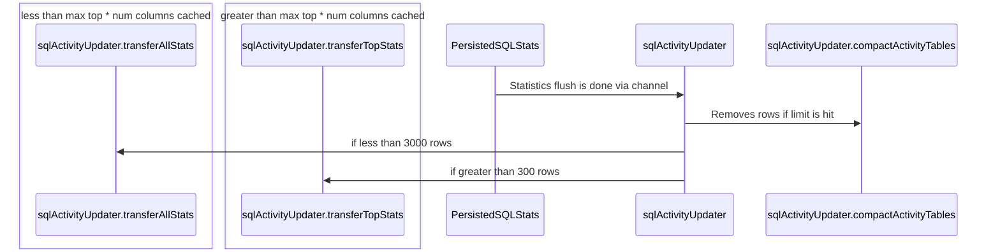

# The observability layer in CockroachDB

Last update: May 2023

This document provides an architectural overview of the observability layer in
CockroachDB. 

Original author: j82w

## Overview of tables for SQL Activity page

### crdb_internal statistics table
- [crdb_internal.cluster_statement_statistics](https://github.com/cockroachdb/cockroach/blob/e0c35b4b4388ec4efc1711815f8b666e0d148d8c/pkg/sql/crdb_internal.go#LL6254C1-L6254C56)
- [crdb_internal.cluster_transaction_statistics](https://github.com/cockroachdb/cockroach/blob/e0c35b4b4388ec4efc1711815f8b666e0d148d8c/pkg/sql/crdb_internal.go#L6658)

1. Contains the in memory statistics that have not been flushed to the system statistics tables
1. Expensive operation
   1. GRPC fan-out to all nodes. 
   1. Filters are not pushed down. All the rows are returned to gateway node, a virtual table is created, and then filters are applied.

### Statistics tables
- system.statement_statistics [PRIMARY KEY (aggregated_ts, fingerprint_id, transaction_fingerprint_id, plan_hash, app_name, node_id)
  USING HASH WITH (bucket_count=8)](https://github.com/cockroachdb/cockroach/blob/8f10f78aed7606edd454e886183bf22c74a3153e/pkg/sql/catalog/systemschema/system.go#LL552C26-L553C39)
- system.transaction_statistics [PRIMARY KEY (aggregated_ts, fingerprint_id, app_name, node_id)](https://github.com/cockroachdb/cockroach/blob/8f10f78aed7606edd454e886183bf22c74a3153e/pkg/sql/catalog/systemschema/system.go#LL606C26-L606C88)
  
1. Each node has background [go routine](https://github.com/cockroachdb/cockroach/blob/8f10f78aed7606edd454e886183bf22c74a3153e/pkg/sql/sqlstats/persistedsqlstats/provider.go#L115) that collects stats and [writes](https://github.com/cockroachdb/cockroach/blob/master/pkg/sql/sqlstats/persistedsqlstats/flush.go) it to statistics table every 10 minutes.
1. Statistics tables are aggregated by 1 hour and there is a row per a node to avoid contention.
1. Separate [SQL compaction job](https://github.com/cockroachdb/cockroach/blob/master/pkg/sql/sqlstats/persistedsqlstats/compaction_scheduling.go) runs to delete the rows when table grows above the default [1 million rows](https://github.com/celiala/cockroach/blob/6cdaf96d8ec6eb7636551a9f1ea7fc06d80e5f1d/pkg/sql/sqlstats/persistedsqlstats/cluster_settings.go#L57).

### Activity tables 
- system.statement_activity [PRIMARY KEY (aggregated_ts, fingerprint_id, transaction_fingerprint_id, plan_hash, app_name)](https://github.com/cockroachdb/cockroach/blob/8f10f78aed7606edd454e886183bf22c74a3153e/pkg/sql/catalog/systemschema/system.go#L654)
- system.transaction_activity [PRIMARY KEY (aggregated_ts, fingerprint_id, app_name)](https://github.com/cockroachdb/cockroach/blob/8f10f78aed7606edd454e886183bf22c74a3153e/pkg/sql/catalog/systemschema/system.go#LL701C26-L701C80)

1. Created to improve the performance of the ui pages. 
   1. UI groups by fingerprint. Have to aggregate all the rows from based on node id.
   1. Users focus on top queries. Computing top queries is expensive and slow.
1. Activity tables have top 500 based on 6 different properties. 
   1. Limited to 6 properties because there is currently 19 properties total. Calculating and storing all 19 properties is to expensive.
1. Activity tables are updated via the [sql_activity_update_job](https://github.com/cockroachdb/cockroach/blob/master/pkg/sql/sql_activity_update_job.go)
   1. Job coordinates running it on a single node.
   1. Provide fault tolerance if a node fails.
1. Activity update job is triggered when the local node [statistics flush is done](https://github.com/cockroachdb/cockroach/blob/8f10f78aed7606edd454e886183bf22c74a3153e/pkg/sql/sql_activity_update_job.go#L99).
   1. This guarantees no contention with the local node flush which has the overhead of doing the activity update job. Other nodes can have contention with activity update job.
1. Activity table does not have node id as a primary key which aligns with UI and reduces cardinality. 
1. Activity update job has 2 queries.
   1. Number of rows are less than max top * number of columns to cache.
      1. The [query](https://github.com/cockroachdb/cockroach/blob/e0c35b4b4388ec4efc1711815f8b666e0d148d8c/pkg/sql/sql_activity_update_job.go#L275) is a more efficient query by avoiding doing the top part of the query which is not necessary since we know there are less rows.
   1. Number of rows are greater than max top * number of columns to cache.
      1. The [query](https://github.com/cockroachdb/cockroach/blob/e0c35b4b4388ec4efc1711815f8b666e0d148d8c/pkg/sql/sql_activity_update_job.go#L432) has to do the necessary sort and limits to get the top of each column.

### Design version <= 22.2.9

1. UI would automatically call CockroachDB endpoint when users went to the page.
1. The gateway node sends the query to the system statistics table and in memory crdb_internal table.
1. The gateway node joins all the results and return all of them to frontend.
1. Frontend would auto-refresh the results, and do all the sorting in the browser.

### Design version >= 22.2.10 

1. User must specify which column to sort by and click the apple button for the UI to call the http endpoint on CockroachDB.
1. The gateway node sends the query to only the system statistics table. Avoiding the in memory join overhead.
1. The UI limit the results to the top 100 queries by default with max of 500.
1. User must do a manual refresh to get new results.

### Design version >= 23.1.0

1. User must specify which column to sort by and click the apple button for the UI to call the http endpoint on CockroachDB.
1. The gateway node sends the query to the system activity table. If no results are found it falls back to the system statistics table.
1. The UI limit the results to the top 100 queries by default with max of 500.
1. User must do a manual refresh to get new results.

### Performance improvements
The results below were calculated using a test cluster with 9 nodes and 100k-115k rows on our statistics tables, making a request to return the results for the past 1h.

| Version information    | Latency to load SQL Activity page |
|------------------------|-----------------------------|
| Before any change      | 1.7 minutes                 |
| Changes on 22.1 & 22.2 | 9.9 seconds                 |
| Changes on 23.1        | ~500ms                      |

The performance gains are from:
1. Avoiding the fan-out to all nodes.
1. Avoiding the virtual table which filters and limits do not get pushed down to.
1. Limiting the results to the top 100 by default.
1. In 23.1 using new activity table which caches the top 500 by the 6 most popular columns.
