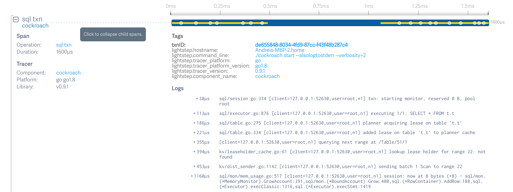
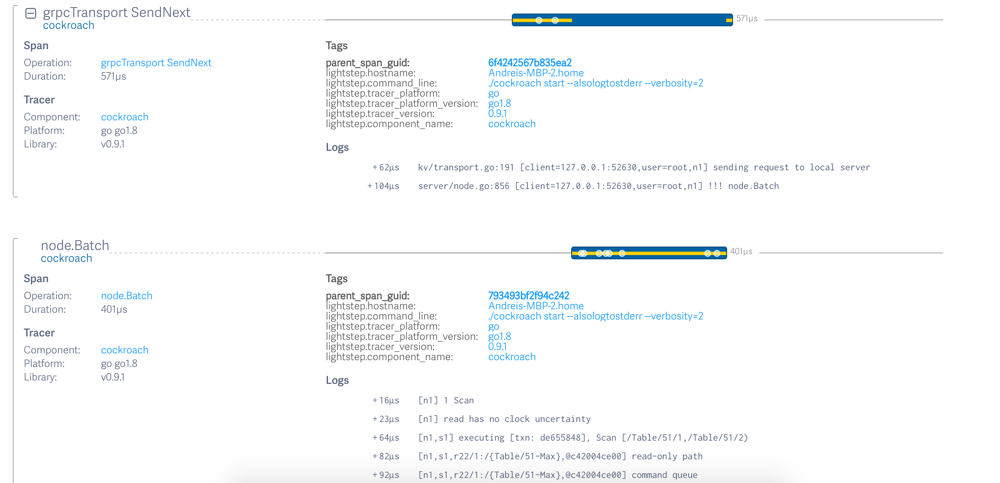

# context.Context and how it relates to logging and tracing in CockroachDB

Original author: Andrei Matei

## Introduction

You might have noticed that much of our codebase passes around
`context.Context` to functions all over the place. You can go a long
way without understanding exactly what the point is (until you can’t),
but that’s no way to live. You might have heard that we don’t like
`context.TODO()` or that “storing `Contexts` in structs is bad” and
you might be wondering what that’s about. This document is to serve as
an explanation of Context-related topics.

## What is a `context.Context` ?

`context.Context` is an interface defined in the `context` package of
Go’s standard library.

The package documentation says: *Package context defines the Context
type, which carries deadlines, cancelation signals, and other
request-scoped values across API boundaries and between processes.*

So, the idea is that a `Context` represents an *operation*’s context -
deadline, cancellation and values that we want to pass implicitly to
all the function calls executed on behalf of that operation (this last
use case may be achieved with thread-locals in other programming
languages). The `context` package does not attempt to define what an
operation is - that’s up to the programmer. Typical operations are
serving an RPC call, serving a SQL query, or periodic background
activities such as replica rebalancing. An important point is that
operations, and `Contexts` are supposed to be hierarchical - an
operation can have sub-operations which may inherit the parent’s
deadline/cancellation/values or may define their own; that’s why the
`context` package makes it easy to create *derived* (or *forked*)
`Contexts` - child `Contexts` inheriting and augmenting the
parent‘s properties.

This is the interface definition:

    // A Context carries a deadline, cancelation signal, and request-scoped values
    // across API boundaries. Its methods are safe for simultaneous use by multiple
    // goroutines.
    type Context interface {
        // Done returns a channel that is closed when this Context is canceled
        // or times out.
        Done() <-chan struct{}
    
        // Err indicates why this context was canceled, after the Done channel
        // is closed.
        Err() error
    
        // Deadline returns the time when this Context will be canceled, if any.
        Deadline() (deadline time.Time, ok bool)
    
        // Value returns the value associated with key or nil if none.
        Value(key interface{}) interface{}
    }

## Motivations for contexts in CockroachDB

At Cockroach Labs, we use `Contexts` extensively, as a result of
cascading pushes by different people for improving logging and tracing.

Logging is about keeping a global history of the activity on a node
or cluster; improvements there aim to make messages more
informative. Tracing is about keeping the cause-effect relationship
related to individual activities, e.g. individual client requests;
improvements there aim to increase the accuracy/usefulness of the
network of cause-effect relations tracked by individual traces.
**Go contexts enable CockroachDB to provide both services using a common interface.**

We like passing `Contexts` everywhere, thus
*informing each layer of the code about the context in which every
function is being executed*. The main benefits we get are that all our
log messages are prefixed with information about the component that’s
logging them, and that all the logging messages also become part of
the current operation’s trace.

### Contexts for logging

Let’s look at an example of a component’s information being part of
log messages. The following call:

    log.Infof(ctx, "request range lease (attempt #%d)", attempt)

results in the following message being output:

    I170312 15:02:30.732131 179 storage/replica.go:1046  [n1,s1,r1/1:/{Min-Table/0},@c420498a80] request range lease (attempt #1)

Notice how the prefix `[n1,s1,r1/1:/{Min-Table/0},@c420498a80]` is not
part of the logging command. It’s just prepended auto-magically
through the `ctx` argument that’s passed to the logging method - the
`ctx` had been populated with values describing the replica executing
the operation that lead to the range lease acquisition (node 1, store
1, range 1 / replica 1, covering keys *Min→Table/0*). This annotation
happens because, at the point where an operation entered the replica
code module, we forked a child context containing all these
annotations and used that child context for all downstream
code. Everything logged in the replica module and downstream of it
will carry information about *which particular replica* the operation
is using. Isn’t that neat?

Let’s look at an example of log messages containing information specific to the current operation:

    I170312 15:17:12.602218 149 kv/dist_sender.go:1142  [client=127.0.0.1:52149,user=root,n1] sending batch 1 CPut, 1 BeginTxn, 1 EndTxn to range 22

Here we see information about the client (IP address and username)
performing the SQL statement that eventually lead to the `DistSender`
performing a `Batch` RPC call. This is achieved by having each user
SQL session create a context with these annotations and using it (and
children of it) for everything being executed on behalf of that
session at any level in the code (at least executed locally on the
session’s gateway node; see discussion below about distributed tracing
for how this relates to remote code execution).

### Contexts for tracing

Besides logging, *tracing* is also a big reason why we plumb contexts
everywhere. A *trace* is a structured view of (messages printed on
behalf of) an operation.

It contains **all the logging messages printed by code servicing that
operation**, plus timing information and information about the
sequential or parallel nature of the execution of sub-operations.

| **What gets emitted \ where it is visible**  | **Log files**        | **Trace visualisation** |
| -------------------------------------------- | -------------------- | ----------------------- |
| **log.Info, log.Warn, log.Error, log.Fatal** | ✓                    | ✓                       |
| **Log tags**                                 | ✓                    | ✓                       |
| **log.VEvent(ctx, N, …)**                    | *only if —vmodule=N+ | ✓                       |
| **Span boundaries**                          |                      | ✓                       |
| **Span hierarchy**                           |                      | ✓                       |

The logging messages are the same as the ones that make it to the
unstructured text log files that we discussed above - the messages
produced by calls to `log.{Info,Warning,Error,VEvent}f?`).

A trace consists of a tree of spans: each *span* represents a
sub-operation (except the root one) and can contain child spans. Spans
contain log messages and their timing information. When we “visualize
a trace”, we visualize the tree of spans that make up that trace, up
to the root span, and all their messages.

In the rest of this section we’ll talk about how to see tracing
information for CRDB operations and subsequently how the code around
tracing looks like.

Let’s look at a Lightstep trace of a SQL query (Lightstep is a
distributed trace collector and viewer; see section on tracing
below). Here’s the root span (trimmed):

We can see log messages coming from the sql module and the kv module:
the executor starts executing a `SELECT`, acquires a table lease,
looks up a range lease, sends a batch with a `Scan` request, and (way
later (*+1160us*), after receiving the results of the `Scan`) does
some memory accounting).

The blue part of the timeline that’s not covered by the yellow line
corresponds to time spent in child spans; let’s look at these spans
below:

We can see two spans, one child of the other, related to performing an
RPC. The `grpcTransport.SendNext` one corresponds to the client-side
of the call, and the `node.Batch` one corresponds to the
server-side. Through the magic of distributed tracing, the server
could be the same process as the client or a remote node - the trace
would look just the same! This is incredibly powerful - we can see log
messages from all layers of the code, executed locally or even
remotely, on behalf of a high-level operation that we define (e.g. in
this case, executing a user’s `SELECT` query). We can see what code
paths were taken, what caches were hit, what nodes were involved, how
long different sub-operations took.

Besides Lightstep, there are other ways to see “tracing
information”. Spans and their events also show up in the
`debug/requests` endpoint; as opposed to Lightstep which only receives
spans once they are finished, the `debug/requests` endpoint can be
used to look at spans that are “in progress”. The `debug/requests`
endpoint is implemented via `net/trace` using `netTraceIntegrator`
(this is called once whenever a span is created, and it returns an
object which receives span “events”).

Another way to see tracing information is through the `debug/events`
endpoint. This is also implemented via `net/trace` and it is used for
“top level” events that are not associated with a tracing span
(e.g. queue events, top-level SQL events). The tracing infrastructure
allows embedding a `trace.EventLog` in a `Context` ; events go to that
`EventLog` automatically unless a span is also embedded in the
context.

There’s also `SET TRACING = on` that enables verbose tracing for
collecting the distributed trace of one query and displaying it as SQL
result rows. In verbose tracing, the span picks up a number of messages
as it traverses the system, which are propagated back to the root span;
this is the mechanism used by session tracing to present the execution
trace back to the SQL client.

There’s also the
`COCKROACH_TRACE_SQL` env var, which causes the distributed traces
of all queries taking longer than a set time to be collected in memory
and then dumped into the
logs. This is expensive because it enables verbose tracing for all queries,
and may flood the logs. As of 03/2017, I (Andrei) am working on a new
mechanism allowing a user to enable/disable tracing on a SQL session
by issuing special SQL statements, and then making the collected
traces available through a virtual table.

All these tracing capabilities are enabled by the proliferation of
`Contexts`.

The mechanism for this is threefold:

- we use `Spans` from package `opentracing` which represent the notion
  of "current operation" in the application (e.g. a current client
  request, a method call, whatever) and bind them to a `Tracer` object
  which is able to receive events for that span (e.g. a trace
  collector).
- `Context` objects actually can carry a linked list of key/value pairs.
  we store `Span` objects in `Context` to represent the stacking/nesting
  of "current operations" in CockroachDB.
- Whenever a logging method is invoked, the logging module inspects
  the `Context` object from the head, check whether it contains a
  span, and if it does, extracts the first span from the `Context`,
  sends a copy of the log event to its tracer, before printing them to
  the log file.

### Creating traces programmatically

When thinking about how our operations should be traced, the first
decision we need to make is *what constitutes an* ***operation*** *for
the purposes of tracing*. See the section **What** ***operations***
**do we track in crdb? Where do we track traces and spans?** below for
a discussion about that.

Here’s how the code looks like:
The Executor creates a root span:

    // Create a root span for this SQL txn.
    tracer := e.cfg.AmbientCtx.Tracer
    sp = tracer.StartSpan("sql txn")
    // Put the new span in the context.
    ctx = opentracing.ContextWithSpan(ctx, sp)
    // sp needs to be Finish()ed by the state machine when this transaction 
    // is committed or rolled back.

The sub-operations create sub-spans and fork the `Context`:

    ctx, span := tracing.ChildSpan(ctx, "join reader")
    defer tracing.FinishSpan(span)

### Context cancellation

Contexts make distributed cancellation easy.
A context object has a broadcast "cancellation" channel which
client components can check to see if the work is still "useful".
For example a context for the worker of a network connection
will be canceled by `net.Conn` if the remote connection
is closed, and the worker can check that periodically and spontaneously
abort, instead of checking the error status of trying to send
data through the connection,

This is really cool for things like backup/restore or distSQL that
kick off a lot of work throughout the cluster.

Of note:

- a cancellable sub-context of a cancellable context means there is a
  goroutine spawn under you for propagating the parents cancellation,
  so it can be expensive.
- GRPC propagates cancel and deadline contexts across the wire. Deadline
  contexts are just copied and recreated on other side. The way cancelation
  works (for instance when a SQL statement timeout expires) is that after
  sending a message GRPC does a
  [select](https://github.com/cockroachdb/vendored/blob/ed53f102e86b51c228b61d3ad54f1428982fe75e/google.golang.org/grpc/internal/transport/transport.go#L178)
  on the response and also listens on the Done channel for the context passed it
  by the client. This in turn will close the GRPC stream which will send an
  [RST](https://datatracker.ietf.org/doc/html/rfc7540#section-6.4)
  message to the server which will cause the server side to be
  [canceled](https://github.com/cockroachdb/vendored/blob/ed53f102e86b51c228b61d3ad54f1428982fe75e/google.golang.org/grpc/internal/transport/http2_server.go#L1231).
  See also TestGRPCDeadlinePropagation and
  TestTenantStatementTimeoutAdmissionQueueCancelation for tests that rely on this
  behavior.

## Technical notes

### Integration between logging and `Contexts`

All the logging methods (`log.{Infof,VEventf,…}`) take a `Context` and
[extract the](https://github.com/cockroachdb/cockroach/blob/281777256787cef83e7b1a8485648010442ffe48/pkg/util/log/structured.go#L111)
[“log tags”](https://github.com/cockroachdb/cockroach/blob/281777256787cef83e7b1a8485648010442ffe48/pkg/util/log/structured.go#L111)
[from it](https://github.com/cockroachdb/cockroach/blob/281777256787cef83e7b1a8485648010442ffe48/pkg/util/log/structured.go#L111)
and prepend them to the messages. The *log tags* are the prefixes we
saw (e.g. `n1,s1,r1/1:/{Min-Table/0},@c420498a80`).

To add an operation-specific tag, use the `log.WithLogTag()` method
(e.g. `ctx = log.WithLogTag(ctx, "range-lookup", nil /* value */)`.

To add a component-specific tag (e.g. the node id or replica id), we
prefer a different pattern. These tags are specific to an instance of
an object used to perform part of an operation - e.g. a `replica`
instance. The same `replica` instance is used across many operations,
but it always wants to provide the same annotations. And different
instances want to provide different annotations. We use an
`AmbientContext` - a container for a bunch of tags that an operation’s
`Context` will be annotated with.

For example, a `replica` initializes its `AmbientContext`
[like so](https://github.com/cockroachdb/cockroach/blob/281777256787cef83e7b1a8485648010442ffe48/pkg/storage/replica.go#L576):

    // Add replica log tag - the value is rangeStr.String().
    r.AmbientContext.AddLogTag("r", &r.rangeStr)
    // Add replica pointer value.
    r.AmbientContext.AddLogTag("@", fmt.Sprintf("%x", unsafe.Pointer(r)))

And then all entry points into an instance use the `AmbientContext` to
annotate the operation’s context. For example, `replica.Send()`
[does](https://github.com/cockroachdb/cockroach/blob/281777256787cef83e7b1a8485648010442ffe48/pkg/storage/replica.go#L1416):

    func (r *Replica) Send(
            ctx context.Context, ba roachpb.BatchRequest,
    ) (*roachpb.BatchResponse, *roachpb.Error) {
            // Add the range log tag.
            ctx = r.AnnotateCtx(ctx)
            ...
      

We usually embed the `AmbientContext` in the objects that contain it
and we say, for example, that a `replica` *annotates* all the
`Contexts` that go into it.  For the history and evolution of the
`AmbientContext` interface, see Radu’s
[Enriching Log Messages Using Go Contexts](https://www.cockroachlabs.com/blog/enriching-log-messages-using-go-contexts/)
blog post.

### Integration between tracing and `Contexts` 

For tracing, we use the OpenTracing interface - an attempt to
standardize tracing interfaces in different languages such that
different *tracers* can be plugged in. A *tracer*
(`opentracing.Tracer`) is an interface to objects that know how to
create spans; tracers also contain or interface with *collectors* -
components that collect traces and allows users to inspect them.

CockroachDB currently contains the LightStep tracer (a collector
developed by the people behind OpenTracing that sends traces to the
LightStep cloud service). Clients that want to use this need to have a
LightStep account (which is not free), and be willing to have their
traces sent to this 3rd party, cloud service. The collector can be
enabled with the `COCKROACH_LIGHTSTEP_TOKEN=<project-specific token>`
env var.

Besides LightStep, CockroachDB also has its own tracer which, together
with custom code around our RPC boundaries, enables marshalling spans
from an RPC server to the RPC client by serializing them in the gRPC
response protos. This mechanism enables session tracing and all the
other trace collection features.

If the Lightstep integration is enabled, crdb uses both the Lightstep
and the internal tracers simultaneously - through a
`[TeeTracer](https://github.com/cockroachdb/cockroach/blob/281777256787cef83e7b1a8485648010442ffe48/pkg/util/tracing/tee_tracer.go#L28)`.

As we’ve seen, all log messages also go to the current distributed
trace (if any). The logging code [passes messages to the
tracer](https://github.com/cockroachdb/cockroach/blob/281777256787cef83e7b1a8485648010442ffe48/pkg/util/log/trace.go#L132),
through the OpenTracing interface. The connection with that interface
is a `Span` which is passed around - you’ve guessed it - in the
`Context`. The logging code [extracts
it](https://github.com/cockroachdb/cockroach/blob/281777256787cef83e7b1a8485648010442ffe48/pkg/util/log/trace.go#L110)
from there.

### What operations do we track in crdb? Where do we track traces and spans?

We define operations at multiple levels in crdb for tracing and
logging. These different levels correspond to different
`Contexts`. For example, the whole of a user’s SQL session uses the
same top-level `Context`, for the benefit of sharing those client
logging tags (`client=127.0.0.1:52149,user=root`), and for appearing
in `/debug/events` as a single trace (for `net.trace`‘s definition of
a trace). The integration with `/debug/events` is done by putting a
`[trace.EventLog](https://github.com/cockroachdb/cockroach/blob/e05f9ec8e47922c3ffb20570883da17544566953/pkg/sql/session.go#L199)`
[in the
session’s](https://github.com/cockroachdb/cockroach/blob/e05f9ec8e47922c3ffb20570883da17544566953/pkg/sql/session.go#L199)
`[Context](https://github.com/cockroachdb/cockroach/blob/e05f9ec8e47922c3ffb20570883da17544566953/pkg/sql/session.go#L199)`. (FIXME:
explain what this does. Radu says: “The most important usecase for
debug/events is finding an operation that is stuck (you can’t see
those in lightstep). All net/trace does is take events and present
them in those debug/ HTTP endpoints.”)

When talking about tracing, you generally want operations to make
sense from a user’s perspective, as ultimately we hope users will make
use of this info - e.g. a SQL query is a good candidate; an internal
operation like acquiring some lease would not make sense to a user in
isolation. There are some technical considerations too: a trace should
not be too long-lived, as it generally only becomes visible when it’s
done. Individual spans (sub-operations) should also not be too long or
contain too many log messages, as messages pertaining to a span are
buffered in memory until the span is closed. Also, spans cannot be
used after they’re closed, so each span needs to clearly outlive all
the work that’s supposed to be done inside it (which can get tricky
when that work spawns goroutines which inherit the `Context` and don’t
have very clear termination points - e.g. the `DistSender` trying to
issue overlapping RPCs to multiple replicas). Another thing to keep in
mind is that spans are only collected once they are `Finish()`ed.

At the moment, for SQL processing, an operation is a SQL
transaction. This allows us to produce traces that include automatic
transaction retries. So, a SQL session would have been too long and a
SQL statement too short. Sub-operations may be acquiring a lease,
resolving a key to a range, or all the work done by individual DistSQL
processors. So, we create a *root span* for each SQL transaction (so,
with a larger lifetime than long-lived SQL session). This is done by
the sql
`[Executor](https://github.com/cockroachdb/cockroach/blob/281777256787cef83e7b1a8485648010442ffe48/pkg/sql/session.go#L326)`. This
means that the highest level grouping that we’ll see in LightStep for
SQL operations is a SQL transaction.

[ Side note: "is this a wise choice?"  Things like data collection of
SQL result sets can span multiple transactions. Don’t we want instead
to span over a batch of SQL code received by a single message in
pgwire? The reason why we do it is that it is useful to see retries in
a single trace, so we do it at the txn level. It hasn’t been a problem
yet… When you’re using Lightstep for collection (or also the net.trace
integrations), you’re relying on it to be fast and asynchronous and
maybe drop log messages when too many have been accumulated.  When we
talk about other trace collection mechanisms (e.g. session tracing),
we’re assuming that the user is going to be judicious about not
tracing operations that are too massive. ]

Within a SQL transaction, there are many sub-operations. At the time
of this writing, we’re a little shy about opening child spans. We only
do it in `grpcTransport` when we’re [about to
perform](https://github.com/cockroachdb/cockroach/blob/281777256787cef83e7b1a8485648010442ffe48/pkg/kv/transport.go#L173)
an RPC and on the [server side of the
RPC](https://github.com/cockroachdb/cockroach/blob/281777256787cef83e7b1a8485648010442ffe48/pkg/server/node.go#L883)
(the situation is better in DistSQL, where we also perform more
asynchronous actions, so separating logs into different spans becomes
more important).

Our `Contexts` get derived a lot more for logging and cancellation
purposes than for tracing spans. Every layer that has an
`AmbientContext` (e.g. node/store/replica) technically creates a child
`Context` , but we don’t necessarily think of these as representing
logical “sub-operations” - we’re simply trying to put more information
in the following log messages. In other cases, we do explicitly for a
`Context` to identify a sub-operation. For example, the
`rangeDescriptorCache` identifies a sub-operation worthy of having a
log tag:

    ctx = log.WithLogTag(ctx, "range-lookup", nil)
    descs, prefetched, pErr := rdc.db.RangeLookup(ctx, metadataKey, desc, useReverseScan)

In cases like this, we should probably also be creating a child span,
so that opentracing also displays the range lookup more prominently as
a logically separate operation.

## FAQs

**What’s wrong with storing a** `**Context**` **in a struct?**

A couple of campaigns have been fought for removing `Context` struct
members, and instead switching to explicitly plumbing a `ctx Context`
as an argument to function calls.

Generally speaking, we don’t like storing a `Context` in a struct
because it tends to not represent accurately the intention of the
programmer. `Contexts` are always tied to operations, where object
instances are generally not.

Depending on who you ask, there are some exceptions and shades of gray:

1. Some structs are just “bags or arguments” for some method
   calls. This is a good pattern - if a method or group of methods has 30
   arguments, you probably want to combine them in a struct. For example,
   `[EvalContext](https://github.com/cockroachdb/cockroach/blob/e05f9ec/pkg/sql/parser/eval.go#L1605)`
   is
   such a struct and it contains a `Context`. These structs don’t have
   any lifetime - they just exist for one method call. And the `Context`
   is not a special argument in this regard; it can stay in the struct
   like everything else.

2. Some structs are supposed to have all their code be executed
   concurrently with the instantiator and the callers of the different
   methods. You create them and spawn some goroutine that calls some
   method representing an event loop, and separately other components
   communicate with the instance either by sending things on channels or
   by calling methods on it. You may want all methods invoked on an
   instance to be considered as running on behalf of the instantiator’s
   operation (or, rather, you probably want everything about that
   instance to be considered a sub-operation). For example, DistSQL
   processors get scheduled on behalf of a SQL query, live for the
   duration of that query, run concurrently with other processors and
   communicate with them by method calls. These processors save a
   `Context` as part of their initialization and use it throughout this
   lifetime.

   I guess the key here is that the lifetime of these processors is very clearly dictated by a rigid execution model.
   
3. Some operations have lifetimes that don’t map in a very obvious way
   to a stack frame. For example, if we consider a SQL transaction an
   operation (technically, a sub-operation of a SQL session operation),
   that transaction lives across potentially many interactions between
   the server and the SQL client, and in fact may end in the middle of
   one of these interaction (if a txn is ended in the middle of a batch
   of statements). In this case, the current context is logically part of
   the session’s state machine, and so we do store it in the session’s
   state.

4. … 47 others

The rule of thumb is:

- if some state struct is clearly and unambiguously tied to the
  operation that the context is attached to, then it is safe to have
  the context stored in the struct; however
- when any refactoring/extension cause any of the following to happen,
  the context should probably get out of the struct ASAP:
 
  - **The struct’s lifetime becomes decoupled from the operation**,
    e.g. it is reused across multiple logical operations or there
    can be logical state changes while the struct is alive — then
    the **conceptual encapsulation doesn’t hold any more** and the
    programmer must then start to think when the context in the
    struct must be updated
  
  - **Some API using this struct also takes a context as explicit
    argument** (e.g. because it needs to implement some interface) —
    we generally want to **avoid having to decide** whether to use
    the context given as argument or the context in the struct.
  
  - **The operation is divided in sub-operations via spans** for the
    purpose of logging/tracing — this is actually a combination of
    both points above.

To avoid thinking about this altogether, we generally suggest that
`Contexts` live on some stack frame whose duration is the same as the
operation we’re interested in, and we want it to be passed explicitly
as function arguments from that point downwards.

### What about background operations?

Besides interactive request-response processing that our servers do
(e.g. for SQL processing), there’s also background work that happens
periodically. For example, our queues do periodic processing. The
queues have an `AmbientContext` that they use to annotate
`context.Background()` in their main loop (generally inside a
`stopper.RunWorker()`).

It’s important to not put a tracing span in this context, since the
trace would be very long lived and all the messages going to this span
would be buffered in memory. Moreover, since a span is only collected
when it’s closed, we might never collect all these messages if the
server doesn’t shutdown cleanly. Of course, spans can be added to
derived contexts for more specific, shorter sub-operations -
e.g. rebalancing a particular range.

We may add a `/net/trace` in these contexts, since Go’s `debug/events`
endpoint is meant for long-running operations. For some reason, we
seem to have stopped doing that for our queues.

### What’s `context.Background()`? What’s `context.TODO()` and what do I do when I see one?

As we’ve seen, `Contexts` are hierarchical, which means there has
to be a root `Context`. There are, in fact, two roots provided by the
`context` package - `context.Background()`and
`context.TODO()`. These are empty `Contexts` - no values, deadline
or cancellation.

We want to use `context.Background()` as the root for most of our
other `Contexts` - operation contexts should be derived from it,
background work contexts should be derived from it.

`context.TODO()` is technically equivalent, except we (and Go
itself) use it to mark places where a proper `Context` has not yet
been plumbed to. So when you see this guy, it means that someone was
lazy when `Context-ifying` some code module and didn’t plumb a
proper operation context. We don’t want to use this for new non-test
code.

In tests we do use `context.TODO()` for the tests’ operations. We
also sometimes use `context.Background()`; no pattern has emerged
yet. Ideally each test would create one (or more) `Contexts`
annotated with the test’s name and perhaps a span. But there
currently is little benefit in doing that. I (Andrei) had a WIP a
while ago for collecting traces from tests and dumping them into a
file that can then be read and displayed by AppDash. (FIXME(andrei)
add link) It was really cool but I didn’t clean it up. If we’d do
this, then using proper `Contexts` in tests would be beneficial.

FIXME: integrate side note: “Nathan: I just opened
https://github.com/cockroachdb/cockroach/pull/14128 to address this
first point. We should be using context.Background in tests, never
context.TODO. Andrei: well it’s not technically Background() work. In
fact, you can argue that Background() would be even worse, at it’d
combine the test’s operations with background server activity.”

## Alternatives

An alternative to passing a `Context` around to most functions in the
codebase that has been suggested is adding some type of thread-local
storage to the goroutines. This would involve augmenting the runtime
(which can be done by modifying the goroutine struct inside the Go
sources and adding an accessor method in the runtime library for
applications to use), or getting access to a goroutine id and
maintaining a map in userspace from id → storage. A possible advantage
would be less typing and less runtime overhead (from copying the
`Context` on all the stack frames). These ideas have not gained much
traction for several reasons:

1. they’d involve some “magic” that is not yet vetted by the Go team
2. we’d need to maintain some non-standard Go stuff
3. `Context` are becoming more and more universal in the Go ecosystem
   - e.g. our dependencies and the std lib. Doing something different in
   CockroachDB might make interfacing with external code harder. (FIXME:
   clarify/strengthen argument)
4. avoiding hidden state. When a context is passed through as an arg,
   it’s usually easy to trace where a problematic context is coming
   from. With goroutine-local-storage, the context is the result of
   whichever code last set it; it may be much harder to figure out
   which code that is.
5. the alternative solution is not trivial when a function needs to
   set up a “child” context for another function it calls - we would need
   some infrastructure to save the current context on stack and restore
   it before the function returns. Forgetting to restore it could lead to
   hard-to-debug issues.
6. there are open questions about what to do when spawning a
   goroutine. Simply inheriting the context is problematic when contexts
   contain spans - the lifetime of the span is usually up to the initial
   goroutine (which `Finish()`es the span), so (in general) two
   goroutines can’t share the same span. That’s why we have things like
   `RunAsyncTask/ForkCtxSpan`. It’s not clear either what do we do with
   goroutines that, in their lifetime, service many different
   “operations.”

## Future directions

We’d also like to embed a graphical viewer of distributed traces in
CockroachDB - one such open-source one is AppDash.

