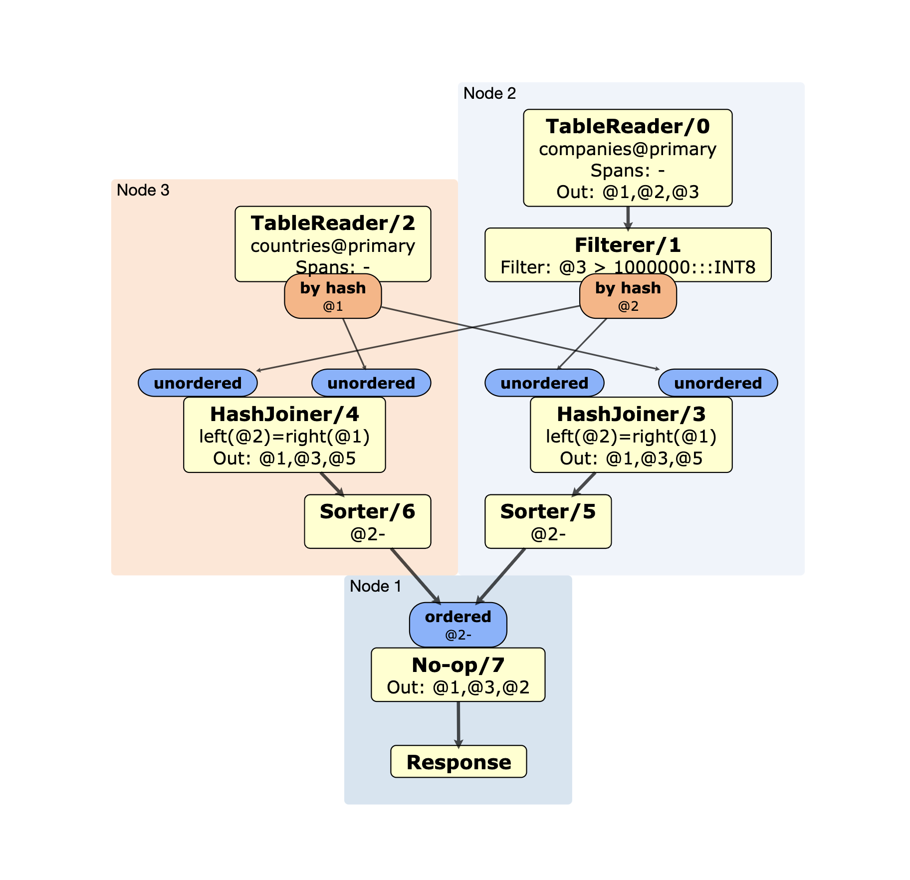

# Life of a SQL Query

Original author: Andrei Matei (updated June 2021)

## Introduction

This document aims to explain the execution of a SQL query in CockroachDB,
following the code paths through the various layers of the system: network
protocol, SQL session management, query parsing, planning and optimization,
execution, key/value service, transaction management, request routing, request
processing, Raft consensus, on-disk storage engine, etc. The idea is to provide
a high-level unifying view of the structure of the various components; none will
be explored in particular depth but pointers to other documentation will be
provided where such documentation exists. Code pointers will abound.

This document will generally not discuss design decisions, but rather focus on
tracing through the actual (current) code. In the interest of brevity, it only
covers the most significant and common parts of query execution, and omits a
large amount of detail and special cases.

The intended audience is folks curious about a walk through the architecture of
a modern database, presented differently than in a [design
doc](https://github.com/cockroachdb/cockroach/blob/master/docs/design.md). It
will hopefully also be helpful for open source contributors and new Cockroach
Labs engineers.

## PostgreSQL Client Protocol

A SQL query arrives at the server through the [PostgreSQL wire
protocol](https://www.postgresql.org/docs/current/protocol.html). CockroachDB
uses this protocol for compatibility with existing client drivers and
applications, implemented by the [`pgwire`
package](https://github.com/cockroachdb/cockroach/tree/9c86c8f937e3c5d4728079d2bdb2a98943a7d872/pkg/sql/pgwire).

Once a client
[connects](https://github.com/cockroachdb/cockroach/blob/4e4f31a0ed1a8ea985b9ab6f72e29266b259900e/pkg/server/server.go#L2250),
it is represented by a
[`pgwire.conn`](https://github.com/cockroachdb/cockroach/blob/89621764d4c2d438d1781238f10e9ef27ef2c392/pkg/sql/pgwire/conn.go#L55)
struct, which wraps a [`net.Conn`](https://golang.org/pkg/net/#Conn) interface
(Go's network sockets).
[`conn.serveImpl`](https://github.com/cockroachdb/cockroach/blob/89621764d4c2d438d1781238f10e9ef27ef2c392/pkg/sql/pgwire/conn.go#L211)
implements the main "read, parse, execute" loop. The protocol is
message-oriented: for the lifetime of the connection, we
[read](https://github.com/cockroachdb/cockroach/blob/9c86c8f937e3c5d4728079d2bdb2a98943a7d872/pkg/sql/pgwire/conn.go#L330)
a message (usually representing one or more SQL statements),
[parse](https://github.com/cockroachdb/cockroach/blob/9c86c8f937e3c5d4728079d2bdb2a98943a7d872/pkg/sql/pgwire/conn.go#L737)
the queries, [pass
them](https://github.com/cockroachdb/cockroach/blob/9c86c8f937e3c5d4728079d2bdb2a98943a7d872/pkg/sql/pgwire/conn.go#L779)
to `connExecutor` for execution, [serialize and
buffer](https://github.com/cockroachdb/cockroach/blob/9c86c8f937e3c5d4728079d2bdb2a98943a7d872/pkg/sql/pgwire/conn.go#L1229)
the results, and
[send](https://github.com/cockroachdb/cockroach/blob/89621764d4c2d438d1781238f10e9ef27ef2c392/pkg/sql/pgwire/conn.go#L1451)
a result message to the client.

## SQL Processing

CockroachDB's SQL engine sits between the client connection and the core
key/value service, translating SQL queries into key/value operations. It
broadly goes through the following stages:

Parsing → Logical Planning → Optimization → Physical Planning → Vectorized Execution

### Parsing

Parsing transforms the original SQL statement, represented as a `string`, into
an [Abstract Syntax Tree](https://en.wikipedia.org/wiki/Abstract_syntax_tree)
(AST) that is easier to work with. CockroachDB uses an
[LALR parser](https://en.wikipedia.org/wiki/LALR_parser) that is
[generated](https://github.com/cockroachdb/cockroach/blob/60916fb31b1bb0562d1707a338aad536e4713744/Makefile#L1506-L1507)
by `go-yacc` from a Yacc-like [grammar file](https://github.com/cockroachdb/cockroach/blob/d96babaa3d484d4df156293010f922bd3fb2d970/pkg/sql/parser/sql.y).
This file specifies CockroachDB's SQL dialect, and was originally copied from
PostgreSQL and then modified.

As we've already seen, `pgwire.conn` [parses](https://github.com/cockroachdb/cockroach/blob/9c86c8f937e3c5d4728079d2bdb2a98943a7d872/pkg/sql/pgwire/conn.go#L737)
client statements using a [`parser.Parser`](https://github.com/cockroachdb/cockroach/blob/31dcbfc964f22ede5b7f827f4e6c0091ccfb132f/pkg/sql/parser/parse.go#L81) instance.
The parser begins by [scanning](https://github.com/cockroachdb/cockroach/blob/31dcbfc964f22ede5b7f827f4e6c0091ccfb132f/pkg/sql/parser/parse.go#L167)
the string into tokens -- individual pieces such as a
[string](https://github.com/cockroachdb/cockroach/blob/231953322e558dada2ae75c1b49771eee544aba2/pkg/sql/parser/scan.go#L133-L135)
or [number](https://github.com/cockroachdb/cockroach/blob/231953322e558dada2ae75c1b49771eee544aba2/pkg/sql/parser/scan.go#L389-L392).
It does this [one by one](https://github.com/cockroachdb/cockroach/blob/31dcbfc964f22ede5b7f827f4e6c0091ccfb132f/pkg/sql/parser/parse.go#L153)
until it [reaches a semicolon](https://github.com/cockroachdb/cockroach/blob/31dcbfc964f22ede5b7f827f4e6c0091ccfb132f/pkg/sql/parser/parse.go#L154)
which terminates the statement. These tokens are then
[lexed](https://github.com/cockroachdb/cockroach/blob/31dcbfc964f22ede5b7f827f4e6c0091ccfb132f/pkg/sql/parser/parse.go#L186)
for some simple post-processing, and the lexer is
[passed](https://github.com/cockroachdb/cockroach/blob/31dcbfc964f22ede5b7f827f4e6c0091ccfb132f/pkg/sql/parser/parse.go#L188)
to the generated parser which iterates over the tokens and applies the SQL
grammar to them.

The result of this process is a [`parser.Statement`](https://github.com/cockroachdb/cockroach/blob/31dcbfc964f22ede5b7f827f4e6c0091ccfb132f/pkg/sql/parser/parse.go#L35),
which [wraps](https://github.com/cockroachdb/cockroach/blob/31dcbfc964f22ede5b7f827f4e6c0091ccfb132f/pkg/sql/parser/parse.go#L37)
an AST [`tree.Statement`](https://github.com/cockroachdb/cockroach/blob/6349791f060743b515c7638b81ab3de2ee7bc0c4/pkg/sql/sem/tree/stmt.go#L86),
a tree structure that models the SQL syntax. For example,
[`tree.SelectClause`](https://github.com/cockroachdb/cockroach/blob/8b14ea8b7109d61ef9ba3a099a24468ae8367be5/pkg/sql/sem/tree/select.go#L78-L79)
models the familiar `SELECT` clause, with recognizable parts such as `From` and
`Where`. Parts of the AST may also contain
[`tree.Expr`](https://github.com/cockroachdb/cockroach/blob/31dcbfc964f22ede5b7f827f4e6c0091ccfb132f/pkg/sql/sem/tree/expr.go#L27),
nested algebraic expressions such as `tax / total * 100` that can be
recursively evaluated.

Note that the AST only represents the _syntax_ of the query, and says nothing
about how, or even if, it can be executed -- for example, it has no idea whether
a table exists or what datatype a column has. Figuring that out is the job of
the planner.

### Session Management

Once `pgwire.conn` has parsed the statement, it's placed in a `sql.ExecStmt`
command and [pushed](https://github.com/cockroachdb/cockroach/blob/9c86c8f937e3c5d4728079d2bdb2a98943a7d872/pkg/sql/pgwire/conn.go#L744) into a
[statement buffer](https://github.com/cockroachdb/cockroach/blob/9c86c8f937e3c5d4728079d2bdb2a98943a7d872/pkg/sql/conn_io.go#L89).
On the other side of this buffer is a [`sql.connExecutor`](https://github.com/cockroachdb/cockroach/blob/31db44da69bf21e67ebbef6fbb8c8bfb2e498efe/pkg/sql/conn_executor.go#L988)
which was created during [connection setup](https://github.com/cockroachdb/cockroach/blob/9c86c8f937e3c5d4728079d2bdb2a98943a7d872/pkg/sql/pgwire/conn.go#L655-L656).
It [processes](https://github.com/cockroachdb/cockroach/blob/31db44da69bf21e67ebbef6fbb8c8bfb2e498efe/pkg/sql/conn_executor.go#L1502)
the commands in the statement buffer by repeatedly calling
[`execCmd()`](https://github.com/cockroachdb/cockroach/blob/31db44da69bf21e67ebbef6fbb8c8bfb2e498efe/pkg/sql/conn_executor.go#L1525)
and [executes](https://github.com/cockroachdb/cockroach/blob/31db44da69bf21e67ebbef6fbb8c8bfb2e498efe/pkg/sql/conn_executor.go#L1578)
any statements (not all commands are statements).

As [`execStmt()`](https://github.com/cockroachdb/cockroach/blob/fc67a0c9202af348e919afc1e1f70acc9a83b300/pkg/sql/conn_executor_exec.go#L69)
executes statements, it records various
[session data](https://github.com/cockroachdb/cockroach/blob/31db44da69bf21e67ebbef6fbb8c8bfb2e498efe/pkg/sql/conn_executor.go#L1167)
such as the current database and user-defined settings,
and [implements](https://github.com/cockroachdb/cockroach/blob/fc67a0c9202af348e919afc1e1f70acc9a83b300/pkg/sql/conn_executor_exec.go#L101)
a [finite state machine](https://en.wikipedia.org/wiki/Finite-state_machine)
to track the [transaction state](https://github.com/cockroachdb/cockroach/blob/31db44da69bf21e67ebbef6fbb8c8bfb2e498efe/pkg/sql/conn_executor.go#L1027):
did a transaction just begin or end, or did we encounter an error?

Simple statements are primarily handled here. For example, a
[`BEGIN` statement](https://github.com/cockroachdb/cockroach/blob/fc67a0c9202af348e919afc1e1f70acc9a83b300/pkg/sql/conn_executor_exec.go#L1152)
will cause it to [open](https://github.com/cockroachdb/cockroach/blob/af9e6460c83a812ac320d3329f4c55a9b94367a1/pkg/sql/txn_state.go#L190)
a new [`kv.Txn` transaction](https://github.com/cockroachdb/cockroach/blob/4e4f31a0ed1a8ea985b9ab6f72e29266b259900e/pkg/kv/txn.go#L46)
in the key/value service (which we'll get back to later), and a
[`COMMIT` statement](https://github.com/cockroachdb/cockroach/blob/fc67a0c9202af348e919afc1e1f70acc9a83b300/pkg/sql/conn_executor_exec.go#L467-L470)
will [commit](https://github.com/cockroachdb/cockroach/blob/fc67a0c9202af348e919afc1e1f70acc9a83b300/pkg/sql/conn_executor_exec.go#L776)
that transaction. Query execution will use this transaction to dispatch
key/value requests. If a query runs outside of a transaction, it will
use an [implicit transaction](https://github.com/cockroachdb/cockroach/blob/fc67a0c9202af348e919afc1e1f70acc9a83b300/pkg/sql/conn_executor_exec.go#L1183).
`execStmt()` has a few layers below it dealing with the various states a SQL
transaction can be in:
([open](https://github.com/cockroachdb/cockroach/blob/fc67a0c9202af348e919afc1e1f70acc9a83b300/pkg/sql/conn_executor_exec.go#L244),
[aborted](https://github.com/cockroachdb/cockroach/blob/fc67a0c9202af348e919afc1e1f70acc9a83b300/pkg/sql/conn_executor_exec.go#L1198),
[waiting for retry](https://github.com/cockroachdb/cockroach/blob/fc67a0c9202af348e919afc1e1f70acc9a83b300/pkg/sql/conn_executor_exec.go#L1252),
or [none](https://github.com/cockroachdb/cockroach/blob/fc67a0c9202af348e919afc1e1f70acc9a83b300/pkg/sql/conn_executor_exec.go#L1148).

### Statement Execution

Now that we have figured out what (KV) transaction we're running inside of, we
are concerned with executing statements one at a time.

There is an impedance mismatch when interfacing SQL `connExecutor` code,
which is stream-oriented (with statements being executed one at a time
possibly within the scope of a SQL transaction), and CockroachDB's
key/value (KV) interface, which is request-oriented (with transactions
explicitly attached to every request).

To hint at the complications: it is
[sometimes necessary](https://www.cockroachlabs.com/docs/stable/transactions.html#transaction-retries)
to retry statements in CockroachDB, usually because of serializability
violations and data contention. A single SQL statement executed outside of a SQL
transaction (i.e. an "implicit transaction") can safely be retried
automatically. However, in a SQL transaction spanning multiple client requests
it is not sufficient to retry one of the statements - we have to retry all the
statements in the transaction, because some of them may be conditional on the
client's logic (i.e. different results for a `SELECT` might trigger different
subsequent statements). In this case, we bubble up a
[retryable error to the client](https://www.cockroachlabs.com/docs/stable/transactions.html#client-side-intervention).

`connExecutor` serves as a coordinator between different components during
SQL statement execution. This primarily happens in
[`execStmtInOpenState()`](https://github.com/cockroachdb/cockroach/blob/fc67a0c9202af348e919afc1e1f70acc9a83b300/pkg/sql/conn_executor_exec.go#L244),
which dispatches to the execution engine in
[`dispatchToExecutionEngine()`](https://github.com/cockroachdb/cockroach/blob/fc67a0c9202af348e919afc1e1f70acc9a83b300/pkg/sql/conn_executor_exec.go#L806).
During this process, it
[builds and optimizes](https://github.com/cockroachdb/cockroach/blob/fc67a0c9202af348e919afc1e1f70acc9a83b300/pkg/sql/conn_executor_exec.go#L831)
a logical plan, then [builds and executes](https://github.com/cockroachdb/cockroach/blob/fc67a0c9202af348e919afc1e1f70acc9a83b300/pkg/sql/conn_executor_exec.go#L925-L927)
a physical plan. Once executed, the statement
[result](https://github.com/cockroachdb/cockroach/blob/31db44da69bf21e67ebbef6fbb8c8bfb2e498efe/pkg/sql/conn_executor.go#L1565)
is returned to the client via a
[`ClientComm`](https://github.com/cockroachdb/cockroach/blob/9c86c8f937e3c5d4728079d2bdb2a98943a7d872/pkg/sql/conn_io.go#L576`).

### Logical Planning and Optimization

We're now getting to the heart of the SQL engine. Query planning is the process
of converting the SQL query AST into a tree of
[relational algebra operators](https://en.wikipedia.org/wiki/Relational_algebra)
that will produce the desired result. There can be a large number of
functionally equivalent plans for a given query, with very different performance
characteristics, and the optimizer will try to figure out the most efficient
plan. Query planning is a complex topic that could easily fill several articles
of its own, so we won't go into any depth here -- see the
[`opt` package documentation](https://github.com/cockroachdb/cockroach/blob/c097a16427f65e9070991f062716d222ea5903fe/pkg/sql/opt/doc.go)
for further details.

The query plan for a SQL statement can be inspected via `EXPLAIN`. Let's
have a look at a concrete example:

```sql
root@:26257> CREATE TABLE countries (id STRING PRIMARY KEY, name STRING);
root@:26257> INSERT INTO countries VALUES
    ('us', 'United States'), ('cn', 'China'), ('de', 'Germany');
root@:26257> CREATE TABLE companies (
    name STRING,
    country STRING REFERENCES countries(id),
    employees INT
);
root@:26257> INSERT INTO companies VALUES
    ('McDonalds', 'us', 1.9e6),
    ('Apple', 'us', 0.15e6),
    ('State Grid', 'cn', 1.5e6),
    ('Sinopec', 'cn', 0.58e6),
    ('Volkswagen', 'de', 0.67e6);

root@:26257> EXPLAIN
    SELECT companies.name AS company, countries.name AS country, employees
    FROM companies JOIN countries ON companies.country = countries.id
    WHERE employees > 1e6
    ORDER BY employees DESC;

  • sort
  │ estimated row count: 3
  │ order: -employees
  │
  └── • lookup join
      │ estimated row count: 3
      │ table: countries@primary
      │ equality: (country) = (id)
      │ equality cols are key
      │
      └── • filter
          │ estimated row count: 3
          │ filter: employees > 1000000
          │
          └── • scan
                estimated row count: 5 (100% of the table; stats collected 12 seconds ago)
                table: companies@primary
                spans: FULL SCAN
```

Each node in the plan is a relational operator, and results flow upwards from
one node to the next. We can see that the planner has decided to do a full table
`scan` of the `companies` table, `filter` the rows on `employees`, perform a
`lookup join` with the `countries` table (which does primary key lookups in
`countries` for each input row from `companies`), and finally `sort` the results
by `employees` in descending order. The planner could instead have chosen to e.g.
use a `hash join`, or do the `sort` right after the `scan`, but it thought this
plan would be more efficient.

The `connExecutor` builds a plan by using a [`sql.planner`](https://github.com/cockroachdb/cockroach/blob/5ae7430a1bc5497229386d124a62e75e2805b8ae/pkg/sql/planner.go#L132)
and [calling `makeOptimizerPlan()`](https://github.com/cockroachdb/cockroach/blob/fc67a0c9202af348e919afc1e1f70acc9a83b300/pkg/sql/conn_executor_exec.go#L950)
on it. Internally, it starts by [converting](https://github.com/cockroachdb/cockroach/blob/df67aa9707fbf0193ec8b3ca4062240c360fc808/pkg/sql/plan_opt.go#L194)
the AST into a "memo".

The [`memo.Memo`](https://github.com/cockroachdb/cockroach/blob/a15efbfec8704526cd6475dd4a5ebdd0be149124/pkg/sql/opt/memo/memo.go#L107)
is a data structure that can efficiently represent all of the different possible
query plan trees that the planner explores by using
[memoization](https://en.wikipedia.org/wiki/Memoization). Briefly, it does this
by representing each query expression (either a relational expression
`opt.RelExpr` such as `scan` or scalar expression `opt.ScalarExpr` such as `=`)
as a "memo group" with references between them. The planner can then expand
out each group into other equivalent expressions, such that each group
represents many different methods to achieve the same result, and try to figure
out which one would be best. Because it uses references between groups, it can
compute and store the equivalent expressions once for each group instead of
recursively repeating them for all possible combinations. For example, consider
the following query and corresponding memo groups:

```
SELECT * FROM companies, countries WHERE companies.country = countries.id

G6: [inner-join [G1 G2 G5]]
G5: [eq [G3 G4]]
G4: [variable countries.id]
G3: [variable companies.country]
G2: [scan countries]
G1: [scan companies]
```

Since there are many different ways of doing the join, we can expand out G6 to
represent multiple possible plans, but without having to duplicate and recompute
the other groups for each join:

```
G6: [inner-join [G1 G2 G5]] [inner-join [G2 G1 G5]] [lookup-join [G1 G2 G5]] ...
G5: [eq [G3 G4]]
G4: [variable countries.id]
G3: [variable companies.country]
G2: [scan countries]
G1: [scan companies]
```

[`buildExecMemo()`](https://github.com/cockroachdb/cockroach/blob/df67aa9707fbf0193ec8b3ca4062240c360fc808/pkg/sql/plan_opt.go#L463)
first uses an [`optbuilder.Builder`](https://github.com/cockroachdb/cockroach/blob/fff814fca119dbc37f88ea368a554f1613096c9a/pkg/sql/opt/optbuilder/builder.go#L59)
to [build](https://github.com/cockroachdb/cockroach/blob/df67aa9707fbf0193ec8b3ca4062240c360fc808/pkg/sql/plan_opt.go#L521)
an initial, simple memo from the AST. If we keep tracing the internal
calls we eventually get somewhere interesting:
[`buildSelectClause()`](https://github.com/cockroachdb/cockroach/blob/2e5cce372e402faa2155c6f6e85410a9c7bdd238/pkg/sql/opt/optbuilder/select.go#L924)
which converts the `SELECT` clause from a `tree.SelectClause` AST into
a set of memo groups. Let's keep going deeper into
[building the `FROM` clause](https://github.com/cockroachdb/cockroach/blob/2e5cce372e402faa2156c6f6e85410a9c7bdd238/pkg/sql/opt/optbuilder/select.go#L931)
until we get to where it builds a [table name](https://github.com/cockroachdb/cockroach/blob/2e5cce372e402faa2155c6f6e85410a9c7bdd238/pkg/sql/opt/optbuilder/select.go#L73).
This first [resolves](https://github.com/cockroachdb/cockroach/blob/2e5cce372e402faa2155c6f6e85410a9c7bdd238/pkg/sql/opt/optbuilder/select.go#L103)
the table name in the system catalog, which e.g. makes sure that the table
exists and that the user has access to it. It then uses the memo
factory to [construct a `ScanExpr`](https://github.com/cockroachdb/cockroach/blob/2e5cce372e402faa2155c6f6e85410a9c7bdd238/pkg/sql/opt/optbuilder/select.go#L543)
for the scan. Similarly,
[building the `WHERE` clause](https://github.com/cockroachdb/cockroach/blob/2e5cce372e402faa2155c6f6e85410a9c7bdd238/pkg/sql/opt/optbuilder/select.go#L934)
will [resolve and build](https://github.com/cockroachdb/cockroach/blob/2e5cce372e402faa2155c6f6e85410a9c7bdd238/pkg/sql/opt/optbuilder/select.go#L1052)
a `ScalarExpr` for the predicate and
[place it](https://github.com/cockroachdb/cockroach/blob/2e5cce372e402faa2155c6f6e85410a9c7bdd238/pkg/sql/opt/optbuilder/select.go#L1063)
in a `FiltersExpr`.

Other AST nodes are built in a similar manner. Of particular note, scalar
expressions (algebraic expressions such as `tax / total * 100`) are originally
represented by nested `tree.Expr` AST nodes and implement a
[visitor pattern](https://en.wikipedia.org/wiki/Visitor_pattern)
for analysis and transformation. These can be found in many parts of a query
(e.g. `SELECT`, `WHERE`, and `ORDER BY`) and need common processing. This
typically happens in [`resolveAndBuildScalar()`](https://github.com/cockroachdb/cockroach/blob/2e5cce372e402faa2155c6f6e85410a9c7bdd238/pkg/sql/opt/optbuilder/util.go#L415),
which recursively [resolves names and types](https://github.com/cockroachdb/cockroach/blob/2e5cce372e402faa2155c6f6e85410a9c7bdd238/pkg/sql/opt/optbuilder/util.go#L429)
to yield `tree.TypedExpr` (which can be [recursively evaluated](https://github.com/cockroachdb/cockroach/blob/31dcbfc964f22ede5b7f827f4e6c0091ccfb132f/pkg/sql/sem/tree/expr.go#L62)
to a scalar value), and then [builds](https://github.com/cockroachdb/cockroach/blob/2e5cce372e402faa2155c6f6e85410a9c7bdd238/pkg/sql/opt/optbuilder/util.go#L430)
a `ScalarExpr` memo expression for it.

When `opt.Builder.Build()` returns a memo, it will have carried out the following
analysis and preparation of the memo group expressions (along with some other):

* Name resolution
* Type inference and checking (see also the [typing RFC](https://github.com/cockroachdb/cockroach/blob/master/docs/RFCS/20160203_typing.md)).
* Expression normalization

Normalization bears further discussion. The typical example here is constant
folding, where a given constant scalar expression such as `1 + 2 * 3` can be
pre-evaluated (normalized) to `7` to avoid re-computing it during query
execution. We apply a large number of such normalization rules, and during plan
exploration and optimization we also need to apply similar transformation rules
to generate equivalent expressions for memo groups. We express these rules in a
custom domain-specific language called Optgen. We don't have time to go into
any detail here (see the
[`optgen` package documentation](https://github.com/cockroachdb/cockroach/blob/917fb6cef298c01684ed92311714526836b95804/pkg/sql/opt/optgen/lang/doc.go)),
but let's have a look at a simple normalization rule,
[`FoldInEmpty`](https://github.com/cockroachdb/cockroach/blob/83d5a776c10ece496f3039fee3ad031acaac67a9/pkg/sql/opt/norm/rules/fold_constants.opt#L50):

```
# FoldInEmpty replaces the In with False when the the right input is empty. Note
# that this is correct even if the left side is Null, since even an unknown
# value can't be in an empty set.
[FoldInEmpty, Normalize]
(In * (Tuple []))
=>
(False)
```

As the comment says, this looks for `IN` operators with an empty tuple on the
right-hand side, and replaces any matching expressions with `FALSE` since an
empty tuple can never contain anything -- i.e. `SELECT 'foo' IN ()` is
equivalent to `SELECT FALSE`.

These [normalization rules](https://github.com/cockroachdb/cockroach/blob/83d5a776c10ece496f3039fee3ad031acaac67a9/pkg/sql/opt/norm/rules/)
are [compiled](https://github.com/cockroachdb/cockroach/blob/60916fb31b1bb0562d1707a338aad536e4713744/Makefile#L1681)
into Go code along with a
[`norm.Factory`](https://github.com/cockroachdb/cockroach/blob/5ffe3c531385bbf52e5a414addbc489279f3d535/pkg/sql/opt/norm/factory.go#L64)
that builds normalized memo expressions. We've seen this factory before:
the `opt.Builder` [used it](https://github.com/cockroachdb/cockroach/blob/2e5cce372e402faa2155c6f6e85410a9c7bdd238/pkg/sql/opt/optbuilder/select.go#L543)
to construct a normalized `ScanExpr` node for a `FROM` clause table name.

Now that we've built a normalized memo, `buildExecMemo()` goes on to
[optimize](https://github.com/cockroachdb/cockroach/blob/df67aa9707fbf0193ec8b3ca4062240c360fc808/pkg/sql/plan_opt.go#L525) the plan using
[`xform.Optimizer`](https://github.com/cockroachdb/cockroach/blob/5ffe3c531385bbf52e5a414addbc489279f3d535/pkg/sql/opt/xform/optimizer.go#L53).
This explores possible query plans by applying Optgen
[transformation rules](https://github.com/cockroachdb/cockroach/blob/bc95d8f5e79576e38208b89af65a2050ab52b982/pkg/sql/opt/xform/rules/scan.opt)
to generate equivalent memo groups, and tries to pick the best combination through
[cost-based optimization](https://www.cockroachlabs.com/docs/stable/cost-based-optimizer.html)
based on [table statistics](https://www.cockroachlabs.com/docs/stable/create-statistics).

The optimizer [starts](https://github.com/cockroachdb/cockroach/blob/5ffe3c531385bbf52e5a414addbc489279f3d535/pkg/sql/opt/xform/optimizer.go#L226)
with the root memo group and recursively calls
[`optimizeGroup()`](https://github.com/cockroachdb/cockroach/blob/5ffe3c531385bbf52e5a414addbc489279f3d535/pkg/sql/opt/xform/optimizer.go#L433)
by [iterating](https://github.com/cockroachdb/cockroach/blob/5ffe3c531385bbf52e5a414addbc489279f3d535/pkg/sql/opt/xform/optimizer.go#L456)
over each group member. For each memo group expression, it also
[computes the cost](https://github.com/cockroachdb/cockroach/blob/5ffe3c531385bbf52e5a414addbc489279f3d535/pkg/sql/opt/xform/optimizer.go#L524)
using a [`Coster`](https://github.com/cockroachdb/cockroach/blob/9e1fb0dcabf6653924cfaa491ceb3e60b298fe7d/pkg/sql/opt/xform/coster.go#L54),
which takes into account a number of factors such as the
[relative costs](https://github.com/cockroachdb/cockroach/blob/9e1fb0dcabf6653924cfaa491ceb3e60b298fe7d/pkg/sql/opt/xform/coster.go#L100-L102)
of CPU usage, sequential IO, and random IO and
[table statistics](https://github.com/cockroachdb/cockroach/blob/9e1fb0dcabf6653924cfaa491ceb3e60b298fe7d/pkg/sql/opt/xform/coster.go#L544-L545).
After recursing into members, it
[calls `exploreGroup()`](https://github.com/cockroachdb/cockroach/blob/5ffe3c531385bbf52e5a414addbc489279f3d535/pkg/sql/opt/xform/optimizer.go#L469)
to generate equivalent expressions for the memo group based on transformation
rules, and repeats this process until all possibilities have been searched.
The optimizer then [picks](https://github.com/cockroachdb/cockroach/blob/5ffe3c531385bbf52e5a414addbc489279f3d535/pkg/sql/opt/xform/optimizer.go#L231)
the lowest-cost memo tree and returns it.

Back in `planner.makeOptimizerPlan()`, we now have an optimized memo and
go on to [convert it](https://github.com/cockroachdb/cockroach/blob/df67aa9707fbf0193ec8b3ca4062240c360fc808/pkg/sql/plan_opt.go#L262)
into a [query plan](https://github.com/cockroachdb/cockroach/blob/1d2fadff2299166292cd5274b54bf7fad5df53c3/pkg/sql/plan.go#L285)
that is ultimately made up of
[`planNode`s](https://github.com/cockroachdb/cockroach/blob/1d2fadff2299166292cd5274b54bf7fad5df53c3/pkg/sql/plan.go#L73).
This process is mostly a direct transcription of the memo, so we won't go into
any detail here.

In the past, these `planNode`s would actually execute the query using the
"Volcano model", i.e. by recursively calling
[`Next()`](https://github.com/cockroachdb/cockroach/blob/1d2fadff2299166292cd5274b54bf7fad5df53c3/pkg/sql/plan.go#L84)
to retrieve the next result row. However, they are now mostly a historical
vestige, and temporarily serve as an intermediate representation of the logical
query plan. It will be handed off to the DistSQL (distributed SQL) engine who
will generate a distributed physical query plan and execute it.

### Physical Planning and Execution

Now that we have an optimized logical query plan, we're getting ready to
actually execute it. However, CockroachDB is a distributed system, and since
fetching large amounts of data over the network can be slow we'd much rather
send the computation to the data. Consider e.g. a table with a terabyte of data:
we'd want to do `WHERE` filtering on the nodes that contain the data instead of
sending it all across the network first.

This is done by the DistSQL engine which operates similarly to
[MapReduce](https://en.wikipedia.org/wiki/MapReduce).
The node running the DistSQL planner is called the "gateway node", and it will
set up a _flow_ for the query consisting of _processors_ that exchange data via
_streams_. To do so, it figures out which nodes contain the data we're
interested in and configures processors by sending RPC requests. Streams can
either be in memory between local processors or across the network via RPC,
and send rows of data. The final streams will converge on the gateway node,
where they are combined into the final result.

If we consider the SQL example from the logical planning section, we can
have a look at a DistSQL plan by using node 1 as the gateway node and moving
the `companies` table to node 2 and `countries` to node 3 (having started
the nodes with appropriate `--locality node=X` flags):

```sql
root@:26257> ALTER TABLE companies CONFIGURE ZONE USING num_replicas=1, constraints = '[+node=2]';
root@:26257> ALTER TABLE countries CONFIGURE ZONE USING num_replicas=1, constraints = '[+node=3]';
```

We can then obtain a DistSQL plan by using `EXPLAIN(DISTSQL)`, which will
output a URL for a graphical diagram of the flow. We'll use the
[join hint](https://www.cockroachlabs.com/docs/v21.1/cost-based-optimizer#join-hints)
`INNER HASH JOIN` to produce a more illustrative example.

```sql

root@:26257> EXPLAIN(DISTSQL)
    SELECT companies.name AS company, countries.name AS country, employees
    FROM companies INNER HASH JOIN countries ON companies.country = countries.id
    WHERE employees > 1e6
    ORDER BY employees DESC;

  • sort
  │ estimated row count: 3
  │ order: -employees
  │
  └── • hash join
      │ estimated row count: 3
      │ equality: (country) = (id)
      │ right cols are key
      │
      ├── • filter
      │   │ estimated row count: 3
      │   │ filter: employees > 1000000
      │   │
      │   └── • scan
      │         estimated row count: 5 (100% of the table; stats collected 30 minutes ago)
      │         table: companies@primary
      │         spans: FULL SCAN
      │
      └── • scan
            estimated row count: 3 (100% of the table; stats collected 30 minutes ago)
            table: countries@primary
            spans: FULL SCAN
```

[](https://cockroachdb.github.io/distsqlplan/decode.html#eJy8U11vmzAUfd-vsO5TK7kLH0laWapE11KFqiMdRNqmjQcKdwkSwcw20qIq_30KoAIRoWPSljfu9fnwOc4LyJ8pMLC_PD3eOC45u3P8lf_p8Zz49qN9uyIR3-ZhlqB8n4VbJDd-PdlREvEiU6K7Okx2lOA2T_kOUZJ7b_mxISGO69oeWdz4C_KwdNyGgyzdllZNRK5bIklMPi9sz26Rfy80zUSi45wsvTvbIx--trZ3tn8LFDIeoxtuUQL7BjpQMICCCQGFXPAIpeTisHopDzrxL2AahSTLC1WNVaJSBAZcxCgwBgoxqjBJSz7LuIBgH1CIuEBgzWmXX_B8ctk9vSwUI5ZOLZNaBgR7CrxQtVBAQapwjcDme9oyo7fM9OiswucUPQxjFBOtq_Yap5WLZBuKHVDw8zCTjFwAbcwY1DJPmtHHmLlPUoUCxUTvOqnmjFjma2Va-WOMOe7q6ki9IXzekU0oN8eZV5HXDo2TDhueIutrLzgg3zrSc81FKDcPPMlQTMyutRR_qDPLOL8WyXqjziz9vB20Sa3ZyaCnY4L2uVAoJrO-x9hPP-vQG3_-qIzjR1X_H_se1bga9U6N5kmD_6HG6T-q8Y2c6xrnf1ujNkzvocx5JvE4rV5m7RARxmusIpe8EBE-CR6VMtXnssSVgxilqrZX1YeTVauDwTZYHwQbw2DjGKy3wWYHrI8Dz4fB5qDt6bDt6SBYG1aejbizMQ48HwbPB21fDt_5ctSdg_273wEAAP__qAfGJg==)

Here, we can see that it sets up a `TableReader` processor for `companies` on
node 2 that reads company data and passes it to a local `Filterer` processor
that applies `employees > 1e6`. Similarly, a `TableReader` is set up on node 3
to read `countries` data. The results are sent to `HashJoiner` processors on either
node 2 or 3 (based on a deterministic hash) which join the partial results and
then to a local `Sorter` to sort them -- this parallelizes these operations
across multiple nodes. Finally, the partial sorted results are sent to the
gateway node (node 1) which uses a `No-op` processor to combine them and
return the final result to the client.

Distributed SQL planning and execution is carried out by
[`DistSQLPlanner`](https://github.com/cockroachdb/cockroach/blob/bc95d8f5e79576e38208b89af65a2050ab52b982/pkg/sql/distsql_physical_planner.go#L73).
Once `connExecutor` has obtained the logical plan, it
[passes it](https://github.com/cockroachdb/cockroach/blob/fc67a0c9202af348e919afc1e1f70acc9a83b300/pkg/sql/conn_executor_exec.go#L1063-L1065) to
[`DistSQLPlanner.PlanAndRun()`](https://github.com/cockroachdb/cockroach/blob/a18b86331b33a76589f76cab0f86032f75c801a7/pkg/sql/distsql_running.go#L1245)
along with the SQL session's KV transaction to access the KV service that
contains the actual data, which in turn
[creates a physical plan](https://github.com/cockroachdb/cockroach/blob/a18b86331b33a76589f76cab0f86032f75c801a7/pkg/sql/distsql_running.go#L1255)
based on it.

A [`PhysicalPlan`](https://github.com/cockroachdb/cockroach/blob/c4022daffac23749fa46c8043a286c89b9713f47/pkg/sql/physicalplan/physical_plan.go#L113)
specifies the query flow, including specs for
[processors](https://github.com/cockroachdb/cockroach/blob/c4022daffac23749fa46c8043a286c89b9713f47/pkg/sql/physicalplan/physical_plan.go#L76)
and [streams](https://github.com/cockroachdb/cockroach/blob/c4022daffac23749fa46c8043a286c89b9713f47/pkg/sql/physicalplan/physical_plan.go#L87).
Planning mainly involves recursing into the `planNode`s of the logical
plan and
[building](https://github.com/cockroachdb/cockroach/blob/bc95d8f5e79576e38208b89af65a2050ab52b982/pkg/sql/distsql_physical_planner.go#L2713)
`PhysicalPlan` nodes for them (the nodes are also of type `PhysicalPlan`
since any plan node is also a valid plan).

Let's consider the example plan above. The deepest plan node is a
[`scanNode`](https://github.com/cockroachdb/cockroach/blob/bc95d8f5e79576e38208b89af65a2050ab52b982/pkg/sql/distsql_physical_planner.go#L2785-L2786)
for the `companies` table, which corresponds to a table scan (originally a
`opt.ScanExpr` memo expression). This
[creates](https://github.com/cockroachdb/cockroach/blob/bc95d8f5e79576e38208b89af65a2050ab52b982/pkg/sql/distsql_physical_planner.go#L1256)
an initial [`TableReaderSpec`](https://github.com/cockroachdb/cockroach/blob/bc95d8f5e79576e38208b89af65a2050ab52b982/pkg/sql/execinfrapb/processors_sql.proto#L65)
and then [plans](https://github.com/cockroachdb/cockroach/blob/bc95d8f5e79576e38208b89af65a2050ab52b982/pkg/sql/distsql_physical_planner.go#L1262)
its execution by [figuring out](https://github.com/cockroachdb/cockroach/blob/bc95d8f5e79576e38208b89af65a2050ab52b982/pkg/sql/distsql_physical_planner.go#L1316)
which node contains the data. This is [looked up](https://github.com/cockroachdb/cockroach/blob/bc95d8f5e79576e38208b89af65a2050ab52b982/pkg/sql/distsql_physical_planner.go#L955)
with the help of a [`SpanResolverIterator`](https://github.com/cockroachdb/cockroach/blob/0ac8ab9046d01e8f89d953c439e738bd3e7f75e1/pkg/sql/physicalplan/span_resolver.go#L69)
which [uses a `kvcoord.RangeIterator`](https://github.com/cockroachdb/cockroach/blob/0ac8ab9046d01e8f89d953c439e738bd3e7f75e1/pkg/sql/physicalplan/span_resolver.go#L173)
under the covers -- we'll get back to this guy when we dive into the KV service,
but for now let's just say that "KV told us" which nodes have the data. We
may find that the table is spread across many ranges and nodes, in which case
we [set up multiple table readers](https://github.com/cockroachdb/cockroach/blob/bc95d8f5e79576e38208b89af65a2050ab52b982/pkg/sql/distsql_physical_planner.go#L1331).
The `countries` table is handled similarly.

The parent of the `scanNode` for `companies` is a [`filterNode` for
`employees > 1e6`](https://github.com/cockroachdb/cockroach/blob/bc95d8f5e79576e38208b89af65a2050ab52b982/pkg/sql/distsql_physical_planner.go#L2721),
which simply [attaches](https://github.com/cockroachdb/cockroach/blob/c4022daffac23749fa46c8043a286c89b9713f47/pkg/sql/physicalplan/physical_plan.go#L707)
a [`FiltererSpec`](https://github.com/cockroachdb/cockroach/blob/bc95d8f5e79576e38208b89af65a2050ab52b982/pkg/sql/execinfrapb/processors_sql.proto#L157)
as a local post-processor for the `TableReaderSpec`.

We then
[get to `joinNode`](https://github.com/cockroachdb/cockroach/blob/bc95d8f5e79576e38208b89af65a2050ab52b982/pkg/sql/distsql_physical_planner.go#L2750-L2751).
We [merge](https://github.com/cockroachdb/cockroach/blob/bc95d8f5e79576e38208b89af65a2050ab52b982/pkg/sql/distsql_physical_planner.go#L2658)
the plan infrastructure for the left and right subplans,
[figure out](https://github.com/cockroachdb/cockroach/blob/bc95d8f5e79576e38208b89af65a2050ab52b982/pkg/sql/distsql_physical_planner.go#L2668)
which nodes to run the join processors on,
[create](https://github.com/cockroachdb/cockroach/blob/a86faebfa7f6589738134653e5c6713e5447e669/pkg/sql/distsql_plan_join.go#L59)
a base [`HashJoinerSpec`](https://github.com/cockroachdb/cockroach/blob/a86faebfa7f6589738134653e5c6713e5447e669/pkg/sql/distsql_plan_join.go#L59)
for the joiner, and [add a join stage](https://github.com/cockroachdb/cockroach/blob/bc95d8f5e79576e38208b89af65a2050ab52b982/pkg/sql/distsql_physical_planner.go#L2683)
which [creates one join processor on each node](https://github.com/cockroachdb/cockroach/blob/c4022daffac23749fa46c8043a286c89b9713f47/pkg/sql/physicalplan/physical_plan.go#L925)
and [hashes](https://github.com/cockroachdb/cockroach/blob/c4022daffac23749fa46c8043a286c89b9713f47/pkg/sql/physicalplan/physical_plan.go#L939)
the parent outputs to [route them](https://github.com/cockroachdb/cockroach/blob/c4022daffac23749fa46c8043a286c89b9713f47/pkg/sql/physicalplan/physical_plan.go#L965-L969)
to the correct join processor.

The final plan node is the `sortNode`, which simply
[attaches](https://github.com/cockroachdb/cockroach/blob/bc95d8f5e79576e38208b89af65a2050ab52b982/pkg/sql/distsql_physical_planner.go#L1445)
a local [`SortedSpec`](https://github.com/cockroachdb/cockroach/blob/bc95d8f5e79576e38208b89af65a2050ab52b982/pkg/sql/execinfrapb/processors_sql.proto#L412)
to the parent hash joiner processors.

The plan is then [finalized](https://github.com/cockroachdb/cockroach/blob/a18b86331b33a76589f76cab0f86032f75c801a7/pkg/sql/distsql_running.go#L1260)
by [adding](https://github.com/cockroachdb/cockroach/blob/c4022daffac23749fa46c8043a286c89b9713f47/pkg/sql/physicalplan/physical_plan.go#L415)
a final [`NoopCoreSpec`](https://github.com/cockroachdb/cockroach/blob/5041b220fe1b9ee60d882565b389e2f7d878a929/pkg/sql/execinfrapb/processors.proto#L133)
stage on the gateway node which [merges](https://github.com/cockroachdb/cockroach/blob/c4022daffac23749fa46c8043a286c89b9713f47/pkg/sql/physicalplan/physical_plan.go#L398)
the results from the parent processors and
[adds a projection](https://github.com/cockroachdb/cockroach/blob/bc95d8f5e79576e38208b89af65a2050ab52b982/pkg/sql/distsql_physical_planner.go#L3757)
to generate the final result.

The physical plan is now ready, and `DistSQLPlanner` starts
[`executing it`](https://github.com/cockroachdb/cockroach/blob/a18b86331b33a76589f76cab0f86032f75c801a7/pkg/sql/distsql_running.go#L1262).
This first [generates](https://github.com/cockroachdb/cockroach/blob/a18b86331b33a76589f76cab0f86032f75c801a7/pkg/sql/distsql_running.go#L433)
a [`FlowSpec`](https://github.com/cockroachdb/cockroach/blob/a18b86331b33a76589f76cab0f86032f75c801a7/pkg/sql/execinfrapb/api.proto#L58)
for each node based on the physical plan by collecting the
[`ProcessorSpec`s](https://github.com/cockroachdb/cockroach/blob/5041b220fe1b9ee60d882565b389e2f7d878a929/pkg/sql/execinfrapb/processors.proto#L52)
belonging to nodes. The flows are then
[set up](https://github.com/cockroachdb/cockroach/blob/a18b86331b33a76589f76cab0f86032f75c801a7/pkg/sql/distsql_running.go#L491-L493)
by [sending](https://github.com/cockroachdb/cockroach/blob/a18b86331b33a76589f76cab0f86032f75c801a7/pkg/sql/distsql_running.go#L337)
[`SetupFlowRequest`](https://github.com/cockroachdb/cockroach/blob/a18b86331b33a76589f76cab0f86032f75c801a7/pkg/sql/execinfrapb/api.proto#L28)
RPCs to the nodes in parallel and [waiting](https://github.com/cockroachdb/cockroach/blob/a18b86331b33a76589f76cab0f86032f75c801a7/pkg/sql/distsql_running.go#L346)
for the nodes to confirm they have been set up. It also
[sets up and returns](https://github.com/cockroachdb/cockroach/blob/a18b86331b33a76589f76cab0f86032f75c801a7/pkg/sql/distsql_running.go#L367)
the local part of the flow on the gateway node. Let's have a look at what just
happened on the remote nodes.

[`distsql.ServerImpl`](https://github.com/cockroachdb/cockroach/blob/a18b86331b33a76589f76cab0f86032f75c801a7/pkg/sql/distsql/server.go#L61)
implements the [`DistSQL` gRPC service](https://github.com/cockroachdb/cockroach/blob/a18b86331b33a76589f76cab0f86032f75c801a7/pkg/sql/execinfrapb/api.proto#L140).
The [`SetupFlow()`](https://github.com/cockroachdb/cockroach/blob/a18b86331b33a76589f76cab0f86032f75c801a7/pkg/sql/distsql/server.go#L515)
method ends up [dispatching](https://github.com/cockroachdb/cockroach/blob/a18b86331b33a76589f76cab0f86032f75c801a7/pkg/sql/distsql/server.go#L462)
to [`colflow.NewVectorizedFlow()`](https://github.com/cockroachdb/cockroach/blob/cbcdb5ff33da15e86614aa0c1cff6df21d228e75/pkg/sql/colflow/vectorized_flow.go#L166)
which sets up the flow using the [vectorized execution engine](https://www.cockroachlabs.com/docs/stable/vectorized-execution.html)
(the only engine we'll discuss here). The vectorized engine represents
processors and stream infrastructure as
[`colexecop.Operator`](https://github.com/cockroachdb/cockroach/blob/3d764753c54bd927b130656db49aa4f372abf8a7/pkg/sql/colexecop/operator.go#L26),
where the [`Next()`](https://github.com/cockroachdb/cockroach/blob/3d764753c54bd927b130656db49aa4f372abf8a7/pkg/sql/colexecop/operator.go#L50)
method returns a batch (vector) of processed rows -- this typically gets
called recursively on the child operators depending on what functionality
the operator implements.

The vectorized flow setup [iterates](https://github.com/cockroachdb/cockroach/blob/cbcdb5ff33da15e86614aa0c1cff6df21d228e75/pkg/sql/colflow/vectorized_flow.go#L1113)
over the flow processor specs, first setting
up any [processor inputs](https://github.com/cockroachdb/cockroach/blob/cbcdb5ff33da15e86614aa0c1cff6df21d228e75/pkg/sql/colflow/vectorized_flow.go#L1122).
In the case of a local input it simply
[returns a reference](https://github.com/cockroachdb/cockroach/blob/cbcdb5ff33da15e86614aa0c1cff6df21d228e75/pkg/sql/colflow/vectorized_flow.go#L865-L866)
to the operator, but for remote inputs it
[creates](https://github.com/cockroachdb/cockroach/blob/cbcdb5ff33da15e86614aa0c1cff6df21d228e75/pkg/sql/colflow/vectorized_flow.go#L885)
an [`colrpc.Inbox`](https://github.com/cockroachdb/cockroach/blob/9bcc860b904ac2cc6b7290fac0542f636f683aff/pkg/sql/colflow/colrpc/inbox.go#L54)
which implements the `Operator` interface and receives data from a
gRPC stream of [`ProducerMessage`](https://github.com/cockroachdb/cockroach/blob/c4022daffac23749fa46c8043a286c89b9713f47/pkg/sql/execinfrapb/data.proto#L235)
messages set up via the [`FlowStream`](https://github.com/cockroachdb/cockroach/blob/a18b86331b33a76589f76cab0f86032f75c801a7/pkg/sql/execinfrapb/api.proto#L164)
method. The processor setup then
[creates](https://github.com/cockroachdb/cockroach/blob/cbcdb5ff33da15e86614aa0c1cff6df21d228e75/pkg/sql/colflow/vectorized_flow.go#L1149)
an operator based on the flow processor spec, essentially
[mapping](https://github.com/cockroachdb/cockroach/blob/7869b781b66823c44f1b30047d0fcbcc2dbe8e0f/pkg/sql/colexec/colbuilder/execplan.go#L734)
processor specs like `TableReaderSpec` to operators like `ColBatchScan` --
we'll get back to these shortly when we run the flow. Finally, it sets
up any [processor outputs](https://github.com/cockroachdb/cockroach/blob/cbcdb5ff33da15e86614aa0c1cff6df21d228e75/pkg/sql/colflow/vectorized_flow.go#L1191-L1192).
If there's a simple output, we either
[link the operator](https://github.com/cockroachdb/cockroach/blob/cbcdb5ff33da15e86614aa0c1cff6df21d228e75/pkg/sql/colflow/vectorized_flow.go#L1004)
to a local operator (as we saw in the input section) or
[set up](https://github.com/cockroachdb/cockroach/blob/cbcdb5ff33da15e86614aa0c1cff6df21d228e75/pkg/sql/colflow/vectorized_flow.go#L1007-L1010)
a [`colrpc.Outbox`](https://github.com/cockroachdb/cockroach/blob/03a2d500202af3e9c4a054821cb5a80721c97bab/pkg/sql/colflow/colrpc/outbox.go#L46)
which will serve batches to a remote `Inbox` operator,
[serialized](https://github.com/cockroachdb/cockroach/blob/03a2d500202af3e9c4a054821cb5a80721c97bab/pkg/sql/colflow/colrpc/outbox.go#L93)
as [Apache Arrow](https://arrow.apache.org). However, some may have
multiple outputs (see e.g. the `HashJoiner`s in the
earlier example), in which case we [set up](https://github.com/cockroachdb/cockroach/blob/cbcdb5ff33da15e86614aa0c1cff6df21d228e75/pkg/sql/colflow/vectorized_flow.go#L779)
a [`HashRouter`](https://github.com/cockroachdb/cockroach/blob/dd48ea52e6fbd304f48e4995c448364bc5b71321/pkg/sql/colflow/routers.go#L408)
which hashes the input data and routes it to an appropriate output
stream (either a local operator or `Outbox`), returning the final
output operators.

At this point, the gateway node has set up a flow of processors and streams,
implemented as vectorized operators communicating via gRPC streams. What happens
when the DistSQL processor
[runs the flow](https://github.com/cockroachdb/cockroach/blob/a18b86331b33a76589f76cab0f86032f75c801a7/pkg/sql/distsql_running.go#L525)?

At the root of the vectorized flow sits a
[`BatchFlowCoordinator`](https://github.com/cockroachdb/cockroach/blob/9c86c8f937e3c5d4728079d2bdb2a98943a7d872/pkg/sql/colflow/flow_coordinator.go#L210).
When it's
[run](https://github.com/cockroachdb/cockroach/blob/9c86c8f937e3c5d4728079d2bdb2a98943a7d872/pkg/sql/colflow/flow_coordinator.go#L254)
it continually [pulls](https://github.com/cockroachdb/cockroach/blob/9c86c8f937e3c5d4728079d2bdb2a98943a7d872/pkg/sql/colflow/flow_coordinator.go#L282)
a batch from its [input operator](https://github.com/cockroachdb/cockroach/blob/9c86c8f937e3c5d4728079d2bdb2a98943a7d872/pkg/sql/colflow/flow_coordinator.go#L189)
by [calling `Next()`](https://github.com/cockroachdb/cockroach/blob/9c86c8f937e3c5d4728079d2bdb2a98943a7d872/pkg/sql/colflow/flow_coordinator.go#L127)
and [pushes it](https://github.com/cockroachdb/cockroach/blob/9c86c8f937e3c5d4728079d2bdb2a98943a7d872/pkg/sql/colflow/flow_coordinator.go#L294)
to its [output `BatchReceiver`](https://github.com/cockroachdb/cockroach/blob/9c86c8f937e3c5d4728079d2bdb2a98943a7d872/pkg/sql/colflow/flow_coordinator.go#L190) --
a [`DistSQLReceiver`](https://github.com/cockroachdb/cockroach/blob/a18b86331b33a76589f76cab0f86032f75c801a7/pkg/sql/distsql_running.go#L556)
which was connected to the client session
[way back in `connExecutor.execWithDistSQLEngine()`](https://github.com/cockroachdb/cockroach/blob/fc67a0c9202af348e919afc1e1f70acc9a83b300/pkg/sql/conn_executor_exec.go#L1005).
This triggers a cascade of recursive `Next()` calls on the child operators all
the way do the flow leaves. Using the example from earlier (see diagram):

* `Noop`: implemented by [`noopOperator`](https://github.com/cockroachdb/cockroach/blob/3d764753c54bd927b130656db49aa4f372abf8a7/pkg/sql/colexecop/operator.go#L355)
  which [does nothing](https://github.com/cockroachdb/cockroach/blob/3d764753c54bd927b130656db49aa4f372abf8a7/pkg/sql/colexecop/operator.go#L368).
* `ordered`: uses an
[`OrderedSynchronizer`](https://github.com/cockroachdb/cockroach/blob/3d764753c54bd927b130656db49aa4f372abf8a7/pkg/sql/colexec/ordered_synchronizer.eg.go#L34)
  operator to [combine](https://github.com/cockroachdb/cockroach/blob/3d764753c54bd927b130656db49aa4f372abf8a7/pkg/sql/colexec/ordered_synchronizer.eg.go#L121)
  the ordered inputs from the two remote input streams.
* Remote stream: implemented as `Inbox`/`Outbox` operator pairs that
  [receive](https://github.com/cockroachdb/cockroach/blob/9bcc860b904ac2cc6b7290fac0542f636f683aff/pkg/sql/colflow/colrpc/inbox.go#L293)/[send](https://github.com/cockroachdb/cockroach/blob/03a2d500202af3e9c4a054821cb5a80721c97bab/pkg/sql/colflow/colrpc/outbox.go#L292)
* `Sorter`: implemented by [`sortOp`](https://github.com/cockroachdb/cockroach/blob/3771c58e9f286bf26b264c9afa076924889fffeb/pkg/sql/colexec/sort.go#L186)
  which [buffers](https://github.com/cockroachdb/cockroach/blob/3771c58e9f286bf26b264c9afa076924889fffeb/pkg/sql/colexec/sort.go#L266)
  the input data and then [sorts it](https://github.com/cockroachdb/cockroach/blob/3771c58e9f286bf26b264c9afa076924889fffeb/pkg/sql/colexec/sort.go#L269).
* `HashJoiner`: implemented by [`hashJoiner](https://github.com/cockroachdb/cockroach/blob/3771c58e9f286bf26b264c9afa076924889fffeb/pkg/sql/colexec/colexecjoin/hashjoiner.go#L168)
  which [builds](https://github.com/cockroachdb/cockroach/blob/3771c58e9f286bf26b264c9afa076924889fffeb/pkg/sql/colexec/colexecjoin/hashjoiner.go#L283)
  a hash table of the left input and then [probes it](https://github.com/cockroachdb/cockroach/blob/3771c58e9f286bf26b264c9afa076924889fffeb/pkg/sql/colexec/colexecjoin/hashjoiner.go#L293),
  [emitting](https://github.com/cockroachdb/cockroach/blob/3771c58e9f286bf26b264c9afa076924889fffeb/pkg/sql/colexec/colexecjoin/hashjoiner.go#L308) any matches.
* `by hash`: implemented by `HashRouter`, which [distributes](https://github.com/cockroachdb/cockroach/blob/dd48ea52e6fbd304f48e4995c448364bc5b71321/pkg/sql/colflow/routers.go#L653)
  the input data across its outputs.
* `Filterer`: implemented by a selection operator such as
  [`BoolVecToSelOp`](https://github.com/cockroachdb/cockroach/blob/3771c58e9f286bf26b264c9afa076924889fffeb/pkg/sql/colexec/colexecutils/bool_vec_to_sel.go#L42),
  which [selects](https://github.com/cockroachdb/cockroach/blob/3771c58e9f286bf26b264c9afa076924889fffeb/pkg/sql/colexec/colexecutils/bool_vec_to_sel.go#L70)
  batch members that satisfy the filter predicate.
* `TableReader`: implemented by [`ColBatchScan`](https://github.com/cockroachdb/cockroach/blob/3d764753c54bd927b130656db49aa4f372abf8a7/pkg/sql/colfetcher/colbatch_scan.go#L47)
  which [fetches](https://github.com/cockroachdb/cockroach/blob/3d764753c54bd927b130656db49aa4f372abf8a7/pkg/sql/colfetcher/colbatch_scan.go#L97)
  table data from the KV service
  [using a `cFetcher`](https://github.com/cockroachdb/cockroach/blob/3d764753c54bd927b130656db49aa4f372abf8a7/pkg/sql/colfetcher/colbatch_scan.go#L53).

It might be interesting to note that, in order to avoid the overhead of runtime
type assertions and reflection and because of Go's lack of generics, the
vectorized execution engine uses what's called
[`execgen`](https://github.com/cockroachdb/cockroach/blob/d4610afe3db5d6ee3df14b0ecc5585155cdb0159/pkg/sql/colexec/execgen/)
templates to [generate](https://github.com/cockroachdb/cockroach/blob/60916fb31b1bb0562d1707a338aad536e4713744/Makefile#L1659-L1661)
typed operators for all combinations of input datatypes. See for example
[`sort_tmpl.go`](https://github.com/cockroachdb/cockroach/blob/3771c58e9f286bf26b264c9afa076924889fffeb/pkg/sql/colexec/sort_tmpl.go)
which is the input-template for the type-specific sort operators in
[`sort.eg.go`](https://github.com/cockroachdb/cockroach/blob/3771c58e9f286bf26b264c9afa076924889fffeb/pkg/sql/colexec/sort.eg.go).

We've now gotten to where the rubber meets the road -- or rather, where
the SQL engine meets the KV service: the
[`cFetcher`](https://github.com/cockroachdb/cockroach/blob/ff28a1c72a8f2544e1b00c1cd55567fcd1fc0505/pkg/sql/colfetcher/cfetcher.go#L227).
We won't explore the mapping of KV data to SQL data here, for more details
see the [encoding tech note](https://github.com/cockroachdb/cockroach/blob/master/docs/tech-notes/encoding.md).
However, recall that the `TableReaderSpec` already [includes](https://github.com/cockroachdb/cockroach/blob/bc95d8f5e79576e38208b89af65a2050ab52b982/pkg/sql/execinfrapb/processors_sql.pb.go#L571)
the key spans of the table from back when the `DistSQLPlanner` was figuring
out which nodes contained the table. The `ColBatchScan`
[passes](https://github.com/cockroachdb/cockroach/blob/3d764753c54bd927b130656db49aa4f372abf8a7/pkg/sql/colfetcher/colbatch_scan.go#L87-L89)
these spans to the `cFetcher` when it starts a scan with
[`StartScan()`](https://github.com/cockroachdb/cockroach/blob/ff28a1c72a8f2544e1b00c1cd55567fcd1fc0505/pkg/sql/colfetcher/cfetcher.go#L657).
It in turn [delegates](https://github.com/cockroachdb/cockroach/blob/ff28a1c72a8f2544e1b00c1cd55567fcd1fc0505/pkg/sql/colfetcher/cfetcher.go#L687)
the actual fetching of KV data to [`KVFetcher`](https://github.com/cockroachdb/cockroach/blob/5c00812b5d495749133beb1e217639e03fd02246/pkg/sql/row/kv_fetcher.go#L29)
and is itself primarily occupied with
[decoding](https://github.com/cockroachdb/cockroach/blob/ff28a1c72a8f2544e1b00c1cd55567fcd1fc0505/pkg/sql/colfetcher/cfetcher.go#L859)
KV data into SQL data structures. `KVFetcher` also primarily does
[decoding](https://github.com/cockroachdb/cockroach/blob/5c00812b5d495749133beb1e217639e03fd02246/pkg/sql/row/kv_fetcher.go#L115), this time of MVCC metadata, and
delegates to [`txnKVFetcher`](https://github.com/cockroachdb/cockroach/blob/d6d394bf5c4974d79e21efe8c03f65ebf0bc10fa/pkg/sql/row/kv_batch_fetcher.go#L68)
where the actual fething happens.

`txnKVFetcher`, as the name implies, uses the `kv.Txn` transaction that
was originally set up for the SQL session back in the `connExecutor`
to [send](https://github.com/cockroachdb/cockroach/blob/d6d394bf5c4974d79e21efe8c03f65ebf0bc10fa/pkg/sql/row/kv_batch_fetcher.go#L225)
KV RPC requests. Specifically, it
[submits](https://github.com/cockroachdb/cockroach/blob/d6d394bf5c4974d79e21efe8c03f65ebf0bc10fa/pkg/sql/row/kv_batch_fetcher.go#L388)
`roachpb.ScanRequest` KV scan requests for the requested key spans
and [returns](https://github.com/cockroachdb/cockroach/blob/d6d394bf5c4974d79e21efe8c03f65ebf0bc10fa/pkg/sql/row/kv_batch_fetcher.go#L551)
the corresponding responses.

We'll now leave the SQL engine behind, and dive into the key/value service.

## KV: Key/Value Storage Service

The KV layer of CockroachDB is a transactional, distributed key/value
storage service. A full description of its architecture is outside of the
scope of this article, see the
[architecture overview](https://www.cockroachlabs.com/docs/stable/architecture/overview.html). 
Briefly, the KV service maintains a single ordered key/value map
split into multiple contiguous ranges. Each range corresponds to a separate
[Raft](https://raft.github.io) consensus cluster, where each Raft node is called
a replica. A single CockroachDB node contains many replicas belonging to many
ranges, using a common underlying store. Cross-range transactions are achieved
through a [distributed 2-phase commit protocol](https://www.cockroachlabs.com/docs/v21.1/architecture/transaction-layer.html)
coordinated by the KV client.

The KV service is request-oriented, with a
[Protocol Buffers](https://developers.google.com/protocol-buffers)-based
[gRPC](https://grpc.io) API defined in [`api.proto`](https://github.com/cockroachdb/cockroach/blob/4e4f31a0ed1a8ea985b9ab6f72e29266b259900e/pkg/roachpb/api.proto).
In practice, the KV client always sends
[`BatchRequest`](https://github.com/cockroachdb/cockroach/blob/4e4f31a0ed1a8ea985b9ab6f72e29266b259900e/pkg/roachpb/api.proto#L2023),
a generic request containing a collection of other requests. All
requests have a
[`Header`](https://github.com/cockroachdb/cockroach/blob/4e4f31a0ed1a8ea985b9ab6f72e29266b259900e/pkg/roachpb/api.proto#L1841)
which contains routing information (e.g. which replica a request is
destined for) and [transaction
information](https://github.com/cockroachdb/cockroach/blob/33c18ad1bcdb37ed6ed428b7527148977a8c566a/pkg/roachpb/api.proto#L818)
(which transaction's context to execute the request in). The
corresponding response is, unsurprisingly,
[`BatchResponse`](https://github.com/cockroachdb/cockroach/blob/4e4f31a0ed1a8ea985b9ab6f72e29266b259900e/pkg/roachpb/api.proto#L2035).

### The KV client interface

Clients send KV requests via the internal
[`kv.DB`](https://github.com/cockroachdb/cockroach/blob/4e4f31a0ed1a8ea985b9ab6f72e29266b259900e/pkg/kv/db.go#L250-L251)
client interface, typically by obtaining a
[`kv.Txn`](https://github.com/cockroachdb/cockroach/blob/4e4f31a0ed1a8ea985b9ab6f72e29266b259900e/pkg/kv/txn.go#L46)
transaction handle from
[`DB.NewTxn()`](https://github.com/cockroachdb/cockroach/blob/4e4f31a0ed1a8ea985b9ab6f72e29266b259900e/pkg/kv/db.go#L755)
and calling methods on it such as
[`Get()`](https://github.com/cockroachdb/cockroach/blob/4e4f31a0ed1a8ea985b9ab6f72e29266b259900e/pkg/kv/txn.go#L399)
and [`Put()`](https://github.com/cockroachdb/cockroach/blob/4e4f31a0ed1a8ea985b9ab6f72e29266b259900e/pkg/kv/txn.go#L452).
Recall the SQL engine using this `kv.Txn` to execute statements in the
context of a transaction.

Since we often want to send multiple operations in the same request
(for performance), they are grouped in a
[`kv.Batch`](https://github.com/cockroachdb/cockroach/blob/4e4f31a0ed1a8ea985b9ab6f72e29266b259900e/pkg/kv/batch.go#L33-L34)
which can be obtained via [`Txn.NewBatch()`](https://github.com/cockroachdb/cockroach/blob/4e4f31a0ed1a8ea985b9ab6f72e29266b259900e/pkg/kv/txn.go#L388).
Calling e.g. [`Batch.Get()`](https://github.com/cockroachdb/cockroach/blob/4e4f31a0ed1a8ea985b9ab6f72e29266b259900e/pkg/kv/batch.go#L357)
and [`Batch.Put()`](https://github.com/cockroachdb/cockroach/blob/4e4f31a0ed1a8ea985b9ab6f72e29266b259900e/pkg/kv/batch.go#L399)
adds those operations to the batch, and
[`Txn.Run()`](https://github.com/cockroachdb/cockroach/blob/4e4f31a0ed1a8ea985b9ab6f72e29266b259900e/pkg/kv/txn.go#L631)
sends the batch to the server as a `BatchRequest`, populating
[`Batch.Results`](https://github.com/cockroachdb/cockroach/blob/4e4f31a0ed1a8ea985b9ab6f72e29266b259900e/pkg/kv/batch.go#L48)
with the results. Convenience methods such as `Txn.Get()` simply
create a batch internally with a single operation and run it.

If you trace what happens inside `Txn.Run()` you eventually get to
[`txn.db.sendUsingSender(ctx, batchRequest, txn.mu.sender)`](https://github.com/cockroachdb/cockroach/blob/4e4f31a0ed1a8ea985b9ab6f72e29266b259900e/pkg/kv/txn.go#L982)
which will [call `sender.Send(ctx, batchRequest)`](https://github.com/cockroachdb/cockroach/blob/4e4f31a0ed1a8ea985b9ab6f72e29266b259900e/pkg/kv/db.go#L817) on the
passed sender. At this point, the request starts percolating through
a hierarchy of [`Sender`s](https://github.com/cockroachdb/cockroach/blob/cfb4b95d94e717e985423d5313c58187fbde5da4/pkg/kv/sender.go#L54) -
objects that perform various peripheral tasks and ultimately route
the request to a replica for execution.

`Sender`s have a single method, `Send()`, which ultimately passes
the request to the next sender. Let's go down this "sending" rabbit
hole:

`TxnCoordSender` → `DistSender` → `Node` → `Stores` → `Store` → `Replica`

The first two run on the same node that received the SQL query and is doing the
SQL processing (the "gateway node"), the others run on the nodes responsible for
the data that is being accessed (the "range node").

### TxnCoordSender

The top-most sender is the
[`TxnCoordSender`](https://github.com/cockroachdb/cockroach/blob/cfb4b95d94e717e985423d5313c58187fbde5da4/pkg/kv/kvclient/kvcoord/txn_coord_sender.go#LL95),
which is responsible for managing transaction state (see the
"Transaction Management" section of the 
[design doc](https://github.com/cockroachdb/cockroach/blob/master/docs/design.md)).
All operations for a transaction go though the same `TxnCoordSender` instance
(with some exceptions for distributed SQL processing), and if it crashes then
the transaction is aborted.

It is subdivided into an [interceptor stack](https://github.com/cockroachdb/cockroach/blob/cfb4b95d94e717e985423d5313c58187fbde5da4/pkg/kv/kvclient/kvcoord/txn_coord_sender.go#L140-L150)
consisting of [`lockedSender`s](https://github.com/cockroachdb/cockroach/blob/f176a39446e5235c9985a07f2550583dc106c26c/pkg/kv/kvclient/kvcoord/txn_lock_gatekeeper.go#L23-L24) - 
basically senders that share the `TxnCoordSender.mu` mutex and make up
a single [critical section](https://en.wikipedia.org/wiki/Critical_section).
These interceptors are, from top to bottom:

* [`txnHeartbeater`](https://github.com/cockroachdb/cockroach/blob/cc83f59eed96e4ecc829b40d3fa53b85e55fcfb0/pkg/kv/kvclient/kvcoord/txn_interceptor_heartbeater.go#L55):
creates and periodically heartbeats the transaction record to mark the
transaction as alive, and detects external aborts of the transaction.

* [`txnSeqNumAllocator`](https://github.com/cockroachdb/cockroach/blob/5e7f8bd7a511f58204a1419452fd4d439f9ccec8/pkg/kv/kvclient/kvcoord/txn_interceptor_seq_num_allocator.go#L60):
assigns sequence numbers to the operations within a transaction, for
ordering and idempotency.

* [`txnPipeliner`](https://github.com/cockroachdb/cockroach/blob/1bfd8cceb2b7f06970a26e800eacee372a203523/pkg/kv/kvclient/kvcoord/txn_interceptor_pipeliner.go#L179):
[pipelines writes](https://www.cockroachlabs.com/blog/transaction-pipelining/)
by asynchronously submitting them to consensus and keeping track of in-flight
writes, coordinating them with dependant transaction operations.

* [`txnSpanRefresher`](https://github.com/cockroachdb/cockroach/blob/ee23325c42c4464aa24e863d9cadf1a2e244a842/pkg/kv/kvclient/kvcoord/txn_interceptor_span_refresher.go#L104):
keeps track of transactional reads, and in the case of serialization errors
checks if its past reads are still valid at a higher transaction timestamp.
If they are, the transaction can continue at the higher timestamp without
propagating the error to the client and retrying the entire transaction.

* [`txnCommitter`](https://github.com/cockroachdb/cockroach/blob/ee23325c42c4464aa24e863d9cadf1a2e244a842/pkg/kv/kvclient/kvcoord/txn_interceptor_committer.go#L112):
manages commits and rollbacks and, in particular, implements the
[parallel commit protocol](https://www.cockroachlabs.com/blog/parallel-commits/).

* [`txnMetricRecorder`](https://github.com/cockroachdb/cockroach/blob/5e7f8bd7a511f58204a1419452fd4d439f9ccec8/pkg/kv/kvclient/kvcoord/txn_interceptor_metric_recorder.go#L27):
records various transaction request metrics.

* [`txnLockGatekeeper`](https://github.com/cockroachdb/cockroach/blob/f176a39446e5235c9985a07f2550583dc106c26c/pkg/kv/kvclient/kvcoord/txn_lock_gatekeeper.go#L41):
unlocks the `TxnCoordSender.mu` while requests are in flight, and enforces
a synchronous client protocol for relevant requests.

After traversing the `TxnCoordSender` stack, the request is passed on
to the `DistSender`.

### DistSender

The [`DistSender`](https://github.com/cockroachdb/cockroach/blob/904807640f6a28aa82c5e63f0b62de2dbf27b3a0/pkg/kv/kvclient/kvcoord/dist_sender.go#L235-L236)
is truly a workhorse: it handles the communication between the gateway
node and the (possibly many) range nodes, putting the "distributed" in
"distributed database". It receives `BatchRequest`s, looks at the
requests inside the batch, figures out what range each command needs
to go to, finds the nodes/replicas responsible for that range, routes
the requests there and then collects and reassembles the results.

Let's go through the code a bit:

1. The request is subdivided into ranges: `DistSender.Send()` calls
   [`DistSender.divideAndSendBatchToRanges()`](https://github.com/cockroachdb/cockroach/blob/904807640f6a28aa82c5e63f0b62de2dbf27b3a0/pkg/kv/kvclient/kvcoord/dist_sender.go#L755)
   which
   [iterates](https://github.com/cockroachdb/cockroach/blob/904807640f6a28aa82c5e63f0b62de2dbf27b3a0/pkg/kv/kvclient/kvcoord/dist_sender.go#L1110)
   over the constituent ranges of the request by using a
   [`RangeIterator`](https://github.com/cockroachdb/cockroach/blob/ac572af5be4e35dbdd58a95e32e5d1f6c24bc24c/pkg/kv/kvclient/kvcoord/range_iter.go#L28).
   Recall that a single request, such as a `ScanRequest`, can refer to a key
   span that might straddle many ranges.
   
   A lot of things hide behind this innocent-looking iteration: the cluster's
   range metadata needs to be accessed in order to find the mapping of keys to
   ranges (info on this metadata can be found in the [Range Metadata
   section](https://github.com/cockroachdb/cockroach/blob/master/docs/design.md#range-metadata)
   of the design doc). Range metadata is stored as regular data in the
   cluster, in a two-level index mapping range end keys to descriptors
   about the replicas of the respective range (the ranges storing this
   index are called "meta-ranges"). The `RangeIterator` logically
   iterates over these descriptors, in range key order.
   
   Brace yourselves: for moving from one range to the next, the iterator [calls
   back into the `DistSender`](https://github.com/cockroachdb/cockroach/blob/ac572af5be4e35dbdd58a95e32e5d1f6c24bc24c/pkg/kv/kvclient/kvcoord/range_iter.go#L193),
   which knows how to find the descriptor of the range responsible for
   one particular key. The `DistSender`
   [delegates](https://github.com/cockroachdb/cockroach/blob/904807640f6a28aa82c5e63f0b62de2dbf27b3a0/pkg/kv/kvclient/kvcoord/dist_sender.go#L550)
   range descriptor lookup to the
   [`RangeCache`](https://github.com/cockroachdb/cockroach/blob/d5f73c6a05c99f7c6b40b80dea80e8ed8ab15cac/pkg/kv/kvclient/rangecache/range_cache.go#L75)
   (a LRU tree cache indexed by range end key). This cache
   desynchronizes with reality as ranges in a cluster split or move
   around; when an entry is discovered to be stale, we'll see below that
   the `DistSender` removes it from the cache.

   In the happy case, the cache has information about a descriptor covering the
   key we're interested in and it [returns it](https://github.com/cockroachdb/cockroach/blob/d5f73c6a05c99f7c6b40b80dea80e8ed8ab15cac/pkg/kv/kvclient/rangecache/range_cache.go#L620).
   In the unhappy case, it needs to [look up](https://github.com/cockroachdb/cockroach/blob/d5f73c6a05c99f7c6b40b80dea80e8ed8ab15cac/pkg/kv/kvclient/rangecache/range_cache.go#L649)
   the range descriptor in the range database `RangeCache.db`. This is an
   [interface](https://github.com/cockroachdb/cockroach/blob/d5f73c6a05c99f7c6b40b80dea80e8ed8ab15cac/pkg/kv/kvclient/rangecache/range_cache.go#L57)
   which [hides the `DistSender` itself](https://github.com/cockroachdb/cockroach/blob/904807640f6a28aa82c5e63f0b62de2dbf27b3a0/pkg/kv/kvclient/kvcoord/dist_sender.go#L349),
   which will recursively [lookup the range's meta-key](https://github.com/cockroachdb/cockroach/blob/9b449c55c9af9ba4975fea51b1d798254955008f/pkg/kv/range_lookup.go#L197) by [calling into `DistSender.Send()`](https://github.com/cockroachdb/cockroach/blob/9b449c55c9af9ba4975fea51b1d798254955008f/pkg/kv/range_lookup.go#L312), which calls into the range cache, and so on.
   
   This recursion cannot go on forever. The descriptor of a regular range is in
   a meta2-range (a 2nd level index range), and the descriptors for meta2-ranges
   are present in the [(one and only) meta1-range](https://github.com/cockroachdb/cockroach/blob/d5f73c6a05c99f7c6b40b80dea80e8ed8ab15cac/pkg/kv/kvclient/rangecache/range_cache.go#L791),
   which is [provided](https://github.com/cockroachdb/cockroach/blob/4e4f31a0ed1a8ea985b9ab6f72e29266b259900e/pkg/server/server.go#L404) by [`Gossip.GetFirstRangeDescriptor()`](https://github.com/cockroachdb/cockroach/blob/8c5253bbccea8966fe20e3cb8cc6111712f6f509/pkg/gossip/gossip.go#L1596).
   
2. Each sub-request (partial batch) is sent to its range. This is done
   through the call to
   [`DistSender.sendPartialBatchAsync()`](https://github.com/cockroachdb/cockroach/blob/904807640f6a28aa82c5e63f0b62de2dbf27b3a0/pkg/kv/kvclient/kvcoord/dist_sender.go#L1259)
   which
   [truncates](https://github.com/cockroachdb/cockroach/blob/904807640f6a28aa82c5e63f0b62de2dbf27b3a0/pkg/kv/kvclient/kvcoord/dist_sender.go#L1416)
   all the requests in the batch to the current range and then it
   [sends](https://github.com/cockroachdb/cockroach/blob/904807640f6a28aa82c5e63f0b62de2dbf27b3a0/pkg/kv/kvclient/kvcoord/dist_sender.go#L1478)
   the truncated batch to a range. All these partial batches are sent
   concurrently.

   `sendPartialBatch()` is the level at which an error stemming from stale
   `RangeCache` information is handled: the range descriptor that's detected to be stale is
   [evicted](https://github.com/cockroachdb/cockroach/blob/904807640f6a28aa82c5e63f0b62de2dbf27b3a0/pkg/kv/kvclient/kvcoord/dist_sender.go#L1523)
   from the cache and the partial batch is retried.

3. Sending a partial batch to a single range implies selecting the
   right replica of that range and performing an RPC to it. By default,
   each range is replicated three ways, but only one of the three
   replicas is the "lease holder" - the temporarily designed owner of
   that range, in charge of coordinating all reads and writes to it (see
   the [Range Leases
   section](https://github.com/cockroachdb/cockroach/blob/master/docs/design.md#range-leases)
   in the design doc). The leaseholder is also [cached in `RangeCache`](https://github.com/cockroachdb/cockroach/blob/d5f73c6a05c99f7c6b40b80dea80e8ed8ab15cac/pkg/kv/kvclient/rangecache/range_cache.go#L299), and the information can get stale.

   The `DistSender` method dealing with this is
   [`sendToReplicas`](https://github.com/cockroachdb/cockroach/blob/33c18ad1bcdb37ed6ed428b7527148977a8c566a/pkg/kv/dist_sender.go#L451). It
   will use the cache to send the request to the lease holder, but it's
   also prepared to try the other replicas, in [order of
   "proximity"](https://github.com/cockroachdb/cockroach/blob/904807640f6a28aa82c5e63f0b62de2dbf27b3a0/pkg/kv/kvclient/kvcoord/dist_sender.go#L1764). The
   replica that the cache says is the leaseholder is simply [moved to the
   front](https://github.com/cockroachdb/cockroach/blob/904807640f6a28aa82c5e63f0b62de2dbf27b3a0/pkg/kv/kvclient/kvcoord/dist_sender.go#L1772)
   of the list of replicas to be tried and then an [RPC is
   sent](https://github.com/cockroachdb/cockroach/blob/904807640f6a28aa82c5e63f0b62de2dbf27b3a0/pkg/kv/kvclient/kvcoord/dist_sender.go#L1860)
   to all of them, in order, until one succeeds. If the leaseholder
   fails, we assume it is stale and [evict it from the cache](https://github.com/cockroachdb/cockroach/blob/904807640f6a28aa82c5e63f0b62de2dbf27b3a0/pkg/kv/kvclient/kvcoord/dist_sender.go#L1936).

4. Actually sending the RPCs is hidden behind the
   [`Transport` interface](https://github.com/cockroachdb/cockroach/blob/4c76e19157ced57ba082ea0ab8cf5b317bdb5e1f/pkg/kv/kvclient/kvcoord/transport.go#L51).
   Concretely, [`grpcTransport.SendNext()`](https://github.com/cockroachdb/cockroach/blob/4c76e19157ced57ba082ea0ab8cf5b317bdb5e1f/pkg/kv/kvclient/kvcoord/transport.go#L165)
   makes gRPC calls to the nodes containing the destination replicas, via the
   [`Internal` service](https://github.com/cockroachdb/cockroach/blob/4e4f31a0ed1a8ea985b9ab6f72e29266b259900e/pkg/roachpb/api.proto#L2224).

5. The (async) responses from the different replicas are
   [combined](https://github.com/cockroachdb/cockroach/blob/904807640f6a28aa82c5e63f0b62de2dbf27b3a0/pkg/kv/kvclient/kvcoord/dist_sender.go#L1199)
   into a single `BatchResponse`, which is ultimately returned from
   `DistSender.Send()`.

We've now gone through the relevant things that happen on the gateway node.
Next, we'll have a look at what happens on the "remote" side - on each of the
ranges.

### RPC server - Node

We've seen how the `DistSender` splits `BatchRequest` into partial
batches, each containing commands local to a single replica, and how
these commands are sent to the lease holders of their ranges through
RPCs. We're now moving to the "server" end of these RPCs.

The struct that implements the [`Internal` RPC service](https://github.com/cockroachdb/cockroach/blob/4e4f31a0ed1a8ea985b9ab6f72e29266b259900e/pkg/roachpb/api.proto#L2224)
is [`Node`](https://github.com/cockroachdb/cockroach/blob/4e4f31a0ed1a8ea985b9ab6f72e29266b259900e/pkg/server/node.go#L156).
It doesn't do anything of great relevance itself, but
[delegates](https://github.com/cockroachdb/cockroach/blob/4e4f31a0ed1a8ea985b9ab6f72e29266b259900e/pkg/server/node.go#L878)
the request to
[`Stores`](https://github.com/cockroachdb/cockroach/blob/e8f925edd18d8800671a1a606f32d3ed9e299b3f/pkg/kv/kvserver/stores.go#L39)
which represents a collection of "stores" (on-disk databases,
typically one per physical disk -- see the [Architecture
section](https://github.com/cockroachdb/cockroach/blob/master/docs/design.md#architecture)
of the design doc). `Stores` implements the `Sender` interface,
just like the gateway layers that we've seen before, resuming the
pattern of sending requests down through a stack of `Sender`s via
the `Send()` method.

### Store

`Stores.Send()`
[identifies](https://github.com/cockroachdb/cockroach/blob/e8f925edd18d8800671a1a606f32d3ed9e299b3f/pkg/kv/kvserver/stores.go#L186)
which particular store contains the destination replica (based on
[request routing info](https://github.com/cockroachdb/cockroach/blob/4e4f31a0ed1a8ea985b9ab6f72e29266b259900e/pkg/roachpb/api.proto#L1852)
filled in by the `DistSender`), and
[routes](https://github.com/cockroachdb/cockroach/blob/e8f925edd18d8800671a1a606f32d3ed9e299b3f/pkg/kv/kvserver/stores.go#L191)
the request there.

A [`Store`](https://github.com/cockroachdb/cockroach/blob/904807640f6a28aa82c5e63f0b62de2dbf27b3a0/pkg/kv/kvserver/store.go#L388)
typically represents one physical disk device. For our purposes, it mostly
[delegates](https://github.com/cockroachdb/cockroach/blob/cdd48a011e849edd404a29b5a8bd52793f019c7d/pkg/kv/kvserver/store_send.go#L195)
the request to a `Replica`, but one other interesting thing it does is,
in case requests from the current transaction have already been processed
on this node, it [updates the upper
bound](https://github.com/cockroachdb/cockroach/blob/cdd48a011e849edd404a29b5a8bd52793f019c7d/pkg/kv/kvserver/store_send.go#L156)
on the uncertainty interval to be used by the current request (see the
["Choosing a Timestamp" section of the design
doc](https://github.com/cockroachdb/cockroach/blob/master/docs/design.md))
for details on uncertainty intervals). The uncertainty interval
dictates which timestamps for values are ambiguous because of clock
skew between nodes (the values for which don't know if they were
written before or after the serialization point of the current
txn). This code realizes that, if a request from the current txn has
been processed on this node before, no value written after that node's
timestamp at the time of that other request processing is ambiguous.

### Replica - executing reads, proposing writes via Raft

A
[`Replica`](https://github.com/cockroachdb/cockroach/blob/1041afb50f9bd2f7b3ccf704efb9cc2eac619b86/pkg/kv/kvserver/replica.go#L184)
represents one copy of a range, which in turn is a contiguous keyspace
managed by one instance of the Raft consensus algorithm. The system
tries to keep ranges around 512MB, by default. The `Replica` is the
final `Sender` in our hierarchy. The role of all the other `Sender`s
was, mostly, to route requests to the `Replica` currently acting as
the lease holder for the range (a _primus inter pares_ `Replica` that
takes on a bunch of coordination responsibilities we'll explore
below). A replica deals with read requests differently than write
requests: reads are evaluated directly, whereas writes will enter
another big chapter in their life and go through the Raft consensus
protocol.

The difference between the read and write request paths can be seen
immediately: `Replica.Send()` quickly [branches
off](https://github.com/cockroachdb/cockroach/blob/31847acd14ed27a340dfc620a544c3e33cbd7c9a/pkg/kv/kvserver/replica_send.go#L100-L107)
based on the request type. We'll talk about the read and write paths
in turn.

Before that, however, both request types are wrapped in
[`Replica.executeBatchWithConcurrencyRetries()`](https://github.com/cockroachdb/cockroach/blob/31847acd14ed27a340dfc620a544c3e33cbd7c9a/pkg/kv/kvserver/replica_send.go#L325)
which handles concurrency control for the batch: in a big
[retry loop](https://github.com/cockroachdb/cockroach/blob/31847acd14ed27a340dfc620a544c3e33cbd7c9a/pkg/kv/kvserver/replica_send.go#L346) it will attempt to
[acquire latches](https://github.com/cockroachdb/cockroach/blob/31847acd14ed27a340dfc620a544c3e33cbd7c9a/pkg/kv/kvserver/replica_send.go#L357)
(internal locks) via `concurrency.Manager.SequenceReq()` and
[execute the batch](https://github.com/cockroachdb/cockroach/blob/31847acd14ed27a340dfc620a544c3e33cbd7c9a/pkg/kv/kvserver/replica_send.go#L375).
Any concurrency-related errors will be handled here, if possible, before
retrying the batch -- e.g. [write intent resolution](https://github.com/cockroachdb/cockroach/blob/31847acd14ed27a340dfc620a544c3e33cbd7c9a/pkg/kv/kvserver/replica_send.go#L400-L404),
[transaction conflicts](https://github.com/cockroachdb/cockroach/blob/31847acd14ed27a340dfc620a544c3e33cbd7c9a/pkg/kv/kvserver/replica_send.go#L405-L409),
[lease errors](https://github.com/cockroachdb/cockroach/blob/31847acd14ed27a340dfc620a544c3e33cbd7c9a/pkg/kv/kvserver/replica_send.go#L418-L427),
and so on.

#### Concurrency control

Our request will most likely not arrive at the replica alone, but rather be
joined by a variety of other requests sent by many different nodes, clients, and
transactions. The
[`concurrency.Manager`](https://github.com/cockroachdb/cockroach/blob/31847acd14ed27a340dfc620a544c3e33cbd7c9a/pkg/kv/kvserver/concurrency/concurrency_control.go#L148)
is responsible for deciding who goes when and in what order. Broadly, it will
allow readers to run concurrently while writers run alone, in FIFO order and
taking into account e.g. key spans, MVCC timestamps, and transaction isolation.

First, the replica [figures out](https://github.com/cockroachdb/cockroach/blob/31847acd14ed27a340dfc620a544c3e33cbd7c9a/pkg/kv/kvserver/replica_send.go#L330)
which latches and locks need to be taken out for the requests. "Latches" are
single-request internal locks taken out for the duration of request evaluation
and replication, while "locks" are cross-request transactional locks (e.g. due
to an uncommitted write), supporting both read-only and read/write access modes.
To do this, it [looks up](https://github.com/cockroachdb/cockroach/blob/31847acd14ed27a340dfc620a544c3e33cbd7c9a/pkg/kv/kvserver/replica_send.go#L330)
the command for each request, and [calls](https://github.com/cockroachdb/cockroach/blob/31847acd14ed27a340dfc620a544c3e33cbd7c9a/pkg/kv/kvserver/replica_send.go#L829)
its `DeclareKeys` method with the request header. This method is provided during
[command registration](https://github.com/cockroachdb/cockroach/blob/b7fb524c899c38e3e92c80d6b88f45afc9df7ca2/pkg/kv/kvserver/batcheval/command.go#L87)
(see e.g. the [`Put` command](https://github.com/cockroachdb/cockroach/blob/702d8bb2d2432c35aee90a543f7b2facc7c9c65e/pkg/kv/kvserver/batcheval/cmd_put.go#L23-L39)),
and will often delegate to either [`DefaultDeclareKey`](https://github.com/cockroachdb/cockroach/blob/a7472e3c109224d9dae3f739fe1d99fb12c22327/pkg/kv/kvserver/batcheval/declare.go#L24)
(taking out latches) or
[`DefaultDeclareIsolatedKeys`](https://github.com/cockroachdb/cockroach/blob/a7472e3c109224d9dae3f739fe1d99fb12c22327/pkg/kv/kvserver/batcheval/declare.go#L39)
(taking out locks and latches) for the keys
[listed](https://github.com/cockroachdb/cockroach/blob/4e4f31a0ed1a8ea985b9ab6f72e29266b259900e/pkg/roachpb/api.proto#L50-L57)
in the request header.

Once the necessary latches and locks are known, the request will pass these to
the concurrency manager and
[wait for its turn](https://github.com/cockroachdb/cockroach/blob/31847acd14ed27a340dfc620a544c3e33cbd7c9a/pkg/kv/kvserver/replica_send.go#L357)
by calling `Manager.SequenceReq()`. This will first attempt to
[acquire latches](https://github.com/cockroachdb/cockroach/blob/31847acd14ed27a340dfc620a544c3e33cbd7c9a/pkg/kv/kvserver/concurrency/concurrency_manager.go#L206)
in the [latch manager](https://github.com/cockroachdb/cockroach/blob/fd30130e281d712a52c7cf65988278a354e39250/pkg/kv/kvserver/spanlatch/manager.go#L58), which may require it to
[wait](https://github.com/cockroachdb/cockroach/blob/fd30130e281d712a52c7cf65988278a354e39250/pkg/kv/kvserver/spanlatch/manager.go#L207)
for them to be released by other requests first. Locks are handled similarly,
by attempting to [acquire locks](https://github.com/cockroachdb/cockroach/blob/31847acd14ed27a340dfc620a544c3e33cbd7c9a/pkg/kv/kvserver/concurrency/concurrency_manager.go#L226)
in the [lock table](https://github.com/cockroachdb/cockroach/blob/31847acd14ed27a340dfc620a544c3e33cbd7c9a/pkg/kv/kvserver/concurrency/concurrency_control.go#L488) 
and [waiting](https://github.com/cockroachdb/cockroach/blob/31847acd14ed27a340dfc620a544c3e33cbd7c9a/pkg/kv/kvserver/concurrency/concurrency_manager.go#L230)
for any conflicting transactions to complete -- this will also attempt to [push](https://github.com/cockroachdb/cockroach/blob/8132781d23003c0c6fa597d944fd94f665229093/pkg/kv/kvserver/concurrency/lock_table_waiter.go#L430) the lock holder's timestamp forward, which may allow our transaction to run "before it", or even abort it depending on transaction priorities.

Once the request has acquired its latches and locks, it is ready to
[execute](https://github.com/cockroachdb/cockroach/blob/31847acd14ed27a340dfc620a544c3e33cbd7c9a/pkg/kv/kvserver/replica_send.go#L375).
At this point, the request no longer has to worry about concurrent requests, as
it is fully isolated. There is one notable exception, however: write intents
(new values) written by concurrent transactions, which have not yet been fully
migrated into the concurrency manager, and must be handled as they are encountered.
We will get back to write intents later.

#### Lease acquisition and redirection

The first thing both `Replica.executeReadBatch()` and `Replica.executeWriteBatch()`
does is to call
[`Replica.checkExecutionCanProceed()`](https://github.com/cockroachdb/cockroach/blob/1041afb50f9bd2f7b3ccf704efb9cc2eac619b86/pkg/kv/kvserver/replica.go#L1258)
to perform a few pre-flight checks. Most importantly, it checks that the request
got to the right place, i.e. that the replica is the current lease holder.
Remember that a lot of the routing was done based on caches or outright guesses.

The leaseholder check is performed by [`Replica.leaseGoodToGoRLocked()`](https://github.com/cockroachdb/cockroach/blob/1041afb50f9bd2f7b3ccf704efb9cc2eac619b86/pkg/kv/kvserver/replica.go#L1318), a rabbit hole in its own right. Let's just say that, in case the
current replica is not the lease holder, it returns either
[`InvalidLeaseError`](https://github.com/cockroachdb/cockroach/blob/1f31803e9d158cae636b35856fb01aed9187ed93/pkg/kv/kvserver/replica_range_lease.go#L979),
which will [cause](https://github.com/cockroachdb/cockroach/blob/31847acd14ed27a340dfc620a544c3e33cbd7c9a/pkg/kv/kvserver/replica_send.go#L425)
the replica to try [acquiring the lease](https://github.com/cockroachdb/cockroach/blob/31847acd14ed27a340dfc620a544c3e33cbd7c9a/pkg/kv/kvserver/replica_send.go#L576),
or [`NotLeaseholderError`](https://github.com/cockroachdb/cockroach/blob/1f31803e9d158cae636b35856fb01aed9187ed93/pkg/kv/kvserver/replica_range_lease.go#L1023-L1024),
which is [returned to](https://github.com/cockroachdb/cockroach/blob/904807640f6a28aa82c5e63f0b62de2dbf27b3a0/pkg/kv/kvclient/kvcoord/dist_sender.go#L1977) the `DistSender` and [redirects](https://github.com/cockroachdb/cockroach/blob/904807640f6a28aa82c5e63f0b62de2dbf27b3a0/pkg/kv/kvclient/kvcoord/dist_sender.go#L1988)
the request to the real leaseholder.

Requesting a lease is done through the
[`pendingLeaseRequest`](https://github.com/cockroachdb/cockroach/blob/1f31803e9d158cae636b35856fb01aed9187ed93/pkg/kv/kvserver/replica_range_lease.go#L122)
helper struct, which coalesces multiple requests for the same lease
and eventually constructs a
[`RequestLeaseRequest`](https://github.com/cockroachdb/cockroach/blob/1f31803e9d158cae636b35856fb01aed9187ed93/pkg/kv/kvserver/replica_range_lease.go#L269)
and [sends it for
execution](https://github.com/cockroachdb/cockroach/blob/1f31803e9d158cae636b35856fb01aed9187ed93/pkg/kv/kvserver/replica_range_lease.go#L423)
directly to the replica (as we've seen in other cases, bypassing all
the senders to avoid recursing infinitely). In case a lease is
requested, `redirectOnOrAcquireLease` will
[wait](https://github.com/cockroachdb/cockroach/blob/1f31803e9d158cae636b35856fb01aed9187ed93/pkg/kv/kvserver/replica_range_lease.go#L1182)
for that request to complete and check if it was successful. If it was,
the batch will be retried.

#### Read request path

Once the lease situation has been settled, `Replica.executeReadOnlyBatch()`
is ready to actually start reading. It [grabs](https://github.com/cockroachdb/cockroach/blob/31847acd14ed27a340dfc620a544c3e33cbd7c9a/pkg/kv/kvserver/replica_read.go#L57)
a storage engine handle, and [executes](https://github.com/cockroachdb/cockroach/blob/31847acd14ed27a340dfc620a544c3e33cbd7c9a/pkg/kv/kvserver/replica_read.go#L83)
the batch on it, eventually moving control to
[`Replica.evaluateBatch()`](https://github.com/cockroachdb/cockroach/blob/759fdac56ec59c75aa872e8e00d0a614bcc593a3/pkg/kv/kvserver/replica_evaluate.go#L146)
which [calls `Replica.evaluateCommand()`](https://github.com/cockroachdb/cockroach/blob/759fdac56ec59c75aa872e8e00d0a614bcc593a3/pkg/kv/kvserver/replica_evaluate.go#L271-L272).
for each request in the batch. `evaluateCommand()`
[looks up](https://github.com/cockroachdb/cockroach/blob/759fdac56ec59c75aa872e8e00d0a614bcc593a3/pkg/kv/kvserver/replica_evaluate.go#L497)
the command for the request's method in a [command registry](https://github.com/cockroachdb/cockroach/blob/b7fb524c899c38e3e92c80d6b88f45afc9df7ca2/pkg/kv/kvserver/batcheval/command.go#L69-L70),
and [passes execution](https://github.com/cockroachdb/cockroach/blob/759fdac56ec59c75aa872e8e00d0a614bcc593a3/pkg/kv/kvserver/replica_evaluate.go#L506-L510)
to it.

One typical read request is a [`ScanRequest`](https://github.com/cockroachdb/cockroach/blob/4e4f31a0ed1a8ea985b9ab6f72e29266b259900e/pkg/roachpb/api.proto#L384),
which is evaluated by
[`batcheval.Scan`](https://github.com/cockroachdb/cockroach/blob/261fc356765e61215478ba697d4fe252b9466c8f/pkg/kv/kvserver/batcheval/cmd_scan.go#L31).
The code is rather brief, and mostly
[calls](https://github.com/cockroachdb/cockroach/blob/261fc356765e61215478ba697d4fe252b9466c8f/pkg/kv/kvserver/batcheval/cmd_scan.go#L54-L55)
a corresponding function for the underlying storage engine.

#### Engine

We're getting to the bottom of the CockroachDB stack. The
[`Engine`](https://github.com/cockroachdb/cockroach/blob/83185789481f23bd6c4938a3588203f4cd4eef89/pkg/storage/engine.go#L640)
is an interface abstracting away different on-disk stores. From
version 21.1 onwards, we only support [Pebble](https://github.com/cockroachdb/pebble),
an embedded key/value database we developed ourselves based on
[RocksDB](https://rocksdb.org)/[LevelDB](https://github.com/google/leveldb).
RocksDB was previously used as the storage engine, but was replaced in pursuit of
[performance, stability, and tighter integration](https://www.cockroachlabs.com/blog/pebble-rocksdb-kv-store/).
Even though the storage engine is a crucial part of servicing a request, we
won't go into any details on Pebble's internals here, in the interest of
brevity.

For reads, we typically make use of the
[`storage.Reader`](https://github.com/cockroachdb/cockroach/blob/83185789481f23bd6c4938a3588203f4cd4eef89/pkg/storage/engine.go#L349)
interface, a subset of `Engine`. The `Scan` command from the previous
section passes this `Reader` to [`storage.MVCCScanToBytes()`](https://github.com/cockroachdb/cockroach/blob/129b2dcaecfce350d4ed3a4b1f6b4b654b0bd11e/pkg/storage/mvcc.go#L2585),
which is a helper function that fetches a list of key/value pairs in a
given key span from the storage engine.

The CockroachDB storage layer uses [Multi-Version Concurrency Control (MVCC)](https://en.wikipedia.org/wiki/Multiversion_concurrency_control),
storing multiple versions of Protobuf-encoded [`Value`s](https://github.com/cockroachdb/cockroach/blob/0254e86051c310d38e5668cf82ba128ff4c1ab28/pkg/roachpb/data.proto#L84)
for a given key. Each version is identified by the value's
[`Timestamp`](https://github.com/cockroachdb/cockroach/blob/0254e86051c310d38e5668cf82ba128ff4c1ab28/pkg/roachpb/data.proto#L90),
and the latest version visible to a given transaction is given by its
[read timestamp](https://github.com/cockroachdb/cockroach/blob/0254e86051c310d38e5668cf82ba128ff4c1ab28/pkg/roachpb/data.proto#L388).
As a special case, new values (called write intents) are written
without a timestamp, and once the transaction commits these will
have to be resolved by rewriting them with the transaction's final
[write timestamp](https://github.com/cockroachdb/cockroach/blob/175e2daacc94cb47350be4c668e4236664515bbd/pkg/storage/enginepb/mvcc3.proto#L91) --
more on this later.

The workhorse of MVCC reads is the
[`storage.MVCCIterator`](https://github.com/cockroachdb/cockroach/blob/83185789481f23bd6c4938a3588203f4cd4eef89/pkg/storage/engine.go#L92),
which iterates over MVCC key/value pairs. `MVCCScanToBytes`
[makes use of this](https://github.com/cockroachdb/cockroach/blob/129b2dcaecfce350d4ed3a4b1f6b4b654b0bd11e/pkg/storage/mvcc.go#L2592-L2593)
with the help of [`pebbleMVCCScanner`](https://github.com/cockroachdb/cockroach/blob/129b2dcaecfce350d4ed3a4b1f6b4b654b0bd11e/pkg/storage/mvcc.go#L2385)
to [scan](https://github.com/cockroachdb/cockroach/blob/129b2dcaecfce350d4ed3a4b1f6b4b654b0bd11e/pkg/storage/pebble_mvcc_scanner.go#L215) over the key/value versions
in the storage engine, [collect](https://github.com/cockroachdb/cockroach/blob/129b2dcaecfce350d4ed3a4b1f6b4b654b0bd11e/pkg/storage/pebble_mvcc_scanner.go#L329)
the appropriate version of each key, and
[return them](https://github.com/cockroachdb/cockroach/blob/129b2dcaecfce350d4ed3a4b1f6b4b654b0bd11e/pkg/storage/mvcc.go#L2403)
to the caller.

One notable exception to this is if the scan
[encounters conflicting write intents](https://github.com/cockroachdb/cockroach/blob/129b2dcaecfce350d4ed3a4b1f6b4b654b0bd11e/pkg/storage/mvcc.go#L2400-L2402)
from a different transaction. In this case, it returns a `WriteIntentError`
containing the encountered intents, which will need to be
[handled](https://github.com/cockroachdb/cockroach/blob/31847acd14ed27a340dfc620a544c3e33cbd7c9a/pkg/kv/kvserver/replica_send.go#L400-L404)
by `executeBatchWithConcurrencyRetries()` further up the stack.

#### Intent resolution

In case the request runs into write intents (i.e. uncommitted values),
it has to deal with these to handle read-write and write-write
conflicts between transactions.

As we've touched on, MVCC storage operations will return `WriteIntentError`
if they encounter conflicting intents, and these errors are
[handled](https://github.com/cockroachdb/cockroach/blob/31847acd14ed27a340dfc620a544c3e33cbd7c9a/pkg/kv/kvserver/replica_send.go#L400-L404)
in `Replica.executeBatchWithConcurrencyRetries` by
[delegating](https://github.com/cockroachdb/cockroach/blob/31847acd14ed27a340dfc620a544c3e33cbd7c9a/pkg/kv/kvserver/replica_send.go#L518)
to [`concurrency.Manager.HandleWriterIntentError`](https://github.com/cockroachdb/cockroach/blob/31847acd14ed27a340dfc620a544c3e33cbd7c9a/pkg/kv/kvserver/concurrency/concurrency_manager.go#L309).
This will first [add the intents to the lock table](https://github.com/cockroachdb/cockroach/blob/31847acd14ed27a340dfc620a544c3e33cbd7c9a/pkg/kv/kvserver/concurrency/concurrency_manager.go#L325), 
since it clearly did not know about them yet or the request wouldn't have failed
(recall that write intents have not yet been fully migrated into the concurrency
manager's lock table), and then [wait](https://github.com/cockroachdb/cockroach/blob/31847acd14ed27a340dfc620a544c3e33cbd7c9a/pkg/kv/kvserver/concurrency/concurrency_manager.go#L346) 
for the conflicting transaction to complete. As part of this waiting, it will try to
[push](https://github.com/cockroachdb/cockroach/blob/8132781d23003c0c6fa597d944fd94f665229093/pkg/kv/kvserver/concurrency/lock_table_waiter.go#L430)
the lock holder using the
[`IntentResolver`](https://github.com/cockroachdb/cockroach/blob/3575dea3e6b084a63a1432672705f949572bc211/pkg/kv/kvserver/intentresolver/intent_resolver.go#L132)
to resolve the conflicting intents.

Resolving means figuring out if the transaction to which the intent belongs is
still pending (it might already be committed or aborted, in which case the
intent is "resolved"), or possibly "pushing" the transaction in question
(forcing it to restart at a higher timestamp, such that it doesn't conflict with
the current txn). If the conflicting txn is no longer pending or if it was
pushed, then the intents can be properly resolved (i.e. either replaced by a
committed value, or simply discarded).

The first part - figuring out the txn status or pushing it - is done in
[`IntentResolver.MaybePushTransaction`](https://github.com/cockroachdb/cockroach/blob/3575dea3e6b084a63a1432672705f949572bc211/pkg/kv/kvserver/intentresolver/intent_resolver.go#L379):
we can see that a series of `PushTxnRequest`s are batched and sent to the
cluster (meaning the hierarchy of `Sender`s on the current node will be used,
top to bottom, to route the requests to the various transaction records - see
the ["Transaction execution flow" section](https://github.com/cockroachdb/cockroach/blob/master/docs/design.md)
of the design doc). In case the transaction we're trying to push is still
pending, the decision about whether or not the push is successful is done [deep
in the processing of the
`PushTxnRequest`](https://github.com/cockroachdb/cockroach/blob/759fdac56ec59c75aa872e8e00d0a614bcc593a3/pkg/kv/kvserver/batcheval/cmd_push_txn.go#L254)
based on the relative priorities of the pusher/pushee txns.

The second part -- replacing the intents that can now be resolved -- is
done through a call to
[`IntentResolve.ResolveIntent`](https://github.com/cockroachdb/cockroach/blob/8132781d23003c0c6fa597d944fd94f665229093/pkg/kv/kvserver/concurrency/lock_table_waiter.go#L480),
which will either convert the intent to a normal committed value or remove it.

Back where we left off in `Replica.executeBatchWithConcurrencyRetries`, the
request will now be [retried](https://github.com/cockroachdb/cockroach/blob/31847acd14ed27a340dfc620a544c3e33cbd7c9a/pkg/kv/kvserver/replica_send.go#L346).

#### Write request path

Write requests are conceptually more interesting than reads because
they're not simply serviced by one node/replica. Instead, they go
through the Raft consensus algorithm, which maintains an ordered
commit log, and are then applied by all of a range's replicas (see the
[Raft
section](https://github.com/cockroachdb/cockroach/blob/master/docs/design.md#raft---consistency-of-range-replicas)
of the design doc for more details). The replica that initiates this
process is, just like in the read case, the lease holder. Execution on
this lease holder is thus broken into two stages - before ("upstream
of" in code) Raft and below ("downstream of") Raft. The upstream stage
will eventually block for the corresponding Raft command to be applied
*locally* (after the command has been applied locally, future reads
are guaranteed to see its effects).

For what follows we'll introduce some terminology. We've already seen
that a replica (and the KV subsystem in general) receives
*requests*. In what follows, these requests will be _evaluated_, which
transforms them to Raft _commands_. The commands in turn are
_proposed_ to the Raft consensus group and, after the Raft group
accepts the proposals and commits them, control comes back to the
replicas (all of the replicas of a range this time, not just the
lease holder), which _apply_ them.

Execution of write requests shares much of the preprocessing logic
with reads, such as concurrency control, lease acquisition or
redirection, and retries. However, it has one additional step
that is closely linked to the read path: it [consults](https://github.com/cockroachdb/cockroach/blob/08322ffa1b3060a2d4cb7e3ff3ee8a0b370cf1e6/pkg/kv/kvserver/replica_write.go#L119)
the [timestamp cache](https://github.com/cockroachdb/cockroach/blob/e6e428f8029e4e90f391cb746e2339ec6fe7a581/pkg/kv/kvserver/tscache/cache.go#L53),
and [moves the transaction's timestamp forward](https://github.com/cockroachdb/cockroach/blob/e6e428f8029e4e90f391cb746e2339ec6fe7a581/pkg/kv/kvserver/replica_tscache.go#L316)
if necessary. This structure is a bounded in-memory cache from key range to the
latest timestamp at which it was read, and serves to protect against violations
of snapshot isolation -- i.e. a write of a key at a lower timestamp than a
previous read must not succeed (see the Read-Write Conflicts – Read Timestamp
Cache section in [Matt's blog
post](https://www.cockroachlabs.com/blog/serializable-lockless-distributed-isolation-cockroachdb/)).
This cache is updated during the
[read path epilogue](https://github.com/cockroachdb/cockroach/blob/31847acd14ed27a340dfc620a544c3e33cbd7c9a/pkg/kv/kvserver/replica_read.go#L124)
and corresponding [write path proposal epilogue](https://github.com/cockroachdb/cockroach/blob/e4bb550d9abae97ab09c099592f32f88ad895177/pkg/kv/kvserver/replica_proposal.go#L144).

At this point, we [evaluate the request and propose resulting Raft commands](https://github.com/cockroachdb/cockroach/blob/08322ffa1b3060a2d4cb7e3ff3ee8a0b370cf1e6/pkg/kv/kvserver/replica_write.go#L149).
We'll describe the process below (it will be fun) but, before we do, let's see
what the current method will do afterwards. The call returns a channel that
we'll [wait on](https://github.com/cockroachdb/cockroach/blob/08322ffa1b3060a2d4cb7e3ff3ee8a0b370cf1e6/pkg/kv/kvserver/replica_write.go#L207).
This is the decoupling point that we've anticipated above - the point where we
cede control to the Raft machinery. The `Replica` doing the proposals accepts
its role as merely one of many replicas and waits for the consensus group to
make progress in lock-step. The channel will receive a result when the (local)
replica has applied the respective commands, which can happen only after the
commands have been committed to the shared Raft log (a global operation).

#### Evaluation of requests and application of Raft commands

As promised, let's see what happens inside `Replica.evalAndPropose()`. The
first thing is the process of evaluation, i.e. turning a KV *request*
into a Raft *command*. This is done through the call to
[`requestToProposal()`](https://github.com/cockroachdb/cockroach/blob/6b9168de33628257f3f1fdb17af1f8205ee21d32/pkg/kv/kvserver/replica_raft.go#L89),
which quickly calls
[`evaluateProposal()`](https://github.com/cockroachdb/cockroach/blob/e4bb550d9abae97ab09c099592f32f88ad895177/pkg/kv/kvserver/replica_proposal.go#L917),
which in turn calls
[`evaluateWriteBatch`](https://github.com/cockroachdb/cockroach/blob/e4bb550d9abae97ab09c099592f32f88ad895177/pkg/kv/kvserver/replica_proposal.go#L784).
This last method simulates the execution of the request if you will, and records
all the would-be changes to the `Engine` into a "batch" (these batches are how
Pebble models transactions). This batch will be
[serialized](https://github.com/cockroachdb/cockroach/blob/e4bb550d9abae97ab09c099592f32f88ad895177/pkg/kv/kvserver/replica_proposal.go#L834)
into a Raft command. If we were to commit this batch now, the changes
would be live, but just on this one replica, which would be a
potential data consistency violation. Instead, we [abort
it](https://github.com/cockroachdb/cockroach/blob/e4bb550d9abae97ab09c099592f32f88ad895177/pkg/kv/kvserver/replica_proposal.go#L790).
It will be resurrected when the command "comes out of Raft", as we'll see.

The simulation part takes place inside the
[`evaluateWriteBatchWrapper()`](https://github.com/cockroachdb/cockroach/blob/08322ffa1b3060a2d4cb7e3ff3ee8a0b370cf1e6/pkg/kv/kvserver/replica_write.go#L693)
method. This takes in the `roachpb.BatchRequest` (the KV request we've
been dealing with all along), [allocates an
`engine.Batch`](https://github.com/cockroachdb/cockroach/blob/08322ffa1b3060a2d4cb7e3ff3ee8a0b370cf1e6/pkg/kv/kvserver/replica_write.go#L702)
and delegates to
[`evaluateBatch()`](https://github.com/cockroachdb/cockroach/blob/759fdac56ec59c75aa872e8e00d0a614bcc593a3/pkg/kv/kvserver/replica_evaluate.go#L146). This
fellow finally
[iterates](https://github.com/cockroachdb/cockroach/blob/759fdac56ec59c75aa872e8e00d0a614bcc593a3/pkg/kv/kvserver/replica_evaluate.go#L235)
over the individual requests in the batch and, for each one, calls
[`evaluateCommand`](https://github.com/cockroachdb/cockroach/blob/759fdac56ec59c75aa872e8e00d0a614bcc593a3/pkg/kv/kvserver/replica_evaluate.go#L4823). We've
seen `evaluateCommand` before, on the read path: it looks up the
corresponding command for each request's method and
[calls it](https://github.com/cockroachdb/cockroach/blob/759fdac56ec59c75aa872e8e00d0a614bcc593a3/pkg/kv/kvserver/replica_evaluate.go#L507).
One such method would be
[`batcheval.Put`](https://github.com/cockroachdb/cockroach/blob/702d8bb2d2432c35aee90a543f7b2facc7c9c65e/pkg/kv/kvserver/batcheval/cmd_put.go#L42-L44),
which writes a value for a key. Inside it we'll see a [call to the
engine](https://github.com/cockroachdb/cockroach/blob/702d8bb2d2432c35aee90a543f7b2facc7c9c65e/pkg/kv/kvserver/batcheval/cmd_put.go#L57)
to perform this write (but remember, it's all performed inside a
Pebble transaction, the `storage.Batch`).

This was all for the purposes of recording the engine changes that
need to be proposed to Raft. Let's unwind the stack to
`evalAndPropose` (the method that started this section), and see what
happens with the result of
[`requestToProposal`](https://github.com/cockroachdb/cockroach/blob/6b9168de33628257f3f1fdb17af1f8205ee21d32/pkg/kv/kvserver/replica_raft.go#L89). For
one, we grab [`proposalCh`](https://github.com/cockroachdb/cockroach/blob/6b9168de33628257f3f1fdb17af1f8205ee21d32/pkg/kv/kvserver/replica_raft.go#L107),
the channel which will be returned to the caller to wait for the proposal's
local application.

it gets [inserted
into](https://github.com/cockroachdb/cockroach/blob/33c18ad1bcdb37ed6ed428b7527148977a8c566a/pkg/storage/replica.go#L2292)
the "pending proposals map" - a structure that will make the
connection between a command being *applied* and `tryAddWriteCmd`
which will be blocked on a channel waiting for the local
application. More importantly, it gets passed to
[`Replica.propose`](https://github.com/cockroachdb/cockroach/blob/6b9168de33628257f3f1fdb17af1f8205ee21d32/pkg/kv/kvserver/replica_raft.go#L209)
which inserts it into the
[proposal buffer](https://github.com/cockroachdb/cockroach/blob/6b9168de33628257f3f1fdb17af1f8205ee21d32/pkg/kv/kvserver/replica_raft.go#L365)
where it eventually ends up being [proposed to `raftGroup`](https://github.com/cockroachdb/cockroach/blob/8de3463817826d431bf0c6433ad3eb81bf06c9b3/pkg/kv/kvserver/replica_proposal_buf.go#L692).
This `raftGroup` is a handle to a consensus group, implemented by the [Etcd
Raft library](https://github.com/coreos/etcd/tree/master/raft), a
black box to which we submit proposals to have them serialized through majority
voting into a coherent distributed log. This library is responsible for passing
the commands in order to all the replicas for
*application*.

This concludes the discussion of the part specific to the lease holder replica:
how commands are proposed to Raft and how the lease holder is waiting for them
to be applied before returning a reply to the (KV) client. What's missing is the
discussion on how exactly they are applied.

#### Raft command application

We've seen how commands are "put into" Raft. But how do they "come
out"? The Etcd Raft library implements a distributed state machine
whose description is beyond the present scope. Suffice to say that we
have a
[`raftProcessor`](https://github.com/cockroachdb/cockroach/blob/8c5253bbccea8966fe20e3cb8cc6111712f6f509/pkg/kv/kvserver/scheduler.go#L135)
interface that state transitions from this library call to. Our older
friend the `Store` implements this interface and the important method
is
[`Store.processReady()`](https://github.com/cockroachdb/cockroach/blob/6b9168de33628257f3f1fdb17af1f8205ee21d32/pkg/kv/kvserver/store_raft.go#L506).
This will eventually call back into a specific `Replica` (the replica of a
range that's being modified by each command), namely it will call
[`handleRaftReadyRaftMuLocked`](https://github.com/cockroachdb/cockroach/blob/6b9168de33628257f3f1fdb17af1f8205ee21d32/pkg/kv/kvserver/replica_raft.go#L495). This
will [apply committed entries](https://github.com/cockroachdb/cockroach/blob/6b9168de33628257f3f1fdb17af1f8205ee21d32/pkg/kv/kvserver/replica_raft.go#L839)
by taking in the serialized `storage.Batch` and [applying it to the
state machine](https://github.com/cockroachdb/cockroach/blob/6e4c3ae05d92f4104b7b9fbb33f9d1cecf055fd3/pkg/kv/kvserver/apply/task.go#L286)
by [committing the batch to Pebble](https://github.com/cockroachdb/cockroach/blob/6b9168de33628257f3f1fdb17af1f8205ee21d32/pkg/kv/kvserver/replica_application_state_machine.go#L894).
The command has now been applied (on one particular replica, but keep in mind
that the process described in this section happens on *every* replica).

We've glossed over something important: after applying the command, on the
replica where the client is waiting for the response (i.e. typically the lease
holder), we need to signal the channel on which the client is waiting (which, as
we saw in the previous section, is blocked in `executeWriteBatch`). This happens
[at the end](https://github.com/cockroachdb/cockroach/blob/6e4c3ae05d92f4104b7b9fbb33f9d1cecf055fd3/pkg/kv/kvserver/apply/task.go#L297)
of command application, where [`AckOutcomeAndFinish`](https://github.com/cockroachdb/cockroach/blob/6e4c3ae05d92f4104b7b9fbb33f9d1cecf055fd3/pkg/kv/kvserver/replica_application_cmd.go#L166)
is called on every command -- if the command was local, it will eventually
[signal](https://github.com/cockroachdb/cockroach/blob/e4bb550d9abae97ab09c099592f32f88ad895177/pkg/kv/kvserver/replica_proposal.go#L145)
a proposal result by [sending it](https://github.com/cockroachdb/cockroach/blob/e4bb550d9abae97ab09c099592f32f88ad895177/pkg/kv/kvserver/replica_proposal.go#L161)
through the channel that the proposer is waiting on.

We've now come full circle - the proposer will now be unblocked and receive a
response on the channel, and it can unwind the stack letting its client know
that the request is complete. This reply can travel through the hierarchy of
`Sender`s, back from the lease holder node to the SQL gateway node, to a SQL
tree of `planNode`s, to the SQL Executor, and, through the `pgwire`
implementation, to the SQL client.
