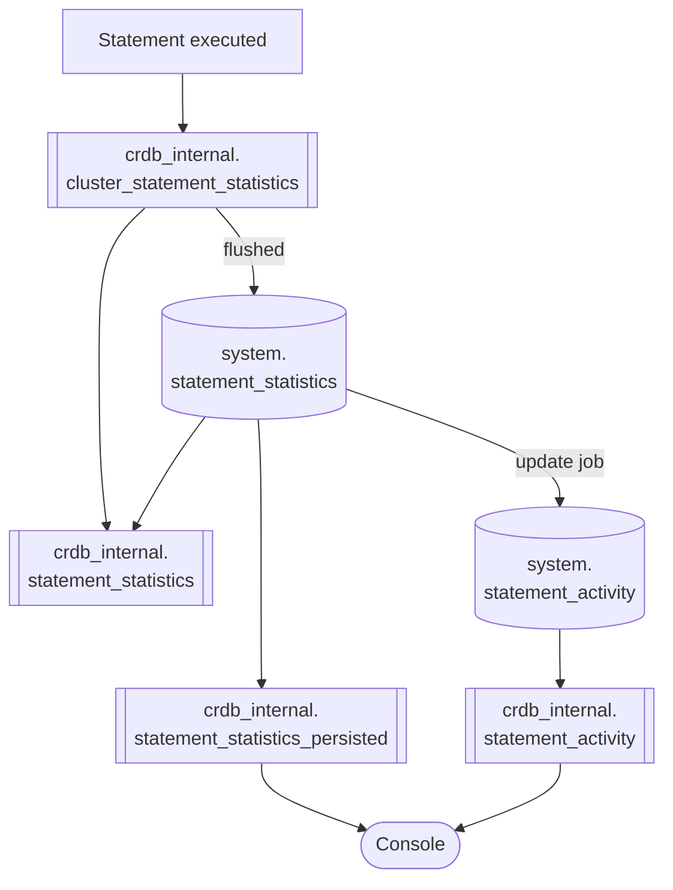
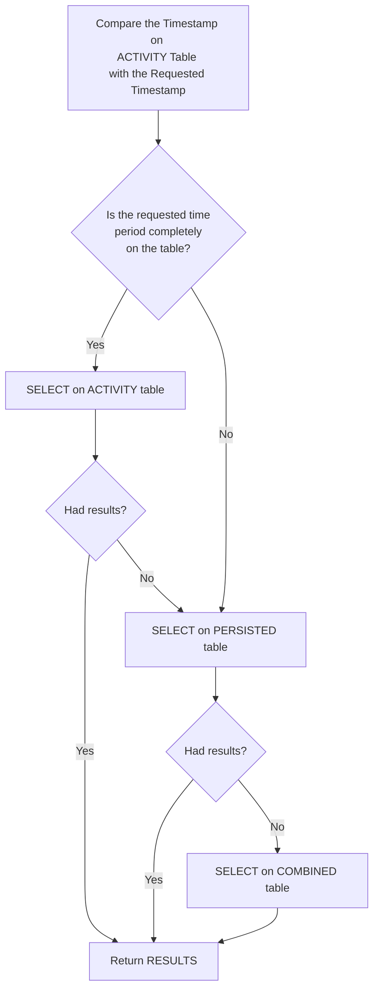

# SQL Statistics
Last Update: February 2024

Original author: maryliag

This document provides an overview of the collection of SQL Statistics, where they're
stored and how they're used on the Console UI.

Table of contents:

- [Overview](#overview)
- [Data Generation and Storage](#data-generation-and-storage)
- [Data Aggregation and Cardinality](#data-aggregation-and-cardinality)
- [Data Cleanup](#data-cleanup)
- [Data Access](#data-access)
- [Cluster Settings](#cluster-settings)

## Overview
The SQL statistics feature provides observability into statements and transactions
execution, which aims to help operators debug specific statements and transactions
that can cause degraded cluster performance. The statistics can be accesses in many ways,
the main one being the SQL Activity page on Console UI. The following sections will
detail how this data is generated, stored, cleanup and accessed.

## Data Generation and Storage
When a statement is executed, different levels of information are collected at 
different steps. When the statement is completed, the full data is populated into 
a single object to be recorded. Initially this statement is recorded in-memory only 
(`crdb_internal.cluster_statement_statistics`). A flush job is scheduled to run on a
frequency defined by `sql.stats.flush.interval` (default 10 minutes) and it will persist 
the in-memory data to a system table (`system.statement_statistics`). 

After the flush job is completed, another job is called to populate the top activity 
table (`system.statement_activity`). On this job we pre-compute the data against a few 
criteria (% of All Runtime, Contention, Execution Count, P99 Latency, SQL CPU Time and 
Statement Time) for faster access. We also aggregated when possible, for example, 
aggregate all executions of the same fingerprint on the same hour that had a different 
gateway node.

The same principles apply to transaction statistics, also powered by the SQL Stats 
subsystem. For transactions, replace all the `statement` for `transaction` in the tables
and view names. 

Node-global size limits are placed on the group of structures storing the in-memory 
data, based on memory usage and unique fingerprint count. The 
`sql.metrics.max_mem_stmt_fingerprints` (default 100k) and 
`sql.metrics.max_mem_txn_fingerprints` (default 100k) determine the max number of 
unique in-memory fingerprints allowed for statements and transactions, respectively. 
Reaching this size limit can trigger more frequent flushes, but such a flush would be 
aborted if an amount of time defined by `sql.stats.flush.minimum_interval` has yet to 
pass since the previous flush.

Flushes can also be aborted if the sink system tables have reached a combined row 
count greater than or equal to 1.5 * `sql.stats.persisted_rows.max` (default 1M). A 
factor of 1.5 is considered to give the table room to continue being written to as 
cleanup jobs run (see [Data Cleanup](#data-cleanup) below).

## Data Aggregation and Cardinality
When the statement is being recorded in memory, it gets aggregated with other 
executions of the same fingerprint, and when the flush happens it gets aggregated with 
all other executions for thar fingerprint on the current aggregation timestamp, which is
defined by `sql.stats.aggregation.interval` (default 1h). This mean everything executed 
on hour 1:XX will be stored as hour 1:00.

The SQL Stats subsystem works to reduce cardinality by aggregating statistics together at the node-level, with aggregation keys for Statements consisting of:
- Aggregated timestamp
- Statement fingerprint ID
- Transaction fingerprint ID
- Plan hash
- App name
- Node ID

Transaction statistics use a smaller set of components in their aggregation keys, consisting of:
- Aggregated timestamp
- Transaction fingerprint ID
- App name
- Node ID

A statement fingerprint ID is created by hashing the statement fingerprint (the query 
with the constants redacted), its database and failure status, and if it was part of an
implicit txn. A transaction fingerprint ID is the hashed string constructed using the
individual statement fingerprint IDs that comprise the transaction.

## Data Cleanup
The tables mentioned above have their own data cleanup process:

The `crdb_internal.cluster_statement_statistics` and 
`crdb_internal.cluster_transaction_statistics` tables, which again represent the 
in-memory caches of aggregated data for each, can reach up to 100k rows. 
Once that limit is reached or 10 minutes have passed (the frequency of the flush job),
a flush operation is called and all the data is moved to the 
`system.statement_statistics` or `system.transaction_statistics` tables and 
consequently removed from the in-memory cache. If a flush operation is not possible
at the moment, statistics for new fingerprints are rejected, but aggregation of 
statistics for fingerprints already existing in the cache continues.

The `system.statement_statistics` and `system.transaction_statistics` tables can 
reach up to 1.5 * `sql.stats.persisted_rows.max` (setting default 1M) rows. 
A job called `sql-stats-compaction` is called on the frequency defined by 
`sql.stats.limit_table_size_check.interval` (default 1h) and will delete older rows 
that have exceeded the max row count. If the max limit has been reached, the new data
will be discarded.

The above cleanup job can be toggled on/off with the 
`sql.stats.limit_table_size.enabled` setting (default enabled). The compaction job 
performs DELETE statements in iterations until the number of rows is below the maximum.
Each iteration deletes a maximum of `sql.stats.cleanup.rows_to_delete_per_txn` (default 
10k) rows.

The table `system.statement_activity` can reach up to 200k rows, which comes from 
500(top limit) * 6(num columns) * 24(hrs) * 3(days) = 216000 (rounded down to give 
an even number). Every flush operation will check if the limit was reached and delete 
all the excess data before adding the new ones. To keep things in sync, after rows 
are deleted from the table `system.statement_activity` we also delete their correspondent 
ones from the table `system.transaction_activity` and vice-versa to keep the data 
consistent between the two (since one of them could have reached the limit before the 
other).

## Data Access

UI and API clients access the data via `crdb_internal` tables to control the proper 
access of the data across sources (e.g. in-memory, persisted, and top activity tables).
The crdb_internal tables are views on top of the system tables to enable non-admin 
users to access them.

There are a few different options when accessing the statement statistics data from 
`crdb_internal`:
1. The in-memory data alone can be accessed on `crdb_internal.cluster_statement_statistics`.
2. The combined data of in-memory and persisted stats can be accessed on `crdb_internal.statement_statistics`.
3. The persisted data can be accessed on `crdb_internal.statement_statistics_persisted`.
4. The top activity table can be accessed on `crdb_internal.statement_activity`.

Likewise, we have similar options for accessing transaction statistics data:
1. The in-memory data alone can be accessed on `crdb_internal.cluster_transaction_statistics`.
2. The combined data of in-memory and persisted stats can be accessed on `crdb_internal.transaction_statistics`.
3. The persisted data can be accessed on `crdb_internal.transaction_statistics_persisted`.
4. The top activity table can be accessed on `crdb_internal.transaction_activity`.

The diagram below show how these tables are used to populate the SQL Activity page.

## Cluster Settings
There are several cluster settings that control different parts of this system. Here 
is a list of them (does not include the ones from other areas such as Insights):

| Cluster Setting                                                         | Sub-System             | Description                                                                                                                                                        | Default value |
|-------------------------------------------------------------------------|------------------------|--------------------------------------------------------------------------------------------------------------------------------------------------------------------|---------------|
| `sql.metrics.statement_details.enabled`                                 | SQL Stats Collection   | collect per-statement query statistics                                                                                                                             | true          |
| `sql.metrics.transaction_details.max_statement_ids`                     | SQL Stats Collection   | max number of statement fingerprint IDs to store for transaction statistics                                                                                        | 1k            |
| `sql.metrics.transaction_details.enabled`                               | SQL Stats Collection   | collect per-application transaction statistics                                                                                                                     | true          |
| `sql.metrics.statement_details.threshold`                               | SQL Stats Collection   | minimum execution time to cause statement statistics to be collected. If configured, no transaction stats are collected.                                           | 0             |
| `sql.metrics.statement_details.plan_collection.enabled`                 | SQL Stats Collection   | periodically save a logical plan for each fingerprint                                                                                                              | false         |
| `sql.metrics.statement_details.plan_collection.period`                  | SQL Stats Collection   | the time until a new logical plan is collected                                                                                                                     | 5 minutes     |
| `sql.metrics.max_mem_stmt_fingerprints`                                 | SQL Stats Collection   | the maximum number of statement fingerprints stored in memory                                                                                                      | 100k          |
| `sql.metrics.max_mem_txn_fingerprints`                                  | SQL Stats Collection   | the maximum number of transaction fingerprints stored in memory                                                                                                    | 100k          |
| `sql.metrics.max_mem_reported_stmt_fingerprints`                        | SQL Stats Collection   | the maximum number of reported statement fingerprints stored in memory                                                                                             | 100k          |
| `sql.metrics.max_mem_reported_txn_fingerprints`                         | SQL Stats Collection   | the maximum number of reported transaction fingerprints stored in memory                                                                                           | 100k          |
| `sql.metrics.max_stmt_fingerprints_per_explicit_txn`                    | SQL Stats Collection   | the maximum number of statement fingerprints stored per explicit transaction                                                                                       | 2k            |
| `sql.metrics.statement_details.index_recommendation_collection.enabled` | SQL Stats Collection   | generate an index recommendation for each fingerprint ID                                                                                                           | true          |
| `sql.metrics.statement_details.max_mem_reported_idx_recommendations`    | SQL Stats Collection   | the maximum number of reported index recommendation info stored in memory                                                                                          | 5k            |
| `sql.metrics.statement_details.gateway_node.enabled`                    | SQL Stats Collection   | save the gateway node for each statement fingerprint. If false, the value will be stored as 0                                                                      | false         |
| `sql.stats.flush.interval`                                              | Persisted SQL Stats    | the interval at which SQL execution statistics are flushed to disk                                                                                                 | 10 minutes    |
| `sql.stats.flush.minimum_interval`                                      | Persisted SQL Stats    | the minimum interval that SQL stats can be flushed to disk. If a flush operation starts within less than the minimum interval, the flush operation will be aborted | 0             |
| `sql.stats.flush.force_cleanup.enabled`                                 | Persisted SQL Stats    | if set, older SQL stats are discarded periodically when flushing to persisted tables is disabled                                                                   | false         |
| `sql.stats.flush.enabled`                                               | Persisted SQL Stats    | if set, SQL execution statistics are periodically flushed to disk                                                                                                  | true          |
| `sql.stats.flush.jitter`                                                | Persisted SQL Stats    | jitter fraction on the duration between sql stats flushes                                                                                                          | 0.15          |
| `sql.stats.persisted_rows.max`                                          | Persisted SQL Stats    | maximum number of rows of statement and transaction statistics that will be persisted in the system tables                                                         | 1M            |
| `sql.stats.cleanup.recurrence`                                          | Persisted SQL Stats    | cron-tab recurrence for SQL Stats cleanup job                                                                                                                      | @hourly       |
| `sql.stats.aggregation.interval`                                        | Persisted SQL Stats    | the interval at which we aggregate SQL execution statistics upon flush, this value must be greater than or equal to sql.stats.flush.interval                       | 1h            |
| `sql.stats.cleanup.rows_to_delete_per_txn`                              | Persisted SQL Stats    | number of rows the compaction job deletes from system table per iteration                                                                                          | 10k           |
| `sql.stats.limit_table_size.enabled`                                    | Persisted SQL Stats    | controls whether we allow statement and transaction statistics tables to grow past sql.stats.persisted_rows.max                                                    | true          |
| `sql.stats.limit_table_size_check.interval`                             | Persisted SQL Stats    | controls what interval the check is done if the statement and transaction statistics tables have grown past sql.stats.persisted_rows.max                           | 1h            |
| `sql.stats.activity.flush.enabled`                                      | Top Sql Stats Activity | enable the flush to the system statement and transaction activity tables                                                                                           | true          |
| `sql.stats.activity.top.max`                                            | Top Sql Stats Activity | the limit per column for the top number of statistics to be flushed to the activity tables                                                                         | 500           |
| `sql.stats.activity.persisted_rows.max`                                 | Top Sql Stats Activity | maximum number of rows of statement and transaction activity that will be persisted in the system tables                                                           | 200k          |
| `sql.stats.response.max`                                                | SQL Stats Endpoint     | the maximum number of statements and transaction stats returned in a CombinedStatements request                                                                    | 20k           |
| `sql.stats.response.show_internal.enabled`                              | SQL Stats Endpoint     | controls if statistics for internal executions should be returned by the CombinedStatements                                                                        | false         |
| `sql.stats.activity.ui.enabled`                                         | SQL Stats Endpoint     | enable the combined statistics endpoint to get data from the system activity tables                                                                                | true          |

