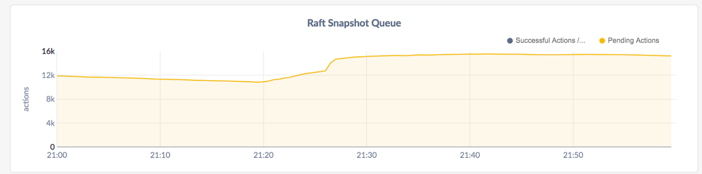

# Raft snapshots and why you see them when you oughtn't

Original author: Tobias Grieger

# Introduction

Each and every Range in CockroachDB is fundamentally a *Raft* group
(with a lot of garnish around it). Raft is a consensus protocol that
provides a distributed state machine being fed an ordered log of
commands, the *Raft log*. Raft is a leader-based protocol that keeps
leadership stable, which means that typically one of the members of
the group is the designated leader and is in charge of distributing
the log to followers and marking log entries as committed.

In typical operation (read: “practically always”) the process that
plays out with each write to a Range is that each of the members of
the Raft group receives new entries (corresponding to some digested
form of the write request) from the leader, which it acknowledges. A
little later, the leader sends an updated *Commit index* instructing the
followers to apply the current (and any preceding) writes to their
state, in the order given by the log.

A *Raft snapshot* is necessary when the leader does not have the log
entries a follower needs and thus needs to send a full initial
state. This happens in two scenarios:

1. Log truncation. It’s not economical to store all of the Raft log in
   perpetuity. For example, imagine a workload that updates a single
   key-value pair over and over (no MVCC). The Raft log’s growth is
   unbounded, yet the size of the state is constant.

   When all followers have applied a command, a prefix of the log up
   to that command can be discarded. But followers can be unavailable
   for extended periods of time; it may not always be wise to wait for
   *all* followers to have caught up, especially if the Raft log has
   already grown very large. If we don’t wait and an affected follower
   wants to catch up, it has to do so through a snapshot.

2. A configuration change adds a new follower to the Raft group. For
   example, a three member group gets turned into a four member
   group. Naively, the new member starts with a clean slate, and would
   need all of the Raft log. The details are a bit in the weeds, but
   even if the log had never been truncated (see 1.) we’d still need a
   snapshot, for our initial state is not equal to the empty state
   (i.e. if a replica applies all of the log on top of an empty state,
   it wouldn’t end up in the correct state).

# Terminology

We have already introduced *Raft* and take it that you know what a *Range*
is. Here is some more terminology and notation which is also helpful
to decipher the logs should you ever have to.

**Replica:** a member of a Range, represented at runtime by a
`*storage.Replica` object (housed by a `*storage.Store`). A Range
typically has an odd number of Replicas, and practically always three
or five.

**Replica ID:** A Range is identified by a Range ID, but Raft doesn’t even
know which Range it is handling (we do all of that routing in our
transport layer). All Raft knows is the members of the group, which
are identified by *Replica IDs*. For each range, the initial Replica IDs
are 1, 2, 3, and each newly added Replica is assigned the next higher
(and never previously used) one [1]. For example, if a Range has Replicas
with IDs 1, 2, 4, then you can deduce that member 3 was at some point
removed from the range and a new replica 4 added (in some unknown
order).

[1]  The replica ID counter is stored in the range descriptor.

The notation you would find in the logs for a member with Replica ID 3
of a Range with ID 17 is r17/3.  Raft snapshot: a snapshot that is
requested internally by Raft. This is different from a snapshot that
CockroachDB sends preemptively, see below.

**Raft snapshot queue:** a Store-level queue that sends the snapshots
requested by Raft. Prior to the introduction of the queue, Raft
snapshots would often bring a cluster to its knees by overloading the
system. The queue makes sure there aren’t ever too many Raft snapshots
in flight at the same time.

**Snapshot reservation:** A Store-level mechanism that sits on the receive
path of a snapshot, to make sure we’re not accepting too many
(preemptive or Raft) snapshots at once (which could overload the
node).

**Replica Change (or Replication Change):** the process of adding or
removing a Replica from/to a Range. An addition usually involves a:

**Preemptive snapshot:** a snapshot we send before adding a replica to the
group. The idea is that we’ll opportunistically place state on the
store that will house the replica once it is added, so that it can
catch up from the Raft log instead of needing a Raft snapshot. This
minimizes the time during which the follower is part of the commit
quorum but unable to participate in said quorum.

A preemptive snapshot is rate limited (at time of writing to 2mb/s)
and creates a “placeholder” Replica that doesn’t have an associated
Raft group (and has Replica ID zero) that is typically short-lived (as
it either turns into a full Replica, or gets deleted). See:

**Replica GC:** the process of deleting Replicas that are not members
of their Raft group any more. Determining whether a Replica is GC’able
is surprisingly tricky.

**Quota pool:** A flow control mechanism that prevents “faster” replicas
from leaving a slower (but “functional”, for example on a slower
network connection) Replica behind. Without a quota pool, the Raft
group would end up in a weakened state where losing one of the
up-to-date replicas incurs an unavailability until the straggler has
caught up. It can also trigger periodic Raft log truncations that cut
off the slow follower, which requires regular Raft snapshots.

**Quorum:** strictly more than half of the number of Replicas in a
Range. For example, with three Replicas, quorum is two. With four
Replicas, quorum is three. With five Replicas, quorum is three.

**Log truncation:** the process of truncating the logs. The Raft
leader computes this index periodically and sends out a Raft command
that instructs replicas to delete a given prefix of their Raft
logs. These operations are triggered by the Raft log queue.

**Range Split (or just Split):** an operation that splits a Range into
two Ranges by shrinking a Range (from the right) and creating a new
one (with members on the same stores) from the remainder. For example,
r17 with original bounds [a,z) might split into r17 with bounds [a,c)
and r18 with bounds [c,z). The right hand side is initialized with the
data from the (original) left hand side Replica.

**Range Merge (or just Merge):** the reverse of a Split, but more
complex to implement than a Split for a variety of reasons, the most
relevant to this document being that it needs the Replicas to be
colocated (i.e. with replicas on the same stores).

We’ll discuss the interplay between the various mechanisms above in
more detail, but this is a good moment to reflect on the title of this
document. Raft snapshots are expensive in that they transfer loads of
data around; it’s typically the right choice to avoid them. When could
they pop up outside of failure situations?

1. We control replication changes and have preemptive snapshots (which
   still move the same amount of data, but can happen at a leisurely
   pace without running a vulnerable Raft group); no Raft snapshots
   are involved from the looks of it

2. We control Raft log truncation; if followers are online, the quota
   pool makes sure that the followers are always at “comparable” log
   positions, so a (significant) prefix of the log that can be
   truncated without causing a Raft snapshot should always be
   available.

3. A split shouldn’t require a Raft snapshot: Before the split, all
   the data is on whichever stores the replicas are on. After the
   split, the data is in the same place, just kept across two ranges -
   a bookkeeping change.

4. Merges also shouldn’t need Raft snapshots. They’re doing replica
   changes first (see above) followed by a bookkeeping change that
   doesn’t move data any more.

It seems that the only “reasonable” situation in which you’d expect
Raft snapshots is if a node goes offline for some time and the Raft
log grows so much that we’d prefer a snapshot for catching up the node
once it comes back.

Pop quiz: how many Raft snapshots would you expect if you started a
fresh 15 node cluster on a 2.1.2-alpha SHA from November 2018, and
imported a significant amount (TBs) of data into it?

I bet ~15,000 wasn’t exactly what you were thinking of, and yet this
was a problem that was long overlooked and just recently addressed by
means of mitigation rather than resolution of root causes. It’s not
just expensive to have that many snapshots. You can see that thousands
of snapshots are requested, and the graph isn’t exactly in a hurry to
dip back towards zero. This is in part because the Raft snapshot queue
had (and has) efficiency concerns, but fundamentally consider that
each queued snapshot might correspond to transferring ~64mb of data
over the network (closer to ~32mb in practice). That’s on the order of
hundreds of gigabytes, i.e. it’ll take time no matter how hard we try.

At the end of this document, you will have an understanding of how
this graph came to be, how it will look today (spoiler: mostly a zero
flatline), and what the root causes are.

# Fantastic Raft snapshots and where to find them

We will now go into the details and discover how we might see Raft
snapshots and how they might proliferate as seen in the above
graph. In doing so, we’ll discover a “meta root cause” which is “poor
interplay between mechanisms that have been mentioned above”. To
motivate this, consider the following conflicts of interest:

- Log truncation wants to keep the log very short (this is also a
  performance concern).  Snapshots want their starting index to not be
  truncated away (or they’re useless).
- ReplicaGC wants to remove old data as fast as possible.  Replication
  changes want their preemptive snapshots kept around until they have
  completed.

It’s a good warm-up exercise to go through why these conflicts would cause a snapshot.

## Problem 1: Truncation cuts off an in-flight snapshot

Say a replication change sends a preemptive snapshot at log
index 123. Some writes arrive to the range; the Raft log queue checks
the state of the group, sees three up-to-date followers, and issues a
truncation to index 127. The preemptive snapshot arrives and is
applied. The replication change completes and a new Replica is formed
from the preemptive snapshot. It will immediately require a Raft
snapshot because it needs index 124 next, but the leader only has 127
and higher.

**Solution** (already in place): track the index of in-flight snapshots
and don’t truncate them away. Similar mechanisms make sure that we
don’t cut off followers that are lagging behind slightly, unless we
really really think it’s the right thing to do.

## Problem 2: Preemptive snapshots accidentally replicaGC’ed

Again a preemptive snapshot arrives at a Store. While the replication
change hasn’t completed, this preemptive Replica is gc’able and may be
removed if picked up by the replica GC queue. If this happens and the
replication change completes, the newly added follower will have a
clean slate and will need a Raft snapshot to recover, putting the
Range in a vulnerable state until it has done so.

**Solution** (unimplemented): delay the GC if we know that the replica
change is still ongoing. Note that this is more difficult than it
sounds. The “driver” of the replica change is another node, and for
all we know it might’ve aborted the change (in which case the snapshot
needs to be deleted ASAP). Simply delaying GC of preemptive snapshots
via a timeout mechanism is tempting, but can backfire: a “wide”
preemptive snapshot may be kept around erroneously and can block
“smaller” snapshots that are now sent after the Range has split into
smaller parts. We can detect this situation, but perhaps it is simpler
to add a direct RPC from the “driver” to the preemptive snapshot to
keep it alive for the right amount of time.

These two were relatively straightforward. If we throw splits in the mix, things get a lot worse.

## Problem 3: Splits can exponentiate the effect of problem 2

Consider the situation in problem 2, but between the preemptive
snapshot being applied and the replication change succeeding, the
range is split 100 times (splitting small ranges is fast and this
happens during IMPORT/RESTORE). The preemptive snapshot is removed, so
the Replica will receive a new snapshot. This snapshot is likely to
post-date all of the splits, so it will be much “narrower” than
before. In applying it, everything outside of its bounds is deleted,
and that’s the data for the 100 new ranges that we will now need Raft
snapshots for.

**Solution:** This is not an issue if Problem 2 is solved, but see
Problem 5 for a related problem.

## Problem 4: The split trigger can cause Raft snapshots

This needs a bit of detail about how splits are implemented. A split
is essentially a transaction with a special “split trigger” attached
to its commit. Upon applying the commit, each replica carries out the
logical split into two ranges as described by the split trigger,
culminating in the creation of a new Replica (the right-hand side) and
its initialization with data (inherited from the left-hand side). This
is conceptually easy, but things always get more complicated in a
distributed system. Note that we have multiple replicas that may be
applying the split trigger at different times. What if one replica
took, say, a second longer until it started applying it? All replicas
except for the straggler will already have initialized their new
right-hand sides, and the right-hand sides are configured to talk to
the right-hand side on our straggler - which hasn’t executed the split
trigger yet! The result is that upon receiving messages for this
yet-nonexistent replica, it will be created as an absolutely empty
replica. This replica will promptly [2] tell the leader that it needs a
snapshot. In all likelihood, the split trigger is going to execute
very soon and render the snapshot useless, but the damage has been
done.

[2] The part that already processed the split may form a quorum and
start accept requests. These requests will be routed also to the node
that hasn't processed the split yet. To process those requests, the
slower node needs a snapshot.

**Solution:** what’s implemented today is a mechanism that simply
delays snapshots to “blank” replicas for multiple seconds. This works,
but there are situations in which the “blank” replica really needs the
Raft snapshot (see Problems 3,5,6). The idea is to replace this with a
mechanism that can detect whether there’s an outstanding split trigger
that will obviate the snapshot.

## Problem 5: Replica removal after a split can cause Raft snapshots

This is Problem 4, but with a scenario that really needs the Raft
snapshot. Imagine a range splits into two and immediately afterwards,
a replication change (on the original range, i.e. the left-hand side)
removes one of the followers. This can lead to that follower Replica
being replica GC’ed before it has applied the split trigger, and so
the data removed encompasses that that should become the right-hand
side (which is still configured to have a replica on that store). A
Raft snapshot is necessary and in particular note that the
timeout-based mechanism in Solution 4 will have to time out first and
accidentally delays this snapshot.

**Solution:** See end of Solution 4 to avoid the delayed snapshot. To
avoid the need for a snapshot in the first place, avoid (or delay)
removing replicas that are pending application of a split trigger, or
do the opposite and delay splits when a replication change is
ongoing. Not implemented to date. Both options are problematic as they
can intertwine the split and replicate queues, which already have
hidden dependencies.

## Problem 6: Splitting a range that needs snapshots leads to two such ranges

If a range which has a follower that needs a snapshot (for whatever
reason) is split, the result will be two Raft snapshots required to
catch up the left-hand side and right hand side of the follower,
respectively. You might argue that these snapshots will be smaller and
add up to the original size and so that’s ok, but this isn’t how it
works owing to various deficiencies of the Raft snapshot queue.

This is particularly bad since we also know from Problem 4 and 5 that
we sometimes accidentally delay the Raft snapshot for seconds (before
we even queue it), leaving ample time for splits to create more
snapshots. To add insult to injury, all new ranges created in this
state are also false positives for the timeout mechanism in Problem 4.

Note that this is similar to Problem 3 in some sense but it can’t be detected by the split.

**Solution:** Splits typically happen on the Raft leader and can thus
peek into the Raft state and detect pending snapshots. A mechanism to
delay the split in such cases was implemented, though it doesn’t apply
to splits carried out through the “split queue” (as that queue does
not react well to being throttled). The main scenario in which this
problem was observed is IMPORT/RESTORE, which carries out rapid splits
and replication changes.

## Commonalities

All of these phenomena are in principle observable by running the
restore2TB and import/tpch/nodes=X roachtests, though at this point
all that’s left of the problem is a small spike in Raft snapshots at
the beginning of the test (the likely root cause being Problem 3),
which used to be exponentiated by Problem 6 (before it was fixed).

# Summary

Raft snapshots shouldn’t be necessary in any of the situations
described above, and considerable progress has been made towards
making that at reality. The mitigation of Solution 6 is powerful and
guards against the occasional Raft snapshot becoming a problem, but it
is nevertheless worth going the extra mile to add “deep stability” to
this property: a zero rate of Raft snapshots is a good indicator of
cluster health for production and stability testing. Trying to achieve
it has already led to the discovery of a number of surprising
interactions and buglets across the core code base, and not achieving
it will make it hard to end-to-end test this property.
