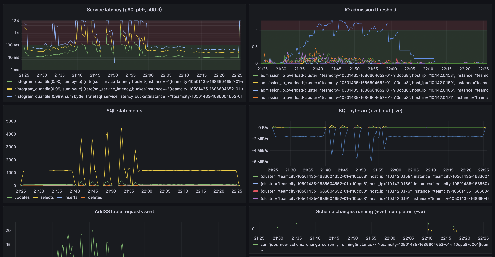
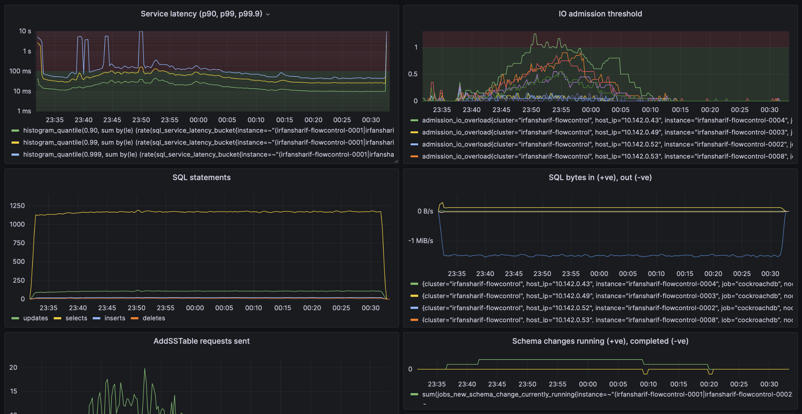
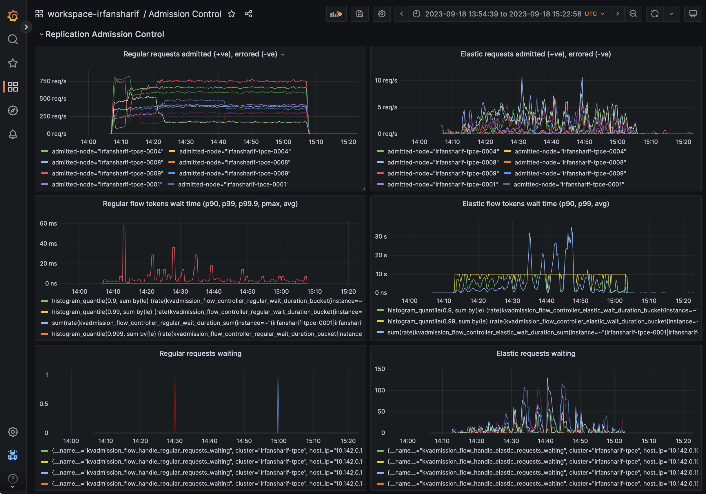
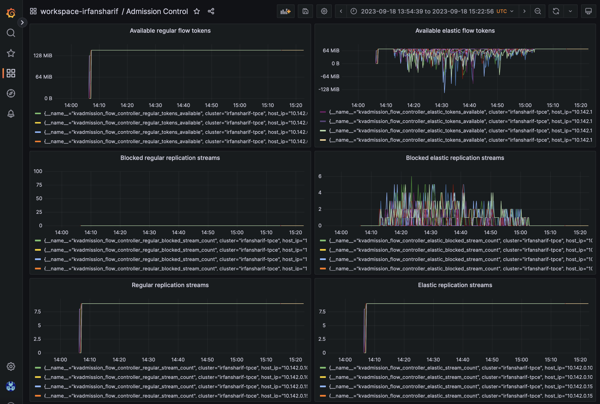

# Replication Admission Control

Authors: Irfan Sharif, Sumeer Bhola

This tech note describes the end-to-end flow control machinery we built for
replicated writes in CockroachDB. It builds on top of existing IO admission
control primitives and addresses the critical integration gap of follower
writes. Here and elsewhere we use "replication admission control" or "flow
control" interchangeably to describe the beast. It's dramatically reduced
the effect of elastic write traffic like large index backfills, row-level TTL
deletions, primary-key changes, restores, etc. on foreground write traffic,
while being able to sustain elastic work at a high bandwidth and keep the LSM
intact. Only cursory knowledge of CockroachDB's admission control subsystem is
assumed.


*Figure 1. 9-node TPC-E with two concurrent index backfills, before replication admission control.*


*Figure 2. 9-node TPC-E with two concurrent index backfills, after replication admission control.*


#### Table of contents

- [Background](#background)
  - [Problem](#problem)
  - [Solution](#solution)
- [Technical design](#technical-design)
  - [Overview](#overview)
  - [Replication streams, work classes, and flow tokens](#replication-streams-work-classes-and-flow-tokens)
  - [Intra-tenant prioritization](#intra-tenant-prioritization)
  - [Write shaping for the raft-group](#write-shaping-for-the-raft-group)
  - [Below-raft, non-blocking admission](#below-raft-non-blocking-admission)
  - [Flow token transport](#flow-token-transport)
  - [Raft proposal encoding](#raft-proposal-encoding)
  - [Only shaping elastic writes](#only-shaping-elastic-writes)
  - [Flow token leakage](#flow-token-leakage)
  - [Life of a write being admitted](#life-of-a-write-being-admitted)
  - [Performance overhead](#performance-overhead)
  - [Latency masking of moderate IO token exhaustion](#latency-masking-of-moderate-io-token-exhaustion)
  - [Fan-in effect, and lack of origin-fairness](#fan-in-effect-and-lack-of-origin-fairness)
- [Operationalizability](#operationalizability)
  - [Cluster settings](#cluster-settings)
  - [Metrics](#metrics)
  - [Virtual tables and /inspectz pages](#virtual-tables-and-inspectz-pages)
- [Drawbacks](#drawbacks)
- [Alternatives considered](#alternatives-considered)
- [Future work](#future-work)
- [Unresolved questions](#unresolved-questions)
- [Appendix](#appendix)
  - [Code organization](#code-organization)
  - [Documents/presentations](#documentspresentations)
- [Footnotes](#footnotes)

## Background

IO admission control[^27] ensures that we only admit as much write
work as we're able to compact out of L0. This is to keep the LSM
intact[^1] with respect to read-amplification, and is done so by
producing IO byte tokens at the observed L0 compaction bandwidth, treated as an
emergent property, and consuming such tokens proportional to the write
size[^2] when admitting work. This same IO token scheme is used to
modulate {regular,elastic} writes to other bottleneck resources, like observed
memtable flush rates in order to reduce write stalls, or provisioned disk
bandwidth by shaping elastic work to maintain low IO latencies. IO AC also
provides strict prioritization[^3] and intra-tenant
fairness[^4], only admitting elastic work (like index backfills) when
there's no regular work (like foreground writes) seeking admission.

### Problem

Previously (v21.2 when IO AC was first introduced, to v23.1), write work waited
for available IO tokens pre-{evaluation,replication} on the leaseholder store
where the work originated. If the same store observed follower writes, below
raft we would simply deduct IO tokens without waiting; see [^5] and
[^22]. The idea here was that since we have little queueing ability
for follower writes, but we do have it for leaseholder writes, by deducting
tokens without waiting we could at least reduce the rate of leaseholder writes
on that store to keep the LSM intact[^6].

This scheme had three critical flaws:
- C1. Work that deducts tokens without waiting is effectively higher priority
  than work that does wait. When using this scheme for follower writes due to low
  priority work (like index backfills), we have severe priority inversion. For
  high throughput low priority writes like large index backfills, where 2/3rds of
  the write work happens on followers, we routinely starved out foreground writes
  for IO tokens, causing write throughput collapse. See Figure 1.
- C2. For stores that observe a fair amount of follower write traffic, we're unable
  to keep the LSM intact. There's no queuing based on IO tokens for follower
  writes[^5], so nothing shaping it to observed L0 compaction
  bandwidth/memtable flush rates/provisioned bandwidth, so we can have high
  read-amplification, high IO latencies, or memtable write stalls. We saw the
  latter as recently as [^25].
- C3. There's reduced inter-tenant isolation. Excessive follower write traffic
  from one tenant could cause IO token starvation for another tenant's leaseholder
  writes. There's also no resource fairness across two tenants issuing follower
  writes to a store.

### Solution

Replication admission control (new in v23.2) addresses C1, C2 and C3 while
meeting the goals of IO admission control: LSM intact-ness, avoiding memtable
write stalls, and preventing excessive disk bandwidth use. It lets us shape the
rate of follower writes by shaping the rate of raft-group writes to the rate of IO
admission of the slowest replica in the raft-group. By default, we only shape
raft-group writes for elastic traffic. We're able to do so without blocking for
IO tokens below raft avoiding the hazards listed in [^5], while
ensuring that {proposal,replication} of high-priority writes is never waiting
for IO admission of elastic writes on any {local,remote} store. It also provides
inter-tenant isolation and fairness for all write work, not just on raft
leaders/leaseholders (which was the case previously).


## Technical design

This section reads better on the second read. We introduce some vocabulary,
describe individual pieces and their adjacents in semi-random order, and various
end-to-end properties. We present a life-of-a-write-being-admitted view,
integration complexities (mostly around avoiding token leaks), and why we're
defaulting to only using this machinery for elastic writes. We'll close a brief
primer on how to operationalize this in production settings for when it
(inevitably) breaks and when it doesn't.

### Overview

Flow tokens are deducted from before replicating some write along a replication
stream, and returned when the {local,remote} store on the other end of the
stream is able to logically admit that write. More on this "logical" admission
later. At the leaseholder level, before proposal evaluation, we wait for flow
tokens to be available for each relevant replication stream. When specific flow
token buckets run empty, subsequent writes that wait on said buckets are shaped
by the rate at which tokens are returned to the bucket. Since tokens are
returned when the store on the other end of the stream admits work, at the flow
token/pre-evaluation level we're eventually only admitting raft-group write work
at the rate of the slowest admitting replica in the raft-group. It's self
clocking, giving us end-to-end flow control.

### Replication streams, work classes, and flow tokens

We introduce the notion of replication streams, work classes, and flow tokens:

- Replication streams (`kvflowcontrol.Stream`) model the logical stream over
  which we replicate data traffic, the transmission for which we regulate using
  `kvflowcontrol.Tokens`. It's defined by the specific store the traffic is
  bound for and the tenant driving it, i.e. `<tenant id, store id>`. Despite
  the underlying physical link/transport possibly being shared across tenants
  or stores (for example, if talking to a remote node with multiple stores or
  talking between nodes with multiple active tenants), modeling streams on a:
  - Per-tenant basis helps provide inter-tenant isolation,
  - Per-store basis treats discrete bottleneck resources discretely (lower
    admission rates on one store don't affect writes bound for other stores).

  Writes to the local store are also modeled using these replication streams.
  There's no distinction between local and remote replicas as far as flow
  control is concerned.

- `admissionpb.WorkClass` represents the class of work, defined entirely by its
  priority. Namely, everything less than `admissionpb.NormalPri` is defined to
  be "elastic", while everything above and including `admissionpb.NormalPri` is
  considered "regular". Elastic work (like index backfills) is typically
  throughput, not latency sensitive. Regular work like foreground writes is
  latency sensitive.

- `kvflowcontrol.Tokens` represent the finite capacity of a given replication
  stream, expressed in bytes for data we're looking to replicate. Use of
  replication streams are predicated on tokens being available. Flow tokens
  aren't replenished, only returned to where they were originally deducted. If
  `16MiB` of flow tokens were maintained for `<tenant=t1, store=s2>`, and we had
  an RTT of `200ms` to `store=s2`, using stock bandwidth-delay-product math, we'd
  be able to drive at most `80MiB/s` of write traffic to `store=s2` which is
  quite high for an LSM.

We maintain this set of flow token buckets (one for each work class for each
outbound replication stream) on each node through the canonical
`kvflowcontrol.Controller` implementation.

```
    ┌───────────────────────────────────┐┐┐
    │ kvflowcontrol.Controller          │││
    │                                   │││
    │ ┌───────────────────────────────┐ │││
    │ │ admissionpb.RegularWorkClass  │ │││
    │ │┌──────────────────────┬┬┐     │ │││
    │ ││ kvflowcontrol.Stream │││     │ │││
    │ │└──────────────────────┴┴┘     │ │││
    │ └───────────────────────────────┘ │││
    │ ┌───────────────────────────────┐ │││
    │ │ admissionpb.ElasticsWorkClass │ │││
    │ │┌──────────────────────┬┬┐     │ │││
    │ ││ kvflowcontrol.Stream │││     │ │││
    │ │└──────────────────────┴┴┘     │ │││
    │ └───────────────────────────────┘ │││
    └───────────────────────────────────┘┘┘
```

### Intra-tenant prioritization

For a given replication stream, we maintain two sets of flow tokens, one for
each work class. We use this segmentation to provide coarse-grained intra-tenant
prioritization. It works as follows:
- Regular work originating on `node=n1` from `tenant=t1` looking to write only
  to `store=s1` is admitted when there are regular flow tokens available (i.e.
  `> 0MiB`) on `node=n1` replication stream `<tenant=t1, store=s1>`. The same
  is true for elastic work, which checks whether there are elastic flow tokens
  available for the relevant replication stream(s).
- When regular work is admitted, it deducts from both the {regular,elastic}
  flow token buckets. When elastic work is admitted, it only deducts from the
  elastic flow token bucket.

This way regular work is never blocked on unadmitted elastic work, but elastic
work can in fact block on unadmitted regular work. If regular work is yet
unadmitted by the store on the other end of the replication stream, issuing more
elastic work is moot, since it would get queued behind the waiting regular work.
Consider this test case from
`pkg/../kvflowcontroller/testdata/flow_token_adjustment` where the regular
bucket is initialized with `16MiB` of flow tokens and the elastic with `8MiB` and we
step through multiple token deductions/returns tagged with different work
classes.

https://github.com/cockroachdb/cockroach/blob/6cbd07ee6fbfb92706e8cdc8c559960b1bc41663/pkg/kv/kvserver/kvflowcontrol/kvflowcontroller/testdata/flow_token_adjustment#L41-L65

### Write shaping for the raft-group

When admitting a write to a range belonging to `tenant=t1`, with active
replicas on `store=s1`, `store=s2`, `store=s3`, where the replica on
`store=s1,node=n1` was the leaseholder, before proposal evaluation, we'll check
for available flow tokens on `node=n1`, for the relevant work class, for the
replication streams `<tenant=t1, store=s1>`, `<tenant=t1, store=s2>`,
`<tenant=t1, store=s3>`. We'll do this sequentially, blocking on each stream
if available tokens `<= 0MiB`. If `store=s1` and `store=s2` are able to admit
work at `1MiB/s`, but `store=s3` is only able to admit at `0.5MiB/s`, if
issuing writes at rate greater than `0.5MiB/s`, we'll eventually deplete flow
tokens in the `<tenant=t1, store=s3>` bucket. Subsequent writes will then only
be admitted at the rate flow tokens are returned for this depleted bucket, i.e.
`0.5MiB/s`, representing our dominant bottleneck resource. Consider this test
case from `pkg/.../kvflowsimulator/testdata/handle_single_slow_stream`
simulating exactly the above:

https://github.com/cockroachdb/cockroach/blob/6cbd07ee6fbfb92706e8cdc8c559960b1bc41663/pkg/kv/kvserver/kvflowcontrol/kvflowsimulator/testdata/handle_single_slow_stream#L1-L82

To manage the per-leaseholder replica list of underlying replication streams we
need to deduct/return flow tokens from, we embed a `kvflowcontrol.Handle` in
each `kvserver.Replica`.

### Below-raft, non-blocking admission

Blocking below-raft for IO tokens comes with the hazards listed in
[^5]. To this end we introduce a non-blocking admission
interface[^21], used exclusively for below-raft IO work. This is
sometimes interchangeably referred to as "asynchronous", "logical" or "virtual"
admission. The idea is as follows:
- Below-raft we're told to append log entries to stable storage.
- Before doing so, we enqueue a "virtual" work item in IO work queue for the
  given store[^23].
  - The work item includes metadata needed for inter-tenant fairness and
    intra-tenant prioritization, i.e. the tenant ID that issued the raft
    proposal, admission priority, create time, and the size of the log entry
    itself. These details are used when admitting/dequeuing the work item in
    priority, tenant-fair order, consuming the right number of IO tokens.
  - The work item also includes the node ID where the proposal originated, and
    the log position of the raft entry. We'll discuss why for both later on. We'll
    also discuss how all this per-proposal metadata actually makes its way to each
    replica below-raft.
- We proceed to write the log entry to stable storage and tick the raft state
  machine, responding with acknowledgements that we've written entries to
  stable storage and proceeding with state machine application. The admission
  interface is non-blocking or "logical" in that we didn't actually wait for
  the enqueued entry to get dequeued before doing the actual "physical" work.
- Virtual work items gets dequeued or "logically admitted" when IO tokens
  are produced. This happens concurrently with the thread enqueuing the virtual
  work item. The node at which flow tokens were originally deducted in order to
  replicate the write we just logically admitted needs to now be informed of
  the fact. We use the origin node ID and log position to do so, as discussed
  further below. We're effectively returning flow tokens.
- The origin node learns of this logical admission, releasing the deducted flow
  tokens back to the bucket. If there's work waiting for flow tokens and
  they're now non-negative, work is admitted.

The effect of the non-blocking admission interface is that even though the
actual write work is done immediately, we can potentially defer the return of
flow tokens. They're decoupled. It's the _subsequent_ writes at the proposer
that then queue for available flow tokens, and get shaped by the rate of IO
admission/flow token returns from the earlier writes that were physically
completed but potentially still unadmitted. It's helpful to think about the
steady-state effects, i.e. the admission of subsequent writes, and not of the
initial burst of writes that get insta-admitted.

### Flow token transport

Above we discussed how once work gets logically admitted below-raft, we want to
inform origin nodes of said fact in order to return the deducted flow tokens.
We piggyback such communication over the existing bi-directional raft transport
streams established between nodes. We also make use of a special-purpose
outbox for this delivery, `kvflowcontrol.Dispatch`.
- When work gets logically admitted, we record into the outbox the log position
  and priority of the work that got admitted and the node that needs to be
  informed of it.
  - We use `<log position, priority>` to indicate that all proposals of the given
    priority with positions less than or equal to the given log position have
    been admitted. We use this "prefix token return" scheme to avoid complexities
    around double accounting on the follower returning tokens and the leaseholder
    deducting tokens. The `priority` parameter exists because we potentially want to
    return flow tokens for entries at higher log positions and higher admission
    priorities without returning them for entries at lower positions and lower
    priorities. This is discussed further below.
- When the raft transport on the follower node happens to be transmitting a
  raft message to the origin node, it piggybacks information what was admitted
  below raft, emptying the outbox.
- When receiving raft messages, if it includes information about below-raft
  admission, the origin nodes returns flow tokens back into the relevant
  buckets, possibly admitting work waiting for available tokens.

Since we also use this same below-raft, non-blocking admission and above-raft flow
token wait for local writes, we short-circuit this outbox + raft transport
codepath in the local case, immediately returning flow tokens to the local
buckets when work is admitted below-raft.

### Raft proposal encoding

Above we discussed including as part of every raft proposal relevant admission
control metadata needed to enqueue virtual work items in below-raft IO work
queues. We do so by actually encoding the data as part of the raft proposal
itself. We wait until we know the log position the proposal is to end up in,
which happens post-evaluation (we need to include the log position in the
admission metadata, as described elsewhere).

Below-raft, we sniff the message header to cheaply detect whether the proposal
encodes such metadata, and if so, should be subject to below-raft admission
control. We're able to decode the admission data selectively without needing to
decode the entire raft proposal. We don't want/need to decode it fully when
appending to the raft log, the point at which we virtually enqueue a work item
in IO admission queues.

### Only shaping elastic writes

Shaping raft-group writes to the rate of the slowest admitting replica in the
raft-group is not uncontroversial - by default we'll only do it for elastic
writes[^7]. Users can elect to also use this flow control for all
regular writes[^8] in cases where it makes sense[^26] (with
heterogenous regions for example, where certain regions only hold followers and
we want regular leaseholder writes to automatically be shaped to the follower
region's write rate). For regular writes, by default, we'll continue to use the
leaseholder-only IO admission scheme as before, with regular follower writes
deducting tokens without waiting.
- C1 is coarsely addressed by using flow control for elastic writes, where
  elastic follower work no longer deducts IO tokens without waiting. So we
  don't have the severe priority inversion problem.
- C2 and C3 are partially addressed by assuming regular write bandwidth is
  comparatively low. This will be further improved by taking write
  bandwidth/admission queueing/tenancy[^9] into account in the
  allocator[^10].

See [^7] and [^11] for more discussion on the matter,
including segues around the per-replica proposal quota pool, follower pausing,
allocation, and more.

### Flow token leakage

Leaking flow tokens is hazardous, it simply stalls writes resulting in write
throughput collapse - best avoided. Done naively there are a myriad of ways in
which we could leak flow tokens: raft transport streams breaking, nodes
crashing, followers being paused/unpaused, caught up via snapshots or
post-restart log appends, leaseholder/leadership changes, prolonged leaseholder
!= leader scenarios, replicas being GC-ed, command reproposals, lossy raft
transport, ranges splitting/merging, {un,}quiescing, log truncations, and raft
membership changes.

- For the listed interactions above we've added a slew of randomized/integration
  tests to verify we don't leak tokens.
- We've had several months of CI baking time using flow control for both
  {regular,elastic} writes to shake out token leaks. Even though by default we'll
  only use it for elastic writes, which can more readily be bounced (most are
  built using the CockroachDB jobs infrastructure) if stuck.
- Above we briefly touched on using prefix returns by using `<log position,
  priority>` to return tokens en-masse, instead of introducing double accounting
  complexity {above,below}-raft. Embedded within the per-replica
  `kvflowcontrol.Handle` is a per-replication stream `kvflowtokentracker.Tracker`,
  tracking all token deductions. By using this tracker to atomically release
  tokens, we also avoid any double-return bugs.

See `pkg/.../kvserver/flow_control_*.go`[^16] for where we address all
the interactions above, and `I1-I13` in
`pkg/.../kvflowcontrol/doc.go`[^23] for detailed commentary on each.
The guiding principle is to 'only deduct flow tokens when actively replicating a
proposal along specific streams', which excludes dead/paused/lagging/pre-split
RHS/non-longer-group-member replicas, and explains why we only do it on replicas
that are both leaseholder and leader. It also explains why we don't re-deduct on
reproposals, or try to intercept raft-initiated re-transmissions. For each of
these scenarios, we know when not to deduct flow tokens, and we simply free up
all held tokens and safeguard against a subsequent double returns. We care about
safety (no token leaks, no double returns) and liveness (eventual token
returns). We rather fail-open preferring to over-admit rather than risking token
leakage.

https://github.com/cockroachdb/cockroach/blob/6cbd07ee6fbfb92706e8cdc8c559960b1bc41663/pkg/kv/kvserver/flow_control_integration.go#L21-L211

https://github.com/cockroachdb/cockroach/blob/6cbd07ee6fbfb92706e8cdc8c559960b1bc41663/pkg/kv/kvserver/kvflowcontrol/doc.go#L155-L476

We'll note that it took many years to harden the proposal quota pool, which
shares similar leakiness concerns. Hopefully we've applied enough of those
learnings here. The interactions listed above are intended to be exhaustive so
scrutiny is welcome.

### Life of a write being admitted

Here's how the various pieces fit together; they make references to the specific
interfaces/APIs introduced in the package.

https://github.com/cockroachdb/cockroach/blob/6cbd07ee6fbfb92706e8cdc8c559960b1bc41663/pkg/kv/kvserver/kvflowcontrol/doc.go#L13-L151

### Performance overhead

We looked at `kv0/enc=false/nodes=3/cpu=96` (which uses a high volume of small
writes with high concurrency) and `kvadmission.flow_control.mode =
'apply_to_all'` to work through mutex/block/heap/cpu profiles. Microbenchmarks
around {encoding,decoding} raft metadata showed negligible overhead, and after
sharding mutexes around `kvflowcontrol.Controller`, replacing mutex-backed maps
with `sync.Maps`, pooling allocations, removing unnecessary map/slice accesses,
we were able to claw back most performance regressions. The overheads are per
raft entry, and typical elastic work (like index backfills) has large raft
entries and a lower request rate, so we expect minimal impact of these
overheads when applying this to only elastic work.

### Latency masking of moderate IO token exhaustion

Previously (pre v23.2, before replication admission control) requests waited for
IO tokens on leaseholders pre-evaluation. IO wait queue times (with moderate
amounts of IO token exhaustion) directly translated to user observed latencies.
With semi-coupled flow tokens however, we've observed some degree of latency
masking since we only introduce flow token wait latencies when flow tokens are
wholly depleted. We've seen this effect experimentally when driving right below
peak LSM write throughput (as dictated by varying L0 compaction bandwidth), where
we have ~0ms wait queue times for flow tokens, fluctuating available flow
tokens, and highly varying IO wait queue times, all of which is masked because
we still don't fully deplete flow tokens. This is probably not a very meaningful
result.

### Fan-in effect, and lack of origin-fairness

Consider a store receiving follower writes from a set of remote, origin nodes.
The initial set of flow tokens on each origin node (`8MiB` for elastic writes,
`16MiB` for regular) acts a burst budget, for said nodes to issue work regardless
of the receiver store's LSM state. We don't expect a high amount of fan-in in
practical settings (power-law for active tenants, active ranges, and perhaps
future copysets like work to reduce allocation overlap), but still it exists.

Consider a few cases:
- If `store=s1` and `store=s2` both independently issue follower writes of the
  same priority on behalf of the same `tenant=t1` to `store=s3`, we make no
  fairness guarantees between the write bandwidth `store=s1` and `store=s2` are
  able to drive. After the initial burst, the aggregate bandwidth across the
  two origins will be equal to the IO admission rate of the shared receiver
  `store=s3`.
- If `store=s1` was issuing work on behalf of `tenant=t1` and `store=s2` on
  behalf of `tenant=t2`, and `store=s3` equally weighted the two tenants, then
  however we'd guarantee equal write bandwidth to the two origin stores, since
  we provide tenant fairness.
- If `store=s1` was issuing regular work on behalf of `tenant=t1`, and
  `store=s2` issuing elastic work on behalf of the same tenant, we'd admit as much
  follower write work as possible from `store=s1` and only grant the remaining
  capacity to `store=s2`, given we provide strict intra-tenant fairness.

See `pkg/../admission/testdata/replicated_write_admission` for some of these
possible test cases, for example:

https://github.com/cockroachdb/cockroach/blob/6cbd07ee6fbfb92706e8cdc8c559960b1bc41663/pkg/util/admission/testdata/replicated_write_admission/tenant_fairness#L43-L49


## Operationalizability

### Cluster settings

There are various cluster settings to be aware of, to muck with things in
production settings:

```
    demo@127.0.0.1:26257/movr> select variable from
                               [show all cluster settings]
                               where variable like '%admission.flow_%';
    variable
    ---------------------------------------------------------
    kvadmission.flow_control.enabled
    kvadmission.flow_control.mode
    kvadmission.flow_controller.elastic_tokens_per_stream
    kvadmission.flow_controller.regular_tokens_per_stream
    kvadmission.flow_token.dispatch_interval
    kvadmission.flow_token.drop_interval
    (6 rows)
```

- `kvadmission.flow_control.enabled` is the top-level switch that enables any of
  this machinery. When switched off, any work waiting for flow tokens is
  insta-admitted.
- `kvadmission.flow_control.mode` controls whether we use flow control for just
  elastic traffic or both elastic and regular traffic. When toggled, it too admits
  all work waiting for flow tokens.
- `kvadmission.flow_controller.{elastic,regular}_tokens_per_stream` controls how
  many flow tokens we use for {elastic,regular} replication streams. For a given
  RTT, it affects the maximum write bandwidth we can sustain. Elastic work for
  example uses `8MiB` of tokens, so for an RTT of `200ms`, we can sustain
  `8MiB/200ms = 40MiB/s` of write bandwidth to a given store. It also affects
  the worst-case burst a given store can receive if all senders issued work to it
  in coordinated fashion. With `N=20` nodes and `T=100` tenants, the burst for
  regular work is `20*100*16MiB = 32GiB` of work.
- `kvadmission.flow_token.dispatch_interval` controls the interval at which the
  raft transport checks for pending flow token dispatches from idle connections
  and delivers them. This is the fallback mechanism if there are no raft
  messages to piggyback flow token returns off of. We don't expect it to get
  used.
- `kvadmission.flow_token.drop_interval` is the interval at which the raft
  transport checks for pending flow token dispatches to nodes we're no longer
  connected to, in order to drop them. This is purely to clear the per-node
  outbox. We don't expect it to get used.

### Metrics

There are various aggregated metrics to be aware of, you'll find a curated
grafana dashboard internally[^28] and a subset of them surfaced in the
'Overload' dashboard in the UI. The `kvadmission_flow_controller_*` and
`kvadmission_flow_handle_*` metrics on a node are for requests proposed at that
node. They're more easily interpreted on grafana but we'll list them here
anyway:
- `kvadmission_flow_controller_{regular,elastic}_requests_{admitted,errored}`,
  counter for requests getting admitted or erroring out at the flow token level.
- `kvadmission_flow_controller_{regular,elastic}_wait_duration_{bucket,sum,count}`,
  latency histogram for how long requests wait for flow tokens. Could also be used
  to compute the mean latencies.
- `kvadmission_flow_handle_{regular,elastic}_requests_waiting`, work waiting for
  flow tokens.
- `kvadmission_flow_controller_{regular,elastic}_tokens_{returned,deducted}`,
  aggregate flow tokens deducted and returned, across all replication streams.
- `kvadmission_flow_controller_{regular,elastic}_tokens_available`,
  point-in-time view of the total flow tokens available, across all replication
  streams
- `kvadmission_flow_controller_{regular,elastic}_blocked_stream_count`, number
  of replication streams with unavailable flow tokens. Writes to these streams are
  being actively shaped.
- `kvadmission_flow_controller_{regular,elastic}_stream_count`, total number of
  replication streams.
- `kvadmission_flow_controller_elastic_tokens_unaccounted`, token
  deductions/returns that are unaccounted for. We paper over the bugs by resetting
  to bucket limits (risking {over,under}-admission) but increment this counter to
  detect such bugs in cloud environments.
- `kvadmission_flow_handle_streams_{connected,disconnected}`



*Figure 3. Select replication admission control metrics from a roachtest run of
`admission-control/index-backfill`.*

The following are a set of metrics around the flow token transport and outbox,
metrics that I've not really needed to look at. They describe how many flow
token messages are delivered, dropped, pending delivery, delivered using the
local fast path, and the number of nodes we're pending delivery to (on a node
these are for all of that node's stores that were receiving raft log entries
from remote nodes).
- `kvadmission_flow_token_dispatch_pending_{regular,elastic}`
- `kvadmission_flow_token_dispatch_coalesced_{regular,elastic}`
- `raft_transport_flow_token_dispatches_{sent,dropped}`
- `kvadmission_flow_token_dispatch_local_{regular,elastic}`
- `kvadmission_flow_token_dispatch_pending_nodes`

Aggregate metrics don't surface exactly which replication stream is blocked,
something that's often of interest. If `admission_io_overload` or
`admission_granter_io_tokens_exhausted_duration_kv` don't readily point to which
individual stores are IO overloaded and thus looking to shape writes through
flow tokens, we do log the high-cardinality state. It looks as follows:

https://github.com/cockroachdb/cockroach/blob/6cbd07ee6fbfb92706e8cdc8c559960b1bc41663/pkg/kv/kvserver/kvflowcontrol/kvflowcontroller/kvflowcontroller_metrics.go#L255-L257

```
W230918 14:34:11.468469 437 kv/kvserver/kvflowcontrol/kvflowcontroller/kvflowcontroller_metrics.go:234 ⋮ [-] 994  1 blocked ‹elastic› replication stream(s): ‹t1/s6›
W230918 14:34:45.154252 973 kv/kvserver/kvflowcontrol/kvflowcontroller/kvflowcontroller_metrics.go:234 ⋮ [-] 1007  3 blocked ‹elastic› replication stream(s): ‹t1/s2, t1/s4, t1/s6›
W230918 14:35:17.782284 19624 kv/kvserver/kvflowcontrol/kvflowcontroller/kvflowcontroller_metrics.go:234 ⋮ [-] 1016  3 blocked ‹elastic› replication stream(s): ‹t1/s6, t1/s7, t1/s2›
W230918 14:35:49.337810 696 kv/kvserver/kvflowcontrol/kvflowcontroller/kvflowcontroller_metrics.go:234 ⋮ [-] 1025  3 blocked ‹elastic› replication stream(s): ‹t1/s2, t1/s8, t1/s7›
```

### Virtual tables and /inspectz pages

We've introduced virtual tables and `/inspectz` pages to directly peek at
in-memory state of various flow control datastructures. These have been very
handy when poking at live experiments. They surface data about the in-memory
state of the very nodes serving the SQL/endpoint.

```
    demo@127.0.0.1:26257/movr> select table_name from
                               [show tables from crdb_internal]
                               where table_name like '%kv_flow%';
             table_name
    ----------------------------
      kv_flow_controller
      kv_flow_control_handles
      kv_flow_token_deductions
    (3 rows)
```

The states correspond to `kvflowcontrol.Controller`, the per-replica
`kvflowcontrol.Handle`, and the set of all flow tokens that were deducted and
waiting to be released after the corresponding work is logically admitted by the
store on the other end of the replication stream.

```
demo@127.0.0.1:26257/movr> show create table crdb_internal.kv_flow_controller;
             table_name            |                create_statement
-----------------------------------+--------------------------------------------------
  crdb_internal.kv_flow_controller | CREATE TABLE crdb_internal.kv_flow_controller (
                                   |     tenant_id INT8 NOT NULL,
                                   |     store_id INT8 NOT NULL,
                                   |     available_regular_tokens INT8 NOT NULL,
                                   |     available_elastic_tokens INT8 NOT NULL
                                   | )
(1 row)

demo@127.0.0.1:26257/movr> show create table crdb_internal.kv_flow_control_handles;
               table_name               |                                                 create_statement
----------------------------------------+--------------------------------------------------------------------------------------------------------------------
  crdb_internal.kv_flow_control_handles | CREATE TABLE crdb_internal.kv_flow_control_handles (
                                        |     range_id INT8 NOT NULL,
                                        |     tenant_id INT8 NOT NULL,
                                        |     store_id INT8 NOT NULL,
                                        |     total_tracked_tokens INT8 NOT NULL,
                                        |     INDEX kv_flow_control_handles_range_id_idx (range_id ASC) STORING (tenant_id, store_id, total_tracked_tokens)
                                        | )
(1 row)

demo@127.0.0.1:26257/movr> show create table crdb_internal.kv_flow_token_deductions;
                table_name               |                                                          create_statement
-----------------------------------------+--------------------------------------------------------------------------------------------------------------------------------------
  crdb_internal.kv_flow_token_deductions | CREATE TABLE crdb_internal.kv_flow_token_deductions (
                                         |     range_id INT8 NOT NULL,
                                         |     tenant_id INT8 NOT NULL,
                                         |     store_id INT8 NOT NULL,
                                         |     priority STRING NOT NULL,
                                         |     log_term INT8 NOT NULL,
                                         |     log_index INT8 NOT NULL,
                                         |     tokens INT8 NOT NULL,
                                         |     INDEX kv_flow_token_deductions_range_id_idx (range_id ASC) STORING (tenant_id, store_id, priority, log_term, log_index, tokens)
                                         | )
(1 row)
```

These tables can be joined like regular tables, and are used internally in some
end-to-end integration tests. Like the ones below (click around in the directory
for other examples):

https://github.com/cockroachdb/cockroach/blob/6cbd07ee6fbfb92706e8cdc8c559960b1bc41663/pkg/kv/kvserver/testdata/flow_control_integration/basic#L37-L45

Since they expose the in-memory state, it's possible to remix them to figure out
what specific ranges are running low/empty on flow tokens, and based on which
underlying replicas. These virtual tables are backed by raw HTTP endpoints under
the `/inspectz` endpoint. Specifically, `/inspectz/kvflowcontroller` and
`/inspectz/kvflowhandles?ranges=<rangeid>,<rangeid>,...` (the query parameter
is optional and variadic). We've not found a need to use them directly, instead
mostly using the virtual tables above. The data returned looks like so:

https://github.com/cockroachdb/cockroach/blob/6cbd07ee6fbfb92706e8cdc8c559960b1bc41663/pkg/kv/kvserver/kvflowcontrol/kvflowhandle/testdata/handle_inspect#L65-L138

## Drawbacks

This was all fairly hairy, but is hopefully done and works ok.

- The flow token bucket limits were picked semi-arbitrarily and may be
  artificially restricting write throughput, especially over wide links. They
  can be tuned however.
- The fan-in effect described above may allow for large compaction backlogs
  with many active tenants and active stores.

## Alternatives considered

We evaluated a few options before this scheme:
- Follower pausing (which abruptly stalls replication traffic to stores reaching
  a configured IO overload threshold, instead of shaping writes). See
  [^29]. We're deliberately reducing some availabililty despite no node
  failure, only due to overload. We'll note that we built follower pausing before
  we had replication admission control, and think it's unlikely to hit the high
  levels of IO overload. We'll also note that flow control is somewhat
  orthogonal to follower pausing - it's possible to have both and we've written
  code for it. Specifically, when followers are paused, we don't deduct flow
  tokens for writes to the raft-group (lest we leak them).
- Applying admission control only for bulk writes[^30]. Since
  foreground load was being affected by IO tokens consumed by elastic follower
  writes, one thought was to not use IO tokens for low bandwidth foreground
  writes. It helped with C1, not C2. since there was nothing shaping elastic
  follower write traffic, we still sometimes observed severe L0 overload degrading
  read latencies or memtable writes stalls.

See [^14] for a few other thought experiments. One of them is anchored
around "remote prediction" which sounds cool.

## Future work

- Using elastic write flow control during raft log catchup. See [^31].
- Removing the per-replica quota pool. See [^32].
- Find {easy,crude} ways to surface high-cardinality timeseries, like the
  per-replication stream flow token bandwidth over time. Many components in KV
  could benefit from such primitives.
- Using flow control signals in the allocator somehow, to improve
  {elastic,regular} write bandwidth.
- Reduce fan-in effect through copysets.

## Unresolved questions

- It's unclear what the right intersection of write shaping, follower pausing,
  allocation is for regular writes.

## Appendix

### Code organization

The code for this work primarily sits under
`pkg/kv/kvserver/kvflowcontrol`[^15], with integration code under
`pkg/kv/kvserver/flow_control_*.go`[^16]. We're building on top of
library components in `pkg/util/admission`[^17]. For the individual PRs building
up to this work, see [^20]

```
    ۩ tree -L 1 pkg/kv/kvserver/kvflowcontrol
    pkg/kv/kvserver/kvflowcontrol
    ├── BUILD.bazel
    ├── doc.go
    ├── kvflowcontrol.go
    ├── kvflowcontroller
    ├── kvflowcontrolpb
    ├── kvflowdispatch
    ├── kvflowhandle
    ├── kvflowinspectpb
    ├── kvflowsimulator
    ├── kvflowtokentracker
    └── testing_knobs.go

    7 directories, 4 files
```

### Documents/presentations

See:
- [^14] for an earlier working document,
- [^12] and [^13] for a high-level eng-biweekly presentation for this work,
- [^18] and [^19] for a synchronous walkthrough of this work for/with
  knowledgeable reviewers (it's more lower-level+interesting than the
  eng-biweekly presentation),
- [^7] and [^11] for discussions on only using flow control for elastic work.

## Footnotes

[^1]: LSMs are good at absorbing write bursts (through `O(1)` write performance)
     and do so by deferring some amount of write work through compactions. Too much
     deferred work however increases read-amplification (and can do so without
     bound). IO admission control closes the loop here, letting us effectively
     keep a lid on read-amplification by shaping incoming writes to LSM
     compactions. You're still allowed write bursts, but over time you're
     shaped to whatever rate your LSM is being compacted. We focus on L0
     specifically since L0-sublevels are the dominant contributor to
     read-amplification.

[^2]: We maintain linear models that account for bytes AC is informed of,
     mapping it to bytes observed entering into the LSM. The model accounts
     additional bytes added during state machine application.

[^3]: We have finite LSM write bandwidth available (as dictated by IO tokens),
     and with different classes of writers, we want to ensure that higher
     priority work (like foreground writes) gets admitted before lower priority
     ones (like index backfills). Lower priority work is only admitted when no
     higher priority work is waiting for admission. Strict prioritization
     allows for complete starvation of lower priority work, by design.

[^4]: We support proportional sharing of resources across "tenants" (currently
     identified by serverless-style tenant IDs, but could really be anything, like
     application/database IDs in a single-tenant system for intra-application
     isolation). We do this while being work conserving, i.e. if there's only
     one active tenant, it's allowed to use 100% of the underlying resource. If
     we introduce another that demands only 30%, it's granted the 30% while the
     first is allowed to drive the remaining 70%. If both tenants want to drive
     the resource to saturation and we're using tenant weight ratios of 6:4,
     one tenant is allowed 60% while the other is granted 40%.

[^5]: It's not possible to simply wait for IO tokens below raft. At this level
     we're simply told to append entries to the log (MsgApps) in order, and once we
     do, we tick the raft state machine, which triggers acknowledgements
     (MsgAppResps) to wherever the entries originated.
   - We're not in control of the rate at which entries are being shipped to
     us, so simply blocking would cause OOMs below raft.
   - We do want to keep ticking the raft state machine, which (a) drives the
     raft heartbeat mechanism used for stable raft leadership, and (b)
     reduces the need to re-transmit entries from leaders to unresponsive
     followers.
   - If a single raft group observes both regular and elastic writes, if we
     block below raft because an elastic write is not being admitted,
     we're causing head-of-line blocking and priority inversion for
     potential, subsequent regular write. We have to append entries to the
     log in the immutable order we're told to.
     - Consider a 2-replica raft-group observing mixed priority writes, where the
       follower replica is on a store with insufficient IO tokens for low
       priority writes. If we block below raft on the follower replica when
       observing the low priority follower write, we're unable to fully
       replicate to the raft-group a subsequently proposed high priority write.

   We also don't want to delay state-machine application unnecessarily.

[^6]: We also recorded this bypassed work to keep the underlying linear
     models[^2] accurate, but that's a minor detail.

[^7]: See [Notes - (Further) de-risking pkg/../kvflowcontrol](https://docs.google.com/document/d/14lWjez0hml8ZLmKINJkwFxSubBLDXXOg0uJKgfR6eI4/edit?usp=sharing).

[^8]: It's exposed through the top-level `kvadmission.flow_control.mode`, taking
     either `apply_to_elastic` or `apply_to_all`. We could make this more
     targeted (on a per-schema basis) by exposing it through zone configs.

[^9]: See [Admission, Allocation, and Failure Detection](https://docs.google.com/document/d/1u-e9QrE0wQeHkrzo4zEa7VPB0k4qgTFHcwBW8BOQU6A/edit?usp=sharing).

[^10]: See [`allocator2`](https://github.com/cockroachdb/cockroach/tree/master/pkg/kv/kvserver/allocator/allocator2).

[^11]: See [Meeting - (Further) de-risking pkg/../kvflowcontrol](https://drive.google.com/file/d/1tMMP-6dBYpuDB_Xsoq1Y2-0hHw9fXi2y/view).

[^12]: See [Bi-Weekly Engineering Meeting (2023-06-15)](https://drive.google.com/file/d/1EET9wOwLoBKCBjgSv6mkOVCscDAl0__s/view).

[^13]: See [Slides - Bi-Weekly Engineering Team Meeting 2023-06-15](https://docs.google.com/presentation/d/1ZudRZ6cY061C1jZHTlhdKyczDWlN4WX2O6xJY62vB58/edit#slide=id.ge0b4377ced_0_21).

[^14]: See [Replication Admission Control (Below-Raft-Queues-v3)](https://docs.google.com/document/d/1iCfSlTO0P6nvoGC6sLGB5YqMOcO047CMpREgG_NSLCw/edit?usp=sharing),
      the OG working doc for this scheme.

[^15]: See [`kvflowcontrol`](https://github.com/cockroachdb/cockroach/tree/master/pkg/kv/kvserver/kvflowcontrol).

[^16]: See [`kvserver/flow_control_*`](https://github.com/search?q=repo%3Acockroachdb%2Fcockroach+path%3Akvserver%2Fflow_control_&type=code).

[^17]: See [`admission`](https://github.com/cockroachdb/cockroach/tree/master/pkg/util/admission).

[^18]: See [Notes - KV flow control integration walkthrough](https://docs.google.com/document/d/1NgdG67o1CVN4a3mNvxb5m0FIP5WcaptnRhYUCNLIewY/edit?usp=sharing).

[^19]: See [Meeting - KV flow control integration walkthrough](https://drive.google.com/file/d/1t1P-LaF140d6mtocOIeas4AWuWJycGbM/view).

[^20]: See [*: implement replication admission control](https://github.com/cockroachdb/cockroach/issues/95563).

[^21]: See [admission: support non-blocking {Store,}WorkQueue.Admit()](https://github.com/cockroachdb/cockroach/pull/97599).

[^22]: This happens under `kvadmission.Controller.FollowerStoreWriteBytes()`

[^23]: This happens under `kvadmission.Controller.AdmitRaftEntry()`.

[^24]: See [`kvflowcontrol/doc.go#L155-L476`](https://github.com/cockroachdb/cockroach/blob/6cbd07ee6fbfb92706e8cdc8c559960b1bc41663/pkg/kv/kvserver/kvflowcontrol/doc.go#L155-L476).

[^25]: See [`#inc-<redacted>-zd18606-create-index-inverted-lsm`](https://cockroachlabs.slack.com/archives/C05SG9ZM12Q/p1694722667754239).

[^26]: See [Internal \<redacted\> experiments](https://docs.google.com/document/d/1Uazs-lKkZMPH11JxeWggkcXobriSag-XNa1d5mDOD3U/edit#heading=h.ijvitxbap0bj).

[^27]: See [Here's how CockroachDB keeps your database from collapsing under load](https://www.cockroachlabs.com/blog/admission-control-in-cockroachdb/).

[^28]: See [workspace-irfansharif/Admission Control](https://grafana.testeng.crdb.io/d/ngnKs_j7x/admission-control?orgId=1&from=now-1h&to=now&var-cluster=irfansharif-tpce&var-instances=All).

[^29]: See [kvserver: avoid replicating to followers that are I/O overloaded](https://github.com/cockroachdb/cockroach/pull/83851).

[^30]: See `admission.kv.bulk_only.enabled`.

[^31]: See [kvflowcontrol,admission: use flow control during raft log catchup post node-restart](https://github.com/cockroachdb/cockroach/issues/98710).

[^32]: See [kvserver: disable & delete the quota pool](https://github.com/cockroachdb/cockroach/issues/106063).
