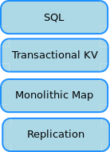

# The SQL layer in CockroachDB

This document provides an architectural overview of the SQL layer in
CockroachDB.  The SQL layer is responsible for providing the "SQL API"
that enables access to a CockroachDB cluster by client applications.

Original author: knz

## Prologue

**tl;dr: I prepared this because I know people prefer pictures.**

Prior to the existence of this document, high-level overviews of
CockroachDB would describe the architecture of CockroachDB using this
diagram:

More detailed presentations of the architecture during e.g. tech talks
would focus on the lower layers, where CockroachDB differentiates
itself most strongly from other SQL databases; the SQL layer would
usually be kept abstract.

Meanwhile, the source code of the SQL layer is growing. At currently
(March 2017) 142 kLOCs, it has become a larger source base than the
`kv` and `storage` packages combined (currently at 134 kLOCs).

There is a very stark contrast between its extremely narrow interface
area (described below), on the one hand, and the intricate network of
data and state dependencies between its internal components on the
other hand. This latter complexity has recently been growing too, due
both to a moderate case of feature creep and a large amount of changes
meant to fix functional and performance bugs.

This document "opens the black box" and (attempts to) provide a
high-level architectural overview of the state of affairs. This is
done with two main goals in mind:

- to enable newcomers in Q1-Q2 2017 to make sense of the existing code
  base, and to ease their onboarding;
- to enable and support much-needed discussions about how to keep this
  complexity under control, by giving name and shape to things
  not otherwise directly visible in the source code.

This document *complements* the prior document "Life of a SQL query"
by Andrei. Andrei's document is structured as an itinerary, where the
reader follows the same path as a SQL query and its response data
through the architecture of CockroachDB. This architecture document is
a top-down perspective of all the components involved side-by-side,
which names and describes the relationships between them. In short,
[Life of a SQL query](life_of_a_query.md) answers the question "what
happens and how" and this document answers the question "what are the
parts involved".

## Disclaimer / How to read this document

**tl;dr: there is an architecture, but it is not yet visible in the source code.**

In most state-of-the-art software projects, there exists a relatively
good correspondence between the main conceptual items of the overall
architecture (and its diagrams, say) and the source code.

For example, if the architecture calls out a thing called e.g. "query
runner", which takes as input a logical query plan (a data structure)
and outputs result rows (another data structure), you'd usually expect
a thing in the source code called "query runner" that looks like a
class whose instances would carry the execution's internal state, a
providing some methods that take a logical plan as input, and returning
result rows as results.

In CockroachDB's source code, this way of thinking does not apply:
instead, **CockroachDB's architecture is an emergent property of its
source code**.

"Emergent" means that while it is possible to understand the
architecture by reading the source code, the idea of an architecture
can only emerge in the mind of the reader after an intense and
powerful mental exercise of abstraction. Without this active effort,
the code just looks like a plate of spaghetti until months of grit and
iterative navigation and tinkering stimulates the reader's
subconscious mind to run through the abstraction exercise on its own,
and to slowly and incrementally reveal the architecture, while the
reader's experience builds up.

There are multiple things that can be said about this state of affairs:

- *this situation sounds much worse than it really is.* While the code
  is initially difficult to map to an overarching architecture, every
  person who has touched the code has made their best effort at
  maintaining good separation of responsibilities between different
  components. The fact that this document is able to reconstruct a
  relatively sane architectural model from the source code *despite
  the lack of explicit overarching architectural guidelines so far* is
  a testament to the quality of said source code and the work of all
  past and current contributors.

- nevertheless, *it exerts a high resistance against the onboarding of
  new team members*, and *it constitutes an obstacle to the formation
  of truly decoupled teams*. Let me explain.

  While our "starter projects" ensure that new team members get
  quickly up to speed with our engineering *process*, they are rather
  powerless at creating any high-level understanding whatsoever of how
  CockroachDB's SQL layer really works.  My observations so far
  suggest that onboarding a contributor to CockroachDB's SQL code such
  that they can contribute non-trivial changes to any *part* of the
  SQL layer requires four to six months of incrementally complex
  assignments over *all* of the SQL layer.

  The reason for this is that (until this document was written) the
  internal components of the SQL layer were not conceptually isolated,
  so one had to work with all of them to truly understand their
  boundaries. By the time any good understanding of any single
  component could develop, the team member would have needed to look
  at and comprehend every other component. And therefore teams could
  not maintain strong conceptual isolation between areas of the source
  code, for any trainee would be working across boundaries all the
  time.

- finally, *this situation is changing, and will change further.* As
  the number of more experienced engineers grows, more of us are
  starting to consciously realize that this situation is untenable and
  that we must start to actively address complexity growth and the
  lack of internal boundaries. Me authoring this document serves as
  witness to this change of winds. Moreover, some feature work
  (e.g. concurrent execution of SQL statements) is already motivating
  some good refactorings by Nathan, and more are coming on the
  horizon. Ideally, this entire "disclaimer" section in this
  architecture document would eventually disappear.

There is probably space for a document that would outline how we
*wish* CockroachDB's SQL architecture to look like; this is left as an
exercise for a next iteration, and we will focus here on recognizing
what is there without judgement.

In short, the rest of this document is a **model**, not a specification.

Also, several sections have a note "Whom to ask for details". This
reflects the current advertised expertise of several team members, so
as to serve as a possible point of entry for questions by newcomers,
but **does not intend to denote "ownership"**: so far I know, we don't
practice "ownership" in this part of the code base.

## Overview

Without futher ado, here is an architectural diagram
of CockroachDB's current SQL layer:

(Right-click then "open image in new window" to zoom in and keep the
diagram open while you read the rest of this document.)

### Main component groups

There are overall five main component groups:

- **pgwire**: the protocol translator between clients and the executor;

- the SQL **front-end**, responsible for parsing,
  desugaring, free simplifications and semantic analysis; this
  comprises the two blocks "Parser" and "Expression analysis" in the
  overview diagram.

- the SQL **middle-end**, responsible for logical planning and
  optimization; this comprises the two blocks "(plan constructors)"
  and "Logical optimizer" in the overview diagram.

- the SQL **back-end**, of which there are actually two:
  - the distSQL back-end, itself comprised of its own physical
    planner, optimizer and runner, able to process any statement/query
    *for which a distSQL plan can be constructed*;
  - the **local runner**, responsible for everything else.

- the **executor**, which coordinates between the previous four things
  and the **session** object.

The way this is connected (overall) can be modeled thus:

The three "auxiliary" components / component groups are the **lease
manager**, the **schema change manager** and the **memory
monitors**. Although they are auxiliary to the main components above,
only the memory monitor is relatively simple -- a large architectural
discussion would be necessary to fully comprehend the complexity of
SQL leases and schema changes. An outline is provided below.

### Boundary interfaces

There are two main interfaces between the SQL layer and its "outside world":

- the **network SQL interface**, for clients connections that want to speak SQL (via pgwire);
- the **transactional KV store**, CockroachDB's next high-level abstraction layer;

I call these "main" interfaces because they are fundamentally
necessary to provide any kind of SQL functionality. Also they are
rather conceptually *narrow*: the network SQL interface is more or
less "SQL in, rows out" and the KV interface is more or less "KV ops
out, data/acks in".

In addition, there exist also a few interfaces that are a bit less visible and
emerge as a side-effect of how the current source code is organized:

- the **distSQL flows** to/from "processors" running locally and on other nodes.
  - these establish their own network streams (on top of gRPC) to/from other nodes.
  - the interface protocol is more complex: there are sub-protocols to set up
    and tear down flows; managing errors, and transferring data between processors.
  - distSQL processors do not access most of the rest of the SQL code;
    the only interactions are limited to expression evaluation (a
    conceptually very small part of the local runner) and accessing
    the KV client interface.

- **the distSQL query planner also talks directly to the distributed storage layer**
  to get *locality information* about which nodes are leaseholders for which ranges.
  
- **the APL/CCL interface,** which aims to augment the functionality
  of the APL code if and only if the CCL code is also compiled
  in. This interface has many points where the CCL code "hooks itself"
  into the common (APL) code. This is outlined below.

- **the internal SQL interface**, until recently called "internal
  executor" (this name will hopefully be phased out soon), by which other
  components of CockroachDB can use the SQL interface to access lower
  layers without having to open a pgwire connection.
  The users of the internal interface include:
  - within the SQL layer itself, the **lease manager** and the
    **schema change manager**, which are outlined below,
  - the admin RPC endpoints, used by CLI tools and the admin web UI.
  - outside of the SQL layer: metrics collector (db stats), database
    event log collector (db/table creation/deletion etc), etc

- **the memory monitor interface**; this is currently technically in
  the SQL layer but it aims to regulate memory allocations across
  client connections and the admin RPC, so it has global state
  independent of SQL and I count it as somewhat of a fringe component.

- **the event logger**: this is is where the SQL layer saves details
  about important events like when a DB or table was created, etc.

## pgwire

(This is perhaps the architectural component that is the most
recognizable as an isolated thing in the source code.)

**Roles:**

- primary: serve as a **protocol translator** between network clients
  that speak pgwire and the internal API of the SQL layer.
- secondary: **authenticate** incoming client connections.

**How:**

Overall architecture: event loop, one per connection (in separate
goroutines, `v3Conn.serve()`). Get data from network, call into
executor, put data into network when executor call returns, rinse,
repeat.

**Interfaces:**

- The network side (`v3Conn.conn` implementing `net.Conn`): gets bytes
  of pgwire protocol in from the network, sends bytes of pgwire
  protocol out to the network.

- memory monitor (`Server.connMonitor`): pre-reserves chunks of memory
  from the global SQL pool (`Server.sqlMemoryPool`), that can be
  reused for smallish SQL sessions without having to grab the global
  mutex.

- `Session`: pgwire allocates and initializes the `sql.Session` object
  (`setupSession`) once the connection is authenticated. This is
  before any SQL traffic begins.

- Executor: pgwire calls into the executor API to deliver incoming
  "prepare" requests (`session.PreparedStatements.New()`), "execute"
  requests (`exec.ExecuteStatements()`), and COPY data packets
  (`exec.CopyData`/`CopyDone`/`CopyEnd`). The executor API calls
  return results back to pgwire to be translated to response packets
  towards the client.

Code lives in `sql/pgwire`.

**Whom to ask for details:** mattj, jordan, alfonso, tamir, nathan.

## SQL front-end

This part has two relatively independent components and one
component intertwined with the middle end:

1. the "Parser" (really: lexer + parser), in charge of **syntactic
   analysis**.
2. **expression semantic analysis**, including name resolution,
   constant folding, type checking and simplification.
3. **statement semantic analysis** (that's the one intertwined),
   including e.g. existence tests on the target names of schema change
   statements.

Reminder: "semantic analysis" as a general term is the phase in
programming language transformers where the compiler determines if the
input *makes sense*.  The output of semantic analysis is thus
conceptually a yes/no answer to the question "does this make sense"
and the input program, optionally with some annotations.

### Syntactic analysis

**Role:** transform SQL strings into syntax trees.

**Interface:**

- SQL string in, AST (Abstract Syntax Tree) out.
- mainly `Parser.Parse()` in `sql/parser/parse.go`.

**How:**

The code is a bit spread out but quite close to what every textbook
suggests.

- `Parser.Parse()` really:
  - creates a LL(2) lexer (`Scanner` in `scan.go`)
  - invokes a go-yacc-generated LALR parser using said scanner (`sql.go`
    generated from `sql.y`)
    - go-yacc generates LALR(1) logic, but SQL really needs LALR(2)
      because of ambiguities with AS/NOT/WITH; to work around this,
      the LL(2) scanner creates LALR(1) pseudo-tokens marked with
      `_LA` based on its 2nd lookahead.
  - expects either an error or a `Statement` list from the parser,
    and returns that to its caller.

- the list of tokens recognized by the lexer is automatically
  derived from the yacc grammar (cf. `sql/parser/Makefile`)

- many AST nodes!!!
  - until now we have wanted to be able to pretty-print the AST back
    to its original SQL form or as close as possible
    - no good reason from a product perspective, it was just
      useful in tests early on so we keep trying out of tradition
    - so the parser
      doesn't desugar most things (there can be `ParenExpr` or
      `ParenSelect` nodes in the parsed AST...)
    - except it does actually desugars some things like
      `TRIM(TRAILING ...)` to `RTRIM(...)`.
  - too many nodes, really, a hell to maintain. "IR project" ongoing
    to auto-generate all this code.

- AST nodes have a slot for a type annotation, filled
  in the middle-end (below) by the type checker.

**Whom to ask for details**: pretty much anyone.

### Expression semantic analysis

**Role:** check AST expressions are valid, do some preliminary
optimizations on them, provide them with types.

**Interface:**

- `Expr` AST in, `TypedExpr` AST out (actually: typed+simplified
  expression)
- via `analyzeExpr()` (`sql/analyze.go`)

**How:**

1. `sql.replaceSubqueries()`: replace `parser.Subquery` nodes by
   `sql.subquery` nodes (and performs some checks on them).
2. `sql.resolveNames()`: replaces column names by `parser.IndexedVar`
   instances, replaces function names by `parser.FuncDef` references.
3. `parser.TypeCheck()`/`parser.TypeCheckAndRequire()`:
   - performs constant folding;
   - performs type inference;
   - performs type checking;
   - memoizes comparator functions on `ComparisonExpr` nodes;
   - annotates expressions and placeholders with their types.
4. `parser.NormalizeExpr()`: desugar and simplify expressions:
   - for example, `(a+1) < 3` is transformed to `a < 2`
   - for example, `-(a - b)` is transformed to `(b - a)`
   - for example, `a between c and d` is transformed to `a >= c and a <= d`
   - the name "normalize" is a bit of a misnomer, since
     there is no real normalization going on. The historical
     motivation for the name was the transform that tries hard
	 to pull everything but variable names to the right of comparisons.

The implementation of these sub-tasks is *nearly* purely
functional. The only wart is that `TypeCheck` spills the type of SQL
placeholders (`$1`, `$2` etc) onto the semantic context object passed
through the recursion in a way that is order-sensitive.

Note: it's possible to inspect the expressions without desugaring and
simplification using `EXPLAIN(EXPRS, NONORMALIZE)`.

**Whom to ask for details:**

- `replaceSubqueries`: knz
- `resolveNames`: knz
- `TypeCheck`: nathan, jordan, knz
- `NormalizeExpr`: peter, radu, nathan, knz

### Statement semantic analysis

**Role:** check that SQL statements are valid.

**Interface:**

- There are no interfaces here, unfortunately. The code for statement
  semantic analysis is currently interleaved with the code to construct the
  logical query plan.
- This does use (call into) expression semantic analysis as described above.

**How:**

- *check the existence of databases or tables* for statements that
  assume their existence
  - **this interacts with the lease manager to access descriptors**
- *check permissions* for statements that require specific privileges.
- *perform expression semantic analysis* for every expression used by
  the statement.
- *check the validity of requested schema change operations* for DDL
  statements.

**Code:** interleaved in the `planNode` constructors, which really belong
to the SQL middle-end components described in the next section.

**Whom to ask for details:** there's no single point of expertise
currently able to talk about the commonalities of "statement semantic
analysis". Instead, each author working on a specific `planNode` has
made due diligence to follow the general checks made by other
`planNodes`.

(It's not foolproof though, and it's rather likely that some
statements are not fully checked semantically or not in the same order
as others -- which can/would/will/do result in inconsistent error
messages in case of semantic errors by client applications).

## SQL middle-end

Two things are involved here:

- **logical planner**: transforms the annotated AST into a
  logical plan.
- **logical plan optimizer**: makes the logical plan better.

### Logical planner

**Role:** turn the AST into a logical plan.

**Interface:**  `prepare()` and `newPlan()` in `sql/plan.go`.

**How:**

- in-order depth-first recursive traversal of the AST;
- invokes semantics checks on the way;
- constructs `planNode` instances on the way back from the recursion;
  - or results in an error if some semantic check fails;
- the resulting `planNode` tree *is* the logical plan.

Note: some statements are not really translated to a logical plan,
like `SET`. I call them *"immediate"*. These are executed (ran)
immediately in `newPlan()` after semantic checking, and result in an
"empty plan" from the perspective of the code using the logical
planner. The `prepare()` interface exists so that these statements are
ignored during SQL prepare, but this in turn also means that a SQL
prepare operation is unable to run semantic checks on immediate
statements.

**Code:** the various `planNode` constructors in the `sql` package.

**Whom to ask for details:** like for semantic checks, there's no
single point of expertise currently able to talk about the commonalities of
logical plan construction. Some areas of expertise have emerged:

- `scanNode`: radu, andrei;
- interaction between `renderNode`/`filterNode`/`groupNode`: radu, knz;
- `windowNode`: nathan;
- `sortNode`: radu, nathan, knz;
- `copyNode`: mattj;
- `updateNode`/`insertNode`/`upsertNode`/`deleteNode`: peter, danhhz, dt;
- `create*Node`, `alter*Node`: dt, vivek, danhhz;
- the others: a bit everyone who ever worked in the `sql` package.

### Logical plan optimizer

**Role:** make queries run faster.

**Interface:** `optimizePlan()` takes a logical plan as input and
returns an optimized logical plan.

Note: `makePlan()` (`plan.go`) calls `newPlan()` (see above) then
`optimizePlan()`.

Note 2: it's possible to inspect a logical plan without optimizing it
using `EXPLAIN(NOOPTIMIZE,NOEXPAND)`.

**How:**

1. `setNeededColumns()`: mark result columns as needed throughout the
   plan (and mark the non-needed columns as unneeded, which avoids
   their computation).
2. `triggerFilterPropagation()`: seee
   https://www.cockroachlabs.com/blog/better-sql-joins-in-cockroachdb/#optimizing-query-filters
3. `expandPlan()`:
   - `doExpandPlan()`: depth-first recursive traversal of the plan to:    
     - perform index selection and replace `scanNode`s with `indexJoinNode`s.
     - elide unnecessary `renderNode`s.
     - propagate limits.
     - annotate resulting orderings.
   - `simplifyOrderings()`: another traversal, to elide unneeded sort nodes.
4. `setNeededColumns()` again, to simplify the result of earlier optimizations
   further.
5. recursively apply `optimizePlan()` to every `sql.subquery` node in
   the plan's expressions.

The implementation of these sub-tasks is *nearly* purely
functional. The only wart is that it spills into the session whether
the current logical plan uses SQL stars (`select * from ...`), which
is needed by `CREATE VIEW` to spill out an error (because we don't
support SQL stars in views).

**Code:**

- `sql/optimize.go`: entry point
- `sql/filter_opt.go`: `triggerFilterPropagation`
- `sql/expand_plan.go`: `expandPlan`, `doExpandPlan`, `simplifyOrderings`
- `sql/index_selection.go`, `sql/analyze.go`: index selection
- `sql/needed_columns.go`: `setNeededColumns`

**Whom to ask for details:**

- `setNeededColumns`: radu
- `triggerFilterPropagation`: knz, radu, andrei
- `expandPlan`, index selection: radu, peter, knz
- subquery processing: knz

## SQL back-ends

CockroachDB currently implements two back-ends.

- the **local runner** is used by default, and always for statements
  that don't have a distributed implementation (e.g. CREATE TABLE,
  COPY).
- the **distSQL back-end** is used when `SET DISTSQL` is set to
  `auto`, `on` or `always`.

### Local runner

**Role:** run SQL statements on the SQL gateway node (the node where
pgwire is handling the client connection).

**Interface:**

- interface from the perspective of the executor:
  - conceptually: provide a logical plan as input, get row sets (or
    error status) as output.
  - concretely: the `Start()` and `Next()` methods of `planNode`.
- lower-level interface:
  - the **sql schema changer** for DDL statements;
  - the **client KV interface** for "leaf" plan nodes that access
    the database.
- towards the memory monitor: to account for intermediate results
  held in memory.

**How:**

- uses the Volcano execution model - see https://doi.org/10.1109/69.273032
  - each level's `Next()` recurses into sub-nodes to request rows, and returns
    result rows to the levels above
  - the executor uses the top node's `Next()` results to construct the final
	result set to return to the client.
- `Start()` is meant to run execution steps prior to the creation of
  the first result row. Some nodes (e.g. `deleteNode()`) can do all
  their work in `Start()`.
- *can run all statements*
- fully sequential execution per statement

From a software engineering perspective, it's a little weird to make
`Start()` and `Next()` *methods* of the data structure they are really
consuming as input (the logical plan) but not otherwise
modifying. It's also weird and rather unfortunate that the internal
execution state of the local runner is also carried as attributes of
the logical plan, because this means the logical plan nodes must
allocate space for it even when the local runner is not used.

These shortcomings are an artifact from an earlier time where there
was no conceptual separation between constructing the logical plan and
running it, and *all* operations using `planNode`s were implemented as
`planNode` methods.  We're moving (slowly) away from that; eventually
`Next()` and `Start()` will be detached too and the local runner's
internal state will sit in separate data structures.

**Code:** the `Start()` and `Next()` methods of all `planNode`s.

**Whom to ask for details:** the authors of the respective methods.

### SQL Expression evaluator

This is conceptually a part of the local runner, but is well
encapsulated in the `Eval()` method of `Expr` nodes and is used
independently by distSQL processors, so it deserves its own
sub-section here.

**Role:** `TypedExpr` in, `Datum` out.

**Interface:** `TypedExpr.Eval()`.

**How:** depth-first in-order traversal of the expression tree,
returning values (`Datum`s) on the way back from the recursion.

**Code:** `pkg/sql/parser/eval.go`

**Whom to ask for details:** nathan, jordan, knz

### DistSQL back-end

**Role:** distribute the execution of queries and (some) statements

**Interface:** `distSQLPlanner.PlanAndRun()`: takes a logical plan as
input, produces results (or error) as output.

**How:**

This is rather complicated.

Overall query distribution is itself split into two phases:

- **physical planning** transforms the logical plan into a physical plan
  which determines which processors run on which node;
- the **distSQL runner** dispatches the work as distSQL "processors" on all
  nodes involved, manages the data "flows" and gathers the results.

See the distSQL RFC and "Life of a SQL query" for details.

Note: currently misses a connection to the memory monitor; allocations
by distSQL are still unchecked.

**Code:** `pkg/sql/distsql{plan,run}`

**Whom to ask for details:** radu, andrei, vivek, peter, arjun

## Executor

**Roles:**

- coordinate between the other components
- maintain the state of the SQL transaction
- maintain the correspondence between the SQL txn state and
  the KV txn state
- perform automatic retries of implicit transactions, or
  transactions entirely contained in a SQL string received from pgwire
- track metrics

**Interfaces:**

- from pgwire: `ExecuteStatements()`, `Prepare()`,
  `session.PreparedStatements.New()`/`Delete()`,
  `CopyData()`/`CopyDone()`/`CopyEnd()`;

- for the internal SQL interface: `QueryRow()`, `queryRows()`,
  `query()`, `exec()`;

- into the other components within the SQL layer: see the interfaces
  in the previous sections of this document;

- towards the memory monitor: to account for result set accumulated in
  memory between transaction boundaries;

**How:**

- maintains its state in the `Session` object;
- there's a monster spaghetti code state machine in `executor.go`;
- there's a monster "god class" called `planner`;
- it's a mess, and yet it works!

For more details, see [Life of a SQL query](life_of_a_query.md).

(This code has become unwieldy and is ripe for refactoring and
extensive re-documentation.)

**Whom to ask for details:** radu, nathan, andrei, tamir, peter, mattj

## The two big auxiliaries

### SQL table lease manager

This thing is responsible for leasing cached descriptors to the rest of SQL.

**Interface:**

- the lease manager presents an interface to "get cached descriptors"
  for the rest of the SQL code.

**Why:**

- we don't want to retrieve the schema descriptors using KV in every
  transaction, as this would be slow, so we cache them.
- since we cache descriptors, we need a cache consistency protocol with
  other nodes to ensure that descriptors are not cached forever and
  that cached copies are not so stale as to be invalid when there are
  schema changes. The lease manager abstracts this protocol from
  the rest of the SQL code.

**How:**

It's quite complicated.

However the *state* of the lease manager is itself stored in a SQL
table `system.leases`, and thus internally the lease manager must be
able to issue SQL queries to access that table. For this, it uses the
internal SQL interface.  It's really like "SQL calling into itself".
The reason why we don't get "turtles all the way down" is that the
descriptor for `system.leases` is not itself cached.

Note that **the lease manager uses the same KV `txn` object as the
ongoing SQL session**, to ensure that newly leased descriptors are
atomically consistent with the rest of the statements in the same
transaction.

**Code:** `sql/lease.go`.

**Whom to ask for details:** vivek, dt, andrei.

### Schema change manager

This is is responsible for performing changes to the SQL schema.

**Interface:**

- "intentions" to change the schema are defined as **mutation records**
  on the various descriptors,
- once mutation records are created, client components can write the
  descriptors back to the KV store, however they also must inform
  the schema change manager that a schema change must start via
  `notifySchemaChange`.

**Why:**

Adding a column to a very large table or removing a column can be very long.
Instead of performing these operations atomically within the transaction
where they were issued, **CockroachDB runs schema changes asynchronously**.

Then asynchronously the schema change manager will process whatever
needs to be done, such as backfilling a column or populating an index,
using a sequence of separate KV transactions.

**How:**

It's quite complicated.

Unlike the lease manager, the current state of ongoing schema changes
is not stored in a SQL table (it's stored directly in the
descriptors); however the schema change manager is (soon) to maintain
an informational "job table" to provide insight to users about the
progress of schema changes, and that is a SQL table.

So like the lease manager, the schema change manager uses the internal
SQL interface, and we have another instance here of "SQL calling into
itself".  The reason why we don't get "turtles all the way down" is
that the schema change manager never issues SQL that performs
schema changes, and thus never issues requests to itself.

Also the schema change manager internally talks to the lease manager:
leases have to stay consistent with completed schema changes!

**Code:** `sql/schema_changer.go`.

**Whom to ask for details:** vivek, dt.

## Fringe interfaces and components

### Memory monitors

Memory monitors have a relatively simple role: remember how much
memory has been allocated so far and ensure that the sum of
allocations does not exceed some preset maximum.

To ensure this:

- monitors get initialized with the maximum value ("budget") they will support;
- other things register their allocations to their monitor using an "account";
- registrations can fail with an error "not enough budget";
- all allocations can be de-registered at once by calling `Close` on an account.

In addition a monitor can be "subservient" to another monitor, with
its allocations counted against both its own budget and the budget of
the monitor one level up. We (currently) use the following hierarchy
of monitor:

- root monitors:
  - `"sql"`, one for all pgwire connections: `pgwire.Server.sqlMemoryPool`
  - `"admin"`, one for all admin RPC commands: `adminServer.memMonitor`

- `"conn`" (`pgwire.Server.connMonitor`), to serve chunks of memory
  pre-registered from the `"sql"` monitor to the `"root"` monitor
  below, without needing to actually interact with the `"sql"` monitor
  (a sort of buffer, to reduce mutex contention);
  
- `"root"`, one per `Session` instance (`Session.mon`), hanging off
  one of the root monitors for pgwire and admin RPC commands, and
  completely standalone (i.e. unchecked) for uses of the internal SQL
  interface;
  
- `"session"`, one per `Session` instance (`Session.sessionMon`),
  hanging off `"root"`, for session-wide allocations like prepared
  statements and result sets;

- `"txn"`, one per `Session` instance (`Session.Txn.mon`), hanging off
  `"root"`, for txn-wide allocations like temporary rows sets.

**Code:** `util/mon`; more details in a comment at the start of
`util/mon/mem_usage.go`.

**Whom to ask for details:** andrei, knz

### The APL/CCL interface

- CCL components may "hook" into the executor between the parser and the
  logical planner.
- in this hook, they can hijack logical planning and provide their
  own logical plan using objects with custom CCL definitions but
  the same interface as other APL nodes.
- this is the way CCL components also provide their own local runner
  implementation, which is thus automatically selected to run
  CCL-specific statements.

**Whom to ask for details**: danhhz

