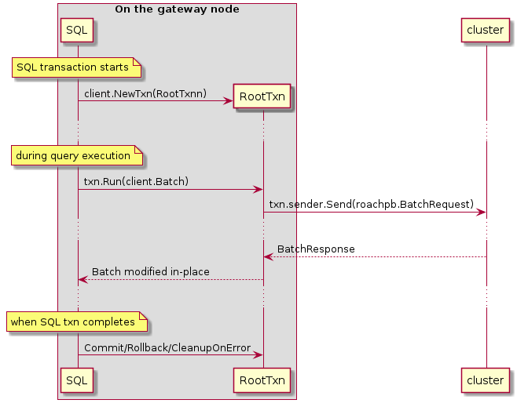
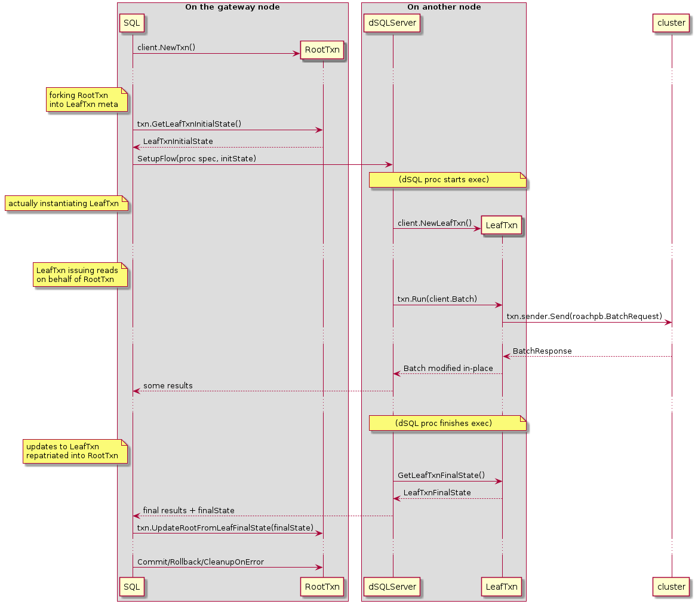
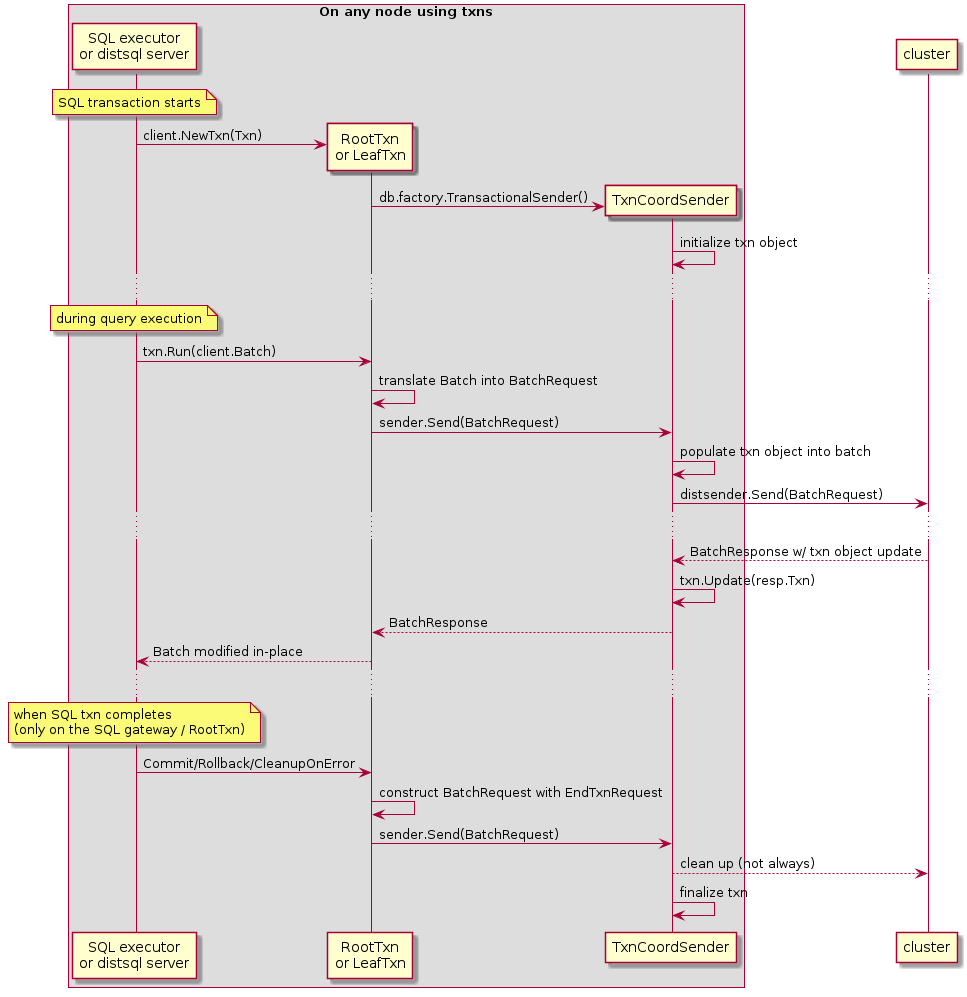
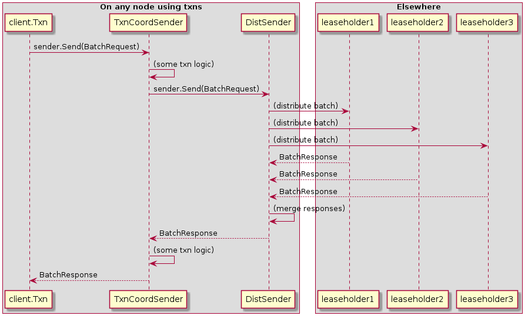
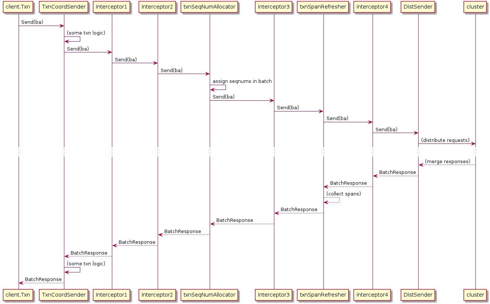
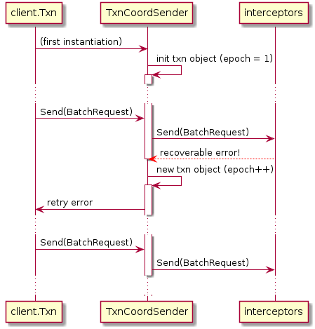
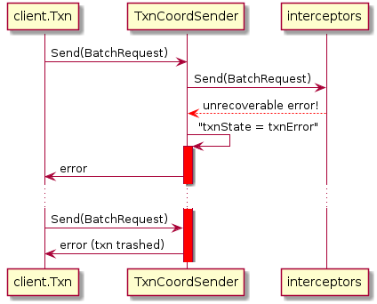
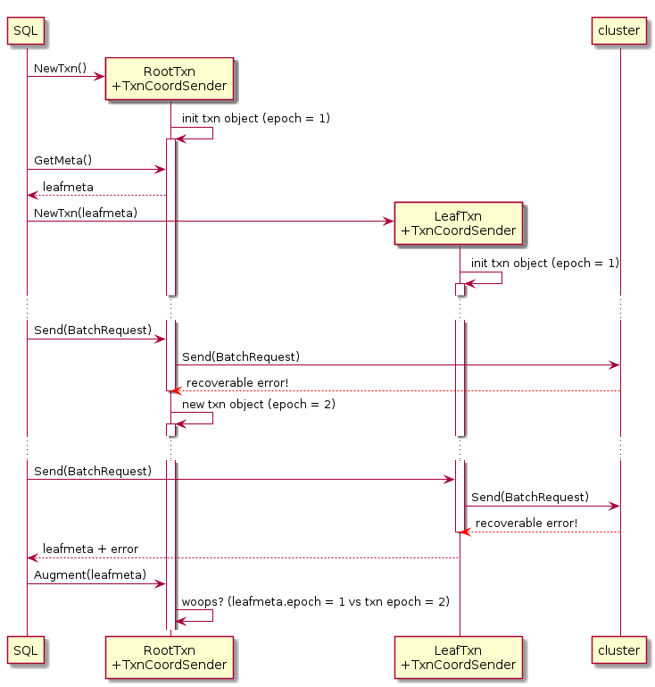

# Transactional interface between SQL and KV (and TxnCoordSender)

Original authors: knz, andrei

This tech note explains how the SQL/KV interface currently works, up
to the level of detail necessary to understand the processing of
batches, error handling and SQL savepoints, to understand bug findings
in this area and to participate in design discussions.

Table of contents:

- [Introduction](#Introduction)
- [client.Txn and RootTxns](#clientTxn-and-RootTxns)
- [LeafTxns and txn state repatriation](#LeafTxns-and-txn-state-repatriation)
- [client.Txn, meta and TxnCoordSender](#clientTxn-meta-and-TxnCoordSender)
- [Interceptors: between TxnCoordSender and DistSender](#Interceptors-between-TxnCoordSender-and-DistSender)
- [TxnCoordSender state](#TxnCoordSender-state)
- [Summary of the all-is-well path](#Summary-of-the-all-is-well-path)
- [Error handling in TxnCoordSender](#Error-handling-in-TxnCoordSender)
- [Error handling with LeafTxns](#Error-handling-with-LeafTxns)
- [Concurrency between root and leaf](#Concurrency-between-roof-and-leaf)
- [KV sequence numbers](#KV-sequence-numbers)
- [Seqnum consistency across TxnCoordSenders](#Seqnum-consistency-across-TxnCoordSenders)

## Introduction

CockroachDB's at a high level is architected into the following layers:

1. SQL (incl. pgwire, SQL state machine, planning and execution)
2. Transactional (YOU ARE HERE)
3. Distribution (incl. range leasing, rebalancing)
4. Replication (incl. Raft, replica lifecycle)
5. Storage (incl. engines: RocksDB, Pebble)

This tech note pertains to level 2 in this list and especially the
boundary between levels 1 and 2.

Conceptually, the "transactional layer" offers an API to the SQL layer
which enables it to consider the CockroachDB cluster as a
transactional KV store. The API offers ways to "define a KV
transaction" and "execute KV operations" (and get results and errors),
and maintains the lifecycle of KV transaction objects.

In particular, it is responsible for a number of optimizations relating
to transient fault recovery (incl. implicit/automatic retries inside
that layer, invisible to SQL) and transaction conflict resolution
(incl. implicit/automatic txn reordering by updating timestamps).

Its other boundary, between levels 2 and 3 above, is another API
offered by level 3 called `DistSender`.  That level also allows the
levels above it to "execute KV operations" but it has very little
logic for error recovery and does not maintain KV transaction state
itself. (In fact, the levels 3 and below are mostly state-less with
regards to SQL client connections. The transactional layer is the last
level that manages internal state on behalf of a single SQL client.)

The transactional layer's role is thus to *translate* requests coming
from above (SQL) to go below (DistSender), performing optimizations
and error recovery during that process.

Since the interactions are relatively complex, the remainder of the
tech note introduces the concepts incrementally. The explanations at
the beginning are thus somewhat inaccurate, merely providing an upramp
to understanding for the reader.

Interestingly, in the context of the transactional layer, the word
**"client"** designates the local SQL layer (e.g. a SQL executor or a
distsql processor), not the remote client app. Likewise, the word
**"server"** designates the local `DistSender` on each node, not the
CockroachDB node as a whole.  This differs from the terminology in
each other layer. For example, in SQL: "client" = remote client app,
"server" = gateway or distsql execution server; in replication:
"client" = layer 2, "server" = leaseholder for some range.  Depending
on the reader's own technical background, some caution will be needed
while reading the rest of this tech note.

## client.Txn and RootTxns

The first two actors in this explanation are:

- the SQL executor, which organizes the state of the SQL transaction
  and the sequencing of statements on the gateway.
- a transaction object called "RootTxn" (the name will be motivated
  later), that exists on the SQL gateway, and which stores the "main"
  state of the SQL/KV transaction - for example whether it's aborted,
  waiting for a client-side retry, etc.

A simplified view of the interaction between the two is as follows:

- the SQL executor instantiates an object of Go type `*client.Txn` with
  its type set to `RootTxn` (hence the name)
- during query execution, the SQL exec code (on the gateway, we ignore
  distributed execution for now) uses the `Run()` method on that
  object to run KV operations.
- "under the hood" the RootTxn translates the Run() calls into
  BatchRequests into the cluster, and translates the
  BatchResponses back into updates into the `client.Batch` object
  provided by the SQL code.
- at the end of the SQL transaction (either commit or rollback, or
  close on error), a call is made to the RootTxn to
  finalize its state.

## LeafTxns and txn state repatriation

When a query becomes distributed, we want other nodes to be able to
run KV operations "on behalf" of the main SQL transaction running on
the gateway. This needs the same txn ID, timestamp, list of write
intents, etc, so we can't just create a fresh new RootTxn on each node
where a distsql processor runs.

Instead, there is some new complexity, involving three new actors:

- one or more distSQL servers running on other nodes than the
  gateway, which receive requests from the gateway to execute
  work on behalf of a SQL session running there.
- distSQL units of work, called "flows", which are specified
  to run some processing code and, relevant here, operate
  using...
- ... another transaction object called "LeafTxn", which contains
  a copy of many fields of the original RootTxn and is
  able to run KV **read** operations.

This works as follows:

- the SQL executor instantiates the RootTxn as usual.
- when a distributed query is about to start, the distsql
  execution code pulls out a struct from the RootTxn
  called "LeafTxnInputState". This contains e.g. the txn ID,
  timestamp and write intents as outlined above.
- the trimmed meta struct is sent along with the flow
  request to a remote distsql server.
- on the other node, the distsql server instantiates the
  `LeafTxn` object using the provided meta struct as input.
- the distsql processor(s) (e.g a table reader) then uses
  the LeafTxn to run KV batches.
- when query execution completes, the distsql processor
  extracts a similar state struct off the LeafTxn
  called `LeafTxnFinalState` and the
  result is repatriated on the gateway when the
  flow is shut down.
- on the gateway, repatriated LeafTxn state structs
  are merged into the RootTxn using `UpdateRootWithLeafFinalState()`.
- on the gateway, any error produced by a LeafTxn is also "ingested"
  in the RootTxn to perform additional error recovery and clean-up,
  using `UpdateStateOnRemoteRetryableErr()`.

Why do we need to bring back state from a LeafTxn into a RootTxn?

There are many uses for this data repatriation, not
all will be detailed further here.

One use which is good to explain why the repatriation is _necessary_
is that of refresh spans: as KV reads are issued by the LeafTxn, it
populates a list of refresh spans. If we did not repatriate these
spans, then a subsequent txn conflict check would not detect that
reads performed by the LeafTxn are stale and incorrectly decide to
refresh the txn (bump its commit ts into the future and retry
automatically, instead of pushing the error back to the client).

Another use of repatriation that's not strictly necessary but is
nevertheless a useful optimization, is the case when the transaction
is aborted concurrently (e.g. if a deadlock was detected by another
txn). If the KV reads done on behalf of the LeafTxn detect the txn
record to become aborted, this new state will be repatriated and the
RootTxn will know that the entire KV txn has become aborted.  This is
faster than letting the RootTxn discover this state later at the first
next KV operation launched on its behalf.

Related issues:
https://github.com/cockroachdb/cockroach/issues/41222
https://github.com/cockroachdb/cockroach/issues/41992

## client.Txn, meta and TxnCoordSender

The two sections above used a simplified picture using
a single "transaction object".

In truth, the [type
`*client.Txn`](https://github.com/cockroachdb/cockroach/blob/a57647381a4714b48f6ec6dec0bf766eaa6746dd/pkg/internal/client/txn.go#L32)
is merely a thin facade for the SQL client. It contains, between other things:

- a type tag (RootTxn/LeafTxn)
- a reference of [interface type
  `TxnSender`](https://github.com/cockroachdb/cockroach/blob/a57647381a4714b48f6ec6dec0bf766eaa6746dd/pkg/internal/client/sender.go#L57),
  which abstracts the `Send()` operation to send batch requests to the
  rest of the cluster.

In particular it does not contain the "main" txn payload including
commit timestamp, intents, etc.

Where is that payload then? Also, where are the refresh spans and
other in-flight txn properties stored?

The object referenced by `*client.Txn` is an instance of a coordinator
component called the "TxnCoordSender" of [type
`kv.TxnCoordSender`](https://github.com/cockroachdb/cockroach/blob/a57647381a4714b48f6ec6dec0bf766eaa6746dd/pkg/kv/txn_coord_sender.go#L104).

The TxnCoordSender (hereafter abbreviated TCS), as its name implies,
is in charge of maintaining the state of the txn at the top of the KV
layer, and is in charge of coordinating the distribution of KV batches
to layer underneath together with error handling, txn conflict
management, etc.

The TCS is also, itself, a rather thin data structure.

Its main payload is what the KV team actually calls the "txn object",
of [type
`roachpb.Transaction`](https://github.com/cockroachdb/cockroach/blob/a57647381a4714b48f6ec6dec0bf766eaa6746dd/pkg/roachpb/data.proto#L302),
which in turn also
[contains](https://github.com/cockroachdb/cockroach/blob/a57647381a4714b48f6ec6dec0bf766eaa6746dd/pkg/roachpb/data.proto#L310)
a copy of the "txn meta" object, of [type
`enginepb.TxnMeta`](https://github.com/cockroachdb/cockroach/blob/a57647381a4714b48f6ec6dec0bf766eaa6746dd/pkg/storage/engine/enginepb/mvcc3.proto#L18).

The separation of purpose between `roachpb.Transaction` and
`enginepb.TxnMeta` is not further relevant in this RFC, and we will just
call them collectively "the txn object".

With this in place, the interaction goes roughly as follows:

The txn object is sent along in the header of every `BatchRequest`
produced by TCS while it processes a `client.Batch` from
SQL or other KV clients. This is passed along the
transaction/replication/storage boundaries and the low-level MVCC code in
storage has access to (a sufficient part of) the txn object during
processing of each single KV operation.

Additionally, the execution of low-level KV operations can _update_
their copy of (parts of) the txn object. This will populate e.g.  the
list of observed timestamps, used for later txn conflict resolution.
The resulting txn state then flows back to TCS in the
header of every `BatchResponse`.  Upon receiving a BatchResponse, the
TCS *merges* the received txn object in the response with
the txn object it already has, using the `txn.Update()` method.

## Interceptors: between TxnCoordSender and DistSender

The explanation above suggested that TCS sends
BatchRequests to "the cluster".

In truth, "the cluster" is the entry point of the distribution layer,
the overall architectural layer immediately under the transaction
layer in CockroachDb.  Its entry point is an object called
[`DistSender`](https://github.com/cockroachdb/cockroach/blob/a57647381a4714b48f6ec6dec0bf766eaa6746dd/pkg/kv/dist_sender.go),
of which there is one instance per node.

The interface between TCS and DistSender is an interface
called `client.Sender` which defines a method `Send(BatchRequest)
(BatchResponse, error)`.

So _conceptually_, we have something like this in the code:

However, there's a little more complexity hidden in there. If we had a
direct call from `TCS.Send()` into `DistSender.Send()`,
then a single blob of code in TCS itself would need to deal
with all the complexity of txn pipelining, parallel commits, etc.

To facilitate reasoning about the code and to ease maintenance, the
txn management logic is split away from TCS itself, and
across multiple other components arranged in a _pipeline_ placed between
TCS and DistSender. Each stage of this pipeline is called
an "interceptor" and responsible for a single aspect of txn
coordination. Each also contains additional local state.

Two example interceptors that happen to be relevant to this RFC are:

- the
  [`txnSpanRefresher`](https://github.com/cockroachdb/cockroach/blob/a57647381a4714b48f6ec6dec0bf766eaa6746dd/pkg/kv/txn_interceptor_span_refresher.go#L103),
  which contains and manages the read and write refresh spans already
  mentioned above.
- the
  [`txnSeqNumAllocator`](https://github.com/cockroachdb/cockroach/blob/a57647381a4714b48f6ec6dec0bf766eaa6746dd/pkg/kv/txn_interceptor_seq_num_allocator.go#L58),
  which assigns [sequence numbers](#KV-sequence-numbers) to individual KV
  operations in batches.

Thus, in reality, the call stack looks more like this:

TCSs allocated for RootTxns use [the full pipeline of
interceptors (6 of them as of this
writing)](https://github.com/cockroachdb/cockroach/blob/a57647381a4714b48f6ec6dec0bf766eaa6746dd/pkg/kv/txn_coord_sender.go#L529),
whereas LeafTxns, which only handle read requests, use [only a
subset](https://github.com/cockroachdb/cockroach/blob/a57647381a4714b48f6ec6dec0bf766eaa6746dd/pkg/kv/txn_coord_sender.go#L556).

## TxnCoordSender state

The overall "current state" of a TCS is thus distributed
between various Go structs:

- the txn object (`roachpb.Transaction`),
- the set of its interceptors (each interceptor contains a portion of the txncoordsender state
  sufficient and necessary for its local processing),
- its "own" very few fields, including a summary of the lifecycle of
  the txn object called `txnState` (relevant to this RFC, we'll come
  back to this later).

This overall state is a native Go struct and not a protobuf. However,
[as we've seen above](#LeafTxns-and-txn-state-repatriation) distributed execution needs to take the
"current state" of a RootTxn and carry it over to another node to
build a LeafTxn.

For this purpose, a separate protobuf message `LeafTxnInputState` is
defined. The TCS's `GetLeafTxnInputState()` method initially populates
it by asking every interceptor in turn to write its portion of the
state into it.

Conversely, when the state of a LeafTxn is repatriated and to be
"merged" into the RootTxn, the `UpdateRootFromLeafFinalState()` method
uses the `Update()` method on the `roachpb.Transaction` sub-object
(which merges the state of the txn object itself) then asks every
interceptor, in turn, to collect bits of state it may be interested to
merge in too.

For example, that's where the RootTxn's txnSpanRefresher interceptor
picks up the spans accumulated in the LeafTxn.

## Summary of the all-is-well path

To summarize the previous sections, the SQL/KV interface
involves the following actors:

- a `client.Txn` object, which doesn't know much, other than...
- a reference to a `TCS`, which stores:
  - (a copy of) the current txn object incl `roachpb.Transaction` and `enginepb.TxnMeta`,
  - a set of txn interceptors, each with its own local state,
  - at the end of the interceptor pipeline, a reference to the local node's `DistSender` object,
  - a little additional TCS local state including a "txn status" field called `txnState`.

When a KV batch request arrives from SQL through `client.Txn`, it is
passed through TCS, the stack of interceptors, delivered to
DistSender, and the responses flow back up the same path.

Now on the next question: *What of errors?*

## Error handling in TxnCoordSender

For simplicity in this section, we'll start with the simple
case of a RootTxn without any LeafTxn.

When an error is encountered either in DistSender or "underneath"
(remote replicas etc), it flows back through the interceptors back
into the TCS's `Send()` method.

Some interceptors peek into the error object and update their local
state. Some of them (like the `txnSpanRefresher`) fully absorb the
error to turn it into a non-error.

Additionally, some interceptors can generate errors of their own
either "on the way in" (towards DistSender), which causes a shortcut
to the return path; or "on the way out" (alongside a BatchResponse).

When `(TCS).Send()` receives an error from the chain
of interceptors, it then separates between 7 kinds of errors, currently
split into three groups:

- sub-group 1: *same-TCS recoverable* errors, which cause the TCS to
  perform partial or full error recovery.

  This group contains 3 kinds of errors:

  1. *recoverable errors with in-place recovery*, where the TCS
     will handle the error internally, then retry the operation
     in a way that's invisible to the higher levels.
     In this case, the txn object remains "live" and
     its "identity" (ID, epoch) is unchanged.

     For example, txn refreshes are processed automatically
     in this way.

  2. *recoverable errors with txn restart*, where the
     TCS resets the txn object to a state where the
     client (the SQL layer) can restart the operation,
     or tell the client to attempt the operation again
     (client-side retries). In this case,
     the txn object remains "live" but its identity
     (epoch) changes immediately.

     Example sequence diagram in the case of a recoverable error with txn
     restart:

     

  3. *deferred retry errors*, where the TCS remember the error
     has occurred but pretends the operation succeeded for the benefit
     of the (SQL) client. The error is only reported at
     the end of the SQL txn, where the client is requested to
     perform a client-side retry.

	 This is currently used only for `WriteTooOldError`.

- sub-group 2: *new-TCS recoverable* errors, which cause the TCS to
  become "trashed" (and unusable), but where the `*client.Txn` can
  continue/restart with a new TCS:

  1. *retryable transaction aborts* (`TransactionRetryWithProtoRefreshError`
  with a `TransactionAbortedError` payload), which occurs when the KV
  transaction gets aborted by some other transaction. This happens in case of
  deadlock, or in case the coordinator fails to heartbeat the txn record for a
  few seconds and another transaction is blocked on one of our intents. Faux
  `TransactionAbortedErrors` can also happen for transactions that straddle a
  lease transfer (the new leaseholder is not able to verify that the transaction
  had not been aborted by someone else before the lease transfer because we lost
  the information in the old timestamp cache).

  For these errors, the TCS becomes unusable but the `*client.Txn`
  immediately replaces the TCS by a fresh one, see
  `UpdateStateOnRemoteRetryableErr()` and
  `replaceSenderIfTxnAbortedLocked()` in `client/txn.go`.

- sub-group 3: *unrecoverable* errors, which cause both the TCS and
  `*client.Txn` to become "trashed".

  This group contains 3 kinds of errors:

  1. *permanent transaction errors*, which
     occurs when the transaction encounters a permanent unrecoverable
     error typically due to client logic error (e.g. AOST read under GC).

  2. *transient processing errors*, for which it is certain that
     further processing is theoretically still possible after
     the error occurs. For example, attempting to read data using
     a historical timestamp that has already been garbage collected,
    `CPut` condition failure, transient network error on the read path, etc.

  3. *unhandled errors*, for which it is not certain that further
     processing is safe or sound (or where we haven't yet proven that
     it is). For example, "ambiguous result" errors, "store
     unavailable" and internal assertion errors fall in this category.

  When an unrecoverable error occurs, the TCS changes its `txnState` to
  `txnError`. After this happens, any further attempt to use the
  TCS will be rejected without even attempting further
  processing. At the SQL level, this is then recognized as a forced txn
  abort after which only ROLLBACK is accepted (or where COMMIT will
  produce a "txn is aborted" error).

  Example sequence diagram in the case of an unrecoverable error:

  

Summary table:

| Group                | Error kind                         | Example                                    | Current recovery                                          |
|----------------------|------------------------------------|--------------------------------------------|-----------------------------------------------------------|
| same-TCS recoverable | recoverable with in-place recovery | `ReadWithinUncertaintyIntervalError`       | internal auto retry, txn identity preserved               |
| same-TCS recoverable | recoverable with txn restart       | commit deadline exceeded error             | tell client to retry, reset txn object to new epoch       |
| same-TCS recoverable | deferred retry                     | transaction push, write too old (?)        | store error state, reveal retry error only at commit time |
| new-TCS recoverable  | retryable txn aborts               | transaction aborted by concurrent txn      | TCS becomes unusable but `client.Txn` can resume          |
| unrecoverable        | non-retryable txn aborts           | read under GC threshold                    | hard fail, TCS becomes unusable                           |
| unrecoverable        | transient processing errors        | CPut condition failure                     | hard fail, TCS becomes unusable (see below)               |
| unrecoverable        | unhandled errors                   | store unavailable error, assertion failure | hard fail, TCS becomes unusable                           |

The keen reader may wonder why transient processing errors cause the txn
object and the TCS to become unusable. Indeed, there is no good reason
for that. It is actually poor design, as a SQL client may legitimately want
to continue using the txn object after detecting a logical error (eg
duplicate row) or transient error (eg network connection reset). **This
is to change with the introduction of savepoints.**

Another important aspect of "recoverable errors with txn restart" and
"retryable txn aborts", which will become more noteworthy below, is
that the txn object stored inside the TCS may become different "on the
way out" (back to client.Txn and the SQL layer) from what it was "on
the way in". It is currently the responsibility of the client (SQL
layer), which may have its own copy of the txn object, to pick up this
change. Cross-references on this point:

- `(*client.Txn) UpdateStateOnRemoteRetryableErr()`
- `(*DistSQLReceiver) Push()` -- `roachpb.ErrPriority(meta.Err) > roachpb.ErrPriority(r.resultWriter.Err())`

## Some additional wisdom by Tobias

> Whenever we extract information from an error that counts as a read,
> we have to make sure that read is accounted for by the KV store. For
> example, a ConditionFailedError from a CPut is in fact a successful
> read; if this isn't accounted for properly at the KV layer (timestamp
> cache update), there will be anomalies (CPut has code to do exactly
> that here). I generally find it unfortunate that we're relying on
> errors to return what are really logical results, and I hope that we
> buy out of that as much as we can. For CPut, for example, we'd have
> `ConditionalPutResponse` carry a flag that tells us the actual value and
> whether a write was carried out. I suspect we're using errors for some
> of these only because errors eagerly halt the processing of the
> current batch.  Continuing past errors generally needs a good amount
> of idempotency (for example, getting a timeout during a CPut and
> retrying the CPut without seqnos could read-your-own-write). We had no
> way of doing that prior to the intent history and seqnos.

> By the way, in case you haven't stumbled upon this yet, the txn span
> refresher (an interceptor inside TCS) has a horrible contract with
> `DistSender`, where DistSender returns a partially populated
> response batch on errors, from which the refresher then picks out
> spans for its refresh set. I'm wondering how this hasn't backfired
> yet.

## Concurrency between root and leaf

Today, it is not valid (= KV/SQL protocol violation) to perform KV
operations using LeafTxns concurrently with a RootTxn,
or use multiple RootTxns for the same txn object side-by-side.

Note that while the SQL code is architected to take this restriction
into account, *it is not currently enforced on the KV side*. We
sometimes see bugs (eg #41222 / #41992) occuring because we do not
have infrastructure in place to detect violations of this restriction.

This restriction exists for 3 reasons, one of them actually invalid
(a flawed past understanding):

- KV writes must be uniquely identified, for txn pipelining. Since the
  identification is currently performed using a single counter in the txn
  object, there cannot be more than one TCS using this counter at a time.

  Today only RootTxn can process KV writes, so this restricts
  write concurrency to just 1 RootTxn. Even if LeafTxns had enough
  complexity to process writes, concurrency would be limited by this
  counter, until/unless we can guarantee that two separate TCSs
  generate separate operation identifiers.

  (For example, by combining sequence bits with a TCS ID.)

  Tobias notes:

  > I wonder if we also need their read/write spans to be
  > non-overlapping. There's all sort of weird stuff if they do
  > overlap, though maybe it's not actually illegal. Either way, not
  > something we're going to do today or tomorrow.

- RootTxns update the txn object during error processing (see previous section).

  If we let the RootTxn process operations and perform error recovery
  while a LeafTxn is active, we'd need to answer difficult questions.

  Consider the following sequence:

  

  In this situation, at t1 the RootTxn handles a retriable error
  by preparing the next client retry attempt via a new txn object,
  then at later instant t2 is augmented by a LeafTxn whose
  state was part of its "past" using the original txn object.
  How to combine the states from the two "generations" of the txn object?

  To avoid this situation altogether, any use of a LeafTxn
  comes with a requirement to not use the RootTxn at all
  while the LeafTxn is active.

- (Mistaken) Expectation that distributed reads are able to observe
  concurrent writes on other nodes.

  The KV read and write operations are mutually ordered using seqnums.
  If we were to expect that a read is able to observe a write
  performed on a separate node, it would be necessary to synchronize
  seqnums across nodes for every KV write. This is neither practical
  nor currently implemented.

  This restriction currently mandates that there be no LeafTxn active
  while KV writes are being processed by a RootTxn.

  (The restriction is lifted by observing that the expectation is
  invalid: PostgreSQL semantics require that all reads performed by a
  mutation statement observe the state of the db prior to any
  write. So there is no requirement of read-the-writes inside a single
  SQL statement. The current crdb behavior actually is a bug, our
  [current halloween
  problem](https://github.com/cockroachdb/cockroach/issues/28842).
  Since LeafTxns are re-generated across SQL statements, it's trivial
  to get the right semantics without a restriction on LeafTxn/RootTxn
  concurrency.)

The astute reader may wonder how distSQL deals with the requirement
that no LeafTxn be active while a RootTxn is active, or no RootTxn be
active while LeafTxns are active. To make this happen there is code in
the distsql planner to select whether to use _either_ multiple
LeafTxns, one per node / distsql processor, _or_ a single RootTxn,
shared by all distsql processors (and forces them to run on the
gateway, serially using a single goroutine) (also, this code has bugs.
See eg issues #41222 / #41992).

## KV sequence numbers

At the SQL/KV interface, KV operations are associated with *sequence numbers* (seqnums):

- write operations generate new seqnums, which are stored inside write
  intents.
- read operations operate "at" a particular seqnum: a MVCC read that
  encounters an intent ignores the values written at later seqnums
  and returns the most recent value prior to that seqnum instead.
- combined read/write operations, like CPut, operate their read part
  at their write seqnum - 1.

Today the TCS (the component that receives KV request batches from
SQL) is responsible for generating seqnums.

The seqnum counter's current value is split between three locations:

- a local variable in one of the interceptors, called `txnSeqNumAllocator` inside the TCS;
- the `enginepb.TxnMeta` record, inside the `roachpb.Transaction` held inside the `LeafTxnInputState`.
- the `enginepb.TxnMeta` record, inside the `roachpb.Transaction` held inside the header of every executed KV batch.

These three values are synchronized as follows:

- The interceptor's counter is incremented for every KV write operation,
  and the current counter value (with or without increment) is copied to
  the `Sequence` field in the *request header* of every KV operation
  flowing through the interceptor. This ensures that:

  - every write gets a new sequence number.
  - every read gets a copy of the seqnum of the last write.
- The `Sequence` field in the request header of individual KV
  operations is also copied to same-name field in `TxnMeta` of the
  batch header in certain circumstnaces (most notably by another later
  interceptor, the `txnPipeliner`) for use during txn conflict
  resolution and write reordering.
- When a TCS is instantiated from a LeafTxnInputState (e.g. forking a
  RootTxn into a LeafTxn), the counter value from the TxnMeta inside the LeafTxnInputState
  is copied into the interceptor.
- When a LeafTxnInputState is constructed from a TCS, the value is copied
  from the interceptor.

Final note: the seqnum is scoped to a current txn epoch. When the
epoch field is incremented, the seqnum generator resets to 0. The
overall ordering of operation thus also needs to take the epoch into
account.

## Seqnum consistency across TxnCoordSenders

The current code was designed with the assumption that a single TCS
can issue writes and assign new seqnums to requests.

Today the code is organized to use only a single RootTxn (and no LeafTxns) for
SQL statements that perform writes, so that anything that may
update the seqnum ends up running sequentially in a single goroutine.

It's interesting to consider how this would with LeafTxns if
we were to relax the restriction and allow multiple readers
with one writer.

The main mechanism that helps is that without writes, a TCS will
continue to assign the same seqnum to every read. A LeafTxn forked
from a RootTxn will thus continue to use the seqnum last generated by
the RootTxn before it was forked.

So if we have a SQL sequence like this:

1. UPDATE
2. SELECT

and the SELECT is distributed with LeafTxns, all the read requests
performed on its behalf by other nodes will use the last (epoch, seqnum)
generated for UPDATE and thus be able to "observe the writes".

The astute reader can then consider what happens for the UPDATE
itself. What if the UPDATE itself happens to be distributed, with some
LeafTxns on other nodes running the "read part" of the UPDATE,
and the RootTxn on the gateway issuing the KV operations?

Here it would also work, as follows:

- at the beginning of the UPDATE's execution, _before any writes have
  been issued_, the UPDATE's LeafTxn are forked. This ensures that any
  further distributed reads by the UPDATE will be using the last
  (epoch, seqnum) generated by the statement _before_ the UPDATE.
- during the UPDATE's execution, the RootTxn increments its counter
  to perform the mutation. This increase remains invisible
  to the update's LeafTxns.

By ensuring that the read path only sees the writes prior to the
seqnum at the start of execution, it will be unaffected by subsequent
writes. This solves crdb's [current halloween
problem](https://github.com/cockroachdb/cockroach/issues/28842).

