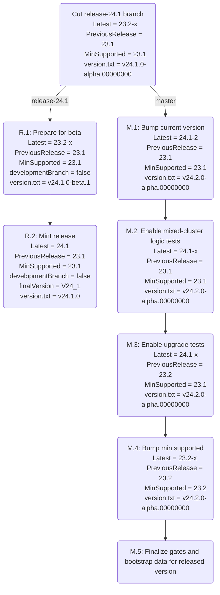

Cluster versions
---

# Introduction

TODO(radu): move most of the documentation from clusterversion.go.

# Runbooks

This section contains runbooks for the necessary steps associated with releasing
new versions.

## Overview

The graph below shows the steps that have to be taken to release a new version
and update master for the following version. We use the example of releasing
24.1 (in the line of releases 23.1, 23.2, 24.1, 24.2).



## Release branch changes

The changes below happen directly on the release branch (and only on that
branch). They are not normal backports of changes from `master`.

### R.1: Prepare for beta

**What**: This change prepares the branch for releasing the initial beta. The
first beta is special because starting with this version we allow production
clusters from the previous version to be upgraded to the beta version; and,
consequently, we allow and support upgrading from the beta cluster version to
the final release cluster version. This transition is achieved by setting
`developmentBranch` to `false`; see `developmentBranch` and `DevOffset` in the
code for more details.

**When**: When we are ready to select the first beta candidate.

**Checklist**:
 - [ ] Set `developmentBranch` constant to `false`
 - [ ] Update `version.txt` to the beta version, e.g. `24.1.0-beta.1`
 - [ ] Regenerate docs (`./dev gen docs`)
 - [ ] Regenerate expected test data results as needed

**Example PR:** [#113912](https://github.com/cockroachdb/cockroach/pull/113912)

### R.2: Mint release

**What**: This change finalizes the cluster version for the release.

**When**: When we are absolutely sure that we no longer need additional version
gates - right before the final RC at the latest.

**Checklist**:
- [ ] Replace temporary constant for current release (e.g. `V24_1`) with a
  cluster version key, associated with a "final" (`Internal=0`) version (e.g.
  `24.1`)
- [ ] Set `finalVersion` constant to the key (e.g. `V24_1`)
- [ ] Update `pkg/build/version.txt` to the final version (e.g. `24.1.0`)
- [ ] Regenerate docs (`./dev gen docs`)
- [ ] Regenerate expected test data results as needed

**Example PR:** [#112347](https://github.com/cockroachdb/cockroach/pull/112347)

## Master branch changes

The changes below happen on the `master` branch after forking the release, and
are not backported to the `release-xx.y` branch.

### M.1: Bump current version

**What**: This change advances the current release series version (which allows
the addition of new upgrade gates for the next version). It does not yet enable
any mixed-cluster or upgrade tests with the forked release.

**When**: Around the time we are cutting the first beta of the forked release.
Technically this step can happen right after forking, but if there are changes
to the gates or upgrades in the forked release it might cause issues with
master-to-master upgrades.

**Checklist**:

- [ ] Add version key constant for new release (e.g. `V24_2`), equal to `Latest`.
  Note that we do NOT update the `PreviousRelease` constant. We can only update the
  `PreviousRelease` when an RC is published, which is needed for upgrade
  roachtests.

- [ ] Add final version for the previous release (e.g. `V24_1`).

- [ ] Add start version (e.g. `V24_2_Start` with version `24.1-2`) and add a new
  first upgrade for it (in `upgrades/upgrades.go`).
 
- [ ] Update `SystemDatabaseSchemaBootstrapVersion` in
  `pkg/sql/catalog/systemschema/system.go` to the start version just created.

- [ ] Update `roachpb.successorSeries` map and update `TestReleaseSeriesSuccessor`

- [ ] Update `pkg/build/version.txt` to the new version (e.g. `v24.2.0-alpha.00000000`)

- [ ] Update the `scplan` rules in `pkg/sql/schemachanger/scplan/internal/rules`:
  - copy the contents of `current` into a new release directory for the previous version
    (e.g. `release_24_1`)
  - change package name in all files (including `BUILD.bazel`), and update the
    version in `current/helpers.go`
  - update `rulesForReleases` in `scplan/plan.go`
  - rewrite the test outputs: `./dev test pkg/sql/schemachanger/scplan/internal/rules/... --rewrite`
  - rewrite `TestDeclarativeRules` output: `./dev test pkg/cli -f DeclarativeRules --rewrite`

- [ ] Update releases file:
  ```
  bazel build //pkg/cmd/release:release
  _bazel/bin/pkg/cmd/release/release_/release update-releases-file
  ```
  Note that the forked release version will disappear from the releases file. This
  is what we want; if it is here, we will attempt to run upgrade tests against it.

- [ ] Regenerate expected test data as needed (usually
  `pkg/sql/catalog/systemschema_test` and some logictests).

**Sample PR:** [#139387](https://github.com/cockroachdb/cockroach/pull/139387)

### M.2: Enable mixed-cluster logic tests

**What**: This change adds bootstrap data for the forked release (allowing test
code to simulate a cluster that was created in that release) and adds the
respective logictest config.

**When**: It is recommended to start this process around the time the first RC
of the forked release is cut. It can happen earlier, but we don't want it to
happen while there is a high chance of in-progress changes that affect the
bootstrap data in a meaningful way.

**Checklist**:

- [ ] Create new SQL bootstrap data. This is necessary because we want code on
  `master` to be able to bootstrap clusters at the previous version, but we will
  no longer have that code around. The data is obtained from the release branch
  (e.g. `release-24.1`) using the `sql-bootstrap-data` utility:
  ```
  ./dev build sql-bootstrap-data && bin/sql-bootstrap-data
  ```
  This will create a set of files that need to be copied to
  `pkg/sql/catalog/bootstrap/data` on the `master` branch; it will also output
  what code modifications need to be performed.

- [ ] Add mixed version logictest config for the forked version
  (`local-mixed-24.1`). Make sure the new config is part of `DefaultConfigNames`.
  Run `./dev gen`.

- [ ] Update logictests as needed. There should be a few cases where we
  skip a statement in mixed version scenarios, and we might need to add a
  `skipif config local-mixed-24.1` alongside an existing `skipif config
  local-mixed-23.2`.

**Sample PR:** [#135291](https://github.com/cockroachdb/cockroach/pull/135291)

### M.3: Enable upgrade tests

**What**: This change recognizes the forked release as an available release and 
enables upgrade tests from that version.

**When**: After the first RC of the forked release is published. It can NOT
happen any earlier, as we currently need a publicly available RC release to
generate the necessary fixtures.

**Checklist**:

- [ ] Update `PreviousRelease` constant to the forked release.

- [ ] Create new roachtest fixtures for the previous version (see
  `pkg/cmd/roachtest/fixtures/README.md`). Note that the version used must have
  the final version minted (typically the `rc.1` version or later).

- [ ] Verify the logic in `supportsSkipUpgradeTo`
  (`pkg/cmd/roachtest/roachtestutil/mixedversion/mixedversion.go`) is correct
  for the new release.
 
- [ ] Add `cockroach-go-testserver-...` logictest config for the forked version
  (e.g. `cockroach-go-testserver-24.1`) and add it to
  `cockroach-go-testserver-configs`. Update the visibility for
  `cockroach_predecessor_version` in `pkg/sql/logictest/BUILD.bazel`. Run
  `./dev gen` and fix up any tests that fail (using a draft PR helps).

- [ ] Update releases file:
  ```
  bazel build //pkg/cmd/release:release
  _bazel/bin/pkg/cmd/release/release_/release update-releases-file
  ```
  The forked release should now show up in this file (with the just published RC
  version).

- [ ] Check that all gates for the previous release are identical on the
  `master` and release branch.

**Sample PR:** [#141765](https://github.com/cockroachdb/cockroach/pull/141765)

### M.4: Bump min supported

**What**: This change advances the `MinSupported` version. This needs to be
either one or two versions behind the current release - we support "skipping"
innovation releases. Once `MinSupported` is advanced, all older non-permanent
version keys are no longer necessary - Cockroach code will never deal with a
cluster below `MinSupported`.

**When**: Any time after M.3.

**Note**: If we need to bump MinSupported by two versions, it can be done all at
once or in two separate PRs. Historically we have seen tests that need
non-trivial fixing when `MinSupported` is bumped, so it is recommended to do it
in two PRs.

**Checklist**:

- [ ] Advance `MinVersion` to either: the previous release if the next release
  is an innovation release; or the last regular release if the next release is a
  regular release.

- [ ] Rename all non-permanent version keys below `MinVersion`, prepending
  `TODO_Delete_` to them. This can be done in the same PR or in a follow-up PR.
  <details><summary>Additional context</summary>
  The way we name version gates can potentially be misleading:

   - Gates beginning with `{MAJOR_SERIES}*` help migrate the system from
     `{MAJOR_SERIES}-1` to `{MAJOR_SERIES}`. These gates have cluster versions
     **below** that of the final release version for `{MAJOR_SERIES}`: they use the
     previous series major and minor and a non-zero (and even) internal value. For
     example, `V23_2SomeFeature` would be associated with a version like `v23.1-x`
     (e.g. `v23.1-8`).

   - Once `MinSupported` is advanced to `{MAJOR_SERIES}`  we no longer need these
     `{MAJOR_SERIES}*` gates. For example, a gate like `V23_2SomeFeature` is used
     during 23.1 → 23.2 upgrade; once `MinSupported = V23_2` this gate will always be
     "active" in any clusters our code has to deal with.
  </details>

- [ ] Remove logictest configs that involve now-unsupported versions (and run
  `./dev gen testlogic bazel`).

- [ ] Remove `pkg/sql/catalog/bootstrap` data for now-unsupported versions.

- [ ] Update `pkg/storage.MinimumSupportedFormatVersion` and `storage.pebbleVersionMap`

- [ ] Update `pkg/sql/schemachanger/scplan.rulesForReleases` and remove the
  defunct package(s) inside `rules`.

- [ ] File issue(s) to remove `TODO_Delete_` uses and simplify related code; assign
  to relevant teams (depending on which top-level packages use such gates).
  Version checks against what is now the minimum version (e.g. `V23_2`) should
  also be removed, as this version will always be active.
  <details><summary>For the overachiever</summary>
  Historically, these cleanup issues have not received much attention and the code
  was carried over for a long time. Feel free to ping individuals or do some of
  the cleanup directly (in separate PRs).
  
  The cleanup comes down to simplifying the code based on the knowledge that
  `IsActive()` will always return `true` for obsolete gates. If simplifying the
  code becomes non-trivial, error on the side of just removing `IsActive()` calls
  and leaving TODOs for further cleanup.
  
  Example PRs: #124013, #124286
  </details>
  
- [ ] Regenerate expected test data results as needed; file issues for any
  skipped tests. Note that upgrade tests in `pkg/upgrade/upgrades` use
  `clusterversion.SkipWhenMinSupportedVersionIsAtLeast()` so they can be removed
  later (as part of cleaning up the obsolete gates).

**Example PRs:** TODO

### M.5: Finalize gates and bootstrap data for released version

**What**: Bring in any last changes to bootstrap data and version gates from the
release.

**When**: When the final .0 release is out.

**Checklist**:

- [ ] Repeat the "create new SQL bootstrap data" step from
  [M.2](#m2-enable-mixed-cluster-logic-tests).

- [ ] Check that all gates for the previous release are identical on the
  `master` and release branch.

**Example PR:** TODO
