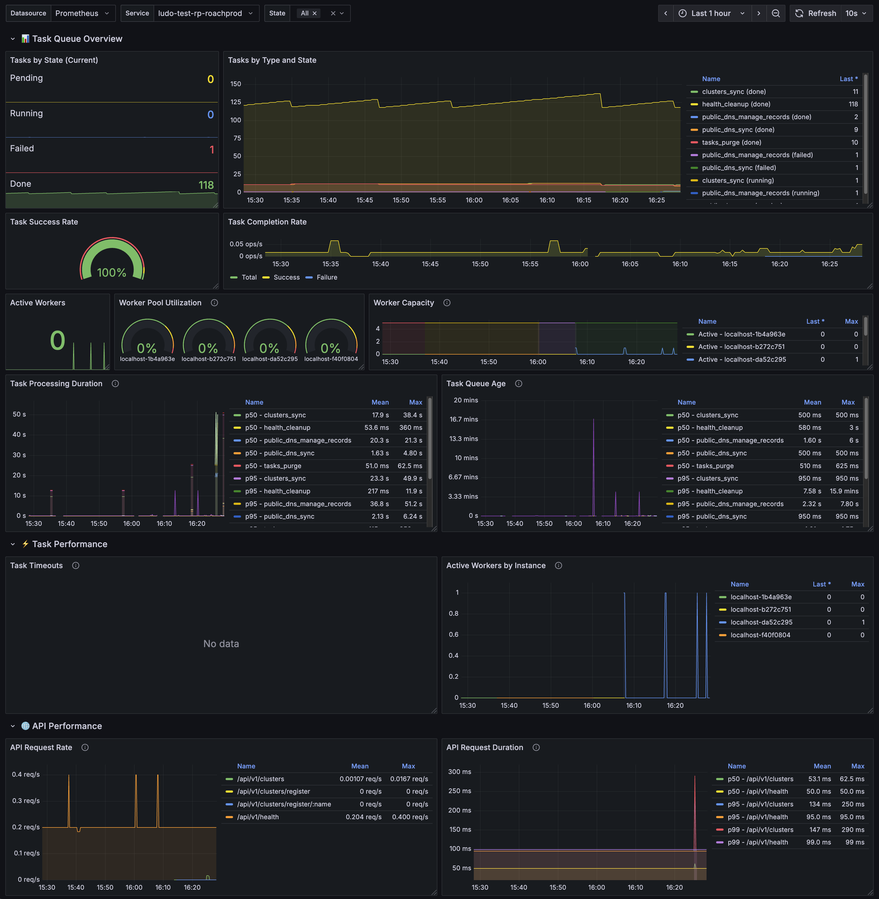

# Prometheus Metrics Reference

This document provides a comprehensive reference for all Prometheus metrics exposed by roachprod-centralized.

**📚 Related Documentation:**
- [← Back to Main README](../README.md)
- [🏗️ Architecture](ARCHITECTURE.md) - System architecture overview
- [🔌 API Reference](API.md) - REST API documentation
- [📋 Tasks Service](services/TASKS.md) - Background task processing

## Table of Contents

- [Overview](#overview)
- [Accessing Metrics](#accessing-metrics)
- [Grafana Dashboard](#grafana-dashboard)
- [Auth Service Metrics](#auth-service-metrics)
- [Tasks Service Metrics](#tasks-service-metrics)
- [Database Connection Pool Metrics](#database-connection-pool-metrics)
- [HTTP Server Metrics (Gin)](#http-server-metrics-gin)
- [Go Runtime Metrics](#go-runtime-metrics)
- [Metric Labels](#metric-labels)
- [Querying Metrics](#querying-metrics)
- [Alerting Rules](#alerting-rules)

## Overview

roachprod-centralized exposes Prometheus metrics for monitoring application health, performance, and task processing. Metrics are exposed on the `/metrics` endpoint and follow Prometheus naming conventions.

### Metric Categories

1. **Auth Service Metrics** - Authentication, authorization, SCIM, and token statistics
2. **Tasks Service Metrics** - Task processing and queue statistics
3. **Database Connection Pool Metrics** - SQL database connection pool statistics
4. **HTTP Server Metrics** - Gin framework request metrics
5. **Go Runtime Metrics** - Standard Go process metrics

### Metric Namespace

All tasks service metrics use the namespace `roachprod`.

## Accessing Metrics

### Endpoints

**All-in-One Mode / API Mode:**
```bash
curl http://localhost:8080/metrics
```

**Workers-Only Mode:**
```bash
curl http://localhost:9090/metrics
```

### Configuration

Metrics collection can be controlled via service options:

```go
taskService := tasks.NewService(repo, instanceID, tasks.Options{
    CollectMetrics:           true,              // Enable/disable metrics (default: true)
    StatisticsUpdateInterval: 30 * time.Second,  // Update frequency (default: 30s)
})
```

Environment variable:
```bash
export ROACHPROD_TASKS_COLLECT_METRICS=false
```

## Grafana Dashboard

A comprehensive Grafana dashboard is available for visualizing all metrics. The dashboard includes:

- **Task Queue Overview** - Task states, completion rates, worker utilization
- **Task Performance** - Processing duration, queue age, timeouts
- **API Performance** - Request rates, latency, error rates
- **System Resources** - Memory, goroutines, GC metrics
- **Database Connection Pool** - Connection usage, pool health, wait times

### Dashboard Configuration

The dashboard JSON is located at:
```
docs/grafana-dashboard.json
```

Import this file into Grafana to create the dashboard. It requires:
- A Prometheus datasource configured with your metrics endpoint
- The `service` label configured on your metrics (e.g., `roachprod-centralized-prod`, `roachprod-centralized-test`)

### Dashboard Screenshot



### Dashboard Variables

The dashboard includes the following variables:
- **Datasource** - Select your Prometheus datasource
- **Service** - Filter metrics by service/deployment name (e.g., `roachprod-centralized-prod`, `roachprod-centralized-test`)
- **State** - Filter task metrics by state (default: All)

## Auth Service Metrics

All auth service metrics use the namespace `roachprod_auth`. These metrics track authentication, authorization, token management, and SCIM provisioning operations.

### Authentication Metrics

#### `roachprod_auth_auth_total`

**Type:** Counter
**Description:** Total authentication attempts by result and authentication method
**Labels:**
- `result` - Authentication result: `success`, `error`
- `auth_method` - Authentication method: `user`, `service-account`, `jwt`

**Example:**
```promql
# Authentication success rate
sum(rate(roachprod_auth_auth_total{result="success"}[5m]))
/
sum(rate(roachprod_auth_auth_total[5m]))

# Authentication failures by method
sum(rate(roachprod_auth_auth_total{result="error"}[5m])) by (auth_method)
```

---

#### `roachprod_auth_auth_latency_seconds`

**Type:** Histogram
**Description:** Full authentication latency including token validation and permission loading
**Labels:**
- `result` - Authentication result: `success`, `error`
- `auth_method` - Authentication method: `user`, `service-account`, `jwt`

**Buckets:** `[0.001, 0.002, 0.004, ..., ~4s]` (exponential)

**Example:**
```promql
# 95th percentile authentication latency
histogram_quantile(0.95, sum(rate(roachprod_auth_auth_latency_seconds_bucket[5m])) by (le))
```

---

#### `roachprod_auth_auth_okta_exchange_total`

**Type:** Counter
**Description:** Total Okta token exchanges by result
**Labels:**
- `result` - Exchange result: `success`, `error`, `user_not_provisioned`

**Example:**
```promql
# Okta exchange success rate
rate(roachprod_auth_auth_okta_exchange_total{result="success"}[5m])
```

---

#### `roachprod_auth_auth_okta_exchange_latency_seconds`

**Type:** Histogram
**Description:** Latency of Okta token exchange operations
**Buckets:** `[0.01, 0.02, 0.04, ..., ~10s]` (exponential)

---

#### `roachprod_auth_auth_token_validation_total`

**Type:** Counter
**Description:** Token validations by result
**Labels:**
- `result` - Validation result: `success`, `expired`, `revoked`, `invalid`, `user_inactive`

**Example:**
```promql
# Token validation failure breakdown
sum(rate(roachprod_auth_auth_token_validation_total{result!="success"}[5m])) by (result)
```

---

#### `roachprod_auth_auth_token_validation_latency_seconds`

**Type:** Histogram
**Description:** Latency of token validation operations
**Buckets:** `[0.0001, 0.0002, ..., ~400ms]` (exponential)

---

### Token Management Metrics

#### `roachprod_auth_auth_token_issued_total`

**Type:** Counter
**Description:** Total tokens issued by principal type
**Labels:**
- `principal_type` - Token type: `user`, `service-account`

**Example:**
```promql
# Tokens issued per hour by type
sum(increase(roachprod_auth_auth_token_issued_total[1h])) by (principal_type)
```

---

#### `roachprod_auth_auth_token_revoked_total`

**Type:** Counter
**Description:** Total tokens revoked by reason
**Labels:**
- `reason` - Revocation reason: `self`, `admin`, `deactivation`, `expiry`

---

#### `roachprod_auth_auth_user_not_provisioned_total`

**Type:** Counter
**Description:** Authentication failures due to unprovisioned users (user exists in Okta but not in SCIM)

**Use Cases:**
- Detect users attempting to access before SCIM provisioning
- Monitor SCIM sync issues

---

### Authorization Metrics

#### `roachprod_auth_authz_decision_total`

**Type:** Counter
**Description:** Authorization decisions by result and context
**Labels:**
- `result` - Decision result: `allow`, `deny`
- `reason` - Decision reason: `has_permission`, `missing_permission`, `no_requirement`
- `endpoint` - API endpoint path
- `provider` - Cloud provider context (if applicable)

**Example:**
```promql
# Authorization denial rate by endpoint
sum(rate(roachprod_auth_authz_decision_total{result="deny"}[5m])) by (endpoint)

# Most denied endpoints
topk(5, sum(rate(roachprod_auth_authz_decision_total{result="deny"}[5m])) by (endpoint))
```

---

#### `roachprod_auth_authz_latency_seconds`

**Type:** Histogram
**Description:** Authorization latency by endpoint
**Labels:**
- `endpoint` - API endpoint path

**Buckets:** `[0.0001, 0.0002, ..., ~400ms]` (exponential)

---

### SCIM Metrics

#### `roachprod_auth_scim_requests_total`

**Type:** Counter
**Description:** SCIM requests by operation and result
**Labels:**
- `operation` - SCIM operation: `create_user`, `update_user`, `delete_user`, `create_group`, `update_group`, `delete_group`, `list_users`, `list_groups`
- `result` - Request result: `success`, `error`

**Example:**
```promql
# SCIM error rate by operation
sum(rate(roachprod_auth_scim_requests_total{result="error"}[5m])) by (operation)
```

---

#### `roachprod_auth_scim_request_latency_seconds`

**Type:** Histogram
**Description:** SCIM request latency by operation
**Labels:**
- `operation` - SCIM operation

**Buckets:** `[0.001, 0.002, ..., ~4s]` (exponential)

---

#### `roachprod_auth_scim_users_provisioned_total`

**Type:** Counter
**Description:** Total users provisioned via SCIM

---

#### `roachprod_auth_scim_users_deactivated_total`

**Type:** Counter
**Description:** Total users deactivated via SCIM

---

#### `roachprod_auth_scim_users_reactivated_total`

**Type:** Counter
**Description:** Total users reactivated via SCIM

---

#### `roachprod_auth_scim_sync_errors_total`

**Type:** Counter
**Description:** SCIM sync errors by type
**Labels:**
- `error_type` - Error type: `validation`, `database`, `conflict`

---

#### `roachprod_auth_scim_groups_created_total`

**Type:** Counter
**Description:** Total groups created via SCIM

---

#### `roachprod_auth_scim_groups_updated_total`

**Type:** Counter
**Description:** Total groups updated via SCIM (PUT/PATCH)

---

#### `roachprod_auth_scim_groups_deleted_total`

**Type:** Counter
**Description:** Total groups deleted via SCIM

---

#### `roachprod_auth_scim_group_members_added_total`

**Type:** Counter
**Description:** Total group membership additions via SCIM

---

#### `roachprod_auth_scim_group_members_removed_total`

**Type:** Counter
**Description:** Total group membership removals via SCIM

---

### Service Account Metrics

#### `roachprod_auth_service_accounts_created_total`

**Type:** Counter
**Description:** Total service accounts created

---

#### `roachprod_auth_service_accounts_deleted_total`

**Type:** Counter
**Description:** Total service accounts deleted

---

### Token Cleanup Metrics

#### `roachprod_auth_token_cleanup_total`

**Type:** Counter
**Description:** Tokens cleaned up by status
**Labels:**
- `status` - Token status: `expired`, `revoked`

---

#### `roachprod_auth_token_cleanup_latency_seconds`

**Type:** Histogram
**Description:** Latency of token cleanup operations

---

### Gauge Metrics (Current State)

#### `roachprod_auth_users_total`

**Type:** Gauge
**Description:** Current number of users by status
**Labels:**
- `status` - User status: `active`, `inactive`

**Example:**
```promql
# Total active users
roachprod_auth_users_total{status="active"}

# Inactive user ratio
roachprod_auth_users_total{status="inactive"}
/
sum(roachprod_auth_users_total)
```

---

#### `roachprod_auth_groups_total`

**Type:** Gauge
**Description:** Current number of groups

---

#### `roachprod_auth_service_accounts_total`

**Type:** Gauge
**Description:** Current number of service accounts by enabled status
**Labels:**
- `enabled` - Enabled status: `true`, `false`

---

#### `roachprod_auth_tokens_total`

**Type:** Gauge
**Description:** Current number of tokens by type and status
**Labels:**
- `type` - Token type: `user`, `service-account`
- `status` - Token status: `valid`, `revoked`

**Example:**
```promql
# Valid tokens by type
roachprod_auth_tokens_total{status="valid"}

# Token distribution
sum(roachprod_auth_tokens_total) by (type, status)
```

---

## Tasks Service Metrics

All tasks service metrics use the namespace `roachprod_tasks`.

### Task State Gauges

#### `roachprod_tasks_total`

**Type:** Gauge
**Description:** Current number of tasks in the database by state and type
**Labels:**
- `state` - Task state: `pending`, `running`, `done`, `failed`
- `task_type` - Type of task (e.g., `cluster_sync`, `dns_sync`, `health_cleanup`, `tasks_purge`)

**Example:**
```promql
# Total pending tasks across all types
sum(roachprod_tasks_total{state="pending"})

# Pending cluster_sync tasks
roachprod_tasks_total{state="pending",task_type="cluster_sync"}

# All failed tasks
sum(roachprod_tasks_total{state="failed"})

# Tasks by state (breakdown)
sum(roachprod_tasks_total) by (state)
```

**Use Cases:**
- Monitor task queue depth
- Detect task processing bottlenecks
- Track failed task accumulation
- Per-task-type workload analysis

---

### Task Completion Counter

#### `roachprod_tasks_completion_status_total`

**Type:** Counter
**Description:** Total number of completed tasks by type and outcome
**Labels:**
- `task_type` - Type of task
- `status` - Completion status: `success` or `failure`
- `instance` - Instance ID that processed the task

**Example:**
```promql
# Task completion rate (all types)
sum(rate(roachprod_tasks_completion_status_total[5m]))

# Success rate for cluster_sync tasks
rate(roachprod_tasks_completion_status_total{task_type="cluster_sync",status="success"}[5m])

# Failure rate
sum(rate(roachprod_tasks_completion_status_total{status="failure"}[5m]))

# Success ratio (percentage)
sum(rate(roachprod_tasks_completion_status_total{status="success"}[5m]))
/
sum(rate(roachprod_tasks_completion_status_total[5m]))
* 100
```

**Use Cases:**
- Calculate task success/failure rates
- Monitor task throughput per instance
- Track task reliability by type

---

### Task Processing Duration

#### `roachprod_tasks_processing_duration_seconds`

**Type:** Histogram
**Description:** Time taken to process tasks from start to completion
**Labels:**
- `task_type` - Type of task

**Buckets:** `[0.1, 0.2, 0.4, 0.8, 1.6, 3.2, 6.4, 12.8, 25.6, 51.2, 102.4]` seconds

**Example:**
```promql
# Median processing duration (all types)
histogram_quantile(0.5, sum(rate(roachprod_tasks_processing_duration_seconds_bucket[5m])) by (le))

# 95th percentile for cluster_sync tasks
histogram_quantile(0.95,
  sum(rate(roachprod_tasks_processing_duration_seconds_bucket{task_type="cluster_sync"}[5m])) by (le)
)

# Average processing time by type
sum(rate(roachprod_tasks_processing_duration_seconds_sum[5m])) by (task_type)
/
sum(rate(roachprod_tasks_processing_duration_seconds_count[5m])) by (task_type)

# 99th percentile (slowest tasks)
histogram_quantile(0.99, sum(rate(roachprod_tasks_processing_duration_seconds_bucket[5m])) by (le))
```

**Use Cases:**
- Monitor task processing performance
- Detect slow tasks
- Capacity planning based on task duration
- SLO monitoring

---

### Task Queue Age

#### `roachprod_tasks_queue_age_seconds`

**Type:** Histogram
**Description:** Time tasks spend in pending state before processing starts
**Labels:**
- `task_type` - Type of task

**Buckets:** `[1, 2, 4, 8, 16, 32, 64, 128, 256, 512, 1024, 2048, 4096]` seconds

**Example:**
```promql
# Median queue wait time
histogram_quantile(0.5, sum(rate(roachprod_tasks_queue_age_seconds_bucket[5m])) by (le))

# 99th percentile queue age (worst case)
histogram_quantile(0.99, sum(rate(roachprod_tasks_queue_age_seconds_bucket[5m])) by (le))

# Average queue time by task type
sum(rate(roachprod_tasks_queue_age_seconds_sum[5m])) by (task_type)
/
sum(rate(roachprod_tasks_queue_age_seconds_count[5m])) by (task_type)

# Tasks waiting more than 1 minute
sum(rate(roachprod_tasks_queue_age_seconds_bucket{le="60"}[5m]))
```

**Use Cases:**
- Monitor task queue latency
- Detect worker capacity issues
- Identify backlog buildup
- Worker scaling decisions

---

### Task Timeouts

#### `roachprod_tasks_timeouts_total`

**Type:** Counter
**Description:** Total number of tasks that timed out during processing
**Labels:**
- `task_type` - Type of task that timed out

**Example:**
```promql
# Timeout rate (all types)
sum(rate(roachprod_tasks_timeouts_total[5m]))

# Timeouts for specific task type
rate(roachprod_tasks_timeouts_total{task_type="cluster_sync"}[5m])

# Total timeouts in last hour
increase(roachprod_tasks_timeouts_total[1h])

# Timeouts by task type (breakdown)
sum(rate(roachprod_tasks_timeouts_total[5m])) by (task_type)
```

**Use Cases:**
- Monitor task timeout frequency
- Identify tasks needing longer timeouts
- Detect infrastructure issues causing timeouts

---

### Active Workers

#### `roachprod_tasks_active_workers`

**Type:** Gauge
**Description:** Number of workers currently processing tasks
**Labels:**
- `instance` - Instance ID

**Example:**
```promql
# Active workers across all instances
sum(roachprod_tasks_active_workers)

# Worker utilization percentage
roachprod_tasks_active_workers / roachprod_tasks_max_workers * 100

# Instances with idle workers
roachprod_tasks_active_workers < 1

# Per-instance worker count
roachprod_tasks_active_workers
```

**Use Cases:**
- Monitor worker utilization
- Capacity planning
- Detect worker bottlenecks

---

### Maximum Workers

#### `roachprod_tasks_max_workers`

**Type:** Gauge
**Description:** Maximum number of workers configured per instance
**Labels:**
- `instance` - Instance ID

**Example:**
```promql
# Total worker capacity across all instances
sum(roachprod_tasks_max_workers)

# Worker pool utilization percentage
sum(roachprod_tasks_active_workers) / sum(roachprod_tasks_max_workers) * 100

# Per-instance capacity
roachprod_tasks_max_workers
```

**Use Cases:**
- Track configured worker capacity
- Calculate utilization percentages
- Capacity planning and scaling decisions

---

## Database Connection Pool Metrics

When using CockroachDB or PostgreSQL backend (database type `cockroachdb`), connection pool statistics are automatically exported. These metrics use the official Prometheus Go SQL collector.

All database metrics use the namespace `go_sql` and include a `db_name` label with the database name extracted from the connection URL.

### Maximum Open Connections

#### `go_sql_max_open_connections`

**Type:** Gauge
**Description:** Maximum number of open database connections configured
**Labels:**
- `db_name` - Database name

**Example:**
```promql
# Maximum connections for roachprod database
go_sql_max_open_connections{db_name="roachprod"}
```

---

### Open Connections

#### `go_sql_open_connections`

**Type:** Gauge
**Description:** Current number of established database connections (both in use and idle)
**Labels:**
- `db_name` - Database name

**Example:**
```promql
# Total open connections
go_sql_open_connections{db_name="roachprod"}

# Connection pool utilization percentage
go_sql_open_connections / go_sql_max_open_connections * 100
```

---

### In-Use Connections

#### `go_sql_in_use_connections`

**Type:** Gauge
**Description:** Number of database connections currently executing queries
**Labels:**
- `db_name` - Database name

**Example:**
```promql
# Active database connections
go_sql_in_use_connections{db_name="roachprod"}

# Pool saturation percentage
go_sql_in_use_connections / go_sql_max_open_connections * 100
```

---

### Idle Connections

#### `go_sql_idle_connections`

**Type:** Gauge
**Description:** Number of idle database connections in the pool
**Labels:**
- `db_name` - Database name

**Example:**
```promql
# Idle connections available
go_sql_idle_connections{db_name="roachprod"}

# Connection pool health (in use vs idle)
go_sql_in_use_connections / (go_sql_in_use_connections + go_sql_idle_connections)
```

---

### Wait Count

#### `go_sql_wait_count_total`

**Type:** Counter
**Description:** Total number of times a query had to wait for an available connection
**Labels:**
- `db_name` - Database name

**Example:**
```promql
# Connection wait rate
rate(go_sql_wait_count_total{db_name="roachprod"}[5m])

# Total waits in last hour
increase(go_sql_wait_count_total{db_name="roachprod"}[1h])
```

**Use Cases:**
- Detect connection pool saturation
- Identify need to increase max connections
- Monitor connection contention

---

### Wait Duration

#### `go_sql_wait_duration_seconds_total`

**Type:** Counter
**Description:** Total time queries spent waiting for available connections
**Labels:**
- `db_name` - Database name

**Example:**
```promql
# Average wait duration per query
rate(go_sql_wait_duration_seconds_total{db_name="roachprod"}[5m])
/
rate(go_sql_wait_count_total{db_name="roachprod"}[5m])

# Total wait time in last hour
increase(go_sql_wait_duration_seconds_total{db_name="roachprod"}[1h])
```

**Use Cases:**
- Measure connection wait latency
- Identify connection pool performance issues
- Optimize max connections setting

---

### Connection Closure Metrics

The following counters track connections closed for various reasons:

#### `go_sql_max_idle_closed_total`
**Type:** Counter
**Description:** Connections closed due to `SetMaxIdleConns` limit

#### `go_sql_max_idle_time_closed_total`
**Type:** Counter
**Description:** Connections closed due to `SetConnMaxIdleTime` timeout

#### `go_sql_max_lifetime_closed_total`
**Type:** Counter
**Description:** Connections closed due to `SetConnMaxLifetime` limit

**Example:**
```promql
# Rate of connections closed by reason
sum(rate(go_sql_max_idle_closed_total{db_name="roachprod"}[5m])) by (db_name)
sum(rate(go_sql_max_idle_time_closed_total{db_name="roachprod"}[5m])) by (db_name)
sum(rate(go_sql_max_lifetime_closed_total{db_name="roachprod"}[5m])) by (db_name)
```

---

## HTTP Server Metrics (Gin)

These metrics are automatically provided by the `github.com/penglongli/gin-metrics` library.

### Request Total

#### `gin_request_total`

**Type:** Counter
**Description:** Total number of HTTP requests
**Labels:** (gin-metrics standard labels)

**Example:**
```promql
# Request rate
rate(gin_request_total[5m])

# Total requests in last hour
increase(gin_request_total[1h])
```

---

### URI Request Total

#### `gin_uri_request_total`

**Type:** Counter
**Description:** Total number of HTTP requests by URI path
**Labels:**
- `method` - HTTP method (GET, POST, etc.)
- `uri` - Request URI pattern
- `code` - HTTP status code

**Example:**
```promql
# Request rate by endpoint
sum(rate(gin_uri_request_total[5m])) by (uri)

# Error rate (4xx and 5xx responses)
sum(rate(gin_uri_request_total{code=~"[45].."}[5m]))

# Success rate for specific endpoint
rate(gin_uri_request_total{uri="/api/v1/clusters",code="200"}[5m])

# Top 5 endpoints by traffic
topk(5, sum(rate(gin_uri_request_total[5m])) by (uri))
```

---

### Request Duration

#### `gin_request_duration_seconds`

**Type:** Histogram
**Description:** HTTP request latency distribution
**Labels:**
- `method` - HTTP method
- `uri` - Request URI pattern

**Example:**
```promql
# Median request latency
histogram_quantile(0.5, sum(rate(gin_request_duration_seconds_bucket[5m])) by (le))

# 95th percentile latency by endpoint
histogram_quantile(0.95,
  sum(rate(gin_request_duration_seconds_bucket[5m])) by (uri, le)
)

# Average request duration
sum(rate(gin_request_duration_seconds_sum[5m]))
/
sum(rate(gin_request_duration_seconds_count[5m]))
```

---

### Request Body Size

#### `gin_request_body_size_bytes`

**Type:** Histogram
**Description:** HTTP request body size distribution
**Labels:**
- `method` - HTTP method
- `uri` - Request URI pattern

---

### Response Body Size

#### `gin_response_body_size_bytes`

**Type:** Histogram
**Description:** HTTP response body size distribution
**Labels:**
- `method` - HTTP method
- `uri` - Request URI pattern

---

## Go Runtime Metrics

Standard Go process metrics are automatically exposed by the Prometheus client library.

### Memory Metrics

- `go_memstats_alloc_bytes` - Bytes allocated and still in use
- `go_memstats_heap_alloc_bytes` - Heap bytes allocated
- `go_memstats_heap_inuse_bytes` - Heap bytes in use
- `go_memstats_stack_inuse_bytes` - Stack bytes in use
- `go_memstats_sys_bytes` - Total bytes obtained from system

### Goroutine Metrics

- `go_goroutines` - Number of goroutines currently running

### GC Metrics

- `go_gc_duration_seconds` - GC pause duration
- `go_memstats_gc_cpu_fraction` - Fraction of CPU time used by GC
- `go_memstats_last_gc_time_seconds` - Timestamp of last GC

### Process Metrics

- `process_cpu_seconds_total` - Total CPU time consumed
- `process_resident_memory_bytes` - Resident memory size
- `process_virtual_memory_bytes` - Virtual memory size
- `process_open_fds` - Number of open file descriptors

## Metric Labels

### Task-Specific Labels

| Label | Description | Cardinality | Example Values | Metrics |
|-------|-------------|-------------|----------------|---------|
| `state` | Task state | 4 | `pending`, `running`, `done`, `failed` | `tasks_total` |
| `task_type` | Type of task | ~10-20 | `cluster_sync`, `dns_sync`, `health_cleanup`, `tasks_purge` | All task metrics |
| `status` | Completion status | 2 | `success`, `failure` | `tasks_completion_status_total` |
| `instance` | Instance ID | N instances | `api-instance-1`, `worker-instance-2` | `tasks_completion_status_total`, `tasks_active_workers`, `tasks_max_workers` |

### Database-Specific Labels

| Label | Description | Cardinality | Example Values | Metrics |
|-------|-------------|-------------|----------------|---------|
| `db_name` | Database name | 1 | `roachprod`, `roachprod_centralized` | All `go_sql_*` metrics |

### Cardinality Considerations

**Total Task Metrics Cardinality:**
- `tasks_total`: 4 states × ~15 task types = **~60 time series**
- `tasks_completion_status_total`: ~15 task types × 2 statuses × N instances = **~30 × N time series**
- `tasks_processing_duration_seconds`: ~15 task types × buckets = **moderate**
- `tasks_queue_age_seconds`: ~15 task types × buckets = **moderate**
- `tasks_timeouts_total`: ~15 task types = **~15 time series**
- `tasks_active_workers`: N instances = **N time series**
- `tasks_max_workers`: N instances = **N time series**

**Total Database Metrics Cardinality:**
- `go_sql_*`: 9 metrics × 1 database = **~9 time series**

With 10 instances and 15 task types, total cardinality is **~1,000-2,000 time series** - well within acceptable limits.

## Querying Metrics

### Common Queries

#### Task Queue Health

```promql
# Tasks waiting to be processed
sum(roachprod_tasks_total{state="pending"})

# Tasks currently running
sum(roachprod_tasks_total{state="running"})

# Failed tasks requiring attention
sum(roachprod_tasks_total{state="failed"})

# Task distribution by state
sum(roachprod_tasks_total) by (state)
```

#### Task Processing Performance

```promql
# Task completion rate (tasks/second)
sum(rate(roachprod_tasks_completion_status_total[5m]))

# Task success rate (percentage)
sum(rate(roachprod_tasks_completion_status_total{status="success"}[5m]))
/
sum(rate(roachprod_tasks_completion_status_total[5m]))
* 100

# Average task duration by type
sum(rate(roachprod_tasks_processing_duration_seconds_sum[5m])) by (task_type)
/
sum(rate(roachprod_tasks_processing_duration_seconds_count[5m])) by (task_type)

# Slowest task types (p95)
topk(5,
  histogram_quantile(0.95,
    sum(rate(roachprod_tasks_processing_duration_seconds_bucket[5m])) by (task_type, le)
  )
)
```

#### Worker Utilization

```promql
# Total active workers across all instances
sum(roachprod_tasks_active_workers)

# Worker utilization percentage (assuming 5 workers per instance)
sum(roachprod_tasks_active_workers)
/
(count(roachprod_tasks_active_workers) * 5)
* 100

# Instances with maximum workers active
roachprod_tasks_active_workers >= 5
```

#### API Performance

```promql
# Request rate by endpoint
sum(rate(gin_uri_request_total[5m])) by (uri)

# Error rate (percentage)
sum(rate(gin_uri_request_total{code=~"[45].."}[5m]))
/
sum(rate(gin_uri_request_total[5m]))
* 100

# 95th percentile API latency
histogram_quantile(0.95, sum(rate(gin_request_duration_seconds_bucket[5m])) by (le))

# Slowest endpoints (p95 latency)
topk(5,
  histogram_quantile(0.95,
    sum(rate(gin_request_duration_seconds_bucket[5m])) by (uri, le)
  )
)
```

#### Database Connection Pool Health

```promql
# Connection pool utilization percentage
go_sql_in_use_connections{db_name="roachprod"}
/
go_sql_max_open_connections{db_name="roachprod"}
* 100

# Idle connections available
go_sql_idle_connections{db_name="roachprod"}

# Connection wait rate (waits per second)
rate(go_sql_wait_count_total{db_name="roachprod"}[5m])

# Average connection wait time
rate(go_sql_wait_duration_seconds_total{db_name="roachprod"}[5m])
/
rate(go_sql_wait_count_total{db_name="roachprod"}[5m])

# Connection pool saturation (high = need more connections)
go_sql_in_use_connections{db_name="roachprod"} >= go_sql_max_open_connections{db_name="roachprod"}

# Connection closure rate by reason
sum(rate(go_sql_max_idle_closed_total{db_name="roachprod"}[5m]))
sum(rate(go_sql_max_idle_time_closed_total{db_name="roachprod"}[5m]))
sum(rate(go_sql_max_lifetime_closed_total{db_name="roachprod"}[5m]))
```

## Alerting Rules

### Recommended Alerts

```yaml
groups:
  - name: roachprod_tasks
    interval: 30s
    rules:
      # High pending task count
      - alert: TaskQueueBacklog
        expr: sum(roachprod_tasks_total{state="pending"}) > 100
        for: 5m
        labels:
          severity: warning
        annotations:
          summary: "Task queue has {{ $value }} pending tasks"
          description: "Task queue backlog is building up, may need more workers"

      # High failure rate
      - alert: TaskHighFailureRate
        expr: |
          sum(rate(roachprod_tasks_completion_status_total{status="failure"}[5m]))
          /
          sum(rate(roachprod_tasks_completion_status_total[5m]))
          > 0.1
        for: 5m
        labels:
          severity: warning
        annotations:
          summary: "Task failure rate is {{ $value | humanizePercentage }}"
          description: "More than 10% of tasks are failing"

      # Slow task processing
      - alert: TaskProcessingSlow
        expr: |
          histogram_quantile(0.95,
            sum(rate(roachprod_tasks_processing_duration_seconds_bucket[5m])) by (le)
          ) > 300
        for: 10m
        labels:
          severity: warning
        annotations:
          summary: "95th percentile task processing time is {{ $value }}s"
          description: "Tasks are taking longer than expected to process"

      # High queue wait time
      - alert: TaskQueueAgeHigh
        expr: |
          histogram_quantile(0.95,
            sum(rate(roachprod_tasks_queue_age_seconds_bucket[5m])) by (le)
          ) > 60
        for: 5m
        labels:
          severity: warning
        annotations:
          summary: "Tasks waiting {{ $value }}s in queue (p95)"
          description: "Tasks are waiting too long before processing - consider adding workers"

      # Frequent timeouts
      - alert: TaskTimeoutsHigh
        expr: sum(rate(roachprod_tasks_timeouts_total[5m])) > 0.1
        for: 5m
        labels:
          severity: warning
        annotations:
          summary: "Task timeout rate is {{ $value }}/s"
          description: "Tasks are timing out frequently"

      # Tasks stuck in pending with no active workers
      - alert: TasksStuckNoPending
        expr: |
          sum(roachprod_tasks_total{state="pending"}) > 0
          and
          sum(roachprod_tasks_active_workers) == 0
        for: 2m
        labels:
          severity: critical
        annotations:
          summary: "{{ $value }} pending tasks but no active workers"
          description: "Tasks are queued but no workers are processing them"

      # Failed tasks accumulating
      - alert: FailedTasksAccumulating
        expr: sum(roachprod_tasks_total{state="failed"}) > 50
        for: 10m
        labels:
          severity: warning
        annotations:
          summary: "{{ $value }} failed tasks in database"
          description: "Failed tasks are accumulating and need investigation"

      # API error rate
      - alert: APIHighErrorRate
        expr: |
          sum(rate(gin_uri_request_total{code=~"5.."}[5m]))
          /
          sum(rate(gin_uri_request_total[5m]))
          > 0.05
        for: 5m
        labels:
          severity: warning
        annotations:
          summary: "API error rate is {{ $value | humanizePercentage }}"
          description: "More than 5% of API requests are returning 5xx errors"

      # API latency high
      - alert: APILatencyHigh
        expr: |
          histogram_quantile(0.95,
            sum(rate(gin_request_duration_seconds_bucket[5m])) by (le)
          ) > 2
        for: 5m
        labels:
          severity: warning
        annotations:
          summary: "API 95th percentile latency is {{ $value }}s"
          description: "API response times are higher than expected"

      # Database connection pool saturation
      - alert: DatabaseConnectionPoolSaturated
        expr: |
          go_sql_in_use_connections{db_name="roachprod"}
          >=
          go_sql_max_open_connections{db_name="roachprod"}
        for: 2m
        labels:
          severity: warning
        annotations:
          summary: "Database connection pool is fully saturated"
          description: "All {{ $value }} connections are in use - consider increasing max connections"

      # High connection wait rate
      - alert: DatabaseConnectionWaitHigh
        expr: rate(go_sql_wait_count_total{db_name="roachprod"}[5m]) > 1
        for: 5m
        labels:
          severity: warning
        annotations:
          summary: "Database queries waiting {{ $value }}/s for connections"
          description: "High connection wait rate indicates pool saturation"

      # Long connection wait times
      - alert: DatabaseConnectionWaitSlow
        expr: |
          rate(go_sql_wait_duration_seconds_total{db_name="roachprod"}[5m])
          /
          rate(go_sql_wait_count_total{db_name="roachprod"}[5m])
          > 0.1
        for: 5m
        labels:
          severity: warning
        annotations:
          summary: "Average connection wait time is {{ $value }}s"
          description: "Queries are waiting too long for database connections"

      # Low idle connections
      - alert: DatabaseIdleConnectionsLow
        expr: go_sql_idle_connections{db_name="roachprod"} < 2
        for: 5m
        labels:
          severity: info
        annotations:
          summary: "Only {{ $value }} idle database connections available"
          description: "Connection pool may be under pressure - monitor for saturation"
```

---

*Last Updated: October 9, 2025*
