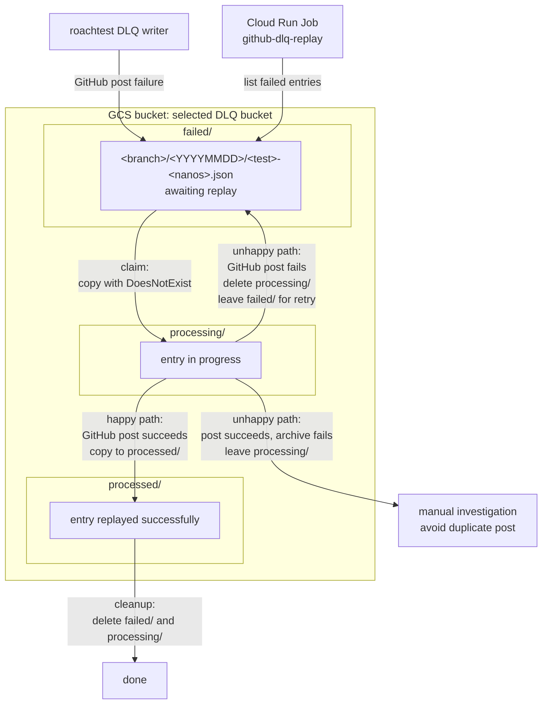

# GitHub Issue DLQ for roachtest

This directory contains the implementation for a GCS-backed dead letter queue for `roachtest` failed GitHub `issue.Post` requests. The `dlq` package provides:
- `WrapIssuePoster`, which wraps `issues.Post` and writes failed requests to GCS.
- `Entry`, the serialized request format stored in GCS.
- Replay logic that reads stored entries and calls `issues.Post`.

The Cloud Run entrypoint lives separately in `pkg/cmd/roachtest/dlq-replay`.
It defines the `dlq-replay` binary, which uses this package to manually replay
stored POST requests.

The motivation for this DLQ is that GitHub issues are the durable source of
truth for `roachtest` failures. If GitHub is unavailable when `roachtest` tries
to post a failure, losing that request can hide rare or important failure modes.

When a GitHub `issues.Post` call fails, the DLQ wrapper stores the request and
replay metadata in GCS. In TeamCity CI, `roachtest` exits with code `12`, which
alerts `#test-eng-ops` that manual replay is needed. After GitHub recovers, an
operator runs the Cloud Run Job to replay the queued entries.

This directory owns the GCS writer, serialized entry format, and replay library
logic. The Cloud Run binary lives in `pkg/cmd/roachtest/dlq-replay`, and the
infrastructure lives in
`crl-infrastructure/terraform/gcp/cockroachlabs.com/engineering/test-engineering/cockroach-testeng-infra/
service_github_dlq_replay.tf`.

## Roachtest runtime flow
Writing to GCS is gated by the `GITHUB_DLQ_BUCKET` env var. When it is set,
`issues.Post` is wrapped with `dlq.WrapIssuePoster`. When it is unset,
the wrapper is not used and behavior is unchanged.

The wrapper delegates to the original poster first. If the GitHub post
succeeds, nothing is written to the dead letter store. If the GitHub post fails, the
failed request and replay metadata are serialized as a `dlq.Entry` and
written to:

```text
gs://<bucket>/failed/<branch>/<YYYYMMDD>/<test_name>-<unix_nanos>.json
```

Manual replay is handled by the `dlq-replay` binary running in a Cloud Run Job.

## Bucket layout

```text
gs://<bucket>/
  failed/<branch>/<YYYYMMDD>/<test_name>-<unix_nanos>.json  # awaiting replay
  processing/<branch>/<YYYYMMDD>/<test_name>-<unix_nanos>.json  # claimed by replay
  processed/<branch>/<YYYYMMDD>/<test_name>-<unix_nanos>.json   # successfully replayed
```

### DLQ Prefix Flow



The replay binary claims an entry by copying `failed/X.json` to
`processing/X.json` with a `DoesNotExist` precondition. If another
runner already claimed the entry, the precondition fails and the entry
is skipped.
See [GCS consistency docs](https://docs.cloud.google.com/storage/docs/consistency#strongly_consistent_operations)
for the relevant strong consistency guarantees.

On a successful replayed post to GitHub, `dlq-replay` moves the entry in `processing/` to `processed/`, then deletes the original entry in `failed/` and the entry in `processing/`.

On a failed replayed post to GitHub, `dlq-replay` replay deletes
the `processing/` object and leaves the original `failed/` entry for a
future attempt.

In the unlikely scenario where the GitHub post succeeds but moving the entry to `processed/` fails, `dlq-replay` leaves the `processing/` object in place so a later run does not silently post the same issue again. This will need to be manually moved.

## How to replay events
### Happy Path
The Cloud Run Job executes `dlq-replay` with a bucket name:

```bash
# Default: replay all failed/ entries
gcloud run jobs execute github-dlq-replay \
  --region=us-east1 --project=cockroach-testeng-infra \
  --wait

# Branch specific e.g. only entries from failures on master
gcloud run jobs execute github-dlq-replay \
  --region=us-east1 --project=cockroach-testeng-infra \
  --args="--bucket,roachtest-github-dlq,--branch,master" \
  --wait
```

Optional flags:

- `--branch=<branch_name>`: only replay entries under specified branch e.g. `failed/master/`

Use `--wait` so `gcloud` waits for the Cloud Run execution to finish.
The command does not stream the replay logs to stdout; see
[Logging and audit logs](#logging-and-audit-logs) for verification
commands and per-entry output.

The CLI exits with status 1 if any entry's replay attempt failed, which
causes the Cloud Run execution to fail.

### Unhappy Path
GCS preconditions make claiming concurrency-safe, but the replay workflow is not transactional across GCS and GitHub. If replay fails before posting, the entry can be retried from `failed/`. If GitHub accepts the post but replay fails before archiving to `processed/`, retrying may create a duplicate issue or comment.

For that reason, entries left in `processing/` should be inspected manually before retrying. A future improvement could add an idempotency key to the GitHub issue body/comment and store replay state in the entry or an external datastore.

## Testing
Unit tests exercise the writer and replay logic against in-memory fakes:

```bash
./dev test pkg/cmd/roachtest/dlq
```

Writing Mock Events to dev GCS bucket

There is a dev bucket `roachtest-github-dlq-dev` for functional testing.
To seed the dev bucket with a real failed issue-post entry, run:
```bash
# If you need to build roachtest
./dev build pkg/cmd/roachtest

# Run script
ROACHTEST_BIN=./bin/roachtest \
  bash pkg/cmd/roachtest/dlq/smoke_test.sh
```
* test selected is a roachtest that will always fail
* test(s) executed that attempt to post github issues / comments will always fail because the script passes an invalid `GITHUB_API_TOKEN`

The script only exercises the writer path. It expects `roachtest` on
`PATH`, or a `ROACHTEST_BIN` override. It writes to
`roachtest-github-dlq-dev` by default and verifies an object landed
under `failed/`. You can specify test(s) to run with `ROACHTEST_NAME` (in order to test the DLQ functionality, the roachtest needs to fail).

### Testing Replay Using The Cloud Run Job
To verify Cloud Run replay behavior without posting to GitHub, run the
Job against the `dev bucket` via `--bucket roachtest-github-dlq-dev` and use the `--skip-github-post` flag.
```bash
gcloud run jobs execute github-dlq-replay \
  --region=us-east1 \
  --project=cockroach-testeng-infra \
  --args="--bucket,roachtest-github-dlq-dev,--skip-github-post" \
  --wait
```
* `--skip-github-post` claims entries for processing and verifies entries without posting to GitHub, then releases
the claims by deleting the entries from `processing/`. The original `failed/` entries remain in place, and no `processed/` entries are written.
* `--bucket` is included because Cloud Run `--args` replaces the Job's default args

See [Logging and audit logs](#logging-and-audit-logs) for verifying the
Cloud Run execution status and per-entry replay logs.

### Testing Replay Using Local CLI
If you are making changes to the Replay binary, you most likely want to verify locally.
If you want to verify the entire Replay flow end-to-end locally, you will need a GitHub PAT (Personal Access Token) which you can request through GitHub. The PAT is granted after dev-inf approval.
Local runs use Application Default Credentials for GCS and need
credentials with read/write/delete access on the DLQ bucket.
```bash
# Build the replay binary.
./dev build pkg/cmd/roachtest/dlq-replay
```

Verify replay parsing and preview output without posting to GitHub. GitHub issue preview URL is printed to stdout.
When clicked, the URL brings you to a Github Issue posting page where you can see how the issue will be formatted

```bash
./bin/dlq-replay \
  --bucket=roachtest-github-dlq-dev \
  --skip-github-post
```

```bash
# Full local replay. This posts to GitHub and requires a valid PAT.
# Close the issue after it posts.
GITHUB_API_TOKEN=<token> ./bin/dlq-replay \
  --bucket=roachtest-github-dlq-dev
```

The format and presentation of the issue should match with what you would get from running roachtest against a failing test with `--dry-run-issue-posting`. (Note some minor difference may exist like the exact fields listed in the Parameters section).
```bash
roachtest run "roachtest/manual/fail" --local --cockroach-stage=latest \
  --dry-run-issue-posting
```

## Updating the Cloud Run image

After changing `dlq-replay`, update the Cloud Run Job image from the
Cockroach repo:

```bash
pkg/cmd/roachtest/dlq-replay/push.sh
```

The script submits a Cloud Build that cross-compiles the linux
`dlq-replay` binary with Bazel, builds the replay image from the
current committed Git SHA, pushes it to Artifact Registry as a short-SHA
tag, and runs `gcloud run jobs update github-dlq-replay --image=...`.
That Git SHA must already be pushed to the GitHub repo selected by
`OWNER`/`REPO`, because Cloud Build clones that repo before building.
Terraform creates the Artifact Registry repo and Cloud Run Job, but
intentionally ignores later Job image changes so this manual update is
not reverted by Spacelift.

Run `push.sh` after the infra is created and before the first real replay. A
newly-created Job starts with a public bootstrap image and will not run the
real replay binary until the Job image is updated.

To verify the push, check that the latest Cloud Build succeeded:

```bash
gcloud builds list \
  --project=cockroach-testeng-infra \
  --sort-by="~createTime" \
  --limit=5
```

Then check that the Cloud Run Job image points at the replay image in
Artifact Registry rather than the bootstrap image:

```bash
gcloud run jobs describe github-dlq-replay \
  --region=us-east1 \
  --project=cockroach-testeng-infra \
  --format="value(spec.template.spec.template.spec.containers[0].image)"
```

The image should look like:

```text
us-east1-docker.pkg.dev/cockroach-testeng-infra/github-dlq-replay/replay:<short-sha>
```

## Rotating the GitHub token

The Cloud Run Job reads `GITHUB_API_TOKEN` from Secret Manager secret
`github-dlq-replay-token`, version `latest`. The token is not stored in the
image and does not require rebuilding or updating the Cloud Run Job.

To rotate the token, add a new enabled secret version:

```bash
read -s GITHUB_DLQ_REPLAY_TOKEN
printf '%s' "$GITHUB_DLQ_REPLAY_TOKEN" | gcloud secrets versions add github-dlq-replay-token \
  --project=cockroach-testeng-infra \
  --data-file=-
unset GITHUB_DLQ_REPLAY_TOKEN
```

New Cloud Run Job executions will read the new `latest` version. Existing
executions keep the environment they started with.

Verify versions:

```bash
gcloud secrets versions list github-dlq-replay-token \
  --project=cockroach-testeng-infra
```

## Logging and audit logs

`dlq-replay` writes one status line per visited entry to stdout and exits
with status 1 if any replay attempt failed. When replay runs through Cloud
Run, stdout/stderr are written to Cloud Logging. The quickest place to inspect
a run is **Cloud Run -> Jobs -> github-dlq-replay -> Executions**, which shows
per-execution status, exit code, and logs.

### Verifying a replay execution

First, find the latest execution:

```bash
gcloud run jobs executions list \
  --job=github-dlq-replay \
  --region=us-east1 \
  --project=cockroach-testeng-infra \
  --sort-by="~metadata.creationTimestamp" \
  --limit=5
```

Optionally capture the latest execution name for the commands below:

```bash
EXECUTION="$(gcloud run jobs executions list \
  --job=github-dlq-replay \
  --region=us-east1 \
  --project=cockroach-testeng-infra \
  --sort-by="~metadata.creationTimestamp" \
  --limit=1 \
  --format="value(metadata.name)")"
```

Check execution status. A successful execution means `dlq-replay`
exited with status 0; still check logs and GCS state for per-entry
outcomes:

```bash
gcloud run jobs executions describe "$EXECUTION" \
  --region=us-east1 \
  --project=cockroach-testeng-infra
```

Check replay logs for the summary line,
`done: <ok> ok, <skipped> skipped, <failed> failed`:

```bash
gcloud logging read \
  'resource.type="cloud_run_job"
   AND resource.labels.job_name="github-dlq-replay"
   AND resource.labels.location="us-east1"
   AND labels."run.googleapis.com/execution_name"="'"$EXECUTION"'"
   AND textPayload:"done:"' \
  --project=cockroach-testeng-infra \
  --limit=20 \
  --format='table(timestamp,severity,textPayload)'
```

Check per-entry log lines. Successful posts are logged as
`ok <failed/object/path> posted to <org>/<repo>`, and failed posts are
logged as `x <failed/object/path> post failed: ...`:

```bash
gcloud logging read \
  'resource.type="cloud_run_job"
   AND resource.labels.job_name="github-dlq-replay"
   AND resource.labels.location="us-east1"
   AND labels."run.googleapis.com/execution_name"="'"$EXECUTION"'"
   AND (textPayload:"ok " OR textPayload:"x ")' \
  --project=cockroach-testeng-infra \
  --limit=100 \
  --format='table(timestamp,severity,textPayload)'
```

Check GCS state if needed. Replayed entries should move from `failed/`
to `processed/`; `processing/` should normally be empty. Entries left in
`failed/` need another replay attempt, and entries left in `processing/`
need manual investigation before retrying. An empty or no-matches result
under `processing/` is expected after a clean replay.

```bash
gcloud storage ls --recursive gs://roachtest-github-dlq/failed/
gcloud storage ls --recursive gs://roachtest-github-dlq/processing/
gcloud storage ls --recursive gs://roachtest-github-dlq/processed/
```

General log browsing:

```bash
gcloud logging read \
  'resource.type="cloud_run_job" AND resource.labels.job_name="github-dlq-replay" AND resource.labels.location="us-east1"' \
  --project=cockroach-testeng-infra \
  --limit=50 \
  --format='table(timestamp,severity,textPayload)'
```

Cloud Audit Logs record control-plane actions such as who executed or updated
the Cloud Run Job. Look at `protoPayload.authenticationInfo.principalEmail`,
`protoPayload.methodName`, and `timestamp`.

```bash
gcloud logging read \
  'protoPayload.serviceName="run.googleapis.com" AND protoPayload.resourceName:"/jobs/github-dlq-replay"' \
  --project=cockroach-testeng-infra \
  --limit=50 \
  --format='table(timestamp,protoPayload.methodName,protoPayload.authenticationInfo.principalEmail)'
```
