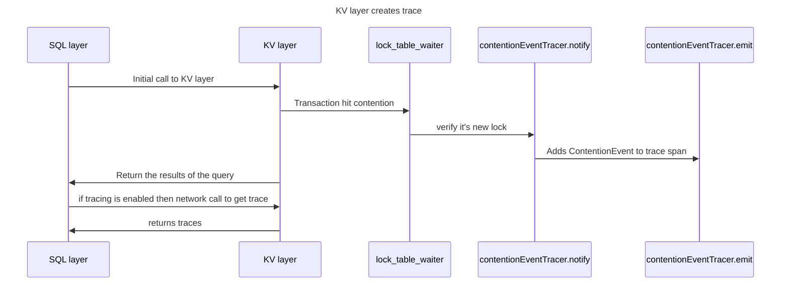
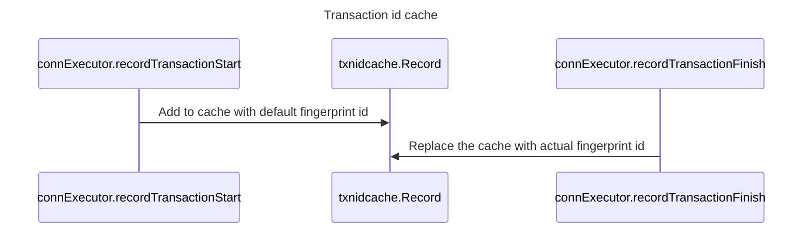
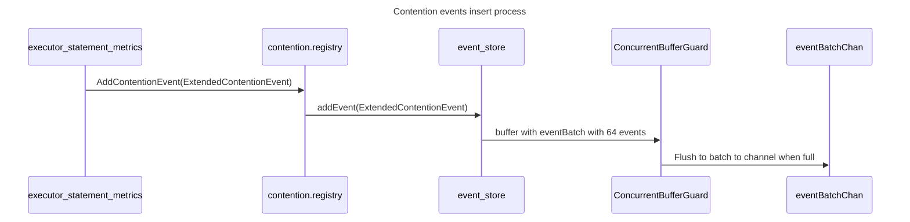
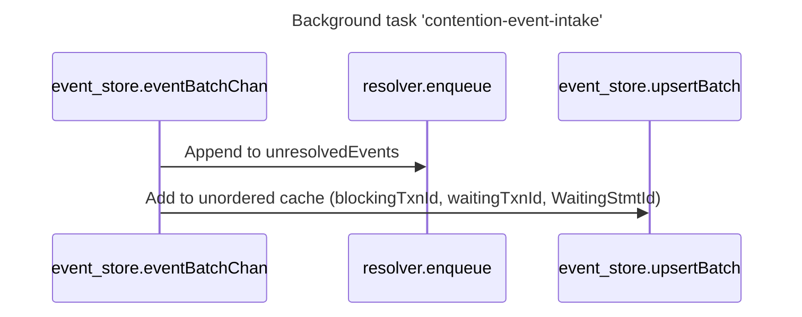
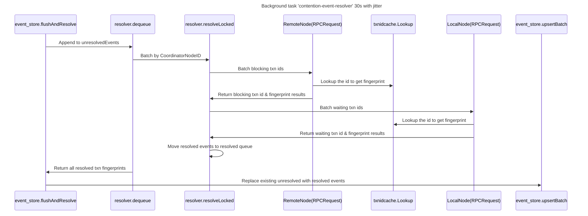

# Contention overview

## Code:

- sql/contention
- kv/kvserver/concurrency/

## Three main components

- TxnIdCache
- EventStore
- Resolver

## Configs:

1. sql.contention.event_store.resolution_interval: 30 sec
1. sql.contention.event_store.duration_threshold: default 0;

## Workflow

 
 
 
 
 

 
 
 
 
 

 
 
 
 
 

 
 
 
 
 

