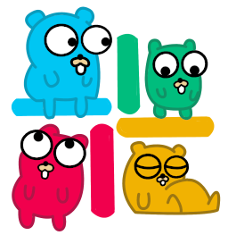

Slack API in Go [](https://pkg.go.dev/github.com/slack-go/slack)
===============

This is the original Slack library for Go created by Norberto Lopes, transferred to a Github organization.

[](https://gitter.im/go-slack/Lobby?utm_source=badge&utm_medium=badge&utm_campaign=pr-badge&utm_content=badge)



This library supports most if not all of the `api.slack.com` REST
calls, as well as the Real-Time Messaging protocol over websocket, in
a fully managed way.

## Project Status
There is currently no major version released.
Therefore, minor version releases may include backward incompatible changes.

See [CHANGELOG.md](https://github.com/slack-go/slack/blob/master/CHANGELOG.md) or [Releases](https://github.com/slack-go/slack/releases) for more information about the changes.

## Installing

### *go get*

    $ go get -u github.com/slack-go/slack

## Example

### Getting all groups

```golang
import (
	"fmt"

	"github.com/slack-go/slack"
)

func main() {
	api := slack.New("YOUR_TOKEN_HERE")
	// If you set debugging, it will log all requests to the console
	// Useful when encountering issues
	// slack.New("YOUR_TOKEN_HERE", slack.OptionDebug(true))
	groups, err := api.GetUserGroups(false)
	if err != nil {
		fmt.Printf("%s\n", err)
		return
	}
	for _, group := range groups {
		fmt.Printf("ID: %s, Name: %s\n", group.ID, group.Name)
	}
}
```

### Getting User Information

```golang
import (
    "fmt"

    "github.com/slack-go/slack"
)

func main() {
    api := slack.New("YOUR_TOKEN_HERE")
    user, err := api.GetUserInfo("U023BECGF")
    if err != nil {
	    fmt.Printf("%s\n", err)
	    return
    }
    fmt.Printf("ID: %s, Fullname: %s, Email: %s\n", user.ID, user.Profile.RealName, user.Profile.Email)
}
```

## Minimal RTM usage:

See https://github.com/slack-go/slack/blob/master/examples/websocket/websocket.go


## Minimal EventsAPI usage:

See https://github.com/slack-go/slack/blob/master/examples/eventsapi/events.go


## Contributing

You are more than welcome to contribute to this project.  Fork and
make a Pull Request, or create an Issue if you see any problem.

Before making any Pull Request please run the following:

```
make pr-prep
```

This will check/update code formatting, linting and then run all tests

## License

BSD 2 Clause license
